Regulon analysis of bulk data
================
German Novakovskiy
September 26, 2018

I analyze here bulk rna-seq data from [GSE109658](https://www.ncbi.nlm.nih.gov/pubmed/29427839), since authors have both bulk and single cell RNA-seq data, plus for differentiation they used classical protocol, which Francis is using: CHIR + Activin A for the first day, Activin A only for next 3 days.

Making gmt file (all relations)
-------------------------------

``` r
#making gmt file
source <- read.table("human.source", sep = "\t", stringsAsFactors = F)
colnames(source) <- c("Regulator", "RegId", "Target", "TargId")

#remove all miRNA and related terms
source <- source %>% filter(!startsWith(Regulator, "hsa-")) %>%
  filter(!startsWith(Target, "hsa-")) 

uniqRegul <- unique(source$Regulator) #1412 regulators

regulatorList <- sapply(uniqRegul, function(x) {
  res <- source %>% filter(Regulator %in% x)
  res <- res$Target
  return(res)
})

lenRegul <- lapply(regulatorList, length)
df <- data.frame(unlist(lenRegul))
colnames(df) <- c("Size of regulon")

hist(df$`Size of regulon`, breaks = 50, col = "red", main = "Regulon sizes distribution")
```

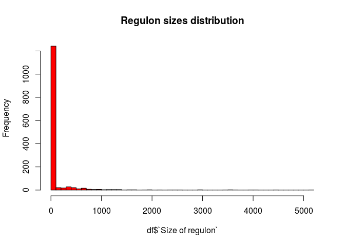

Delete those regulons that have higher than 300 and less than 5 (SOX17 has this number of targets) targets:

``` r
goodRegulons <- df %>% 
  rownames_to_column("Regulators") %>%
  filter(`Size of regulon` <= 300 & `Size of regulon` >= 5)

goodRegulons <- goodRegulons$Regulators
regulatorList <- regulatorList[goodRegulons]
```

``` r
#write to gmt file
output <- lapply(seq_along(regulatorList), function(mylist, n, i) {
  #print(n[[i]], mylist[[i]])
  lineToWrite <- c(n[[i]], n[[i]], mylist[[i]])
  lineToWrite <- paste(lineToWrite, collapse = "\t")
  write(lineToWrite, "RegNetwork.gmt", sep="\n", append= T)}, mylist = regulatorList, n = names(regulatorList))
```

Making STRONG RELATIONS gmt file
--------------------------------

``` r
#making gmt file
source_strong <- read.table("strong_relations.csv", sep = ",", stringsAsFactors = F, header = TRUE)
source_strong <- source_strong[,1:4]
colnames(source_strong) <- c("Regulator", "RegId", "Target", "TargId")

#remove all miRNA and related terms
source_strong <- source_strong %>% filter(!startsWith(Regulator, "hsa-")) %>%
  filter(!startsWith(Target, "hsa-")) 

uniqRegul_strong <- unique(source_strong$Regulator) #302 regulators

regulatorList_strong <- sapply(uniqRegul_strong, function(x) {
  res <- source_strong %>% filter(Regulator %in% x)
  res <- res$Target
  return(res)
})

lenRegul_strong <- lapply(regulatorList_strong, length)
df_strong <- data.frame(unlist(lenRegul_strong))
colnames(df_strong) <- c("Size of regulon")

hist(df_strong$`Size of regulon`, breaks = 50, col = "red", main = "Strong regulon sizes distribution")
```

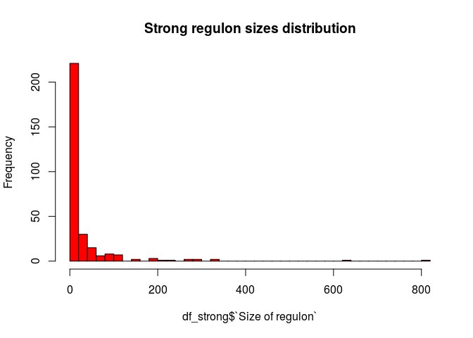

Delete those regulons that have higher than 300 and less than 5 (SOX17 has this number of targets) targets:

``` r
goodRegulons_strong <- df_strong %>% 
  rownames_to_column("Regulators") %>%
  filter(`Size of regulon` <= 300 & `Size of regulon` >= 5)

goodRegulons_strong <- goodRegulons_strong$Regulators
regulatorList_strong <- regulatorList_strong[goodRegulons_strong]
```

``` r
#write to gmt file
output <- lapply(seq_along(regulatorList_strong), function(mylist, n, i) {
  #print(n[[i]], mylist[[i]])
  lineToWrite <- c(n[[i]], n[[i]], mylist[[i]])
  lineToWrite <- paste(lineToWrite, collapse = "\t")
  write(lineToWrite, "RegNetworkStrong.gmt", sep="\n", append= T)}, mylist = regulatorList_strong, 
  n = names(regulatorList_strong))
```

Making STRONG+INTERMEDIATE RELATIONS gmt file
---------------------------------------------

``` r
#making gmt file
source_interm <- read.table("intermidiate_relations.csv", sep = ",", stringsAsFactors = F, header = TRUE)
source_interm <- source_interm[,1:4]
colnames(source_interm) <- c("Regulator", "RegId", "Target", "TargId")

#remove all miRNA and related terms
source_interm <- source_interm %>% filter(!startsWith(Regulator, "hsa-")) %>%
  filter(!startsWith(Target, "hsa-")) 

source_int_str <- rbind(source_interm, source_strong)

uniqRegul_int_str <- unique(source_int_str$Regulator) #302 regulators

regulatorList_int_str <- sapply(uniqRegul_int_str, function(x) {
  res <- source_int_str %>% filter(Regulator %in% x)
  res <- res$Target
  return(res)
})

lenRegul_int_str <- lapply(regulatorList_int_str, length)
df_int_str <- data.frame(unlist(lenRegul_int_str))
colnames(df_int_str) <- c("Size of regulon")
```

Delete those regulons that have higher than 300 and less than 5 (SOX17 has this number of targets) targets:

``` r
goodRegulons_int_str <- df_int_str %>% 
  rownames_to_column("Regulators") %>%
  filter(`Size of regulon` <= 300 & `Size of regulon` >= 5)

goodRegulons_int_str <- goodRegulons_int_str$Regulators
regulatorList_int_str <- regulatorList_int_str[goodRegulons_int_str]
```

``` r
#write to gmt file
output <- lapply(seq_along(regulatorList_int_str), function(mylist, n, i) {
  #print(n[[i]], mylist[[i]])
  lineToWrite <- c(n[[i]], n[[i]], mylist[[i]])
  lineToWrite <- paste(lineToWrite, collapse = "\t")
  write(lineToWrite, "RegNetworkStrongInterm.gmt", sep="\n", append= T)}, mylist = regulatorList_int_str, 
  n = names(regulatorList_int_str))
```

GSE109658 analysis
------------------

``` r
#load data
load("genesReferenceAll109658.Rdata")

head(genesReferenceAll109658) %>% kable()
```

|         |        age1|       age2|       age3|       age4|   AveExpr|         F|  P.Value|  adj.P.Val|
|---------|-----------:|----------:|----------:|----------:|---------:|---------:|--------:|----------:|
| WLS     |   6.1571828|  5.4467597|   6.805653|   6.516483|  7.402788|  190.4518|        0|          0|
| COL5A2  |   1.2559318|  5.8438621|   6.865500|   7.012817|  9.520181|  181.6272|        0|          0|
| PCSK1   |   6.0628872|  1.2873017|  -2.025001|  -2.876695|  1.434500|  132.8331|        0|          0|
| CDH2    |   3.1419424|  3.7094277|   3.976516|   3.882344|  9.520534|  132.1470|        0|          0|
| S100A16 |  -0.7865683|  0.8048405|   3.685488|   5.049694|  3.769794|  130.5807|        0|          0|
| MYOF    |   0.0885145|  3.3840300|   4.330093|   5.026967|  4.889323|  128.8164|        0|          0|

### Continue the analysis (all)

Perform GSEA for RNA-seq data using RegNetwork gmt file:

``` r
#reading gmt file
set.seed(42)
pathwaysReg <- gmtPathways("~/ESC_RNA_seq/Regulon/Bulk/RegNetwork.gmt")

#without putting into function, for implicity
#for the first day
geneVector <- genesReferenceAll109658$age1
names(geneVector) <- rownames(genesReferenceAll109658)
fgseaReg1 <- fgsea(pathwaysReg, geneVector, minSize=5, maxSize=300, nperm=10000)
reg1 <- fgseaReg1 %>% filter(padj < 0.05) %>% nrow()

#for the second day
geneVector <- genesReferenceAll109658$age2
names(geneVector) <- rownames(genesReferenceAll109658)
fgseaReg2 <- fgsea(pathwaysReg, geneVector, minSize=5, maxSize=300, nperm=10000)
reg2 <- fgseaReg2 %>% filter(padj < 0.05) %>% nrow()

#for the third day
geneVector <- genesReferenceAll109658$age3
names(geneVector) <- rownames(genesReferenceAll109658)
fgseaReg3 <- fgsea(pathwaysReg, geneVector, minSize=5, maxSize=300, nperm=10000)
reg3 <- fgseaReg3 %>% filter(padj < 0.05) %>% nrow()

#for the fourth day
geneVector <- genesReferenceAll109658$age4
names(geneVector) <- rownames(genesReferenceAll109658)
fgseaReg4 <- fgsea(pathwaysReg, geneVector, minSize=5, maxSize=300, nperm=10000)
reg4 <- fgseaReg4 %>% filter(padj < 0.05) %>% nrow()

gseaData <- list(fgseaReg1, fgseaReg2, fgseaReg3, fgseaReg4)
print(c(reg1, reg2, reg3, reg4))
```

    ## [1]  0  5 11 10

TF's that are active at second day, compared to 0 day:

``` r
x <- fgseaReg2 %>% filter(padj < 0.05) 
x
```

    ##   pathway         pval       padj        ES      NES nMoreExtreme size
    ## 1   SMAD3 0.0001272912 0.04346991 0.4571970 1.697738            0  225
    ## 2    GLI2 0.0003201024 0.04346991 0.6464267 1.902941            1   43
    ## 3     SRY 0.0001323101 0.04346991 0.4815266 1.748044            0  181
    ## 4    GLI3 0.0003122073 0.04346991 0.6287813 1.901500            1   49
    ## 5    GLI1 0.0003198465 0.04346991 0.6297044 1.862051            1   44
    ##                                                                                                                                                                                                                                                                                                                                                                                       leadingEdge
    ## 1 GSC, PITX2, SMAD6, SMAD6, CDKN2B, DACH1, PTHLH, ANKRD1, ZEB2, ZEB1, VIM, NOL3, TNC, COL6A1, GADD45B, TGFB1, TGFB1, MECOM, HNF4A, HNF4A, SVEP1, CCL2, LEF1, LEF1, TGFB3, ETS1, CYP11A1, MMP9, PLAGL1, ST6GALNAC2, RASL12, ZBTB16, COL3A1, AKT1, SMAD7, NCOA6, DAB2, SMAD3, RBL2, PEX6, PEX6, NR3C1, AXIN2, SERPINE1, COL7A1, ZFYVE16, TNNC1, JUN, JUN, KAT2B, PRKAR2A, ACVR1, ZNF83, SMAD9, JUND
    ## 2                                                                                                                                                                                                                                                                                                                    WNT8A, WNT3, WNT4, BMP2, WNT6, WNT11, WNT9B, BMP4, BMP5, PTCH2, WNT2B, WNT5A
    ## 3  CER1, HLX, HOXB2, IRX3, GREM2, FLJ31485, STMN2, CCDC92, LOC100507582, ZEB2, MRC2, ZEB1, HOTAIRM1, HOXD-AS1, WIPF1, GATA2, MECOM, CDH2, ODZ4, SYNPO, CLDN18, TGFB3, SOX6, NDST4, ZNF436, TBX6, HAND2, LOC100506451, CDNF, FN1, PDE4D, TNFRSF19, OPCML, CADM1, IL1RAPL1, CDKN1B, MTUS1, WBP5, MXI1, ALAD, SMAD3, RORA, KLF7, CDK6, ANGPT1, ESRRG, PDE8A, MAP3K3, ACRC, ZNF710, LAMB1, NEK6, ENO3
    ## 4                                                                                                                                                                                                                                                                                  WNT8A, WNT3, WNT4, BMP2, WNT6, WNT11, WNT9B, BMP4, BMP5, PTCH2, WNT2B, TWIST1, WNT5A, SUFU, ZIC3, SMAD3, WNT3A
    ## 5                                                                                                                                                                                                                                                                                                                    WNT8A, WNT3, WNT4, BMP2, WNT6, WNT11, WNT9B, BMP4, BMP5, PTCH2, WNT2B, WNT5A

TF's that are active at third day, compared to 0 day:

``` r
y <- fgseaReg3 %>% filter(padj < 0.05) 
y
```

    ##    pathway         pval       padj        ES      NES nMoreExtreme size
    ## 1    SMAD3 0.0002310536 0.02415339 0.4337076 1.655643            1  225
    ## 2    SMAD1 0.0002490040 0.02415339 0.4865056 1.764263            1  135
    ## 3     LEF1 0.0007081150 0.04371001 0.5687417 1.813958            4   55
    ## 4     GLI2 0.0001456452 0.02415339 0.6664644 2.032423            0   43
    ## 5     ETS1 0.0003663004 0.03108974 0.4611063 1.695416            2  155
    ## 6      SRY 0.0001195886 0.02415339 0.4899691 1.831247            0  181
    ## 7     RARA 0.0005051143 0.03810807 0.4680964 1.680466            3  123
    ## 8     GLI3 0.0001436988 0.02415339 0.6554680 2.045777            0   49
    ## 9     GLI1 0.0001454334 0.02415339 0.6564449 2.010619            0   44
    ## 10   FOXL1 0.0006110229 0.04148845 0.4584293 1.684784            4  154
    ## 11  CREBBP 0.0002352388 0.02415339 0.4438120 1.674762            1  200
    ##                                                                                                                                                                                                                                                                                                                                                                                                                                                                                                                                                 leadingEdge
    ## 1  ANKRD1, GSC, SMAD6, SMAD6, PITX2, DACH1, HNF4A, HNF4A, CDKN2B, ZEB2, GADD45B, TNC, NOL3, COL6A1, VIM, TGFB1, TGFB1, ZEB1, TGFB3, LEF1, LEF1, ST6GALNAC2, MMP9, SVEP1, ZBTB16, PLAGL1, PTHLH, TNNC1, CYP11A1, JUN, JUN, ETS1, SMAD3, MECOM, RASL12, JUND, VEGFA, SMAD7, GTF2IRD1, NCOA6, COL3A1, CCL2, ACVR1, FSTL3, KAT2B, AKT1, MLL4, AXIN2, GGA1, ATF3, DVL1, SMURF1, RUNX3, FOXH1, PEX6, PEX6, ZNF83, MYO5B, NR3C1, CEBPB, COL7A1, ZFP36, MBD1, DOK1, SERPINE1, ZFYVE16, MAPK8, CFDP1, RANBP9, EIF4ENIF1, EIF4ENIF1, MED15, FLNA, TGFB2, PARD3, SMAD2
    ## 2                                                                                                                                                                                                                                                                                                                                                ANKRD1, GSC, SMAD6, SMAD6, SOX5, NKX2-5, ARL4D, CDKN2B, ZEB2, ZEB2, GDF6, BTG2, ZEB1, LEF1, GDF15, EHHADH, ID2, ZNF521, RAC2, ID1, BAMBI, SMAD3, TNFRSF11B, PLEKHB1, RASL12, COL4A1, SMAD7, COL3A1, INPP4A
    ## 3                                                                                                                                                                                                                                                                                                                                                                                                                                                   SOX17, PITX2, CLDN2, NOL3, CD1D, MITF, MITF, VIM, LEF1, NCAM1, MARK4, JUN, EDA, SMAD3, NRCAM, ADA, DLL1
    ## 4                                                                                                                                                                                                                                                                                                                                                                                                                                                                        WNT8A, WNT4, WNT3, BMP5, WNT9B, WNT11, BMP2, BMP4, WNT6, HHIP, FOXA2, PTCH2, MTSS1
    ## 5                                                                                                                                                                                                                                                                         CSF3R, MEIS1, ANGPT2, ANPEP, GATA3, RUNX1, VWF, TFAP2A, BMP4, NRP1, TNC, NOL3, ITGA5, VCAM1, CAMK2A, MMP9, ITGA4, TBXAS1, PLAU, PTHLH, TNNC1, NELL1, GRPR, JUN, ICAM4, SRC, ETS1, ETS1, SMAD3, KIT, CDH13, CTSB, NOS3, PGF, PTGS2, MYB, PDGFRB, ETS2, ETS2, VEGFA, CDKN1B, ITGA2B
    ## 6                                                                                                                         HOXB2, CER1, HLX, STMN2, GREM2, IRX3, MRC2, CCDC92, FLJ31485, GATA2, HOXD-AS1, ZEB2, TNFRSF19, HAND2, CLDN18, ZEB1, TGFB3, CDH2, PDE4D, TBX6, WIPF1, NDST4, IL1RAPL1, SOX6, ESRRG, ODZ4, SYNPO, FN1, ZNF436, OPCML, LOC100507582, MTUS1, SMAD3, C1QTNF1, ENO3, MECOM, LOC100506451, HSPG2, CDKN1B, MXI1, DLL1, HOXA2, TRPC4, ZNF710, ALAD, RORA, PDE8A, ZNF608, HOTAIRM1, ITPKB, CDK6, GRIK3, SLC9A3R2, ACRC, KLF7, EFTUD1, MEX3A
    ## 7                                                                                                                                                                                                                                                                        HNF1B, HOXB4, RXRG, CYP26A1, HNF4A, GATA2, GADD45B, IL6, SMPD1, KLF5, KLF5, TGFB1, GADD45G, GADD45G, ZBTB16, HOXA1, PLAU, PPARG, PTHLH, GADD45A, JUN, ETS1, ANGPTL4, CDH13, STRA6, KRT19, CRABP2, VEGFA, NCOA6, RXRA, PNRC1, RARA, NCOA1, NCOA1, ICAM1, KAT2B, ELF4, TCF7, HSD17B1
    ## 8                                                                                                                                                                                                                                                                                                                                                                                                                                                         WNT8A, WNT4, WNT3, BMP5, WNT9B, WNT11, BMP2, BMP4, WNT6, TWIST1, HHIP, FOXA2, PTCH2, SMAD3, MTSS1
    ## 9                                                                                                                                                                                                                                                                                                                                                                                                                                                                        WNT8A, WNT4, WNT3, BMP5, WNT9B, WNT11, BMP2, BMP4, WNT6, HHIP, FOXA2, PTCH2, MTSS1
    ## 10                                                                                                                                                                                     MEIS1, HOXB9, ARHGAP24, COL13A1, NTN1, PLXNA2, HOXB4, RXRG, NKX2-5, LRIG3, SLITRK2, TSPAN8, BHLHE40, FST, SEMA3C, C1orf168, ELMO1, PSTPIP2, LOC284276, STX19, MST1P9, RASGRP1, FN1, BMPR2, RGS6, PAX7, ZFHX3, MAML3, ADAMTS3, LOC400604, GNAL, ANXA1, ARID5B, WNT2B, SLC35D2, ZNF438, SLC4A2, PRICKLE3, CNNM4, BAI3, AGER, PTPN6, AHDC1, ITPKB, CMTM5, PCDHB6, LPHN3
    ## 11                                                                                                                                                                       HOXB6, HOXB3, HOXB2, HOXB9, HOXB7, WT1, CRX, MSX1, HNF1B, HOXB4, RXRG, DACH1, HNF4A, CDKN2B, BCL3, MITF, KLF5, CEBPA, CDH2, LEF1, NFATC2, JUN, STAT4, ETS1, PROX1, SMAD3, NFE2, NFIC, SERTAD2, MECOM, MYB, ETS2, CDX2, JDP2, NCOA6, CREB3L2, CREB3L1, THRA, TRIP10, SERTAD3, NFE2L2, CITED2, ACVR1, MAFG, HOXB1, STAT5A, NCOA1, ZBTB17, KAT2B, HIPK2, NFATC4, MGMT, TCF7, CALCOCO1

TF's that are active at fourth day, compared to 0 day:

``` r
z <- fgseaReg4 %>% filter(padj < 0.05) 
z
```

    ##    pathway         pval       padj         ES       NES nMoreExtreme size
    ## 1    SMAD3 0.0005484260 0.04173966  0.4250810  1.585078            4  225
    ## 2    SMAD1 0.0002356823 0.03512311  0.4785509  1.701287            1  135
    ## 3    PPARA 0.0002479236 0.03512311  0.5142601  1.750945            1   94
    ## 4     GLI2 0.0002768933 0.03512311  0.6149190  1.860544            1   43
    ## 5      SRY 0.0001121957 0.03512311  0.4772991  1.750402            0  181
    ## 6     6256 0.0004509583 0.04173966  0.4354951  1.591569            3  175
    ## 7     GLI3 0.0002732987 0.03512311  0.5985878  1.844308            1   49
    ## 8     GLI1 0.0005532503 0.04173966  0.6021902  1.825687            3   44
    ## 9    FOXL1 0.0006888634 0.04677382  0.4402052  1.589165            5  154
    ## 10    MCM3 0.0003103662 0.03512311 -0.6190514 -1.958696            0   27
    ##                                                                                                                                                                                                                                                                                                                                                                                                                                                          leadingEdge
    ## 1  GSC, HNF4A, HNF4A, ANKRD1, PITX2, SMAD6, SMAD6, CDKN2B, DACH1, NOL3, TNC, ST6GALNAC2, TNNC1, MMP9, COL6A1, VIM, GADD45B, SVEP1, ZEB2, TGFB1, TGFB1, PLAGL1, ZEB1, TGFB3, CCL2, COL3A1, CYP11A1, ZBTB16, LEF1, LEF1, RASL12, JUN, JUN, AKT1, ETS1, JUND, SMAD3, NCOA6, FOXG1, VEGFA, FSTL3, KAT2B, GTF2IRD1, SMAD7, GGA1, AXIN2, CDKN1A, DVL1, SERPINE1, MECOM, JUNB, TGFB2, SMURF1, COL7A1, DOK1, MLL4, STUB1, FLNA, MYO5B, ACVR1, PEX6, PEX6, MBD1, ZNF83, CFDP1
    ## 2                                                                                                                                                                        GSC, ANKRD1, SMAD6, SMAD6, CDKN2B, NKX2-5, ARL4D, GDF6, SOX5, BTG2, ZEB2, ZEB2, TNFRSF11B, EHHADH, ZEB1, GDF15, COL3A1, COL4A1, PLEKHB1, LEF1, BAMBI, ZNF521, RASL12, ID1, SMAD3, ID2, RAC2, FOXG1, PIGQ, INPP4A, KAT2B, SMAD7, CDKN1A, SERPINE1, BTBD2, SMURF1, BMPR1B, HIPK2, STUB1, FLNA
    ## 3                                                                                                                                                                                                                                RXRG, APOA2, APOA1, GATA3, SCD5, NOL3, MMP9, ACOX3, GADD45B, GADD45B, TGFB1, NFKBIA, ANGPTL4, EHHADH, UCP1, LEPR, GADD45A, GADD45A, PRIC285, GADD45G, GADD45G, SLC27A1, PPARA, AKT1, UCP3, CITED2, AIP, RXRA, VEGFA, AKAP13, SEMA6B
    ## 4                                                                                                                                                                                                                                                                                                                                                                                              BMP5, WNT3, WNT4, WNT9B, WNT11, BMP2, WNT8A, BMP4, FOXA2, HHIP, PTCH2
    ## 5                                                          GREM2, HLX, HOXB2, STMN2, CER1, CCDC92, IRX3, MRC2, NDST4, CLDN18, TNFRSF19, HOXD-AS1, GATA2, SOX6, FLJ31485, CDH2, ZEB2, WIPF1, PDE4D, FN1, HAND2, ZEB1, TGFB3, ENO3, HSPG2, SYNPO, ZNF436, MTUS1, ODZ4, LOC100507582, C1QTNF1, LOC100506451, TBX6, OPCML, MXI1, ALAD, SGIP1, CDKN1B, SLC9A3R2, SMAD3, ESRRG, GRIK3, RORA, FOXG1, TRPC4, CDNF, YPEL1, DLL1, ITPKB, IL1RAPL1, LAMB1, CPNE1, ZNF710, FGF20
    ## 6                                                                                                     HP, CSF3R, VTN, CKM, MNX1, SGK2, SEMA3B, OSGIN1, KDM6B, MST1P2, PDZK1, LOC440925, SUN2, MIXL1, VAMP5, HAAO, RAB37, C3, GABRB2, BCAR3, ABCC2, MGST2, RRAS, ZNF436, SLC16A5, BZRAP1, LAMB2, IL13RA1, LOC595101, NEAT1, GALT, BCL2L2, C10orf10, GPR108, FBXO17, SETD8, TCEA2, TET2, SSBP4, TLCD2, ARSF, STAT2, ACADVL, SERPINE1, APOC1P1, GANAB, ECH1, MEX3A, CSK
    ## 7                                                                                                                                                                                                                                                                                                                     BMP5, WNT3, WNT4, WNT9B, WNT11, BMP2, WNT8A, BMP4, FOXA2, HHIP, PTCH2, TWIST1, MTSS1, SMAD3, BMP7, BMP8A, SUFU, WNT6, ZIC3, WNT5B, PVR, CSNK1E
    ## 8                                                                                                                                                                                                                                                                                                                                                                                              BMP5, WNT3, WNT4, WNT9B, WNT11, BMP2, WNT8A, BMP4, FOXA2, HHIP, PTCH2
    ## 9                                                                                                                                                         RXRG, HOXB9, MEIS1, NTN1, HOXB4, ARHGAP24, PLXNA2, SLITRK2, COL13A1, NKX2-5, TSPAN8, FST, C1orf168, LRIG3, SEMA3C, ELMO1, RGS6, MST1P9, FN1, RASGRP1, BHLHE40, MAML3, PAX7, LOC400604, PSTPIP2, BMPR2, ZFHX3, STX19, PCDHB6, C10orf140, ADAMTS3, PTPN6, SLC35D2, SLC4A2, GNAL, AGER, ARID5B, COL2A1, ITPKB
    ## 10                                                                                                                                                                                                                                                                                                                                                           CDC45, HAUS1, ORC3, MCM7, MCM6, SUPT16H, PPP2R1B, ORC1, ORC4, MCM10, CDC7, MCM5, MCM2, DBF4, CDC6, MCM4

Plotting activity of transcription factors:

``` r
tfs <- unique(c(x$pathway, y$pathway, z$pathway))

tfs <- c("BRCA1", tfs)

calculateActivity <- function(tf, gseaResults){
  
  res <- sapply(gseaResults, function(x, tfName){
    p_val <- x %>% filter(pathway == tfName) %>% dplyr::select(padj)
    nes <- x %>% filter(pathway == tfName) %>% dplyr::select(NES)
    val <- sign(nes)*(-1)*log(p_val)
    return(val)}, 
    tfName = tf)
  
  names(res) <- rep(tf, length(res))
  res <- unlist(res)
  return(res)
  #df <- data.frame(TF = rep(tf, length(res)), Activity = res, Days = c(1,2,3,4))
}

activities <- sapply(tfs, calculateActivity, gseaResults = gseaData)
#rownames(activities) <- NULL
activities <- as.data.frame(t(activities))
colnames(activities) <- c(1, 2, 3, 4)
activities <- activities %>% rownames_to_column("TF")
activities <- melt(activities)
```

    ## Using TF as id variables

``` r
colnames(activities) <- c("TF", "Day", "Activity")
activities$Day <- as.numeric(activities$Day)
#activities <- activities %>% filter(TF == "SMAD3")
```

``` r
#BRCA1 - random TF, an outlier, just to show the contrast
ggplot(data = activities, aes(x = Day, y = Activity, colour = TF))+
  geom_line(size = 2) +
  geom_hline(yintercept = 0) +
  ggtitle("TF activities")
```

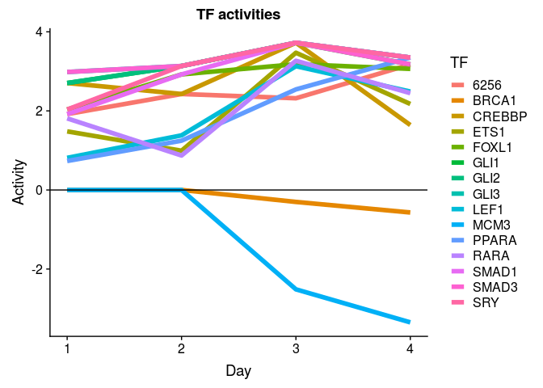

Two transcription factors - SRY, SMAD3 - are active on day second (beginning of DE differentiation):

``` r
#SMAD3
ggplot(data = activities %>% filter(TF == "SMAD3"), aes(x = Day, y = Activity))+
  geom_line(size = 2, colour = "red")+
  ggtitle("SMAD3 activity")
```

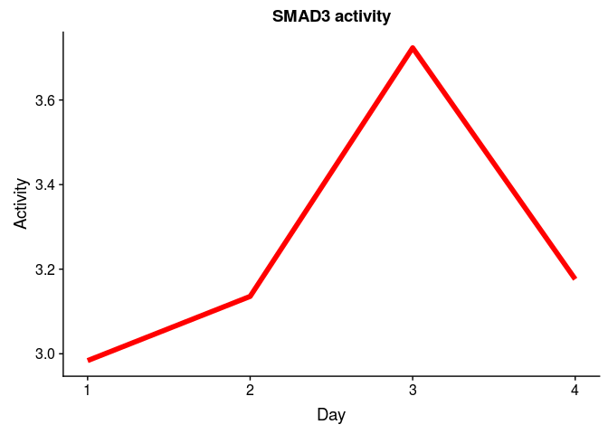

``` r
#SRY
ggplot(data = activities %>% filter(TF == "SRY"), aes(x = Day, y = Activity))+
  geom_line(size = 2, colour = "blue")+
  ggtitle("SRY activity")
```

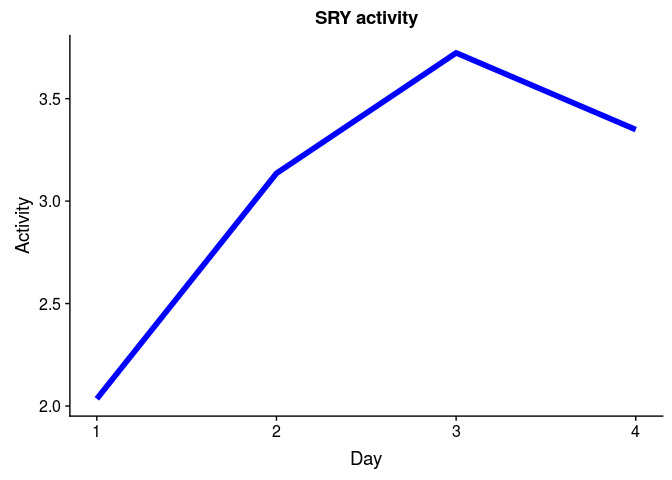

These two and also SMAD1 and PPARA are the most active, peak is at day 3.

Information about these transcription factors (and relevance to DE):

1.  SMAD3 - one of the key players in DE differentiation through TGF-beta; Wiki pathways: TGF-beta Receptor Signaling, TGF-B Signaling in Thyroid Cells for Epithelial-Mesenchymal Transition, Role of Osx and miRNAs in tooth development, AGE/RAGE pathway, TGF-beta Signaling Pathway, Mesodermal Commitment Pathway, Factors and pathways affecting insulin-like growth factor (IGF1)-Akt signaling, Endoderm Differentiation, Cell Cycle, Canonical and Non-Canonical TGF-B signaling, LncRNA involvement in canonical Wnt signaling and colorectal cancer; KEGG pathways: cell cycle, wnt signal pathway, tgf-beta pathway.
2.  SRY - sex determination factor, maybe we see it here because of batch effects (sex)?
3.  GLI1 - Kegg: hedgehog signaling pathway, Wiki: Hedgehog Signaling Pathway
4.  GLI2 - Kegg: also hedgehog; Wiki: hedgehog and DE differentiation
5.  GLI3 - Kegg: also hedgehog; Wiki: hedgehog and ectoderm differentiation
6.  SMAD1 - Kegg: tgf-beta; Wiki: tgf-beta, BMP signaling, ESC pluripotency pathways, Mesodermal commitment, heart development.
7.  LEF1 - Kegg: wnt-signaling; Wiki: tgf-beta, wnt, mesodermal differentiation, endoderm differentiation. Reactome: Formation of the beta-catenin:TCF transactivating complex
8.  ETS1 - Kegg: dorso-ventral axis formation; Wiki - VEGFA-VEGFR2 Signaling Pathway, tgf-beta as well. Reactome: ERK/MAPK targets, RUNX2/RUNX3 regulation.
9.  RARA - Wiki: wnt; Reactome: Pten regulation
10. FOXL1 - Wiki: VEGFA-VEGFR2 Signaling Pathway, tgf-beta, wnt, mesodermal and DE differentiation.
11. CREBBP - Kegg: cell cycle, wnt signal, notch, tgf-beta, jak\_stat; Wiki: tgf-beta, wnt, notch signaling, IL-6 signaling, tnf alpha; Reactome - Activation of the TFAP2 (AP-2) family of transcription factors, RUNX1 regulates transcription of genes involved in differentiation of myeloid cells.
12. MCM3 - Kegg: dna replication, cell cycle; Wiki: DNA replication, G1 to S cell cycle control, cell cycle.
13. PPARA - Kegg: Ppar signaling pathway, adipocytokine signaling pathway; Wiki: estrogne receptor pathway, adipogenesis, PPAR alpha pathway, PPAR signaling pathway, energy metabolism, Irinotecan Pathway, nuclear receptors. Reactome - regulation of lipid metabolism. (I guess, it more relates to mesoderm)
14. 6256 - RXRA - Kegg: PPAR signal pathway; Wiki: PI3K/AKT/mTOR, Transcription factor regulation in adipogenesis, NRF2 pathway, PPAR signaling pathway

### Continue the analysis (strong)

Perform GSEA for RNA-seq data using RegNetwork gmt file:

``` r
#reading gmt file
set.seed(42)
pathwaysReg <- gmtPathways("~/ESC_RNA_seq/Regulon/Bulk/RegNetworkStrong.gmt")

#without putting into function, for implicity
#for the first day
geneVector <- genesReferenceAll109658$age1
names(geneVector) <- rownames(genesReferenceAll109658)
fgseaReg1 <- fgsea(pathwaysReg, geneVector, minSize=5, maxSize=300, nperm=10000)
reg1 <- fgseaReg1 %>% filter(padj < 0.05) %>% nrow()

#for the second day
geneVector <- genesReferenceAll109658$age2
names(geneVector) <- rownames(genesReferenceAll109658)
fgseaReg2 <- fgsea(pathwaysReg, geneVector, minSize=5, maxSize=300, nperm=10000)
reg2 <- fgseaReg2 %>% filter(padj < 0.05) %>% nrow()

#for the third day
geneVector <- genesReferenceAll109658$age3
names(geneVector) <- rownames(genesReferenceAll109658)
fgseaReg3 <- fgsea(pathwaysReg, geneVector, minSize=5, maxSize=300, nperm=10000)
reg3 <- fgseaReg3 %>% filter(padj < 0.05) %>% nrow()

#for the fourth day
geneVector <- genesReferenceAll109658$age4
names(geneVector) <- rownames(genesReferenceAll109658)
fgseaReg4 <- fgsea(pathwaysReg, geneVector, minSize=5, maxSize=300, nperm=10000)
reg4 <- fgseaReg4 %>% filter(padj < 0.05) %>% nrow()

gseaData <- list(fgseaReg1, fgseaReg2, fgseaReg3, fgseaReg4)
print(c(reg1, reg2, reg3, reg4))
```

    ## [1]  5  9 15 14

TF's that are active at first day, compared to 0 day:

``` r
x <- fgseaReg1 %>% filter(padj < 0.05) 
x
```

    ##   pathway         pval       padj        ES      NES nMoreExtreme size
    ## 1    GLI1 0.0009232190 0.02880443 0.6329198 1.839657            5   43
    ## 2    GLI2 0.0003087849 0.01204261 0.6729062 1.939443            1   41
    ## 3    GLI3 0.0003087849 0.01204261 0.6645428 1.915338            1   41
    ## 4   SMAD3 0.0001441961 0.01152482 0.6500484 2.042030            0   67
    ## 5   SMAD4 0.0001477541 0.01152482 0.6399650 1.960486            0   57
    ##                                                                                                                                          leadingEdge
    ## 1                                              WNT8A, WNT3, WNT6, WNT3A, WNT5B, BMP2, PTCH2, WNT5A, BMP4, WNT11, WNT9B, BMP5, HHIP, BMP7, PRKX, SUFU
    ## 2                                              WNT8A, WNT3, WNT6, WNT3A, WNT5B, BMP2, PTCH2, WNT5A, BMP4, WNT11, WNT9B, BMP5, HHIP, BMP7, PRKX, SUFU
    ## 3                                              WNT8A, WNT3, WNT6, WNT3A, WNT5B, BMP2, PTCH2, WNT5A, BMP4, WNT11, WNT9B, BMP5, HHIP, BMP7, PRKX, SUFU
    ## 4 PITX2, CDKN2B, LEF1, PTHLH, NOL3, COL6A1, SMAD6, SMAD6, GADD45B, TGFB1, TGFB1, TGFB3, JUN, EDN1, ANKRD1, TNC, CDKN1A, ACVR1C, ACVR1C, COL7A1, MMP9
    ## 5     PITX2, CDKN2B, LEF1, PTHLH, TCF7, NKX2-5, DACH1, SMAD6, GADD45B, TGFB1, ID1, ID2, JUN, EDN1, FOXH1, TNC, PTGS2, CDKN1A, COL7A1, ETS1, BGN, IHH

TF's that are active at second day, compared to 0 day:

``` r
x <- fgseaReg2 %>% filter(padj < 0.05) 
x
```

    ##   pathway         pval        padj         ES       NES nMoreExtreme size
    ## 1     FOS 0.0004578755 0.010204082  0.5850463  1.776506            2   51
    ## 2    GLI1 0.0003137747 0.009789771  0.6300583  1.855688            1   43
    ## 3    GLI2 0.0001574555 0.006140765  0.6511300  1.903930            0   41
    ## 4    GLI3 0.0001574555 0.006140765  0.6561917  1.918731            0   41
    ## 5   NR3C2 0.0004526935 0.010204082 -0.8592975 -1.902711            1    9
    ## 6   SMAD1 0.0006384677 0.012450120  0.6330828  1.808189            3   36
    ## 7   SMAD2 0.0008119519 0.014073833  0.6454557  1.788483            4   31
    ## 8   SMAD3 0.0001481701 0.006140765  0.6558845  2.084992            0   67
    ## 9   SMAD4 0.0001514693 0.006140765  0.6396951  1.978542            0   57
    ##                                                                                                                                                                              leadingEdge
    ## 1                                                                                      NTS, ITGA5, NPPA, TGFB1, ETS1, CA2, MAPK10, MMP9, PTGS2, PENK, MAPK11, PGF, IL6, MMP2, SRR, VEGFB
    ## 2                                                                                                           WNT8A, WNT3, WNT4, BMP2, WNT6, WNT11, WNT9B, BMP4, BMP5, PTCH2, WNT2B, WNT5A
    ## 3                                                                                                           WNT8A, WNT3, WNT4, BMP2, WNT6, WNT11, WNT9B, BMP4, BMP5, PTCH2, WNT2B, WNT5A
    ## 4                                                                                                           WNT8A, WNT3, WNT4, BMP2, WNT6, WNT11, WNT9B, BMP4, BMP5, PTCH2, WNT2B, WNT5A
    ## 5                                                                                                                                                   ATP1A2, ATP1B2, SGK1, ATP1A3, SCNN1A
    ## 6                                                                             SMAD6, SMAD6, CDKN2B, ANKRD1, ZEB2, ZEB1, NKX2-5, EHHADH, TNFRSF11B, ID1, GDF15, COL3A1, ID2, BAMBI, SMAD7
    ## 7                                                                                                                   PITX2, SMAD6, CDKN2B, TNC, TGFB1, TGFB3, SMAD7, RBL2, ZFYVE16, ACVR1
    ## 8 PITX2, SMAD6, SMAD6, CDKN2B, PTHLH, ANKRD1, NOL3, TNC, COL6A1, GADD45B, TGFB1, TGFB1, HNF4A, CCL2, LEF1, TGFB3, MMP9, COL3A1, SMAD7, RBL2, PEX6, SERPINE1, COL7A1, ZFYVE16, TNNC1, JUN
    ## 9                        PITX2, SMAD6, CDKN2B, DACH1, PTHLH, TNC, GADD45B, NKX2-5, TGFB1, HNF4A, CCL2, LEF1, ETS1, PTGS2, ID1, ID2, TCF7, BGN, SMAD3, RBL2, SERPINE1, COL7A1, TNNC1, JUN

TF's that are active at third day, compared to 0 day:

``` r
y <- fgseaReg3 %>% filter(padj < 0.05) 
y
```

    ##    pathway         pval        padj         ES       NES nMoreExtreme size
    ## 1       AR 0.0007245502 0.012807251  0.4231442  1.571356            5  169
    ## 2    CEBPB 0.0029797378 0.035212681  0.5837169  1.737449           19   38
    ## 3     E2F4 0.0008658009 0.013506494 -0.3289108 -1.523528            0  265
    ## 4     ETS1 0.0024996875 0.032495938  0.4332049  1.564016           19  129
    ## 5     GLI1 0.0001459641 0.004588235  0.6588640  2.012126            0   43
    ## 6     GLI2 0.0001470588 0.004588235  0.6745210  2.042094            0   41
    ## 7     GLI3 0.0001470588 0.004588235  0.6706583  2.030399            0   41
    ## 8     LEF1 0.0007388799 0.012807251  0.6025978  1.813986            4   40
    ## 9      MYB 0.0022598870 0.032049307 -0.3402899 -1.486238            3  162
    ## 10    ORC2 0.0045630846 0.047456080 -0.8249836 -1.754681           19    7
    ## 11    PAX6 0.0031601124 0.035212681  0.8200866  1.707267           17    8
    ## 12    RARA 0.0002708192 0.006628707  0.5429945  1.811526            1   73
    ## 13   SMAD1 0.0002974420 0.006628707  0.6543320  1.933279            1   36
    ## 14   SMAD3 0.0001369863 0.004588235  0.6117384  2.012324            0   67
    ## 15   SMAD4 0.0001410835 0.004588235  0.6196455  1.987647            0   57
    ##                                                                                                                                                                                                                                                                                                                                                                                                                                                                                                                                                                                                                                                                           leadingEdge
    ## 1                                                                                                                                                                                                                                                                                        HNF1B, HOXB4, FGF8, CYP27A1, GATA3, CYP26A1, GADD45B, ACPP, IL6, NOL3, IL6ST, SMPD1, KLF5, TGFB1, NFKBIA, MMP9, GADD45G, HOXA1, PLAU, PPARG, PTHLH, FOXA1, GADD45A, JUN, ETS1, ECM1, ANGPTL4, SMAD3, DRD1, TNFRSF11B, ADAMTS3, CDH13, STRA6, KRT19, TRPS1, PTGS2, CRABP2, MYB, VEGFA, NCOA6, MAP4K2, PNRC1, RARA, APOA1, CITED2, SEMA6B, NCOA1, PKD1, ICAM1, UCP1, AKT1, ELF4, TCF7, HSD17B1
    ## 2                                                                                                                                                                                                                                                                                                                                                                                                                                                                                                                                                                                CSF3R, DLC1, IL6, HP, IGF2, TGFB1, ITGB2, GADD45G, F3, PPARG, FURIN, HPX, SMAD3, ABCC2, CDH13, PTGS2
    ## 3  CHEK1, RABIF, RPL23A, SKP1, DLEU1, RFC2, SUPT4H1, CKS1B, ITGB3BP, ORC1, KLF10, CDC45, NXT1, TMPO, SMC2, NAP1L4, RBL1, RBL1, E2F2, MRPL12, POLA2, SFPQ, HMMR, TTK, PPIA, E2F3, GPANK1, BRCA1, TOP1, HSPD1, METTL3, UMPS, TK1, PRIM2, RPA3, MED21, HNRNPD, POLR2D, RAD51, DBF4, HMGB3, MCM6, CSE1L, MTHFD1, COX7C, CALM1, INSIG1, SLC25A4, NCL, ZNF267, KLHL21, MSH2, ACTA1, TP53, HMGN2, POLR2F, FDFT1, BCL11A, CDC25A, POLE2, CKS2, MCM3, BUB3, MYC, TFAM, MAD2L1, H2AFZ, HMGB1, RFC3, FEN1, GINS1, CREG1, PPP1R3C, UNG, ABCA1, HPGD, SRSF8, GABRA5, MCM5, DUT, DHFR, TERT, DPP4, PCNA, PPP2R2B, HIST2H2BE, SPN, CDC6, XRCC2, PIM2, SLCO4A1, MYCN, APLN, ABCG1, PSMB8, DMRT1, HRH3
    ## 4                                                                                                                                                                                                                                                                                                                                                                                                                                                      CSF3R, ANGPT2, ANPEP, RUNX1, VWF, TFAP2A, BMP4, NRP1, TNC, NOL3, ITGA5, VCAM1, MMP9, ITGA4, TBXAS1, PLAU, PTHLH, TNNC1, NELL1, GRPR, ICAM4, ETS1, KIT, CDH13, CTSB, NOS3, PGF, PTGS2, MYB, PDGFRB, ETS2, VEGFA, CDKN1B, ITGA2B
    ## 5                                                                                                                                                                                                                                                                                                                                                                                                                                                                                                                                                                                                  WNT8A, WNT4, WNT3, BMP5, WNT9B, WNT11, BMP2, BMP4, WNT6, HHIP, FOXA2, PTCH2, MTSS1
    ## 6                                                                                                                                                                                                                                                                                                                                                                                                                                                                                                                                                                                                  WNT8A, WNT4, WNT3, BMP5, WNT9B, WNT11, BMP2, BMP4, WNT6, HHIP, FOXA2, PTCH2, MTSS1
    ## 7                                                                                                                                                                                                                                                                                                                                                                                                                                                                                                                                                                                                  WNT8A, WNT4, WNT3, BMP5, WNT9B, WNT11, BMP2, BMP4, WNT6, HHIP, FOXA2, PTCH2, MTSS1
    ## 8                                                                                                                                                                                                                                                                                                                                                                                                                                                                                                                                                                                                 SOX17, CLDN2, NOL3, CD1D, MITF, VIM, LEF1, NCAM1, MARK4, JUN, EDA, NRCAM, ADA, DLL1
    ## 9                                                                                                                                                                                                                                                     MYBBP1A, RBL1, EZH2, HSPA4, EIF2S1, EEF1B2, PARP1, POLA2, MCM7, HMMR, RPS10, PA2G4, TAF9, HSPD1, HAT1, TK1, CD4, GART, DEK, RAD51, PAICS, MRPL3, DKC1, BUB1B, NCL, NAE1, EMG1, SNRPE, NPM1, ABCE1, SNRPG, CDC7, RANBP1, UCHL1, ERBB2, BCLAF1, MCM3, EBNA1BP2, MYC, TFAM, SNRPF, MAD2L1, HMGB1, EPCAM, FAM216A, NOLC1, C1QBP, EXO1, CCNA1, NME1, CLU, PCNA, DHRS2, MAT2A, FAS, FGF2, TERF1, LCK, EGR1, VAV1, KCNMA1, HHLA1, SPIB
    ## 10                                                                                                                                                                                                                                                                                                                                                                                                                                                                                                                                                                                                                                           MCM7, MCM6, MCM3, MCM2, MCM5, MCM4, CDC6
    ## 11                                                                                                                                                                                                                                                                                                                                                                                                                                                                                                                                                                                                                                                   ITGA5, MITF, L1CAM, ETS1, MAP4K2
    ## 12                                                                                                                                                                                                                                                                                                                                                                                                                                                                HNF1B, HOXB4, CYP26A1, HNF4A, GADD45B, IL6, SMPD1, KLF5, TGFB1, GADD45G, HOXA1, PLAU, PPARG, PTHLH, GADD45A, JUN, ETS1, ANGPTL4, CDH13, STRA6, KRT19, CRABP2, VEGFA, PNRC1, RARA, NCOA1, ICAM1, ELF4, TCF7, HSD17B1
    ## 13                                                                                                                                                                                                                                                                                                                                                                                                                                                                                                                                                                         ANKRD1, SMAD6, SMAD6, NKX2-5, CDKN2B, ZEB2, ZEB1, GDF15, EHHADH, ID2, ID1, BAMBI, TNFRSF11B, SMAD7, COL3A1
    ## 14                                                                                                                                                                                                                                                                                                                                                                                                                                                                                                               ANKRD1, SMAD6, SMAD6, PITX2, HNF4A, CDKN2B, GADD45B, TNC, NOL3, COL6A1, TGFB1, TGFB1, TGFB3, LEF1, MMP9, PTHLH, TNNC1, JUN, VEGFA, SMAD7, COL3A1, CCL2, ACVR1, FSTL3
    ## 15                                                                                                                                                                                                                                                                                                                                                                                                                                                                                                                                      SMAD6, PITX2, NKX2-5, DACH1, HNF4A, CDKN2B, GADD45B, TNC, TGFB1, LEF1, ID2, PTHLH, TNNC1, JUN, IHH, ETS1, ID1, SMAD3, PTGS2, CCL2, BGN, FSTL3

TF's that are active at fourth day, compared to 0 day:

``` r
z <- fgseaReg4 %>% filter(padj < 0.05) 
z
```

    ##    pathway         pval       padj         ES       NES nMoreExtreme size
    ## 1       AR 0.0003402904 0.01083785  0.4490436  1.634066            2  169
    ## 2    CEBPB 0.0036697248 0.04089122  0.5736071  1.685630           25   38
    ## 3     E2F4 0.0028248588 0.03389831 -0.2796314 -1.313680            1  265
    ## 4     EGR1 0.0019972538 0.02596430  0.4776320  1.606260           15   84
    ## 5     GLI1 0.0006904170 0.01196723  0.6039801  1.821051            4   43
    ## 6     GLI2 0.0005557871 0.01083785  0.6251763  1.868726            3   41
    ## 7     GLI3 0.0005557871 0.01083785  0.6211567  1.856710            3   41
    ## 8      MYB 0.0008025682 0.01250601 -0.3374977 -1.490562            0  162
    ## 9    PPARA 0.0005208333 0.01083785  0.5242303  1.689734            3   64
    ## 10   PPARG 0.0008818342 0.01250601  0.4914222  1.638756            6   79
    ## 11    RARA 0.0005085177 0.01083785  0.5248649  1.728124            3   73
    ## 12   SMAD1 0.0004248690 0.01083785  0.6339344  1.846178            2   36
    ## 13   SMAD3 0.0001296512 0.01034346  0.6226010  2.019874            0   67
    ## 14   SMAD4 0.0001326084 0.01034346  0.6241291  1.975686            0   57
    ##                                                                                                                                                                                                                                                                                                                                                                                                                                                                                                                leadingEdge
    ## 1                                                                                                                                                                    HNF1B, HOXB4, FGF8, APOA1, GATA3, CYP26A1, FOXA1, CYP27A1, NOL3, SMPD1, MMP9, ACPP, IL6ST, GADD45B, IGFBP5, TGFB1, NFKBIA, ECM1, KLF5, RARB, TNFRSF11B, ANGPTL4, DRD1, PPARG, UCP1, CDH13, GADD45A, CRABP2, PLAU, KRT19, GADD45G, IL6, APOE, PNRC1, JUN, AKT1, ETS1, KCNH8, ADAMTS3, UCP3, CITED2, SMAD3, MAP4K2, TMSB10, NCOA6, PKD1, HSD17B1, VEGFA
    ## 2                                                                                                                                                                                                                                                                                                                                                                                                                            HP, CSF3R, IGF2, DLC1, TGFB1, HPX, FURIN, PPARG, CDH13, ABCC2, F3, ITGB2, GADD45G, IL6, SMAD3
    ## 3  NXT1, ADRBK2, NAP1L4, RBL1, RBL1, CHEK1, RPL23A, TOP1, USP25, DLEU1, POLR2D, ACTA1, ZFP36L1, COX7C, HMGB3, RPA3, HNRNPD, ORC1, TTK, E2F3, UMPS, PRKG2, CDC25A, HSPD1, MSH2, CKS2, TP53, GINS1, MED21, NCL, POLE2, KLHL21, CSE1L, PRIM2, ABCG1, TEAD4, MTHFD1, HMGB1, MAD2L1, MCM5, TERT, DBF4, UNG, BUB3, FDFT1, SRSF8, DHFR, BCL11A, PCNA, H2AFZ, CREG1, MCM3, ZNF267, CDC6, TFAM, KLF10, GABRA5, INSIG1, DUT, PPP1R3C, RFC3, XRCC2, SFPQ, HIST2H2BE, APLN, PPP2R2B, PIM2, SLCO4A1, MYC, SPN, PSMB8, MYCN, DMRT1, HRH3
    ## 4                                                                                                                                                                                                                                                                                                                     ANKRD1, APOA1, CCKBR, WT1, IGF2, PCSK2, MMP14, TGFB1, FN1, ANGPTL4, DUSP4, PPARG, GDF15, CDH13, ACHE, F3, ABCA2, CRABP2, PLAU, VEGFB, IL6, FGFR3, JUN, KCNH8, TIMP3, VEGFA, COL2A1, VAMP2, BAX, CDK5
    ## 5                                                                                                                                                                                                                                                                                                                                                                                                                                                    BMP5, WNT3, WNT4, WNT9B, WNT11, BMP2, WNT8A, BMP4, FOXA2, HHIP, PTCH2
    ## 6                                                                                                                                                                                                                                                                                                                                                                                                                                                    BMP5, WNT3, WNT4, WNT9B, WNT11, BMP2, WNT8A, BMP4, FOXA2, HHIP, PTCH2
    ## 7                                                                                                                                                                                                                                                                                                                                                                                                                                                    BMP5, WNT3, WNT4, WNT9B, WNT11, BMP2, WNT8A, BMP4, FOXA2, HHIP, PTCH2
    ## 8                                                                                               CD4, RBL1, EZH2, EMG1, SLC39A14, EBNA1BP2, ODC1, PARP1, TAF4B, HAT1, SNRPF, TAF9, MYBBP1A, UCHL1, EIF2S1, HSPA4, BCLAF1, SH2D3C, EPCAM, RANBP1, BUB1B, HSPD1, DHRS2, GART, ERBB2, SNRPE, DKC1, NCL, PAICS, HSPA9, NAE1, HMGB1, MAD2L1, CDC7, FAM216A, MRPL3, CLU, DEK, NME1, PSAT1, PCNA, EXO1, C1QBP, MCM3, ABCE1, NOLC1, TFAM, NPM1, SLC25A21, CCNA1, MYC, FAS, VAV1, MAT2A, EGR1, TERF1, LCK, FGF2, KCNMA1, HHLA1, SPIB
    ## 9                                                                                                                                                                                                                                                                                                                                                                         APOA2, APOA1, GATA3, SCD5, NOL3, MMP9, ACOX3, GADD45B, TGFB1, NFKBIA, ANGPTL4, EHHADH, UCP1, LEPR, GADD45A, GADD45G, SLC27A1, AKT1, UCP3, CITED2
    ## 10                                                                                                                                                                                                                                                                                                    RXRG, APOA1, GATA3, CYP27A1, SCD5, NOL3, MMP9, OLR1, GADD45B, RARB, TNFRSF11B, ANGPTL4, UCP1, GADD45A, GADD45G, SLC27A1, IL6, APOE, AKT1, ADAMTS3, SMAD3, MAP4K2, RXRA, NCOA6, VEGFA, SEMA6B, CDKN1A, UCP2, SERPINE1
    ## 11                                                                                                                                                                                                                                                                                                                                            HNF4A, HNF1B, HOXB4, CYP26A1, SMPD1, GADD45B, TGFB1, KLF5, RARB, ANGPTL4, PPARG, CDH13, GADD45A, CRABP2, PLAU, KRT19, GADD45G, IL6, PNRC1, JUN, ETS1, TMSB10, HSD17B1, VEGFA
    ## 12                                                                                                                                                                                                                                                                                                                                                                              ANKRD1, SMAD6, SMAD6, CDKN2B, NKX2-5, ZEB2, TNFRSF11B, EHHADH, ZEB1, GDF15, COL3A1, BAMBI, ID1, ID2, SMAD7, CDKN1A, SERPINE1, BMPR1B, FLNA
    ## 13                                                                                                                                                                                                                                                                                                                           HNF4A, ANKRD1, PITX2, SMAD6, SMAD6, CDKN2B, NOL3, TNC, TNNC1, MMP9, COL6A1, GADD45B, TGFB1, TGFB1, TGFB3, CCL2, COL3A1, LEF1, JUN, VEGFA, FSTL3, SMAD7, CDKN1A, SERPINE1, TGFB2, COL7A1, DOK1
    ## 14                                                                                                                                                                                                                                                                                                                                                                                                     HNF4A, IHH, PITX2, SMAD6, CDKN2B, NKX2-5, DACH1, TNC, TNNC1, GADD45B, TGFB1, CCL2, LEF1, JUN, ETS1, ID1, SMAD3, ID2

Plotting activity of transcription factors:

``` r
tfs <- unique(c(x$pathway, y$pathway, z$pathway))

tfs <- c("BRCA1", tfs)

calculateActivity <- function(tf, gseaResults){
  
  res <- sapply(gseaResults, function(x, tfName){
    p_val <- x %>% filter(pathway == tfName) %>% dplyr::select(padj)
    nes <- x %>% filter(pathway == tfName) %>% dplyr::select(NES)
    val <- sign(nes)*(-1)*log(p_val)
    return(val)}, 
    tfName = tf)
  
  names(res) <- rep(tf, length(res))
  res <- unlist(res)
  return(res)
  #df <- data.frame(TF = rep(tf, length(res)), Activity = res, Days = c(1,2,3,4))
}

activities <- sapply(tfs, calculateActivity, gseaResults = gseaData)
#rownames(activities) <- NULL
activities <- as.data.frame(t(activities))
colnames(activities) <- c(1, 2, 3, 4)
activities <- activities %>% rownames_to_column("TF")
activities <- melt(activities)
```

    ## Using TF as id variables

``` r
colnames(activities) <- c("TF", "Day", "Activity")
activities$Day <- as.numeric(activities$Day)
#activities <- activities %>% filter(TF == "SMAD3")
```

``` r
#BRCA1 - random TF, an outlier, just to show the contrast
ggplot(data = activities, aes(x = Day, y = Activity, colour = TF))+
  geom_line(size = 2) +
  geom_hline(yintercept = 0) +
  ggtitle("TF activities")
```

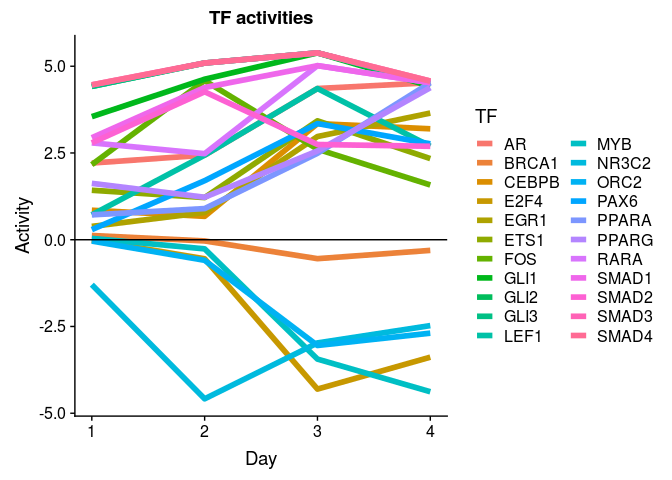

Two transcription factors - SRY, SMAD3 - are active on day second (beginning of DE differentiation):

``` r
#SMAD3
ggplot(data = activities %>% filter(TF == "SMAD3"), aes(x = Day, y = Activity))+
  geom_line(size = 2, colour = "red")+
  ggtitle("SMAD3 activity")
```

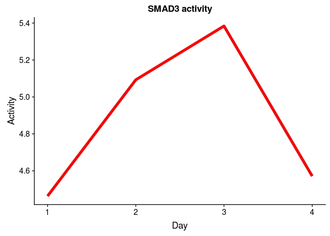

### Continue the analysis (strong and intermediate)

Perform GSEA for RNA-seq data using RegNetwork gmt file:

``` r
#reading gmt file
set.seed(42)
pathwaysReg <- gmtPathways("~/ESC_RNA_seq/Regulon/Bulk/RegNetworkStrongInterm.gmt")

#without putting into function, for implicity
#for the first day
geneVector <- genesReferenceAll109658$age1
names(geneVector) <- rownames(genesReferenceAll109658)
fgseaReg1 <- fgsea(pathwaysReg, geneVector, minSize=5, maxSize=300, nperm=10000)
reg1 <- fgseaReg1 %>% filter(padj < 0.05) %>% nrow()

#for the second day
geneVector <- genesReferenceAll109658$age2
names(geneVector) <- rownames(genesReferenceAll109658)
fgseaReg2 <- fgsea(pathwaysReg, geneVector, minSize=5, maxSize=300, nperm=10000)
reg2 <- fgseaReg2 %>% filter(padj < 0.05) %>% nrow()

#for the third day
geneVector <- genesReferenceAll109658$age3
names(geneVector) <- rownames(genesReferenceAll109658)
fgseaReg3 <- fgsea(pathwaysReg, geneVector, minSize=5, maxSize=300, nperm=10000)
reg3 <- fgseaReg3 %>% filter(padj < 0.05) %>% nrow()

#for the fourth day
geneVector <- genesReferenceAll109658$age4
names(geneVector) <- rownames(genesReferenceAll109658)
fgseaReg4 <- fgsea(pathwaysReg, geneVector, minSize=5, maxSize=300, nperm=10000)
reg4 <- fgseaReg4 %>% filter(padj < 0.05) %>% nrow()

gseaData <- list(fgseaReg1, fgseaReg2, fgseaReg3, fgseaReg4)
print(c(reg1, reg2, reg3, reg4))
```

    ## [1]  5  9 18 14

TF's that are active at first day, compared to 0 day:

``` r
x <- fgseaReg1 %>% filter(padj < 0.05) 
x
```

    ##   pathway         pval       padj        ES      NES nMoreExtreme size
    ## 1    GLI1 0.0009232190 0.02935836 0.6329198 1.839657            5   43
    ## 2    GLI2 0.0003087849 0.01227420 0.6729062 1.939443            1   41
    ## 3    GLI3 0.0003087849 0.01227420 0.6645428 1.915338            1   41
    ## 4   SMAD3 0.0001441961 0.01174645 0.6500484 2.042030            0   67
    ## 5   SMAD4 0.0001477541 0.01174645 0.6399650 1.960486            0   57
    ##                                                                                                                                          leadingEdge
    ## 1                                              WNT8A, WNT3, WNT6, WNT3A, WNT5B, BMP2, PTCH2, WNT5A, BMP4, WNT11, WNT9B, BMP5, HHIP, BMP7, PRKX, SUFU
    ## 2                                              WNT8A, WNT3, WNT6, WNT3A, WNT5B, BMP2, PTCH2, WNT5A, BMP4, WNT11, WNT9B, BMP5, HHIP, BMP7, PRKX, SUFU
    ## 3                                              WNT8A, WNT3, WNT6, WNT3A, WNT5B, BMP2, PTCH2, WNT5A, BMP4, WNT11, WNT9B, BMP5, HHIP, BMP7, PRKX, SUFU
    ## 4 PITX2, CDKN2B, LEF1, PTHLH, NOL3, COL6A1, SMAD6, SMAD6, GADD45B, TGFB1, TGFB1, TGFB3, JUN, EDN1, ANKRD1, TNC, CDKN1A, ACVR1C, ACVR1C, COL7A1, MMP9
    ## 5     PITX2, CDKN2B, LEF1, PTHLH, TCF7, NKX2-5, DACH1, SMAD6, GADD45B, TGFB1, ID1, ID2, JUN, EDN1, FOXH1, TNC, PTGS2, CDKN1A, COL7A1, ETS1, BGN, IHH

TF's that are active at second day, compared to 0 day:

``` r
x <- fgseaReg2 %>% filter(padj < 0.05) 
x
```

    ##   pathway         pval        padj         ES       NES nMoreExtreme size
    ## 1    REST 0.0015928640 0.028140597 -0.4466980 -1.640367            4   85
    ## 2    GLI1 0.0003137747 0.009978036  0.6300583  1.855688            1   43
    ## 3    GLI2 0.0001574555 0.006258857  0.6511300  1.903930            0   41
    ## 4    GLI3 0.0001574555 0.006258857  0.6561917  1.918731            0   41
    ## 5   NR3C2 0.0004526935 0.011996378 -0.8592975 -1.902711            1    9
    ## 6   SMAD1 0.0006384677 0.014502337  0.6330828  1.808189            3   36
    ## 7   SMAD2 0.0008119519 0.016137545  0.6454557  1.788483            4   31
    ## 8   SMAD3 0.0001481701 0.006258857  0.6558845  2.084992            0   67
    ## 9   SMAD4 0.0001514693 0.006258857  0.6396951  1.978542            0   57
    ##                                                                                                                                                                              leadingEdge
    ## 1    PDGFB, CABLES1, CPNE4, FAM155B, FAM78A, SYT4, NEFM, STMN3, SCAMP5, DLGAP3, IGSF10, SCN2A, NPTX2, RUNDC3A, DNER, BDNF, TMEM198, PHYHIPL, GRM4, SYT6, SYP, RIMKLA, OLFM3, CHRNB2, VGF
    ## 2                                                                                                           WNT8A, WNT3, WNT4, BMP2, WNT6, WNT11, WNT9B, BMP4, BMP5, PTCH2, WNT2B, WNT5A
    ## 3                                                                                                           WNT8A, WNT3, WNT4, BMP2, WNT6, WNT11, WNT9B, BMP4, BMP5, PTCH2, WNT2B, WNT5A
    ## 4                                                                                                           WNT8A, WNT3, WNT4, BMP2, WNT6, WNT11, WNT9B, BMP4, BMP5, PTCH2, WNT2B, WNT5A
    ## 5                                                                                                                                                   ATP1A2, ATP1B2, SGK1, ATP1A3, SCNN1A
    ## 6                                                                             SMAD6, SMAD6, CDKN2B, ANKRD1, ZEB2, ZEB1, NKX2-5, EHHADH, TNFRSF11B, ID1, GDF15, COL3A1, ID2, BAMBI, SMAD7
    ## 7                                                                                                                   PITX2, SMAD6, CDKN2B, TNC, TGFB1, TGFB3, SMAD7, RBL2, ZFYVE16, ACVR1
    ## 8 PITX2, SMAD6, SMAD6, CDKN2B, PTHLH, ANKRD1, NOL3, TNC, COL6A1, GADD45B, TGFB1, TGFB1, HNF4A, CCL2, LEF1, TGFB3, MMP9, COL3A1, SMAD7, RBL2, PEX6, SERPINE1, COL7A1, ZFYVE16, TNNC1, JUN
    ## 9                        PITX2, SMAD6, CDKN2B, DACH1, PTHLH, TNC, GADD45B, NKX2-5, TGFB1, HNF4A, CCL2, LEF1, ETS1, PTGS2, ID1, ID2, TCF7, BGN, SMAD3, RBL2, SERPINE1, COL7A1, TNNC1, JUN

TF's that are active at third day, compared to 0 day:

``` r
y <- fgseaReg3 %>% filter(padj < 0.05) 
y
```

    ##    pathway         pval        padj         ES       NES nMoreExtreme size
    ## 1     RELA 0.0030616150 0.031403617  0.4466785  1.584984           23  112
    ## 2     REST 0.0020408163 0.029499072 -0.4077329 -1.611033            4   85
    ## 3       AR 0.0007245502 0.013053544  0.4231442  1.571356            5  169
    ## 4    CEBPB 0.0029797378 0.031403617  0.5837169  1.737449           19   38
    ## 5     E2F4 0.0008658009 0.013766234 -0.3289108 -1.523528            0  265
    ## 6     ETS1 0.0024996875 0.030573101  0.4332049  1.564016           19  129
    ## 7     GLI1 0.0001459641 0.004676471  0.6588640  2.012126            0   43
    ## 8     GLI2 0.0001470588 0.004676471  0.6745210  2.042094            0   41
    ## 9     GLI3 0.0001470588 0.004676471  0.6706583  2.030399            0   41
    ## 10    LEF1 0.0007388799 0.013053544  0.6025978  1.813986            4   40
    ## 11     MYB 0.0022598870 0.029943503 -0.3402899 -1.486238            3  162
    ## 12    ORC2 0.0045630846 0.042678262 -0.8249836 -1.754681           19    7
    ## 13    PAX6 0.0031601124 0.031403617  0.8200866  1.707267           17    8
    ## 14     PGR 0.0056548984 0.049951602  0.5928784  1.689364           36   30
    ## 15    RARA 0.0002708192 0.006756183  0.5429945  1.811526            1   73
    ## 16   SMAD1 0.0002974420 0.006756183  0.6543320  1.933279            1   36
    ## 17   SMAD3 0.0001369863 0.004676471  0.6117384  2.012324            0   67
    ## 18   SMAD4 0.0001410835 0.004676471  0.6196455  1.987647            0   57
    ##                                                                                                                                                                                                                                                                                                                                                                                                                                                                                                                                                                                                                                                                           leadingEdge
    ## 1                                                                                                                                                                                                                                                                                                                                                                                                      WT1, IL6, IL6, NOL3, VCAM1, BCL3, NFKBIA, NFKBIA, MMP14, EML2, MMP9, F3, FN1, IL1R1, IL1R1, RAC2, SMAD3, CDH13, CTSB, PPARA, PGF, SOCS3, PTGS2, MLLT6, VEGFA, NR4A1, VEGFB, CCL2, LPXN, TRAF5, ZBTB10, MAVS, ICAM1, AKT1, AKT1, MAP3K1, TRAF1, NFKB2, TRIB3, AKT3, NOD1, NFAT5
    ## 2                                                                                                                                                                                                                                                                                                                                                                                                                                                                                      FAM155B, CPNE4, PAQR4, HSPA1L, ENOX1, ZNF367, BDNF, HIST1H2BK, NEFM, RUNDC3A, SCAMP5, TMEM198, SYP, OLFM3, STMN3, DLGAP3, IGSF10, SYT6, GRM4, RIMKLA, PHYHIPL, DNER, VGF, CHRNB2, SCN2A, NPTX2
    ## 3                                                                                                                                                                                                                                                                                        HNF1B, HOXB4, FGF8, CYP27A1, GATA3, CYP26A1, GADD45B, ACPP, IL6, NOL3, IL6ST, SMPD1, KLF5, TGFB1, NFKBIA, MMP9, GADD45G, HOXA1, PLAU, PPARG, PTHLH, FOXA1, GADD45A, JUN, ETS1, ECM1, ANGPTL4, SMAD3, DRD1, TNFRSF11B, ADAMTS3, CDH13, STRA6, KRT19, TRPS1, PTGS2, CRABP2, MYB, VEGFA, NCOA6, MAP4K2, PNRC1, RARA, APOA1, CITED2, SEMA6B, NCOA1, PKD1, ICAM1, UCP1, AKT1, ELF4, TCF7, HSD17B1
    ## 4                                                                                                                                                                                                                                                                                                                                                                                                                                                                                                                                                                                CSF3R, DLC1, IL6, HP, IGF2, TGFB1, ITGB2, GADD45G, F3, PPARG, FURIN, HPX, SMAD3, ABCC2, CDH13, PTGS2
    ## 5  CHEK1, RABIF, RPL23A, SKP1, DLEU1, RFC2, SUPT4H1, CKS1B, ITGB3BP, ORC1, KLF10, CDC45, NXT1, TMPO, SMC2, NAP1L4, RBL1, RBL1, E2F2, MRPL12, POLA2, SFPQ, HMMR, TTK, PPIA, E2F3, GPANK1, BRCA1, TOP1, HSPD1, METTL3, UMPS, TK1, PRIM2, RPA3, MED21, HNRNPD, POLR2D, RAD51, DBF4, HMGB3, MCM6, CSE1L, MTHFD1, COX7C, CALM1, INSIG1, SLC25A4, NCL, ZNF267, KLHL21, MSH2, ACTA1, TP53, HMGN2, POLR2F, FDFT1, BCL11A, CDC25A, POLE2, CKS2, MCM3, BUB3, MYC, TFAM, MAD2L1, H2AFZ, HMGB1, RFC3, FEN1, GINS1, CREG1, PPP1R3C, UNG, ABCA1, HPGD, SRSF8, GABRA5, MCM5, DUT, DHFR, TERT, DPP4, PCNA, PPP2R2B, HIST2H2BE, SPN, CDC6, XRCC2, PIM2, SLCO4A1, MYCN, APLN, ABCG1, PSMB8, DMRT1, HRH3
    ## 6                                                                                                                                                                                                                                                                                                                                                                                                                                                      CSF3R, ANGPT2, ANPEP, RUNX1, VWF, TFAP2A, BMP4, NRP1, TNC, NOL3, ITGA5, VCAM1, MMP9, ITGA4, TBXAS1, PLAU, PTHLH, TNNC1, NELL1, GRPR, ICAM4, ETS1, KIT, CDH13, CTSB, NOS3, PGF, PTGS2, MYB, PDGFRB, ETS2, VEGFA, CDKN1B, ITGA2B
    ## 7                                                                                                                                                                                                                                                                                                                                                                                                                                                                                                                                                                                                  WNT8A, WNT4, WNT3, BMP5, WNT9B, WNT11, BMP2, BMP4, WNT6, HHIP, FOXA2, PTCH2, MTSS1
    ## 8                                                                                                                                                                                                                                                                                                                                                                                                                                                                                                                                                                                                  WNT8A, WNT4, WNT3, BMP5, WNT9B, WNT11, BMP2, BMP4, WNT6, HHIP, FOXA2, PTCH2, MTSS1
    ## 9                                                                                                                                                                                                                                                                                                                                                                                                                                                                                                                                                                                                  WNT8A, WNT4, WNT3, BMP5, WNT9B, WNT11, BMP2, BMP4, WNT6, HHIP, FOXA2, PTCH2, MTSS1
    ## 10                                                                                                                                                                                                                                                                                                                                                                                                                                                                                                                                                                                                SOX17, CLDN2, NOL3, CD1D, MITF, VIM, LEF1, NCAM1, MARK4, JUN, EDA, NRCAM, ADA, DLL1
    ## 11                                                                                                                                                                                                                                                    MYBBP1A, RBL1, EZH2, HSPA4, EIF2S1, EEF1B2, PARP1, POLA2, MCM7, HMMR, RPS10, PA2G4, TAF9, HSPD1, HAT1, TK1, CD4, GART, DEK, RAD51, PAICS, MRPL3, DKC1, BUB1B, NCL, NAE1, EMG1, SNRPE, NPM1, ABCE1, SNRPG, CDC7, RANBP1, UCHL1, ERBB2, BCLAF1, MCM3, EBNA1BP2, MYC, TFAM, SNRPF, MAD2L1, HMGB1, EPCAM, FAM216A, NOLC1, C1QBP, EXO1, CCNA1, NME1, CLU, PCNA, DHRS2, MAT2A, FAS, FGF2, TERF1, LCK, EGR1, VAV1, KCNMA1, HHLA1, SPIB
    ## 12                                                                                                                                                                                                                                                                                                                                                                                                                                                                                                                                                                                                                                           MCM7, MCM6, MCM3, MCM2, MCM5, MCM4, CDC6
    ## 13                                                                                                                                                                                                                                                                                                                                                                                                                                                                                                                                                                                                                                                   ITGA5, MITF, L1CAM, ETS1, MAP4K2
    ## 14                                                                                                                                                                                                                                                                                                                                                                                                                                                                                                                                                                                                                     OVGP1, PIK3R5, NOL3, EGF, MAPK10, JUN, IHH, PIK3R1, MYB, VEGFA
    ## 15                                                                                                                                                                                                                                                                                                                                                                                                                                                                HNF1B, HOXB4, CYP26A1, HNF4A, GADD45B, IL6, SMPD1, KLF5, TGFB1, GADD45G, HOXA1, PLAU, PPARG, PTHLH, GADD45A, JUN, ETS1, ANGPTL4, CDH13, STRA6, KRT19, CRABP2, VEGFA, PNRC1, RARA, NCOA1, ICAM1, ELF4, TCF7, HSD17B1
    ## 16                                                                                                                                                                                                                                                                                                                                                                                                                                                                                                                                                                         ANKRD1, SMAD6, SMAD6, NKX2-5, CDKN2B, ZEB2, ZEB1, GDF15, EHHADH, ID2, ID1, BAMBI, TNFRSF11B, SMAD7, COL3A1
    ## 17                                                                                                                                                                                                                                                                                                                                                                                                                                                                                                               ANKRD1, SMAD6, SMAD6, PITX2, HNF4A, CDKN2B, GADD45B, TNC, NOL3, COL6A1, TGFB1, TGFB1, TGFB3, LEF1, MMP9, PTHLH, TNNC1, JUN, VEGFA, SMAD7, COL3A1, CCL2, ACVR1, FSTL3
    ## 18                                                                                                                                                                                                                                                                                                                                                                                                                                                                                                                                      SMAD6, PITX2, NKX2-5, DACH1, HNF4A, CDKN2B, GADD45B, TNC, TGFB1, LEF1, ID2, PTHLH, TNNC1, JUN, IHH, ETS1, ID1, SMAD3, PTGS2, CCL2, BGN, FSTL3

TF's that are active at fourth day, compared to 0 day:

``` r
z <- fgseaReg4 %>% filter(padj < 0.05) 
z
```

    ##    pathway         pval       padj         ES       NES nMoreExtreme size
    ## 1     REST 0.0020242915 0.02682186 -0.3949182 -1.583216            3   85
    ## 2       AR 0.0003402904 0.01104627  0.4490436  1.634066            2  169
    ## 3    CEBPB 0.0036697248 0.04167759  0.5736071  1.685630           25   38
    ## 4     E2F4 0.0028248588 0.03455020 -0.2796314 -1.313680            1  265
    ## 5     GLI1 0.0006904170 0.01219737  0.6039801  1.821051            4   43
    ## 6     GLI2 0.0005557871 0.01104627  0.6251763  1.868726            3   41
    ## 7     GLI3 0.0005557871 0.01104627  0.6211567  1.856710            3   41
    ## 8      MYB 0.0008025682 0.01274651 -0.3374977 -1.490562            0  162
    ## 9    PPARA 0.0005208333 0.01104627  0.5242303  1.689734            3   64
    ## 10   PPARG 0.0008818342 0.01274651  0.4914222  1.638756            6   79
    ## 11    RARA 0.0005085177 0.01104627  0.5248649  1.728124            3   73
    ## 12   SMAD1 0.0004248690 0.01104627  0.6339344  1.846178            2   36
    ## 13   SMAD3 0.0001296512 0.01054237  0.6226010  2.019874            0   67
    ## 14   SMAD4 0.0001326084 0.01054237  0.6241291  1.975686            0   57
    ##                                                                                                                                                                                                                                                                                                                                                                                                                                                                                                                leadingEdge
    ## 1                                                                                                                                                                                                                                                                                                                                                                   CPNE4, RIMKLA, SCAMP5, OLFM3, HIST1H2BK, COL5A3, IGSF10, DNER, TMEM198, RUNDC3A, DLGAP3, STMN3, BDNF, SYT6, SCN2A, NEFM, VGF, CHRNB2, SYP, GRM4, NPTX2
    ## 2                                                                                                                                                                    HNF1B, HOXB4, FGF8, APOA1, GATA3, CYP26A1, FOXA1, CYP27A1, NOL3, SMPD1, MMP9, ACPP, IL6ST, GADD45B, IGFBP5, TGFB1, NFKBIA, ECM1, KLF5, RARB, TNFRSF11B, ANGPTL4, DRD1, PPARG, UCP1, CDH13, GADD45A, CRABP2, PLAU, KRT19, GADD45G, IL6, APOE, PNRC1, JUN, AKT1, ETS1, KCNH8, ADAMTS3, UCP3, CITED2, SMAD3, MAP4K2, TMSB10, NCOA6, PKD1, HSD17B1, VEGFA
    ## 3                                                                                                                                                                                                                                                                                                                                                                                                                            HP, CSF3R, IGF2, DLC1, TGFB1, HPX, FURIN, PPARG, CDH13, ABCC2, F3, ITGB2, GADD45G, IL6, SMAD3
    ## 4  NXT1, ADRBK2, NAP1L4, RBL1, RBL1, CHEK1, RPL23A, TOP1, USP25, DLEU1, POLR2D, ACTA1, ZFP36L1, COX7C, HMGB3, RPA3, HNRNPD, ORC1, TTK, E2F3, UMPS, PRKG2, CDC25A, HSPD1, MSH2, CKS2, TP53, GINS1, MED21, NCL, POLE2, KLHL21, CSE1L, PRIM2, ABCG1, TEAD4, MTHFD1, HMGB1, MAD2L1, MCM5, TERT, DBF4, UNG, BUB3, FDFT1, SRSF8, DHFR, BCL11A, PCNA, H2AFZ, CREG1, MCM3, ZNF267, CDC6, TFAM, KLF10, GABRA5, INSIG1, DUT, PPP1R3C, RFC3, XRCC2, SFPQ, HIST2H2BE, APLN, PPP2R2B, PIM2, SLCO4A1, MYC, SPN, PSMB8, MYCN, DMRT1, HRH3
    ## 5                                                                                                                                                                                                                                                                                                                                                                                                                                                    BMP5, WNT3, WNT4, WNT9B, WNT11, BMP2, WNT8A, BMP4, FOXA2, HHIP, PTCH2
    ## 6                                                                                                                                                                                                                                                                                                                                                                                                                                                    BMP5, WNT3, WNT4, WNT9B, WNT11, BMP2, WNT8A, BMP4, FOXA2, HHIP, PTCH2
    ## 7                                                                                                                                                                                                                                                                                                                                                                                                                                                    BMP5, WNT3, WNT4, WNT9B, WNT11, BMP2, WNT8A, BMP4, FOXA2, HHIP, PTCH2
    ## 8                                                                                               CD4, RBL1, EZH2, EMG1, SLC39A14, EBNA1BP2, ODC1, PARP1, TAF4B, HAT1, SNRPF, TAF9, MYBBP1A, UCHL1, EIF2S1, HSPA4, BCLAF1, SH2D3C, EPCAM, RANBP1, BUB1B, HSPD1, DHRS2, GART, ERBB2, SNRPE, DKC1, NCL, PAICS, HSPA9, NAE1, HMGB1, MAD2L1, CDC7, FAM216A, MRPL3, CLU, DEK, NME1, PSAT1, PCNA, EXO1, C1QBP, MCM3, ABCE1, NOLC1, TFAM, NPM1, SLC25A21, CCNA1, MYC, FAS, VAV1, MAT2A, EGR1, TERF1, LCK, FGF2, KCNMA1, HHLA1, SPIB
    ## 9                                                                                                                                                                                                                                                                                                                                                                         APOA2, APOA1, GATA3, SCD5, NOL3, MMP9, ACOX3, GADD45B, TGFB1, NFKBIA, ANGPTL4, EHHADH, UCP1, LEPR, GADD45A, GADD45G, SLC27A1, AKT1, UCP3, CITED2
    ## 10                                                                                                                                                                                                                                                                                                    RXRG, APOA1, GATA3, CYP27A1, SCD5, NOL3, MMP9, OLR1, GADD45B, RARB, TNFRSF11B, ANGPTL4, UCP1, GADD45A, GADD45G, SLC27A1, IL6, APOE, AKT1, ADAMTS3, SMAD3, MAP4K2, RXRA, NCOA6, VEGFA, SEMA6B, CDKN1A, UCP2, SERPINE1
    ## 11                                                                                                                                                                                                                                                                                                                                            HNF4A, HNF1B, HOXB4, CYP26A1, SMPD1, GADD45B, TGFB1, KLF5, RARB, ANGPTL4, PPARG, CDH13, GADD45A, CRABP2, PLAU, KRT19, GADD45G, IL6, PNRC1, JUN, ETS1, TMSB10, HSD17B1, VEGFA
    ## 12                                                                                                                                                                                                                                                                                                                                                                              ANKRD1, SMAD6, SMAD6, CDKN2B, NKX2-5, ZEB2, TNFRSF11B, EHHADH, ZEB1, GDF15, COL3A1, BAMBI, ID1, ID2, SMAD7, CDKN1A, SERPINE1, BMPR1B, FLNA
    ## 13                                                                                                                                                                                                                                                                                                                           HNF4A, ANKRD1, PITX2, SMAD6, SMAD6, CDKN2B, NOL3, TNC, TNNC1, MMP9, COL6A1, GADD45B, TGFB1, TGFB1, TGFB3, CCL2, COL3A1, LEF1, JUN, VEGFA, FSTL3, SMAD7, CDKN1A, SERPINE1, TGFB2, COL7A1, DOK1
    ## 14                                                                                                                                                                                                                                                                                                                                                                                                     HNF4A, IHH, PITX2, SMAD6, CDKN2B, NKX2-5, DACH1, TNC, TNNC1, GADD45B, TGFB1, CCL2, LEF1, JUN, ETS1, ID1, SMAD3, ID2

Plotting activity of transcription factors:

``` r
tfs <- unique(c(x$pathway, y$pathway, z$pathway))

tfs <- c("BRCA1", tfs)

calculateActivity <- function(tf, gseaResults){
  
  res <- sapply(gseaResults, function(x, tfName){
    p_val <- x %>% filter(pathway == tfName) %>% dplyr::select(padj)
    nes <- x %>% filter(pathway == tfName) %>% dplyr::select(NES)
    val <- sign(nes)*(-1)*log(p_val)
    return(val)}, 
    tfName = tf)
  
  names(res) <- rep(tf, length(res))
  res <- unlist(res)
  return(res)
  #df <- data.frame(TF = rep(tf, length(res)), Activity = res, Days = c(1,2,3,4))
}

activities <- sapply(tfs, calculateActivity, gseaResults = gseaData)
#rownames(activities) <- NULL
activities <- as.data.frame(t(activities))
colnames(activities) <- c(1, 2, 3, 4)
activities <- activities %>% rownames_to_column("TF")
activities <- melt(activities)
```

    ## Using TF as id variables

``` r
colnames(activities) <- c("TF", "Day", "Activity")
activities$Day <- as.numeric(activities$Day)
#activities <- activities %>% filter(TF == "SMAD3")
```

``` r
#BRCA1 - random TF, an outlier, just to show the contrast
ggplot(data = activities, aes(x = Day, y = Activity, colour = TF))+
  geom_line(size = 2) +
  geom_hline(yintercept = 0) +
  ggtitle("TF activities")
```

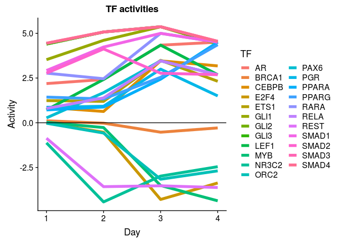

Two transcription factors - SRY, SMAD3 - are active on day second (beginning of DE differentiation):

``` r
#SMAD3
ggplot(data = activities %>% filter(TF == "SMAD3"), aes(x = Day, y = Activity))+
  geom_line(size = 2, colour = "red")+
  ggtitle("SMAD3 activity")
```

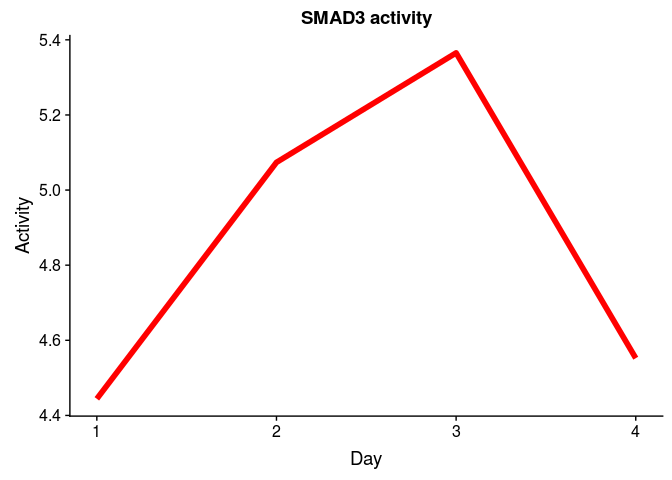

GSE75748 analysis
-----------------

``` r
#load data
load("genesReferenceAll75748.Rdata")

head(genesReferenceAll75748) %>% kable()
```

|         |    time12h|    time24h|    time36h|    time72h|    time96h|   AveExpr|         F|  P.Value|  adj.P.Val|
|---------|----------:|----------:|----------:|----------:|----------:|---------:|---------:|--------:|----------:|
| TLK1    |  -4.907691|  -4.771385|  -5.008265|  -5.947647|  -5.819325|  8.003228|  539.2986|        0|          0|
| ANP32E  |  -3.903200|  -4.009477|  -4.015683|  -5.066329|  -4.969735|  9.260241|  525.2731|        0|          0|
| C6orf62 |  -4.993563|  -4.898901|  -4.860325|  -4.720546|  -4.659915|  8.440522|  433.0488|        0|          0|
| TERF1   |  -3.919003|  -4.989050|  -5.598977|  -5.330922|  -5.764249|  7.205476|  357.5671|        0|          0|
| SOX4    |  -4.241189|  -4.579804|  -5.180858|  -5.689423|  -5.198745|  8.330954|  353.5268|        0|          0|
| SRSF6   |  -4.672097|  -4.505790|  -4.558124|  -6.163719|  -5.186871|  8.628098|  351.9696|        0|          0|

### Continue the analysis (all)

Perform GSEA for RNA-seq data using RegNetwork gmt file:

``` r
#reading gmt file
set.seed(42)
pathwaysReg <- gmtPathways("~/ESC_RNA_seq/Regulon/Bulk/RegNetwork.gmt")

#without putting into function, for implicity
#for the first 12 hours
geneVector <- genesReferenceAll75748$time12h
names(geneVector) <- rownames(genesReferenceAll75748)
fgseaReg1 <- fgsea(pathwaysReg, geneVector, minSize=5, maxSize=300, nperm=10000)
reg1 <- fgseaReg1 %>% filter(padj < 0.05) %>% nrow()

#for the first 24 hours
geneVector <- genesReferenceAll75748$time24h
names(geneVector) <- rownames(genesReferenceAll75748)
fgseaReg2 <- fgsea(pathwaysReg, geneVector, minSize=5, maxSize=300, nperm=10000)
reg2 <- fgseaReg2 %>% filter(padj < 0.05) %>% nrow()

#for the first 36 hours
geneVector <- genesReferenceAll75748$time36h
names(geneVector) <- rownames(genesReferenceAll75748)
fgseaReg3 <- fgsea(pathwaysReg, geneVector, minSize=5, maxSize=300, nperm=10000)
reg3 <- fgseaReg3 %>% filter(padj < 0.05) %>% nrow()

#for the first 72 hours
geneVector <- genesReferenceAll75748$time72h
names(geneVector) <- rownames(genesReferenceAll75748)
fgseaReg4 <- fgsea(pathwaysReg, geneVector, minSize=5, maxSize=300, nperm=10000)
reg4 <- fgseaReg4 %>% filter(padj < 0.05) %>% nrow()

#for the first 96 hours
geneVector <- genesReferenceAll75748$time96h
names(geneVector) <- rownames(genesReferenceAll75748)
fgseaReg5 <- fgsea(pathwaysReg, geneVector, minSize=5, maxSize=300, nperm=10000)
reg5 <- fgseaReg5 %>% filter(padj < 0.05) %>% nrow()


gseaData <- list(fgseaReg1, fgseaReg2, fgseaReg3, fgseaReg4)
print(c(reg1, reg2, reg3, reg4, reg5))
```

    ## [1] 23 28 30 24 23

TF's that are active at first 12h, compared to 0 day:

``` r
x <- fgseaReg1 %>% filter(padj < 0.05) 
x
```

    ##    pathway         pval       padj        ES      NES nMoreExtreme size
    ## 1    SMAD4 0.0001874063 0.01246037 0.3752740 1.788378            0  181
    ## 2    SMAD3 0.0001857355 0.01246037 0.4379484 2.141342            0  219
    ## 3    SMAD1 0.0009527439 0.03430288 0.3647768 1.671551            4  138
    ## 4     LEF1 0.0011702750 0.03855147 0.4716389 1.846930            5   55
    ## 5     SOX9 0.0003710575 0.01930270 0.3400040 1.641049            1  197
    ## 6    SMAD9 0.0001912777 0.01246037 0.4179516 1.872381            0  117
    ## 7    SMAD5 0.0001956564 0.01246037 0.5459769 2.034881            0   44
    ## 8    SMAD2 0.0016952345 0.04982515 0.3259189 1.546304            8  176
    ## 9    RUNX1 0.0005965401 0.02394022 0.5602848 1.910905            2   30
    ## 10  CTNNB1 0.0001905125 0.01246037 0.5084690 2.333132            0  140
    ## 11  CREBBP 0.0001853912 0.01246037 0.4172428 2.017502            0  200
    ## 12    ABL1 0.0005713197 0.02394022 0.3691974 1.676885            2  128
    ## 13  ATF7IP 0.0001952362 0.01246037 0.5044223 2.016859            0   61
    ## 14     FUS 0.0002027575 0.01246037 0.7340696 2.164952            0   17
    ## 15   GFI1B 0.0001928268 0.01246037 0.4982881 2.038257            0   69
    ## 16  HNRNPK 0.0013779528 0.04234073 0.5273289 1.866706            6   35
    ## 17   MYOD1 0.0003932363 0.01930270 0.5501658 1.995931            1   39
    ## 18   RUNX2 0.0002000800 0.01246037 0.6407487 2.148030            0   28
    ## 19    SKIL 0.0009641342 0.03430288 0.4310496 1.768169            4   70
    ## 20  SUPT5H 0.0001986887 0.01246037 0.6272515 1.964458            0   21
    ## 21  TCERG1 0.0003997601 0.01930270 0.6279106 2.047522            1   25
    ## 22   TRIP4 0.0006020470 0.02394022 0.6918304 1.975552            2   15
    ## 23    YBX1 0.0011976048 0.03855147 0.5824507 1.861255            5   23
    ##                                                                                                                                                                                                                                                                                                                                                                                                                                                                                                                               leadingEdge
    ## 1                                                                                                                                                       ID4, LEF1, TGFB1, SMAD6, PITX2, ID1, SNRNP70, DNAJB2, SKI, FOXO4, GADD45B, HDGF, PRKAR2A, TCF7, DVL1, AKT1, COL7A1, CEBPB, ODZ3, ETS1, JUN, JUN, NEK6, PRKAR1B, STUB1, RFX1, ID2, NKX2-5, DACH1, DACH1, ARL5B, AP2B1, JUNB, ACVR1B, ZNF423, ITK, RASL12, FBXO30, TGFBRAP1, JUND, TFDP1, FN1, DOK1, FBLN1, ID3, PIAS4, PARD3, EP300, HDLBP, SP1, MAX, SERPINE1, BTRC, BTRC, CREBBP
    ## 2  LEF1, LEF1, TGFB1, TGFB1, SMAD6, SMAD6, PITX2, FLNA, HEY1, SNRNP70, CLASRP, ZEB2, SKI, COL6A1, FOXO4, AXIN2, GADD45B, PRKAR2A, SMAD7, NOTCH1, LMNA, SREBF2, DVL1, AKT1, MLL4, COL7A1, VIM, YBX1, MAPK8, CEBPB, RUNX3, SMURF1, ETS1, JUN, JUN, KPNB1, AXIN1, VEGFA, KDM2A, PRKAR1B, STUB1, SF3A1, ZFYVE9, CDC25A, PEX6, PEX6, MEN1, CXXC5, GSC, EPB41, DACH1, JUNB, LAMC1, ATF3, RASL12, JUND, TFDP1, DOK1, MCM3AP, CDK2, PCDH1, PAPPA, TSC2, PIAS4, PARD3, SF3B2, SF3B2, EP300, SP1, MAX, SERPINE1, ANKRD1, BTRC, BTRC, CREBBP, CREBBP
    ## 3                                                                                                                                                                                                                                                                 ID4, LEF1, SMAD6, SMAD6, BAMBI, FLNA, ID1, SNRNP70, ZEB2, ZEB2, MLL2, SMAD7, BTBD2, COL4A1, BMPR1A, SMURF1, STUB1, COL1A1, RFX1, BTG2, ID2, MEN1, AP2A2, GSC, NKX2-5, LEMD3, ZNF423, RASL12, FBXO30, INPP4A, NOTCH2, TNFRSF11B, ID3, PIAS4, RAB6B, FBXL12, HIPK2, EP300
    ## 4                                                                                                                                                                                                                                                                                                                                                                                                                                   LEF1, PITX2, CDX1, CD1D, MARK4, NOTCH1, CCND1, CCND1, VIM, UBTF, JUN, ALYREF, NRCAM, EDA, TCF3, FOSL1
    ## 5                                                           EOMES, ID4, SP5, TNRC18, VLDLR, C10orf114, MFAP3L, ITPKB, TMEM2, BRSK2, HSPG2, MYO18A, NFE2L1, MIDN, SLC16A7, PHACTR1, MLL4, MAP2K7, COL4A2, GSK3B, SSBP3, HSPA1A, KPNB1, SHF, CHPF2, USP6NL, RAI1, CCDC92, MED12, ZNF646, MAST1, SLC9A3R2, TXNDC16, KIF1A, TCF3, TOX2, DOCK4, TTC39B, MARCKSL1, PURB, CAMSAP3, PLEKHG2, PAPPA, KIF26B, PHTF1, LIMD1, EML1, HIPK2, FAM173A, EP300, SPEN, TMEM164, EPB41L1, NT5C2, CDK16, BCOR, ENOX1, CREBBP, PPIF, SPTBN1, MID2, COPG2, CCNJ
    ## 6                                                                                                                                                                                                               ID4, SMAD6, ID1, HEY1, SNRNP70, LRP5, ZEB2, PLEC, DKK1, MLL2, RRBP1, SMAD7, PELP1, AP2A1, PNPLA2, BMPR1A, MAN2B1, C10orf2, RFX1, BTG2, ID2, CXXC5, FLI1, LEMD3, CHPF, UBQLN1, PSAP, TMEM57, PABPC4, ZNF592, FN1, MCM3AP, MGAT1, AFF1, XAB2, MAN1C1, PAPPA, ID3, HUWE1, TRIP12, DNAJC7, STAG1, EIF3C, EVC2, UNC45A, SPTBN1
    ## 7                                                                                                                                                                                                                                                                                                                                                                                                                                                ID4, SMAD6, FLNA, ID1, SNRNP70, U2AF2, ZEB2, RYR2, SMAD7, BMPR1A, ID2, MEN1, CXXC5, SFPQ
    ## 8                                                                                                                                                                                         LEF1, TGFB1, SMAD6, PITX2, SNRNP70, ZEB2, SKI, FBN2, ANAPC2, SMAD7, DVL1, LAMA5, BTBD2, AKT1, MAPK8, RXRA, OS9, JUN, KPNB1, AXIN1, STUB1, C22orf46, ZFYVE9, GSC, LEMD3, MLLT4, ACVR1B, DYNC1H1, PSAP, RASL12, TGFBRAP1, TFDP1, GTF2I, PAPPA, ZMYND11, TSC2, PIAS4, ZNF41, PARD3, HUWE1, HIPK2, DNAJC7, EP300, SP1, STAG1, GRIPAP1, CREBBP, LMO2
    ## 9                                                                                                                                                                                                                                                                                                                                                                                                                                   NCOR2, YAP1, CCND1, CEBPB, ELF4, JUN, ELF2, HIPK2, KAT6A, EP300, CDK6, AR, HIPK1, JUP, WWTR1, SUV39H1
    ## 10                                              TFAP2A, FSCN1, LEF1, PITX2, PTPRU, CDH24, FOXO4, PRKACA, AXIN2, EGFR, TCF7, AJAP1, PIK3R1, SMAD7, DVL1, CCND1, CCND1, SRC, KDR, CSNK2A2, BCL9L, GSK3B, RXRA, CSNK1D, PKD1, CDH2, CTNNBIP1, CDH11, AXIN1, PICK1, ZFYVE9, TRIP10, PTPRJ, TBL1X, PTPN1, SLC9A3R1, CDH1, TCF3, CHD8, FBXW11, NDRG1, PYGO1, PRKX, PTPRF, PTPRM, GRIK2, BCL9, EP300, CTNND2, CDON, SALL1, FYN, MAGI1, BTRC, CREBBP, IGF1R, DLG5, TJP1, NFKB1, CDK6, CASP8, DVL3, AR, IGF2BP1, NCOA2, PKP2, SMARCA4, PTPRK, CBY1
    ## 11                                                                                                                          LEF1, CDX2, KLF5, CITED2, CNOT3, CARM1, FOXO4, PRKACA, MSX1, MED25, TCF7, POLR2A, PELP1, SREBF2, ELK1, JDP2, SREBF1, UBTF, CEBPB, SRCAP, CSNK2A2, WT1, ETS2, ETS1, SRF, MAML1, MYBL1, MAFG, CREB3L2, KLF13, GMEB2, CSK, JUN, CDH2, HSF1, TRIP10, GAK, SH3GL1, DACH1, HMGA1, HTT, THRA, E2F1, TCF3, PRKCD, CREB5, SERTAD2, CAMK4, NFIC, MYBL2, STAT5A, RELA, MDC1, ALX1, IKBKG, KAT2A, PRKX, SND1, CUX1, HIPK2
    ## 12                                                                                         APP, RAC3, PIK3R1, INPPL1, POLR2A, EPHA2, YAP1, TERT, CAV1, SHC3, SRC, EPHB4, JUN, RAD9A, JAK2, EPHB3, SFN, PLCG1, RFX1, BCAR1, BIN1, ZDHHC16, ARHGAP17, PRKD1, CABLES1, DOK1, CABLES2, YTHDC1, STAT5A, RIN1, BCR, DDB1, APBB1, SORBS3, ADAM15, EP300, DOK3, CTNND2, STAT5B, EPHA4, ABL1, CBL, EPHA7, CDKN1B, RB1, EPHA8, EPHA6, PXN, SOS2, EVL, YWHAG, CRKL, ROBO1, PRKDC, NCSTN, SHD, ZAP70, RASA1, EPHB6, PAK2, MAP4K5, PTPN12, RAD51, SHC2
    ## 13                                                                                                                                                                                                                                                                                                                                                SENP3, HSPG2, RRBP1, DNM2, SLC12A4, LAMA5, COL4A2, PKD1, KIF13A, PEX6, NOMO1, LAMC1, SETDB1, CEP250, CADM1, PCDH1, PAPPA, MACF1, FLNB, STRN, LUC7L2, TRIP12, SP1, GTF2F1, SPTBN1, SUSD1
    ## 14                                                                                                                                                                                                                                                                                                                                                                                                                                                                     POLR2A, SF1, YBX1, FUS, RXRA, SFPQ, THRA, RELA, PTBP1, ILF3, PRMT1
    ## 15                                                                                                                                                                                                                                                                                                          AGRN, LTBP4, CENPB, HSPG2, TXNDC11, NOTCH1, JAG2, MYH14, CCDC85B, DTNA, MEGF8, PICK1, NELF, KALRN, ACTN1, RNF31, LAMB1, TAF1, NELL1, TENC1, FBLN1, TSPYL2, PDZD4, ZNRF3, LZTS2, EFEMP2, HNRNPK, AES, TRIP6, PHC2, MID2, IFFO1
    ## 16                                                                                                                                                                                                                                                                                                                                                                                                              HNRNPL, SAFB, YBX1, SRC, CEBPB, NCK2, CSK, PRKCD, RBM42, ITK, NPDC1, LYN, SORBS3, CNNM3, FYN, HNRNPK, PRMT1, PCBP2, UBE2I
    ## 17                                                                                                                                                                                                                                                                                                                                                                                                                             ID4, ID1, HEY1, NCOR2, SMAD7, CALM3, SRF, RXRA, JUN, ID2, CDC34, CIB2, TCF3, CDK2, ID3, EP300, SP1, CREBBP
    ## 18                                                                                                                                                                                                                                                                                                                                                                                                                                                                  MSX2, LEF1, SMAD6, HDAC4, YAP1, UBTF, CEBPB, ETS1, JUN, AXIN1, MAP3K4
    ## 19                                                                                                                                                                                                                                                                                                                                                                                 HEY1, SNRNP70, SKI, NCOR2, FZR1, LRP1, COL4A2, ZZEF1, PPL, FAF1, CBX4, CXXC5, HIPK3, CHPF, SETDB1, FN1, FBLN1, PAPPA, MACF1, PTPRF, PIAS4, TSKU, MORC4
    ## 20                                                                                                                                                                                                                                                                                                                                                                                                                                                      H2AFX, POLR2A, DBN1, SUPT5H, SUPT4H1, ZFYVE9, GTF3C1, HTATSF1, PRMT1, DCAF6, CDK9
    ## 21                                                                                                                                                                                                                                                                                                                                                                                                                          CHD3, U2AF2, POLR2A, SF1, HNRNPM, HSPA1A, SF3A1, TPM4, HTT, SETDB1, SF3B4, PIAS4, SF3B2, HSPA5, SRSF1, CHAF1A
    ## 22                                                                                                                                                                                                                                                                                                                                                                                                                                                                   RARA, RXRA, JUN, THRB, RELA, EP300, CREBBP, GTF2A1, NFKB1, NCOA1, AR
    ## 23                                                                                                                                                                                                                                                                                                                                                                                                                                                             TFAP2A, HABP4, AKT1, YBX1, FUS, GSK3B, VEGFA, SRSF9, HNRNPK, HNRNPD, PCBP2

TF's that are active at first 24h, compared to 0 day:

``` r
x <- fgseaReg2 %>% filter(padj < 0.05) 
x
```

    ##    pathway         pval       padj        ES      NES nMoreExtreme size
    ## 1    SMAD4 0.0001864280 0.01112867 0.4030314 1.906149            0  181
    ## 2    SMAD3 0.0001831502 0.01112867 0.4987512 2.416664            0  219
    ## 3    SMAD1 0.0001900779 0.01112867 0.4154704 1.891889            0  138
    ## 4    PPARA 0.0019425019 0.04785502 0.3852014 1.647513            9   93
    ## 5     LEF1 0.0009798158 0.03358506 0.4729880 1.841780            4   55
    ## 6     GLI2 0.0005905512 0.02851519 0.5175704 1.906900            2   43
    ## 7    SMAD9 0.0001920861 0.01112867 0.4321194 1.923381            0  117
    ## 8    SMAD5 0.0007902015 0.03142213 0.5150842 1.904195            3   44
    ## 9    SMAD2 0.0001870557 0.01112867 0.3600256 1.696965            0  176
    ## 10   RUNX1 0.0015942607 0.04145078 0.5565851 1.878651            7   30
    ## 11    RBPJ 0.0009910803 0.03358506 0.5756061 1.857339            4   25
    ## 12   MYBL2 0.0011871785 0.03513605 0.6348551 1.913706            5   19
    ## 13    GLI3 0.0011871785 0.03513605 0.4851453 1.840717            5   49
    ## 14    GLI1 0.0007898894 0.03142213 0.4942464 1.836572            3   45
    ## 15  CTNNB1 0.0001895375 0.01112867 0.5010761 2.287429            0  140
    ## 16  CREBBP 0.0001854599 0.01112867 0.4186761 2.005345            0  200
    ## 17   CEBPD 0.0013844937 0.03743671 0.6026292 1.888965            6   22
    ## 18    ABL1 0.0001923817 0.01112867 0.3780996 1.701586            0  128
    ## 19     APC 0.0009936407 0.03358506 0.5684400 1.868706            4   27
    ## 20  ATF7IP 0.0001940994 0.01112867 0.5268145 2.097725            0   61
    ## 21     FUS 0.0011954573 0.03513605 0.6595072 1.923238            5   17
    ## 22   GFI1B 0.0001952362 0.01112867 0.4805195 1.956292            0   69
    ## 23   IKBKG 0.0007803355 0.03142213 0.4397246 1.793150            3   70
    ## 24     MAF 0.0019821606 0.04785502 0.7185227 1.902444            9   12
    ## 25   MYOD1 0.0001972387 0.01112867 0.5487642 1.978151            0   39
    ## 26   RUNX2 0.0001975504 0.01112867 0.6474492 2.151498            0   28
    ## 27    SKIL 0.0013655872 0.03743671 0.4325901 1.764056            6   70
    ## 28  TCERG1 0.0003964321 0.02061447 0.6173497 1.992036            1   25
    ##                                                                                                                                                                                                                                                                                                                                                                                                                                                                            leadingEdge
    ## 1                                                                                                                          LEF1, TGFB1, ID4, SMAD6, PITX2, TCF7, JUN, JUN, SNRNP70, ID1, SKI, FOXO4, TNC, GADD45B, PRKAR2A, HDGF, DNAJB2, ETS1, AKT1, CEBPB, CDKN2B, NKX2-5, DVL1, RFX1, JUND, FN1, COL7A1, PRKAR1B, NEK6, STUB1, ODZ3, AP2B1, FBLN1, ID2, TFDP1, ARL5B, DACH1, DACH1, MAX, ACVR1B, FOXH1, FOXH1, DOK1, SP1, JUNB, FBXO30, SERPINE1, ZNF423, PIAS4, RASL12, ID3, PARD3
    ## 2         ANKRD1, LEF1, LEF1, TGFB1, TGFB1, SMAD6, SMAD6, ZEB2, PITX2, COL6A1, FLNA, JUN, JUN, SNRNP70, CLASRP, GSC, SKI, FOXO4, TNC, GADD45B, AXIN2, PRKAR2A, ETS1, AKT1, ATF3, NOTCH1, CEBPB, RUNX3, CDKN2B, LMNA, VIM, SREBF2, MAPK8, MLL4, YBX1, DVL1, VEGFA, SMAD7, JUND, SMURF1, COL7A1, KPNB1, CDC25A, PRKAR1B, LAMC1, STUB1, SF3A1, PEX6, PEX6, KDM2A, HEY1, CXXC5, SVEP1, MEN1, ZFYVE9, TFDP1, AXIN1, CDK2, RARG, DACH1, MAX, EPB41, FOXH1, DOK1, MCM3AP, SP1, JUNB, SERPINE1
    ## 3                                                                                                                                                                                                                                                        ANKRD1, LEF1, ID4, SMAD6, SMAD6, BAMBI, ZEB2, ZEB2, FLNA, SNRNP70, ID1, BTG2, GSC, CDKN2B, MLL2, BTBD2, NKX2-5, COL4A1, RFX1, SMAD7, BMPR1A, SMURF1, STUB1, ARL4D, MEN1, ID2, TNFRSF11B, LEMD3, INPP4A, AP2A2, COL1A1, NOTCH2
    ## 4                                                                                                                                                                            GATA3, TGFB1, CITED2, FADS2, NCOR2, GADD45B, GADD45B, SEMA6B, AKT1, CCND1, VEGFA, GADD45A, GADD45A, RXRA, SLC27A4, ADIPOR2, ADIPOR2, NRIP1, PRKCD, SERPINE1, ACAA1, GADD45G, GADD45G, MMP9, EP300, MED1, ME1, AKAP13, RELA, MED24, CPT1A, NCOA1, PPARGC1A, SCD, CPT1B, PTGS2, NFKBIA, ACOX2, CCND2, MAPK3
    ## 5                                                                                                                                                                                                                                                                                                                                                                                     LEF1, CDX1, PITX2, SOX17, CD1D, JUN, MARK4, NOTCH1, CCND1, CCND1, VIM, UBTF, ALYREF, TCF3, NRCAM
    ## 6                                                                                                                                                                                                                                                                                                                                                                                              WNT5B, WNT3, WNT8A, BMP2, SKI, PRKACA, PTCH2, PTCH1, BMP4, CSNK1G2, CSNK1D, GSK3B, PRKX
    ## 7                                                                                                                                      DKK1, ID4, SMAD6, ZEB2, SNRNP70, ID1, LRP5, BTG2, PLEC, RRBP1, MLL2, AP2A1, PELP1, RFX1, MAN2B1, SMAD7, BMPR1A, FN1, PNPLA2, CHPF, HEY1, CXXC5, SVEP1, AFF1, C10orf2, ID2, LEMD3, UBQLN1, ZNF592, PABPC4, PSAP, MGAT1, TMEM57, MCM3AP, XAB2, TRIP12, ID3, PKP2, STAG1, EIF3C, RANBP9, HUWE1, MAN1C1, MTMR10, DNAJC7, MBD1, SPTBN1, UNC45A, SIL1
    ## 8                                                                                                                                                                                                                                                                                                                                                                                             ID4, SMAD6, ZEB2, FLNA, SNRNP70, ID1, U2AF2, SMAD7, BMPR1A, RYR2, CXXC5, MEN1, ID2, SFPQ
    ## 9                                                                         LEF1, TGFB1, SMAD6, ZEB2, PITX2, JUN, SNRNP70, FBN2, GSC, SKI, TNC, ANAPC2, AKT1, LAMA5, CDKN2B, BTBD2, MAPK8, DVL1, SMAD7, KPNB1, STUB1, OS9, RXRA, ARL4D, C22orf46, ZFYVE9, TFDP1, LEMD3, MLLT4, AXIN1, ACVR1B, FOXH1, PSAP, DYNC1H1, SP1, ZMYND11, PIAS4, RASL12, PARD3, DCAF6, EP300, ZNF41, TSC2, STAG1, RANBP9, GTF2I, HUWE1, CREBBP, DNAJC7, ANTXR2, TGFB3, MAPK9, MED15, HIPK2, TBC1D1, TGM2, HOXA13
    ## 10                                                                                                                                                                                                                                                                                                                                             JUN, NCOR2, CEBPB, CCND1, YAP1, ELF4, ELF2, CEBPA, CDK6, KAT6A, EP300, WWTR1, HIPK2, JUP, HIPK1, CCND2, TLE2, SUV39H1, HDAC1, CCND3, AR
    ## 11                                                                                                                                                                                                                                                                                                                                                                                           NCOR2, NOTCH1, MAML3, MAML1, NOTCH2, SUFU, SND1, NOTCH3, EP300, KAT2A, HES1, SPEN, CREBBP
    ## 12                                                                                                                                                                                                                                                                                                                                                                                                          NCOR2, CCND1, CDC34, MYBL2, CDK2, ZNF622, CCNE1, SND1, EP300, CREBBP, CDK9
    ## 13                                                                                                                                                                                                                                                                                                                                                                                        WNT5B, WNT3, WNT8A, BMP2, SKI, PRKACA, PTCH2, PTCH1, BMP4, CSNK1G2, CSNK1D, GSK3B, PRKX, PVR
    ## 14                                                                                                                                                                                                                                                                                                                                                                         WNT5B, WNT3, WNT8A, BMP2, PRKACA, PTCH2, PTCH1, BMP4, CSNK1G2, CSNK1D, GSK3B, PRKX, PVR, BCL2, DYRK1A, SUFU
    ## 15                                                                            LEF1, FSCN1, TFAP2A, PITX2, SOX17, TCF7, CDH24, PTPRU, FOXO4, PRKACA, AXIN2, CDH2, BCL9L, CCND1, CCND1, TRIP10, CSNK2A2, NDRG1, KDR, EGFR, DVL1, SRC, CSNK1D, SMAD7, GSK3B, CDH11, PRKX, CTNNBIP1, RXRA, PIK3R1, PTPN1, PKD1, AJAP1, CDH7, ZFYVE9, CDON, PTPRJ, AXIN1, TBL1X, TCF3, SLC9A3R1, PTPRM, CEBPA, CHD8, CDH1, BCL9, BCL3, NFKB1, PYGO1, CDK6, CASP8, PICK1, FBXW11, EP300, PKP2, PTPRF, PTPN14
    ## 16                                                                           LEF1, MSX1, CITED2, KLF5, CNOT3, CDX2, TCF7, JUN, HOXB9, FOXO4, JDP2, PRKACA, CARM1, WT1, ETS1, CDH2, ELK1, POLR2A, CEBPB, CDKN2B, TRIP10, CSNK2A2, MED25, SERTAD2, SREBF2, PELP1, SREBF1, SRCAP, CREB3L2, MAFG, CSK, GMEB2, UBTF, HSF1, SRF, MAML1, HOXB6, PRKX, CREB5, ETS2, KLF13, GAK, HMGA1, HTT, MYBL2, PRKCD, TCF3, DACH1, NFIC, SH3GL1, IKBKG, MYBL1, CUX1, CEBPA, E2F1, BCL3, SND1, MDC1, NFATC4
    ## 17                                                                                                                                                                                                                                                                                                                                                                                        CEBPB, CCND1, POU5F1, F3, CCNE1, CEBPA, GADD45G, CEBPG, EP300, RB1, ELN, CREBBP, RELA, PTGS2
    ## 18 EPHB3, APP, JUN, RAC3, EPHA2, INPPL1, CAV1, POLR2A, YAP1, SFN, RFX1, SRC, EPHB4, EPHA4, RAD9A, PLCG1, PIK3R1, SORBS3, TERT, CABLES1, JAK2, PRKD1, ARHGAP17, BCAR1, ADAM15, ZDHHC16, BIN1, SHD, APBB1, DOK1, CABLES2, DDB1, MAP4K1, EVL, EP300, RB1, YTHDC1, BTK, STAT5A, PLSCR1, EPHB6, CDKN1B, ABL1, ROBO1, PXN, CRKL, YWHAG, BCR, SHC2, MAP4K5, SOS2, PAK2, SORBS1, GRIN2D, EPHA6, CBL, STAT5B, NCSTN, CTNND2, RASA1, GRB2, RIN1, PAG1, NEDD9, PRKDC, ZAP70, GPX1, PTPN18, PTPN12
    ## 19                                                                                                                                                                                                                                                                                                                                                                            TFAP2A, PRKACA, AXIN2, DVL1, GSK3B, AXIN1, TBL1X, DVL2, SIAH1, DVL3, JUP, DLGAP1, IQGAP1, CSNK1E, PTPN13
    ## 20                                                                                                                                                                                                                                                                                        SENP3, RRBP1, HSPG2, LAMA5, SLC12A4, DNM2, COL4A2, LAMC1, PEX6, NOMO1, SVEP1, PKD1, SUSD1, KIF13A, SP1, SETDB1, LUC7L2, MCAM, TRIP12, STRN, MACF1, FLNB, CEP250, GTF2F1, MBD1, SPTBN1, ZBTB6
    ## 21                                                                                                                                                                                                                                                                                                                                                                                                   POLR2A, SF1, YBX1, RXRA, FUS, SFPQ, PTBP1, THRA, ILF3, RELA, PRMT1, GRIN2D, SRSF4
    ## 22                                                                                                                                                                                                                                              AGRN, HSPG2, LTBP4, CENPB, TXNDC11, TENC1, NOTCH1, NELF, DTNA, MYH14, MEGF8, KALRN, PHC2, CCDC85B, FBLN1, ACTN1, LAMB1, MID2, JAG2, TAF1, RNF31, EFEMP2, PICK1, LZTS2, ZNRF3, TSPYL2, HNRNPK, PDZD4, TRIP6, AGPAT6, ATXN2, AES, PDLIM5
    ## 23                                                                                                                                                                                                                                                                                NFKB2, IRS4, TBKBP1, AKT1, TNFRSF1A, AKT2, MAP3K8, SRC, HSPA1A, CARD11, GSK3B, TAB3, IRS1, RNF11, MALT1, IKBKG, TNIP2, MAP3K14, RELB, NFKB1, RIPK1, NFKBIB, CASP8, FADD, RAB11B, TAB1, RALBP1, CDC37
    ## 24                                                                                                                                                                                                                                                                                                                                                                                                                                          JUN, ETS1, MAFA, USF2, MAFG, EP300, CREBBP
    ## 25                                                                                                                                                                                                                                                                                                                                                              ID4, JUN, ID1, HAND1, NCOR2, CALM3, SMAD7, SRF, RXRA, HEY1, CDC34, ID2, TCF3, CDK2, SP1, CIB2, ID3, EP300, RB1, CREBBP
    ## 26                                                                                                                                                                                                                                                                                                                                                                                      LEF1, MSX2, SMAD6, JUN, ETS1, HDAC4, CEBPB, YAP1, UBTF, MAP3K4, PRKCD, AXIN1, DVL2, EP300, RB1
    ## 27                                                                                                                                                                                                                                                                                                                       SNRNP70, NCOR2, SKI, FZR1, COL4A2, LRP1, ZZEF1, FAF1, TSKU, FN1, TFPI2, CHPF, PPL, HEY1, CXXC5, SVEP1, HIPK3, FBLN1, SETDB1, PIAS4, MACF1, PTPRF, CBX4, UBE2I
    ## 28                                                                                                                                                                                                                                                                                                                                                                               CHD3, U2AF2, POLR2A, SF1, HNRNPM, HSPA1A, SF3A1, TPM4, HTT, SF3B4, SETDB1, PIAS4, SF3B2, HSPA5, SRSF1

TF's that are active at first 36h, compared to 0 day:

``` r
y <- fgseaReg3 %>% filter(padj < 0.05) 
y
```

    ##    pathway         pval        padj        ES      NES nMoreExtreme size
    ## 1    SMAD4 0.0001875469 0.007940237 0.4097267 1.919582            0  181
    ## 2    SMAD3 0.0001857010 0.007940237 0.5257890 2.522814            0  219
    ## 3    SMAD1 0.0001908033 0.007940237 0.4494173 2.025957            0  138
    ## 4    PPARD 0.0003900917 0.011817975 0.4930463 1.881967            1   54
    ## 5    PPARA 0.0001912046 0.007940237 0.4456764 1.888979            0   93
    ## 6     LEF1 0.0001939488 0.007940237 0.5027684 1.927418            0   55
    ## 7     GLI2 0.0001995211 0.007940237 0.5548154 2.011227            0   43
    ## 8      SRY 0.0003738318 0.011817975 0.3582069 1.667366            1  171
    ## 9    SMAD9 0.0001917178 0.007940237 0.4226666 1.858428            0  117
    ## 10   SMAD5 0.0003999200 0.011817975 0.5199180 1.895111            1   44
    ## 11   SMAD2 0.0001872659 0.007940237 0.3997430 1.865243            0  176
    ## 12    RARA 0.0001912046 0.007940237 0.4199420 1.858478            0  121
    ## 13    GLI3 0.0001958864 0.007940237 0.5449667 2.042163            0   49
    ## 14    GLI1 0.0001984915 0.007940237 0.5564173 2.041676            0   45
    ## 15     ERG 0.0003950227 0.011817975 0.7031422 2.184340            1   22
    ## 16  CTNNB1 0.0001907669 0.007940237 0.4920027 2.223490            0  140
    ## 17  CREBBP 0.0001856321 0.007940237 0.4723199 2.241082            0  200
    ## 18    ABL1 0.0001914242 0.007940237 0.4436908 1.980938            0  128
    ## 19  ATF7IP 0.0001936483 0.007940237 0.4843600 1.892636            0   61
    ## 20     FUS 0.0004020909 0.011817975 0.7063904 2.040246            1   17
    ## 21   GFI1B 0.0005730659 0.016141356 0.4569163 1.836674            2   69
    ## 22   IKBKG 0.0003799392 0.011817975 0.4610451 1.859896            1   70
    ## 23    LMO3 0.0020161290 0.045430108 0.6728991 1.875263            9   15
    ## 24    MED1 0.0009902951 0.026777580 0.6156518 1.979218            4   25
    ## 25   MYOD1 0.0001996805 0.007940237 0.5564911 1.977050            0   39
    ## 26   PITX2 0.0016349888 0.038339383 0.8622391 1.838379            7    6
    ## 27    RLIM 0.0016447368 0.038339383 0.7915337 1.904241            7    9
    ## 28   RUNX2 0.0001995610 0.007940237 0.6465538 2.130959            0   28
    ## 29    SKIL 0.0013297872 0.033293932 0.4312492 1.739697            6   70
    ## 30  TCERG1 0.0011883541 0.030897207 0.6125977 1.969399            5   25
    ##                                                                                                                                                                                                                                                                                                                                                                                                                                                                                                                                                                                                           leadingEdge
    ## 1                                                                                                                                                                                                                                                                          TGFB1, LEF1, SMAD6, ID4, PITX2, TNC, ETS1, TCF7, SNRNP70, SKI, JUN, JUN, AKT1, FN1, PRKAR2A, HDGF, NKX2-5, RASL12, DACH1, DACH1, DVL1, SERPINE1, DNAJB2, CDKN2B, JUNB, FBLN1, NEK6, STUB1, GADD45B, FOXO4, ID1, ODZ3, RFX1, ACVR1B, CEBPB, COL7A1, TFDP1, MEX3B, AP2B1, MAX, ARL5B, JUND, FOXH1, FOXH1, SP1, FBXO30, HDLBP, PIAS4, PRKAR1B
    ## 2  ANKRD1, TGFB1, TGFB1, ZEB2, LEF1, LEF1, SMAD6, SMAD6, VIM, PITX2, GSC, TNC, COL6A1, ETS1, FLNA, SNRNP70, SKI, JUN, JUN, CLASRP, AKT1, PRKAR2A, AXIN2, RASL12, ZEB1, DACH1, DVL1, NOTCH1, SERPINE1, CDKN2B, LMNA, MAPK8, JUNB, PEX6, PEX6, SMURF1, SMAD7, MLL4, STUB1, GADD45B, SREBF2, ATF3, FOXO4, YBX1, SVEP1, KPNB1, CDC25A, COL3A1, KDM2A, HEY1, SF3A1, CEBPB, VEGFA, LAMC1, MEN1, COL7A1, TFDP1, AXIN1, CDK2, MAX, JUND, PLAGL1, EPB41, DAB2, FOXH1, ZFYVE9, TGFB3, ACVR1, COL6A3, SP1, RARG, MCM3AP, CXXC5, PIAS4, MMP9, PRKAR1B, MYO5B, NEDD9, MBD1, RANBP9, TSC2, SF3B2, SF3B2, TGM2, CREBBP, CREBBP, EDN1
    ## 3                                                                                                                                                                                                                ANKRD1, ZEB2, ZEB2, LEF1, SMAD6, SMAD6, BAMBI, ID4, GSC, ARL4D, TNFRSF11B, FLNA, SNRNP70, BTG2, NKX2-5, RASL12, ZEB1, SERPINE1, COL4A1, INPP4A, CDKN2B, COL1A1, MLL2, SMURF1, SMAD7, STUB1, ID1, BTBD2, RFX1, COL3A1, IGFBP3, AP2A2, MEN1, NOTCH2, SOX5, ACVR1, HOXA13, LEMD3, FBXO30, BMPR1A, PIAS4, HIPK2, NEDD9, MBD1, FBXL12, EDN1, RAP2A, ZNF423, PIGQ, ICK, SMAD3, EP300, SUV39H1, PREB, UBE2Z
    ## 4                                                                                                                                                                                                                                                                                                                                                                                                                                                                                           SRC, NCOR2, RXRG, GADD45G, GADD45G, GADD45A, SERPINE1, GADD45B, GADD45B, SCARB1, CCND1, SEMA6B, RXRA, NRIP1, PDPK1, VEGFA
    ## 5                                                                                                                                                                                                                                                                                                                                                                                                                                 TGFB1, GATA3, CITED2, NCOR2, FADS2, AKT1, RXRG, GADD45G, GADD45G, GADD45A, GADD45A, SERPINE1, PRKCD, GADD45B, GADD45B, CCND1, SEMA6B, RXRA, NRIP1, ADIPOR2, ADIPOR2, VEGFA, SLC27A4
    ## 6                                                                                                                                                                                                                                                                                                                                                                                                                                                            LEF1, VIM, CDX1, PITX2, CD1D, SOX17, JUN, MARK4, NRCAM, NOTCH1, CCND1, CCND1, UBTF, ALYREF, EDA, NCAM1, CCND3, TCF3, PIAS4, CREBBP, CSNK1E, SMAD3, EP300
    ## 7                                                                                                                                                                                                                                                                                                                                                                                                                                                                                   BMP4, WNT5B, WNT3, BMP2, WNT8A, WNT5A, SKI, PTCH1, PRKACA, CSNK1G2, PTCH2, CSNK1D, GSK3B, BMP5, SUFU, PRKX, FBXW11, WNT3A, CSNK1E
    ## 8                                                                                                                                                                                                                                                                        CER1, ZEB2, MRC2, TBX6, IRX3, GATA2, CDH2, HOXB2, FN1, PDE4D, ZNF710, ITGA1, HSPG2, ZEB1, TMEM2, ITPKB, IQCJ-SCHIP1, LAMB1, CMIP, RORA, MEX3A, NEK6, FOXO4, HLX, CDK6, MYO18A, ODZ4, KDM2A, MSI2, CCDC92, SYNPO, YTHDF1, KLF7, WIPF1, MAP3K3, ZNF436, OPCML, USP6NL, ACRC, BCAR1, TGFB3, TCF4, TNFRSF19, GRIK3, ZNF646, CDKN1B, PDE8A, LRCH1
    ## 9                                                                                                                                                                                                                                          DKK1, ZEB2, SMAD6, ID4, SNRNP70, RRBP1, BTG2, LRP5, PLEC, FN1, FLI1, MLL2, AP2A1, SMAD7, PELP1, ID1, SVEP1, PNPLA2, RFX1, HEY1, MAN2B1, CHPF, AFF1, UBQLN1, TMEM57, C10orf2, PABPC4, ZNF592, PSAP, MGAT1, TRIP12, ACVR1, LEMD3, MCM3AP, CXXC5, BMPR1A, XAB2, MBD1, RANBP9, STAG1, DNAJC7, SMAD3, LNPEP, MTMR10, BAZ1A, EIF3C, HUWE1, ID3, MAN1A2, DIAPH3, CLPB, ID2, MAPK3
    ## 10                                                                                                                                                                                                                                                                                                                                                                                                                                                     ZEB2, SMAD6, ID4, FLNA, SNRNP70, U2AF2, SMAD7, ID1, MEN1, SOX5, WWP1, SFPQ, ACVR1, HOXA13, CXXC5, BMPR1A, MBD1, SUV39H1, MTMR10, ID3, SMAD1, ID2, MAPK3, SNRPA
    ## 11                                                                                                                                               TGFB1, ZEB2, LEF1, SMAD6, PITX2, GSC, TNC, FBN2, ARL4D, SNRNP70, SKI, JUN, AKT1, RASL12, ZEB1, DVL1, ANAPC2, LMO2, CDKN2B, ANTXR2, MAPK8, SMAD7, STUB1, BTBD2, MLLT4, KPNB1, RXRA, ACVR1B, OS9, TFDP1, LAMA5, AXIN1, DAB2, FOXH1, PSAP, ZFYVE9, TGFB3, ACVR1, HOXA13, SP1, LEMD3, PIAS4, HIPK2, ZMYND11, DYNC1H1, NEDD9, RANBP9, TSC2, TGM2, CREBBP, CISH, C22orf46, ZNF41, MED15, PARD3, STAG1, DNAJC7, SMAD3, EP300, DCAF6, GTF2I, CDC27, TGFBRAP1, BAZ1A, ARFGAP3
    ## 12                                                                                                                                                                                                                                                                                                                                                                                                                 TGFB1, KLF5, KLF5, HOXA1, KHSRP, ETS1, TCF7, GATA2, JUN, CYP26A1, NCOR2, NCOR2, SMPD1, RXRG, GADD45G, GADD45G, GADD45A, MED25, RARA, ELF4, PLAU, GADD45B, HOXB4, CRABP2, RXRA, NRIP1, NRIP1, VEGFA
    ## 13                                                                                                                                                                                                                                                                                                                                                                                                                                                       BMP4, WNT5B, WNT3, BMP2, WNT8A, WNT5A, SKI, PTCH1, PRKACA, ZIC3, PVR, CSNK1G2, PTCH2, CSNK1D, GSK3B, BMP5, SUFU, PRKX, FBXW11, TWIST1, CREBBP, WNT3A, CSNK1E
    ## 14                                                                                                                                                                                                                                                                                                                                                                                                                                                                    BMP4, WNT5B, WNT3, BMP2, WNT8A, WNT5A, PTCH1, PRKACA, PVR, CSNK1G2, PTCH2, CSNK1D, GSK3B, BNC1, BMP5, SUFU, PRKX, DYRK1A, FBXW11, WNT3A, CSNK1E
    ## 15                                                                                                                                                                                                                                                                                                                                                                                                                                                                                                                                    VIM, TNC, ANPEP, JUN, JUN, FLI1, MMP2, COL11A2, ETS2, MMP9, SETDB1, SETDB1, VWF
    ## 16                                                                                                                                                                                                                 FSCN1, LEF1, CDH11, PITX2, SOX17, TCF7, CDH2, CDH24, SRC, PYGO1, PRKACA, CSNK2A2, KDR, AXIN2, TFAP2A, PTPRU, DVL1, TRIP10, PTPRM, TBL1X, BCL9L, SMAD7, NDRG1, FOXO4, CCND1, CCND1, CDK6, CSNK1D, GSK3B, PIK3R1, SALL1, RXRA, PTPN1, CASP8, AXIN1, PKD1, SLC9A3R1, BCL3, CDON, AJAP1, CCND3, PRKX, ZFYVE9, CDH7, TCF3, BCL9, GRIN2D, TCF4, FBXW11, DSC3, CHD8, CTNNBIP1, NFKB1, DVL3, PTPRK, CREBBP
    ## 17                                                                                                                                                  LEF1, HOXB6, MSX1, KLF5, CITED2, HOXB9, CNOT3, ETS1, TCF7, JDP2, CDX2, CDH2, HOXB2, HOXB3, WT1, JUN, CARM1, PRKACA, RXRG, CREB3L2, CSNK2A2, SERTAD2, ELK1, CSK, DACH1, MED25, TRIP10, NFIC, POLR2A, PRKCD, CDKN2B, MAFG, PELP1, SREBF1, SRCAP, SREBF2, HOXB4, FOXO4, HOXB7, KLF13, CREB5, HSF1, MAML1, SRF, THRA, UBTF, GMEB2, ETS2, CEBPB, GAK, IKBKG, HTT, MYBL1, BCL3, E2F1, HMGA1, MYBL2, PRKX, TCF3, STAT5A, ACVR1, SH3GL1, SND1, CREB3L1, MDC1, ALX1, HIPK2
    ## 18                                                                                                                                                                                                            EPHB3, RAC3, EPHA2, APP, JUN, INPPL1, SRC, ZAP70, CAV1, EPHA4, PAG1, SFN, POLR2A, YAP1, EPHB4, JAK2, SORBS3, PLCG1, RFX1, SHD, PIK3R1, BIN1, APBB1, ARHGAP17, RAD9A, ZDHHC16, ADAM15, BCAR1, CABLES1, STAT5A, GRIN2D, NEDD9, PRKD1, CDKN1B, ROBO1, DDB1, CABLES2, MAP4K5, RIN1, ABL1, PXN, SORBS1, YWHAG, EP300, MAP4K1, EVL, DOK1, YTHDC1, C3, STAT5B, RB1, CRKL, EPHA6, PAK2, PLSCR1, SOS2, BCR, GRB2
    ## 19                                                                                                                                                                                                                                                                                                                                                                                                                                                             SENP3, RRBP1, SUSD1, HSPG2, COL4A2, DNM2, SLC12A4, MCAM, PEX6, SVEP1, LAMC1, NOMO1, LAMA5, PKD1, KIF13A, TRIP12, SP1, SETDB1, MBD1, LUC7L2, FLNB, STRN
    ## 20                                                                                                                                                                                                                                                                                                                                                                                                                                                                                                                                  POLR2A, SF1, YBX1, RXRA, THRA, FUS, PTBP1, SFPQ, GRIN2D, ILF3, RELA, SRSF4, PRMT1
    ## 21                                                                                                                                                                                                                                                                                                                                                                                                                                   AGRN, CENPB, TENC1, PHC2, TXNDC11, LTBP4, HSPG2, KALRN, NOTCH1, LAMB1, FBLN1, NELF, MID2, DTNA, MEGF8, CCDC85B, MYH14, TSPYL2, ACTN1, TAF1, RNF31, EFEMP2, IFFO1, AGPAT6, BEGAIN
    ## 22                                                                                                                                                                                                                                                                                                                                                                   NFKB2, SRC, AKT1, TBKBP1, AKT2, IRS4, IRS1, TNFRSF1A, GSK3B, HSPA1A, IKBKG, CASP8, TAB3, RNF11, MALT1, CARD11, TNIP2, MAP3K14, NFKB1, RALBP1, AKT3, CREBBP, RAB11B, RIPK1, CDC37, FADD, NFKBIB, IRAK1, RELA, TRPC4AP, TAB1, MAP3K8, NFKBIA, CHUK
    ## 23                                                                                                                                                                                                                                                                                                                                                                                                                                                                                                                                                                     MDFI, RALYL, PHC2, RORA, HNRNPM, LDB1, CCDC85B
    ## 24                                                                                                                                                                                                                                                                                                                                                                                                                                                                                                                                              GATA6, GATA4, GATA3, MED25, RARA, RORA, RXRA, THRA, MED12, THRB, MED1
    ## 25                                                                                                                                                                                                                                                                                                                                                                                                                                                         HAND1, ID4, JUN, NCOR2, CALM3, RORA, SMAD7, ID1, SRF, RXRA, HEY1, CDC34, CDK2, TCF3, SP1, TCF4, TWIST1, CREBBP, SMAD3, EP300, SUV39H1, CIB2, RB1, ID3, ID2
    ## 26                                                                                                                                                                                                                                                                                                                                                                                                                                                                                                                                                                                                 LEF1, PITX2, HDAC1
    ## 27                                                                                                                                                                                                                                                                                                                                                                                                                                                                                                                                                                                      LHX1, ISL1, LIMK1, LMO2, LDB1
    ## 28                                                                                                                                                                                                                                                                                                                                                                                                                                                                                                                                       LEF1, SMAD6, MSX2, ETS1, JUN, HDAC4, PRKCD, YAP1, UBTF, CEBPB, MAP3K4, AXIN1
    ## 29                                                                                                                                                                                                                                                                                                                                                                                           SNRNP70, SKI, NCOR2, FZR1, FN1, COL4A2, ZZEF1, FBLN1, TSKU, LRP1, FAF1, SVEP1, TFPI2, MORC4, HEY1, CHPF, HIPK3, CXXC5, PIAS4, SETDB1, SPARCL1, CPNE4, SMAD3, UBE2I, CBX4, NID1, PLCD3, CDC27, SMAD1, MACF1, ZBTB6, HIPK1
    ## 30                                                                                                                                                                                                                                                                                                                                                                                                                                                                                                              CHD3, U2AF2, POLR2A, SF1, HNRNPM, TPM4, SF3A1, HSPA1A, HTT, PIAS4, SETDB1, SF3B4, SF3B2, HSPA5, SRSF1

TF's that are active at first 72h, compared to 0 day:

``` r
z <- fgseaReg4 %>% filter(padj < 0.05) 
z
```

    ##    pathway         pval       padj        ES      NES nMoreExtreme size
    ## 1   STAT5B 0.0007730963 0.02580399 0.3501292 1.598737            3  169
    ## 2    SMAD4 0.0001932367 0.01151540 0.4180974 1.924054            0  181
    ## 3    SMAD3 0.0001886437 0.01151540 0.5180198 2.449674            0  219
    ## 4    SMAD1 0.0001953507 0.01151540 0.4672849 2.072407            0  138
    ## 5     LEF1 0.0002013693 0.01151540 0.5023262 1.907749            0   55
    ## 6     GLI2 0.0006072874 0.02321588 0.5369145 1.935324            2   43
    ## 7      SRY 0.0001932741 0.01151540 0.4150533 1.897507            0  171
    ## 8    SMAD9 0.0013698630 0.04026206 0.3842509 1.663169            6  117
    ## 9    SMAD2 0.0001917913 0.01151540 0.4272126 1.961917            0  176
    ## 10  NFATC4 0.0007774538 0.02580399 0.3822581 1.639048            3  109
    ## 11   HOXB9 0.0006181743 0.02321588 0.8507329 1.965979            2    8
    ## 12   HOXB8 0.0006132461 0.02321588 0.9307149 1.862241            2    5
    ## 13    GLI3 0.0004015258 0.01843217 0.5237957 1.946801            1   49
    ## 14    GLI1 0.0016077170 0.04528403 0.4932919 1.798729            7   45
    ## 15   FOXL1 0.0011695906 0.03593833 0.3613887 1.608182            5  141
    ## 16     ERG 0.0002010050 0.01151540 0.7105303 2.180765            0   22
    ## 17  CTNNB1 0.0001945525 0.01151540 0.4069246 1.808489            0  140
    ## 18  CREBBP 0.0001895735 0.01151540 0.4295288 2.008627            0  200
    ## 19    ABL1 0.0001957330 0.01151540 0.3875239 1.699782            0  128
    ## 20  ATF7IP 0.0002027575 0.01151540 0.5197647 2.009392            0   61
    ## 21  PKNOX1 0.0002044154 0.01151540 0.9627522 1.926344            0    5
    ## 22    RLIM 0.0004089980 0.01843217 0.8264468 1.983599            1    9
    ## 23    SKIL 0.0004020101 0.01843217 0.4750514 1.883284            1   70
    ## 24  SMURF2 0.0008016032 0.02580399 0.4327444 1.740743            3   76
    ##                                                                                                                                                                                                                                                                                                                                                                                                                                                                                                                                                 leadingEdge
    ## 1                                                                                                                                                                                               ERBB4, GAD1, SOCS3, CXCR4, PDGFRA, MSX1, COL6A5, IL6ST, GJA5, SRC, ETS1, TEK, MAPK10, T, JAK2, TIMP3, TTC30B, SGPP1, RARA, RARA, PIM1, SNX16, ETS2, VAX1, PAM, PDGFRB, IL2RB, NCOR2, PCDHB12, PCDH19, EGFR, EGFR, STAT5A, WIPF1, PDIA5, MAPK12, SLC22A15, STC1, LAMA1, KCTD1, SDC4, NR3C1, CD226, MAPK14, PCDHB13, DAAM1, MEF2C, EXOC3, ZNF579, FUT8, NHLH2
    ## 2                                                                                  TGFB1, TNC, PITX2, SMAD6, CDKN2B, DACH1, DACH1, LEF1, ID4, FN1, DNAJB2, ETS1, NEK6, FBLN1, FOXO4, PRKAR2A, AKT1, HDGF, ACVR1B, SNRNP70, FBXO34, JUN, JUN, CDKN1A, RASL12, HNF4A, HNF4A, ARL5B, SKI, GADD45B, JUND, HOXA9, STUB1, JUNB, DVL1, ART4, CCL2, RFX1, SERPINE1, AP2B1, BGN, TCF7, RAC2, ODZ3, NOTCH4, E2F5, RAB3B, SP1, EDN1, TFDP1, NKX2-5, FBXO30, COL7A1, MAPK3, ZFP36, NRAS, RALA, RHOD, MAPK13, SMAD4, HDLBP, GLI3, MEX3B, PIAS4, TNNC1, PARD3, DOK1, RBL2
    ## 3  ANKRD1, TGFB1, TGFB1, COL3A1, ZEB2, VIM, TNC, PITX2, GSC, SVEP1, SMAD6, SMAD6, CDKN2B, DACH1, COL6A1, LEF1, LEF1, HEY1, ATF3, COL6A3, MAPK8, ETS1, PLAGL1, ZEB1, FOXO4, PRKAR2A, AKT1, FLNA, SNRNP70, JUN, JUN, CDKN1A, RASL12, HNF4A, HNF4A, PAPPA, CLASRP, SKI, GADD45B, LMNA, JUND, ZFYVE9, TGFB3, STUB1, SMURF1, PEX6, PEX6, TGFB2, JUNB, DVL1, NOTCH1, ART4, SREBF2, CCL2, MMP9, CDK2, NEDD9, SERPINE1, RANBP9, AXIN2, ST6GALNAC2, LAMC1, MEN1, NR3C1, MECOM, VEGFA, MAPK14, SMAD7, CDC27, EPB41, EPAS1, YBX1, MLL4, NOTCH4, E2F5, SP1, EDN1, TFDP1
    ## 4                                                                                                                                                                            ANKRD1, COL3A1, ZEB2, ZEB2, BTG2, ARL4D, GSC, TNFRSF11B, SMAD6, SMAD6, CDKN2B, BAMBI, COL4A1, COL1A1, LEF1, ID4, SOX5, ZEB1, GDF15, HOXA13, FLNA, SNRNP70, CDKN1A, RASL12, BTBD2, GDF6, STUB1, SMURF1, INPP4A, PLEKHB1, STARD13, RFX1, NEDD9, SERPINE1, RAP2A, AP2A2, MEN1, SMAD7, RAC2, RAB6B, RAB3B, EDN1, MLL2, NOTCH2, NKX2-5, FBXO30, IGFBP3, MAPK3, LEMD3, BMPR1A, HIPK2
    ## 5                                                                                                                                                                                                                                                                                                                                                                                                                                                                                       SOX17, VIM, PITX2, LEF1, MARK4, NRCAM, CD1D, NCAM1, MITF, MITF, JUN
    ## 6                                                                                                                                                                                                                                                                                                                                                                                                                                 BMP4, WNT4, WNT3, WNT5B, BMP2, PRKACA, WNT9B, WNT11, PTCH2, SKI, PTCH1, CSNK1G2, BMP5, GSK3B, CSNK1D, SUFU, WNT5A, FBXW11
    ## 7                                                                                                                                                                                         CER1, ZEB2, MRC2, IRX3, HLX, CDH2, HOXB2, TNFRSF19, HAND2, NDST4, CCDC92, FN1, PDE4D, TRPC4, ZEB1, NEK6, HSPG2, FOXO4, GREM2, CMIP, GATA2, CADM1, CDK6, TMEM2, VEGFC, CDKN1B, STMN2, TGFB3, LAMB1, MYO18A, MSI2, ESRRG, SYNPO, KLF7, MAP3K3, MEX3A, WIPF1, ITGA1, ENO3, OPCML, ODZ4, ITPKB, ZNF710, MECOM, USP6NL, ZNF436, EPHA7, DOCK11, NAB1, TBX6, PTK2, PDE8A
    ## 8                                                                                                                                                                                                                                                                                                       DKK1, ZEB2, BTG2, SVEP1, SMAD6, FLI1, HEY1, ID4, PNPLA2, FN1, LRP5, SNRNP70, RRBP1, PAPPA, AP2A1, PLEC, MAN2B1, CHPF, AFF1, TMEM57, PSAP, LNPEP, RFX1, UBQLN1, RANBP9, MGAT1, SMAD7, SIL1, MAN1A2, TRIP12, MLL2, DIAPH3, MAPK3, LEMD3, BMPR1A, ARNT
    ## 9                                                                                                     TGFB1, ZEB2, TNC, ARL4D, PITX2, GSC, SMAD6, CDKN2B, LEF1, LMO2, FBN2, MAPK8, ANTXR2, ZEB1, HOXA13, AKT1, ACVR1B, SNRNP70, DCAF6, ARFGAP3, JUN, CDKN1A, RASL12, HNF4A, PAPPA, BTBD2, SKI, HOXA9, ZFYVE9, TGFB3, STUB1, ANAPC2, LAMA5, TGFB2, DVL1, OS9, PSAP, RARB, NEDD9, RANBP9, SMAD7, MLLT4, MEF2C, GTF2I, CDC27, HDAC1, NOTCH4, E2F5, SP1, TFDP1, MAPK3, RXRA, KPNB1, LEMD3, HIPK2, MAPK9, RHOD, SMAD4, GLI3, ZFYVE16, PIAS4, HOXD13, PARD3, RBL2
    ## 10                                                                                                                                                                                                                                                                                                  GATA4, VIM, CDH11, HOXB6, FRMPD2, LIFR, RGS4, ELAVL4, PPP3R1, GJA5, DDR2, MAPK8, MAPK10, PPP3CC, WISP1, EHBP1L1, CACNA1C, HOXB5, PPP3CB, PCDHB14, HOOK3, GSK3B, MAPK12, MAPK14, COL16A1, INO80B, GLRX5, BAHD1, TNFAIP1, NET1, CRY1, BBS10, PCBP2, MAPK9
    ## 11                                                                                                                                                                                                                                                                                                                                                                                                                                                                                                                                        BTG2, MDFI, NCAM1
    ## 12                                                                                                                                                                                                                                                                                                                                                                                                                                                                                                                                       PBX2, MEIS1, NCAM1
    ## 13                                                                                                                                                                                                                                                                                                                                                                                                                  BMP4, WNT4, WNT3, WNT5B, BMP2, PRKACA, WNT9B, WNT11, TWIST1, PTCH2, SKI, PTCH1, ZIC3, CSNK1G2, BMP5, GSK3B, CSNK1D, SUFU, WNT5A, FBXW11
    ## 14                                                                                                                                                                                                                                                                                                                                                            BMP4, WNT4, WNT3, WNT5B, BMP2, PRKACA, WNT9B, WNT11, PTCH2, PTCH1, CSNK1G2, BMP5, GSK3B, CSNK1D, SUFU, WNT5A, FBXW11, CSNK1E, PVR, DYRK1A, PRKX, GLI3, BNC1, BTRC, BMP6, WNT8A, HHIP, CSNK1G1
    ## 15                                                                                                                                                                                               PLXNA2, COL13A1, NTN1, FST, ANXA1, HOXB9, MEIS1, FN1, ARHGAP24, BHLHE40, HOXB4, LRIG3, RXRG, SLITRK2, CADM1, ELMO1, SLC35D2, FGF1, HOXA11, PCDHA6, ADAMTS3, AHDC1, RRP36, PSTPIP2, CNNM4, SEMA3C, BMPR2, CREBRF, TMX4, ITPKB, VAV3, RGS6, SUPT4H1, ZNF438, SLC10A7, COL2A1, MAML3, ARID5B, NEDD4, KCNA3, NAB1, AGER, USP27X, PLD5, SLC4A2, NKX2-5, SERTAD4
    ## 16                                                                                                                                                                                                                                                                                                                                                                                                                                                                        VIM, TNC, FLI1, VWF, ANPEP, JUN, JUN, ETS2, MMP2, MMP9, SETDB1, SETDB1, FLT1, ERG
    ## 17                                                                                                                                          SOX17, FSCN1, PITX2, CDH11, NDRG1, CDH24, LEF1, CDH2, SRC, PRKACA, AJAP1, FOXO4, MITF, PTPRM, CTNNBIP1, CDK6, KDR, PYGO1, TRIP10, PTPRU, ZFYVE9, GRIK2, CSNK2A2, DSC3, PIK3R1, DVL1, EGFR, BCL9L, GSK3B, AXIN2, CSNK1D, SLC9A3R1, FBXW11, GRIN2D, TCF7, SMAD7, FLT1, PTPN1, CTNND2, FYN, RXRA, TFAP2A, CCND3, PRKX, PKD1, SMAD4, IQGAP1, TCF3, BCL3, PSEN1, CCND1, CCND1, PKP2, NCOA2, TBL1X, CDH7, CASP8, BTRC
    ## 18                                                                       CITED2, CDKN2B, DACH1, HOXB6, HOXB7, HOXB9, LEF1, CDH2, HOXB2, MSX1, HOXB3, KLF5, ACTA2, HOXA10, ETS1, CNOT3, PRKACA, JDP2, HOXB4, FOXO4, RXRG, MITF, SERTAD2, CREB3L1, JUN, CARM1, HNF4A, MED25, HOXA11, MYB, TRIP10, ELK1, CSK, HOXA9, MAFG, ETS2, CSNK2A2, CALCOCO1, CREB3L2, SREBF2, STAT5A, KLF13, THRA, NFIC, PROX1, STAT4, NFATC4, HSF1, SH3GL1, NR3C1, POLR2A, MECOM, PRKCD, TCF7, MBD2, MYBL1, CREB5, ALX1, HDAC1, EPAS1, RPS6KA3, CDC25B, MAML1, HTT, E2F5, SND1, SREBF1
    ## 19                                                                                                                                                                                                                                                            ZAP70, EPHB3, EPHA2, SRC, APP, RAC3, INPPL1, EPHA4, JAK2, SORBS3, C3, JUN, APBB1, BIN1, YAP1, PAG1, CDKN1B, SHD, PLSCR1, NTRK1, PIK3R1, STAT5A, RFX1, NEDD9, EPHB2, RB1, POLR2A, RAD9A, GRIN2D, PLCG1, ARHGAP17, EPHA7, EPHB4, RAC2, PRKD1, ZDHHC16, MAP4K5, CTNND2, SHC2, NCSTN, SOS2, BCAR1
    ## 20                                                                                                                                                                                                                                                                                                                                                   SVEP1, SENP3, COL4A2, HSPG2, SLC12A4, SUSD1, MCAM, CADM1, RRBP1, PAPPA, NPR1, DNM2, LAMA5, PEX6, NOMO1, LAMC1, ZBTB6, SETDB1, SP1, TRIP12, STBD1, DISC1, LUC7L2, STRN, PKD1, MBD1, SMAD4, KIF13A, FLNB
    ## 21                                                                                                                                                                                                                                                                                                                                                                                                                                                                                                                                PBX2, HOXB6, HOXB7, MEIS1
    ## 22                                                                                                                                                                                                                                                                                                                                                                                                                                                                                                                LHX1, LMO2, ISL1, LIMK1, LHX2, LDB2, LDB1
    ## 23                                                                                                                                                                                                                                                                                                                                                                                   SVEP1, COL4A2, HEY1, FN1, FZR1, TFPI2, FBLN1, NID2, SNRNP70, MORC4, PAPPA, TSKU, SKI, FAF1, HIPK3, NCOR2, LRP1, CHPF, SPARCL1, NID1, ZZEF1, CDC27, ZBTB6, SETDB1, CBX4
    ## 24                                                                                                                                                                                                                                                                                                                                                                                                                                         ERBB4, SMAD6, PDGFRA, SF3A2, FGFR3, ACOX3, NEK6, TFPI2, TRAF4, SNRNP70, CUEDC1, RASL12, KDR, SPG20, RNF11, NTRK1

TF's that are active at first 96h, compared to 0 day:

``` r
z <- fgseaReg5 %>% filter(padj < 0.05) 
z
```

    ##    pathway         pval       padj        ES      NES nMoreExtreme size
    ## 1   STAT5B 0.0007513148 0.02418518 0.3572064 1.624267            3  169
    ## 2    SMAD4 0.0001880053 0.01000740 0.4123847 1.894927            0  181
    ## 3    SMAD3 0.0001874766 0.01000740 0.5108107 2.402795            0  219
    ## 4    SMAD1 0.0001905488 0.01000740 0.4542876 2.004867            0  138
    ## 5     LEF1 0.0001979414 0.01000740 0.5788502 2.171821            0   55
    ## 6     GLI2 0.0004004004 0.01471725 0.5601146 1.998230            1   43
    ## 7      SRY 0.0001876525 0.01000740 0.4333414 1.973433            0  171
    ## 8    SMAD2 0.0001871958 0.01000740 0.4185916 1.916597            0  176
    ## 9   NFATC4 0.0005724098 0.01934745 0.3975859 1.692499            2  109
    ## 10   MEF2C 0.0008000000 0.02458182 0.5811188 1.964038            3   33
    ## 11    LHX3 0.0015240998 0.04479528 0.3913173 1.662932            7  107
    ## 12   HOXB9 0.0002072539 0.01000740 0.8505245 1.975756            0    8
    ## 13   HOXB8 0.0004136505 0.01471725 0.9425129 1.878231            1    5
    ## 14    GLI3 0.0001977457 0.01000740 0.5568233 2.043039            0   49
    ## 15    GLI1 0.0003992813 0.01471725 0.5492585 1.976540            1   45
    ## 16     ERG 0.0002030457 0.01000740 0.7329096 2.244930            0   22
    ## 17  CTNNB1 0.0001910220 0.01000740 0.4177323 1.845730            0  140
    ## 18  CREBBP 0.0001881822 0.01000740 0.4310029 2.004868            0  200
    ## 19    ABL1 0.0001914242 0.01000740 0.4130444 1.804511            0  128
    ## 20  ATF7IP 0.0001960784 0.01000740 0.5237735 2.008403            0   61
    ## 21  PKNOX1 0.0004136505 0.01471725 0.9509281 1.895001            1    5
    ## 22    SKIL 0.0001951600 0.01000740 0.4969096 1.960175            0   70
    ## 23  SMURF2 0.0003928501 0.01471725 0.4393043 1.751859            1   76
    ##                                                                                                                                                                                                                                                                                                                                                                                                                                                                                                                                                                                                                leadingEdge
    ## 1                                                                                                                                                                                                                                                                   ERBB4, SOCS3, CXCR4, TEK, MEF2C, IL6ST, ETS1, SRC, MSX1, FAM13C, GJA5, MAPK10, STC1, PDGFRA, GAD1, TIMP3, TTC30B, RARA, RARA, PIM1, ETS2, PAM, SGPP1, PCDHB12, VAX1, SNX16, NCOR2, CD226, JAK2, PDGFRB, IL2RB, DAAM1, PCDH19, MAPK12, EGFR, EGFR, T, LAMA1, NR3C1, ZNF579, PTPN1, PRR5L, CERS6, MAPK14, SDC4, PDIA5, WIPF1, KCTD1, KIT, F2RL1, C1QTNF1
    ## 2                                                                                                                                                                                                                                                                                          TGFB1, CDKN2B, PITX2, TNC, SMAD6, DACH1, DACH1, FN1, LEF1, ETS1, ART4, DNAJB2, JUN, JUN, JUNB, NEK6, ID4, PRKAR2A, AKT1, FBLN1, HOXA9, GADD45B, SNRNP70, FBXO34, SKI, HDGF, JUND, NKX2-5, ACVR1B, STUB1, BGN, ARL5B, RASL12, FOXO4, EDN1, DVL1, HNF4A, HNF4A, RFX1, TNNC1, TCF7, CDKN1A, PTGS2, RHOJ, MEX3B, AP2B1, TFDP1, DOK1
    ## 3                                                                                 COL3A1, ANKRD1, TGFB1, TGFB1, ZEB2, VIM, CDKN2B, GSC, PITX2, COL6A3, TNC, SVEP1, SMAD6, SMAD6, DACH1, COL6A1, HEY1, LEF1, LEF1, ETS1, MAPK8, ART4, ZEB1, JUN, JUN, ATF3, JUNB, PLAGL1, PRKAR2A, AKT1, FLNA, GADD45B, SNRNP70, SKI, JUND, CLASRP, PAPPA, NOTCH1, LMNA, STUB1, RASL12, MECOM, FOXO4, EDN1, ST6GALNAC2, DVL1, ZFYVE9, SMURF1, VEGFA, AXIN2, HNF4A, HNF4A, PEX6, PEX6, SREBF2, NR3C1, RANBP9, TNNC1, MLL4, CDK2, LAMC1, CDKN1A, TGFB2, EPAS1, TGM2, TFDP1, DOK1, MAPK14, EPB41, YBX1, CDC27, NEDD9, E2F5, MEN1, KDM2A, NCOA6
    ## 4                                                                                                                                                                                                                                                                                                                                                                                                            COL3A1, ANKRD1, BTG2, ZEB2, ZEB2, CDKN2B, GSC, ARL4D, COL4A1, BAMBI, COL1A1, SMAD6, SMAD6, HOXA13, TNFRSF11B, SOX5, LEF1, ZEB1, IGFBP3, ID4, FLNA, SNRNP70, NKX2-5, TGFBI, INPP4A, STUB1, RASL12, BTBD2, EDN1
    ## 5                                                                                                                                                                                                                                                                                                                                                                                                                                                                                                                                         SOX17, VIM, PITX2, NRCAM, LEF1, MARK4, NCAM1, JUN, EDA, MITF, MITF, CD1D, NOTCH1
    ## 6                                                                                                                                                                                                                                                                                                                                                                                                                                                                                     BMP4, WNT4, PRKACA, WNT3, BMP5, BMP2, PTCH2, SKI, WNT9B, HHIP, WNT5B, WNT11, PTCH1, CSNK1G2, GSK3B, BMP6, CSNK1D, SUFU, FBXW11, BCL2
    ## 7                                                                                                                                                                            CER1, ZEB2, MRC2, TNFRSF19, CDH2, GREM2, FN1, HAND2, IRX3, HOXB2, CCDC92, HSPG2, TRPC4, HLX, NDST4, PDE4D, ZEB1, GATA2, NEK6, TMEM2, ITGA1, STMN2, CDK6, SYNPO, CDKN1B, CMIP, SOX6, CADM1, MECOM, FOXO4, MYO18A, VEGFC, MEX3A, ITPKB, LAMB1, MSI2, KLF7, ENO3, ODZ4, SLC9A3R2, ZNF436, ALAD, SLC4A4, MAP3K3, ZNF710, PDE8A, USP6NL, WIPF1, C1QTNF1, KDM2A, PAQR8, EPHA7, PI4K2A, NAB1, EML1, ESRRG, RORA, FBXO9, PTK2, BCAR1, RAPGEF5, ZFYVE1
    ## 8                                                                                                                                                                                                  TGFB1, ZEB2, CDKN2B, GSC, ARL4D, PITX2, TNC, SMAD6, LMO2, HOXA13, MEF2C, LEF1, MAPK8, FBN2, ZEB1, JUN, ANTXR2, AKT1, HOXA9, SNRNP70, SKI, DCAF6, LAMA5, ACVR1B, PAPPA, ARFGAP3, STUB1, RASL12, BTBD2, DVL1, ZFYVE9, OS9, HNF4A, PSAP, RANBP9, CDKN1A, TGFB2, RHOJ, GTF2I, TGM2, TFDP1, LEMD3, ZNF41, CDC27, RXRA, NEDD9, E2F5, RHOD, NCOA6, HIPK2, KPNB1, HDAC1, ZFYVE16, MLLT4, MAPK9, SMAD7, SP1, RARB, TBC1D1, MAPK3
    ## 9                                                                                                                                                                                                                                                                                                                                                                                                                   GATA4, VIM, CDH11, ELAVL4, PPP3R1, FRMPD2, LIFR, RGS4, MAPK8, HOXB6, GJA5, MAPK10, WISP1, DDR2, PPP3CC, HOXB5, EHBP1L1, PPP3CB, GSK3B, CACNA1C, MAPK12, PCDHB14, COL16A1, MAPK11, HOOK3, INO80B, PTGS2
    ## 10                                                                                                                                                                                                                                                                                                                                                                                                                                                                                             GATA4, FLI1, MEF2C, MEF2D, NOTCH1, HDAC4, MAPK12, MAPK11, VGLL4, NADK, HDAC5, LUZP6, MTPN, MAPK14, TEAD1, SP1, MAPK7, NCOA2
    ## 11                                                                                                                                                                                                                                                                                                                                                                                                            ZEB2, CITED2, SHOX2, FLI1, PITX2, CDH2, C10orf114, ECM1, RNF152, PDE4D, KALRN, ISL1, PPARGC1A, MORC4, CADM1, TMPRSS11E, MECOM, ZIC3, SSBP3, PACSIN3, DENND1B, CLCN5, MARCH4, EBF3, CALCOCO1, TSPAN18, SPRED2
    ## 12                                                                                                                                                                                                                                                                                                                                                                                                                                                                                                                                                                                                       BTG2, MDFI, NCAM1
    ## 13                                                                                                                                                                                                                                                                                                                                                                                                                                                                                                                                                                                                      PBX2, NCAM1, MEIS1
    ## 14                                                                                                                                                                                                                                                                                                                                                                                                                                                                       BMP4, WNT4, PRKACA, WNT3, BMP5, BMP2, PTCH2, SKI, WNT9B, HHIP, WNT5B, ZIC3, TWIST1, WNT11, PTCH1, CSNK1G2, GSK3B, BMP6, CSNK1D, SUFU, FBXW11, PVR
    ## 15                                                                                                                                                                                                                                                                                                                                                                                                                                                                              BMP4, WNT4, PRKACA, WNT3, BMP5, BMP2, PTCH2, WNT9B, HHIP, WNT5B, WNT11, PTCH1, CSNK1G2, GSK3B, BNC1, BMP6, CSNK1D, SUFU, FBXW11, PVR, BCL2
    ## 16                                                                                                                                                                                                                                                                                                                                                                                                                                                                                                                                VIM, FLI1, TNC, VWF, JUN, JUN, CDH5, ERG, ETS2, ANPEP, MMP2, TNNC1, SETDB1, SETDB1, FLT1
    ## 17                                                                                                                                                                      SOX17, FSCN1, PITX2, CDH2, CDH11, CDH24, AJAP1, LEF1, SRC, PRKACA, NDRG1, MITF, CDH5, PTPRM, CDK6, CTNNBIP1, TRIP10, KDR, GRIK2, FOXO4, PIK3R1, DVL1, ZFYVE9, CSNK2A2, SLC9A3R1, GSK3B, BCL9L, PYGO1, AXIN2, CDH7, DSC3, GRIN2D, EGFR, CSNK1D, PTPRU, TCF7, FBXW11, BOC, PTPN1, RXRA, TFAP2A, CDH8, CCND1, CCND1, CTNND2, IQGAP1, PKD1, FLT1, SMAD7, NCOA2, TCF3, SMAD3, FER, PRKX, AXIN1, FYN, BTRC, SMAD4, PKP2, CASP8, PSEN1, PTPRJ, BCL3, CHD8
    ## 18 CITED2, CDKN2B, DACH1, HOXA10, ACTA2, CDH2, HOXB9, HOXB7, HOXB3, HOXB2, RXRG, LEF1, KLF5, ETS1, HOXB6, PRKACA, MSX1, CNOT3, JUN, SERTAD2, HOXA9, MITF, HOXB4, ELK1, CARM1, TRIP10, MED25, MYB, CSK, CREB3L1, JDP2, ETS2, MAFG, MECOM, FOXO4, WT1, MYBL1, NFIC, CSNK2A2, CREB5, CALCOCO1, HNF4A, SREBF2, SREBF1, KLF13, HOXA11, NR3C1, NFATC4, TCF7, POLR2A, HSF1, CREB3L2, MBD2, PROX1, EPAS1, GAK, E2F5, NCOA6, SH3GL1, HIPK2, HDAC1, HTT, SRCAP, SRF, E2F1, NCOA2, TCF3, CDC25B, ALX1, MAML1, SMAD3, RELA, RPS6KA3, PRKX, SND1, NCOA1, GMEB2, PRKCD, CEBPB, SMAD4, STAT4, MDC1, SOX9, MYBL2, BCL3, SNIP1, GLI3, CEBPD
    ## 19                                                                                                                                                                                                                                                                                             ZAP70, EPHB3, EPHA2, RAC3, SRC, APP, JUN, INPPL1, EPHA4, NTRK1, APBB1, EPHA3, YAP1, CDKN1B, BIN1, PAG1, SHC2, PIK3R1, SORBS3, JAK2, PLSCR1, GRIN2D, PLCG1, RFX1, C3, RB1, POLR2A, ADAM15, MAP4K5, EPHB2, DOK1, ARHGAP17, NTRK2, KIT, SOS2, NEDD9, EPHA7, EPHB4, CTNND2, CABLES2, RAD9A, BCAR1, PRKD1, SHE, EVL, NCSTN, PAK2
    ## 20                                                                                                                                                                                                                                                                                                                                                                                                                                       SVEP1, SENP3, COL4A2, HSPG2, SLC12A4, RRBP1, SUSD1, LAMA5, MCAM, PAPPA, CADM1, DNM2, FLNB, PEX6, NPR1, NOMO1, CSPG4, LAMC1, DISC1, STRN, TRIP12, PKD1, KIF13A, SETDB1, ZBTB6, SP1
    ## 21                                                                                                                                                                                                                                                                                                                                                                                                                                                                                                                                                                                               PBX2, HOXB7, HOXB6, MEIS1
    ## 22                                                                                                                                                                                                                                                                                                                                                                                  SVEP1, COL4A2, HEY1, FN1, FZR1, NID2, TFPI2, SPARCL1, FBLN1, SNRNP70, SKI, TSKU, PAPPA, MORC4, FAF1, HIPK3, CBX4, NCOR2, CPNE2, NID1, CHPF, ZZEF1, CDC27, LRP1, SETDB1, ZBTB6, SMAD3, MACF1, UBE2I, CXXC5, SMAD4, SMURF2, CDC16, PIAS4
    ## 23                                                                                                                                                                                                                                                                                                                                                                                                                   ERBB4, SMAD6, ACOX3, SF3A2, TFPI2, NEK6, PDGFRA, LAPTM5, SNRNP70, TRAF4, NTRK1, FGFR3, KDR, RASL12, RNF11, SPG20, TXNIP, FLNB, SOCS6, EGFR, GNG2, CUEDC1, KIT, RHOD, ASH2L, FLT1, SMAD7, DGCR2, FKBP4

Plotting activity of transcription factors:

``` r
tfs <- unique(c(x$pathway, y$pathway, z$pathway))

tfs <- c("BRCA1", tfs)

calculateActivity <- function(tf, gseaResults){
  
  res <- sapply(gseaResults, function(x, tfName){
    p_val <- x %>% filter(pathway == tfName) %>% dplyr::select(padj)
    nes <- x %>% filter(pathway == tfName) %>% dplyr::select(NES)
    val <- sign(nes)*(-1)*log(p_val)
    return(val)}, 
    tfName = tf)
  
  names(res) <- rep(tf, length(res))
  res <- unlist(res)
  return(res)
  #df <- data.frame(TF = rep(tf, length(res)), Activity = res, Days = c(1,2,3,4))
}

activities <- sapply(tfs, calculateActivity, gseaResults = gseaData)
#rownames(activities) <- NULL
activities <- as.data.frame(t(activities))
colnames(activities) <- c(1, 2, 3, 4)
activities <- activities %>% rownames_to_column("TF")
activities <- melt(activities)
```

    ## Using TF as id variables

``` r
colnames(activities) <- c("TF", "Day", "Activity")
activities$Day <- as.numeric(activities$Day)
#activities <- activities %>% filter(TF == "SMAD3")
```

SMAD3 activity:

``` r
#SMAD3
ggplot(data = activities %>% filter(TF == "SMAD3"), aes(x = Day, y = Activity))+
  geom_line(size = 2, colour = "red")+
  ggtitle("SMAD3 activity")
```

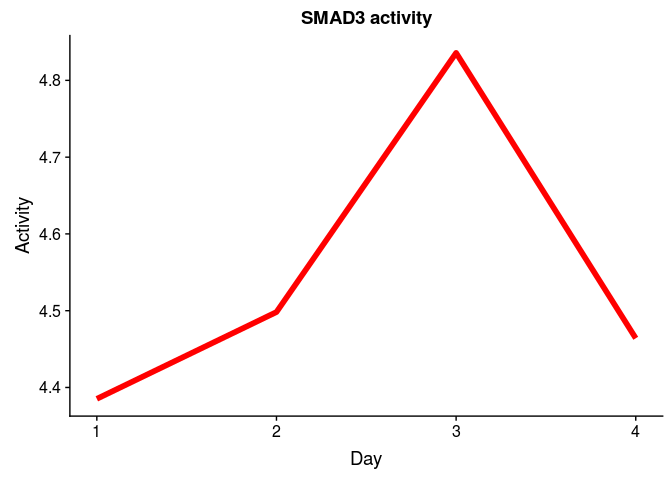

### Continue the analysis (strong)

Perform GSEA for RNA-seq data using RegNetwork gmt file:

``` r
#reading gmt file
set.seed(42)
pathwaysReg <- gmtPathways("~/ESC_RNA_seq/Regulon/Bulk/RegNetworkStrong.gmt")

#without putting into function, for implicity
#for the first 12 hours
geneVector <- genesReferenceAll75748$time12h
names(geneVector) <- rownames(genesReferenceAll75748)
fgseaReg1 <- fgsea(pathwaysReg, geneVector, minSize=5, maxSize=300, nperm=10000)
reg1 <- fgseaReg1 %>% filter(padj < 0.05) %>% nrow()

#for the first 24 hours
geneVector <- genesReferenceAll75748$time24h
names(geneVector) <- rownames(genesReferenceAll75748)
fgseaReg2 <- fgsea(pathwaysReg, geneVector, minSize=5, maxSize=300, nperm=10000)
reg2 <- fgseaReg2 %>% filter(padj < 0.05) %>% nrow()

#for the first 36 hours
geneVector <- genesReferenceAll75748$time36h
names(geneVector) <- rownames(genesReferenceAll75748)
fgseaReg3 <- fgsea(pathwaysReg, geneVector, minSize=5, maxSize=300, nperm=10000)
reg3 <- fgseaReg3 %>% filter(padj < 0.05) %>% nrow()

#for the first 72 hours
geneVector <- genesReferenceAll75748$time72h
names(geneVector) <- rownames(genesReferenceAll75748)
fgseaReg4 <- fgsea(pathwaysReg, geneVector, minSize=5, maxSize=300, nperm=10000)
reg4 <- fgseaReg4 %>% filter(padj < 0.05) %>% nrow()

#for the first 96 hours
geneVector <- genesReferenceAll75748$time96h
names(geneVector) <- rownames(genesReferenceAll75748)
fgseaReg5 <- fgsea(pathwaysReg, geneVector, minSize=5, maxSize=300, nperm=10000)
reg5 <- fgseaReg5 %>% filter(padj < 0.05) %>% nrow()


gseaData <- list(fgseaReg1, fgseaReg2, fgseaReg3, fgseaReg4)
print(c(reg1, reg2, reg3, reg4, reg5))
```

    ## [1] 10 37 29 20 23

TF's that are active at first 12h, compared to 0 day:

``` r
x <- fgseaReg1 %>% filter(padj < 0.05) 
x
```

    ##    pathway         pval       padj        ES      NES nMoreExtreme size
    ## 1   CTNNB1 0.0003875969 0.01845062 0.5148838 1.974638            1   49
    ## 2     EGR1 0.0015455951 0.03448733 0.3980397 1.689350            7   84
    ## 3     ESR1 0.0030769231 0.04800000 0.3764185 1.611862           15   89
    ## 4   NFKBIA 0.0005913661 0.01845062 0.6394533 1.990657            2   21
    ## 5    SMAD1 0.0001952744 0.01845062 0.5905992 2.128604            0   37
    ## 6    SMAD3 0.0003886514 0.01845062 0.4955455 2.016774            1   66
    ## 7    SMAD4 0.0005836576 0.01845062 0.4896706 1.937804            2   57
    ## 8    SMAD5 0.0019896538 0.03448733 0.7275238 1.894688            9   11
    ## 9    SMAD9 0.0019896538 0.03448733 0.7275238 1.894688            9   11
    ## 10  SMURF2 0.0017825312 0.03448733 0.6425688 1.925780            8   18
    ##                                                                                                                                                                                                                                leadingEdge
    ## 1                                                                LEF1, PRKACA, AXIN2, EGFR, TCF7, CCND1, SRC, CSNK2A2, GSK3B, CTNNBIP1, AXIN1, TBL1X, PTPN1, CDH1, CHD8, FBXW11, PRKX, PTPRF, PTPRM, EP300, FYN, BTRC, CREBBP, IGF1R, TJP1
    ## 2                                              TGFB1, MMP14, FGFR3, FASN, EGFR, ACHE, ELK1, COL2A1, ABCA2, CCND1, ATP2A2, CEBPB, RET, WT1, BAX, JUN, VEGFA, BCL2, TIMP2, THBS1, PCSK2, FN1, RELA, ACE, CD44, CHGA, SERPINE1, VAMP2, ANKRD1
    ## 3  SOCS3, EGFR, GADD45B, APOE, PELP1, RARA, AKT1, TERT, CAV1, AKT2, CCND1, SRC, CYP1B1, JUN, JUNB, TFAP2C, CDH1, E2F1, REXO4, CYR61, PTPRG, STAT5A, FBLN1, TNFRSF11B, GADD45A, GADD45G, SERPINB9, TGFA, SP1, MACROD1, SERPINE1, EGF, ESRRA
    ## 4                                                                                                                                   NFKB2, AKT1, AKT2, FBXW11, RELA, TAB1, EIF2AK3, IKBKG, BTRC, NFKB1, CASP8, TRAF2, EIF2AK1, AKT3, IKBKB
    ## 5                                                                                                                                                            ID4, SMAD6, SMAD6, BAMBI, FLNA, ID1, ZEB2, SMAD7, BMPR1A, COL1A1, ID2, NKX2-5
    ## 6                      LEF1, TGFB1, TGFB1, SMAD6, SMAD6, PITX2, COL6A1, GADD45B, SMAD7, COL7A1, JUN, VEGFA, ZFYVE9, PEX6, LAMC1, TFDP1, DOK1, SF3B2, EP300, SP1, SERPINE1, ANKRD1, BTRC, CREBBP, CREBBP, MMP9, MAPK3, AR, TGFB3, EIF4ENIF1
    ## 7                                                                        ID4, LEF1, TGFB1, SMAD6, PITX2, ID1, GADD45B, TCF7, COL7A1, ETS1, JUN, ID2, NKX2-5, DACH1, TFDP1, DOK1, ID3, EP300, SP1, SERPINE1, BTRC, CREBBP, SMAD1, MAPK3, AR
    ## 8                                                                                                                                                                                                      ID4, SMAD6, ID1, SMAD7, BMPR1A, ID2
    ## 9                                                                                                                                                                                                      ID4, SMAD6, ID1, SMAD7, BMPR1A, ID2
    ## 10                                                                                                                                                                         SMAD6, FGFR3, EGFR, SMAD7, KDR, RET, ERBB4, FGFR4, IGF1R, ERBB3

TF's that are active at first 24h, compared to 0 day:

``` r
x <- fgseaReg2 %>% filter(padj < 0.05) 
x
```

    ##    pathway         pval        padj        ES      NES nMoreExtreme size
    ## 1       AR 0.0003785728 0.011811471 0.3591816 1.683854            1  170
    ## 2     ATF4 0.0019940179 0.024561404 0.5507403 1.844064            9   28
    ## 3    CEBPA 0.0026768642 0.024561404 0.3745111 1.620222           13  101
    ## 4    CREB3 0.0099371324 0.045593902 0.7629630 1.714278           48    7
    ## 5  CREB3L1 0.0099371324 0.045593902 0.7629630 1.714278           48    7
    ## 6  CREB3L3 0.0099371324 0.045593902 0.7629630 1.714278           48    7
    ## 7  CREB3L4 0.0099371324 0.045593902 0.7629630 1.714278           48    7
    ## 8    CREB5 0.0058907170 0.037130802 0.8015992 1.721193           28    6
    ## 9   CTNNB1 0.0025505199 0.024561404 0.4660823 1.766148           12   49
    ## 10    EGR1 0.0001940617 0.007727363 0.4691978 1.970533            0   84
    ## 11    ESR1 0.0011571842 0.023274319 0.4004009 1.697060            5   89
    ## 12     FOS 0.0064264849 0.037130802 0.4330067 1.660580           32   52
    ## 13    GLI1 0.0021679149 0.024561404 0.4928828 1.808813           10   43
    ## 14    GLI2 0.0023636006 0.024561404 0.5001676 1.805620           11   40
    ## 15    GLI3 0.0011818003 0.023274319 0.5137304 1.854582            5   40
    ## 16     HTT 0.0070735651 0.038050902 0.6549120 1.774508           34   13
    ## 17   IKBKB 0.0115514838 0.048703553 0.4836265 1.663885           57   32
    ## 18   IKBKG 0.0011935548 0.023274319 0.5446358 1.921609            5   36
    ## 19     JUN 0.0026300958 0.024561404 0.3283490 1.553749           13  182
    ## 20    LEF1 0.0035454008 0.029109607 0.4853434 1.752104           17   40
    ## 21   NFKB1 0.0053763441 0.037130802 0.3038066 1.449709           28  191
    ## 22   NFKB2 0.0110887097 0.048703553 0.5560623 1.720299           54   21
    ## 23  NFKBIA 0.0018145161 0.024561404 0.6104653 1.888606            8   21
    ## 24  NFKBIB 0.0094491355 0.045593902 0.6313587 1.753832           46   14
    ## 25     PGR 0.0054173355 0.037130802 0.5080156 1.734453           26   31
    ## 26   PPARA 0.0112426036 0.048703553 0.3971012 1.578354           56   63
    ## 27    RARA 0.0039138943 0.030528376 0.4055435 1.653959           19   72
    ## 28    RBPJ 0.0063681592 0.037130802 0.5872800 1.777161           31   19
    ## 29   RBPJL 0.0063681592 0.037130802 0.5872800 1.777161           31   19
    ## 30    RELA 0.0061668915 0.037130802 0.3520440 1.530243           31  105
    ## 31   SMAD1 0.0001981375 0.007727363 0.6502337 2.309348            0   37
    ## 32   SMAD2 0.0015980823 0.024561404 0.5523248 1.876388            7   30
    ## 33   SMAD3 0.0001953125 0.007727363 0.5783692 2.322157            0   66
    ## 34   SMAD4 0.0001957330 0.007727363 0.5314831 2.078016            0   57
    ## 35   SMAD5 0.0028340081 0.024561404 0.7164216 1.847764           13   11
    ## 36   SMAD9 0.0028340081 0.024561404 0.7164216 1.847764           13   11
    ## 37  TFAP2A 0.0069469835 0.038050902 0.2899659 1.416072           37  231
    ##                                                                                                                                                                                                                                                                                                                                                                                                                                                                                    leadingEdge
    ## 1                                                                                                                                                                                                GATA3, TGFB1, CITED2, KHSRP, KLF5, TCF7, JUN, FADS2, NCOR2, GADD45B, HOXA1, SEMA6B, ETS1, PPP2R2C, AKT1, ELK1, LCP1, FGFBP1, CCND1, ELF4, RARA, APOE, FGF8, EGFR, CYP26A1, ATP2A2, VEGFA, GADD45A, SCARB1, SMPD1, POU5F1, ADIPOR2, PKD1, ADAMTS3, TNFRSF11B, NRIP1, ZMIZ1, RARG, BCL2, CRABP2
    ## 2                                                                                                                                                                                                                                                                                                                                                                       MAPKAPK2, RPS6KA4, PRKACA, PPP1R15A, PPP1R15A, HPGD, GSK3B, PRKX, CXCR5, EP300, MKNK2, CREBBP, RPS6KA1, PTGS2, RPS6KA3
    ## 3                                                                                                                                                                                                                                                                          TGFB1, TFAP2A, FASN, GSK3A, ELK1, ITGA5, FGFBP1, CCND1, AEBP1, SREBF2, SREBF1, RUNX1, GADD45A, FN1, GSK3B, SLC9A1, ABCC1, ACACA, F3, TIMP2, IRS1, CDK2, BCL2, MYBL1, SP1, CCNE1, E2F1, HOMER3, RB1, ITGB2, ACE, ELN
    ## 4                                                                                                                                                                                                                                                                                                                                                                                                                                                           PRKACA, GSK3B, PRKX, EP300, CREBBP
    ## 5                                                                                                                                                                                                                                                                                                                                                                                                                                                           PRKACA, GSK3B, PRKX, EP300, CREBBP
    ## 6                                                                                                                                                                                                                                                                                                                                                                                                                                                           PRKACA, GSK3B, PRKX, EP300, CREBBP
    ## 7                                                                                                                                                                                                                                                                                                                                                                                                                                                           PRKACA, GSK3B, PRKX, EP300, CREBBP
    ## 8                                                                                                                                                                                                                                                                                                                                                                                                                                                           PRKACA, GSK3B, PRKX, EP300, CREBBP
    ## 9                                                                                                                                                                                                                                                                                                                                                    LEF1, TCF7, PRKACA, AXIN2, CCND1, CSNK2A2, EGFR, SRC, GSK3B, PRKX, CTNNBIP1, PTPN1, AXIN1, TBL1X, PTPRM, CHD8, CDH1, FBXW11, EP300, PTPRF
    ## 10                                                                                                                                                                                                                                                                                                                                  ANKRD1, TGFB1, MMP14, FGFR3, FASN, JUN, ACHE, WT1, ELK1, CEBPB, CCND1, THBS1, PCSK2, EGFR, ATP2A2, BAX, VEGFA, FN1, TFPI2, COL2A1, DUSP4, ABCA2, F3, TIMP2
    ## 11                                                                                                                                                                                                                                                                                   CYP1B1, SOCS3, JUN, GADD45B, CAV1, AKT1, CCND1, CYR61, AKT2, PELP1, RARA, APOE, EGFR, SRC, SERPINB9, GADD45A, TERT, NR3C2, FBLN1, TNFRSF11B, TGFA, PTPRG, REXO4, SP1, JUNB, SERPINE1, E2F1, CDH1, GADD45G
    ## 12                                                                                                                                                                                                                                                                                                                                                                                                         TGFB1, FASN, KRT16, NTS, ETS1, ITGA5, CCND1, CCND1, CA2, MAPK8, HRAS, VEGFA, HSPA1A
    ## 13                                                                                                                                                                                                                                                                                                                                                                                         WNT5B, WNT3, WNT8A, BMP2, PRKACA, PTCH2, PTCH1, BMP4, CSNK1G2, CSNK1D, GSK3B, PRKX, PVR, BCL2, SUFU
    ## 14                                                                                                                                                                                                                                                                                                                                                                                                          WNT5B, WNT3, WNT8A, BMP2, PRKACA, PTCH2, PTCH1, BMP4, CSNK1G2, CSNK1D, GSK3B, PRKX
    ## 15                                                                                                                                                                                                                                                                                                                                                                                                     WNT5B, WNT3, WNT8A, BMP2, PRKACA, PTCH2, PTCH1, BMP4, CSNK1G2, CSNK1D, GSK3B, PRKX, PVR
    ## 16                                                                                                                                                                                                                                                                                                                                                                                                                                        AP2A1, CLTB, AP2B1, AP2A2, CLTA, ITPR1, CLTC, GRIN2B
    ## 17                                                                                                                                                                                                                                                                                                                                                                                               NFKB2, IRS4, AKT1, AKT2, MAP3K8, TAB3, IRS1, MAP3K14, RELB, NFKB1, RIPK1, NFKBIB, CASP8, TAB1
    ## 18                                                                                                                                                                                                                                                                                                                                                                        NFKB2, IRS4, TBKBP1, AKT1, AKT2, MAP3K8, CARD11, TAB3, IRS1, MALT1, MAP3K14, RELB, NFKB1, RIPK1, NFKBIB, CASP8, TAB1
    ## 19                                                                                                                                                         TGFB1, SMAD6, FASN, APP, NFKB2, JUN, KRT16, TNC, NTS, ETS1, IGFBP2, LCP1, ATF3, FGFBP1, CCND1, CCND1, VIM, PDGFRB, APOE, MAPK8, IER5, HRAS, ATP2A2, VEGFA, UBTF, GJA1, TFPI2, TNFRSF10A, ETS2, EMILIN1, MGAT5B, GALC, F3, TIMP2, NCL, DHX34, NIN, COL1A1, DMD, PGF, MAPK10, KCNMB1, EXOC3, ACSS2, MMP2, MTCH1, SERPINE1, GM2A, RELB
    ## 20                                                                                                                                                                                                                                                                                                                                                                                                                                            LEF1, SOX17, CD1D, JUN, MARK4, CCND1, CCND1, VIM
    ## 21                                                                                                                                                           ATP12A, MSX1, IER3, SOCS3, FASN, RAC3, ID1, ADORA1, TNC, WT1, ETS1, PPP2R2C, IGFBP2, AKT1, AKT1, ELK1, ATF3, CCND1, TRAF4, VIM, CSNK2A2, AKT2, MAP3K8, MAP3K8, APOE, VEGFA, GADD45A, FN1, TFPI2, TNFRSF10A, TRAF3, F3, VIPR1, COL1A1, PPP2R4, PGF, BCL2, JAG2, TOP1, IKBKG, JUNB, MAP3K14, RELB, RIPK1, NFKBIB, LYN, MMP9, RALBP1
    ## 22                                                                                                                                                                                                                                                                                                                                                                                 CCND1, TRAF4, EGFR, TRAF3, BCL2, IKBKG, MAP3K14, RELA, PTGS2, NFKBIA, CHUK, TRAF2, TRAF5, XIAP, NOS2, IKBKB
    ## 23                                                                                                                                                                                                                                                                                                                                                                                NFKB2, AKT1, AKT2, IKBKG, NFKB1, EIF2AK3, CASP8, TAB1, FBXW11, BTRC, RELA, AKT3, CHUK, EIF2AK1, TRAF2, IKBKB
    ## 24                                                                                                                                                                                                                                                                                                                                                                                                                 AKT1, AKT2, IKBKG, NFKB1, TAB1, FBXW11, BTRC, RELA, AKT3, CHUK, IKBKB, TAB2
    ## 25                                                                                                                                                                                                                                                                                                                                                                                                                        JUN, PFKFB3, MAPK8, VEGFA, PIK3R1, PIK3R2, PIK3CB, TGFA, MAPK10, EGF
    ## 26                                                                                                                                                                                                                                                                                                                                                                                        GATA3, TGFB1, CITED2, FADS2, GADD45B, SEMA6B, AKT1, CCND1, VEGFA, GADD45A, SLC27A4, ADIPOR2, ADIPOR2
    ## 27                                                                                                                                                                                                                                                                                                                                                   TGFB1, KHSRP, KLF5, TCF7, JUN, NCOR2, GADD45B, HOXA1, ETS1, ELF4, RARA, CYP26A1, VEGFA, GADD45A, SMPD1, POU5F1, NRIP1, RARG, BCL2, CRABP2
    ## 28                                                                                                                                                                                                                                                                                                                                                                                                                     NCOR2, NOTCH1, MAML3, MAML1, NOTCH2, NOTCH3, EP300, KAT2A, HES1, CREBBP
    ## 29                                                                                                                                                                                                                                                                                                                                                                                                                     NCOR2, NOTCH1, MAML3, MAML1, NOTCH2, NOTCH3, EP300, KAT2A, HES1, CREBBP
    ## 30                                                                                                                                                                                                                                                                                                  MMP14, SOCS3, NFKB2, RAC3, WT1, PPP2R2C, AKT1, AKT1, CCND1, TRAF4, AKT2, EGFR, VEGFA, FN1, TNFRSF10A, TRAF3, CXCR5, F3, COL1A1, PGF, BCL2, IKBKG, MAP3K14, RELB, BCL3, NFKBIB, CASP8, MMP9
    ## 31                                                                                                                                                                                                                                                                                                                                                                                    ANKRD1, ID4, SMAD6, SMAD6, BAMBI, ZEB2, FLNA, ID1, CDKN2B, NKX2-5, SMAD7, BMPR1A, ID2, TNFRSF11B, COL1A1
    ## 32                                                                                                                                                                                                                                                                                                                                                                                                           TGFB1, SMAD6, PITX2, TNC, CDKN2B, SMAD7, ZFYVE9, TFDP1, SP1, EP300, CREBBP, TGFB3
    ## 33                                                                                                                                                                                                                                                                                  ANKRD1, LEF1, TGFB1, TGFB1, SMAD6, SMAD6, PITX2, COL6A1, JUN, TNC, GADD45B, CDKN2B, VEGFA, SMAD7, COL7A1, LAMC1, PEX6, ZFYVE9, TFDP1, DOK1, SP1, SERPINE1, MMP9, EP300, SF3B2, CREBBP, CREBBP, TGFB3, BTRC
    ## 34                                                                                                                                                                                                                                                                                                                                                   LEF1, TGFB1, ID4, SMAD6, PITX2, TCF7, JUN, ID1, TNC, GADD45B, ETS1, CDKN2B, NKX2-5, COL7A1, ID2, TFDP1, DACH1, FOXH1, DOK1, SP1, SERPINE1
    ## 35                                                                                                                                                                                                                                                                                                                                                                                                                                                    ID4, SMAD6, ID1, SMAD7, BMPR1A, ID2, ID3
    ## 36                                                                                                                                                                                                                                                                                                                                                                                                                                                    ID4, SMAD6, ID1, SMAD7, BMPR1A, ID2, ID3
    ## 37 ATP12A, TFAP2A, COL6A2, FGFR3, FASN, KRT16, ACHE, KCNA5, ODC1, PFKFB3, ETS1, IGFBP2, L1CAM, ATP1A1, PIM1, APOE, EGFR, HRAS, ATP2A2, SRC, MAN2B1, VEGFA, HSPA1A, UBTF, SMPD1, RECQL4, PPL, SLC19A1, ETS2, GALC, F3, TIMP2, NR3C2, HTT, NCL, FBLN1, DHX34, POLD1, VIPR1, SPRY2, GNAI2, LAMB1, TGFA, ALDH3A2, CRABP2, TOP1, HOOK2, EXOC3, ADRA1D, MMP2, SP1, NF1, B4GALT5, SERPINE1, GM2A, ITPR1, ATP1A3, ADD1, LRP8, SNAP91, CTSD, FLII, CELSR1, MGAT3, ELN, SRM, TNPO1, MBTPS1, GALNS, HSPB1

TF's that are active at first 36h, compared to 0 day:

``` r
y <- fgseaReg3 %>% filter(padj < 0.05) 
y
```

    ##    pathway         pval        padj        ES      NES nMoreExtreme size
    ## 1       AR 0.0001897173 0.003443937 0.4049414 1.875716            0  170
    ## 2     ATF4 0.0088932806 0.047839717 0.5135659 1.691785           44   28
    ## 3   CTNNB1 0.0075964160 0.045578496 0.4447735 1.669441           38   49
    ## 4     EGR1 0.0001934236 0.003443937 0.4693060 1.945948            0   84
    ## 5      ERG 0.0005972526 0.006233766 0.7262180 2.068164            2   16
    ## 6     ESR1 0.0001938736 0.003443937 0.4336978 1.813088            0   89
    ## 7      FOS 0.0001956182 0.003443937 0.4989737 1.890925            0   52
    ## 8     GLI1 0.0001983340 0.003443937 0.5617504 2.047113            0   43
    ## 9     GLI2 0.0005994006 0.006233766 0.5453860 1.950919            2   40
    ## 10    GLI3 0.0003996004 0.005194805 0.5651247 2.021527            1   40
    ## 11     HTT 0.0017964072 0.016484678 0.7073646 1.896711            8   13
    ## 12   IKBKB 0.0074773711 0.045578496 0.5068697 1.726256           37   32
    ## 13   IKBKG 0.0021657807 0.018770099 0.5158603 1.808007           10   36
    ## 14     JUN 0.0003765060 0.005194805 0.3561565 1.665052            1  182
    ## 15    LEF1 0.0005994006 0.006233766 0.5380096 1.924533            2   40
    ## 16  NFKBIA 0.0065567256 0.044471704 0.5794248 1.774569           32   21
    ## 17  NFKBIB 0.0071556351 0.045578496 0.6504373 1.785470           35   14
    ## 18     PGR 0.0088530395 0.047839717 0.4998228 1.689687           44   31
    ## 19   PPARA 0.0013597514 0.013257576 0.4468241 1.760772            6   63
    ## 20   PPARG 0.0057758953 0.040956348 0.3877501 1.586954           29   78
    ## 21    RARA 0.0001936483 0.003443937 0.4724377 1.902257            0   72
    ## 22   SMAD1 0.0001986887 0.003443937 0.6668481 2.347887            0   37
    ## 23   SMAD2 0.0003943218 0.005194805 0.6051162 2.029240            1   30
    ## 24   SMAD3 0.0001936483 0.003443937 0.6112200 2.428635            0   66
    ## 25   SMAD4 0.0001953125 0.003443937 0.5376407 2.078229            0   57
    ## 26  SMURF2 0.0084779180 0.047839717 0.5934899 1.748473           42   18
    ## 27    SOS1 0.0039674668 0.029472610 0.7199241 1.847638           19   11
    ## 28    SOS2 0.0039674668 0.029472610 0.7199241 1.847638           19   11
    ## 29  TFAP2A 0.0024244685 0.019906162 0.3039426 1.466398           12  231
    ##                                                                                                                                                                                                                                                                                                                                                                                                                    leadingEdge
    ## 1                                                                                                                                 TGFB1, GATA3, KLF5, HOXA1, CITED2, KHSRP, ETS1, TNFRSF11B, TCF7, JUN, CYP26A1, NCOR2, FADS2, AKT1, SMPD1, GADD45G, ELK1, LCP1, GADD45A, ADAMTS3, SERPINE1, RARA, ATP2A2, PPP2R2C, ELF4, PLAU, GADD45B, SCARB1, HOXB4, CRABP2, CCND1, IL6ST, APOE, SEMA6B, FGF8, NRIP1, ADIPOR2, ZMIZ1, VEGFA
    ## 2                                                                                                                                                                                                                                                                                                              MAPKAPK2, RPS6KA4, PPP1R15A, PPP1R15A, PRKACA, GSK3B, PRKX, CREBBP, MKNK2, EP300, HPGD, RPS6KA1, CAMK4, RPS6KA3
    ## 3                                                                                                                                                                                                                                                                                                       LEF1, TCF7, SRC, PRKACA, CSNK2A2, AXIN2, PTPRM, TBL1X, CCND1, GSK3B, PTPN1, AXIN1, CCND3, PRKX, FBXW11, CHD8, CTNNBIP1
    ## 4                                                                                                                                                                                                                                                         ANKRD1, MMP14, TGFB1, FGFR3, FASN, PCSK2, WT1, JUN, FN1, ACHE, ELK1, CD44, SERPINE1, ATP2A2, PLAU, CRABP2, CCND1, BAX, TFPI2, ACE, THBS1, CEBPB, VEGFA, IL2RB, TIMP2
    ## 5                                                                                                                                                                                                                                                                                                                                                                       VIM, TNC, ANPEP, JUN, MMP2, COL11A2, MMP9, SETDB1, VWF
    ## 6                                                                                                                                                                                                SOCS3, TNFRSF11B, JUN, SRC, CYP1B1, AKT1, CAV1, GADD45G, GADD45A, SERPINE1, RARA, AKT2, JUNB, FBLN1, PELP1, GADD45B, EGF, CCND1, SERPINB9, APOE, CYR61, E2F1, PTPRG, SERPINB5, REXO4, TGFA, STAT5A, HSPB1, SP1, GRIN2D, CRHBP
    ## 7                                                                                                                                                                                                                                                                                      TGFB1, ITGA5, ETS1, FASN, NTS, CA2, PENK, MAPK8, HRAS, CCND1, CCND1, MAPK10, MMP2, HSPA1A, ELN, VEGFA, PGF, MAPK12, MAPK11, MMP9, KRT16
    ## 8                                                                                                                                                                                                                                                                                      BMP4, WNT5B, WNT3, BMP2, WNT8A, WNT5A, PTCH1, PRKACA, PVR, CSNK1G2, PTCH2, CSNK1D, GSK3B, BNC1, BMP5, SUFU, PRKX, FBXW11, WNT3A, CSNK1E
    ## 9                                                                                                                                                                                                                                                                                                 BMP4, WNT5B, WNT3, BMP2, WNT8A, WNT5A, PTCH1, PRKACA, CSNK1G2, PTCH2, CSNK1D, GSK3B, BMP5, SUFU, PRKX, FBXW11, WNT3A, CSNK1E
    ## 10                                                                                                                                                                                                                                                                                           BMP4, WNT5B, WNT3, BMP2, WNT8A, WNT5A, PTCH1, PRKACA, PVR, CSNK1G2, PTCH2, CSNK1D, GSK3B, BMP5, SUFU, PRKX, FBXW11, WNT3A, CSNK1E
    ## 11                                                                                                                                                                                                                                                                                                                                                                                ITPR1, AP2A1, CLTA, AP2A2, AP2B1, CLTB, CLTC
    ## 12                                                                                                                                                                                                                                                                                                   NFKB2, AKT1, AKT2, IRS4, IRS1, CASP8, TAB3, MAP3K14, NFKB1, AKT3, IRAK3, RIPK1, NFKBIB, IRAK1, RELA, TAB1, MAP3K8, NFKBIA
    ## 13                                                                                                                                                                                                                                                                                          NFKB2, AKT1, TBKBP1, AKT2, IRS4, IRS1, CASP8, TAB3, MALT1, CARD11, MAP3K14, NFKB1, AKT3, RIPK1, NFKBIB, RELA, TAB1, MAP3K8, NFKBIA
    ## 14                                                             TGFB1, SMAD6, VIM, TNC, ETS1, FASN, NTS, APP, NFKB2, JUN, PENK, LCP1, IER5, CD44, SERPINE1, COL1A1, PDGFRB, MAPK8, ATP2A2, GJA1, EMILIN1, HRAS, ATF3, IGFBP2, CCND1, CCND1, MAPK10, TFPI2, APOE, MMP2, ACE, COL3A1, UBTF, ELN, ETS2, GALC, VEGFA, IL2RB, TIMP2, PGF, NCL, MAPK12, MAPK11, NIN, TNFRSF10A, CCND3, DHX34, KCNMB1, POMC, MTCH1, MMP9, KRT16, EXOC3
    ## 15                                                                                                                                                                                                                                                                                                                            LEF1, VIM, CD1D, SOX17, JUN, MARK4, NRCAM, CCND1, CCND1, EDA, NCAM1, CCND3, TCF3, CREBBP, CSNK1E
    ## 16                                                                                                                                                                                                                                                                                                                              NFKB2, AKT1, AKT2, IKBKG, CASP8, FBXW11, NFKB1, EIF2AK3, AKT3, RELA, TAB1, CHUK, BTRC, EIF2AK1
    ## 17                                                                                                                                                                                                                                                                                                                                                              AKT1, AKT2, IKBKG, FBXW11, NFKB1, AKT3, RELA, TAB1, CHUK, BTRC
    ## 18                                                                                                                                                                                                                                                                                                                                                JUN, PFKFB3, MAPK8, EGF, MAPK10, PIK3R1, VEGFA, PIK3R2, MAPK12, TGFA, MAPK11
    ## 19                                                                                                                                                                                                                                                                                   TGFB1, GATA3, CITED2, FADS2, AKT1, GADD45G, GADD45A, SERPINE1, GADD45B, CCND1, SEMA6B, ADIPOR2, ADIPOR2, VEGFA, SLC27A4, ME1, MMP9, ACAA1
    ## 20                                                                                                                                                                                                                                                                     GATA3, TNFRSF11B, AKT1, RXRG, GADD45G, GADD45A, ADAMTS3, SERPINE1, ATP2A2, PPP2R2C, GADD45B, SCARB1, CCND1, APOE, SEMA6B, RXRA, ADIPOR2, VEGFA, SLC27A4
    ## 21                                                                                                                                                                                                                                                                                 TGFB1, KLF5, HOXA1, KHSRP, ETS1, TCF7, JUN, CYP26A1, NCOR2, SMPD1, GADD45G, GADD45A, RARA, ELF4, PLAU, GADD45B, HOXB4, CRABP2, NRIP1, VEGFA
    ## 22                                                                                                                                                                                                                                                                                                 ANKRD1, ZEB2, SMAD6, SMAD6, BAMBI, ID4, TNFRSF11B, FLNA, NKX2-5, ZEB1, SERPINE1, CDKN2B, COL1A1, SMAD7, ID1, COL3A1, IGFBP3
    ## 23                                                                                                                                                                                                                                                                                                                                                   TGFB1, SMAD6, PITX2, TNC, CDKN2B, SMAD7, TFDP1, ZFYVE9, TGFB3, ACVR1, SP1
    ## 24                                                                                                                                                                                                        ANKRD1, TGFB1, TGFB1, LEF1, SMAD6, SMAD6, PITX2, TNC, COL6A1, JUN, SERPINE1, CDKN2B, PEX6, SMAD7, GADD45B, COL3A1, VEGFA, LAMC1, COL7A1, TFDP1, ZFYVE9, TGFB3, ACVR1, COL6A3, SP1, MMP9, SF3B2, CREBBP, CREBBP, EDN1
    ## 25                                                                                                                                                                                                                         TGFB1, LEF1, SMAD6, ID4, PITX2, TNC, ETS1, TCF7, JUN, NKX2-5, DACH1, SERPINE1, CDKN2B, GADD45B, ID1, COL7A1, TFDP1, FOXH1, SP1, CREBBP, EDN1, BGN, SMAD3, EP300, DOK1, ID3, SMAD1, APOB, ID2, MAPK3
    ## 26                                                                                                                                                                                                                                                                                                                                                                                     SMAD6, PDGFRA, FGFR3, ERBB4, KDR, SMAD7
    ## 27                                                                                                                                                                                                                                                                                                                                                                            SPRY3, SPRY4, CCND1, SPRED2, SPRY2, CCND3, SPRY1
    ## 28                                                                                                                                                                                                                                                                                                                                                                            SPRY3, SPRY4, CCND1, SPRED2, SPRY2, CCND3, SPRY1
    ## 29 ATP12A, COL6A2, FGFR3, L1CAM, ETS1, FASN, ODC1, SRC, PFKFB3, SMPD1, ACHE, PENK, ATP1A1, FLI1, TFAP2A, ITPR1, SERPINE1, LAMB1, ATP2A2, FBLN1, HRAS, CRABP2, KCNA5, IGFBP2, APOE, MMP2, SLC19A1, UBTF, MAN2B1, HSPA1A, ELN, ETS2, GALC, MGAT3, RECQL4, VEGFA, IGFBP3, PIM1, IL2RB, GNAI2, TIMP2, HTT, SPRY2, NCL, TOP1, TGFA, VIPR1, ADD1, POLD1, DHX34, NRG2, SDC4, TGFB3, HSPB1, NF1, SP1, POMC, SPHK1, KRT16, EXOC3, BACE1

TF's that are active at first 72h, compared to 0 day:

``` r
z <- fgseaReg4 %>% filter(padj < 0.05) 
z
```

    ##    pathway         pval        padj        ES      NES nMoreExtreme size
    ## 1       AR 0.0001897893 0.006231276 0.3697631 1.692152            0  170
    ## 2     EGR1 0.0001940241 0.006231276 0.4944220 2.028199            0   84
    ## 3      ERG 0.0008011216 0.015621871 0.7018959 1.978029            3   16
    ## 4     ESR1 0.0033242081 0.028809803 0.3948357 1.634007           16   89
    ## 5      FOS 0.0013947001 0.021705480 0.4866775 1.813596            6   52
    ## 6     GLI1 0.0019829467 0.025035105 0.5027000 1.805693            9   43
    ## 7     GLI2 0.0023885350 0.025035105 0.5264844 1.859532           11   40
    ## 8     GLI3 0.0029856688 0.027529412 0.5181450 1.830078           14   40
    ## 9      JUN 0.0015305146 0.021705480 0.3406975 1.571706            7  182
    ## 10    LEF1 0.0005971338 0.013307552 0.5594820 1.976079            2   40
    ## 11   NFKB1 0.0021016431 0.025035105 0.3302162 1.532413           10  191
    ## 12  NFKBIA 0.0024072217 0.025035105 0.6117520 1.852063           11   21
    ## 13    RARA 0.0061192262 0.047729964 0.4071546 1.619368           30   72
    ## 14   SMAD1 0.0001973165 0.006231276 0.6876603 2.389183            0   37
    ## 15   SMAD2 0.0003945551 0.010258434 0.6123936 2.029809            1   30
    ## 16   SMAD3 0.0001971998 0.006231276 0.6333049 2.479645            0   66
    ## 17   SMAD4 0.0001997204 0.006231276 0.5698920 2.166101            0   57
    ## 18  SMURF2 0.0012007204 0.020812487 0.6629809 1.925719            5   18
    ## 19  TFAP2A 0.0058424425 0.047729964 0.2992377 1.421143           30  231
    ## 20    WWP1 0.0030000000 0.027529412 0.6761004 1.839123           14   14
    ##                                                                                                                                                                                                                                                                                                                                                                                                                              leadingEdge
    ## 1                                                                                                                           CYP26A1, TGFB1, CITED2, TNFRSF11B, GATA3, KLF5, IL6ST, ECM1, PLAU, GADD45A, ETS1, KHSRP, CYP27A1, FGF8, SMPD1, HOXB4, FADS2, AKT1, CRABP2, JUN, CDKN1A, NFKBIA, CDH13, APOE, MYB, ELK1, RARA, GADD45B, ADAMTS3, IGFBP5, TGFB2, NCOR2, EGFR, ELF4, RARB, MMP9, ATP2A2, ADIPOR2, SEMA6B, ACPP, NEDD9, SERPINE1
    ## 2                                                                                                                                                                                                         MMP14, ANKRD1, TGFB1, IGF2, DUSP4, PCSK2, PLAU, FN1, FGFR3, TFPI2, GDF15, ACHE, CRABP2, FASN, JUN, CDH13, ABCA2, MYB, TIMP3, ELK1, BAX, ACE, CCKBR, F3, IL2RB, TIMP2, EGFR, ATP2A2, THBS1, SERPINE1, VAMP2, RB1, VEGFA, COL2A1
    ## 3                                                                                                                                                                                                                                                                                                                                                                                    VIM, TNC, VWF, ANPEP, JUN, MMP2, MMP9, SETDB1, FLT1
    ## 4                                                                                                                                                                                                                                                                   CRHBP, TNFRSF11B, SOCS3, HOXA10, CYP1B1, SRC, GADD45A, FBLN1, AKT1, EGF, C3, JUN, CDKN1A, APOE, MYB, RARA, GADD45B, AKT2, ITGB1, JUNB, HSPB1, EGFR, SERPINB9, STAT5A
    ## 5                                                                                                                                                                                                                                TGFB1, PENK, ITGA5, NTS, MAPK8, ETS1, MAPK10, FASN, CDKN1A, CA2, ELN, VEGFC, PGF, MMP2, MMP9, MAPK12, VEGFA, MAPK14, HRAS, KRAS, MAPK3, VEGFB, HSPA1A, MAPK9, NRAS, MAPK13, SMAD4, MAPK11, CCND1, CCND1
    ## 6                                                                                                                                                                                                                                                                                                                   BMP4, WNT4, WNT3, WNT5B, BMP2, PRKACA, WNT9B, WNT11, PTCH2, PTCH1, CSNK1G2, BMP5, GSK3B, CSNK1D, SUFU, WNT5A, FBXW11
    ## 7                                                                                                                                                                                                                                                                                                                   BMP4, WNT4, WNT3, WNT5B, BMP2, PRKACA, WNT9B, WNT11, PTCH2, PTCH1, CSNK1G2, BMP5, GSK3B, CSNK1D, SUFU, WNT5A, FBXW11
    ## 8                                                                                                                                                                                                                                                                                                                   BMP4, WNT4, WNT3, WNT5B, BMP2, PRKACA, WNT9B, WNT11, PTCH2, PTCH1, CSNK1G2, BMP5, GSK3B, CSNK1D, SUFU, WNT5A, FBXW11
    ## 9                                                                                                                                           TGFB1, COL3A1, VIM, TNC, PENK, SMAD6, COL1A1, IGFBP2, ATF3, NFKB2, APP, NTS, MAPK8, ETS1, GALC, MAPK10, LOX, TFPI2, OXTR, FASN, JUN, CDKN1A, APOE, MYB, ELN, VEGFC, TCIRG1, PGF, EMILIN1, ACE, NTRK1, ACSS2, F3, ETS2, MMP2, PDGFRB, IL2RB, TIMP2, NPY, IER5, GJA1, CCL2, DPYD, MMP9, ATP2A2
    ## 10                                                                                                                                                                                                                                                                                                                                                                                SOX17, VIM, LEF1, MARK4, NRCAM, CD1D, NCAM1, MITF, JUN
    ## 11                                                                                                                                         VIM, TNC, IER3, SOCS3, COL1A1, VWF, ATP12A, TLR4, MSX1, ADORA1, IGFBP2, ATF3, PLAU, RAC3, GADD45A, FN1, ETS1, TFPI2, IL1R1, IL1R1, AKT1, AKT1, TRAF4, FASN, NFKBIA, NFKBIA, CDH13, APOE, MYB, MAP3K8, MAP3K8, ELK1, VEGFC, CXCL5, PGF, F3, AKT2, CSNK2A2, JUNB, HSPB1, CCL2, DPYD, MMP9, JAG2
    ## 12                                                                                                                                                                                                                                                                                                                          NFKB2, AKT1, AKT2, AKT3, FBXW11, EIF2AK3, EIF2AK1, TAB2, CASP8, BTRC, RELA, TAB1, NFKB1, MAP3K7, IKBKG, CHUK
    ## 13                                                                                                                                                                                                                                                                 CYP26A1, TGFB1, KLF5, PLAU, GADD45A, ETS1, KHSRP, SMPD1, HOXB4, CRABP2, JUN, CDKN1A, HNF4A, CDH13, RARA, GADD45B, TGFB2, NCOR2, ELF4, RARB, NEDD9, VEGFA, TCF7, NRIP1
    ## 14                                                                                                                                                                                                                                                                                                                                  ANKRD1, COL3A1, ZEB2, TNFRSF11B, SMAD6, SMAD6, CDKN2B, BAMBI, COL1A1, ID4, ZEB1, GDF15, FLNA, CDKN1A
    ## 15                                                                                                                                                                                                                                                                                                           TGFB1, TNC, PITX2, SMAD6, CDKN2B, CDKN1A, ZFYVE9, TGFB3, TGFB2, SMAD7, E2F5, SP1, TFDP1, MAPK3, SMAD4, ZFYVE16, RBL2, ACVR1
    ## 16                                                                                                                                                                                          ANKRD1, TGFB1, TGFB1, COL3A1, TNC, PITX2, SMAD6, SMAD6, CDKN2B, COL6A1, LEF1, COL6A3, JUN, CDKN1A, HNF4A, GADD45B, ZFYVE9, TGFB3, PEX6, TGFB2, ART4, CCL2, MMP9, SERPINE1, LAMC1, VEGFA, SMAD7, E2F5, SP1, EDN1, TFDP1, COL7A1, MAPK3, ZFP36
    ## 17                                                                                                                                                                                                                                                          TGFB1, TNC, PITX2, SMAD6, CDKN2B, DACH1, LEF1, ID4, ETS1, JUN, CDKN1A, HNF4A, GADD45B, ART4, CCL2, SERPINE1, BGN, TCF7, E2F5, SP1, EDN1, TFDP1, NKX2-5, COL7A1, MAPK3, ZFP36
    ## 18                                                                                                                                                                                                                                                                                                                                                                            ERBB4, SMAD6, PDGFRA, FGFR3, KDR, NTRK1, EGFR, SMAD7, FLT1
    ## 19 IGF2, COL6A2, PENK, KCNA5, L1CAM, FLI1, ATP12A, IGFBP2, SRC, ETS1, GALC, FGFR3, SMPD1, FBLN1, ITPR1, ACHE, OXTR, CRABP2, ATP1A1, FASN, CDKN1A, APOE, MYB, ELN, PFKFB3, VEGFC, NPR1, PIM1, CXCL5, SPRY2, NTRK1, MAN2B1, F3, TGFB3, ETS2, LAMB1, MMP2, ITGB1, IL2RB, TIMP2, HSPB1, MGAT3, GNAI2, EGFR, NRGN, ATP2A2, SERPINE1, SPHK1, AKR1C1, ADD1, SDC4, NR3C1, SLPI, VEGFA, NID1, F2R, NRG2, EXOC3, HEXB, HTT, BACE1, SP1, CALB2, NF1
    ## 20                                                                                                                                                                                                                                                                                                                                                                                                ERBB4, PDGFRA, FGFR3, KDR, NTRK1, EGFR

TF's that are active at first 96h, compared to 0 day:

``` r
z <- fgseaReg5 %>% filter(padj < 0.05) 
z
```

    ##    pathway         pval        padj        ES      NES nMoreExtreme size
    ## 1     ABL1 0.0034074965 0.027977340 0.5231764 1.762700           16   33
    ## 2       AR 0.0001911315 0.003130016 0.3564699 1.619996            0  170
    ## 3     ATF2 0.0018130540 0.017677276 0.5918694 1.850351            8   24
    ## 4     EGR1 0.0001953125 0.003130016 0.4869127 1.993245            0   84
    ## 5      ERG 0.0002006421 0.003130016 0.7117834 2.001359            0   16
    ## 6     ESR1 0.0021632252 0.019850772 0.4059508 1.677910           10   89
    ## 7      FOS 0.0005900865 0.007081039 0.5005720 1.865416            2   52
    ## 8     GLI1 0.0001990050 0.003130016 0.5650696 2.021324            0   43
    ## 9     GLI2 0.0003974563 0.005166932 0.5545866 1.954778            1   40
    ## 10    GLI3 0.0003974563 0.005166932 0.5633372 1.985622            1   40
    ## 11     JUN 0.0001901502 0.003130016 0.3698614 1.696649            0  182
    ## 12    LEF1 0.0001987281 0.003130016 0.6266981 2.208953            0   40
    ## 13   NFKB1 0.0001895016 0.003130016 0.3622598 1.673003            0  191
    ## 14  NFKBIA 0.0024178924 0.020955067 0.6169941 1.863856           11   21
    ## 15  NFKBIB 0.0044221106 0.032849964 0.6711045 1.819103           21   14
    ## 16     PGR 0.0072390911 0.049099922 0.5083161 1.692009           35   31
    ## 17   PPARA 0.0038842494 0.030297145 0.4246339 1.646267           19   63
    ## 18    RELA 0.0060629767 0.042992017 0.3635373 1.539721           30  105
    ## 19   SMAD1 0.0001995610 0.003130016 0.6978078 2.415588            0   37
    ## 20   SMAD2 0.0008027293 0.008348385 0.5832085 1.927381            3   30
    ## 21   SMAD3 0.0001948938 0.003130016 0.6081727 2.381494            0   66
    ## 22   SMAD4 0.0001963865 0.003130016 0.5450180 2.069503            0   57
    ## 23  TFAP2A 0.0007584376 0.008348385 0.3233955 1.531765            3  231
    ##                                                                                                                                                                                                                                                                                                                                                                                                                                                                                         leadingEdge
    ## 1                                                                                                                                                                                                                                                                                                                                                                                                                    EPHB3, EPHA2, RAC3, EPHA4, NTRK1, EPHA3, SHC2, RB1, EPHB2, NTRK2, EPHA7, EPHB4
    ## 2                                            CYP26A1, TGFB1, CITED2, CDH13, FGF8, TNFRSF11B, ECM1, IL6ST, IGFBP5, GATA3, KLF5, ETS1, KHSRP, GADD45A, JUN, SMPD1, FADS2, AKT1, HOXB4, GADD45B, CYP27A1, APOE, ELK1, NFKBIA, PPARGC1A, RARA, PLAU, MYB, EDN1, LCP1, CRABP2, NCOR2, ATP2A2, VEGFA, ELF4, ADIPOR2, EGFR, PLAT, ADAMTS3, TCF7, CDKN1A, PTGS2, TGFB2, NRIP1, BCL2, NEDD9, ACPP, NCOA6, MAP4K2, CCND1, PKD1, TMSB10, KCNH8, STRA6, KRT19, HSP90B1, RARB, NCOA2, MAPK3, SEMA6B, SMAD3, RELA
    ## 3                                                                                                                                                                                                                                                                                                                                                                                                   FN1, ACE, JUN, PENK, ATF3, SELE, MAPK12, MAPK11, PLAT, RB1, CDKN1A, PTGS2, TGFB2, MAPK14, CCND1
    ## 4                                                                                                                                                                                                                                                                   MMP14, ANKRD1, TGFB1, IGF2, DUSP4, CDH13, PCSK2, FN1, ACE, COL2A1, JUN, TFPI2, CCKBR, TIMP3, FASN, FGFR3, ELK1, PLAU, MYB, BAX, WT1, CRABP2, TIMP2, ACHE, ATP2A2, VAMP2, VEGFA, IL2RB, EGFR, ABCA2, GDF15, RB1, BCL2, THBS1, F3
    ## 5                                                                                                                                                                                                                                                                                                                                                                                                                                        VIM, TNC, VWF, JUN, CDH5, ANPEP, MMP2, TNNC1, SETDB1, FLT1
    ## 6                                                                                                                                                                                                                                                  CRHBP, SOCS3, HOXA10, TNFRSF11B, SRC, GADD45A, JUN, JUNB, CYP1B1, AKT1, SERPINB9, FBLN1, GADD45B, APOE, RARA, EGF, AKT2, MYB, ERG, ITGB1, SELE, GRIN2D, EGFR, BMP6, HSPB1, C3, CDKN1A, CYR61, PTPRG, CCND1, SP3, PIK3CA, KRT19, SP1, E2F1, NCOA2
    ## 7                                                                                                                                                                                                                                                                                                              TGFB1, ITGA5, ETS1, MAPK8, PENK, MAPK10, FASN, PGF, VEGFC, CA2, NTS, HRAS, VEGFA, MMP2, MAPK12, MAPK11, HSPA1A, CDKN1A, PTGS2, MAPK14, CCND1, CCND1, MAPK9, KRAS, MAPK3, VEGFB, NRAS
    ## 8                                                                                                                                                                                                                                                                                                                                                        BMP4, WNT4, PRKACA, WNT3, BMP5, BMP2, PTCH2, WNT9B, HHIP, WNT5B, WNT11, PTCH1, CSNK1G2, GSK3B, BNC1, BMP6, CSNK1D, SUFU, FBXW11, PVR, BCL2
    ## 9                                                                                                                                                                                                                                                                                                                                                                   BMP4, WNT4, PRKACA, WNT3, BMP5, BMP2, PTCH2, WNT9B, HHIP, WNT5B, WNT11, PTCH1, CSNK1G2, GSK3B, BMP6, CSNK1D, SUFU, FBXW11, BCL2
    ## 10                                                                                                                                                                                                                                                                                                                                                                   BMP4, WNT4, PRKACA, WNT3, BMP5, BMP2, PTCH2, WNT9B, HHIP, WNT5B, WNT11, PTCH1, CSNK1G2, GSK3B, BMP6, CSNK1D, SUFU, FBXW11, PVR
    ## 11                                                                                                     COL3A1, TGFB1, VIM, TNC, COL1A1, SMAD6, IGFBP2, ETS1, NFKB2, MAPK8, GALC, APP, ACE, JUN, PENK, MAPK10, TFPI2, EMILIN1, OXTR, ATF3, LOX, FASN, NTRK1, APOE, IER5, MYB, PGF, ETS2, EDN1, VEGFC, LCP1, TIMP2, NTS, ATP2A2, HRAS, PDGFRB, VEGFA, MMP2, IL2RB, SELE, MAPK12, MAPK11, PLAT, NPY, TNNC1, GJA1, CDKN1A, PTGS2, ACSS2, MAPK14, F3, HEXB, ME2, DPYD, EHHADH, MTCH1, CCND1, CCND1, GM2A
    ## 12                                                                                                                                                                                                                                                                                                                                                                                                                                      SOX17, VIM, NRCAM, LEF1, MARK4, NCAM1, JUN, EDA, MITF, CD1D
    ## 13                                                                                                                                                                VIM, TNC, IER3, SOCS3, COL1A1, VWF, TLR4, CDH13, ADORA1, ATP12A, IGFBP2, FN1, RAC3, ETS1, MSX1, GADD45A, IL1R1, IL1R1, TFPI2, ATF3, JUNB, AKT1, AKT1, MAP3K8, MAP3K8, TRAF4, FASN, APOE, ELK1, NFKBIA, NFKBIA, PLAU, AKT2, MYB, PGF, EDN1, VEGFC, WT1, IL1A, CSNK2A2, TRAF3, JAG2, VEGFA, SELE, ABCG1, RIPK1, NR3C1, TNNC1, HSPB1
    ## 14                                                                                                                                                                                                                                                                                                                                                                              NFKB2, AKT1, AKT2, FBXW11, AKT3, RELA, TAB2, EIF2AK3, TAB1, BTRC, EIF2AK1, CASP8, MAP3K7, IKBKG, NFKB1, IKBKB, CHUK
    ## 15                                                                                                                                                                                                                                                                                                                                                                                                              AKT1, AKT2, FBXW11, AKT3, RELA, TAB2, TAB1, BTRC, MAP3K7, IKBKG, NFKB1, IKBKB, CHUK
    ## 16                                                                                                                                                                                                                                                                                                                                                                       PIK3R5, MAPK8, JUN, MAPK10, PFKFB3, EGF, MYB, PIK3R1, VEGFA, MAPK12, MAPK11, PIK3R2, MAPK14, PIK3CG, PIK3CB, MAPK9, PIK3CA
    ## 17                                                                                                                                                                                                                                                                                                                                                                                      TGFB1, CITED2, GATA3, ACOX3, GADD45A, FADS2, AKT1, GADD45B, NFKBIA, MYB, EDN1, ME1, VEGFA, ADIPOR2, ADIPOR2
    ## 18                                                                                                                                                                                                                                                                           MMP14, SOCS3, COL1A1, TLR4, CDH13, FN1, RAC3, NFKB2, IL1R1, IL1R1, AKT1, AKT1, TRAF4, NFKBIA, NFKBIA, AKT2, PGF, VEGFC, WT1, TRAF3, VEGFA, SELE, EGFR, S100A6, HSPB1, PTGS2, TRAF5, BCL2, F3, CTSB, AKT3, CCND1, HDAC1
    ## 19                                                                                                                                                                                                                                                                                                                                                                               COL3A1, ANKRD1, ZEB2, CDKN2B, BAMBI, COL1A1, SMAD6, SMAD6, TNFRSF11B, ZEB1, IGFBP3, ID4, FLNA, NKX2-5, TGFBI, EDN1
    ## 20                                                                                                                                                                                                                                                                                                                                                                                                 TGFB1, CDKN2B, PITX2, TNC, SMAD6, ZFYVE9, CDKN1A, TGFB2, TFDP1, E2F5, ZFYVE16, SMAD7, SP1, MAPK3
    ## 21                                                                                                                                                                                                                                                            COL3A1, ANKRD1, TGFB1, TGFB1, CDKN2B, PITX2, COL6A3, TNC, SMAD6, SMAD6, COL6A1, LEF1, ART4, JUN, GADD45B, EDN1, ZFYVE9, VEGFA, HNF4A, PEX6, TNNC1, LAMC1, CDKN1A, TGFB2, TFDP1, DOK1, E2F5, ZFYVE16, ZFP36, SMAD7, SP1, MAPK3, COL7A1
    ## 22                                                                                                                                                                                                                                                                                                          TGFB1, CDKN2B, PITX2, TNC, SMAD6, DACH1, LEF1, ETS1, ART4, JUN, ID4, GADD45B, NKX2-5, BGN, EDN1, HNF4A, TNNC1, TCF7, CDKN1A, PTGS2, TFDP1, DOK1, E2F5, ZFP36, SP1, MAPK3, COL7A1, SMAD3
    ## 23 IGF2, COL6A2, FLI1, ATP12A, IGFBP2, L1CAM, ETS1, SRC, KCNA5, GALC, ITPR1, SMPD1, PENK, IGFBP3, OXTR, FBLN1, ATP1A1, FASN, NTRK1, APOE, FGFR3, PFKFB3, MYB, PIM1, SPRY2, ETS2, VEGFC, CRABP2, TIMP2, MAN2B1, ACHE, LAMB1, ATP2A2, GNAI2, ITGB1, HRAS, VEGFA, MMP2, IL2RB, NPR1, NID1, EGFR, NRGN, PLAT, NR3C1, HSPA1A, HSPB1, CDKN1A, PTGS2, ADD1, F2R, SDC4, CTSD, F3, KIT, C1QTNF1, HEXB, ODC1, ME2, MGAT3, BACE1, TFAP2A, NF1, GM2A, ENG, HTT, RECQL4, SLC19A1, SEL1L, SP1, EXOC3, BSG, MBTPS1

Plotting activity of transcription factors:

``` r
tfs <- unique(c(x$pathway, y$pathway, z$pathway))

tfs <- c("BRCA1", tfs)

calculateActivity <- function(tf, gseaResults){
  
  res <- sapply(gseaResults, function(x, tfName){
    p_val <- x %>% filter(pathway == tfName) %>% dplyr::select(padj)
    nes <- x %>% filter(pathway == tfName) %>% dplyr::select(NES)
    val <- sign(nes)*(-1)*log(p_val)
    return(val)}, 
    tfName = tf)
  
  names(res) <- rep(tf, length(res))
  res <- unlist(res)
  return(res)
  #df <- data.frame(TF = rep(tf, length(res)), Activity = res, Days = c(1,2,3,4))
}

activities <- sapply(tfs, calculateActivity, gseaResults = gseaData)
#rownames(activities) <- NULL
activities <- as.data.frame(t(activities))
colnames(activities) <- c(1, 2, 3, 4)
activities <- activities %>% rownames_to_column("TF")
activities <- melt(activities)
```

    ## Using TF as id variables

``` r
colnames(activities) <- c("TF", "Day", "Activity")
activities$Day <- as.numeric(activities$Day)
#activities <- activities %>% filter(TF == "SMAD3")
```

SMAD3 activity:

``` r
#SMAD3
ggplot(data = activities %>% filter(TF == "SMAD3"), aes(x = Day, y = Activity))+
  geom_line(size = 2, colour = "red")+
  ggtitle("SMAD3 activity")
```

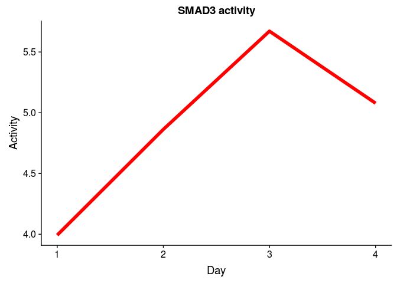

### Continue the analysis (StrongInterm)

Perform GSEA for RNA-seq data using RegNetwork gmt file:

``` r
#reading gmt file
set.seed(42)
pathwaysReg <- gmtPathways("~/ESC_RNA_seq/Regulon/Bulk/RegNetworkStrongInterm.gmt")

#without putting into function, for implicity
#for the first 12 hours
geneVector <- genesReferenceAll75748$time12h
names(geneVector) <- rownames(genesReferenceAll75748)
fgseaReg1 <- fgsea(pathwaysReg, geneVector, minSize=5, maxSize=300, nperm=10000)
reg1 <- fgseaReg1 %>% filter(padj < 0.05) %>% nrow()

#for the first 24 hours
geneVector <- genesReferenceAll75748$time24h
names(geneVector) <- rownames(genesReferenceAll75748)
fgseaReg2 <- fgsea(pathwaysReg, geneVector, minSize=5, maxSize=300, nperm=10000)
reg2 <- fgseaReg2 %>% filter(padj < 0.05) %>% nrow()

#for the first 36 hours
geneVector <- genesReferenceAll75748$time36h
names(geneVector) <- rownames(genesReferenceAll75748)
fgseaReg3 <- fgsea(pathwaysReg, geneVector, minSize=5, maxSize=300, nperm=10000)
reg3 <- fgseaReg3 %>% filter(padj < 0.05) %>% nrow()

#for the first 72 hours
geneVector <- genesReferenceAll75748$time72h
names(geneVector) <- rownames(genesReferenceAll75748)
fgseaReg4 <- fgsea(pathwaysReg, geneVector, minSize=5, maxSize=300, nperm=10000)
reg4 <- fgseaReg4 %>% filter(padj < 0.05) %>% nrow()

#for the first 96 hours
geneVector <- genesReferenceAll75748$time96h
names(geneVector) <- rownames(genesReferenceAll75748)
fgseaReg5 <- fgsea(pathwaysReg, geneVector, minSize=5, maxSize=300, nperm=10000)
reg5 <- fgseaReg5 %>% filter(padj < 0.05) %>% nrow()


gseaData <- list(fgseaReg1, fgseaReg2, fgseaReg3, fgseaReg4)
print(c(reg1, reg2, reg3, reg4, reg5))
```

    ## [1] 18 34 30 16 19

TF's that are active at first 12h, compared to 0 day:

``` r
x <- fgseaReg1 %>% filter(padj < 0.05) 
x
```

    ##    pathway         pval       padj        ES      NES nMoreExtreme size
    ## 1      FOS 0.0019160759 0.02875954 0.3511586 1.615312            9  141
    ## 2    NFKB2 0.0042993942 0.04503695 0.5070448 1.777746           21   33
    ## 3      SRF 0.0003873717 0.01237354 0.4928928 1.979498            1   61
    ## 4   TFAP2C 0.0003891051 0.01237354 0.5214162 2.063433            1   57
    ## 5     ATF4 0.0037342767 0.04503695 0.5298768 1.778306           18   28
    ## 6    CEBPA 0.0051615370 0.04559358 0.3532907 1.545372           26  101
    ## 7   CTNNB1 0.0003875969 0.01237354 0.5148838 1.974638            1   49
    ## 8     ESR1 0.0030769231 0.04076923 0.3764185 1.611862           15   89
    ## 9    IKBKG 0.0045320197 0.04503695 0.4850329 1.731933           22   36
    ## 10    LEF1 0.0049029221 0.04559358 0.4696715 1.717539           24   40
    ## 11  NFKBIA 0.0005913661 0.01343246 0.6394533 1.990657            2   21
    ## 12  NFKBIB 0.0040951638 0.04503695 0.6518461 1.821866           20   14
    ## 13   SMAD1 0.0001952744 0.01237354 0.5905992 2.128604            0   37
    ## 14   SMAD3 0.0003886514 0.01237354 0.4955455 2.016774            1   66
    ## 15   SMAD4 0.0005836576 0.01343246 0.4896706 1.937804            2   57
    ## 16   SMAD5 0.0019896538 0.02875954 0.7275238 1.894688            9   11
    ## 17   SMAD9 0.0019896538 0.02875954 0.7275238 1.894688            9   11
    ## 18  SMURF2 0.0017825312 0.02875954 0.6425688 1.925780            8   18
    ##                                                                                                                                                                                                                                                                                                                                                                                               leadingEdge
    ## 1  TGFB1, FASN, PLEC, GLTSCR2, LMNA, RARA, RHOBTB2, CCND1, CCND1, CIC, COL7A1, PRX, MAPK8, SHC3, DTNA, CSRNP1, NTS, MAP7D1, ETS1, FAM100A, HSPA1A, HRAS, VEGFA, TNXB, BCAR1, CIRBP, ELN, ITGA5, VGF, NUAK1, CA2, KRT8, FOSL1, GPR111, CLDN6, STK40, MDC1, RIN1, PLEKHM2, MMP2, BCL9, C2CD2, ADCK4, KLHL21, STAT5B, MAPK12, F3, MMP9, ERBB3, MAPK3, MAPK13, MKL1, TRAF2, ZYX, HLA-DRA, EIF3J, MAPK9, VGLL3
    ## 2                                                                                                                                                                                                                                           RAB35, NFKB2, EGFR, TRAF4, CCND1, EML2, BCL2, TRAF3, NFKBIB, RELA, IKBKG, NFAT5, NFKB1, TRAF2, TRAF5, MAP3K14, IKBKB, TRAF1, CHUK, XIAP, SORL1, BCL2L1, MAML2
    ## 3                                                                                                                                                                                                                            FILIP1L, MAPKAPK2, MYL9, PFKFB3, PTMS, GRK6, ELK1, TAGLN, SUN2, DUSP5, FAM100A, MYADM, CTGF, JUNB, ATF3, MCL1, CYR61, ZSWIM6, MTCH1, C10orf76, PLEKHG2, GADD45G, MYO1E, VIL1
    ## 4                                                                                                                                                                                   GATA2, SCAF1, MIDN, SMAD7, PHF15, GPR137, SYT7, BRF1, TPGS1, BAG6, KDM2A, FAM53B, PIP4K2B, TRIM8, PPP1R14B, MUS81, ATF3, ZNF653, ZSWIM6, PDE8A, MIOS, RNF19B, SMEK1, EPB41L1, MARK3, TNPO1, FMNL1, ZNFX1, TEAD2, PHF1
    ## 5                                                                                                                                                                                                                                                                                                  MAPKAPK2, RPS6KA4, PRKACA, PPP1R15A, PPP1R15A, GSK3B, CAMK4, MKNK2, PRKX, HPGD, EP300, CREBBP, RPS6KA6
    ## 6                                                                                                                                                                                           TFAP2A, TGFB1, FASN, GSK3A, RUNX1, AEBP1, SREBF2, ELK1, SREBF1, CCND1, GSK3B, MYBL1, BCL2, ELN, ABCC1, ITGA5, ACACA, SLC9A1, TIMP2, E2F1, FN1, IRS1, ACE, CDK2, GADD45A, KCNMA1, HOMER3, CEL, SP1, SCD, CCNE1
    ## 7                                                                                                                                                                                                                               LEF1, PRKACA, AXIN2, EGFR, TCF7, CCND1, SRC, CSNK2A2, GSK3B, CTNNBIP1, AXIN1, TBL1X, PTPN1, CDH1, CHD8, FBXW11, PRKX, PTPRF, PTPRM, EP300, FYN, BTRC, CREBBP, IGF1R, TJP1
    ## 8                                                                                                                                                                 SOCS3, EGFR, GADD45B, APOE, PELP1, RARA, AKT1, TERT, CAV1, AKT2, CCND1, SRC, CYP1B1, JUN, JUNB, TFAP2C, CDH1, E2F1, REXO4, CYR61, PTPRG, STAT5A, FBLN1, TNFRSF11B, GADD45A, GADD45G, SERPINB9, TGFA, SP1, MACROD1, SERPINE1, EGF, ESRRA
    ## 9                                                                                                                                                                                                                                                                        NFKB2, IRS4, TBKBP1, AKT1, AKT2, RIPK1, MAP3K8, CARD11, TAB3, IRS1, NFKBIB, RELA, TAB1, RELB, NFKB1, CASP8, TRAF2, AKT3, MAP3K14
    ## 10                                                                                                                                                                                                                                                                                                                                     LEF1, CD1D, MARK4, CCND1, CCND1, VIM, JUN, NRCAM, EDA, TCF3, FOSL1
    ## 11                                                                                                                                                                                                                                                                                                 NFKB2, AKT1, AKT2, FBXW11, RELA, TAB1, EIF2AK3, IKBKG, BTRC, NFKB1, CASP8, TRAF2, EIF2AK1, AKT3, IKBKB
    ## 12                                                                                                                                                                                                                                                                                                                                  AKT1, AKT2, FBXW11, RELA, TAB1, IKBKG, BTRC, NFKB1, AKT3, IKBKB, CHUK
    ## 13                                                                                                                                                                                                                                                                                                                          ID4, SMAD6, SMAD6, BAMBI, FLNA, ID1, ZEB2, SMAD7, BMPR1A, COL1A1, ID2, NKX2-5
    ## 14                                                                                                                                                                                    LEF1, TGFB1, TGFB1, SMAD6, SMAD6, PITX2, COL6A1, GADD45B, SMAD7, COL7A1, JUN, VEGFA, ZFYVE9, PEX6, LAMC1, TFDP1, DOK1, SF3B2, EP300, SP1, SERPINE1, ANKRD1, BTRC, CREBBP, CREBBP, MMP9, MAPK3, AR, TGFB3, EIF4ENIF1
    ## 15                                                                                                                                                                                                                                      ID4, LEF1, TGFB1, SMAD6, PITX2, ID1, GADD45B, TCF7, COL7A1, ETS1, JUN, ID2, NKX2-5, DACH1, TFDP1, DOK1, ID3, EP300, SP1, SERPINE1, BTRC, CREBBP, SMAD1, MAPK3, AR
    ## 16                                                                                                                                                                                                                                                                                                                                                                    ID4, SMAD6, ID1, SMAD7, BMPR1A, ID2
    ## 17                                                                                                                                                                                                                                                                                                                                                                    ID4, SMAD6, ID1, SMAD7, BMPR1A, ID2
    ## 18                                                                                                                                                                                                                                                                                                                                        SMAD6, FGFR3, EGFR, SMAD7, KDR, RET, ERBB4, FGFR4, IGF1R, ERBB3

TF's that are active at first 24h, compared to 0 day:

``` r
x <- fgseaReg2 %>% filter(padj < 0.05) 
x
```

    ##    pathway         pval        padj        ES      NES nMoreExtreme size
    ## 1      FOS 0.0066539924 0.037785171 0.3210894 1.468448           34  141
    ## 2    NFKB1 0.0011055832 0.017252292 0.3198827 1.539988            5  208
    ## 3    NFKB2 0.0009897070 0.017252292 0.5522907 1.914562            4   33
    ## 4     RELA 0.0042016807 0.029046401 0.3450518 1.538555           21  121
    ## 5      SRF 0.0001959248 0.006300773 0.4719321 1.869767            0   61
    ## 6   TFAP2C 0.0001957330 0.006300773 0.5275475 2.062628            0   57
    ## 7       AR 0.0003785728 0.010032179 0.3591816 1.683854            1  170
    ## 8     ATF4 0.0019940179 0.022530364 0.5507403 1.844064            9   28
    ## 9    CEBPA 0.0026768642 0.022530364 0.3745111 1.620222           13  101
    ## 10   CREB3 0.0099371324 0.046470708 0.7629630 1.714278           48    7
    ## 11 CREB3L1 0.0099371324 0.046470708 0.7629630 1.714278           48    7
    ## 12 CREB3L3 0.0099371324 0.046470708 0.7629630 1.714278           48    7
    ## 13 CREB3L4 0.0099371324 0.046470708 0.7629630 1.714278           48    7
    ## 14   CREB5 0.0058907170 0.037464960 0.8015992 1.721193           28    6
    ## 15  CTNNB1 0.0025505199 0.022530364 0.4660823 1.766148           12   49
    ## 16    ESR1 0.0011571842 0.017252292 0.4004009 1.697060            5   89
    ## 17    GLI1 0.0021679149 0.022530364 0.4928828 1.808813           10   43
    ## 18    GLI2 0.0023636006 0.022530364 0.5001676 1.805620           11   40
    ## 19    GLI3 0.0011818003 0.017252292 0.5137304 1.854582            5   40
    ## 20     HTT 0.0070735651 0.038782650 0.6549120 1.774508           34   13
    ## 21   IKBKG 0.0011935548 0.017252292 0.5446358 1.921609            5   36
    ## 22    LEF1 0.0035454008 0.026843749 0.4853434 1.752104           17   40
    ## 23  NFKBIA 0.0018145161 0.022192928 0.6104653 1.888606            8   21
    ## 24  NFKBIB 0.0094491355 0.046470708 0.6313587 1.753832           46   14
    ## 25     PGR 0.0054173355 0.035889848 0.5080156 1.734453           26   31
    ## 26    RARA 0.0039138943 0.028286782 0.4055435 1.653959           19   72
    ## 27    RBPJ 0.0063681592 0.037501382 0.5872800 1.777161           31   19
    ## 28   RBPJL 0.0063681592 0.037501382 0.5872800 1.777161           31   19
    ## 29   SMAD1 0.0001981375 0.006300773 0.6502337 2.309348            0   37
    ## 30   SMAD2 0.0015980823 0.021174590 0.5523248 1.876388            7   30
    ## 31   SMAD3 0.0001953125 0.006300773 0.5783692 2.322157            0   66
    ## 32   SMAD4 0.0001957330 0.006300773 0.5314831 2.078016            0   57
    ## 33   SMAD5 0.0028340081 0.022530364 0.7164216 1.847764           13   11
    ## 34   SMAD9 0.0028340081 0.022530364 0.7164216 1.847764           13   11
    ##                                                                                                                                                                                                                                                                                                                                                                                                                               leadingEdge
    ## 1  TGFB1, FASN, KRT16, PLEC, NTS, GLTSCR2, ETS1, ITGA5, CCND1, CCND1, LMNA, RHOBTB2, CA2, RARA, CSRNP1, MAPK8, FAM100A, HRAS, CIC, KRT8, VEGFA, HSPA1A, MAP7D1, COL7A1, DTNA, NUAK1, F3, BCAR1, CIRBP, PLEKHM2, PGF, MAPK10, MMP2, STK40, BCL9, CLDN6, MDC1, MMP9, TNXB, ELN, VGLL3, GPR111, MAPK9, PRX, KRAS, HLA-DRA, KLHL21, STBD1, ZFP36, ZYX, PTGS2, EIF3J, NTF3, ADCK4, PHLDA2, HELZ, MAPK3, STAT5B, MKL1, SLC1A5, TRAF2, UBP1, VGF
    ## 2                                                             ATP12A, MSX1, IER3, RAB35, SOCS3, FASN, NFKB2, RAC3, ID1, ADORA1, TNC, WT1, ETS1, PPP2R2C, IGFBP2, AKT1, AKT1, ELK1, ATF3, CCND1, TRAF4, VIM, CSNK2A2, AKT2, MAP3K8, MAP3K8, APOE, VEGFA, GADD45A, FN1, TFPI2, TNFRSF10A, TRAF3, EML2, F3, VIPR1, COL1A1, PPP2R4, PGF, BCL2, JAG2, TOP1, IKBKG, JUNB, MAP3K14, RELB, NFKB1, RIPK1, NFKBIB, NFKBIB, NFAT5, LYN, MMP9, RALBP1
    ## 3                                                                                                                                                                                                                                                                             RAB35, NFKB2, CCND1, TRAF4, EGFR, TRAF3, EML2, BCL2, IKBKG, MAP3K14, NFKB1, NFKBIB, NFAT5, RELA, PTGS2, NFKBIA, CHUK, TRAF2, TRAF5, LPXN, XIAP, NOS2, IKBKB
    ## 4                                                                                                                                                                                                   MMP14, SOCS3, NFKB2, RAC3, WT1, PPP2R2C, AKT1, AKT1, CCND1, TRAF4, AKT2, EGFR, MLLT6, VEGFA, FN1, TNFRSF10A, TRAF3, CXCR5, EML2, F3, COL1A1, PGF, BCL2, IKBKG, MAP3K14, RELB, BCL3, NFKB1, NFKBIB, NFKBIB, CASP8, NFAT5, MMP9, ZBTB10
    ## 5                                                                                                                                                                                                                                                                         MAPKAPK2, MYL9, PTMS, DUSP5, PFKFB3, CTGF, ELK1, ATF3, TAGLN, CYR61, GRK6, FAM100A, ZSWIM6, MYADM, SUN2, FILIP1L, MCL1, MTCH1, JUNB, C10orf76, GADD45G, PLEKHG2
    ## 6                                                                                                                                                                                                                          GATA2, SCAF1, PHF15, ATF3, MIDN, ZSWIM6, GPR137, SMAD7, BAG6, FAM53B, TPGS1, SYT7, BRF1, MUS81, KDM2A, TRIM8, PIP4K2B, PPP1R14B, ZNF653, RNF19B, PDE8A, BCL3, EPB41L1, MARK3, SMEK1, MIOS, TNPO1, ZNFX1, TEAD2
    ## 7                                                                                                                                           GATA3, TGFB1, CITED2, KHSRP, KLF5, TCF7, JUN, FADS2, NCOR2, GADD45B, HOXA1, SEMA6B, ETS1, PPP2R2C, AKT1, ELK1, LCP1, FGFBP1, CCND1, ELF4, RARA, APOE, FGF8, EGFR, CYP26A1, ATP2A2, VEGFA, GADD45A, SCARB1, SMPD1, POU5F1, ADIPOR2, PKD1, ADAMTS3, TNFRSF11B, NRIP1, ZMIZ1, RARG, BCL2, CRABP2
    ## 8                                                                                                                                                                                                                                                                                                                  MAPKAPK2, RPS6KA4, PRKACA, PPP1R15A, PPP1R15A, HPGD, GSK3B, PRKX, CXCR5, EP300, MKNK2, CREBBP, RPS6KA1, PTGS2, RPS6KA3
    ## 9                                                                                                                                                                                                                     TGFB1, TFAP2A, FASN, GSK3A, ELK1, ITGA5, FGFBP1, CCND1, AEBP1, SREBF2, SREBF1, RUNX1, GADD45A, FN1, GSK3B, SLC9A1, ABCC1, ACACA, F3, TIMP2, IRS1, CDK2, BCL2, MYBL1, SP1, CCNE1, E2F1, HOMER3, RB1, ITGB2, ACE, ELN
    ## 10                                                                                                                                                                                                                                                                                                                                                                                                     PRKACA, GSK3B, PRKX, EP300, CREBBP
    ## 11                                                                                                                                                                                                                                                                                                                                                                                                     PRKACA, GSK3B, PRKX, EP300, CREBBP
    ## 12                                                                                                                                                                                                                                                                                                                                                                                                     PRKACA, GSK3B, PRKX, EP300, CREBBP
    ## 13                                                                                                                                                                                                                                                                                                                                                                                                     PRKACA, GSK3B, PRKX, EP300, CREBBP
    ## 14                                                                                                                                                                                                                                                                                                                                                                                                     PRKACA, GSK3B, PRKX, EP300, CREBBP
    ## 15                                                                                                                                                                                                                                                                                              LEF1, TCF7, PRKACA, AXIN2, CCND1, CSNK2A2, EGFR, SRC, GSK3B, PRKX, CTNNBIP1, PTPN1, AXIN1, TBL1X, PTPRM, CHD8, CDH1, FBXW11, EP300, PTPRF
    ## 16                                                                                                                                                                                                                              CYP1B1, SOCS3, JUN, GADD45B, CAV1, AKT1, CCND1, CYR61, AKT2, PELP1, RARA, APOE, EGFR, SRC, SERPINB9, GADD45A, TERT, NR3C2, FBLN1, TNFRSF11B, TGFA, PTPRG, REXO4, SP1, JUNB, SERPINE1, E2F1, CDH1, GADD45G
    ## 17                                                                                                                                                                                                                                                                                                                                    WNT5B, WNT3, WNT8A, BMP2, PRKACA, PTCH2, PTCH1, BMP4, CSNK1G2, CSNK1D, GSK3B, PRKX, PVR, BCL2, SUFU
    ## 18                                                                                                                                                                                                                                                                                                                                                     WNT5B, WNT3, WNT8A, BMP2, PRKACA, PTCH2, PTCH1, BMP4, CSNK1G2, CSNK1D, GSK3B, PRKX
    ## 19                                                                                                                                                                                                                                                                                                                                                WNT5B, WNT3, WNT8A, BMP2, PRKACA, PTCH2, PTCH1, BMP4, CSNK1G2, CSNK1D, GSK3B, PRKX, PVR
    ## 20                                                                                                                                                                                                                                                                                                                                                                                   AP2A1, CLTB, AP2B1, AP2A2, CLTA, ITPR1, CLTC, GRIN2B
    ## 21                                                                                                                                                                                                                                                                                                                   NFKB2, IRS4, TBKBP1, AKT1, AKT2, MAP3K8, CARD11, TAB3, IRS1, MALT1, MAP3K14, RELB, NFKB1, RIPK1, NFKBIB, CASP8, TAB1
    ## 22                                                                                                                                                                                                                                                                                                                                                                                       LEF1, SOX17, CD1D, JUN, MARK4, CCND1, CCND1, VIM
    ## 23                                                                                                                                                                                                                                                                                                                           NFKB2, AKT1, AKT2, IKBKG, NFKB1, EIF2AK3, CASP8, TAB1, FBXW11, BTRC, RELA, AKT3, CHUK, EIF2AK1, TRAF2, IKBKB
    ## 24                                                                                                                                                                                                                                                                                                                                                            AKT1, AKT2, IKBKG, NFKB1, TAB1, FBXW11, BTRC, RELA, AKT3, CHUK, IKBKB, TAB2
    ## 25                                                                                                                                                                                                                                                                                                                                                                   JUN, PFKFB3, MAPK8, VEGFA, PIK3R1, PIK3R2, PIK3CB, TGFA, MAPK10, EGF
    ## 26                                                                                                                                                                                                                                                                                              TGFB1, KHSRP, KLF5, TCF7, JUN, NCOR2, GADD45B, HOXA1, ETS1, ELF4, RARA, CYP26A1, VEGFA, GADD45A, SMPD1, POU5F1, NRIP1, RARG, BCL2, CRABP2
    ## 27                                                                                                                                                                                                                                                                                                                                                                NCOR2, NOTCH1, MAML3, MAML1, NOTCH2, NOTCH3, EP300, KAT2A, HES1, CREBBP
    ## 28                                                                                                                                                                                                                                                                                                                                                                NCOR2, NOTCH1, MAML3, MAML1, NOTCH2, NOTCH3, EP300, KAT2A, HES1, CREBBP
    ## 29                                                                                                                                                                                                                                                                                                                               ANKRD1, ID4, SMAD6, SMAD6, BAMBI, ZEB2, FLNA, ID1, CDKN2B, NKX2-5, SMAD7, BMPR1A, ID2, TNFRSF11B, COL1A1
    ## 30                                                                                                                                                                                                                                                                                                                                                      TGFB1, SMAD6, PITX2, TNC, CDKN2B, SMAD7, ZFYVE9, TFDP1, SP1, EP300, CREBBP, TGFB3
    ## 31                                                                                                                                                                                                                             ANKRD1, LEF1, TGFB1, TGFB1, SMAD6, SMAD6, PITX2, COL6A1, JUN, TNC, GADD45B, CDKN2B, VEGFA, SMAD7, COL7A1, LAMC1, PEX6, ZFYVE9, TFDP1, DOK1, SP1, SERPINE1, MMP9, EP300, SF3B2, CREBBP, CREBBP, TGFB3, BTRC
    ## 32                                                                                                                                                                                                                                                                                              LEF1, TGFB1, ID4, SMAD6, PITX2, TCF7, JUN, ID1, TNC, GADD45B, ETS1, CDKN2B, NKX2-5, COL7A1, ID2, TFDP1, DACH1, FOXH1, DOK1, SP1, SERPINE1
    ## 33                                                                                                                                                                                                                                                                                                                                                                                               ID4, SMAD6, ID1, SMAD7, BMPR1A, ID2, ID3
    ## 34                                                                                                                                                                                                                                                                                                                                                                                               ID4, SMAD6, ID1, SMAD7, BMPR1A, ID2, ID3

TF's that are active at first 36h, compared to 0 day:

``` r
y <- fgseaReg3 %>% filter(padj < 0.05) 
y
```

    ##    pathway         pval        padj        ES      NES nMoreExtreme size
    ## 1      FOS 0.0005642279 0.006353646 0.3748959 1.692900            2  141
    ## 2    NFKB1 0.0068978374 0.044734450 0.2965525 1.413060           36  208
    ## 3    NFKB2 0.0054826708 0.041511651 0.5065448 1.742011           27   33
    ## 4      SRF 0.0001950839 0.003510166 0.5255890 2.056348            0   61
    ## 5   TFAP2C 0.0001953125 0.003510166 0.5205168 2.012038            0   57
    ## 6       AR 0.0001897173 0.003510166 0.4049414 1.875716            0  170
    ## 7     ATF4 0.0088932806 0.047134387 0.5135659 1.691785           44   28
    ## 8   CTNNB1 0.0075964160 0.044734450 0.4447735 1.669441           38   49
    ## 9      ERG 0.0005972526 0.006353646 0.7262180 2.068164            2   16
    ## 10    ESR1 0.0001938736 0.003510166 0.4336978 1.813088            0   89
    ## 11    GLI1 0.0001983340 0.003510166 0.5617504 2.047113            0   43
    ## 12    GLI2 0.0005994006 0.006353646 0.5453860 1.950919            2   40
    ## 13    GLI3 0.0003996004 0.005776042 0.5651247 2.021527            1   40
    ## 14     HTT 0.0017964072 0.016801691 0.7073646 1.896711            8   13
    ## 15   IKBKB 0.0074773711 0.044734450 0.5068697 1.726256           37   32
    ## 16   IKBKG 0.0021657807 0.019131063 0.5158603 1.808007           10   36
    ## 17    LEF1 0.0005994006 0.006353646 0.5380096 1.924533            2   40
    ## 18  NFKBIA 0.0065567256 0.044734450 0.5794248 1.774569           32   21
    ## 19  NFKBIB 0.0071556351 0.044734450 0.6504373 1.785470           35   14
    ## 20     PGR 0.0088530395 0.047134387 0.4998228 1.689687           44   31
    ## 21   PPARA 0.0013597514 0.013512529 0.4468241 1.760772            6   63
    ## 22   PPARG 0.0057758953 0.041743970 0.3877501 1.586954           29   78
    ## 23    RARA 0.0001936483 0.003510166 0.4724377 1.902257            0   72
    ## 24   SMAD1 0.0001986887 0.003510166 0.6668481 2.347887            0   37
    ## 25   SMAD2 0.0003943218 0.005776042 0.6051162 2.029240            1   30
    ## 26   SMAD3 0.0001936483 0.003510166 0.6112200 2.428635            0   66
    ## 27   SMAD4 0.0001953125 0.003510166 0.5376407 2.078229            0   57
    ## 28  SMURF2 0.0084779180 0.047134387 0.5934899 1.748473           42   18
    ## 29    SOS1 0.0039674668 0.031541361 0.7199241 1.847638           19   11
    ## 30    SOS2 0.0039674668 0.031541361 0.7199241 1.847638           19   11
    ##                                                                                                                                                                                                                                                                                                                                                                                                                         leadingEdge
    ## 1                                                                                                                        TGFB1, ITGA5, ETS1, FASN, NTS, CA2, PLEC, PENK, GLTSCR2, GPR111, MAP7D1, LMNA, RARA, MAPK8, NUAK1, HRAS, FAM100A, CIC, CSRNP1, KRT8, RHOBTB2, CCND1, CCND1, MAPK10, MMP2, DTNA, HSPA1A, ELN, PLEKHM2, VEGFA, COL7A1, TNXB, CIRBP, PGF, BCAR1, PHLDA2, MAPK12, MAPK11, STK40, BCL9, MDC1, ASB5, MMP9, KRT16
    ## 2  ATP12A, MSX1, VIM, IER3, ADORA1, TNC, RAB35, SOCS3, ETS1, RAC3, FASN, NFKB2, WT1, AKT1, AKT1, FN1, CSNK2A2, ELK1, GADD45A, TRAF4, COL1A1, AKT2, JUNB, PPP2R2C, PLAU, THBD, EML2, ATF3, ID1, IGFBP2, CCND1, TFPI2, APOE, VEGFA, TRAF3, ZBTB10, IKBKG, PGF, TOP1, VIPR1, TNFRSF10A, LYN, SDC4, HSPB1, PTK2B, MMP9, PPP2R4, MAP3K14, NFKB1, RALBP1, VWF, AKT3, EDN1, RIPK1, IL1R1, IL1R1, NFAT5, NFKBIB, NFKBIB, NR3C1, SMAD3, BCL2
    ## 3                                                                                                                                                                                                                                                                                                              RAB35, NFKB2, TRAF4, EML2, CCND1, TRAF3, IKBKG, MAP3K14, NFKB1, NFAT5, NFKBIB, BCL2, RELA, TRAF5, NFKBIA, CHUK, EGFR
    ## 4                                                                                                                                                                                                                                          MAPKAPK2, SUN2, DUSP5, PTMS, MYL9, PFKFB3, TAGLN, GADD45G, ELK1, ZEB1, JUNB, MYADM, FAM100A, ZSWIM6, ATF3, GRK6, CD248, CYR61, FILIP1L, CTGF, PLEKHG2, MTCH1, MCL1, DGKH, C10orf76, TLE3
    ## 5                                                                                                                                                                        GATA2, SCAF1, MIDN, FAM53B, PTCHD2, SMAD7, ZSWIM6, GPR137, ATF3, TPGS1, BAG6, TRIM8, PHF15, KDM2A, BRF1, MEIS2, BCL3, PIP4K2B, PPP1R14B, MUS81, RNF19B, ZNF653, PDE8A, SMEK1, TEAD2, MARK3, PHF1, TNPO1, ZNFX1, RNPEP, PLAGL2, EPB41L1, CLIP1, MYO1C, MIOS
    ## 6                                                                                                                                      TGFB1, GATA3, KLF5, HOXA1, CITED2, KHSRP, ETS1, TNFRSF11B, TCF7, JUN, CYP26A1, NCOR2, FADS2, AKT1, SMPD1, GADD45G, ELK1, LCP1, GADD45A, ADAMTS3, SERPINE1, RARA, ATP2A2, PPP2R2C, ELF4, PLAU, GADD45B, SCARB1, HOXB4, CRABP2, CCND1, IL6ST, APOE, SEMA6B, FGF8, NRIP1, ADIPOR2, ZMIZ1, VEGFA
    ## 7                                                                                                                                                                                                                                                                                                                   MAPKAPK2, RPS6KA4, PPP1R15A, PPP1R15A, PRKACA, GSK3B, PRKX, CREBBP, MKNK2, EP300, HPGD, RPS6KA1, CAMK4, RPS6KA3
    ## 8                                                                                                                                                                                                                                                                                                            LEF1, TCF7, SRC, PRKACA, CSNK2A2, AXIN2, PTPRM, TBL1X, CCND1, GSK3B, PTPN1, AXIN1, CCND3, PRKX, FBXW11, CHD8, CTNNBIP1
    ## 9                                                                                                                                                                                                                                                                                                                                                                            VIM, TNC, ANPEP, JUN, MMP2, COL11A2, MMP9, SETDB1, VWF
    ## 10                                                                                                                                                                                                    SOCS3, TNFRSF11B, JUN, SRC, CYP1B1, AKT1, CAV1, GADD45G, GADD45A, SERPINE1, RARA, AKT2, JUNB, FBLN1, PELP1, GADD45B, EGF, CCND1, SERPINB9, APOE, CYR61, E2F1, PTPRG, SERPINB5, REXO4, TGFA, STAT5A, HSPB1, SP1, GRIN2D, CRHBP
    ## 11                                                                                                                                                                                                                                                                                          BMP4, WNT5B, WNT3, BMP2, WNT8A, WNT5A, PTCH1, PRKACA, PVR, CSNK1G2, PTCH2, CSNK1D, GSK3B, BNC1, BMP5, SUFU, PRKX, FBXW11, WNT3A, CSNK1E
    ## 12                                                                                                                                                                                                                                                                                                     BMP4, WNT5B, WNT3, BMP2, WNT8A, WNT5A, PTCH1, PRKACA, CSNK1G2, PTCH2, CSNK1D, GSK3B, BMP5, SUFU, PRKX, FBXW11, WNT3A, CSNK1E
    ## 13                                                                                                                                                                                                                                                                                                BMP4, WNT5B, WNT3, BMP2, WNT8A, WNT5A, PTCH1, PRKACA, PVR, CSNK1G2, PTCH2, CSNK1D, GSK3B, BMP5, SUFU, PRKX, FBXW11, WNT3A, CSNK1E
    ## 14                                                                                                                                                                                                                                                                                                                                                                                     ITPR1, AP2A1, CLTA, AP2A2, AP2B1, CLTB, CLTC
    ## 15                                                                                                                                                                                                                                                                                                        NFKB2, AKT1, AKT2, IRS4, IRS1, CASP8, TAB3, MAP3K14, NFKB1, AKT3, IRAK3, RIPK1, NFKBIB, IRAK1, RELA, TAB1, MAP3K8, NFKBIA
    ## 16                                                                                                                                                                                                                                                                                               NFKB2, AKT1, TBKBP1, AKT2, IRS4, IRS1, CASP8, TAB3, MALT1, CARD11, MAP3K14, NFKB1, AKT3, RIPK1, NFKBIB, RELA, TAB1, MAP3K8, NFKBIA
    ## 17                                                                                                                                                                                                                                                                                                                                 LEF1, VIM, CD1D, SOX17, JUN, MARK4, NRCAM, CCND1, CCND1, EDA, NCAM1, CCND3, TCF3, CREBBP, CSNK1E
    ## 18                                                                                                                                                                                                                                                                                                                                   NFKB2, AKT1, AKT2, IKBKG, CASP8, FBXW11, NFKB1, EIF2AK3, AKT3, RELA, TAB1, CHUK, BTRC, EIF2AK1
    ## 19                                                                                                                                                                                                                                                                                                                                                                   AKT1, AKT2, IKBKG, FBXW11, NFKB1, AKT3, RELA, TAB1, CHUK, BTRC
    ## 20                                                                                                                                                                                                                                                                                                                                                     JUN, PFKFB3, MAPK8, EGF, MAPK10, PIK3R1, VEGFA, PIK3R2, MAPK12, TGFA, MAPK11
    ## 21                                                                                                                                                                                                                                                                                        TGFB1, GATA3, CITED2, FADS2, AKT1, GADD45G, GADD45A, SERPINE1, GADD45B, CCND1, SEMA6B, ADIPOR2, ADIPOR2, VEGFA, SLC27A4, ME1, MMP9, ACAA1
    ## 22                                                                                                                                                                                                                                                                          GATA3, TNFRSF11B, AKT1, RXRG, GADD45G, GADD45A, ADAMTS3, SERPINE1, ATP2A2, PPP2R2C, GADD45B, SCARB1, CCND1, APOE, SEMA6B, RXRA, ADIPOR2, VEGFA, SLC27A4
    ## 23                                                                                                                                                                                                                                                                                      TGFB1, KLF5, HOXA1, KHSRP, ETS1, TCF7, JUN, CYP26A1, NCOR2, SMPD1, GADD45G, GADD45A, RARA, ELF4, PLAU, GADD45B, HOXB4, CRABP2, NRIP1, VEGFA
    ## 24                                                                                                                                                                                                                                                                                                      ANKRD1, ZEB2, SMAD6, SMAD6, BAMBI, ID4, TNFRSF11B, FLNA, NKX2-5, ZEB1, SERPINE1, CDKN2B, COL1A1, SMAD7, ID1, COL3A1, IGFBP3
    ## 25                                                                                                                                                                                                                                                                                                                                                        TGFB1, SMAD6, PITX2, TNC, CDKN2B, SMAD7, TFDP1, ZFYVE9, TGFB3, ACVR1, SP1
    ## 26                                                                                                                                                                                                             ANKRD1, TGFB1, TGFB1, LEF1, SMAD6, SMAD6, PITX2, TNC, COL6A1, JUN, SERPINE1, CDKN2B, PEX6, SMAD7, GADD45B, COL3A1, VEGFA, LAMC1, COL7A1, TFDP1, ZFYVE9, TGFB3, ACVR1, COL6A3, SP1, MMP9, SF3B2, CREBBP, CREBBP, EDN1
    ## 27                                                                                                                                                                                                                              TGFB1, LEF1, SMAD6, ID4, PITX2, TNC, ETS1, TCF7, JUN, NKX2-5, DACH1, SERPINE1, CDKN2B, GADD45B, ID1, COL7A1, TFDP1, FOXH1, SP1, CREBBP, EDN1, BGN, SMAD3, EP300, DOK1, ID3, SMAD1, APOB, ID2, MAPK3
    ## 28                                                                                                                                                                                                                                                                                                                                                                                          SMAD6, PDGFRA, FGFR3, ERBB4, KDR, SMAD7
    ## 29                                                                                                                                                                                                                                                                                                                                                                                 SPRY3, SPRY4, CCND1, SPRED2, SPRY2, CCND3, SPRY1
    ## 30                                                                                                                                                                                                                                                                                                                                                                                 SPRY3, SPRY4, CCND1, SPRED2, SPRY2, CCND3, SPRY1

TF's that are active at first 72h, compared to 0 day:

``` r
z <- fgseaReg4 %>% filter(padj < 0.05) 
z
```

    ##    pathway         pval        padj        ES      NES nMoreExtreme size
    ## 1    NFKB1 0.0003800836 0.008962038 0.3377752 1.583410            1  208
    ## 2   TFAP2C 0.0001997204 0.006351108 0.5074278 1.928681            0   57
    ## 3       AR 0.0001897893 0.006351108 0.3697631 1.692152            0  170
    ## 4      ERG 0.0008011216 0.014153148 0.7018959 1.978029            3   16
    ## 5     ESR1 0.0033242081 0.033034318 0.3948357 1.634007           16   89
    ## 6     GLI1 0.0019829467 0.028662593 0.5027000 1.805693            9   43
    ## 7     GLI2 0.0023885350 0.029442173 0.5264844 1.859532           11   40
    ## 8     GLI3 0.0029856688 0.031800000 0.5181450 1.830078           14   40
    ## 9     LEF1 0.0005971338 0.011868033 0.5594820 1.976079            2   40
    ## 10  NFKBIA 0.0024072217 0.029442173 0.6117520 1.852063           11   21
    ## 11   SMAD1 0.0001973165 0.006351108 0.6876603 2.389183            0   37
    ## 12   SMAD2 0.0003945551 0.008962038 0.6123936 2.029809            1   30
    ## 13   SMAD3 0.0001971998 0.006351108 0.6333049 2.479645            0   66
    ## 14   SMAD4 0.0001997204 0.006351108 0.5698920 2.166101            0   57
    ## 15  SMURF2 0.0012007204 0.019091455 0.6629809 1.925719            5   18
    ## 16    WWP1 0.0030000000 0.031800000 0.6761004 1.839123           14   14
    ##                                                                                                                                                                                                                                                                                                          leadingEdge
    ## 1  VIM, TNC, IER3, SOCS3, COL1A1, VWF, ATP12A, TLR4, MSX1, ADORA1, IGFBP2, ATF3, NFKB2, RAB35, PLAU, RAC3, GADD45A, FN1, ETS1, TFPI2, IL1R1, IL1R1, AKT1, AKT1, TRAF4, FASN, NFKBIA, NFKBIA, CDH13, EML2, APOE, MYB, MAP3K8, MAP3K8, ELK1, VEGFC, CXCL5, PGF, F3, AKT2, CSNK2A2, JUNB, HSPB1, CCL2, DPYD, MMP9, JAG2
    ## 2                                                                              MEIS2, ATF3, SCAF1, GATA2, LHX2, ZSWIM6, HOXA9, MIDN, GPR137, BAG6, MARK3, MUS81, TRIM8, PIP4K2B, PHF1, TPGS1, SMAD7, ZDHHC2, FAM53B, PDE8A, GPRC5C, PPP1R14B, EPB41L1, RNF19B, ZNF653, BRF1, TNPO1, PHF15, KDM2A, RNPEP, TEAD2, BCL3
    ## 3       CYP26A1, TGFB1, CITED2, TNFRSF11B, GATA3, KLF5, IL6ST, ECM1, PLAU, GADD45A, ETS1, KHSRP, CYP27A1, FGF8, SMPD1, HOXB4, FADS2, AKT1, CRABP2, JUN, CDKN1A, NFKBIA, CDH13, APOE, MYB, ELK1, RARA, GADD45B, ADAMTS3, IGFBP5, TGFB2, NCOR2, EGFR, ELF4, RARB, MMP9, ATP2A2, ADIPOR2, SEMA6B, ACPP, NEDD9, SERPINE1
    ## 4                                                                                                                                                                                                                                                                VIM, TNC, VWF, ANPEP, JUN, MMP2, MMP9, SETDB1, FLT1
    ## 5                                                                                                                                               CRHBP, TNFRSF11B, SOCS3, HOXA10, CYP1B1, SRC, GADD45A, FBLN1, AKT1, EGF, C3, JUN, CDKN1A, APOE, MYB, RARA, GADD45B, AKT2, ITGB1, JUNB, HSPB1, EGFR, SERPINB9, STAT5A
    ## 6                                                                                                                                                                                               BMP4, WNT4, WNT3, WNT5B, BMP2, PRKACA, WNT9B, WNT11, PTCH2, PTCH1, CSNK1G2, BMP5, GSK3B, CSNK1D, SUFU, WNT5A, FBXW11
    ## 7                                                                                                                                                                                               BMP4, WNT4, WNT3, WNT5B, BMP2, PRKACA, WNT9B, WNT11, PTCH2, PTCH1, CSNK1G2, BMP5, GSK3B, CSNK1D, SUFU, WNT5A, FBXW11
    ## 8                                                                                                                                                                                               BMP4, WNT4, WNT3, WNT5B, BMP2, PRKACA, WNT9B, WNT11, PTCH2, PTCH1, CSNK1G2, BMP5, GSK3B, CSNK1D, SUFU, WNT5A, FBXW11
    ## 9                                                                                                                                                                                                                                                             SOX17, VIM, LEF1, MARK4, NRCAM, CD1D, NCAM1, MITF, JUN
    ## 10                                                                                                                                                                                                      NFKB2, AKT1, AKT2, AKT3, FBXW11, EIF2AK3, EIF2AK1, TAB2, CASP8, BTRC, RELA, TAB1, NFKB1, MAP3K7, IKBKG, CHUK
    ## 11                                                                                                                                                                                                              ANKRD1, COL3A1, ZEB2, TNFRSF11B, SMAD6, SMAD6, CDKN2B, BAMBI, COL1A1, ID4, ZEB1, GDF15, FLNA, CDKN1A
    ## 12                                                                                                                                                                                       TGFB1, TNC, PITX2, SMAD6, CDKN2B, CDKN1A, ZFYVE9, TGFB3, TGFB2, SMAD7, E2F5, SP1, TFDP1, MAPK3, SMAD4, ZFYVE16, RBL2, ACVR1
    ## 13                                                                      ANKRD1, TGFB1, TGFB1, COL3A1, TNC, PITX2, SMAD6, SMAD6, CDKN2B, COL6A1, LEF1, COL6A3, JUN, CDKN1A, HNF4A, GADD45B, ZFYVE9, TGFB3, PEX6, TGFB2, ART4, CCL2, MMP9, SERPINE1, LAMC1, VEGFA, SMAD7, E2F5, SP1, EDN1, TFDP1, COL7A1, MAPK3, ZFP36
    ## 14                                                                                                                                      TGFB1, TNC, PITX2, SMAD6, CDKN2B, DACH1, LEF1, ID4, ETS1, JUN, CDKN1A, HNF4A, GADD45B, ART4, CCL2, SERPINE1, BGN, TCF7, E2F5, SP1, EDN1, TFDP1, NKX2-5, COL7A1, MAPK3, ZFP36
    ## 15                                                                                                                                                                                                                                                        ERBB4, SMAD6, PDGFRA, FGFR3, KDR, NTRK1, EGFR, SMAD7, FLT1
    ## 16                                                                                                                                                                                                                                                                            ERBB4, PDGFRA, FGFR3, KDR, NTRK1, EGFR

TF's that are active at first 96h, compared to 0 day:

``` r
z <- fgseaReg5 %>% filter(padj < 0.05) 
z
```

    ##    pathway         pval        padj        ES      NES nMoreExtreme size
    ## 1      FOS 0.0051674641 0.043243515 0.3374096 1.498070           26  141
    ## 2    NFKB1 0.0001888218 0.003987761 0.3615951 1.690296            0  208
    ## 3   TFAP2C 0.0015710919 0.020816968 0.4685272 1.779058            7   57
    ## 4     ABL1 0.0034074965 0.033861996 0.5231764 1.762700           16   33
    ## 5       AR 0.0001911315 0.003987761 0.3564699 1.619996            0  170
    ## 6     ATF2 0.0018130540 0.022175045 0.5918694 1.850351            8   24
    ## 7      ERG 0.0002006421 0.003987761 0.7117834 2.001359            0   16
    ## 8     ESR1 0.0021632252 0.024568057 0.4059508 1.677910           10   89
    ## 9     GLI1 0.0001990050 0.003987761 0.5650696 2.021324            0   43
    ## 10    GLI2 0.0003974563 0.006319555 0.5545866 1.954778            1   40
    ## 11    GLI3 0.0003974563 0.006319555 0.5633372 1.985622            1   40
    ## 12    LEF1 0.0001987281 0.003987761 0.6266981 2.208953            0   40
    ## 13  NFKBIA 0.0024178924 0.025629659 0.6169941 1.863856           11   21
    ## 14  NFKBIB 0.0044221106 0.039061977 0.6711045 1.819103           21   14
    ## 15   PPARA 0.0038842494 0.036329156 0.4246339 1.646267           19   63
    ## 16   SMAD1 0.0001995610 0.003987761 0.6978078 2.415588            0   37
    ## 17   SMAD2 0.0008027293 0.011603087 0.5832085 1.927381            3   30
    ## 18   SMAD3 0.0001948938 0.003987761 0.6081727 2.381494            0   66
    ## 19   SMAD4 0.0001963865 0.003987761 0.5450180 2.069503            0   57
    ##                                                                                                                                                                                                                                                                                                                                                                                                                                               leadingEdge
    ## 1                                                                                   TGFB1, ITGA5, ETS1, GPR111, MAPK8, CSRNP1, PENK, MAPK10, FASN, RARA, PLEC, LMNA, MAP7D1, PGF, GLTSCR2, ASB5, VEGFC, CA2, KRT8, NTS, FAM100A, HRAS, VEGFA, C2CD2, MMP2, MAPK12, MAPK11, CIC, HSPA1A, RHOBTB2, CDKN1A, PTGS2, STK40, CIRBP, PRX, MAPK14, CAPN2, NUAK1, F3, PLEKHM2, NDRG4, CCND1, CCND1, ZFP36, BCAR1, MAPK9, KRAS, MFSD11, SYTL2, MAPK3, COL7A1, VEGFB
    ## 2                                                                                                   VIM, TNC, IER3, SOCS3, COL1A1, VWF, TLR4, CDH13, ADORA1, ATP12A, IGFBP2, FN1, RAB35, RAC3, ETS1, NFKB2, MSX1, GADD45A, IL1R1, IL1R1, TFPI2, ATF3, JUNB, AKT1, AKT1, MAP3K8, MAP3K8, TRAF4, FASN, APOE, ELK1, NFKBIA, NFKBIA, PLAU, AKT2, MYB, PGF, EDN1, VEGFC, WT1, IL1A, CSNK2A2, EML2, TRAF3, JAG2, VEGFA, SELE, ABCG1, RIPK1, NR3C1, TNNC1, HSPB1
    ## 3                                                                                                                                                                                                                   MEIS2, GATA2, SCAF1, ATF3, HOXA9, GPR137, TRIM8, ZSWIM6, MIDN, PIP4K2B, GPRC5C, BAG6, BRF1, ZDHHC2, LHX2, MARK3, PHF1, FAM53B, PDE8A, MUS81, KDM2A, PPP1R14B, SMAD7, TNPO1, RNF19B, RNPEP, TPGS1, BCL3, MYO1C, EPB41L1, TEAD2, ZNF653
    ## 4                                                                                                                                                                                                                                                                                                                                                                          EPHB3, EPHA2, RAC3, EPHA4, NTRK1, EPHA3, SHC2, RB1, EPHB2, NTRK2, EPHA7, EPHB4
    ## 5  CYP26A1, TGFB1, CITED2, CDH13, FGF8, TNFRSF11B, ECM1, IL6ST, IGFBP5, GATA3, KLF5, ETS1, KHSRP, GADD45A, JUN, SMPD1, FADS2, AKT1, HOXB4, GADD45B, CYP27A1, APOE, ELK1, NFKBIA, PPARGC1A, RARA, PLAU, MYB, EDN1, LCP1, CRABP2, NCOR2, ATP2A2, VEGFA, ELF4, ADIPOR2, EGFR, PLAT, ADAMTS3, TCF7, CDKN1A, PTGS2, TGFB2, NRIP1, BCL2, NEDD9, ACPP, NCOA6, MAP4K2, CCND1, PKD1, TMSB10, KCNH8, STRA6, KRT19, HSP90B1, RARB, NCOA2, MAPK3, SEMA6B, SMAD3, RELA
    ## 6                                                                                                                                                                                                                                                                                                                                                         FN1, ACE, JUN, PENK, ATF3, SELE, MAPK12, MAPK11, PLAT, RB1, CDKN1A, PTGS2, TGFB2, MAPK14, CCND1
    ## 7                                                                                                                                                                                                                                                                                                                                                                                              VIM, TNC, VWF, JUN, CDH5, ANPEP, MMP2, TNNC1, SETDB1, FLT1
    ## 8                                                                                                                                                                                                        CRHBP, SOCS3, HOXA10, TNFRSF11B, SRC, GADD45A, JUN, JUNB, CYP1B1, AKT1, SERPINB9, FBLN1, GADD45B, APOE, RARA, EGF, AKT2, MYB, ERG, ITGB1, SELE, GRIN2D, EGFR, BMP6, HSPB1, C3, CDKN1A, CYR61, PTPRG, CCND1, SP3, PIK3CA, KRT19, SP1, E2F1, NCOA2
    ## 9                                                                                                                                                                                                                                                                                                              BMP4, WNT4, PRKACA, WNT3, BMP5, BMP2, PTCH2, WNT9B, HHIP, WNT5B, WNT11, PTCH1, CSNK1G2, GSK3B, BNC1, BMP6, CSNK1D, SUFU, FBXW11, PVR, BCL2
    ## 10                                                                                                                                                                                                                                                                                                                        BMP4, WNT4, PRKACA, WNT3, BMP5, BMP2, PTCH2, WNT9B, HHIP, WNT5B, WNT11, PTCH1, CSNK1G2, GSK3B, BMP6, CSNK1D, SUFU, FBXW11, BCL2
    ## 11                                                                                                                                                                                                                                                                                                                         BMP4, WNT4, PRKACA, WNT3, BMP5, BMP2, PTCH2, WNT9B, HHIP, WNT5B, WNT11, PTCH1, CSNK1G2, GSK3B, BMP6, CSNK1D, SUFU, FBXW11, PVR
    ## 12                                                                                                                                                                                                                                                                                                                                                                                            SOX17, VIM, NRCAM, LEF1, MARK4, NCAM1, JUN, EDA, MITF, CD1D
    ## 13                                                                                                                                                                                                                                                                                                                                    NFKB2, AKT1, AKT2, FBXW11, AKT3, RELA, TAB2, EIF2AK3, TAB1, BTRC, EIF2AK1, CASP8, MAP3K7, IKBKG, NFKB1, IKBKB, CHUK
    ## 14                                                                                                                                                                                                                                                                                                                                                                    AKT1, AKT2, FBXW11, AKT3, RELA, TAB2, TAB1, BTRC, MAP3K7, IKBKG, NFKB1, IKBKB, CHUK
    ## 15                                                                                                                                                                                                                                                                                                                                            TGFB1, CITED2, GATA3, ACOX3, GADD45A, FADS2, AKT1, GADD45B, NFKBIA, MYB, EDN1, ME1, VEGFA, ADIPOR2, ADIPOR2
    ## 16                                                                                                                                                                                                                                                                                                                                     COL3A1, ANKRD1, ZEB2, CDKN2B, BAMBI, COL1A1, SMAD6, SMAD6, TNFRSF11B, ZEB1, IGFBP3, ID4, FLNA, NKX2-5, TGFBI, EDN1
    ## 17                                                                                                                                                                                                                                                                                                                                                       TGFB1, CDKN2B, PITX2, TNC, SMAD6, ZFYVE9, CDKN1A, TGFB2, TFDP1, E2F5, ZFYVE16, SMAD7, SP1, MAPK3
    ## 18                                                                                                                                                                                                                  COL3A1, ANKRD1, TGFB1, TGFB1, CDKN2B, PITX2, COL6A3, TNC, SMAD6, SMAD6, COL6A1, LEF1, ART4, JUN, GADD45B, EDN1, ZFYVE9, VEGFA, HNF4A, PEX6, TNNC1, LAMC1, CDKN1A, TGFB2, TFDP1, DOK1, E2F5, ZFYVE16, ZFP36, SMAD7, SP1, MAPK3, COL7A1
    ## 19                                                                                                                                                                                                                                                                TGFB1, CDKN2B, PITX2, TNC, SMAD6, DACH1, LEF1, ETS1, ART4, JUN, ID4, GADD45B, NKX2-5, BGN, EDN1, HNF4A, TNNC1, TCF7, CDKN1A, PTGS2, TFDP1, DOK1, E2F5, ZFP36, SP1, MAPK3, COL7A1, SMAD3

Plotting activity of transcription factors:

``` r
tfs <- unique(c(x$pathway, y$pathway, z$pathway))

tfs <- c("BRCA1", tfs)

calculateActivity <- function(tf, gseaResults){
  
  res <- sapply(gseaResults, function(x, tfName){
    p_val <- x %>% filter(pathway == tfName) %>% dplyr::select(padj)
    nes <- x %>% filter(pathway == tfName) %>% dplyr::select(NES)
    val <- sign(nes)*(-1)*log(p_val)
    return(val)}, 
    tfName = tf)
  
  names(res) <- rep(tf, length(res))
  res <- unlist(res)
  return(res)
  #df <- data.frame(TF = rep(tf, length(res)), Activity = res, Days = c(1,2,3,4))
}

activities <- sapply(tfs, calculateActivity, gseaResults = gseaData)
#rownames(activities) <- NULL
activities <- as.data.frame(t(activities))
colnames(activities) <- c(1, 2, 3, 4)
activities <- activities %>% rownames_to_column("TF")
activities <- melt(activities)
```

    ## Using TF as id variables

``` r
colnames(activities) <- c("TF", "Day", "Activity")
activities$Day <- as.numeric(activities$Day)
#activities <- activities %>% filter(TF == "SMAD3")
```

SMAD3 activity:

``` r
#SMAD3
ggplot(data = activities %>% filter(TF == "SMAD3"), aes(x = Day, y = Activity))+
  geom_line(size = 2, colour = "red")+
  ggtitle("SMAD3 activity")
```

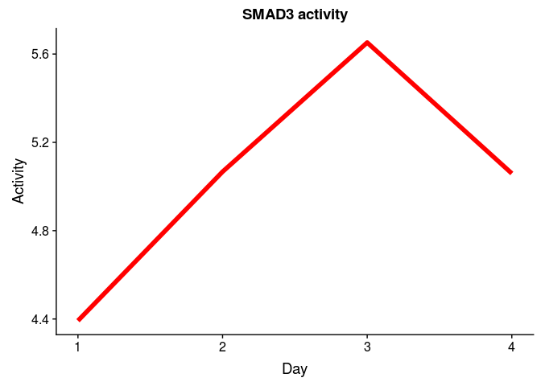
