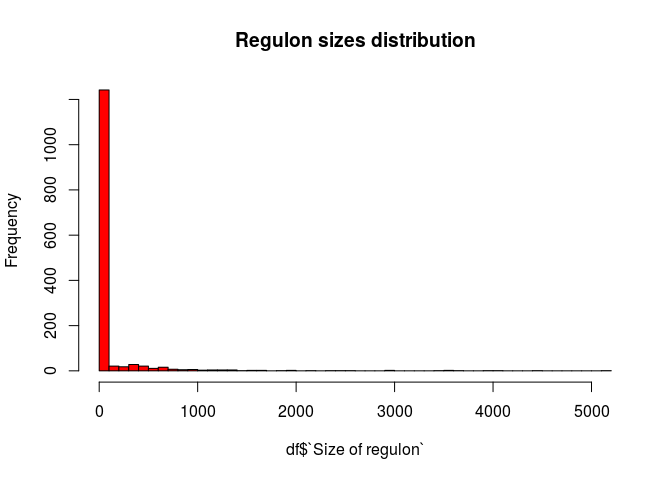
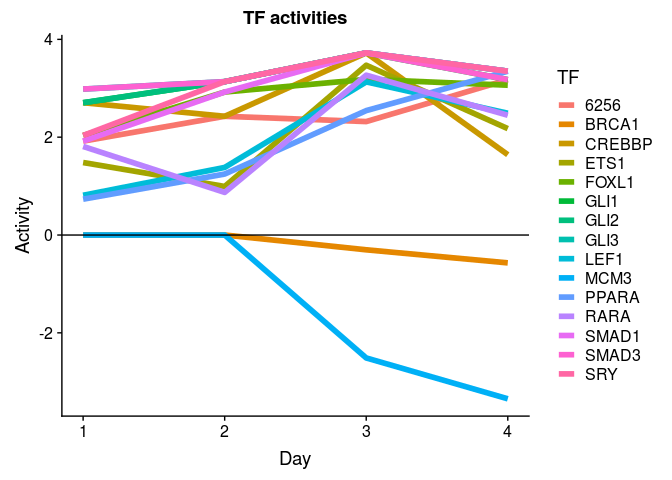
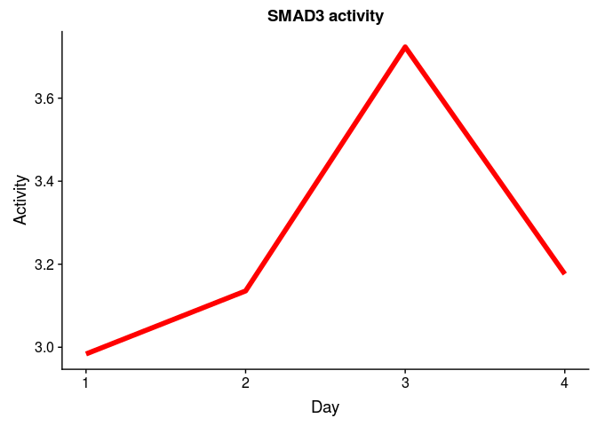
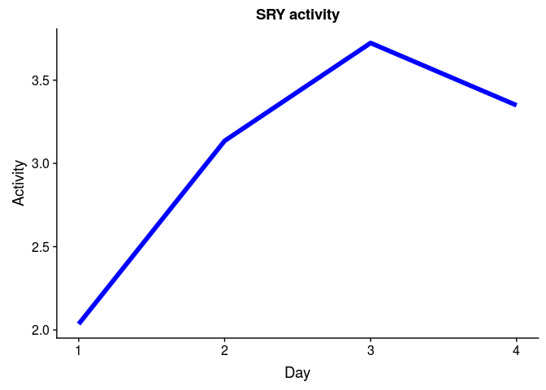

Regulon analysis of bulk data
================
German Novakovskiy
September 26, 2018

I analyze here bulk rna-seq data from [GSE109658](https://www.ncbi.nlm.nih.gov/pubmed/29427839), since authors have both bulk and single cell RNA-seq data, plus for differentiation they used classical protocol, which Francis is using: CHIR + Activin A for the first day, Activin A only for next 3 days.

GSE109658 analysis
------------------

``` r
#load data
load("genesReferenceAll109658.Rdata")

head(genesReferenceAll109658) %>% kable()
```

|         |        age1|       age2|       age3|       age4|   AveExpr|         F|  P.Value|  adj.P.Val|
|---------|-----------:|----------:|----------:|----------:|---------:|---------:|--------:|----------:|
| WLS     |   6.1571828|  5.4467597|   6.805653|   6.516483|  7.402788|  190.4518|        0|          0|
| COL5A2  |   1.2559318|  5.8438621|   6.865500|   7.012817|  9.520181|  181.6272|        0|          0|
| PCSK1   |   6.0628872|  1.2873017|  -2.025001|  -2.876695|  1.434500|  132.8331|        0|          0|
| CDH2    |   3.1419424|  3.7094277|   3.976516|   3.882344|  9.520534|  132.1470|        0|          0|
| S100A16 |  -0.7865683|  0.8048405|   3.685488|   5.049694|  3.769794|  130.5807|        0|          0|
| MYOF    |   0.0885145|  3.3840300|   4.330093|   5.026967|  4.889323|  128.8164|        0|          0|

``` r
#making gmt file
source <- read.table("human.source", sep = "\t", stringsAsFactors = F)
colnames(source) <- c("Regulator", "RegId", "Target", "TargId")

#remove all miRNA and related terms
source <- source %>% filter(!startsWith(Regulator, "hsa-")) %>%
  filter(!startsWith(Target, "hsa-")) 

uniqRegul <- unique(source$Regulator) #1412 regulators

regulatorList <- sapply(uniqRegul, function(x) {
  res <- source %>% filter(Regulator %in% x)
  res <- res$Target
  return(res)
})

lenRegul <- lapply(regulatorList, length)
df <- data.frame(unlist(lenRegul))
colnames(df) <- c("Size of regulon")

hist(df$`Size of regulon`, breaks = 50, col = "red", main = "Regulon sizes distribution")
```



Delete those regulons that have higher than 300 and less than 5 (SOX17 has this number of targets) targets:

``` r
goodRegulons <- df %>% 
  rownames_to_column("Regulators") %>%
  filter(`Size of regulon` <= 300 & `Size of regulon` >= 5)

goodRegulons <- goodRegulons$Regulators
regulatorList <- regulatorList[goodRegulons]
```

``` r
#write to gmt file
output <- lapply(seq_along(regulatorList), function(mylist, n, i) {
  #print(n[[i]], mylist[[i]])
  lineToWrite <- c(n[[i]], n[[i]], mylist[[i]])
  lineToWrite <- paste(lineToWrite, collapse = "\t")
  write(lineToWrite, "RegNetwork.gmt", sep="\n", append= T)}, mylist = regulatorList, n = names(regulatorList))
```

Perform GSEA for RNA-seq data using RegNetwork gmt file:

``` r
#reading gmt file
set.seed(42)
pathwaysReg <- gmtPathways("~/ESC_RNA_seq/Regulon/Bulk/RegNetwork.gmt")

#without putting into function, for implicity
#for the first day
geneVector <- genesReferenceAll109658$age1
names(geneVector) <- rownames(genesReferenceAll109658)
fgseaReg1 <- fgsea(pathwaysReg, geneVector, minSize=5, maxSize=300, nperm=10000)
reg1 <- fgseaReg1 %>% filter(padj < 0.05) %>% nrow()

#for the second day
geneVector <- genesReferenceAll109658$age2
names(geneVector) <- rownames(genesReferenceAll109658)
fgseaReg2 <- fgsea(pathwaysReg, geneVector, minSize=5, maxSize=300, nperm=10000)
reg2 <- fgseaReg2 %>% filter(padj < 0.05) %>% nrow()

#for the third day
geneVector <- genesReferenceAll109658$age3
names(geneVector) <- rownames(genesReferenceAll109658)
fgseaReg3 <- fgsea(pathwaysReg, geneVector, minSize=5, maxSize=300, nperm=10000)
reg3 <- fgseaReg3 %>% filter(padj < 0.05) %>% nrow()

#for the fourth day
geneVector <- genesReferenceAll109658$age4
names(geneVector) <- rownames(genesReferenceAll109658)
fgseaReg4 <- fgsea(pathwaysReg, geneVector, minSize=5, maxSize=300, nperm=10000)
reg4 <- fgseaReg4 %>% filter(padj < 0.05) %>% nrow()

gseaData <- list(fgseaReg1, fgseaReg2, fgseaReg3, fgseaReg4)
print(c(reg1, reg2, reg3, reg4))
```

    ## [1]  0  5 11 10

TF's that are active at second day, compared to 0 day:

``` r
x <- fgseaReg2 %>% filter(padj < 0.05) 
x
```

    ##   pathway         pval       padj        ES      NES nMoreExtreme size
    ## 1   SMAD3 0.0001272912 0.04346991 0.4571970 1.697738            0  225
    ## 2    GLI2 0.0003201024 0.04346991 0.6464267 1.902941            1   43
    ## 3     SRY 0.0001323101 0.04346991 0.4815266 1.748044            0  181
    ## 4    GLI3 0.0003122073 0.04346991 0.6287813 1.901500            1   49
    ## 5    GLI1 0.0003198465 0.04346991 0.6297044 1.862051            1   44
    ##                                                                                                                                                                                                                                                                                                                                                                                       leadingEdge
    ## 1 GSC, PITX2, SMAD6, SMAD6, CDKN2B, DACH1, PTHLH, ANKRD1, ZEB2, ZEB1, VIM, NOL3, TNC, COL6A1, GADD45B, TGFB1, TGFB1, MECOM, HNF4A, HNF4A, SVEP1, CCL2, LEF1, LEF1, TGFB3, ETS1, CYP11A1, MMP9, PLAGL1, ST6GALNAC2, RASL12, ZBTB16, COL3A1, AKT1, SMAD7, NCOA6, DAB2, SMAD3, RBL2, PEX6, PEX6, NR3C1, AXIN2, SERPINE1, COL7A1, ZFYVE16, TNNC1, JUN, JUN, KAT2B, PRKAR2A, ACVR1, ZNF83, SMAD9, JUND
    ## 2                                                                                                                                                                                                                                                                                                                    WNT8A, WNT3, WNT4, BMP2, WNT6, WNT11, WNT9B, BMP4, BMP5, PTCH2, WNT2B, WNT5A
    ## 3  CER1, HLX, HOXB2, IRX3, GREM2, FLJ31485, STMN2, CCDC92, LOC100507582, ZEB2, MRC2, ZEB1, HOTAIRM1, HOXD-AS1, WIPF1, GATA2, MECOM, CDH2, ODZ4, SYNPO, CLDN18, TGFB3, SOX6, NDST4, ZNF436, TBX6, HAND2, LOC100506451, CDNF, FN1, PDE4D, TNFRSF19, OPCML, CADM1, IL1RAPL1, CDKN1B, MTUS1, WBP5, MXI1, ALAD, SMAD3, RORA, KLF7, CDK6, ANGPT1, ESRRG, PDE8A, MAP3K3, ACRC, ZNF710, LAMB1, NEK6, ENO3
    ## 4                                                                                                                                                                                                                                                                                  WNT8A, WNT3, WNT4, BMP2, WNT6, WNT11, WNT9B, BMP4, BMP5, PTCH2, WNT2B, TWIST1, WNT5A, SUFU, ZIC3, SMAD3, WNT3A
    ## 5                                                                                                                                                                                                                                                                                                                    WNT8A, WNT3, WNT4, BMP2, WNT6, WNT11, WNT9B, BMP4, BMP5, PTCH2, WNT2B, WNT5A

TF's that are active at third day, compared to 0 day:

``` r
y <- fgseaReg3 %>% filter(padj < 0.05) 
y
```

    ##    pathway         pval       padj        ES      NES nMoreExtreme size
    ## 1    SMAD3 0.0002310536 0.02415339 0.4337076 1.655643            1  225
    ## 2    SMAD1 0.0002490040 0.02415339 0.4865056 1.764263            1  135
    ## 3     LEF1 0.0007081150 0.04371001 0.5687417 1.813958            4   55
    ## 4     GLI2 0.0001456452 0.02415339 0.6664644 2.032423            0   43
    ## 5     ETS1 0.0003663004 0.03108974 0.4611063 1.695416            2  155
    ## 6      SRY 0.0001195886 0.02415339 0.4899691 1.831247            0  181
    ## 7     RARA 0.0005051143 0.03810807 0.4680964 1.680466            3  123
    ## 8     GLI3 0.0001436988 0.02415339 0.6554680 2.045777            0   49
    ## 9     GLI1 0.0001454334 0.02415339 0.6564449 2.010619            0   44
    ## 10   FOXL1 0.0006110229 0.04148845 0.4584293 1.684784            4  154
    ## 11  CREBBP 0.0002352388 0.02415339 0.4438120 1.674762            1  200
    ##                                                                                                                                                                                                                                                                                                                                                                                                                                                                                                                                                 leadingEdge
    ## 1  ANKRD1, GSC, SMAD6, SMAD6, PITX2, DACH1, HNF4A, HNF4A, CDKN2B, ZEB2, GADD45B, TNC, NOL3, COL6A1, VIM, TGFB1, TGFB1, ZEB1, TGFB3, LEF1, LEF1, ST6GALNAC2, MMP9, SVEP1, ZBTB16, PLAGL1, PTHLH, TNNC1, CYP11A1, JUN, JUN, ETS1, SMAD3, MECOM, RASL12, JUND, VEGFA, SMAD7, GTF2IRD1, NCOA6, COL3A1, CCL2, ACVR1, FSTL3, KAT2B, AKT1, MLL4, AXIN2, GGA1, ATF3, DVL1, SMURF1, RUNX3, FOXH1, PEX6, PEX6, ZNF83, MYO5B, NR3C1, CEBPB, COL7A1, ZFP36, MBD1, DOK1, SERPINE1, ZFYVE16, MAPK8, CFDP1, RANBP9, EIF4ENIF1, EIF4ENIF1, MED15, FLNA, TGFB2, PARD3, SMAD2
    ## 2                                                                                                                                                                                                                                                                                                                                                ANKRD1, GSC, SMAD6, SMAD6, SOX5, NKX2-5, ARL4D, CDKN2B, ZEB2, ZEB2, GDF6, BTG2, ZEB1, LEF1, GDF15, EHHADH, ID2, ZNF521, RAC2, ID1, BAMBI, SMAD3, TNFRSF11B, PLEKHB1, RASL12, COL4A1, SMAD7, COL3A1, INPP4A
    ## 3                                                                                                                                                                                                                                                                                                                                                                                                                                                   SOX17, PITX2, CLDN2, NOL3, CD1D, MITF, MITF, VIM, LEF1, NCAM1, MARK4, JUN, EDA, SMAD3, NRCAM, ADA, DLL1
    ## 4                                                                                                                                                                                                                                                                                                                                                                                                                                                                        WNT8A, WNT4, WNT3, BMP5, WNT9B, WNT11, BMP2, BMP4, WNT6, HHIP, FOXA2, PTCH2, MTSS1
    ## 5                                                                                                                                                                                                                                                                         CSF3R, MEIS1, ANGPT2, ANPEP, GATA3, RUNX1, VWF, TFAP2A, BMP4, NRP1, TNC, NOL3, ITGA5, VCAM1, CAMK2A, MMP9, ITGA4, TBXAS1, PLAU, PTHLH, TNNC1, NELL1, GRPR, JUN, ICAM4, SRC, ETS1, ETS1, SMAD3, KIT, CDH13, CTSB, NOS3, PGF, PTGS2, MYB, PDGFRB, ETS2, ETS2, VEGFA, CDKN1B, ITGA2B
    ## 6                                                                                                                         HOXB2, CER1, HLX, STMN2, GREM2, IRX3, MRC2, CCDC92, FLJ31485, GATA2, HOXD-AS1, ZEB2, TNFRSF19, HAND2, CLDN18, ZEB1, TGFB3, CDH2, PDE4D, TBX6, WIPF1, NDST4, IL1RAPL1, SOX6, ESRRG, ODZ4, SYNPO, FN1, ZNF436, OPCML, LOC100507582, MTUS1, SMAD3, C1QTNF1, ENO3, MECOM, LOC100506451, HSPG2, CDKN1B, MXI1, DLL1, HOXA2, TRPC4, ZNF710, ALAD, RORA, PDE8A, ZNF608, HOTAIRM1, ITPKB, CDK6, GRIK3, SLC9A3R2, ACRC, KLF7, EFTUD1, MEX3A
    ## 7                                                                                                                                                                                                                                                                        HNF1B, HOXB4, RXRG, CYP26A1, HNF4A, GATA2, GADD45B, IL6, SMPD1, KLF5, KLF5, TGFB1, GADD45G, GADD45G, ZBTB16, HOXA1, PLAU, PPARG, PTHLH, GADD45A, JUN, ETS1, ANGPTL4, CDH13, STRA6, KRT19, CRABP2, VEGFA, NCOA6, RXRA, PNRC1, RARA, NCOA1, NCOA1, ICAM1, KAT2B, ELF4, TCF7, HSD17B1
    ## 8                                                                                                                                                                                                                                                                                                                                                                                                                                                         WNT8A, WNT4, WNT3, BMP5, WNT9B, WNT11, BMP2, BMP4, WNT6, TWIST1, HHIP, FOXA2, PTCH2, SMAD3, MTSS1
    ## 9                                                                                                                                                                                                                                                                                                                                                                                                                                                                        WNT8A, WNT4, WNT3, BMP5, WNT9B, WNT11, BMP2, BMP4, WNT6, HHIP, FOXA2, PTCH2, MTSS1
    ## 10                                                                                                                                                                                     MEIS1, HOXB9, ARHGAP24, COL13A1, NTN1, PLXNA2, HOXB4, RXRG, NKX2-5, LRIG3, SLITRK2, TSPAN8, BHLHE40, FST, SEMA3C, C1orf168, ELMO1, PSTPIP2, LOC284276, STX19, MST1P9, RASGRP1, FN1, BMPR2, RGS6, PAX7, ZFHX3, MAML3, ADAMTS3, LOC400604, GNAL, ANXA1, ARID5B, WNT2B, SLC35D2, ZNF438, SLC4A2, PRICKLE3, CNNM4, BAI3, AGER, PTPN6, AHDC1, ITPKB, CMTM5, PCDHB6, LPHN3
    ## 11                                                                                                                                                                       HOXB6, HOXB3, HOXB2, HOXB9, HOXB7, WT1, CRX, MSX1, HNF1B, HOXB4, RXRG, DACH1, HNF4A, CDKN2B, BCL3, MITF, KLF5, CEBPA, CDH2, LEF1, NFATC2, JUN, STAT4, ETS1, PROX1, SMAD3, NFE2, NFIC, SERTAD2, MECOM, MYB, ETS2, CDX2, JDP2, NCOA6, CREB3L2, CREB3L1, THRA, TRIP10, SERTAD3, NFE2L2, CITED2, ACVR1, MAFG, HOXB1, STAT5A, NCOA1, ZBTB17, KAT2B, HIPK2, NFATC4, MGMT, TCF7, CALCOCO1

TF's that are active at fourth day, compared to 0 day:

``` r
z <- fgseaReg4 %>% filter(padj < 0.05) 
z
```

    ##    pathway         pval       padj         ES       NES nMoreExtreme size
    ## 1    SMAD3 0.0005484260 0.04173966  0.4250810  1.585078            4  225
    ## 2    SMAD1 0.0002356823 0.03512311  0.4785509  1.701287            1  135
    ## 3    PPARA 0.0002479236 0.03512311  0.5142601  1.750945            1   94
    ## 4     GLI2 0.0002768933 0.03512311  0.6149190  1.860544            1   43
    ## 5      SRY 0.0001121957 0.03512311  0.4772991  1.750402            0  181
    ## 6     6256 0.0004509583 0.04173966  0.4354951  1.591569            3  175
    ## 7     GLI3 0.0002732987 0.03512311  0.5985878  1.844308            1   49
    ## 8     GLI1 0.0005532503 0.04173966  0.6021902  1.825687            3   44
    ## 9    FOXL1 0.0006888634 0.04677382  0.4402052  1.589165            5  154
    ## 10    MCM3 0.0003103662 0.03512311 -0.6190514 -1.958696            0   27
    ##                                                                                                                                                                                                                                                                                                                                                                                                                                                          leadingEdge
    ## 1  GSC, HNF4A, HNF4A, ANKRD1, PITX2, SMAD6, SMAD6, CDKN2B, DACH1, NOL3, TNC, ST6GALNAC2, TNNC1, MMP9, COL6A1, VIM, GADD45B, SVEP1, ZEB2, TGFB1, TGFB1, PLAGL1, ZEB1, TGFB3, CCL2, COL3A1, CYP11A1, ZBTB16, LEF1, LEF1, RASL12, JUN, JUN, AKT1, ETS1, JUND, SMAD3, NCOA6, FOXG1, VEGFA, FSTL3, KAT2B, GTF2IRD1, SMAD7, GGA1, AXIN2, CDKN1A, DVL1, SERPINE1, MECOM, JUNB, TGFB2, SMURF1, COL7A1, DOK1, MLL4, STUB1, FLNA, MYO5B, ACVR1, PEX6, PEX6, MBD1, ZNF83, CFDP1
    ## 2                                                                                                                                                                        GSC, ANKRD1, SMAD6, SMAD6, CDKN2B, NKX2-5, ARL4D, GDF6, SOX5, BTG2, ZEB2, ZEB2, TNFRSF11B, EHHADH, ZEB1, GDF15, COL3A1, COL4A1, PLEKHB1, LEF1, BAMBI, ZNF521, RASL12, ID1, SMAD3, ID2, RAC2, FOXG1, PIGQ, INPP4A, KAT2B, SMAD7, CDKN1A, SERPINE1, BTBD2, SMURF1, BMPR1B, HIPK2, STUB1, FLNA
    ## 3                                                                                                                                                                                                                                RXRG, APOA2, APOA1, GATA3, SCD5, NOL3, MMP9, ACOX3, GADD45B, GADD45B, TGFB1, NFKBIA, ANGPTL4, EHHADH, UCP1, LEPR, GADD45A, GADD45A, PRIC285, GADD45G, GADD45G, SLC27A1, PPARA, AKT1, UCP3, CITED2, AIP, RXRA, VEGFA, AKAP13, SEMA6B
    ## 4                                                                                                                                                                                                                                                                                                                                                                                              BMP5, WNT3, WNT4, WNT9B, WNT11, BMP2, WNT8A, BMP4, FOXA2, HHIP, PTCH2
    ## 5                                                          GREM2, HLX, HOXB2, STMN2, CER1, CCDC92, IRX3, MRC2, NDST4, CLDN18, TNFRSF19, HOXD-AS1, GATA2, SOX6, FLJ31485, CDH2, ZEB2, WIPF1, PDE4D, FN1, HAND2, ZEB1, TGFB3, ENO3, HSPG2, SYNPO, ZNF436, MTUS1, ODZ4, LOC100507582, C1QTNF1, LOC100506451, TBX6, OPCML, MXI1, ALAD, SGIP1, CDKN1B, SLC9A3R2, SMAD3, ESRRG, GRIK3, RORA, FOXG1, TRPC4, CDNF, YPEL1, DLL1, ITPKB, IL1RAPL1, LAMB1, CPNE1, ZNF710, FGF20
    ## 6                                                                                                     HP, CSF3R, VTN, CKM, MNX1, SGK2, SEMA3B, OSGIN1, KDM6B, MST1P2, PDZK1, LOC440925, SUN2, MIXL1, VAMP5, HAAO, RAB37, C3, GABRB2, BCAR3, ABCC2, MGST2, RRAS, ZNF436, SLC16A5, BZRAP1, LAMB2, IL13RA1, LOC595101, NEAT1, GALT, BCL2L2, C10orf10, GPR108, FBXO17, SETD8, TCEA2, TET2, SSBP4, TLCD2, ARSF, STAT2, ACADVL, SERPINE1, APOC1P1, GANAB, ECH1, MEX3A, CSK
    ## 7                                                                                                                                                                                                                                                                                                                     BMP5, WNT3, WNT4, WNT9B, WNT11, BMP2, WNT8A, BMP4, FOXA2, HHIP, PTCH2, TWIST1, MTSS1, SMAD3, BMP7, BMP8A, SUFU, WNT6, ZIC3, WNT5B, PVR, CSNK1E
    ## 8                                                                                                                                                                                                                                                                                                                                                                                              BMP5, WNT3, WNT4, WNT9B, WNT11, BMP2, WNT8A, BMP4, FOXA2, HHIP, PTCH2
    ## 9                                                                                                                                                         RXRG, HOXB9, MEIS1, NTN1, HOXB4, ARHGAP24, PLXNA2, SLITRK2, COL13A1, NKX2-5, TSPAN8, FST, C1orf168, LRIG3, SEMA3C, ELMO1, RGS6, MST1P9, FN1, RASGRP1, BHLHE40, MAML3, PAX7, LOC400604, PSTPIP2, BMPR2, ZFHX3, STX19, PCDHB6, C10orf140, ADAMTS3, PTPN6, SLC35D2, SLC4A2, GNAL, AGER, ARID5B, COL2A1, ITPKB
    ## 10                                                                                                                                                                                                                                                                                                                                                           CDC45, HAUS1, ORC3, MCM7, MCM6, SUPT16H, PPP2R1B, ORC1, ORC4, MCM10, CDC7, MCM5, MCM2, DBF4, CDC6, MCM4

Plotting activity of transcription factors:

``` r
tfs <- unique(c(x$pathway, y$pathway, z$pathway))

tfs <- c("BRCA1", tfs)

calculateActivity <- function(tf, gseaResults){
  
  res <- sapply(gseaResults, function(x, tfName){
    p_val <- x %>% filter(pathway == tfName) %>% dplyr::select(padj)
    nes <- x %>% filter(pathway == tfName) %>% dplyr::select(NES)
    val <- sign(nes)*(-1)*log(p_val)
    return(val)}, 
    tfName = tf)
  
  names(res) <- rep(tf, length(res))
  res <- unlist(res)
  return(res)
  #df <- data.frame(TF = rep(tf, length(res)), Activity = res, Days = c(1,2,3,4))
}

activities <- sapply(tfs, calculateActivity, gseaResults = gseaData)
#rownames(activities) <- NULL
activities <- as.data.frame(t(activities))
colnames(activities) <- c(1, 2, 3, 4)
activities <- activities %>% rownames_to_column("TF")
activities <- melt(activities)
```

    ## Using TF as id variables

``` r
colnames(activities) <- c("TF", "Day", "Activity")
activities$Day <- as.numeric(activities$Day)
#activities <- activities %>% filter(TF == "SMAD3")
```

``` r
#BRCA1 - random TF, an outlier, just to show the contrast
ggplot(data = activities, aes(x = Day, y = Activity, colour = TF))+
  geom_line(size = 2) +
  geom_hline(yintercept = 0) +
  ggtitle("TF activities")
```



Two transcription factors - SRY, SMAD3 - are active on day second (beginning of DE differentiation):

``` r
#SMAD3
ggplot(data = activities %>% filter(TF == "SMAD3"), aes(x = Day, y = Activity))+
  geom_line(size = 2, colour = "red")+
  ggtitle("SMAD3 activity")
```



``` r
#SRY
ggplot(data = activities %>% filter(TF == "SRY"), aes(x = Day, y = Activity))+
  geom_line(size = 2, colour = "blue")+
  ggtitle("SRY activity")
```



These two and also SMAD1 and PPARA are the most active, peak is at day 3.

Information about these transcription factors (and relevance to DE):

1.  SMAD3 - one of the key players in DE differentiation through TGF-beta; Wiki pathways: TGF-beta Receptor Signaling, TGF-B Signaling in Thyroid Cells for Epithelial-Mesenchymal Transition, Role of Osx and miRNAs in tooth development, AGE/RAGE pathway, TGF-beta Signaling Pathway, Mesodermal Commitment Pathway, Factors and pathways affecting insulin-like growth factor (IGF1)-Akt signaling, Endoderm Differentiation, Cell Cycle, Canonical and Non-Canonical TGF-B signaling, LncRNA involvement in canonical Wnt signaling and colorectal cancer; KEGG pathways: cell cycle, wnt signal pathway, tgf-beta pathway.
2.  SRY - sex determination factor, maybe we see it here because of batch effects (sex)?
3.  GLI1 - Kegg: hedgehog signaling pathway, Wiki: Hedgehog Signaling Pathway
4.  GLI2 - Kegg: also hedgehog; Wiki: hedgehog and DE differentiation
5.  GLI3 - Kegg: also hedgehog; Wiki: hedgehog and ectoderm differentiation
6.  SMAD1 - Kegg: tgf-beta; Wiki: tgf-beta, BMP signaling, ESC pluripotency pathways, Mesodermal commitment, heart development.
7.  LEF1 - Kegg: wnt-signaling; Wiki: tgf-beta, wnt, mesodermal differentiation, endoderm differentiation. Reactome: Formation of the beta-catenin:TCF transactivating complex
8.  ETS1 - Kegg: dorso-ventral axis formation; Wiki - VEGFA-VEGFR2 Signaling Pathway, tgf-beta as well. Reactome: ERK/MAPK targets, RUNX2/RUNX3 regulation.
9.  RARA - Wiki: wnt; Reactome: Pten regulation
10. FOXL1 - Wiki: VEGFA-VEGFR2 Signaling Pathway, tgf-beta, wnt, mesodermal and DE differentiation.
11. CREBBP - Kegg: cell cycle, wnt signal, notch, tgf-beta, jak\_stat; Wiki: tgf-beta, wnt, notch signaling, IL-6 signaling, tnf alpha; Reactome - Activation of the TFAP2 (AP-2) family of transcription factors, RUNX1 regulates transcription of genes involved in differentiation of myeloid cells.
12. MCM3 - Kegg: dna replication, cell cycle; Wiki: DNA replication, G1 to S cell cycle control, cell cycle.
13. PPARA - Kegg: Ppar signaling pathway, adipocytokine signaling pathway; Wiki: estrogne receptor pathway, adipogenesis, PPAR alpha pathway, PPAR signaling pathway, energy metabolism, Irinotecan Pathway, nuclear receptors. Reactome - regulation of lipid metabolism.
14. 6256 - RXRA - Kegg: PPAR signal pathway; Wiki: PI3K/AKT/mTOR, Transcription factor regulation in adipogenesis, NRF2 pathway, PPAR signaling pathway
