Analysis of mTOR inhibition in hESC
================
German Novakovskiy
May 27, 2018

mRNA-seq analysis using limma
-----------------------------

``` r
library(knitr)
suppressWarnings(suppressMessages(library(tidyverse)))
suppressWarnings(suppressMessages(library(GEOquery)))
suppressWarnings(suppressMessages(library(data.table)))
suppressWarnings(suppressMessages(library(reshape2)))
suppressWarnings(suppressMessages(library(dplyr)))
suppressWarnings(suppressMessages(library(ggplot2)))
suppressWarnings(suppressMessages(library(cowplot)))
suppressWarnings(suppressMessages(library(limma)))
suppressWarnings(suppressMessages(library(tibble)))
suppressWarnings(suppressMessages(library(RColorBrewer)))
suppressWarnings(suppressMessages(library(edgeR)))
suppressWarnings(suppressMessages(library(readxl)))
suppressWarnings(suppressMessages(library(VennDiagram)))
suppressMessages(suppressWarnings(library(ermineR)))
suppressMessages(suppressWarnings(library(biomaRt)))
```

Here we analyze gene expression data from [this paper.](https://www.nature.com/articles/s41556-018-0088-1).

Human embryonic stem cells (hESCs) and human fibroblasts were treated with rapamycin for two and four days. For untreated controls and each treatment condition three biological replicates were analyzed. Cells were cultured in mTeSR 1 medium and the drug-containing medium was replaced every 24 h.

Briefly, hESCs and fibroblasts were treated with 50nM rapamycin in the regular growth medium of each cell type. The medium was replaced every day with fresh rapamycin for both cell types. The cells were grown two or four days in the presence of rapamycin and then harvested.

hESCs were cultured at 37 0C and 5% CO2 in feeder-free conditions on Matrigel-coated 6-well plates (Corning) in mTeSR1 (STEMCELL Technologies). Fibroblasts were cultured at 37 0C and 5% CO2 on uncoated 6-well plates (Corning).

``` r
if (file.exists("GSE107965.Rdata")) {
    # if previously downloaded
    load("GSE107965.Rdata")
} else {
    # Get geo object that contains our data and phenotype information
    geo_obj <- getGEO("GSE107965", GSEMatrix = TRUE)
    geo_obj <- geo_obj[[1]]
    save(geo_obj, file = "GSE107965.Rdata")
}
show(geo_obj)
```

    ## ExpressionSet (storageMode: lockedEnvironment)
    ## assayData: 0 features, 18 samples 
    ##   element names: exprs 
    ## protocolData: none
    ## phenoData
    ##   sampleNames: GSM2884378 GSM2884379 ... GSM2884395 (18 total)
    ##   varLabels: title geo_accession ... time point:ch1 (45 total)
    ##   varMetadata: labelDescription
    ## featureData: none
    ## experimentData: use 'experimentData(object)'
    ## Annotation: GPL18573

``` r
#get covariate matrix
geo_metadata <- pData(geo_obj)[, c("organism_ch1", "title", colnames(pData(geo_obj))[grep("characteristics", 
    colnames(pData(geo_obj)))])]

geo_metadata <- geo_metadata[1:9,]
geo_metadata$time <- c(0, 0, 0, 2, 2, 2, 4, 4, 4)
geo_metadata$time <- as.factor(geo_metadata$time)
geo_metadata$treatment <- c(0, 0, 0, 1, 1, 1, 1, 1, 1)
geo_metadata$treatment <- as.factor(geo_metadata$treatment)
geo_metadata <- geo_metadata %>% dplyr::select(title, time, treatment)

geo_metadata %>% kable()
```

|            | title                         | time | treatment |
|------------|:------------------------------|:-----|:----------|
| GSM2884378 | hESCs\_control\_rep1          | 0    | 0         |
| GSM2884379 | hESCs\_control\_rep2          | 0    | 0         |
| GSM2884380 | hESCs\_control\_rep3          | 0    | 0         |
| GSM2884381 | hESCs\_2days\_rapamycin\_rep1 | 2    | 1         |
| GSM2884382 | hESCs\_2days\_rapamycin\_rep2 | 2    | 1         |
| GSM2884383 | hESCs\_2days\_rapamycin\_rep3 | 2    | 1         |
| GSM2884384 | hESCs\_4days\_rapamycin\_rep1 | 4    | 1         |
| GSM2884385 | hESCs\_4days\_rapamycin\_rep2 | 4    | 1         |
| GSM2884386 | hESCs\_4days\_rapamycin\_rep3 | 4    | 1         |

Let's load the expression data (in raw counts):

``` r
expr_counts <- read.csv("GSE107965_rawCounts.csv", header=TRUE)
expr_counts <- expr_counts[,1:10]
expr_counts <- expr_counts %>% column_to_rownames("ORF")

head(expr_counts) %>% kable()
```

|                 |  hESCs\_control\_rep1|  hESCs\_control\_rep2|  hESCs\_control\_rep3|  hESCs\_2days\_rapamycin\_rep1|  hESCs\_2days\_rapamycin\_rep2|  hESCs\_2days\_rapamycin\_rep3|  hESCs\_4days\_rapamycin\_rep1|  hESCs\_4days\_rapamycin\_rep2|  hESCs\_4days\_rapamycin\_rep3|
|-----------------|---------------------:|---------------------:|---------------------:|------------------------------:|------------------------------:|------------------------------:|------------------------------:|------------------------------:|------------------------------:|
| ENSG00000000003 |                  1812|                  1674|                  1536|                           1745|                           3269|                           2034|                           2923|                           2811|                           3138|
| ENSG00000000005 |                    33|                    18|                    10|                             21|                             44|                             41|                              8|                             26|                             22|
| ENSG00000000419 |                  1148|                   989|                   913|                            529|                           1097|                            666|                            914|                            924|                           1018|
| ENSG00000000457 |                   183|                   183|                   144|                             94|                            190|                            108|                            197|                            190|                            178|
| ENSG00000000460 |                   553|                   540|                   555|                            384|                            755|                            425|                            643|                            622|                            733|
| ENSG00000000938 |                    16|                     9|                     9|                              0|                              3|                              3|                              5|                              4|                              4|

Usually one will filter genes with 10-15 read counts. We have 14175263 as a lowest library size. 10 reads in such library size will be: 10/14175263 \*1e6 = 0.7. Let's go with 0.8 for voom

``` r
#first let's create a edgeR DGElist object
expr_counts_matrix <- as.matrix(expr_counts)

DGE_bulk_time_course_ec <- DGEList(counts = expr_counts_matrix) 

cpm <- cpm(DGE_bulk_time_course_ec)
keep.exprs <-rowSums(cpm > 0.8) >= 3 

DGE_bulk_time_course_ec <- DGE_bulk_time_course_ec[keep.exprs,,]

dim(DGE_bulk_time_course_ec)
```

    ## [1] 15149     9

We have raw counts, thus we need to perform a library size normalization using edgeR:

``` r
normalized_factors_expression <- calcNormFactors(DGE_bulk_time_course_ec, method = "TMM") #calculation of scaling factors (for library size)

normalized_factors_expression$samples$norm.factors
```

    ## [1] 1.0128781 1.0116046 1.0095541 0.9911272 0.9837845 0.9728267 1.0147721
    ## [8] 1.0003135 1.0039984

Let's look at distribution of values:

``` r
#raw count data distribution
#removing gene column and transforming into matrix (for hist)
data <- as.matrix(DGE_bulk_time_course_ec$counts)

hist(data, main="GSE107965", xlim = c(0,50000), xlab = "Expression",
     ylab = "Frequency", breaks = 3000)
```

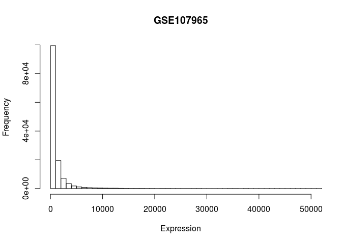

Let's now perform RNA-seq analysis with limma, using only time factor variable (time column in metadata) and let's look separately at DE gene at each stage

``` r
metadata_age <- geo_metadata[,c(1,2)]
metadata_age %>% kable()
```

|            | title                         | time |
|------------|:------------------------------|:-----|
| GSM2884378 | hESCs\_control\_rep1          | 0    |
| GSM2884379 | hESCs\_control\_rep2          | 0    |
| GSM2884380 | hESCs\_control\_rep3          | 0    |
| GSM2884381 | hESCs\_2days\_rapamycin\_rep1 | 2    |
| GSM2884382 | hESCs\_2days\_rapamycin\_rep2 | 2    |
| GSM2884383 | hESCs\_2days\_rapamycin\_rep3 | 2    |
| GSM2884384 | hESCs\_4days\_rapamycin\_rep1 | 4    |
| GSM2884385 | hESCs\_4days\_rapamycin\_rep2 | 4    |
| GSM2884386 | hESCs\_4days\_rapamycin\_rep3 | 4    |

First, let's use contrast matrix:

``` r
designMatrix <- model.matrix(~time, metadata_age)
designMatrix %>% kable()
```

|            |  (Intercept)|  time2|  time4|
|------------|------------:|------:|------:|
| GSM2884378 |            1|      0|      0|
| GSM2884379 |            1|      0|      0|
| GSM2884380 |            1|      0|      0|
| GSM2884381 |            1|      1|      0|
| GSM2884382 |            1|      1|      0|
| GSM2884383 |            1|      1|      0|
| GSM2884384 |            1|      0|      1|
| GSM2884385 |            1|      0|      1|
| GSM2884386 |            1|      0|      1|

We can apply voom (which usually takes count data as an input and transforms them to logCPM) that estimates the mean-variance relationship and uses this to compute appropriate observation-level weights. The data are then ready for linear modelling.

"Moreover, the voom-plot provides a visual check on the level of filtering performed upstream. If filtering of lowly-expressed genes is insufficient, a drop in variance levels can be observed at the low end of the expression scale due to very small counts. If this is observed, one should return to the earlier filtering step and increase the expression threshold applied to the dataset."

``` r
after_voom_cpm <- voom(normalized_factors_expression, designMatrix, plot=TRUE)
```

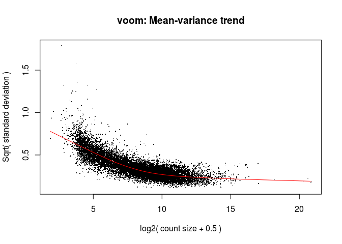

``` r
hist(after_voom_cpm$E, main="cleaned GSE107965 - log2 transformed CPM", xlab = "Expression",
     ylab = "Frequency")
```

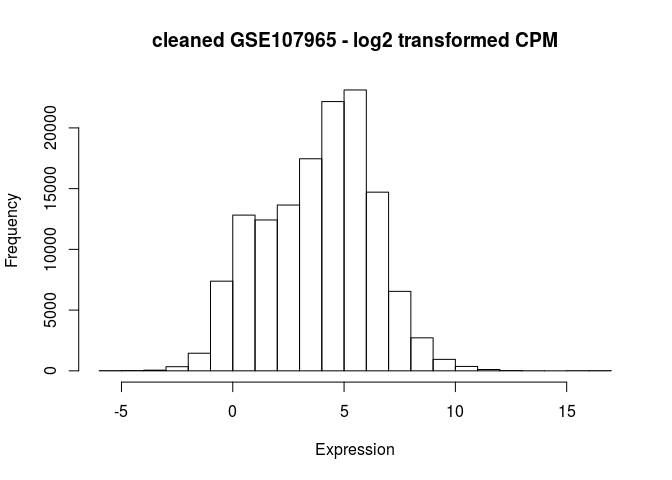

Boxplots to explore the data:

``` r
cleaned_log_cpm_df <- as.data.frame(after_voom_cpm$E)

cleaned_log_cpm_df <- cleaned_log_cpm_df %>% rownames_to_column("gene")
```

Converting ensemble gene names (ENSG) to HGNC gene symbols:

``` r
mart <- useMart("ensembl", dataset="hsapiens_gene_ensembl")

attributes <- c("ensembl_gene_id", "hgnc_symbol", 
                "description")

biomart_genes <- getBM(attributes=attributes, filters="ensembl_gene_id", 
               values=cleaned_log_cpm_df$gene, mart=mart, uniqueRows=T)

head(biomart_genes, 10) %>% kable()
```

| ensembl\_gene\_id | hgnc\_symbol | description                                                                                      |
|:------------------|:-------------|:-------------------------------------------------------------------------------------------------|
| ENSG00000000003   | TSPAN6       | tetraspanin 6 \[Source:HGNC Symbol;Acc:HGNC:11858\]                                              |
| ENSG00000000005   | TNMD         | tenomodulin \[Source:HGNC Symbol;Acc:HGNC:17757\]                                                |
| ENSG00000000419   | DPM1         | dolichyl-phosphate mannosyltransferase subunit 1, catalytic \[Source:HGNC Symbol;Acc:HGNC:3005\] |
| ENSG00000000457   | SCYL3        | SCY1 like pseudokinase 3 \[Source:HGNC Symbol;Acc:HGNC:19285\]                                   |
| ENSG00000000460   | C1orf112     | chromosome 1 open reading frame 112 \[Source:HGNC Symbol;Acc:HGNC:25565\]                        |
| ENSG00000001036   | FUCA2        | alpha-L-fucosidase 2 \[Source:HGNC Symbol;Acc:HGNC:4008\]                                        |
| ENSG00000001084   | GCLC         | glutamate-cysteine ligase catalytic subunit \[Source:HGNC Symbol;Acc:HGNC:4311\]                 |
| ENSG00000001167   | NFYA         | nuclear transcription factor Y subunit alpha \[Source:HGNC Symbol;Acc:HGNC:7804\]                |
| ENSG00000001460   | STPG1        | sperm tail PG-rich repeat containing 1 \[Source:HGNC Symbol;Acc:HGNC:28070\]                     |
| ENSG00000001461   | NIPAL3       | NIPA like domain containing 3 \[Source:HGNC Symbol;Acc:HGNC:25233\]                              |

``` r
not_in_biomart <- cleaned_log_cpm_df$gene[!cleaned_log_cpm_df$gene %in% biomart_genes$ensembl_gene_id]
not_in_biomart
```

    ##  [1] "ENSG00000116957" "ENSG00000170647" "ENSG00000179979"
    ##  [4] "ENSG00000182109" "ENSG00000215447" "ENSG00000225302"
    ##  [7] "ENSG00000228962" "ENSG00000241043" "ENSG00000242687"
    ## [10] "ENSG00000243440" "ENSG00000260766" "ENSG00000262222"
    ## [13] "ENSG00000263013" "ENSG00000263082" "ENSG00000267194"
    ## [16] "ENSG00000272579" "ENSG00000274627" "ENSG00000276073"
    ## [19] "ENSG00000279010" "ENSG00000281205" "ENSG00000281881"
    ## [22] "N_ambiguous"     "N_multimapping"  "N_noFeature"    
    ## [25] "N_unmapped"

Just for simplicity remove them for now:

``` r
cleaned_log_cpm_df <- cleaned_log_cpm_df %>%
  filter(!gene %in% not_in_biomart)

dim(cleaned_log_cpm_df)
```

    ## [1] 15124    10

``` r
cleaned_log_cpm_df$symbol <- biomart_genes$hgnc_symbol
cleaned_log_cpm_df <- cleaned_log_cpm_df[,c(2:11)]

cleaned_log_cpm_df <- cleaned_log_cpm_df[, c(10, 1:9)]
colnames(cleaned_log_cpm_df)[1] <- c("gene")
```

``` r
meltedLogedBultTimeCourseEc <- melt(cleaned_log_cpm_df, id='gene')

meltedLogedBultTimeCourseEc %>%
  ggplot(aes(x = variable, y = value)) +
  geom_boxplot() + 
  theme(axis.text.x = element_text(angle = 90, hjust = 1))
```

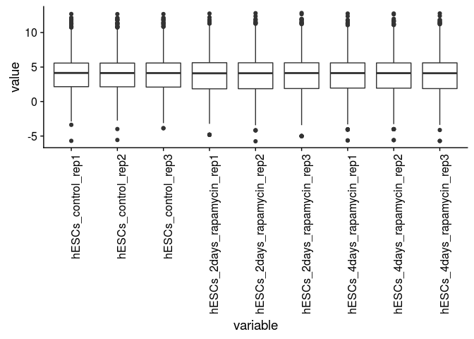

``` r
plotMDS(cleaned_log_cpm_df[,-1], cex=1.5)
```

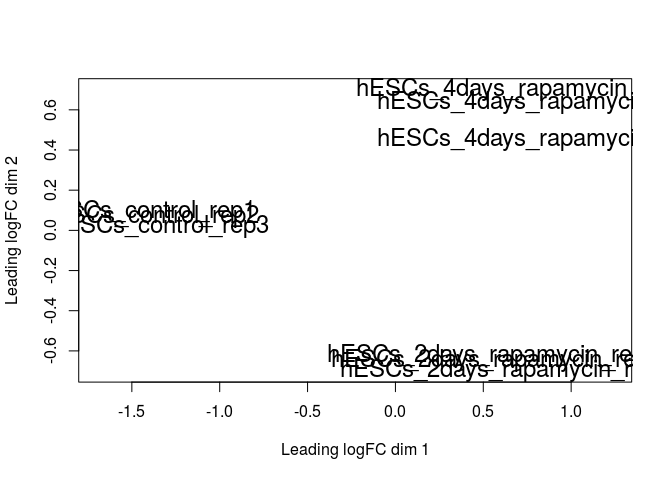

``` r
time_course_Fit <- lmFit(after_voom_cpm, designMatrix)

# apply eBayes() for moderated statistics
time_course_Fit_Ebayes <- eBayes(time_course_Fit)

plotSA(time_course_Fit_Ebayes)
```

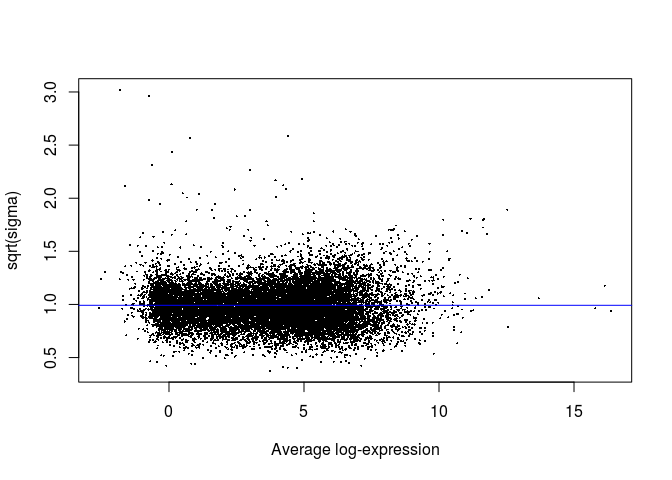

``` r
cutoff <- 5e-02 #0.05 p value
#adjust method by default is BH (equivalent to fdr)
time_course_res <- decideTests(time_course_Fit_Ebayes, p.value = cutoff, lfc = 1)
summary(time_course_res)
```

    ##        (Intercept) time2 time4
    ## Down            59  1017  1100
    ## NotSig        2171 13972 13788
    ## Up           12919   160   261

``` r
colnames(metadata_age) <- c("sample", "time")
metadata_age %>% kable()
```

|            | sample                        | time |
|------------|:------------------------------|:-----|
| GSM2884378 | hESCs\_control\_rep1          | 0    |
| GSM2884379 | hESCs\_control\_rep2          | 0    |
| GSM2884380 | hESCs\_control\_rep3          | 0    |
| GSM2884381 | hESCs\_2days\_rapamycin\_rep1 | 2    |
| GSM2884382 | hESCs\_2days\_rapamycin\_rep2 | 2    |
| GSM2884383 | hESCs\_2days\_rapamycin\_rep3 | 2    |
| GSM2884384 | hESCs\_4days\_rapamycin\_rep1 | 4    |
| GSM2884385 | hESCs\_4days\_rapamycin\_rep2 | 4    |
| GSM2884386 | hESCs\_4days\_rapamycin\_rep3 | 4    |

``` r
#function for plotting genes
plotGenes <- function(genes, expressionMatrix, metadata) {
  
  expressionDataForGenes <- expressionMatrix %>%
    #rownames_to_column("gene") %>%
    filter(gene %in% genes) %>%
    melt()
  
  colnames(expressionDataForGenes) <- c("gene", "sample", "expression")
  expressionDataForGenes <- expressionDataForGenes %>%
    left_join(metadata, id="time")
  
  expressionDataForGenes %>% 
    ggplot(aes(x = time, y = expression, color=gene)) +
    geom_point() +
    geom_jitter() +
    stat_summary(aes(y = expression, group=1), fun.y = "mean", geom="line", size=2) +
    facet_wrap(~gene)
}
```

``` r
sample_genes <- c("POU5F1", "NANOG", "SOX2")
plotGenes(sample_genes, cleaned_log_cpm_df, metadata_age)
```

    ## Using gene as id variables

    ## Joining, by = "sample"

    ## Warning: Column `sample` joining factors with different levels, coercing to
    ## character vector

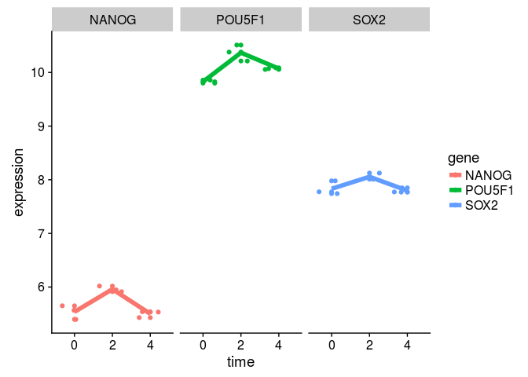

``` r
sample_genes <- c("CXCR4", "SOX17", "HNF1B", "KIT", "KRT19", "FOXA2")
plotGenes(sample_genes, cleaned_log_cpm_df, metadata_age)
```

    ## Using gene as id variables

    ## Joining, by = "sample"

    ## Warning: Column `sample` joining factors with different levels, coercing to
    ## character vector

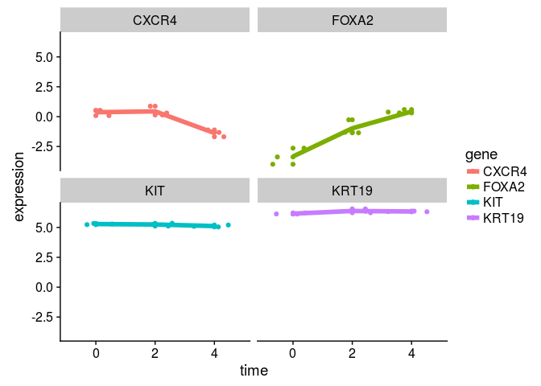

``` r
plotGenes(c("INHBA"), cleaned_log_cpm_df, metadata_age)
```

    ## Using gene as id variables

    ## Joining, by = "sample"

    ## Warning: Column `sample` joining factors with different levels, coercing to
    ## character vector

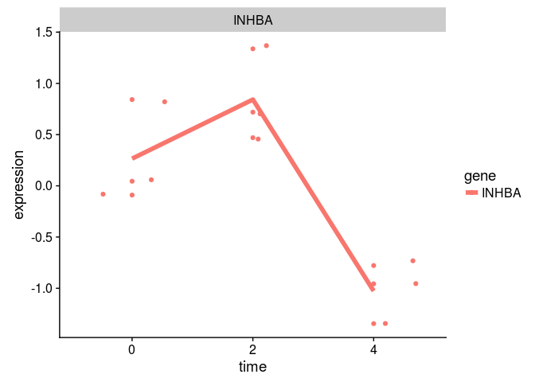

Gene set enrichment analysis of GSE107965
-----------------------------------------

``` r
DEgenes_4days <- topTable(time_course_Fit_Ebayes, number = Inf, coef = "time4")

ggplot(data = DEgenes_4days, aes(x = logFC, y = -log(adj.P.Val), color = (-log(adj.P.Val) > 3)))+
  scale_colour_manual(name = 'p-value < 0.05', values = setNames(c('red','black'),c(T, F)), labels = c("False", "True"))+
  geom_point()+
  geom_vline(xintercept=0)+
  geom_vline(xintercept=-2)+
  geom_vline(xintercept=2)+
  #xlim(-1.5,1.5)+
  ylab("-log(p-value)")+
  xlab("logFC")+
  labs(title="Gene expression differences in 0h and 4 days treatment cells, GSE107965")+
  theme_bw()+
  theme(axis.line = element_line(colour = "black"),
        panel.grid.major = element_blank(),
        panel.grid.minor = element_blank(),
        #panel.border = element_blank(),
        panel.background = element_blank()) +
  theme(axis.title.x=element_text(size=12),
        axis.text.y=element_text(size=12),
        axis.title.y=element_text(size=14),
        axis.ticks.x=element_blank(),
        strip.text.x = element_text(size=14),
        strip.background = element_rect(colour="white", fill="white"),
        legend.text=element_text(size=15),
        legend.title=element_text(size=14))
```

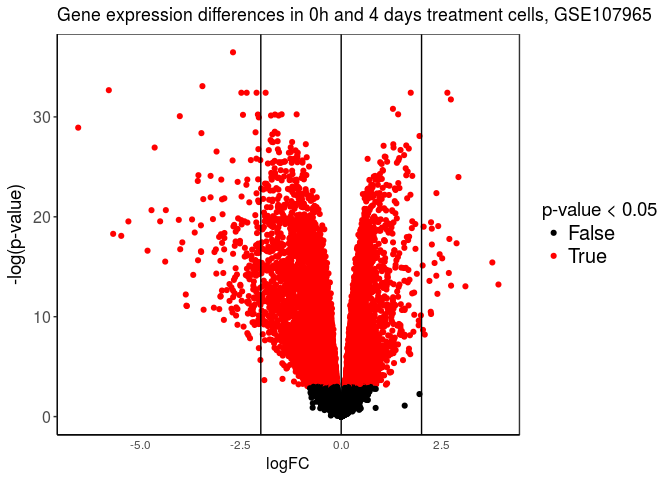

``` r
cleaned_biomart <- biomart_genes %>%
  filter(hgnc_symbol != "")

DEgenes_4days <- DEgenes_4days[rownames(DEgenes_4days) %in% cleaned_biomart$ensembl_gene_id,]
DEgenes_4days <- DEgenes_4days[cleaned_biomart$ensembl_gene_id,]

x <- biomart_genes
x <- x %>% filter(ensembl_gene_id %in% rownames(DEgenes_4days))
DEgenes_4days$gene <- x$hgnc_symbol

ermineInputGeneScores <- DEgenes_4days %>% 
  mutate(absolute_logFC = abs(logFC)) %>% 
  dplyr::select(gene, absolute_logFC) %>% 
  na.omit() %>% 
  as.data.frame() %>% 
  arrange(desc(absolute_logFC)) %>% 
  column_to_rownames("gene")

head(ermineInputGeneScores, 10) %>% kable() # print the first few rows
```

|           |  absolute\_logFC|
|-----------|----------------:|
| LINC00458 |         6.544256|
| LINC01108 |         5.782367|
| OR52A1    |         5.674252|
| FAM107A   |         4.818470|
| AADACL3   |         4.505000|
| CALCR     |         4.379082|
| TRDN      |         4.041157|
| MYCT1     |         4.005714|
| MEIOB     |         3.953301|
| EBF2      |         3.913454|

``` r
enrichmentResult <- precRecall(scores = ermineInputGeneScores, 
                               scoreColumn = 1, # column 1 is the scores 
                               bigIsBetter = TRUE, # larger logFC should be ranked higher
                               annotation = "Generic_human", # ask ermineJ to use the Generic_human annotation file (will automatically download)
                               aspects = "B", # look at only biological processes 
                               iterations = 10000, # 10K sampling iterations so that results are stable
                               geneSetDescription = "../GSE109658/GO.xml") # use the GO XML file in current directory

enrichmentResult$results %>% arrange(MFPvalue) %>% head(10) %>% kable()
```

| Name                                                       | ID           |  NumProbes|  NumGenes|   RawScore|   Pval|  CorrectedPvalue|  MFPvalue|  CorrectedMFPvalue|  Multifunctionality| Same as | GeneMembers                                                                                                                                                                                                                                                                                                                                                                                                                                                                                                                                                                                                                                                                                                                                                                                                                                                                                                                                                                                                                                                                                                                                                |
|:-----------------------------------------------------------|:-------------|----------:|---------:|----------:|------:|----------------:|---------:|------------------:|-------------------:|:--------|:-----------------------------------------------------------------------------------------------------------------------------------------------------------------------------------------------------------------------------------------------------------------------------------------------------------------------------------------------------------------------------------------------------------------------------------------------------------------------------------------------------------------------------------------------------------------------------------------------------------------------------------------------------------------------------------------------------------------------------------------------------------------------------------------------------------------------------------------------------------------------------------------------------------------------------------------------------------------------------------------------------------------------------------------------------------------------------------------------------------------------------------------------------------|
| sensory perception of chemical stimulus                    | <GO:0007606> |         31|        31|  0.0499238|  0e+00|        0.0000000|     0e+00|          0.0000000|               0.653| NA      | ADCY3|ASIC1|ASIC3|B3GNT2|BBS1|BBS4|BEST2|CD36|FZD2|GFY|GNAL|GNAS|GNB1|ITPR3|MKKS|NAV2|OR52A1|P2RX2|PDE4A|PLCB2|REEP2|RTP1|SCNN1A|SCNN1D|SCNN1G|SYT10|TAS2R14|TAS2R5|TRPV1|UBR3|VN1R1|                                                                                                                                                                                                                                                                                                                                                                                                                                                                                                                                                                                                                                                                                                                                                                                                                                                                                                                                                                      |
| regulation of cytosolic calcium ion concentration          | <GO:0051480> |        156|       156|  0.0294451|  0e+00|        0.0000000|     0e+00|          0.0000000|               0.993| NA      | ABL1|ABL2|ADCY5|ADCYAP1R1|ADM|AKAP6|ATP1A2|ATP2B1|ATP2B2|ATP2B4|BAK1|BAX|BCAP31|BOK|C1QTNF1|CACNA1A|CACNA1C|CACNA2D1|CACNB3|CALB1|CALB2|CALCA|CALCR|CALM1|CALM2|CALM3|CASQ1|CAV1|CCKBR|CCL28|CD24|CD36|CD4|CD55|CDH23|CEMIP|CHERP|CHRNA10|CHRNA9|CIB2|CXCR2|CXCR4|DDIT3|DLG4|EDN1|EDNRA|EDNRB|ERO1A|F2R|F2RL1|FAM155A|FAM155B|FGF2|FIS1|FKBP1A|FKBP1B|FZD9|GALR1|GJA1|GLP1R|GNA13|GNB1|GNG3|GPR157|GRIA1|GRIN1|GRIN2A|GRIN2B|GRIN2D|GRM1|GSTM2|GSTO1|GTF2I|HAP1|HMGB1|HRC|HTR2C|HTT|IBTK|ITGAV|ITPR1|ITPR2|ITPR3|JAK2|JPH1|JPH2|JPH3|JPH4|LCK|LETM1|LPAR1|LPAR2|LPAR3|LPAR4|LPAR6|LRP6|MCHR1|MCOLN1|NMU|NOL3|NPTN|NTSR1|OXTR|P2RX2|P2RX4|P2RX5|P2RY1|PDE6B|PDGFRA|PDPK1|PKD1|PKD2|PLA2G6|PLCE1|PLCG1|PLCG2|PRKACA|PRKCE|PROK2|PTGER2|PTGER3|PTGER4|PTK2B|RASA3|RIC3|RYR1|RYR2|RYR3|S1PR1|S1PR3|SELENOT|SLC35G1|SLC8A1|SLC8B1|SMAD3|SNCA|SPPL3|SRI|SWAP70|TAC1|TACR1|TGM2|THY1|TMEM178A|TMEM64|TPCN1|TPCN2|TRDN|TRPC1|TRPC4|TRPC5|TRPM4|TRPV1|TRPV4|TRPV6|YWHAE|                                                                                                                                                                                            |
| detection of chemical stimulus                             | <GO:0009593> |         23|        23|  0.0492298|  1e-04|        0.0475333|     0e+00|          0.0000000|               0.788| NA      | ABCG1|ASIC3|CALM1|CALM2|CALM3|CYB5R4|GCK|KCNIP2|KCNMB3|KCNMB4|LBP|OR52A1|P2RX2|RTP1|RYR2|SCARB1|SSC5D|STIM1|SYT1|TAS2R14|TAS2R5|TLR2|TRPV1|                                                                                                                                                                                                                                                                                                                                                                                                                                                                                                                                                                                                                                                                                                                                                                                                                                                                                                                                                                                                                |
| positive regulation of cytosolic calcium ion concentration | <GO:0007204> |        137|       137|  0.0271395|  0e+00|        0.0000000|     1e-04|          0.0713000|               0.996| NA      | ABL1|ABL2|ADCY5|ADCYAP1R1|ADM|AKAP6|ATP2B4|BAK1|BAX|BCAP31|C1QTNF1|CACNA1A|CACNA1C|CACNA2D1|CACNB3|CALCA|CALCR|CALM1|CALM2|CALM3|CASQ1|CAV1|CCKBR|CCL28|CD24|CD36|CD4|CD55|CEMIP|CHERP|CHRNA10|CHRNA9|CIB2|CXCR2|CXCR4|DDIT3|DLG4|EDN1|EDNRA|EDNRB|ERO1A|F2R|F2RL1|FAM155A|FAM155B|FGF2|FIS1|FKBP1A|FKBP1B|GALR1|GJA1|GLP1R|GNA13|GNB1|GNG3|GPR157|GRIN1|GRIN2A|GRIN2B|GRIN2D|GRM1|GSTM2|GSTO1|HAP1|HMGB1|HTR2C|HTT|IBTK|ITGAV|ITPR1|ITPR2|ITPR3|JAK2|JPH1|JPH2|JPH3|JPH4|LCK|LETM1|LPAR1|LPAR2|LPAR3|LPAR4|LPAR6|LRP6|MCHR1|MCOLN1|NMU|NOL3|NPTN|NTSR1|OXTR|P2RX2|P2RX4|P2RX5|P2RY1|PDGFRA|PDPK1|PKD1|PKD2|PLA2G6|PLCE1|PLCG1|PLCG2|PRKCE|PROK2|PTGER2|PTGER3|PTGER4|PTK2B|RASA3|RIC3|RYR1|RYR2|RYR3|S1PR1|S1PR3|SELENOT|SLC8A1|SLC8B1|SNCA|SPPL3|SRI|SWAP70|TAC1|TACR1|TGM2|THY1|TPCN1|TPCN2|TRDN|TRPC1|TRPC5|TRPM4|TRPV1|TRPV4|TRPV6|                                                                                                                                                                                                                                                                                                                   |
| detection of stimulus involved in sensory perception       | <GO:0050906> |         35|        35|  0.0396100|  1e-04|        0.0407429|     1e-04|          0.0570400|               0.795| NA      | ADORA1|ANO1|ARRB2|ASIC3|ATP8A2|BEST1|CACNA1F|CALCA|CHRNA10|CHRNA9|COL11A1|CXCL12|EPHB1|FYN|HPN|ITGA2|KIT|LXN|MKKS|MMP24|NR2F6|NTSR1|OR52A1|PDZD7|PIEZO2|REEP6|RTP1|SCN1A|SEMA5B|SERPINE2|TAS2R14|TAS2R5|TMC1|TRPV1|TULP1|                                                                                                                                                                                                                                                                                                                                                                                                                                                                                                                                                                                                                                                                                                                                                                                                                                                                                                                                  |
| second-messenger-mediated signaling                        | <GO:0019932> |        154|       154|  0.0267229|  0e+00|        0.0000000|     2e-04|          0.0950667|               0.982| NA      | ABCA1|ADCY1|ADCY2|ADCY3|ADCY5|ADCY6|ADCY7|ADCY8|ADCY9|ADCYAP1R1|ADGRB2|ADGRG6|ADGRL1|ADM|ADM2|ADORA2B|ADRA2A|ADRA2B|ADRA2C|AHR|AKAP13|AKAP6|ANK2|APOE|ATP1A2|ATP1B1|ATP2A2|BCAP31|BHLHA15|CACNA1C|CALCA|CALCR|CALCRL|CALM1|CALM2|CALM3|CAMK2D|CAMKK2|CASQ1|CD36|CHGA|CXCR4|DDAH1|DDAH2|DGKD|DGKQ|DMD|DMPK|EDN1|EDNRB|EGFR|EIF2AK3|EIF4EBP2|FIS1|FKBP1B|GAL|GALR1|GHRHR|GLP1R|GNA13|GNAL|GNAQ|GNAS|GNB1|GNG2|GPR143|GPR3|GPR78|GRIN1|GRIN2A|GRIN2B|GRIN2D|GSTM2|GSTO1|GUCY1B1|HDAC4|HOMER2|HRC|INPP5A|ITPR1|ITPR2|ITPR3|KDR|KSR1|KSR2|LAT2|MAFA|MAPK7|MC1R|MCOLN1|MCTP1|MCTP2|MCU|NCALD|NDNF|NDUFS4|NFAT5|NFATC1|NFATC2|NFATC3|NFATC4|NOS1|NOS2|NOS3|NR5A2|NUDT4|P2RX4|P2RY11|PCLO|PDE2A|PDE3A|PDE4D|PDE9A|PDPK1|PLCE1|PLCG1|PLCG2|PPP1R9A|PPP1R9B|PPP2CA|PPP2R1A|PPP3CA|PPP3CB|PPP3CC|PPP3R1|PRKAA1|PRKACA|PRKG1|PRNP|PTGER2|PTGER3|PTGER4|RAMP2|RAPGEF2|RAPGEF3|RAPGEF4|RASD1|RCAN1|RCAN2|RCAN3|RIMS2|RIT2|RYR2|SAMD14|SLC8A1|SLC9A1|SLC9A3R1|SOX9|SPHK1|STIMATE|TNFSF11|TNNI3|TPCN2|TRPM4|                                                                                                                                                               |
| positive regulation of ion transport                       | <GO:0043270> |        161|       161|  0.0280800|  0e+00|        0.0000000|     2e-04|          0.0814857|               0.999| NA      | ABAT|ABCA7|ABCB4|ABCC8|ABL1|ACTN2|ACTN4|ADCYAP1R1|ADORA1|ADRA2A|AHCYL1|AKAP6|AKAP9|AKT1|ALG10B|AMIGO1|ANK2|ANK3|ANO6|APOE|ARC|ARF1|ARL6IP1|ARRB2|ATP1B1|ATP1B2|ATP1B3|ATP8A1|ATP8A2|BAK1|BAX|CACNA1D|CACNA2D1|CACNB2|CALCR|CALM1|CALM2|CALM3|CASK|CASQ1|CAV1|CCL2|CD4|CEMIP|CFTR|CHP1|CHRNB2|CLTRN|CNKSR3|CNTN1|COX17|CRACR2A|CXCL12|DLG1|DMD|DNM2|DRD4|EDN1|EHD3|EPHB2|ERFE|F2R|FGF12|FHL1|FLNA|G6PD|GAL|GLRX|GPD1L|GRIN1|GSTM2|GSTO1|HAP1|HOMER1|HSPA2|HTR3A|HTT|JPH2|KCNE3|KCNE5|KCNH2|KCNJ11|KCNJ2|KCNQ1|KIF5B|LGALS3|LPAR3|LRRC55|MAP2K6|MYLK|NIPSNAP2|NLGN3|NOS1|NOS1AP|NTSR1|ORAI1|P2RX2|P2RX4|P2RX5|P2RY1|PARK7|PDGFB|PDGFRB|PDPK1|PINK1|PKD2|PKP2|PLA2G6|PLA2R1|PLCG1|PLCG2|PRELID1|PRKCD|PRSS8|PTAFR|RAB3B|RAB3GAP1|RELN|RGN|RNF207|RYR2|S100A1|SCN1B|SCN3B|SCN4B|SCN5A|SHANK3|SLC38A3|SLC9A1|SNCA|SNX4|SRI|STAC|STAC3|STC1|STIM1|STIM2|STIMATE|STK39|STXBP1|SUMO1|SYT4|TCAF1|TESC|THY1|TMSB4X|TNFRSF11A|TNFSF11|TRDN|TRIAP1|TRPC1|TRPV2|TRPV3|TSPO|VAMP7|VAMP8|WFS1|WNK1|WNK2|WNK3|WNK4|                                                                                                                                                        |
| detection of stimulus                                      | <GO:0051606> |        122|       122|  0.0251415|  2e-04|        0.0633778|     3e-04|          0.1069500|               0.968| NA      | ABCG1|ADORA1|ANO1|ARRB1|ARRB2|ASIC3|ATP8A2|BEST1|C21orf2|CACNA1F|CADM1|CALCA|CALM1|CALM2|CALM3|CD1D|CDS1|CHRNA10|CHRNA9|COL11A1|CUL4A|CUL4B|CXCL12|CYB5R4|DDB1|DENND5A|DENND5B|DTL|ELOVL4|EPHB1|FYN|GCK|GNA11|GNAQ|GNB1|GUCA1A|HMGA2|HPN|ITGA2|JUP|KCNIP2|KCNMB3|KCNMB4|KIT|LBP|LXN|MKKS|MMP24|MRPS11|MRPS26|MRPS35|MRPS9|NEK1|NOD1|NPFFR2|NR2F6|NTSR1|OPN1SW|OPN3|OR52A1|P2RX2|PARP1|PCNA|PDE6B|PDE6G|PDZD7|PIEZO1|PIEZO2|PITPNM1|PKD1|PKD1L2|PKD2|PLEKHB1|PNKP|POLD1|POLD2|POLD3|POLD4|RAD18|RBX1|RDH11|REEP6|RFC1|RFC2|RFC3|RFC4|RFC5|RPA1|RPA2|RPA3|RPS27A|RPS3|RTP1|RYR2|SCARB1|SCN1A|SEMA5B|SERPINE2|SMO|SOX4|SSC5D|STIM1|SYT1|TAC1|TACR1|TAS2R14|TAS2R5|TCAP|TIMELESS|TLR2|TMC1|TRPM3|TRPV1|TTN|TULP1|UBA52|UBB|UBC|UBE2B|UNC119|USP1|WDR48|                                                                                                                                                                                                                                                                                                                                                                                                        |
| regulation of blood circulation                            | <GO:1903522> |        186|       186|  0.0276927|  4e-04|        0.1037091|     8e-04|          0.2535111|               0.997| NA      | ACE|ADA|ADM|ADORA1|ADRA2A|ADRA2B|ADRA2C|AHCYL1|AKAP9|AKT1|ANK2|APELA|APLN|ARHGAP42|ASPH|ATP1A1|ATP1A2|ATP1A3|ATP1B1|ATP1B2|ATP1B3|ATP2A1|ATP2A2|ATP2A3|ATP2B1|ATP2B2|ATP2B4|BMPR2|BVES|CACNA1B|CACNA1C|CACNA1D|CACNA1F|CACNA1G|CACNA1H|CACNA2D1|CACNA2D2|CACNA2D3|CACNB1|CACNB2|CACNB3|CACNB4|CACNG4|CACNG7|CACNG8|CALCA|CALM1|CALM2|CALM3|CAMK2D|CASQ1|CAV1|CELF2|CHGA|CHRM3|CTGF|CTNNA3|CXADR|CYP2J2|DBH|DES|DLG1|DMD|DMPK|DOCK4|DOCK5|DSC2|DSG2|DSP|ECE1|EDN1|EGFR|EHD3|EPAS1|F2R|F2RL1|FGF13|FKBP1B|FLNA|FXYD6|FXYD7|GAA|GCH1|GJA1|GJA5|GJC1|GJC3|GLP1R|GLRX3|GNAO1|GPD1L|GRK2|GSK3A|GSTM2|GSTO1|HBEGF|HCN4|HDAC4|HEY2|HRC|HRH2|ICAM1|ITPR1|ITPR2|ITPR3|JAK2|JUP|KCND1|KCND2|KCND3|KCNE3|KCNE5|KCNH2|KCNH6|KCNIP2|KCNIP4|KCNJ11|KCNJ12|KCNJ14|KCNJ2|KCNJ4|KCNK1|KCNK6|KCNMB4|KCNN2|KCNQ1|MDM2|MEF2A|NMU|NOS1|NOS1AP|NOS3|NPPC|NPR1|NPR2|NUP155|OXTR|P2RX4|PDE4B|PDE4D|PDE5A|PER2|PKP2|PRKACA|PTAFR|RANGRF|RGS2|RHOA|RNF207|RNLS|RYR1|RYR2|RYR3|S100A1|SCN1B|SCN3B|SCN4B|SCN5A|SEMA3A|SLC1A1|SLC8A1|SLC8A2|SLC9A1|SMAD7|SNTA1|SPTBN4|SPX|SREBF1|SRI|STC1|STIM1|SUMO1|TAC1|TACR1|TACR3|THRA|THRB|TMEM65|TNNI3|TNNT2|TPM1|TRDN|TRPC1|TRPM4|YWHAE|ZC3H12A| |
| regulation of calcium ion transport                        | <GO:0051924> |        147|       147|  0.0233198|  4e-04|        0.0950667|     2e-03|          0.5185454|               0.995| NA      | ABL1|ADCYAP1R1|ADRA2A|AHNAK|AKAP6|ANK2|ARRB2|ATG5|ATP1A2|ATP1B1|BAK1|BAX|BCL2|BEST1|CACNA1B|CACNA1C|CACNA1D|CACNA2D1|CACNB1|CACNB2|CACNB3|CACNB4|CALCR|CALM1|CALM2|CALM3|CAMK2D|CAMK2G|CASK|CASQ1|CAV1|CBARP|CCL2|CD4|CEMIP|CHD7|CORO1A|CRACR2A|CRACR2B|CTNNB1|CXCL12|CYBA|DIAPH1|DMD|DRD4|EGF|EHD3|F2R|FKBP1A|FKBP1B|FMR1|FYN|G6PD|GEM|GJA1|GNAI2|GNAO1|GNB5|GRIN1|GRIN3B|GSTM2|GSTO1|HAP1|HOMER1|HOMER2|HOMER3|HRC|HSPA2|HTT|ICAM1|INPP5K|JPH1|JPH2|JPH3|JPH4|KCNE3|LGALS3|LPAR3|LYN|MYLK|MYO5A|NIPSNAP2|NOS1|NOS1AP|NOS3|NTSR1|OPRD1|ORAI1|P2RX2|P2RX4|P2RX5|PACSIN3|PDE4B|PDE4D|PDGFB|PDGFRB|PDPK1|PKD2|PLA2G6|PLCG1|PLCG2|PML|PRKACA|PRKCE|PRNP|PTK2B|PTPN6|REM2|RGN|RHOA|RYR2|S100A1|SARAF|SELENON|SEMG1|SESTD1|SLC30A1|SLC8A1|SLC8B1|SLC9A1|SNCA|SRI|STAC|STAC3|STC1|STC2|STIM1|STIM2|STIMATE|SUMO1|TGFB1|THADA|THY1|TMBIM6|TMC1|TRDN|TRIM27|TRPC1|TRPV2|TRPV3|TSPAN13|TSPO|UBASH3B|UBQLN1|WFS1|WNK3|YWHAE|                                                                                                                                                                                                                                         |

``` r
enrichmentResult$results %>% 
  dplyr::select(Name, CorrectedPvalue, CorrectedMFPvalue) %>% 
  arrange(CorrectedMFPvalue) %>% 
  head(10) %>% 
  kable(align = "l", col.names = c("Biological Process", "Corrected p-value", 
                                   "Corrected MF p-value"))
```

| Biological Process                                                                          | Corrected p-value | Corrected MF p-value |
|:--------------------------------------------------------------------------------------------|:------------------|:---------------------|
| regulation of cytosolic calcium ion concentration                                           | 0.0000000         | 0.0000000            |
| detection of chemical stimulus                                                              | 0.0475333         | 0.0000000            |
| sensory perception of chemical stimulus                                                     | 0.0000000         | 0.0000000            |
| detection of stimulus involved in sensory perception                                        | 0.0407429         | 0.0570400            |
| positive regulation of cytosolic calcium ion concentration                                  | 0.0000000         | 0.0713000            |
| positive regulation of ion transport                                                        | 0.0000000         | 0.0814857            |
| second-messenger-mediated signaling                                                         | 0.0000000         | 0.0950667            |
| detection of stimulus                                                                       | 0.0633778         | 0.1069500            |
| regulation of blood circulation                                                             | 0.1037091         | 0.2535111            |
| G-protein coupled receptor signaling pathway, coupled to cyclic nucleotide second messenger | 0.1096923         | 0.4991000            |

``` r
Enrichment <- enrichmentResult$results
Enrichment$Name <- as.factor(Enrichment$Name)

Enrichment %>% 
  dplyr::select(Name, NumGenes, CorrectedMFPvalue) %>% 
  arrange(CorrectedMFPvalue) %>% 
  filter(CorrectedMFPvalue <= 5e-2) %>% 
  head(25) %>% 
  ggplot(aes(x = fct_reorder(Name, CorrectedMFPvalue), 
             y = NumGenes, fill = CorrectedMFPvalue)) +
  geom_col() +
  labs(title = "Biological Processes - GSE109765 - 4 days", 
       x = "", y = "Number of Genes") +
  theme(axis.text.x = element_text(angle = 90, hjust = 1)) +
  coord_flip() +
  theme_light() 
```

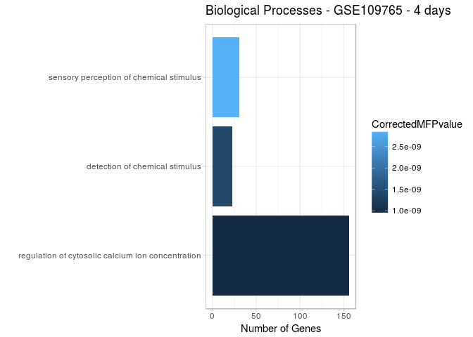
