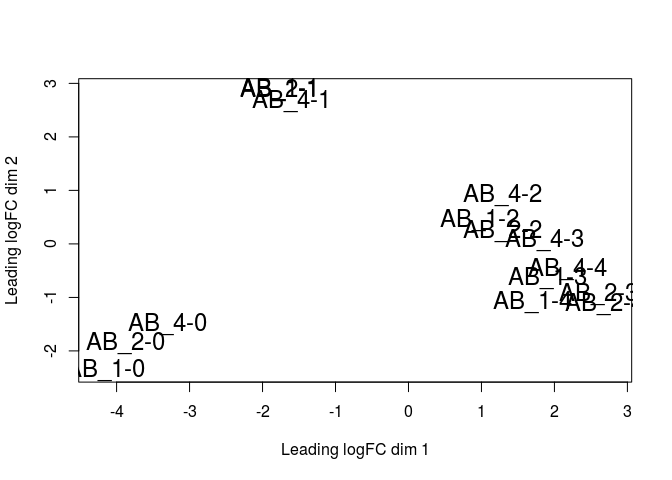
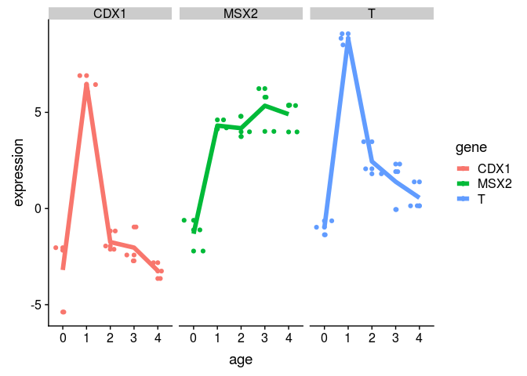
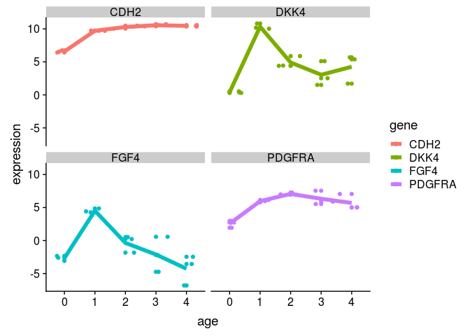
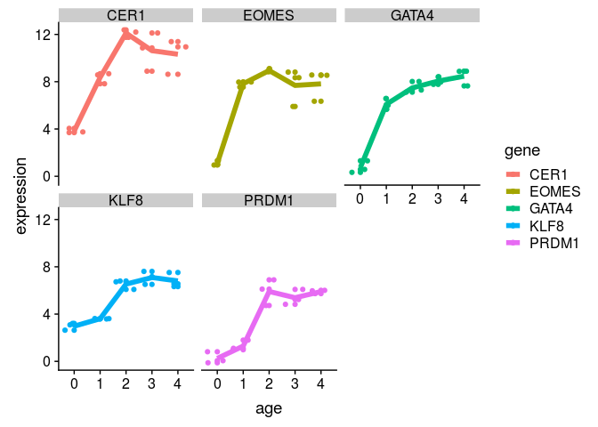
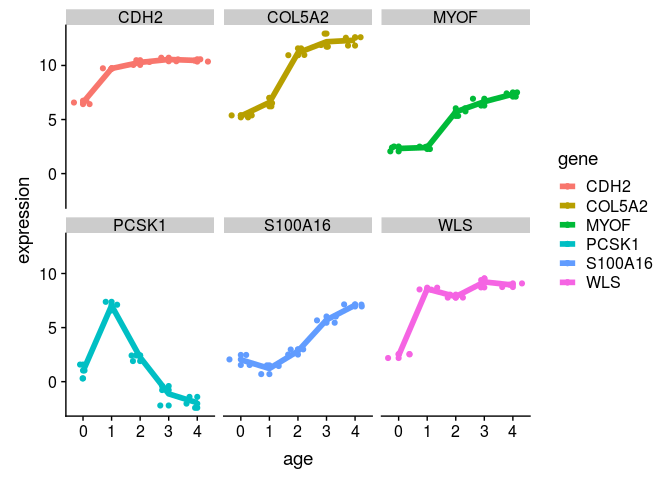

GSE109658 data analysis
================
German Novakovskiy
April 6, 2018

Here we analyze gene expression data from [this paper.](https://www.ncbi.nlm.nih.gov/pubmed/29427839).

Differentiation was started with activin A and CHIR99021 for 24 hours, then activin A only for 4 days. Base differentiation medium is Advanced RPMI 1640.

``` r
if (file.exists("GSE109658.Rdata")) {
    # if previously downloaded
    load("GSE109658.Rdata")
} else {
    # Get geo object that contains our data and phenotype information
    geo_obj <- getGEO("GSE109658", GSEMatrix = TRUE)
    geo_obj <- geo_obj[[1]]
    save(geo_obj, file = "GSE109658.Rdata")
}
```

``` r
show(geo_obj)
```

    ## ExpressionSet (storageMode: lockedEnvironment)
    ## assayData: 0 features, 15 samples 
    ##   element names: exprs 
    ## protocolData: none
    ## phenoData
    ##   sampleNames: GSM2948049 GSM2948050 ... GSM2948063 (15 total)
    ##   varLabels: title geo_accession ... cell type:ch1 (38 total)
    ##   varMetadata: labelDescription
    ## featureData: none
    ## experimentData: use 'experimentData(object)'
    ## Annotation: GPL11154

In metadata all we have is age (0, 1, 2, 3 and 4 days):

``` r
#get covariate matrix
geo_metadata <- pData(geo_obj)[, c("organism_ch1", "title", colnames(pData(geo_obj))[grep("characteristics", 
    colnames(pData(geo_obj)))])]

geo_metadata <- geo_metadata[,-3]
colnames(geo_metadata) <- c("organism", "sample", "description")

geo_metadata$age <- as.factor(rep(c("0", "1", "2", "3", "4"), 3))

geo_metadata %>% kable()
```

|            | organism     | sample  | description                             | age |
|------------|:-------------|:--------|:----------------------------------------|:----|
| GSM2948049 | Homo sapiens | AB\_1-0 | cell line: H9                           | 0   |
| GSM2948050 | Homo sapiens | AB\_1-1 | cell line: H9; day 1 of differentiation | 1   |
| GSM2948051 | Homo sapiens | AB\_1-2 | cell line: H9; day 2 of differentiation | 2   |
| GSM2948052 | Homo sapiens | AB\_1-3 | cell line: H9; day 3 of differentiation | 3   |
| GSM2948053 | Homo sapiens | AB\_1-4 | cell line: H9; day 4 of differentiation | 4   |
| GSM2948054 | Homo sapiens | AB\_2-0 | cell line: H9                           | 0   |
| GSM2948055 | Homo sapiens | AB\_2-1 | cell line: H9; day 1 of differentiation | 1   |
| GSM2948056 | Homo sapiens | AB\_2-2 | cell line: H9; day 2 of differentiation | 2   |
| GSM2948057 | Homo sapiens | AB\_2-3 | cell line: H9; day 3 of differentiation | 3   |
| GSM2948058 | Homo sapiens | AB\_2-4 | cell line: H9; day 4 of differentiation | 4   |
| GSM2948059 | Homo sapiens | AB\_4-0 | cell line: H9                           | 0   |
| GSM2948060 | Homo sapiens | AB\_4-1 | cell line: H9; day 1 of differentiation | 1   |
| GSM2948061 | Homo sapiens | AB\_4-2 | cell line: H9; day 2 of differentiation | 2   |
| GSM2948062 | Homo sapiens | AB\_4-3 | cell line: H9; day 3 of differentiation | 3   |
| GSM2948063 | Homo sapiens | AB\_4-4 | cell line: H9; day 4 of differentiation | 4   |

Let's load the expression data (in raw counts):

``` r
expr_data_counts <- read.table("GSE109658_gene_counts.txt", header=TRUE) 
colnames(expr_data_counts)[-1] <- as.character(geo_metadata$sample)

head(expr_data_counts, 10) %>% kable()
```

| GENE   |  AB\_1-0|  AB\_1-1|  AB\_1-2|  AB\_1-3|  AB\_1-4|  AB\_2-0|  AB\_2-1|  AB\_2-2|  AB\_2-3|  AB\_2-4|  AB\_4-0|  AB\_4-1|  AB\_4-2|  AB\_4-3|  AB\_4-4|
|:-------|--------:|--------:|--------:|--------:|--------:|--------:|--------:|--------:|--------:|--------:|--------:|--------:|--------:|--------:|--------:|
| MARC1  |     6824|     2606|     1618|     2328|     3994|     9204|     3964|     1350|     1118|      974|     4644|     3730|      840|      734|      550|
| MARCH1 |     1098|      354|      974|      638|     1064|     1448|      266|      882|      426|      324|      492|      694|      348|      256|      106|
| MARC2  |      296|      152|      144|      136|      164|      364|      104|      118|      136|      300|      456|      312|      198|      218|      168|
| MARCH2 |      380|      314|      460|     1142|     1322|      328|      188|      394|      784|     1754|      618|      494|      494|      720|     1142|
| MARCH3 |     1660|      344|     1422|      506|      222|      930|      232|      852|      464|     1182|      982|      460|      500|      812|      876|
| MARCH4 |      162|      162|      208|       98|       88|      336|      146|      188|       84|      430|      386|      230|      138|      182|      152|
| MARCH5 |     8454|     4004|     9708|    11418|     8192|     7370|     4626|     8202|     5826|     5610|     4188|     6306|     5120|     3842|     2448|
| MARCH6 |     6824|     9000|    19850|    25460|    20572|    15792|     9304|    15018|    12822|    16836|    10628|    11896|    11150|    13808|     8038|
| MARCH7 |    26512|     9726|    39266|    46158|    28432|    29576|    12470|    22442|    17188|    16278|    14354|    15300|     9960|    11980|     6182|
| MARCH8 |      742|      800|     1106|     1838|     1156|     1180|      778|      942|      642|      870|      898|     1036|      734|      740|      426|

``` r
dim(expr_data_counts)
```

    ## [1] 23398    16

We have duplicates in rownames (for some reason):

``` r
#we have duplicates in rownames
repeats <- expr_data_counts$GENE[!isUnique(expr_data_counts$GENE)]
repeats
```

    ##   [1] AKAP17A      AKAP17A      ASMT         ASMT         ASMTL       
    ##   [6] ASMTL        ASMTL-AS1    ASMTL-AS1    CD99         CD99        
    ##  [11] CD99P1       CD99P1       CRLF2        CRLF2        CSF2RA      
    ##  [16] CSF2RA       DDX11L1      DDX11L1      DHRSX        DHRSX       
    ##  [21] DUX2         DUX2         DUX4         DUX4         DUX4L2      
    ##  [26] DUX4L2       DUX4L3       DUX4L3       DUX4L5       DUX4L5      
    ##  [31] DUX4L6       DUX4L6       FAM138A      FAM138A      FAM138F     
    ##  [36] FAM138F      FAM45B       FAM45B       GTPBP6       GTPBP6      
    ##  [41] IL3RA        IL3RA        IL9R         IL9R         LOC100132062
    ##  [46] LOC100132062 LOC100132287 LOC100132287 LOC100133331 LOC100133331
    ##  [51] MIR1244-1    MIR1244-1    MIR1244-1    MIR1244-2    MIR1244-2   
    ##  [56] MIR1244-2    MIR1244-3    MIR1244-3    MIR1244-3    MIR1256     
    ##  [61] MIR1256      MIR3690      MIR3690      MIR4444-1    MIR4444-1   
    ##  [66] MIR548H3     MIR548H3     OR4F16       OR4F16       OR4F29      
    ##  [71] OR4F29       OR4F3        OR4F3        P2RY8        P2RY8       
    ##  [76] PLCXD1       PLCXD1       PPP2R3B      PPP2R3B      PPP2R3B-AS1 
    ##  [81] PPP2R3B-AS1  RNF5P1       RNF5P1       SHOX         SHOX        
    ##  [86] SLC25A6      SLC25A6      SNORA59A     SNORA59A     SNORA59B    
    ##  [91] SNORA59B     SPRY3        SPRY3        TTL          TTL         
    ##  [96] VAMP7        VAMP7        XGPY2        XGPY2        ZBED1       
    ## [101] ZBED1       
    ## 23346 Levels: 1/2-SBSRNA4 A1BG A1BG-AS1 A1CF A2LD1 A2M A2ML1 A2MP1 ... ZZZ3

``` r
expr_data_counts$GENE <- as.character(expr_data_counts$GENE)
#get those genes that are not equal in terms of expression (fixing their names)
#adding "-1" (or other index) to gene name
for (i in repeats){
 repeated_rows <- expr_data_counts %>% filter(GENE %in% i)
 if (nrow(repeated_rows) == 1){
   next
 }
 if (nrow(repeated_rows == 2)){
   if (all(repeated_rows[1,] == repeated_rows[2,]) == FALSE) {
     expr_data_counts$GENE[expr_data_counts$GENE == i][1] <- paste(i, "1", sep="-")
   }
 }
 else{
   for (j in 1:nrow(repeated_rows)-1){
     if (all(repeated_rows[j,] == repeated_rows[j+1,]) == FALSE) {
       expr_data_counts$GENE[expr_data_counts$GENE == i][1] <- paste(i, as.character(j), sep="-")
   }
   }
 }
}
```

Now delete all repeats:

``` r
expr_data_counts <- expr_data_counts[!duplicated(expr_data_counts),]
dim(expr_data_counts)
```

    ## [1] 23354    16

Usually one will filter genes with 10-15 read counts. We have 54723184 as a lowest library size. 10 reads in such library size will be: 10/54723184 \*1e6 = 0.18. It is aproximately 0.2 cpm (the filtering is to this threshold) (let's go with 0.5 for voom)

``` r
#first let's create a edgeR DGElist object
rownams <- expr_data_counts$GENE

expr_data_counts <- as.matrix(expr_data_counts)
exp_data_counts_matrix <- apply(expr_data_counts[,-1], 2, function(x) as.numeric(x))
rownames(exp_data_counts_matrix) <- rownams

DGE_bulk_time_course_ec <- DGEList(counts = exp_data_counts_matrix) 

cpm <- cpm(DGE_bulk_time_course_ec)
keep.exprs <-rowSums(cpm > 0.5) >= 3 

DGE_bulk_time_course_ec <- DGE_bulk_time_course_ec[keep.exprs,,]

dim(DGE_bulk_time_course_ec)
```

    ## [1] 15217    15

We have raw counts, thus we need to perform a library size normalization using edgeR:

``` r
normalized_factors_expression <- calcNormFactors(DGE_bulk_time_course_ec, method = "TMM") #calculation of scaling factors (for library size)

normalized_factors_expression$samples$norm.factors
```

    ##  [1] 0.8764207 0.9981513 0.9528374 1.0161787 1.0435368 0.9530329 0.9831385
    ##  [8] 0.9968138 1.0200055 1.0204267 1.0547018 1.0929151 1.0312035 0.9550080
    ## [15] 1.0251937

Let's look at distribution of values:

``` r
#removing gene column and transforming into matrix (for hist)
data <- as.matrix(DGE_bulk_time_course_ec$counts)

hist(data, main="GSE109658", xlim = c(0,200000), xlab = "Expression",
     ylab = "Frequency", breaks = 300)
```


Let's now perform RNA-seq analysis with limma, using only time factor variable (time column in metadata) and let's look separately at DE gene at each stage

``` r
metadata_age <- geo_metadata[,c(2,4)]
metadata_age %>% kable()
```

|            | sample  | age |
|------------|:--------|:----|
| GSM2948049 | AB\_1-0 | 0   |
| GSM2948050 | AB\_1-1 | 1   |
| GSM2948051 | AB\_1-2 | 2   |
| GSM2948052 | AB\_1-3 | 3   |
| GSM2948053 | AB\_1-4 | 4   |
| GSM2948054 | AB\_2-0 | 0   |
| GSM2948055 | AB\_2-1 | 1   |
| GSM2948056 | AB\_2-2 | 2   |
| GSM2948057 | AB\_2-3 | 3   |
| GSM2948058 | AB\_2-4 | 4   |
| GSM2948059 | AB\_4-0 | 0   |
| GSM2948060 | AB\_4-1 | 1   |
| GSM2948061 | AB\_4-2 | 2   |
| GSM2948062 | AB\_4-3 | 3   |
| GSM2948063 | AB\_4-4 | 4   |

First, let's use contrast matrix:

``` r
designMatrix <- model.matrix(~0 + age, metadata_age)
head(designMatrix, 10) %>% kable()
```

|            |  age0|  age1|  age2|  age3|  age4|
|------------|-----:|-----:|-----:|-----:|-----:|
| GSM2948049 |     1|     0|     0|     0|     0|
| GSM2948050 |     0|     1|     0|     0|     0|
| GSM2948051 |     0|     0|     1|     0|     0|
| GSM2948052 |     0|     0|     0|     1|     0|
| GSM2948053 |     0|     0|     0|     0|     1|
| GSM2948054 |     1|     0|     0|     0|     0|
| GSM2948055 |     0|     1|     0|     0|     0|
| GSM2948056 |     0|     0|     1|     0|     0|
| GSM2948057 |     0|     0|     0|     1|     0|
| GSM2948058 |     0|     0|     0|     0|     1|

We can apply voom (which usually takes count data as an input and transforms them to logCPM) that estimates the mean-variance relationship and uses this to compute appropriate observation-level weights. The data are then ready for linear modelling.

"Moreover, the voom-plot provides a visual check on the level of filtering performed upstream. If filtering of lowly-expressed genes is insufficient, a drop in variance levels can be observed at the low end of the expression scale due to very small counts. If this is observed, one should return to the earlier filtering step and increase the expression threshold applied to the dataset."

``` r
after_voom_cpm <- voom(normalized_factors_expression, designMatrix, plot=TRUE)
```


``` r
hist(after_voom_cpm$E, main="cleaned GSE109658 - log2 transformed CPM", xlab = "Expression",
     ylab = "Frequency")
```


Boxplots to explore the data:

``` r
cleaned_log_cpm_df <- as.data.frame(after_voom_cpm$E)

cleaned_log_cpm_df <- cleaned_log_cpm_df %>% rownames_to_column("gene")

meltedLogedBultTimeCourseEc <- melt(cleaned_log_cpm_df, id='gene')

meltedLogedBultTimeCourseEc %>%
  ggplot(aes(x = variable, y = value)) +
  geom_boxplot() + 
  theme(axis.text.x = element_text(angle = 90, hjust = 1))
```


``` r
plotMDS(cleaned_log_cpm_df[,-1], cex=1.5)
```



Let's create a contrast matrix because we are interested in DE genes across different time points:

``` r
rownames(cleaned_log_cpm_df) <- cleaned_log_cpm_df$gene
cleaned_log_cpm_df <- cleaned_log_cpm_df[,-1]

# construct the contrast matrix
contrastMatrix <- makeContrasts(
  age1vage0 = age1 - age0,
  age2vage1 = age2 - age1,
  age3vage2 = age3 - age2,
  age4vage3 = age4 - age3,
  levels = designMatrix
)

contrastMatrix %>% kable()
```

|      |  age1vage0|  age2vage1|  age3vage2|  age4vage3|
|------|----------:|----------:|----------:|----------:|
| age0 |         -1|          0|          0|          0|
| age1 |          1|         -1|          0|          0|
| age2 |          0|          1|         -1|          0|
| age3 |          0|          0|          1|         -1|
| age4 |          0|          0|          0|          1|

``` r
# keep the fit around as we will need to it for looking at other contrasts later 
time_course_Fit <- lmFit(after_voom_cpm, designMatrix)

# fit the contrast using the original fitted model
contrastFit <- contrasts.fit(time_course_Fit, contrastMatrix)

# apply eBayes() for moderated statistics
contrastFitEb <- eBayes(contrastFit)

contrastGenes <- topTable(contrastFitEb, number = Inf, p.value = 0.05)

plotSA(contrastFitEb)
```


``` r
cutoff <- 5e-02 #0.05 p value
#adjust method by default is BH (equivalent to fdr)
time_course_res <- decideTests(contrastFitEb, p.value = cutoff, lfc = 1)
summary(time_course_res)
```

    ##        age1vage0 age2vage1 age3vage2 age4vage3
    ## Down         785       655        50         0
    ## NotSig     13517     13897     15055     15216
    ## Up           915       665       112         1

Let's look at top upregulated genes at different stages:

``` r
hits1 <- time_course_res %>% 
  as.data.frame() %>% 
  rownames_to_column("gene") %>% 
  filter(age1vage0 > 0)


hits2 <- time_course_res %>% 
  as.data.frame() %>% 
  rownames_to_column("gene") %>% 
  filter(age2vage1 > 0)


hits3 <- time_course_res %>% 
  as.data.frame() %>% 
  rownames_to_column("gene") %>% 
  filter(age3vage2 > 0)


hits4 <- time_course_res %>% 
  as.data.frame() %>% 
  rownames_to_column("gene") %>% 
  filter(age4vage3 > 0)
```

``` r
#function for plotting genes
plotGenes <- function(genes, expressionMatrix, metadata) {
  
  expressionDataForGenes <- expressionMatrix %>%
    rownames_to_column("gene") %>%
    filter(gene %in% genes) %>%
    melt()
  
  colnames(expressionDataForGenes) <- c("gene", "sample", "expression")
  expressionDataForGenes <- expressionDataForGenes %>%
    left_join(metadata, id="age")
  
  expressionDataForGenes %>% 
    ggplot(aes(x = age, y = expression, color=gene)) +
    geom_point() +
    geom_jitter() +
    stat_summary(aes(y = expression, group=1), fun.y = "mean", geom="line", size=2) +
    facet_wrap(~gene)
}
```

Comparisons to key genes from previous analysis.

Mesodendoderm markers:

``` r
sample_genes <- c("T", "CDX1", "MSX2")
plotGenes(sample_genes, cleaned_log_cpm_df, metadata_age)
```

    ## Using gene as id variables

    ## Joining, by = "sample"



``` r
#other mesodendoderm factors:
sample_genes <- c("CDH2", "PDGFRA", "FGF4", "DKK4")
plotGenes(sample_genes, cleaned_log_cpm_df, metadata_age)
```

    ## Using gene as id variables

    ## Joining, by = "sample"



Let's look at the expression of these genes EOMES, CER1, GATA4, PRDM1, and POU2AF1 at 96h because they are expected to be highly expressed during 4 days stage

``` r
sample_genes <- c("EOMES", "CER1", "GATA4", "PRDM1", "POU2AF1", "KLF8")
plotGenes(sample_genes, cleaned_log_cpm_df, metadata_age)
```

    ## Using gene as id variables

    ## Joining, by = "sample"



Pluripotency genes POU5F1, NANOG, and SOX2:

``` r
sample_genes <- c("POU5F1", "NANOG", "SOX2")
plotGenes(sample_genes, cleaned_log_cpm_df, metadata_age)
```

    ## Using gene as id variables

    ## Joining, by = "sample"


Key DE markers CXCR4, SOX17, HNF1B, KIT, and KRT19:

``` r
sample_genes <- c("CXCR4", "SOX17", "HNF1B", "KIT", "KRT19")
plotGenes(sample_genes, cleaned_log_cpm_df, metadata_age)
```

    ## Using gene as id variables

    ## Joining, by = "sample"


Interesting genes: - FOXA2, which is regulated by long non-coding RNA DEANR1; - GSC is controlled by DIGIT lncRNA; - EOMES, MIXL1, SOX17 are DE markers (MIXL1 is mesodendoderm marker)

``` r
sample_genes <- c("FOXA2", "GSC", "EOMES", "MIXL1", "SOX17")
plotGenes(sample_genes, cleaned_log_cpm_df, metadata_age)
```

    ## Using gene as id variables

    ## Joining, by = "sample"


Performing analysis without contrast matrix, using 0 as a reference
===================================================================

``` r
#0 hours as a reference
designMatrixReference <- model.matrix(~age, metadata_age)
head(designMatrixReference, 10) %>% kable()
```

|            |  (Intercept)|  age1|  age2|  age3|  age4|
|------------|------------:|-----:|-----:|-----:|-----:|
| GSM2948049 |            1|     0|     0|     0|     0|
| GSM2948050 |            1|     1|     0|     0|     0|
| GSM2948051 |            1|     0|     1|     0|     0|
| GSM2948052 |            1|     0|     0|     1|     0|
| GSM2948053 |            1|     0|     0|     0|     1|
| GSM2948054 |            1|     0|     0|     0|     0|
| GSM2948055 |            1|     1|     0|     0|     0|
| GSM2948056 |            1|     0|     1|     0|     0|
| GSM2948057 |            1|     0|     0|     1|     0|
| GSM2948058 |            1|     0|     0|     0|     1|

``` r
v <- voom (normalized_factors_expression, designMatrixReference, plot = FALSE)

# keep the fit around as we will need to it for looking at other contrasts later 
time_course_Fit_Reference <- lmFit(v, designMatrixReference)

# apply eBayes() for moderated statistics
time_course_Fit_Reference_Ebayes <- eBayes(time_course_Fit_Reference)

genesReference <- topTable(time_course_Fit_Reference_Ebayes, number = Inf, p.value = 0.05, lfc = 1)
```

    ## Removing intercept from test coefficients

``` r
dim(genesReference)
```

    ## [1] 5638    8

``` r
head(genesReference, n = 10) %>% kable()
```

|         |        age1|       age2|       age3|       age4|   AveExpr|         F|  P.Value|  adj.P.Val|
|---------|-----------:|----------:|----------:|----------:|---------:|---------:|--------:|----------:|
| WLS     |   6.1571828|  5.4467597|   6.805653|   6.516483|  7.402788|  190.4518|        0|      0e+00|
| COL5A2  |   1.2559318|  5.8438621|   6.865500|   7.012817|  9.520181|  181.6272|        0|      0e+00|
| PCSK1   |   6.0628872|  1.2873017|  -2.025001|  -2.876695|  1.434500|  132.8331|        0|      0e+00|
| CDH2    |   3.1419424|  3.7094277|   3.976516|   3.882344|  9.520534|  132.1470|        0|      0e+00|
| S100A16 |  -0.7865683|  0.8048405|   3.685488|   5.049694|  3.769794|  130.5807|        0|      0e+00|
| MYOF    |   0.0885145|  3.3840300|   4.330093|   5.026967|  4.889323|  128.8164|        0|      0e+00|
| CPE     |   0.6289929|  3.5519298|   4.452846|   4.759620|  6.846062|  120.1219|        0|      1e-07|
| DLC1    |   4.3146155|  5.0994321|   5.205579|   4.880893|  7.226153|  117.4772|        0|      1e-07|
| HAS2    |   3.9057264|  5.4882772|   5.813133|   5.589484|  8.231648|  116.9776|        0|      1e-07|
| PCDH10  |   4.6591574|  5.6483739|   5.651572|   5.597357|  8.577954|  116.2751|        0|      1e-07|

``` r
genesReference109658 <- genesReference
save(genesReference109658, file="GSE109658_topGenes.Rdata")
```

Comparisons of different papers
===============================

``` r
load("../GSE75748/GSE75748_topGenes.Rdata")

genes75748 <- rownames(genesReference75748)
genes109658 <- rownames(genesReference109658)

commonGenes <- intersect(genes109658, genes75748)
length(commonGenes)
```

    ## [1] 3864

``` r
commonGenes <- genesReference109658[commonGenes,]
commonGenes <- commonGenes[with(commonGenes, order(adj.P.Val)),]


sample_genes <- rownames(commonGenes)[1:6]
plotGenes(sample_genes, cleaned_log_cpm_df, metadata_age)
```

    ## Using gene as id variables

    ## Joining, by = "sample"



``` r
commonGenesTrends <- time_course_res[rownames(commonGenes),]
head(commonGenesTrends) %>% kable()
```

|         |  age1vage0|  age2vage1|  age3vage2|  age4vage3|
|---------|----------:|----------:|----------:|----------:|
| WLS     |          1|          0|          1|          0|
| COL5A2  |          1|          1|          0|          0|
| PCSK1   |          1|         -1|         -1|          0|
| CDH2    |          1|          0|          0|          0|
| S100A16 |          0|          1|          1|          0|
| MYOF    |          0|          1|          0|          0|

``` r
contrastMatrix <- makeContrasts(
  age3vage0 = age3 - age0,
  age4vage0 = age4 - age0,
  levels = designMatrix
)

# keep the fit around as we will need to it for looking at other contrasts later 
time_course_Fit <- lmFit(after_voom_cpm, designMatrix)

# fit the contrast using the original fitted model
contrastFit <- contrasts.fit(time_course_Fit, contrastMatrix)

# apply eBayes() for moderated statistics
contrastFitEb <- eBayes(contrastFit)

time_course_res <- decideTests(contrastFitEb, p.value = cutoff, lfc = 2)
summary(time_course_res)
```

    ##        age3vage0 age4vage0
    ## Down        1072       990
    ## NotSig     12610     12608
    ## Up          1535      1619

``` r
upRegulated109658 <- time_course_res %>%
  as.data.frame() %>%
  rownames_to_column("gene") %>%
  filter(age4vage0 == 1)

downRegulated109658 <- time_course_res %>%
  as.data.frame() %>%
  rownames_to_column("gene") %>%
  filter(age4vage0 == -1)
```

We have 1619 upregulated genes and 990 downregulated genes.

``` r
save(upRegulated109658, file="upRegulated109658.Rdata")
save(downRegulated109658, file="downRegulated109658.Rdata")
```

Gene set enrichment analysis of GSE109658
=========================================

``` r
if (!file.exists("GO.xml")) { goToday("GO.xml") }

DEgenes_0h_96h <- topTable(contrastFitEb, number = Inf, coef = "age4vage0")

ggplot(data = DEgenes_0h_96h, aes(x = logFC, y = -log(adj.P.Val), color = (-log(adj.P.Val) > 3)))+
  scale_colour_manual(name = 'p-value < 0.05', values = setNames(c('red','black'),c(T, F)), labels = c("False", "True"))+
  geom_point()+
  geom_vline(xintercept=0)+
  geom_vline(xintercept=-2)+
  geom_vline(xintercept=2)+
  #xlim(-1.5,1.5)+
  ylab("-log(p-value)")+
  xlab("logFC")+
  labs(title="Gene expression differences in 0h and 96h cells, GSE109658")+
  theme_bw()+
  theme(axis.line = element_line(colour = "black"),
        panel.grid.major = element_blank(),
        panel.grid.minor = element_blank(),
        #panel.border = element_blank(),
        panel.background = element_blank()) +
  theme(axis.title.x=element_text(size=12),
        axis.text.y=element_text(size=12),
        axis.title.y=element_text(size=14),
        axis.ticks.x=element_blank(),
        strip.text.x = element_text(size=14),
        strip.background = element_rect(colour="white", fill="white"),
        legend.text=element_text(size=15),
        legend.title=element_text(size=14))
```


``` r
ermineInputGeneScores <- DEgenes_0h_96h %>% 
  rownames_to_column("gene") %>%
  mutate(absolute_logFC = abs(logFC)) %>% 
  select(gene, absolute_logFC) %>% 
  na.omit() %>% 
  as.data.frame() %>% 
  arrange(desc(absolute_logFC)) %>% 
  column_to_rownames("gene")

head(ermineInputGeneScores, 10) %>% kable() # print the first few rows
```

|         |  absolute\_logFC|
|---------|----------------:|
| KLHL6   |         9.508121|
| HOXB6   |         9.093383|
| GRP     |         9.070627|
| NPPB    |         8.925313|
| OVCH2   |         8.885852|
| HRH3    |         8.871847|
| CASQ2   |         8.842371|
| MIR1247 |         8.714118|
| HP      |         8.629687|
| MYL4    |         8.566040|

``` r
enrichmentResult <- precRecall(scores = ermineInputGeneScores, 
                               scoreColumn = 1, # column 1 is the scores 
                               bigIsBetter = TRUE, # larger logFC should be ranked higher
                               annotation = "Generic_human", # ask ermineJ to use the Generic_human annotation file (will automatically download)
                               aspects = "B", # look at only biological processes 
                               iterations = 10000, # 10K sampling iterations so that results are stable
                               geneSetDescription = "GO.xml") # use the GO XML file in current directory

enrichmentResult$results %>% arrange(MFPvalue) %>% head(10) %>% kable()
```

| Name                                     | ID           |  NumProbes|  NumGenes|   RawScore|   Pval|  CorrectedPvalue|  MFPvalue|  CorrectedMFPvalue|  Multifunctionality| Same as | GeneMembers                                                                                                                                                                                                                                                                                                                                                                                                                                                                                                                                                                                                                                                                                                                                                                                                                                                                                                                                                                                                                                                                                                    |
|:-----------------------------------------|:-------------|----------:|---------:|----------:|------:|----------------:|---------:|------------------:|-------------------:|:--------|:---------------------------------------------------------------------------------------------------------------------------------------------------------------------------------------------------------------------------------------------------------------------------------------------------------------------------------------------------------------------------------------------------------------------------------------------------------------------------------------------------------------------------------------------------------------------------------------------------------------------------------------------------------------------------------------------------------------------------------------------------------------------------------------------------------------------------------------------------------------------------------------------------------------------------------------------------------------------------------------------------------------------------------------------------------------------------------------------------------------|
| anterior/posterior pattern specification | <GO:0009952> |        155|       154|  0.0416107|  0e+00|        0.0000000|     0e+00|          0.0000000|               0.976| NA      | ABI1|ACVR2A|ACVR2B|ALDH1A2|ALX1|ARC|ATM|ATP6AP2|AURKA|AXIN1|AXIN2|BARX1|BASP1|BMP2|BMP4|BMPR1A|BMPR2|BPTF|BTG2|CDON|CDX1|CDX2|CDX4|CELSR1|CELSR2|CER1|COBL|CRB2|CRKL|CTNNB1|CTNNBIP1|DDIT3|DKK1|DLL1|DLL3|EP300|EPB41L5|ETS2|FEZF1|FGF8|FOXA2|FOXB1|FOXC1|FOXF1|FOXH1|FRS2|FZD5|GATA4|GBX2|GDF11|GDF3|GLI2|GLI3|GPC3|GRSF1|HES1|HES3|HES7|HEY2|HHEX|HIPK1|HIPK2|HNF1B|HOXA3|HOXB1|HOXB2|HOXB3|HOXB4|HOXB5|HOXB6|HOXB7|HOXB8|HOXB9|KAT2A|KDM2B|KDM6A|LDB1|LEF1|LFNG|LHX1|LRP5|LRP6|MED12|MESP1|MESP2|MIB1|MLLT3|MSGN1|MSX1|MSX2|NKX3-1|NLE1|NODAL|NOG|NOTCH1|NR2F2|NRARP|OTX2|PALB2|PAX6|PBX1|PBX3|PCDH8|PCGF2|PCSK5|PCSK6|PGAP1|PLD6|PLXNA2|POFUT1|POGLUT1|PRKDC|PSEN1|RARG|RBPJ|RING1|RIPPLY1|RNF2|ROR2|SCMH1|SEMA3C|SFRP1|SFRP2|SIX2|SKI|SMAD2|SMAD3|SMAD4|SMO|SOX17|SRF|SSBP3|TBX3|TBX6|TCAP|TCF15|TDGF1|TDGF1P3|TGFBR1|TMED2|TSHZ1|TULP3|VANGL2|WLS|WNT3|WNT3A|WNT5A|WNT8A|WT1|XRCC2|YY1|ZBTB16|ZEB2|ZIC3|                                                                                                                                                                                                 |
| cell fate commitment                     | <GO:0045165> |        165|       164|  0.0468550|  0e+00|        0.0000000|     0e+00|          0.0000000|               0.993| NA      | ACVR1|APC|APC2|ARHGEF2|ARX|AXIN1|BCL11B|BCL2|BMP2|BMP4|BRAF|CASP3|CDC42|CDC73|CDON|CEBPB|CHD5|CTNNB1|CTR9|CYLD|CYP26B1|DLL1|DLX2|DMRTA2|DOCK7|DSCAML1|EOMES|EPAS1|EPOP|ERBB4|ETS2|ETV2|EVX1|EYA1|EYA2|FEV|FGF10|FGF13|FGF8|FGFR2|FKBP8|FOXA1|FOXA2|FOXN4|GAP43|GAS1|GATA2|GATA3|GATA4|GATA5|GATA6|GLI2|GLI3|GSC|HES1|HEY2|HNF1B|ID2|IFRD1|IHH|IL6|IRF4|ISL1|ISL2|ITGB1|JAG1|JAG2|KDM6B|KLF4|LATS1|LATS2|LEO1|MCL1|MESP1|MITF|MNX1|NANOG|NKX2-5|NKX6-1|NODAL|NOTCH1|NOTCH2|NOTCH3|NOTCH4|NR2F2|NRG1|NRP1|NTF4|NTRK3|OLIG2|ONECUT2|PAF1|PAX2|PAX6|PAX7|PDPN|PITX1|PML|POU5F1|POU6F2|PPARG|PPDPF|PRDM1|PRDM14|PRKDC|PROX1|PRRX1|PSEN1|PTCH1|PTCH2|RAB10|RARA|RBPJ|RHOA|ROR2|RORA|RTF1|RUNX2|SATB2|SFRP1|SH3PXD2B|SIX1|SIX2|SMAD1|SMAD2|SMAD4|SMAD5|SMO|SOX12|SOX17|SOX18|SOX2|SOX5|SOX6|SOX8|SOX9|SPN|SPRY2|STAT3|STAT6|SUFU|TBR1|TBX19|TBX2|TBX3|TBX6|TCF3|TCF7L2|TEAD3|TGFB1I1|TGFBR1|WNT11|WNT2B|WNT3|WNT3A|WNT4|WNT5A|WNT5B|WNT6|WNT8A|WNT9B|WT1|ZFPM1|ZNF521|                                                                                                                                                |
| embryonic skeletal system morphogenesis  | <GO:0048704> |         73|        73|  0.0280475|  0e+00|        0.0000000|     0e+00|          0.0000000|               0.876| NA      | ALX1|ALX3|AXIN1|BMP4|BMP7|CHST11|COL11A1|COL2A1|CTNNB1|DLG1|DLX2|DSCAML1|EIF4A3|EYA1|FGFR2|FLVCR1|FUZ|GLI3|GNAS|GRHL2|GSC|HOXA1|HOXA3|HOXB1|HOXB2|HOXB3|HOXB4|HOXB5|HOXB6|HOXB7|HOXB8|HYAL1|IFT140|IRX5|LHX1|MDFI|MED12|MEGF8|MMP14|MMP16|MTHFD1|MTHFD1L|MYCN|NDST1|NIPBL|NODAL|NOG|PCGF2|PDGFRA|PRRX1|RDH10|RUNX2|SATB2|SETD2|SHOX2|SIX1|SIX2|SIX4|SLC39A1|SLC39A3|SMAD2|SMAD3|SOX11|TFAP2A|TGFB3|TGFBR1|TGFBR2|TULP3|TWIST1|WDR19|WDR60|WNT9B|ZEB1|                                                                                                                                                                                                                                                                                                                                                                                                                                                                                                                                                                                                                                                          |
| skeletal system morphogenesis            | <GO:0048705> |        160|       160|  0.0320078|  0e+00|        0.0000000|     0e+00|          0.0000000|               0.965| NA      | ACP5|ACVR2B|ALPL|ALX1|ALX3|ANKRD11|ARID5B|AXIN1|AXIN2|BMP1|BMP4|BMP6|BMP7|BMPR1B|BMPR2|CARM1|CDX1|CER1|CHST11|CHSY1|COL11A1|COL13A1|COL1A1|COL27A1|COL2A1|CSGALNACT1|CSRNP1|CTGF|CTNNB1|CYP26B1|DHRS3|DLG1|DLX2|DLX5|DSCAML1|EIF4A3|EYA1|FBN2|FGF18|FGF4|FGFR1|FGFR2|FGFR3|FLVCR1|FMN1|FOXC1|FOXN3|FREM1|FUZ|GLG1|GLI3|GNAS|GRHL2|GSC|HAS2|HHIP|HOXA1|HOXA3|HOXB1|HOXB2|HOXB3|HOXB4|HOXB5|HOXB6|HOXB7|HOXB8|HYAL1|HYAL2|IFT140|IFT80|IHH|IMPAD1|INPPL1|INSIG1|INSIG2|IRX5|LHX1|LRP5|MAPK14|MDFI|MED12|MEF2D|MEGF8|MMP14|MMP16|MMP2|MSX1|MSX2|MTHFD1|MTHFD1L|MYCN|NAB1|NAB2|NDST1|NIPBL|NLE1|NODAL|NOG|NPPC|PAPPA2|PCGF2|PDGFRA|PEX7|PHOSPHO1|PKD1|PLEKHA1|POC1A|PPARGC1B|PRKRA|PRRX1|PSEN1|RAB23|RAB33B|RARA|RARB|RARG|RDH10|ROR2|RUNX2|SATB2|SERPINH1|SETD2|SFRP1|SFRP2|SGPL1|SH3PXD2B|SHOX2|SIX1|SIX2|SIX4|SKI|SLC39A1|SLC39A3|SMAD2|SMAD3|SOX11|SOX9|SP5|STC1|TCF15|TEK|TFAP2A|TGFB1|TGFB3|TGFBR1|TGFBR2|THBS3|THRA|TIPARP|TRIP11|TRPV4|TULP3|TWIST1|WDR19|WDR48|WDR60|WNT9B|WWOX|ZEB1|ZFAND5|                                                                                                              |
| embryonic skeletal system development    | <GO:0048706> |         94|        93|  0.0309733|  0e+00|        0.0000000|     0e+00|          0.0000000|               0.966| NA      | ACVR2A|ALX1|ALX3|AXIN1|BMP4|BMP7|CHST11|COL11A1|COL1A1|COL2A1|CTNNB1|DEAF1|DLG1|DLX2|DSCAML1|EIF4A3|EXT1|EYA1|FGFR2|FLVCR1|FUZ|GLI3|GNAS|GRHL2|GSC|HOXA1|HOXA3|HOXB1|HOXB2|HOXB3|HOXB4|HOXB5|HOXB6|HOXB7|HOXB8|HOXB9|HYAL1|IFT140|IHH|IRX5|KIAA1217|LHX1|MBTD1|MDFI|MED12|MEGF8|MKS1|MMP14|MMP16|MTHFD1|MTHFD1L|MYCN|NDST1|NIPBL|NODAL|NOG|PAX7|PBX1|PCGF2|PCSK5|PDGFRA|PRRX1|RBP4|RDH10|RUNX2|SATB2|SETD2|SHOX2|SIX1|SIX2|SIX4|SLC35D1|SLC39A1|SLC39A3|SMAD2|SMAD3|SOX11|SP3|SULF1|SULF2|TAPT1|TFAP2A|TGFB3|TGFBR1|TGFBR2|TULP3|TWIST1|WDR19|WDR60|WNT11|WNT5A|WNT9B|ZEB1|                                                                                                                                                                                                                                                                                                                                                                                                                                                                                                                                    |
| mesenchyme development                   | <GO:0060485> |        171|       171|  0.0329212|  0e+00|        0.0000000|     2e-04|          0.0989667|               0.995| NA      | ACTA1|ACTA2|ACTC1|ACTG2|ACVR1|ACVRL1|ADAM15|ALDH1A2|ALX1|AMH|BASP1|BCL2|BMP2|BMP4|BMP5|BMP7|BMPR1A|BMPR2|BNC2|CFL1|CITED2|CORO1C|CRELD1|CTNNB1|CUL7|DCHS1|DDX17|DDX5|DLG5|DLL3|EDN1|EDNRA|EDNRB|EFNA1|EFNB1|ENG|EOMES|EPB41L5|ERBB3|ERBB4|ERG|EXOC4|FAM83D|FGF10|FGF8|FGFR1|FGFR2|FOLR1|FOXC1|FOXD1|FOXF1|FOXF2|FOXH1|FRZB|GATA4|GBX2|GDNF|GSC|GSK3B|HAND1|HAND2|HAS2|HES1|HEY1|HEY2|HEYL|HGF|HIF1A|HMGA2|HNRNPAB|ISL1|JAG1|KBTBD8|KITLG|KLHL12|LAMA5|LEF1|LIMS1|LOXL2|LOXL3|LRP6|MAPK1|MAPK3|MDM2|MESP1|MSX1|MSX2|NEDD4|NKX2-5|NODAL|NOG|NOLC1|NOTCH1|NRG1|NRP1|NRTN|NUP133|OLFM1|OVOL2|PAX2|PDCD4|PDCD6|PDGFRB|PEF1|PHACTR4|PITX2|PKD2|POGLUT1|PPP3R1|PTK7|RBPJ|RDH10|RET|RTN4|S100A4|SEMA3A|SEMA3B|SEMA3C|SEMA3D|SEMA3E|SEMA3F|SEMA3G|SEMA4A|SEMA4B|SEMA4C|SEMA4D|SEMA4F|SEMA4G|SEMA7A|SFRP1|SFRP2|SIX1|SIX2|SIX4|SMAD2|SMAD3|SMAD4|SMO|SNAI1|SNAI2|SOX10|SOX11|SOX8|SOX9|SPRY1|STAT1|TAPT1|TBX2|TBX20|TCF15|TCOF1|TEAD2|TGFB1|TGFB2|TGFBR1|TGFBR2|TGFBR3|TMEM100|TRIM28|TWIST1|WNT11|WNT3A|WNT4|WNT5A|WNT8A|WT1|WWTR1|YAP1|ZEB2|ZFP36L1|ZFPM2|                                                             |
| sensory organ morphogenesis              | <GO:0090596> |        185|       185|  0.0337771|  0e+00|        0.0000000|     2e-04|          0.0848286|               0.984| NA      | ABR|AGTPBP1|AHI1|ALDH1A3|AQP5|ARID1A|ARL6|ATP8A2|AXIN1|BAK1|BAX|BBS4|BCAR3|BCR|BMP4|BMP7|C12orf57|CALB1|CDON|CELSR1|CEP290|CHD7|CHRNA10|CHRNA9|COL11A1|COL2A1|COL5A1|COL5A2|COL8A1|COL8A2|CTHRC1|CTNNB1|CYP26B1|DIO3|DLL1|DLX5|DSCAM|DVL1|DVL2|EDN1|EFEMP1|EGF|EPHA2|EPHB1|EPHB2|EYA1|FBN1|FBN2|FGF10|FGF8|FGFR1|FGFR2|FJX1|FOXF2|FOXL2|FOXN4|FRS2|FRZB|FZD2|FZD3|FZD5|FZD6|GATA2|GATA3|GBX2|GDF11|GLI2|GLI3|GNAT2|GRHL3|GSC|HCN1|HDAC1|HDAC2|HESX1|HIF1A|HIPK1|HIPK2|HMGN1|HMX2|HOXA1|HPN|IFT122|IHH|INSIG1|INSIG2|IRX5|ITGA8|JAG1|KCNQ4|KDM2B|LHX1|LRIG1|LRIG3|LRP5|LRP6|MAFB|MAN2A1|MAPK1|MAPK3|MEGF11|MEIS1|MFAP2|MFN2|MSX1|MYO3A|MYO3B|MYO7A|NAGLU|NF1|NIPBL|NKD1|NOG|NRL|NTN1|OLFM3|PAX2|PAX6|PHACTR4|PITX2|PRDM1|PRKCI|PRKRA|PROM1|PROX1|PROX2|PRRX1|PTK7|PTN|PTPRM|RARB|RARG|RBP4|RDH13|RING1|ROM1|ROR2|RORB|RPGRIP1|RPL38|SALL1|SCRIB|SDK1|SDK2|SEC24B|SHROOM2|SIX1|SIX2|SIX4|SKI|SLC9A3R1|SLITRK6|SOBP|SOD1|SOX11|SOX8|SOX9|SP3|SPRY2|STAT3|STRA6|TBC1D20|TBX2|TCAP|TDRD7|TFAP2A|THY1|TOPORS|TRIOBP|TSHZ1|TSKU|TSPAN12|TULP1|TWIST1|USH1C|USH1G|VANGL2|VEGFA|WDPCP|WDR19|WNT2B|WNT3A|WNT5A|YY1|ZEB1| |
| morphogenesis of a branching structure   | <GO:0001763> |        149|       148|  0.0291642|  0e+00|        0.0000000|     3e-04|          0.1113375|               0.999| NA      | ACVR1|ADAMTS16|ADM|AR|B4GALT1|BCL2|BMP2|BMP4|BMP7|BTRC|CELSR1|CITED1|CLIC4|COL13A1|COL4A1|CSF1|CTNNB1|CTNNBIP1|CTSH|CTSZ|DAG1|DCHS1|DDR1|DLG1|DLG5|DLX2|DRD2|EDN1|EDNRA|EGF|ENG|EPHA2|EPHA7|ERMN|ESRP2|EYA1|FAT4|FEM1B|FGF10|FGF2|FGF8|FGFR1|FGFR2|FOXA1|FOXD1|FOXF1|FRS2|FZD5|GBX2|GDNF|GLI2|GLI3|GNA13|GPC3|GRB2|GREM1|GRHL2|GZF1|HHEX|HHIP|HNF1B|HOXB13|IHH|ILK|KDM5B|KRAS|LAMA5|LEF1|LHX1|LRP5|LRP6|MED1|MET|MKS1|MMP14|MSX2|MYC|MYCN|NFATC4|NKX3-1|NOG|NOTCH1|NOTCH4|NPNT|NRARP|NRP1|PAK1|PAX2|PBX1|PGF|PGR|PHB2|PITX2|PKD1|PKD2|PLXNA1|PLXND1|PML|PPP1CA|PPP3R1|PRDM1|PROX1|PTCH1|RASIP1|RBM15|RDH10|RERE|RSPO2|RSPO3|SALL1|SEMA3A|SEMA3C|SEMA3E|SETD2|SFRP1|SFRP2|SIX1|SLIT2|SMAD4|SOCS3|SOX10|SOX8|SOX9|SPINT1|SPINT2|SPRY1|SPRY2|SRC|SRF|ST14|STK4|TBX20|TBX3|TDGF1|TGFB1|TGFBR2|TGM2|TIMELESS|TNC|VANGL2|VDR|VEGFA|WNT4|WNT5A|WNT6|WNT9B|WT1|YAP1|                                                                                                                                                                                                                                                   |
| gastrulation                             | <GO:0007369> |        140|       140|  0.0286610|  0e+00|        0.0000000|     3e-04|          0.0989667|               0.982| NA      | ACVR1|ACVR2A|ACVR2B|AMOT|APLN|APLNR|ARFRP1|ARID1A|ATOH8|AXIN1|BMP4|BMP7|BMPR1A|BMPR2|CDC73|CER1|CHRD|COL11A1|COL12A1|COL4A2|COL6A1|COL7A1|COL8A1|CRB2|CTNNB1|CTR9|CUL3|DKK1|DLD|DUSP1|DUSP2|DUSP4|DUSP5|DVL1|DVL2|EOMES|EPB41L5|ETS2|ETV2|EXOC4|EXT1|EXT2|EYA1|EYA2|FGF8|FGFR2|FN1|FOXA2|FOXC1|FOXF1|FRS2|GATA6|GDF3|GPI|GSC|HAND1|HHEX|HIRA|HMGA2|HNF1B|HSBP1|INHBA|ITGA2|ITGA3|ITGA4|ITGA5|ITGA7|ITGA8|ITGAV|ITGB1|ITGB2|ITGB3|ITGB4|ITGB5|KDM6A|KDM6B|KIF16B|KLF4|LAMA3|LAMB1|LAMB3|LDB1|LEF1|LEO1|LHX1|LRP5|LRP6|MEGF8|MESP1|MESP2|MIXL1|MKKS|MMP14|MMP15|MMP2|MMP9|MSGN1|NANOG|NF2|NODAL|NOG|NPHP3|OTX2|PAF1|PAX2|POFUT2|POGLUT1|POU5F1|PRKAR1A|RIC8A|RNF2|RPS6|RTF1|SETD2|SFRP1|SIX2|SMAD1|SMAD2|SMAD3|SMAD4|SNAI1|SOX17|SOX2|SOX7|SRF|SYF2|TBX20|TBX6|TGFBR2|TWSG1|TXNRD1|UGDH|VANGL2|VTN|WLS|WNT11|WNT3|WNT3A|WNT5A|ZBTB17|                                                                                                                                                                                                                                                                            |
| muscle cell differentiation              | <GO:0042692> |        183|       183|  0.0286043|  2e-04|        0.0371125|     4e-04|          0.1187600|               0.976| NA      | ACTA1|ACTC1|ACTG1|ACTN2|ACVR1|ADAM12|ADM|AFG3L2|AKAP13|AKT1|ANK2|ANKRD1|ARID1A|ASF1A|ATG5|ATP2A2|AXIN1|BCL9|BEND2|BIN1|BIN3|BMP2|BMP4|BVES|CACNA1H|CACNA2D2|CACYBP|CALR|CAPN2|CAPN3|CASQ1|CASQ2|CAV2|CBY1|CCNB1|CDH2|CDK1|CDON|CFL2|CFLAR|CHRNB1|CHUK|CTNNB1|CXADR|DMD|DNER|DYRK1B|EDNRB|ENG|EPC1|FGF10|FHL2|FHOD3|FLNC|FOXF1|GATA4|GATA6|GLMN|GPX1|HES1|HEY1|HEY2|HIRA|HNRNPU|HOMER1|IFRD1|IFT20|IGFBP5|IGSF22|ITGA8|ITGB1|KAT2A|KCNH1|KDM1A|KDM6B|KEL|KRAS|KRT19|KRT8|LDB3|LEF1|LMNA|LMOD1|LMOD2|MAML1|MAP2K4|MAPK14|MECP2|MEF2A|MEGF10|MESP1|MKL1|MKL2|MTOR|MYBPC2|MYEF2|MYH11|MYH3|MYH9|MYLK3|MYOCD|MYOF|MYOM1|MYOM2|MYOZ1|MYOZ3|NEBL|NEXN|NFATC2|NFATC4|NKX2-5|NOS1|NOTCH1|NOX4|NPNT|NPPA|NRG1|OBSCN|OBSL1|PDGFRA|PDGFRB|PDLIM5|PITX2|PLEKHO1|POPDC2|POPDC3|PPP3CA|PRKAR1A|PROX1|PROX2|PTCD2|QKI|RAMP2|RARA|RARB|RB1|RORA|RXRA|RYR1|SDC1|SEMA4C|SGCB|SGCD|SGCG|SIK1|SIX1|SIX4|SKI|SLC8A1|SLC9A1|SMARCD3|SMO|SMYD3|SORBS2|SORT1|SOX6|SOX9|SPAG9|SPEG|SRF|STAC3|SYNE1|TANC1|TBX2|TBX3|TCAP|TMOD1|TMOD2|TMOD3|TNNT1|TPM1|TRIM54|TSC1|TTN|UCHL1|VEGFA|WDR1|WFIKKN1|WNT3A|WNT4|WNT8A|WT1|XK|                   |

``` r
enrichmentResult$results %>% 
  select(Name, CorrectedPvalue, CorrectedMFPvalue) %>% 
  arrange(CorrectedMFPvalue) %>% 
  head(10) %>% 
  kable(align = "l", col.names = c("Biological Process", "Corrected p-value", 
                                   "Corrected MF p-value"))
```

| Biological Process                       | Corrected p-value | Corrected MF p-value |
|:-----------------------------------------|:------------------|:---------------------|
| embryonic skeletal system development    | 0.0000000         | 0.0000000            |
| skeletal system morphogenesis            | 0.0000000         | 0.0000000            |
| embryonic skeletal system morphogenesis  | 0.0000000         | 0.0000000            |
| cell fate commitment                     | 0.0000000         | 0.0000000            |
| anterior/posterior pattern specification | 0.0000000         | 0.0000000            |
| sensory organ morphogenesis              | 0.0000000         | 0.0848286            |
| gastrulation                             | 0.0000000         | 0.0989667            |
| mesenchyme development                   | 0.0000000         | 0.0989667            |
| leukocyte migration                      | 0.0329889         | 0.1079636            |
| morphogenesis of a branching structure   | 0.0000000         | 0.1113375            |

``` r
Enrichment <- enrichmentResult$results
Enrichment$Name <- as.factor(Enrichment$Name)

Enrichment %>% 
  select(Name, NumGenes, CorrectedMFPvalue) %>% 
  arrange(CorrectedMFPvalue) %>% 
  filter(CorrectedMFPvalue <= 5e-2) %>% 
  head(25) %>% 
  ggplot(aes(x = fct_reorder(Name, CorrectedMFPvalue), 
             y = NumGenes, fill = CorrectedMFPvalue)) +
  geom_col() +
  labs(title = "Biological Processes - GSE75748", 
       x = "", y = "Number of Genes") +
  theme(axis.text.x = element_text(angle = 90, hjust = 1)) +
  coord_flip() +
  theme_light() 
```


