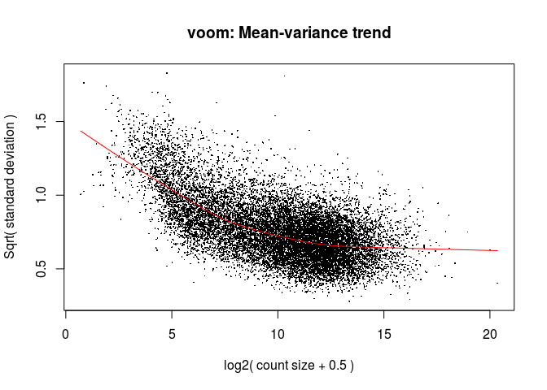
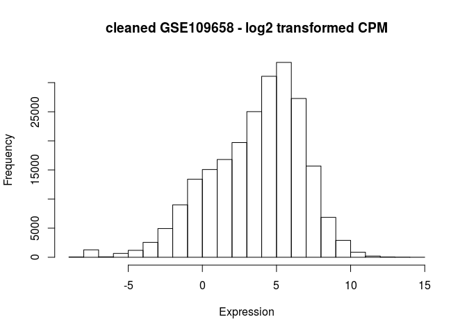
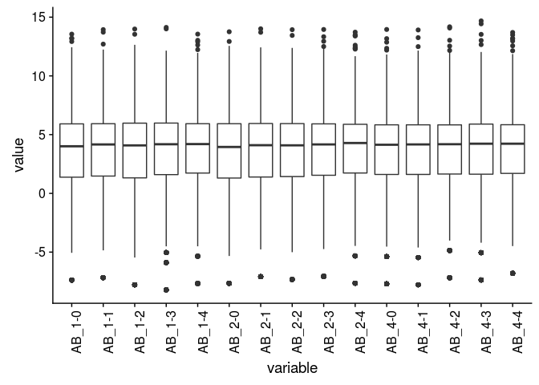
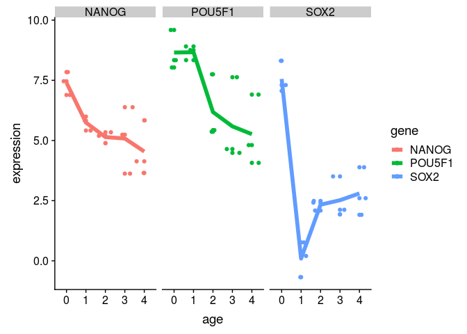

GSE109658 data analysis
================
German Novakovskiy
April 6, 2018

Here we analyze gene expression data from [this paper.](https://www.ncbi.nlm.nih.gov/pubmed/29427839).

``` r
if (file.exists("GSE109658.Rdata")) {
    # if previously downloaded
    load("GSE109658.Rdata")
} else {
    # Get geo object that contains our data and phenotype information
    geo_obj <- getGEO("GSE109658", GSEMatrix = TRUE)
    geo_obj <- geo_obj[[1]]
    save(geo_obj, file = "GSE109658.Rdata")
}
```

``` r
show(geo_obj)
```

    ## ExpressionSet (storageMode: lockedEnvironment)
    ## assayData: 0 features, 15 samples 
    ##   element names: exprs 
    ## protocolData: none
    ## phenoData
    ##   sampleNames: GSM2948049 GSM2948050 ... GSM2948063 (15 total)
    ##   varLabels: title geo_accession ... cell type:ch1 (38 total)
    ##   varMetadata: labelDescription
    ## featureData: none
    ## experimentData: use 'experimentData(object)'
    ## Annotation: GPL11154

In metadata all we have is age (0, 1, 2, 3 and 4 days):

``` r
#get covariate matrix
geo_metadata <- pData(geo_obj)[, c("organism_ch1", "title", colnames(pData(geo_obj))[grep("characteristics", 
    colnames(pData(geo_obj)))])]

geo_metadata <- geo_metadata[,-3]
colnames(geo_metadata) <- c("organism", "sample", "description")

geo_metadata$age <- as.factor(rep(c("0", "1", "2", "3", "4"), 3))

geo_metadata %>% kable()
```

|            | organism     | sample  | description                             | age |
|------------|:-------------|:--------|:----------------------------------------|:----|
| GSM2948049 | Homo sapiens | AB\_1-0 | cell line: H9                           | 0   |
| GSM2948050 | Homo sapiens | AB\_1-1 | cell line: H9; day 1 of differentiation | 1   |
| GSM2948051 | Homo sapiens | AB\_1-2 | cell line: H9; day 2 of differentiation | 2   |
| GSM2948052 | Homo sapiens | AB\_1-3 | cell line: H9; day 3 of differentiation | 3   |
| GSM2948053 | Homo sapiens | AB\_1-4 | cell line: H9; day 4 of differentiation | 4   |
| GSM2948054 | Homo sapiens | AB\_2-0 | cell line: H9                           | 0   |
| GSM2948055 | Homo sapiens | AB\_2-1 | cell line: H9; day 1 of differentiation | 1   |
| GSM2948056 | Homo sapiens | AB\_2-2 | cell line: H9; day 2 of differentiation | 2   |
| GSM2948057 | Homo sapiens | AB\_2-3 | cell line: H9; day 3 of differentiation | 3   |
| GSM2948058 | Homo sapiens | AB\_2-4 | cell line: H9; day 4 of differentiation | 4   |
| GSM2948059 | Homo sapiens | AB\_4-0 | cell line: H9                           | 0   |
| GSM2948060 | Homo sapiens | AB\_4-1 | cell line: H9; day 1 of differentiation | 1   |
| GSM2948061 | Homo sapiens | AB\_4-2 | cell line: H9; day 2 of differentiation | 2   |
| GSM2948062 | Homo sapiens | AB\_4-3 | cell line: H9; day 3 of differentiation | 3   |
| GSM2948063 | Homo sapiens | AB\_4-4 | cell line: H9; day 4 of differentiation | 4   |

Let's load the expression data (in raw counts):

``` r
expr_data_counts <- read.table("GSE109658_gene_counts.txt", header=TRUE) 
colnames(expr_data_counts)[-1] <- as.character(geo_metadata$sample)

head(expr_data_counts, 10) %>% kable()
```

| GENE   |  AB\_1-0|  AB\_1-1|  AB\_1-2|  AB\_1-3|  AB\_1-4|  AB\_2-0|  AB\_2-1|  AB\_2-2|  AB\_2-3|  AB\_2-4|  AB\_4-0|  AB\_4-1|  AB\_4-2|  AB\_4-3|  AB\_4-4|
|:-------|--------:|--------:|--------:|--------:|--------:|--------:|--------:|--------:|--------:|--------:|--------:|--------:|--------:|--------:|--------:|
| MARC1  |     6824|     2606|     1618|     2328|     3994|     9204|     3964|     1350|     1118|      974|     4644|     3730|      840|      734|      550|
| MARCH1 |     1098|      354|      974|      638|     1064|     1448|      266|      882|      426|      324|      492|      694|      348|      256|      106|
| MARC2  |      296|      152|      144|      136|      164|      364|      104|      118|      136|      300|      456|      312|      198|      218|      168|
| MARCH2 |      380|      314|      460|     1142|     1322|      328|      188|      394|      784|     1754|      618|      494|      494|      720|     1142|
| MARCH3 |     1660|      344|     1422|      506|      222|      930|      232|      852|      464|     1182|      982|      460|      500|      812|      876|
| MARCH4 |      162|      162|      208|       98|       88|      336|      146|      188|       84|      430|      386|      230|      138|      182|      152|
| MARCH5 |     8454|     4004|     9708|    11418|     8192|     7370|     4626|     8202|     5826|     5610|     4188|     6306|     5120|     3842|     2448|
| MARCH6 |     6824|     9000|    19850|    25460|    20572|    15792|     9304|    15018|    12822|    16836|    10628|    11896|    11150|    13808|     8038|
| MARCH7 |    26512|     9726|    39266|    46158|    28432|    29576|    12470|    22442|    17188|    16278|    14354|    15300|     9960|    11980|     6182|
| MARCH8 |      742|      800|     1106|     1838|     1156|     1180|      778|      942|      642|      870|      898|     1036|      734|      740|      426|

``` r
dim(expr_data_counts)
```

    ## [1] 23398    16

We have duplicates in rownames (for some reason):

``` r
#we have duplicates in rownames
repeats <- expr_data_counts$GENE[!isUnique(expr_data_counts$GENE)]
repeats
```

    ##   [1] AKAP17A      AKAP17A      ASMT         ASMT         ASMTL       
    ##   [6] ASMTL        ASMTL-AS1    ASMTL-AS1    CD99         CD99        
    ##  [11] CD99P1       CD99P1       CRLF2        CRLF2        CSF2RA      
    ##  [16] CSF2RA       DDX11L1      DDX11L1      DHRSX        DHRSX       
    ##  [21] DUX2         DUX2         DUX4         DUX4         DUX4L2      
    ##  [26] DUX4L2       DUX4L3       DUX4L3       DUX4L5       DUX4L5      
    ##  [31] DUX4L6       DUX4L6       FAM138A      FAM138A      FAM138F     
    ##  [36] FAM138F      FAM45B       FAM45B       GTPBP6       GTPBP6      
    ##  [41] IL3RA        IL3RA        IL9R         IL9R         LOC100132062
    ##  [46] LOC100132062 LOC100132287 LOC100132287 LOC100133331 LOC100133331
    ##  [51] MIR1244-1    MIR1244-1    MIR1244-1    MIR1244-2    MIR1244-2   
    ##  [56] MIR1244-2    MIR1244-3    MIR1244-3    MIR1244-3    MIR1256     
    ##  [61] MIR1256      MIR3690      MIR3690      MIR4444-1    MIR4444-1   
    ##  [66] MIR548H3     MIR548H3     OR4F16       OR4F16       OR4F29      
    ##  [71] OR4F29       OR4F3        OR4F3        P2RY8        P2RY8       
    ##  [76] PLCXD1       PLCXD1       PPP2R3B      PPP2R3B      PPP2R3B-AS1 
    ##  [81] PPP2R3B-AS1  RNF5P1       RNF5P1       SHOX         SHOX        
    ##  [86] SLC25A6      SLC25A6      SNORA59A     SNORA59A     SNORA59B    
    ##  [91] SNORA59B     SPRY3        SPRY3        TTL          TTL         
    ##  [96] VAMP7        VAMP7        XGPY2        XGPY2        ZBED1       
    ## [101] ZBED1       
    ## 23346 Levels: 1/2-SBSRNA4 A1BG A1BG-AS1 A1CF A2LD1 A2M A2ML1 A2MP1 ... ZZZ3

``` r
expr_data_counts$GENE <- as.character(expr_data_counts$GENE)
#get those genes that are not equal in terms of expression (fixing their names)
#adding "-1" (or other index) to gene name
for (i in repeats){
 repeated_rows <- expr_data_counts %>% filter(GENE %in% i)
 if (nrow(repeated_rows) == 1){
   next
 }
 if (nrow(repeated_rows == 2)){
   if (all(repeated_rows[1,] == repeated_rows[2,]) == FALSE) {
     expr_data_counts$GENE[expr_data_counts$GENE == i][1] <- paste(i, "1", sep="-")
   }
 }
 else{
   for (j in 1:nrow(repeated_rows)-1){
     if (all(repeated_rows[j,] == repeated_rows[j+1,]) == FALSE) {
       expr_data_counts$GENE[expr_data_counts$GENE == i][1] <- paste(i, as.character(j), sep="-")
   }
   }
 }
}
```

Now delete all repeats:

``` r
expr_data_counts <- expr_data_counts[!duplicated(expr_data_counts),]
dim(expr_data_counts)
```

    ## [1] 23354    16

``` r
#first let's create a edgeR DGElist object
rownams <- expr_data_counts$GENE

expr_data_counts <- as.matrix(expr_data_counts)
exp_data_counts_matrix <- apply(expr_data_counts[,-1], 2, function(x) as.numeric(x))
rownames(exp_data_counts_matrix) <- rownams

DGE_bulk_time_course_ec <- DGEList(counts = exp_data_counts_matrix) 

cpm <- cpm(DGE_bulk_time_course_ec)
keep.exprs <-rowSums(cpm > 1) >= 3 #the smallest group size: AB_1-0, AB_2-0, AB_4-0

DGE_bulk_time_course_ec <- DGE_bulk_time_course_ec[keep.exprs,,]

dim(DGE_bulk_time_course_ec)
```

    ## [1] 14204    15

We have raw counts, thus we need to perform a library size normalization using edgeR:

``` r
normalized_factors_expression <- calcNormFactors(DGE_bulk_time_course_ec, method = "TMM") #calculation of scaling factors (for library size)

normalized_factors_expression$samples$norm.factors
```

    ##  [1] 0.8701103 1.0001410 0.9596942 1.0206460 1.0428450 0.9538684 0.9881997
    ##  [8] 1.0007472 1.0216110 1.0190054 1.0467489 1.0849204 1.0294104 0.9580591
    ## [15] 1.0228121

Let's look at distribution of values:

``` r
#removing gene column and transforming into matrix (for hist)
data <- as.matrix(DGE_bulk_time_course_ec$counts)

hist(data, main="GSE109658", xlim = c(0,200000), xlab = "Expression",
     ylab = "Frequency", breaks = 300)
```


Let's now perform RNA-seq analysis with limma, using only time factor variable (time column in metadata) and let's look separately at DE gene at each stage

``` r
metadata_age <- geo_metadata[,c(2,4)]
metadata_age %>% kable()
```

|            | sample  | age |
|------------|:--------|:----|
| GSM2948049 | AB\_1-0 | 0   |
| GSM2948050 | AB\_1-1 | 1   |
| GSM2948051 | AB\_1-2 | 2   |
| GSM2948052 | AB\_1-3 | 3   |
| GSM2948053 | AB\_1-4 | 4   |
| GSM2948054 | AB\_2-0 | 0   |
| GSM2948055 | AB\_2-1 | 1   |
| GSM2948056 | AB\_2-2 | 2   |
| GSM2948057 | AB\_2-3 | 3   |
| GSM2948058 | AB\_2-4 | 4   |
| GSM2948059 | AB\_4-0 | 0   |
| GSM2948060 | AB\_4-1 | 1   |
| GSM2948061 | AB\_4-2 | 2   |
| GSM2948062 | AB\_4-3 | 3   |
| GSM2948063 | AB\_4-4 | 4   |

First, let's use contrast matrix:

``` r
designMatrix <- model.matrix(~0 + age, metadata_age)
head(designMatrix, 10) %>% kable()
```

|            |  age0|  age1|  age2|  age3|  age4|
|------------|-----:|-----:|-----:|-----:|-----:|
| GSM2948049 |     1|     0|     0|     0|     0|
| GSM2948050 |     0|     1|     0|     0|     0|
| GSM2948051 |     0|     0|     1|     0|     0|
| GSM2948052 |     0|     0|     0|     1|     0|
| GSM2948053 |     0|     0|     0|     0|     1|
| GSM2948054 |     1|     0|     0|     0|     0|
| GSM2948055 |     0|     1|     0|     0|     0|
| GSM2948056 |     0|     0|     1|     0|     0|
| GSM2948057 |     0|     0|     0|     1|     0|
| GSM2948058 |     0|     0|     0|     0|     1|

We can apply voom (which usually takes count data as an input and transforms them to logCPM) that estimates the mean-variance relationship and uses this to compute appropriate observation-level weights. The data are then ready for linear modelling.

``` r
after_voom_cpm <- voom(normalized_factors_expression, designMatrix, plot=TRUE)
```



``` r
hist(after_voom_cpm$E, main="cleaned GSE109658 - log2 transformed CPM", xlab = "Expression",
     ylab = "Frequency")
```



Boxplots to explore the data:

``` r
cleaned_log_cpm_df <- as.data.frame(after_voom_cpm$E)

cleaned_log_cpm_df <- cleaned_log_cpm_df %>% rownames_to_column("gene")

meltedLogedBultTimeCourseEc <- melt(cleaned_log_cpm_df, id='gene')

meltedLogedBultTimeCourseEc %>%
  ggplot(aes(x = variable, y = value)) +
  geom_boxplot() + 
  theme(axis.text.x = element_text(angle = 90, hjust = 1))
```



``` r
plotMDS(cleaned_log_cpm_df[,-1], cex=1.5)
```


Let's create a contrast matrix because we are interested in DE genes across different time points:

``` r
rownames(cleaned_log_cpm_df) <- cleaned_log_cpm_df$gene
cleaned_log_cpm_df <- cleaned_log_cpm_df[,-1]

# construct the contrast matrix
contrastMatrix <- makeContrasts(
  age1vage0 = age1 - age0,
  age2vage1 = age2 - age1,
  age3vage2 = age3 - age2,
  age4vage3 = age4 - age3,
  levels = designMatrix
)

contrastMatrix %>% kable()
```

|      |  age1vage0|  age2vage1|  age3vage2|  age4vage3|
|------|----------:|----------:|----------:|----------:|
| age0 |         -1|          0|          0|          0|
| age1 |          1|         -1|          0|          0|
| age2 |          0|          1|         -1|          0|
| age3 |          0|          0|          1|         -1|
| age4 |          0|          0|          0|          1|

``` r
# keep the fit around as we will need to it for looking at other contrasts later 
time_course_Fit <- lmFit(after_voom_cpm, designMatrix)

# fit the contrast using the original fitted model
contrastFit <- contrasts.fit(time_course_Fit, contrastMatrix)

# apply eBayes() for moderated statistics
contrastFitEb <- eBayes(contrastFit)

contrastGenes <- topTable(contrastFitEb, number = Inf, p.value = 0.05)

plotSA(contrastFitEb)
```


``` r
cutoff <- 5e-02 #0.05 p value
#adjust method by default is BH (equivalent to fdr)
time_course_res <- decideTests(contrastFitEb, p.value = cutoff, lfc = 1)
summary(time_course_res)
```

    ##        age1vage0 age2vage1 age3vage2 age4vage3
    ## Down         739       626        55         0
    ## NotSig     12590     12932     14030     14203
    ## Up           875       646       119         1

Let's look at top upregulated genes at different stages:

``` r
hits1 <- time_course_res %>% 
  as.data.frame() %>% 
  rownames_to_column("gene") %>% 
  filter(age1vage0 > 0)


hits2 <- time_course_res %>% 
  as.data.frame() %>% 
  rownames_to_column("gene") %>% 
  filter(age2vage1 > 0)


hits3 <- time_course_res %>% 
  as.data.frame() %>% 
  rownames_to_column("gene") %>% 
  filter(age3vage2 > 0)


hits4 <- time_course_res %>% 
  as.data.frame() %>% 
  rownames_to_column("gene") %>% 
  filter(age4vage3 > 0)
```

``` r
#function for plotting genes
plotGenes <- function(genes, expressionMatrix, metadata) {
  
  expressionDataForGenes <- expressionMatrix %>%
    rownames_to_column("gene") %>%
    filter(gene %in% genes) %>%
    melt()
  
  colnames(expressionDataForGenes) <- c("gene", "sample", "expression")
  expressionDataForGenes <- expressionDataForGenes %>%
    left_join(metadata, id="age")
  
  expressionDataForGenes %>% 
    ggplot(aes(x = age, y = expression, color=gene)) +
    geom_point() +
    geom_jitter() +
    stat_summary(aes(y = expression, group=1), fun.y = "mean", geom="line", size=2) +
    facet_wrap(~gene)
}
```

Comparisons to key genes from previous analysis.

Mesodendoderm markers:

``` r
sample_genes <- c("T", "CDX1", "MSX2")
plotGenes(sample_genes, cleaned_log_cpm_df, metadata_age)
```

    ## Using gene as id variables

    ## Joining, by = "sample"


Let's look at the expression of these genes EOMES, CER1, GATA4, PRDM1, and POU2AF1 at 96h because they are expected to be highly expressed during 4 days stage

``` r
sample_genes <- c("EOMES", "CER1", "GATA4", "PRDM1", "POU2AF1", "KLF8")
plotGenes(sample_genes, cleaned_log_cpm_df, metadata_age)
```

    ## Using gene as id variables

    ## Joining, by = "sample"


Pluripotency genes POU5F1, NANOG, and SOX2:

``` r
sample_genes <- c("POU5F1", "NANOG", "SOX2")
plotGenes(sample_genes, cleaned_log_cpm_df, metadata_age)
```

    ## Using gene as id variables

    ## Joining, by = "sample"


Key DE markers CXCR4, SOX17, HNF1B, KIT, and KRT19:

``` r
sample_genes <- c("CXCR4", "SOX17", "HNF1B", "KIT", "KRT19")
plotGenes(sample_genes, cleaned_log_cpm_df, metadata_age)
```

    ## Using gene as id variables

    ## Joining, by = "sample"



Interesting genes: - FOXA2, which is regulated by long non-coding RNA DEANR1; - GSC is controlled by DIGIT lncRNA; - EOMES, MIXL1, SOX17 are DE markers (MIXL1 is mesodendoderm marker)

``` r
sample_genes <- c("FOXA2", "GSC", "EOMES", "MIXL1", "SOX17")
plotGenes(sample_genes, cleaned_log_cpm_df, metadata_age)
```

    ## Using gene as id variables

    ## Joining, by = "sample"


Performing analysis without contrast matrix, using 0 as a reference
===================================================================

``` r
#0 hours as a reference
designMatrixReference <- model.matrix(~age, metadata_age)
head(designMatrixReference, 10) %>% kable()
```

|            |  (Intercept)|  age1|  age2|  age3|  age4|
|------------|------------:|-----:|-----:|-----:|-----:|
| GSM2948049 |            1|     0|     0|     0|     0|
| GSM2948050 |            1|     1|     0|     0|     0|
| GSM2948051 |            1|     0|     1|     0|     0|
| GSM2948052 |            1|     0|     0|     1|     0|
| GSM2948053 |            1|     0|     0|     0|     1|
| GSM2948054 |            1|     0|     0|     0|     0|
| GSM2948055 |            1|     1|     0|     0|     0|
| GSM2948056 |            1|     0|     1|     0|     0|
| GSM2948057 |            1|     0|     0|     1|     0|
| GSM2948058 |            1|     0|     0|     0|     1|

``` r
v <- voom (normalized_factors_expression, designMatrixReference, plot = FALSE)

# keep the fit around as we will need to it for looking at other contrasts later 
time_course_Fit_Reference <- lmFit(v, designMatrixReference)

# apply eBayes() for moderated statistics
time_course_Fit_Reference_Ebayes <- eBayes(time_course_Fit_Reference)

genesReference <- topTable(time_course_Fit_Reference_Ebayes, number = Inf, p.value = 0.05, lfc = 1)
```

    ## Removing intercept from test coefficients

``` r
dim(genesReference)
```

    ## [1] 5316    8

``` r
head(genesReference, n = 10) %>% kable()
```

|         |        age1|       age2|       age3|       age4|   AveExpr|         F|  P.Value|  adj.P.Val|
|---------|-----------:|----------:|----------:|----------:|---------:|---------:|--------:|----------:|
| WLS     |   6.1506191|  5.4355241|   6.793959|   6.511847|  7.402788|  191.3879|        0|      0e+00|
| COL5A2  |   1.2495416|  5.8327850|   6.854836|   7.008444|  9.520181|  181.0276|        0|      0e+00|
| CDH2    |   3.1354103|  3.6981243|   3.965446|   3.877833|  9.520534|  134.1935|        0|      0e+00|
| PCSK1   |   6.0565953|  1.2755851|  -2.040311|  -2.882927|  1.434500|  133.3779|        0|      0e+00|
| S100A16 |  -0.7910597|  0.7940804|   3.674754|   5.045669|  3.769794|  130.5957|        0|      0e+00|
| MYOF    |   0.0825227|  3.3723756|   4.319092|   5.022343|  4.889323|  129.0159|        0|      0e+00|
| CPE     |   0.6229462|  3.5408699|   4.442434|   4.754941|  6.846062|  119.7418|        0|      1e-07|
| DLC1    |   4.3080509|  5.0879268|   5.193869|   4.875812|  7.226153|  118.9950|        0|      1e-07|
| HAS2    |   3.8994731|  5.4769198|   5.801879|   5.585006|  8.231648|  117.8946|        0|      1e-07|
| PCDH10  |   4.6526027|  5.6372352|   5.640546|   5.592996|  8.577954|  115.5102|        0|      1e-07|

``` r
genesReference109658 <- genesReference
save(genesReference109658, file="GSE109658_topGenes.Rdata")
```

Comparisons of different papers
===============================

``` r
load("../GSE75748/GSE75748_topGenes.Rdata")

genes75748 <- rownames(genesReference75748)
genes109658 <- rownames(genesReference109658)

commonGenes <- intersect(genes109658, genes75748)
length(commonGenes)
```

    ## [1] 3321

``` r
commonGenes <- genesReference109658[commonGenes,]
commonGenes <- commonGenes[with(commonGenes, order(adj.P.Val)),]


sample_genes <- rownames(commonGenes)[1:6]
plotGenes(sample_genes, cleaned_log_cpm_df, metadata_age)
```

    ## Using gene as id variables

    ## Joining, by = "sample"


``` r
commonGenesTrends <- time_course_res[rownames(commonGenes),]
head(commonGenesTrends) %>% kable()
```

|         |  age1vage0|  age2vage1|  age3vage2|  age4vage3|
|---------|----------:|----------:|----------:|----------:|
| WLS     |          1|          0|          1|          0|
| COL5A2  |          1|          1|          0|          0|
| CDH2    |          1|          0|          0|          0|
| PCSK1   |          1|         -1|         -1|          0|
| S100A16 |          0|          1|          1|          0|
| MYOF    |          0|          1|          0|          0|

``` r
contrastMatrix <- makeContrasts(
  age3vage0 = age3 - age0,
  age4vage0 = age4 - age0,
  levels = designMatrix
)

# keep the fit around as we will need to it for looking at other contrasts later 
time_course_Fit <- lmFit(after_voom_cpm, designMatrix)

# fit the contrast using the original fitted model
contrastFit <- contrasts.fit(time_course_Fit, contrastMatrix)

# apply eBayes() for moderated statistics
contrastFitEb <- eBayes(contrastFit)

time_course_res <- decideTests(contrastFitEb, p.value = cutoff, lfc = 2)
summary(time_course_res)
```

    ##        age3vage0 age4vage0
    ## Down         904       845
    ## NotSig     11879     11873
    ## Up          1421      1486

``` r
upRegulated <- time_course_res %>%
  as.data.frame() %>%
  rownames_to_column("gene") %>%
  filter(age3vage0 == 1 & age4vage0 == 1)
```
