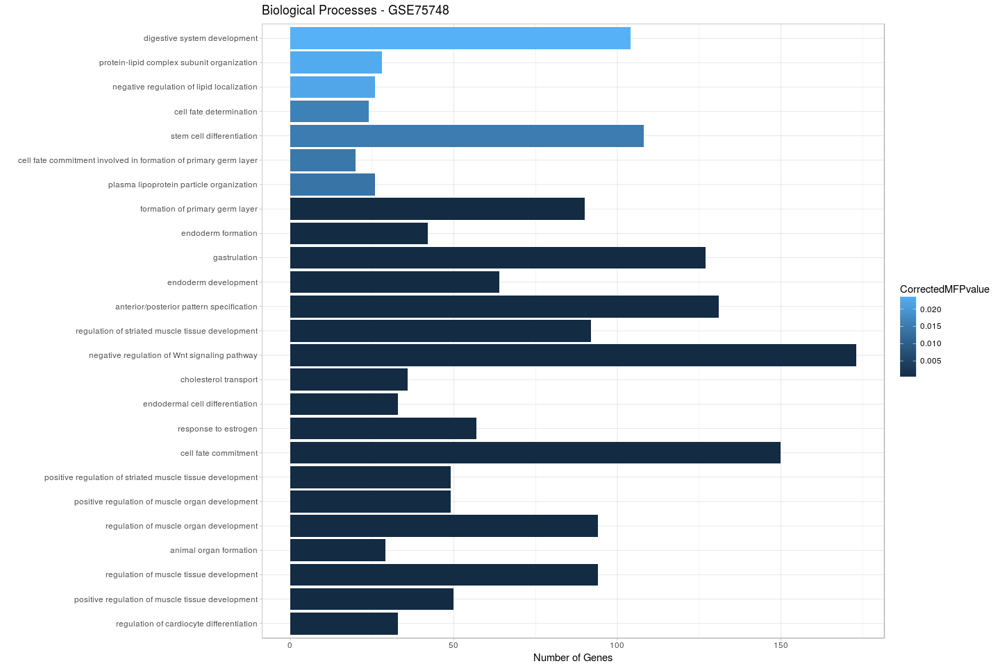

GSE52158 data analysis
================
German Novakovskiy
May 17, 2018

Data analysis of microarray data (Affymetrix Human Genome U133 Plus 2.0 Array, GPL570 platform) from that paper (PMID: 24412311)

``` r
suppressMessages(suppressWarnings(library(limma)))
suppressMessages(suppressWarnings(library(ggplot2)))
suppressMessages(suppressWarnings(library(dplyr)))
suppressMessages(suppressWarnings(library(affy)))
suppressMessages(suppressWarnings(library(hgu133plus2.db)))
suppressMessages(suppressWarnings(library(tibble)))
suppressMessages(suppressWarnings(library(GEOquery)))
suppressMessages(suppressWarnings(library(reshape2)))
suppressMessages(suppressWarnings(library(ermineR)))
suppressMessages(suppressWarnings(library(knitr)))
suppressMessages(suppressWarnings(library(forcats)))
```

Loading the data:

``` r
if (file.exists("GSE52158.Rdata")) {
  # if previously downloaded
  load("GSE52158.Rdata")
} else {
  # Get geo object that contains our data and phenotype information
  geo_obj <- getGEO("GSE52158", GSEMatrix = TRUE)
  geo_obj <- geo_obj[[1]]
  save(geo_obj, file = "GSE52158.Rdata")
}

show(geo_obj)
```

    ## ExpressionSet (storageMode: lockedEnvironment)
    ## assayData: 54675 features, 24 samples 
    ##   element names: exprs 
    ## protocolData: none
    ## phenoData
    ##   sampleNames: GSM1260408 GSM1260409 ... GSM1260431 (24 total)
    ##   varLabels: title geo_accession ... day of in vitro
    ##     differentiation:ch1 (39 total)
    ##   varMetadata: labelDescription
    ## featureData
    ##   featureNames: 1007_s_at 1053_at ... AFFX-TrpnX-M_at (54675
    ##     total)
    ##   fvarLabels: ID GB_ACC ... Gene Ontology Molecular Function (16
    ##     total)
    ##   fvarMetadata: Column Description labelDescription
    ## experimentData: use 'experimentData(object)'
    ## Annotation: GPL570

APS - anteriomost primitive streak AFG - anterior foregut PFG - posterior foregut MHG - midgut/hindgut

``` r
geo_metadata <- pData(geo_obj)[, c("organism_ch1", "title", colnames(pData(geo_obj))[grep("characteristics", 
                                                                                          colnames(pData(geo_obj)))])]

geo_metadata <- geo_metadata[,-3]
colnames(geo_metadata) <- c("organism", "sample", "description")
#only hESC, SR1 APS and SR1 DE 
geo_metadata <- geo_metadata[1:9,]
geo_metadata$cell_type <- as.factor(c(rep("ESC", 3), rep("APS", 3), rep("DE", 3)))
geo_metadata$cell_type <- relevel(geo_metadata$cell_type, "ESC")

geo_metadata
```

    ##                organism        sample                        description
    ## GSM1260408 Homo sapiens    hESC, rep1    cell type: embryonic stem cells
    ## GSM1260409 Homo sapiens    hESC, rep2    cell type: embryonic stem cells
    ## GSM1260410 Homo sapiens    hESC, rep3    cell type: embryonic stem cells
    ## GSM1260411 Homo sapiens SR1 APS, rep1 day of in vitro differentiation: 1
    ## GSM1260412 Homo sapiens SR1 APS, rep2 day of in vitro differentiation: 1
    ## GSM1260413 Homo sapiens SR1 APS, rep3 day of in vitro differentiation: 1
    ## GSM1260414 Homo sapiens  SR1 DE, rep1 day of in vitro differentiation: 3
    ## GSM1260415 Homo sapiens  SR1 DE, rep2 day of in vitro differentiation: 3
    ## GSM1260416 Homo sapiens  SR1 DE, rep3 day of in vitro differentiation: 3
    ##            cell_type
    ## GSM1260408       ESC
    ## GSM1260409       ESC
    ## GSM1260410       ESC
    ## GSM1260411       APS
    ## GSM1260412       APS
    ## GSM1260413       APS
    ## GSM1260414        DE
    ## GSM1260415        DE
    ## GSM1260416        DE

Expression data (data is RMA-normalized signal intensity (not log transformed) thus we have to log normalized it ):

``` r
#data in RMA
data <- exprs(geo_obj)
data <- data[, rownames(geo_metadata)]
#filtering
keep.exprs <-rowSums(data > 20) >= 3 
data <- data[keep.exprs,]
log_data <- log(data+1)

#for plotting
hist(log_data)
```


``` r
#for plotting
meltedExpressionMatrix <- log_data %>%
  as.data.frame() %>%
  rownames_to_column("gene") %>%
  melt(id = "gene") 

#for plotting
meltedExpressionMatrix %>% 
  ggplot(aes(x = variable, y = value)) +
  geom_boxplot() +
  theme(axis.text.x = element_text(angle = 90, hjust = 1))
```


``` r
#all(colnames(data) == rownames(geo_metadata)) (TRUE)
designMatrix <- model.matrix(~cell_type, geo_metadata)

#linear fit 
cellTypeFit <- lmFit(log_data, designMatrix)
# run ebayes to calculate moderated t-statistics
#trend True - for accounting of low expressed probes
cellTypeFitEb <- eBayes(cellTypeFit)#, trend = T)

cellTypeRes <- decideTests(cellTypeFitEb, p.value = 0.05, lfc = 1)
summary(cellTypeRes)
```

    ##        (Intercept) cell_typeAPS cell_typeDE
    ## Down             0          331         616
    ## NotSig           0        27985       27163
    ## Up           28554          238         775

``` r
topProbesDE <- topTable(cellTypeFitEb, coef = "cell_typeDE", p.value = 0.05, lfc = 1, number = Inf) 
downTopProbesDE <- topProbesDE %>%
  rownames_to_column("probes") %>%
  filter(logFC < 0) #616

upTopProbesDE <- topProbesDE %>% 
  rownames_to_column("probes") %>%
  filter(logFC > 0) #775
```

Loading "golden" list of markers

``` r
#get gene symbols
up_genes <- select(hgu133plus2.db, upTopProbesDE$probes, c("SYMBOL"))
```

    ## 'select()' returned 1:many mapping between keys and columns

``` r
up_genes <- up_genes$SYMBOL
up_genes <- up_genes[!is.na(up_genes)]

down_genes <- select(hgu133plus2.db, downTopProbesDE$probes, c("SYMBOL"))
```

    ## 'select()' returned 1:many mapping between keys and columns

``` r
down_genes <- down_genes$SYMBOL
down_genes <- down_genes[!is.na(down_genes)]
```

Which markers from golden list are also DE here?

``` r
#check with golden list
up_golden_list <- scan("~/Papers/CMAP/up_genes_in_DE.grp", character(), quote = "")
up_golden_list[up_golden_list %in% up_genes]
```

    ##  [1] "CER1"  "EOMES" "GATA4" "PRDM1" "CXCR4" "SOX17" "KIT"   "KRT19"
    ##  [9] "GSC"   "GATA6" "FOXA2" "HHEX"  "LHX1"  "FOXA1" "FZD8"  "OTX2"

Which are not?

``` r
up_golden_list[!up_golden_list %in% up_genes]
```

    ## [1] "KLF8"  "ITGA5" "ITGAV"

The same for down regulated genes:

``` r
down_golden_list <- scan("~/Papers/CMAP/down_genes_in_DE.grp", character(), quote = "")
down_golden_list[down_golden_list %in% down_genes]
```

    ## [1] "NANOG" "SOX2"  "WNT5A" "FGF19" "FGF4"  "THBS2" "THY1"

``` r
down_golden_list[!down_golden_list %in% down_genes]
```

    ##  [1] "CDX1"   "POU5F1" "CDH6"   "ACAT2"  "ITGA6"  "CD9"    "CDH1"  
    ##  [8] "FOXF1"  "IRX3"   "HAND1"  "BMP4"   "MSX1"   "ISL1"   "SNAI2"

``` r
upRegulated52158 <- up_genes
downRegulated52158 <- down_genes
save(upRegulated52158, file="upRegulated52158.Rdata")
save(downRegulated52158, file="downRegulated52158.Rdata")
```

Gene set enrichment analysis of GSE75748
========================================

``` r
topProbesDEAll <- topTable(cellTypeFitEb, coef = "cell_typeDE", number = Inf)

x <- hgu133plus2SYMBOL
# Get the probe identifiers - gene symbol mappings
mapped_probes <- mappedkeys(x)
# Convert to a dataframe
genesym.probeid <- as.data.frame(x[mapped_probes])
head(genesym.probeid)
```

    ##    probe_id symbol
    ## 1   1053_at   RFC2
    ## 2    117_at  HSPA6
    ## 3    121_at   PAX8
    ## 4 1255_g_at GUCA1A
    ## 5   1316_at   THRA
    ## 6   1320_at PTPN21

``` r
probes_to_genes <- genesym.probeid %>%
  filter(probe_id %in% rownames(topProbesDEAll))

topProbes <- topProbesDEAll %>%
  rownames_to_column("probes") %>%
  filter(probes %in% probes_to_genes$probe_id)

probes_to_genes <- probes_to_genes %>% column_to_rownames('probe_id')
symbs <- probes_to_genes[topProbes$probes,]
topProbes$Symbol <- symbs

ermineInputProbeScores <- topProbes %>% 
  #as.data.frame() %>%
  mutate(absolute_logFC = abs(logFC)) %>% 
  dplyr::select(probes, absolute_logFC) %>% 
  na.omit() %>% 
  as.data.frame() %>% 
  arrange(desc(absolute_logFC)) %>% 
  column_to_rownames("probes")

head(ermineInputProbeScores, 10)# %>% kable() # print the first few rows
```

    ##             absolute_logFC
    ## 219465_at         4.717422
    ## 205402_x_at       4.631256
    ## 219466_s_at       4.505739
    ## 230943_at         4.429966
    ## 214053_at         4.363262
    ## 219993_at         4.213083
    ## 210002_at         4.139878
    ## 207659_s_at       4.098615
    ## 228964_at         3.843296
    ## 221019_s_at       3.815424

``` r
enrichmentResult <- precRecall(scores = ermineInputProbeScores, 
                               scoreColumn = 1, # column 1 is the scores 
                               bigIsBetter = TRUE, # larger logFC should be ranked higher
                               annotation = "GPL570", 
                               aspects = "B", # look at only biological processes 
                               iterations = 10000, # 10K sampling iterations so that results are stable
                               geneSetDescription = "../GSE109658/GO.xml") # use the GO XML file in current directory

enrichmentResult$results %>% arrange(MFPvalue) %>% head(10)
```

    ## # A tibble: 10 x 12
    ##    Name         ID    NumProbes NumGenes RawScore     Pval CorrectedPvalue
    ##    <chr>        <chr>     <int>    <int>    <dbl>    <dbl>           <dbl>
    ##  1 formation o… GO:0…       213       90   0.0392 1.00e-12  0.00000000287 
    ##  2 endoderm fo… GO:0…        93       42   0.0613 1.00e-12  0.00000000144 
    ##  3 gastrulation GO:0…       278      127   0.0562 1.00e-12  0.000000000574
    ##  4 endoderm de… GO:0…       136       64   0.0551 1.00e-12  0.000000000479
    ##  5 anterior/po… GO:0…       282      131   0.0398 1.00e-12  0.000000000359
    ##  6 regulation … GO:0…       222       92   0.0364 1.00e-12  0.000000000319
    ##  7 negative re… GO:0…       337      173   0.0397 1.00e-12  0.000000000287
    ##  8 cholesterol… GO:0…        65       36   0.0397 1.00e-12  0.000000000261
    ##  9 endodermal … GO:0…        75       33   0.0489 1.00e-12  0.000000000221
    ## 10 response to… GO:0…       126       57   0.0392 1.00e-12  0.000000000205
    ## # ... with 5 more variables: MFPvalue <dbl>, CorrectedMFPvalue <dbl>,
    ## #   Multifunctionality <dbl>, `Same as` <chr>, GeneMembers <chr>

``` r
enrichmentResult$results %>% 
  dplyr::select(Name, CorrectedPvalue, CorrectedMFPvalue) %>% 
  arrange(CorrectedMFPvalue) %>% 
  head(10) %>% 
  kable(align = "l", col.names = c("Biological Process", "Corrected p-value", 
                                   "Corrected MF p-value"))
```

| Biological Process                                        | Corrected p-value | Corrected MF p-value |
|:----------------------------------------------------------|:------------------|:---------------------|
| regulation of cardiocyte differentiation                  | 0                 | 0                    |
| positive regulation of muscle tissue development          | 0                 | 0                    |
| regulation of muscle tissue development                   | 0                 | 0                    |
| animal organ formation                                    | 0                 | 0                    |
| regulation of muscle organ development                    | 0                 | 0                    |
| positive regulation of striated muscle tissue development | 0                 | 0                    |
| positive regulation of muscle organ development           | 0                 | 0                    |
| cell fate commitment                                      | 0                 | 0                    |
| response to estrogen                                      | 0                 | 0                    |
| endodermal cell differentiation                           | 0                 | 0                    |

``` r
Enrichment <- enrichmentResult$results
Enrichment$Name <- as.factor(Enrichment$Name)

Enrichment %>% 
  dplyr::select(Name, NumGenes, CorrectedMFPvalue) %>% 
  arrange(CorrectedMFPvalue) %>% 
  filter(CorrectedMFPvalue <= 5e-2) %>% 
  head(25) %>% 
  ggplot(aes(x = fct_reorder(Name, CorrectedMFPvalue), 
             y = NumGenes, fill = CorrectedMFPvalue)) +
  geom_col() +
  labs(title = "Biological Processes - GSE75748", 
       x = "", y = "Number of Genes") +
  theme(axis.text.x = element_text(angle = 90, hjust = 1)) +
  coord_flip() +
  theme_light() 
```


