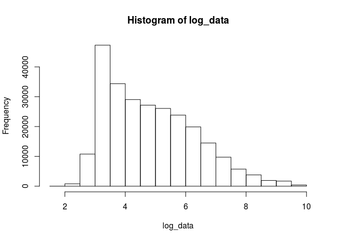
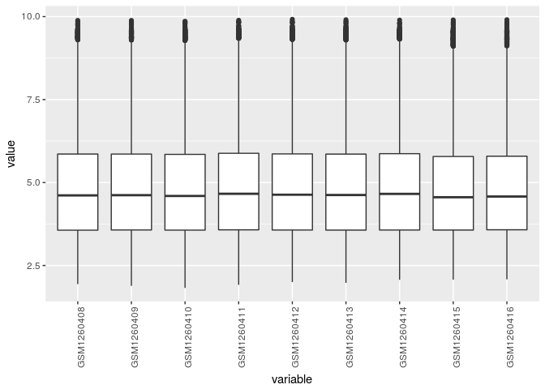

GSE52158 data analysis
================
German Novakovskiy
May 17, 2018

Data analysis of microarray data (Affymetrix Human Genome U133 Plus 2.0 Array) from that paper (PMID: 24412311)

``` r
library(limma)
library(ggplot2)
library(dplyr)
```

    ## 
    ## Attaching package: 'dplyr'

    ## The following objects are masked from 'package:stats':
    ## 
    ##     filter, lag

    ## The following objects are masked from 'package:base':
    ## 
    ##     intersect, setdiff, setequal, union

``` r
library(affy)
```

    ## Loading required package: BiocGenerics

    ## Loading required package: parallel

    ## 
    ## Attaching package: 'BiocGenerics'

    ## The following objects are masked from 'package:parallel':
    ## 
    ##     clusterApply, clusterApplyLB, clusterCall, clusterEvalQ,
    ##     clusterExport, clusterMap, parApply, parCapply, parLapply,
    ##     parLapplyLB, parRapply, parSapply, parSapplyLB

    ## The following objects are masked from 'package:dplyr':
    ## 
    ##     combine, intersect, setdiff, union

    ## The following object is masked from 'package:limma':
    ## 
    ##     plotMA

    ## The following objects are masked from 'package:stats':
    ## 
    ##     IQR, mad, sd, var, xtabs

    ## The following objects are masked from 'package:base':
    ## 
    ##     anyDuplicated, append, as.data.frame, cbind, colMeans,
    ##     colnames, colSums, do.call, duplicated, eval, evalq, Filter,
    ##     Find, get, grep, grepl, intersect, is.unsorted, lapply,
    ##     lengths, Map, mapply, match, mget, order, paste, pmax,
    ##     pmax.int, pmin, pmin.int, Position, rank, rbind, Reduce,
    ##     rowMeans, rownames, rowSums, sapply, setdiff, sort, table,
    ##     tapply, union, unique, unsplit, which, which.max, which.min

    ## Loading required package: Biobase

    ## Welcome to Bioconductor
    ## 
    ##     Vignettes contain introductory material; view with
    ##     'browseVignettes()'. To cite Bioconductor, see
    ##     'citation("Biobase")', and for packages 'citation("pkgname")'.

``` r
library(hgu133plus2.db)
```

    ## Loading required package: AnnotationDbi

    ## Loading required package: stats4

    ## Loading required package: IRanges

    ## Loading required package: S4Vectors

    ## 
    ## Attaching package: 'S4Vectors'

    ## The following objects are masked from 'package:dplyr':
    ## 
    ##     first, rename

    ## The following object is masked from 'package:base':
    ## 
    ##     expand.grid

    ## 
    ## Attaching package: 'IRanges'

    ## The following objects are masked from 'package:dplyr':
    ## 
    ##     collapse, desc, slice

    ## 
    ## Attaching package: 'AnnotationDbi'

    ## The following object is masked from 'package:dplyr':
    ## 
    ##     select

    ## Loading required package: org.Hs.eg.db

    ## 

    ## 

``` r
library(tibble)
library(GEOquery)
```

    ## Setting options('download.file.method.GEOquery'='auto')

    ## Setting options('GEOquery.inmemory.gpl'=FALSE)

``` r
library(reshape2)
```

Loading the data:

``` r
if (file.exists("GSE52158.Rdata")) {
  # if previously downloaded
  load("GSE52158.Rdata")
} else {
  # Get geo object that contains our data and phenotype information
  geo_obj <- getGEO("GSE52158", GSEMatrix = TRUE)
  geo_obj <- geo_obj[[1]]
  save(geo_obj, file = "GSE52158.Rdata")
}

show(geo_obj)
```

    ## ExpressionSet (storageMode: lockedEnvironment)
    ## assayData: 54675 features, 24 samples 
    ##   element names: exprs 
    ## protocolData: none
    ## phenoData
    ##   sampleNames: GSM1260408 GSM1260409 ... GSM1260431 (24 total)
    ##   varLabels: title geo_accession ... day of in vitro
    ##     differentiation:ch1 (39 total)
    ##   varMetadata: labelDescription
    ## featureData
    ##   featureNames: 1007_s_at 1053_at ... AFFX-TrpnX-M_at (54675
    ##     total)
    ##   fvarLabels: ID GB_ACC ... Gene Ontology Molecular Function (16
    ##     total)
    ##   fvarMetadata: Column Description labelDescription
    ## experimentData: use 'experimentData(object)'
    ## Annotation: GPL570

APS - anteriomost primitive streak AFG - anterior foregut PFG - posterior foregut MHG - midgut/hindgut

``` r
geo_metadata <- pData(geo_obj)[, c("organism_ch1", "title", colnames(pData(geo_obj))[grep("characteristics", 
                                                                                          colnames(pData(geo_obj)))])]

geo_metadata <- geo_metadata[,-3]
colnames(geo_metadata) <- c("organism", "sample", "description")
#only hESC, SR1 APS and SR1 DE 
geo_metadata <- geo_metadata[1:9,]
geo_metadata$cell_type <- as.factor(c(rep("ESC", 3), rep("APS", 3), rep("DE", 3)))
geo_metadata$cell_type <- relevel(geo_metadata$cell_type, "ESC")

geo_metadata
```

    ##                organism        sample                        description
    ## GSM1260408 Homo sapiens    hESC, rep1    cell type: embryonic stem cells
    ## GSM1260409 Homo sapiens    hESC, rep2    cell type: embryonic stem cells
    ## GSM1260410 Homo sapiens    hESC, rep3    cell type: embryonic stem cells
    ## GSM1260411 Homo sapiens SR1 APS, rep1 day of in vitro differentiation: 1
    ## GSM1260412 Homo sapiens SR1 APS, rep2 day of in vitro differentiation: 1
    ## GSM1260413 Homo sapiens SR1 APS, rep3 day of in vitro differentiation: 1
    ## GSM1260414 Homo sapiens  SR1 DE, rep1 day of in vitro differentiation: 3
    ## GSM1260415 Homo sapiens  SR1 DE, rep2 day of in vitro differentiation: 3
    ## GSM1260416 Homo sapiens  SR1 DE, rep3 day of in vitro differentiation: 3
    ##            cell_type
    ## GSM1260408       ESC
    ## GSM1260409       ESC
    ## GSM1260410       ESC
    ## GSM1260411       APS
    ## GSM1260412       APS
    ## GSM1260413       APS
    ## GSM1260414        DE
    ## GSM1260415        DE
    ## GSM1260416        DE

Expression data (data is RMA-normalized signal intensity (not log transformed) thus we have to log normalized it ):

``` r
#data in RMA
data <- exprs(geo_obj)
data <- data[, rownames(geo_metadata)]
#filtering
keep.exprs <-rowSums(data > 20) >= 3 
data <- data[keep.exprs,]
log_data <- log(data+1)

#for plotting
hist(log_data)
```



``` r
#for plotting
meltedExpressionMatrix <- log_data %>%
  as.data.frame() %>%
  rownames_to_column("gene") %>%
  melt(id = "gene") 

#for plotting
meltedExpressionMatrix %>% 
  ggplot(aes(x = variable, y = value)) +
  geom_boxplot() +
  theme(axis.text.x = element_text(angle = 90, hjust = 1))
```



``` r
#all(colnames(data) == rownames(geo_metadata)) (TRUE)
designMatrix <- model.matrix(~cell_type, geo_metadata)

#linear fit 
cellTypeFit <- lmFit(log_data, designMatrix)
# run ebayes to calculate moderated t-statistics
#trend True - for accounting of low expressed probes
cellTypeFitEb <- eBayes(cellTypeFit)#, trend = T)

cellTypeRes <- decideTests(cellTypeFitEb, p.value = 0.05, lfc = 1)
summary(cellTypeRes)
```

    ##        (Intercept) cell_typeAPS cell_typeDE
    ## Down             0          331         616
    ## NotSig           0        27985       27163
    ## Up           28554          238         775

``` r
topProbesDE <- topTable(cellTypeFitEb, coef = "cell_typeDE", p.value = 0.05, lfc = 1, number = Inf) 
downTopProbesDE <- topProbesDE %>%
  rownames_to_column("probes") %>%
  filter(logFC < 0) #616

upTopProbesDE <- topProbesDE %>% 
  rownames_to_column("probes") %>%
  filter(logFC > 0) #775
```

Loading "golden" list of markers

``` r
#get gene symbols
up_genes <- select(hgu133plus2.db, upTopProbesDE$probes, c("SYMBOL"))
```

    ## 'select()' returned 1:many mapping between keys and columns

``` r
up_genes <- up_genes$SYMBOL
up_genes <- up_genes[!is.na(up_genes)]

down_genes <- select(hgu133plus2.db, downTopProbesDE$probes, c("SYMBOL"))
```

    ## 'select()' returned 1:many mapping between keys and columns

``` r
down_genes <- down_genes$SYMBOL
down_genes <- down_genes[!is.na(down_genes)]
```

Which markers from golden list are also DE here?

``` r
#check with golden list
up_golden_list <- scan("~/Papers/CMAP/up_genes_in_DE.grp", character(), quote = "")
up_golden_list[up_golden_list %in% up_genes]
```

    ##  [1] "CER1"  "EOMES" "GATA4" "PRDM1" "CXCR4" "SOX17" "KIT"   "KRT19"
    ##  [9] "GSC"   "GATA6" "FOXA2" "HHEX"  "LHX1"  "FOXA1" "FZD8"  "OTX2"

Which are not?

``` r
up_golden_list[!up_golden_list %in% up_genes]
```

    ## [1] "KLF8"  "ITGA5" "ITGAV"

The same for down regulated genes:

``` r
down_golden_list <- scan("~/Papers/CMAP/down_genes_in_DE.grp", character(), quote = "")
down_golden_list[down_golden_list %in% down_genes]
```

    ## [1] "NANOG" "SOX2"  "WNT5A" "FGF19" "FGF4"  "THBS2" "THY1"

``` r
down_golden_list[!down_golden_list %in% down_genes]
```

    ##  [1] "CDX1"   "POU5F1" "CDH6"   "ACAT2"  "ITGA6"  "CD9"    "CDH1"  
    ##  [8] "FOXF1"  "IRX3"   "HAND1"  "BMP4"   "MSX1"   "ISL1"   "SNAI2"

``` r
upRegulated52158 <- up_genes
downRegulated52158 <- down_genes
save(upRegulated52158, file="upRegulated52158.Rdata")
save(downRegulated52158, file="downRegulated52158.Rdata")
```
