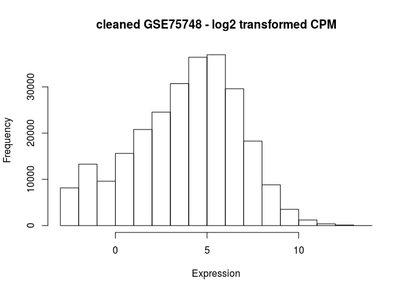
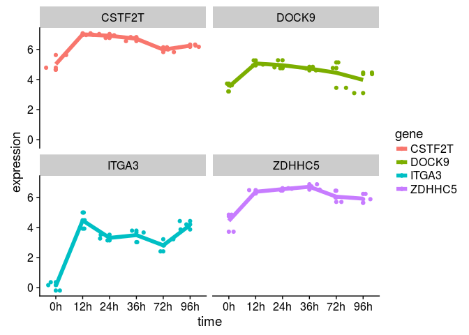
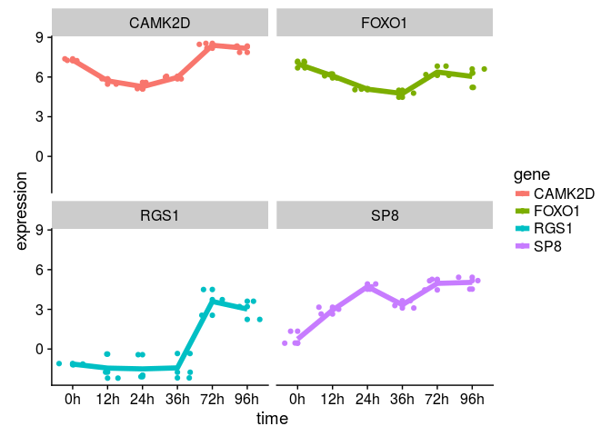
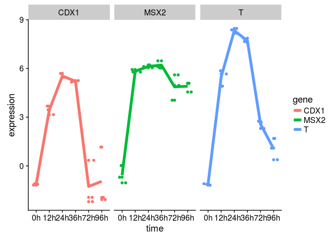
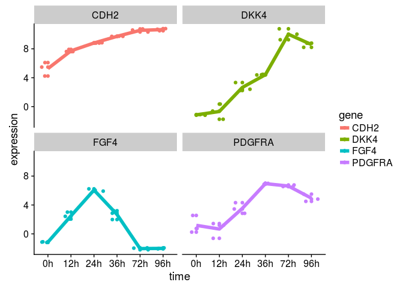
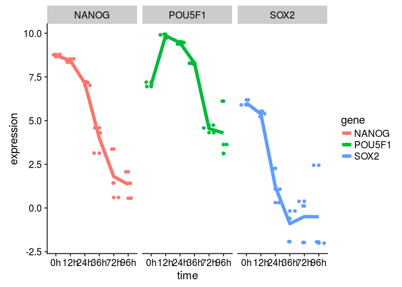
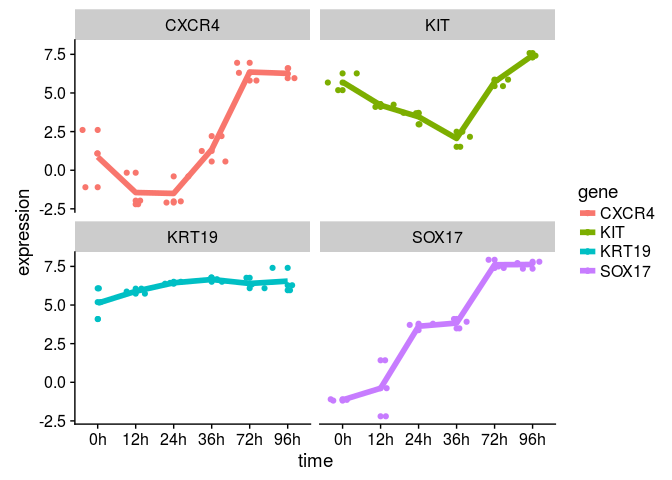
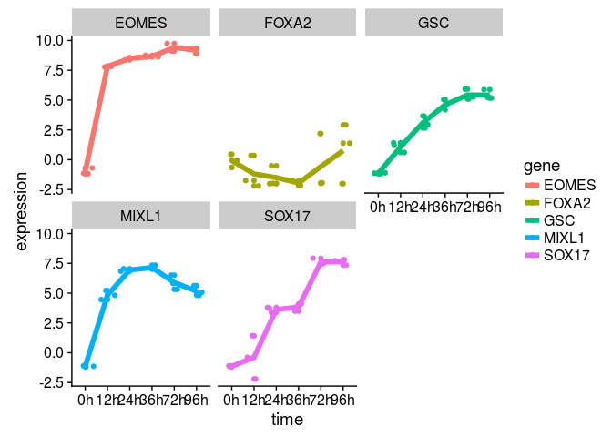
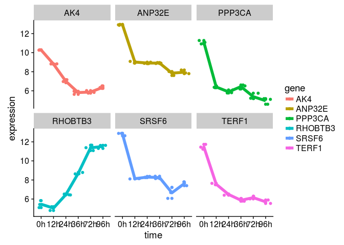
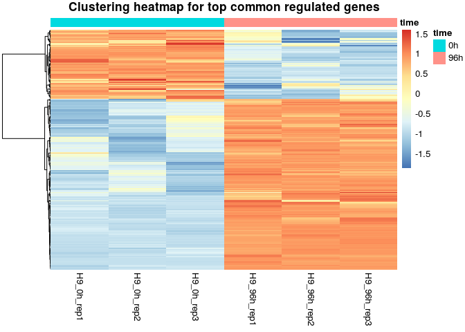

GSE75748 data analysis
================
German Novakovskiy
4 March 2018

Here we analyze gene expression data from [this paper](https://genomebiology.biomedcentral.com/articles/10.1186/s13059-016-1033-x). Some analysis steps are made according to [this workflow article](https://www.ncbi.nlm.nih.gov/pmc/articles/PMC4937821/).

Experimental protocol description:

For DE cells, H1 cells were seeded in E8 with BMP4 (5 ng/mL), Activin A (25 ng/mL), and CHIR99021 (1 μM) for the first two days, then withdraw CHIR99021 for the remaining period of differentiation.

Let's read our data into R (GSE75748):

``` r
if (file.exists("GSE75748.Rdata")) {
    # if previously downloaded
    load("GSE75748.Rdata")
} else {
    # Get geo object that contains our data and phenotype information
    geo_obj <- getGEO("GSE75748", GSEMatrix = TRUE)
    #geo_obj contains 1810 entries ((1018 + 758) single cells + (19 + 15) bulk RNA-seq)
    geo_obj <- geo_obj[[1]]
    save(geo_obj, file = "GSE75748.Rdata")
}
```

Further analysis of the downloaded data:

``` r
#show data structure
show(geo_obj)
```

    ## ExpressionSet (storageMode: lockedEnvironment)
    ## assayData: 0 features, 1810 samples 
    ##   element names: exprs 
    ## protocolData: none
    ## phenoData
    ##   sampleNames: GSM1964932 GSM1964933 ... GSM1966747 (1810 total)
    ##   varLabels: title geo_accession ... passage:ch1 (45 total)
    ##   varMetadata: labelDescription
    ## featureData: none
    ## experimentData: use 'experimentData(object)'
    ## Annotation: GPL16791

Let's load metadata:

``` r
#no confounding factors or batch effects (the same platform, unknown sex)
geo_metadata <- pData(geo_obj)

#due to complexity of metadata table it's more convenient to create your own (see below)
```

assayData has 0 features, it's not possible to load expression data from this dataset. That's why we will use expression data downloaded directly from the website

``` r
#cell type
bulk_cell_type_ec <- read.csv("GSE75748_bulk_cell_type_ec.csv/GSE75748_bulk_cell_type_ec.csv", header=TRUE)
#time course
bulk_time_course_ec <- read.csv("GSE75748_bulk_time_course_ec.csv/GSE75748_bulk_time_course_ec.csv", header=TRUE)

#single cell/cell type
sc_cell_type <- read.csv("GSE75748_sc_time_course_ec.csv", header=TRUE)
rownames(sc_cell_type) <- sc_cell_type$X
sc_cell_type <- sc_cell_type[,-1]
```

We are interested in 0 time point. We have only single cell data for it. Let's extract it:

``` r
zero_cols <- colnames(sc_cell_type)
zero_cols <- zero_cols[grepl("00h", zero_cols)]

zero_expr <- sc_cell_type[,zero_cols]
dim(zero_expr)
```

    ## [1] 19189    92

There are 92 cells from 0 time point, just as authors described it.

Metadata for samples of 0h:

``` r
zero_metadata <- geo_metadata %>%
  filter(grepl("for 0 hours", title))
dim(zero_metadata)
```

    ## [1] 92 45

Let's make 3 replicas out of 92 cells (31 cells in first, 31 in second, 30 in the last - clarify this moment with Sara):

``` r
zero_first_replica <- apply(zero_expr[1:31], 1, mean) #mean or median?
zero_second_replica <- apply(zero_expr[32:62], 1, mean) #mean or median?
zero_third_replica <- apply(zero_expr[63:92], 1, mean) #mean or median?

zero_expr_replicas <- data.frame(H9_0h_rep1 = zero_first_replica, H9_0h_rep2 = zero_second_replica,
                                 H9_0h_rep3 = zero_third_replica)

rownames(bulk_time_course_ec) <- bulk_time_course_ec$X
bulk_time_course_ec <- bulk_time_course_ec[,-1]

#delete extra rows from zero expr data frame
delete_rows <- setdiff(rownames(zero_expr_replicas), rownames(bulk_time_course_ec))
zero_expr_replicas <- zero_expr_replicas[!rownames(zero_expr_replicas) %in% delete_rows,]

bulk_time_course_ec <- merge(zero_expr_replicas, bulk_time_course_ec, by="row.names")
rownames(bulk_time_course_ec) <- bulk_time_course_ec$Row.names
bulk_time_course_ec <- bulk_time_course_ec[,-1]
```

Let's create metadata data frame:

``` r
sample_names <- colnames(bulk_time_course_ec) #without gene name

time_fact <- paste(c(0, 12,24,36,72,96), sep="", 'h') #factors of time
time_fact <- rep(time_fact, each=3)

time_int <- rep(c(0, 12,24,36,72,96), each=3) #time as continious variable

metadata <- data.frame(samples = sample_names, time = time_fact, age = time_int)

metadata %>% kable()
```

| samples       | time |  age|
|:--------------|:-----|----:|
| H9\_0h\_rep1  | 0h   |    0|
| H9\_0h\_rep2  | 0h   |    0|
| H9\_0h\_rep3  | 0h   |    0|
| H9\_12h\_rep1 | 12h  |   12|
| H9\_12h\_rep2 | 12h  |   12|
| H9\_12h\_rep3 | 12h  |   12|
| H9\_24h\_rep1 | 24h  |   24|
| H9\_24h\_rep2 | 24h  |   24|
| H9\_24h\_rep3 | 24h  |   24|
| H9\_36h\_rep1 | 36h  |   36|
| H9\_36h\_rep2 | 36h  |   36|
| H9\_36h\_rep3 | 36h  |   36|
| H9\_72h\_rep1 | 72h  |   72|
| H9\_72h\_rep2 | 72h  |   72|
| H9\_72h\_rep3 | 72h  |   72|
| H9\_96h\_rep1 | 96h  |   96|
| H9\_96h\_rep2 | 96h  |   96|
| H9\_96h\_rep3 | 96h  |   96|

``` r
str(metadata)
```

    ## 'data.frame':    18 obs. of  3 variables:
    ##  $ samples: Factor w/ 18 levels "H9_0h_rep1","H9_0h_rep2",..: 1 2 3 4 5 6 7 8 9 10 ...
    ##  $ time   : Factor w/ 6 levels "0h","12h","24h",..: 1 1 1 2 2 2 3 3 3 4 ...
    ##  $ age    : num  0 0 0 12 12 12 24 24 24 36 ...

Our primary goal here is to analyze bulk\_time\_course data (each stage with the next stage, step-by-step).

Deleting low-expressed genes. We don't want to filter out a gene that is highly expressed in one group, but lowly expressed in another, because that gene may be biologically interesting! So, we identify the smallest number of samples that could be part of one group (3), and make sure we don't remove genes that are expressed in more than that number.

Usually one will filter genes with 10-15 read counts. We have 12e6 as a lowest library size. 10 reads in such library size will be: 10/12e6 \*1e6 = 0.83. It is aproximately 1 cpm (the filtering is to this threshold).

``` r
#first let's create a edgeR DGElist object
bulk_time_course_ec <- as.matrix(bulk_time_course_ec)
rows <- rownames(bulk_time_course_ec)
#bulk_time_course_ec <- bulk_time_course_ec[,-1]
bulk_time_course_ec <- apply(bulk_time_course_ec, 2, as.double)
rownames(bulk_time_course_ec) <- rows

#for testing, delete after
#bulk_time_course_ec <- bulk_time_course_ec[,-c(1:3)]

DGE_bulk_time_course_ec <- DGEList(counts = bulk_time_course_ec) 

cpm <- cpm(DGE_bulk_time_course_ec)
keep.exprs <-rowSums(cpm > 1) >= 3

DGE_bulk_time_course_ec <- DGE_bulk_time_course_ec[keep.exprs,,]

dim(DGE_bulk_time_course_ec)
```

    ## [1] 14333    18

Very useful insight about [the filtering step](https://support.bioconductor.org/p/77178/):

"The most than can be done is to eliminate genes that cannot possibly be expressed in all the libraries for any condition, and that is exactly what the suggested filter does."

Our data here is in gene expected counts that were calculated using RSEM 1.2.3 (according to GEO query, <https://biowize.wordpress.com/2014/03/04/understanding-rsem-raw-read-counts-vs-expected-counts/>). Thus, we need to perform a library size normalization using edgeR:

``` r
normalized_factors_expression <- calcNormFactors(DGE_bulk_time_course_ec, method = "TMM") #calculation of scaling factors (for library size)

normalized_factors_expression$samples$norm.factors
```

    ##  [1] 0.8442666 0.8716866 0.8044489 1.0858852 1.1035056 1.0820767 1.0468473
    ##  [8] 1.0447433 1.0476810 1.0021610 1.0003328 1.0034298 0.9439126 1.0600265
    ## [15] 1.0124795 1.0272051 1.0362534 1.0480844

For this dataset the effect of TMM-normalisation is mild, as evident in the magnitude of the scaling factors, which are all relatively close to 1 (except samples that are from single cell data, 0h time point).

Let's look at distribution of values:

``` r
#removing gene column and transforming into matrix (for hist)
data <- as.matrix(DGE_bulk_time_course_ec$counts)

hist(data, main="GSE75748", xlim = c(0,1500), xlab = "Expression",
     ylab = "Frequency", breaks = 300)
```


Let's now perform RNA-seq analysis with limma, using only time factor variable (time column in metadata) and let's look separately at DE gene at each stage (from 12 to 24, from 24 to 36 and etc.):

``` r
metadata_time <- metadata[,-3]

metadata_time$samples <- as.character(metadata_time$samples)
metadata_time %>% kable()
```

| samples       | time |
|:--------------|:-----|
| H9\_0h\_rep1  | 0h   |
| H9\_0h\_rep2  | 0h   |
| H9\_0h\_rep3  | 0h   |
| H9\_12h\_rep1 | 12h  |
| H9\_12h\_rep2 | 12h  |
| H9\_12h\_rep3 | 12h  |
| H9\_24h\_rep1 | 24h  |
| H9\_24h\_rep2 | 24h  |
| H9\_24h\_rep3 | 24h  |
| H9\_36h\_rep1 | 36h  |
| H9\_36h\_rep2 | 36h  |
| H9\_36h\_rep3 | 36h  |
| H9\_72h\_rep1 | 72h  |
| H9\_72h\_rep2 | 72h  |
| H9\_72h\_rep3 | 72h  |
| H9\_96h\_rep1 | 96h  |
| H9\_96h\_rep2 | 96h  |
| H9\_96h\_rep3 | 96h  |

``` r
designMatrix <- model.matrix(~0 + time, metadata_time)
head(designMatrix, 10) %>% kable()
```

|  time0h|  time12h|  time24h|  time36h|  time72h|  time96h|
|-------:|--------:|--------:|--------:|--------:|--------:|
|       1|        0|        0|        0|        0|        0|
|       1|        0|        0|        0|        0|        0|
|       1|        0|        0|        0|        0|        0|
|       0|        1|        0|        0|        0|        0|
|       0|        1|        0|        0|        0|        0|
|       0|        1|        0|        0|        0|        0|
|       0|        0|        1|        0|        0|        0|
|       0|        0|        1|        0|        0|        0|
|       0|        0|        1|        0|        0|        0|
|       0|        0|        0|        1|        0|        0|

We have estimated counts data here. So we can apply voom (which usually takes count data as an input and transforms them to logCPM) that estimates the mean-variance relationship and uses this to compute appropriate observation-level weights. The data are then ready for linear modelling.

``` r
after_voom_cpm <- voom(normalized_factors_expression, designMatrix, plot=TRUE)
```


``` r
hist(after_voom_cpm$E, main="cleaned GSE75748 - log2 transformed CPM", xlab = "Expression",
     ylab = "Frequency")
```

 Let's build boxplots and explore the data:

``` r
cleaned_log_cpm_df <- as.data.frame(after_voom_cpm$E)

cleaned_log_cpm_df <- cleaned_log_cpm_df %>% rownames_to_column("gene")

meltedLogedBultTimeCourseEc <- melt(cleaned_log_cpm_df, id='gene')

meltedLogedBultTimeCourseEc %>%
  ggplot(aes(x = variable, y = value)) +
  geom_boxplot() + 
  theme(axis.text.x = element_text(angle = 90, hjust = 1))
```


Looks much better now!

``` r
nsamples <- ncol(cleaned_log_cpm_df[,-1])
group <- metadata_time$time
col <- brewer.pal(nsamples, "Paired")
```

    ## Warning in brewer.pal(nsamples, "Paired"): n too large, allowed maximum for palette Paired is 12
    ## Returning the palette you asked for with that many colors

``` r
plotMDS(cleaned_log_cpm_df[,-1], cex=1.5, labels = group, col = col)
```


It's clear that time ponts 0h, 12h, 24h and 36h are well (mostly) separated from each other and 72h with 96h, however the last group (72 and 96) is clustered closer together, thus we don't expect to see much DE genes in these groups.

Let's create a contrast matrix because we are interested in DE genes across different time points (12h compared to 0h, 24h compared to 12h and so on):

``` r
rownames(cleaned_log_cpm_df) <- cleaned_log_cpm_df$gene
cleaned_log_cpm_df <- cleaned_log_cpm_df[,-1]

# construct the contrast matrix
contrastMatrix <- makeContrasts(
  v12v0 = time12h - time0h,
  v24v12 = time24h - time12h,
  v36v24 = time36h - time24h,
  v72v36 = time72h - time36h,
  v96v72 = time96h - time72h,
  levels = designMatrix
)

contrastMatrix %>% kable()
```

|         |  v12v0|  v24v12|  v36v24|  v72v36|  v96v72|
|---------|------:|-------:|-------:|-------:|-------:|
| time0h  |     -1|       0|       0|       0|       0|
| time12h |      1|      -1|       0|       0|       0|
| time24h |      0|       1|      -1|       0|       0|
| time36h |      0|       0|       1|      -1|       0|
| time72h |      0|       0|       0|       1|      -1|
| time96h |      0|       0|       0|       0|       1|

``` r
# keep the fit around as we will need to it for looking at other contrasts later 
time_course_Fit <- lmFit(after_voom_cpm, designMatrix)

# fit the contrast using the original fitted model
contrastFit <- contrasts.fit(time_course_Fit, contrastMatrix)

# apply eBayes() for moderated statistics
contrastFitEb <- eBayes(contrastFit)

contrastGenes <- topTable(contrastFitEb, number = Inf, p.value = 0.05)

plotSA(contrastFitEb)
```


``` r
#contrastGenes %>% kable()
```

``` r
cutoff <- 5e-02 #0.05 p value
#adjust method by default is BH (equivalent to fdr)
time_course_res <- decideTests(contrastFitEb, p.value = cutoff, lfc = 1)
summary(time_course_res)
```

    ##        v12v0 v24v12 v36v24 v72v36 v96v72
    ## Down    3020    144    291   1942    167
    ## NotSig  8405  13953  13642  10586  13977
    ## Up      2908    236    400   1805    189

We see there are different number of genes up and down regulated at each stage.

Here are the genes that upregulated from 24 hours to 36 hours.

``` r
hits3 <- time_course_res %>% 
  as.data.frame() %>% 
  rownames_to_column("gene") %>% 
  filter(v36v24 > 0)

head(hits3) %>% kable()
```

| gene   |  v12v0|  v24v12|  v36v24|  v72v36|  v96v72|
|:-------|------:|-------:|-------:|-------:|-------:|
| AADAT  |      0|       0|       1|       0|       0|
| ABHD6  |      0|       0|       1|      -1|       0|
| ABLIM1 |      0|       0|       1|      -1|       0|
| ABTB2  |      0|       0|       1|       0|       0|
| ACSS3  |      0|       1|       1|       0|       0|
| ACVRL1 |     -1|       0|       1|       1|      -1|

``` r
#function for plotting genes
plotGenes <- function(genes, expressionMatrix, metadata) {
  
  expressionDataForGenes <- expressionMatrix %>%
    rownames_to_column("gene") %>%
    filter(gene %in% genes) %>%
    melt()
  
  colnames(expressionDataForGenes) <- c("gene", "samples", "expression")
  expressionDataForGenes <- expressionDataForGenes %>%
    left_join(metadata, id="time")
  
  expressionDataForGenes %>% 
    ggplot(aes(x = time, y = expression, color=gene)) +
    geom_point() +
    geom_jitter() +
    stat_summary(aes(y = expression, group=1), fun.y = "mean", geom="line", size=2) +
    facet_wrap(~gene)
}
```

Let's plot 4 random genes that are upregulated at each stage.

``` r
hits1 <- time_course_res %>% 
  as.data.frame() %>% 
  rownames_to_column("gene") %>% 
  filter(v12v0 > 0)

#stage 24v12
hits2 <- time_course_res %>% 
  as.data.frame() %>% 
  rownames_to_column("gene") %>% 
  filter(v24v12 > 0)

#stage 72v36
hits4 <- time_course_res %>% 
  as.data.frame() %>% 
  rownames_to_column("gene") %>% 
  filter(v72v36 > 0)

#stage 96v72
hits5 <- time_course_res %>% 
  as.data.frame() %>% 
  rownames_to_column("gene") %>% 
  filter(v96v72 > 0)
```

``` r
sample_genes_12v0 <- sample(hits1$gene,4)
plotGenes(sample_genes_12v0, cleaned_log_cpm_df, metadata)
```

    ## Using gene as id variables

    ## Joining, by = "samples"



``` r
sample_genes_24v12 <- sample(hits2$gene,4)
plotGenes(sample_genes_24v12, cleaned_log_cpm_df, metadata)
```

    ## Using gene as id variables

    ## Joining, by = "samples"


``` r
sample_genes_36v24 <- sample(hits3$gene,4)
plotGenes(sample_genes_36v24, cleaned_log_cpm_df, metadata)
```

    ## Using gene as id variables

    ## Joining, by = "samples"


``` r
sample_genes_72v36 <- sample(hits4$gene,4)
plotGenes(sample_genes_72v36, cleaned_log_cpm_df, metadata)
```

    ## Using gene as id variables

    ## Joining, by = "samples"



``` r
sample_genes_96v72 <- sample(hits5$gene,4)
plotGenes(sample_genes_96v72, cleaned_log_cpm_df, metadata)
```

    ## Using gene as id variables

    ## Joining, by = "samples"


let's build those genes that according to the paper are DE in 24v12 transition:

``` r
sample_genes <- c("T", "CDX1", "MSX2")
plotGenes(sample_genes, cleaned_log_cpm_df, metadata)
```

    ## Using gene as id variables

    ## Joining, by = "samples"



``` r
#other markers for ME (primitive streak)
sample_genes <- c("CDH2", "PDGFRA", "FGF4", "DKK4")
plotGenes(sample_genes, cleaned_log_cpm_df, metadata)
```

    ## Using gene as id variables

    ## Joining, by = "samples"



COMMENTS
--------

-   paper reports that CDX1, MSX2 and T are over expressed from 12 to 24h transition. I see only T and CDX1 (p-value cutoff 5e-02, FDR)
-   paper reports that CER1 and GATA4 are over expressed from 24 to 36h transition.I see both (p-value cutoff 5e-02, FDR)
-   paper reports that DKK4 and MYCT1 are over expressed from 36 to 72. I see both (p-value cutoff 5e-02, FDR)

Let's look at the expression of these genes EOMES, CER1, GATA4, PRDM1, and POU2AF1 at 96h because they are expected to be highly expressed during 96h stage, according to the paper (and KLF8 - "KLF8 may play a specific role during the transition from mesendoderm toward DE cells"):

``` r
sample_genes <- c("EOMES", "CER1", "GATA4", "PRDM1", "POU2AF1", "KLF8")
plotGenes(sample_genes, cleaned_log_cpm_df, metadata)
```

    ## Using gene as id variables

    ## Joining, by = "samples"

 Let's look at the expression of pluripotency genes POU5F1, NANOG, and SOX2:

``` r
sample_genes <- c("POU5F1", "NANOG", "SOX2")
plotGenes(sample_genes, cleaned_log_cpm_df, metadata)
```

    ## Using gene as id variables

    ## Joining, by = "samples"

 Their expression is going down, just as expected.

Now let's look at key DE markers CXCR4, SOX17, HNF1B, KIT, and KRT19:

``` r
#sample_genes <- c("FOXA2")
#HNF1B is filtered as low expressed gene (cpm < 5)
sample_genes <- c("CXCR4", "SOX17", "HNF1B", "KIT", "KRT19")
plotGenes(sample_genes, cleaned_log_cpm_df, metadata)
```

    ## Using gene as id variables

    ## Joining, by = "samples"

 It's clear that CXCR4, SOX17 and KIT are upregulated at 96h, expression of KRT19 did not change so much, but KRT19 remained highly expressed.

Interesting genes: - FOXA2, which is regulated by long non-coding RNA DEANR1 (is low filtered here); - GSC is controlled by DIGIT lncRNA; - EOMES, MIXL1, SOX17 are DE markers (MIXL1 is mesodendoderm marker)

``` r
sample_genes <- c("FOXA2", "GSC", "EOMES", "MIXL1", "SOX17")
plotGenes(sample_genes, cleaned_log_cpm_df, metadata)
```

    ## Using gene as id variables

    ## Joining, by = "samples"



Comparisons with the paper
==========================

"A total of 3247 differentially expressed genes were identified in the scRNA-seq time course experiment listed in Additional file 4: Table S3."

In my work I found this number of DE genes:

``` r
#list all DE genes
allDEGenes <- topTable(contrastFitEb, number = Inf, p.value = 0.05, lfc = 1)
nrow(allDEGenes)
```

    ## [1] 9112

According to Decide tests we have this number of DE genes (at different time stages):

``` r
de_genes_rows <- apply(time_course_res, 1, function(x) any(x != 0))
de_genes_at_stages <- time_course_res[de_genes_rows,]
nrow(de_genes_at_stages)
```

    ## [1] 8321

We will check both numbers.

``` r
all_de_genes <- rownames(allDEGenes)
stages_de_genes <- rownames(de_genes_at_stages)
```

Get list of DE genes from the study:

``` r
paper_de_genes <- read_excel("13059_2016_1033_MOESM4_ESM.xlsx")
head(paper_de_genes) %>% kable()
```

| GeneID | most likely pattern |  PP pattern|
|:-------|:--------------------|-----------:|
| A2ML1  | Down-NC-NC-NC-NC    |   0.2976393|
| AAK1   | Down-NC-Up-NC-NC    |   0.4062348|
| AARS   | Down-NC-NC-NC-NC    |   0.4685744|
| AARS2  | Down-Up-NC-NC-NC    |   0.2714841|
| AASS   | Down-NC-Up-NC-NC    |   0.5190453|
| AATF   | NC-NC-Up-NC-NC      |   0.3152373|

``` r
paper_de_genes <- paper_de_genes$GeneID
length(paper_de_genes)
```

    ## [1] 3247

So there is in fact 3247 genes in the result of this study.

Comparison of DE genes from topTable with DE genes from the paper:

``` r
temp <- venn.diagram(list(My_TopTable = all_de_genes, Paper_genes = paper_de_genes),fill = c("red", "green"), alpha = c(0.5, 0.5), cex = 2, cat.fontface = 4, lty =2, fontfamily =3, filename = NULL, main = "Comparison of paper DE genes with my all DE genes (from TopTable)", category.names = c("My topTable", "Paper genes"))

grid::grid.newpage()
grid::grid.draw(temp)
```


``` r
temp2 <- venn.diagram(list(My_TopTable = stages_de_genes, Paper_genes = paper_de_genes),fill = c("red", "green"), alpha = c(0.5, 0.5), cex = 2, cat.fontface = 4, lty =2, fontfamily =3, filename = NULL, main = "Comparison of paper DE genes with my stage DE genes (from decideTests)", category.names = c("Stage DE genes", "Paper genes"))

grid::grid.newpage()
grid::grid.draw(temp2)
```


Performing analysis without contrast matrix, using 0 as a reference
===================================================================

``` r
#0 hours as a reference
designMatrixReference <- model.matrix(~time, metadata_time)
head(designMatrixReference, 10) %>% kable()
```

|  (Intercept)|  time12h|  time24h|  time36h|  time72h|  time96h|
|------------:|--------:|--------:|--------:|--------:|--------:|
|            1|        0|        0|        0|        0|        0|
|            1|        0|        0|        0|        0|        0|
|            1|        0|        0|        0|        0|        0|
|            1|        1|        0|        0|        0|        0|
|            1|        1|        0|        0|        0|        0|
|            1|        1|        0|        0|        0|        0|
|            1|        0|        1|        0|        0|        0|
|            1|        0|        1|        0|        0|        0|
|            1|        0|        1|        0|        0|        0|
|            1|        0|        0|        1|        0|        0|

``` r
v <- voom (normalized_factors_expression, designMatrixReference, plot = FALSE)

# keep the fit around as we will need to it for looking at other contrasts later 
time_course_Fit_Reference <- lmFit(v, designMatrixReference)

# apply eBayes() for moderated statistics
time_course_Fit_Reference_Ebayes <- eBayes(time_course_Fit_Reference)

genesReference <- topTable(time_course_Fit_Reference_Ebayes, number = Inf, p.value = 0.05, lfc = 1)
```

    ## Removing intercept from test coefficients

``` r
dim(genesReference)
```

    ## [1] 9714    9

``` r
genesReference75748 <- genesReference
save(genesReference75748, file="GSE75748_topGenes.Rdata")
```

Comparisons of different papers
===============================

``` r
load("../GSE109658/GSE109658_topGenes.Rdata")

genes109658 <- rownames(genesReference109658)
genes75748 <- rownames(genesReference75748)

commonGenes <- intersect(genes109658, genes75748)
length(commonGenes)
```

    ## [1] 3864

``` r
commonGenes <- genesReference75748[commonGenes,]
commonGenes <- commonGenes[with(commonGenes, order(adj.P.Val)),]


sample_genes <- rownames(commonGenes)[1:6]
plotGenes(sample_genes, cleaned_log_cpm_df, metadata)
```

    ## Using gene as id variables

    ## Joining, by = "samples"



``` r
all(rownames(commonGenes) %in% rownames(time_course_res))
```

    ## [1] TRUE

``` r
commonGenesTrends <- time_course_res[rownames(commonGenes),]
head(commonGenesTrends) %>% kable()
```

|         |  v12v0|  v24v12|  v36v24|  v72v36|  v96v72|
|---------|------:|-------:|-------:|-------:|-------:|
| ANP32E  |     -1|       0|       0|      -1|       0|
| TERF1   |     -1|      -1|       0|       0|       0|
| SRSF6   |     -1|       0|       0|      -1|       0|
| AK4     |     -1|      -1|      -1|       0|       0|
| PPP3CA  |     -1|       0|       0|      -1|       0|
| RHOBTB3 |      0|       1|       1|       1|       0|

``` r
upRegulatedToDE <- commonGenesTrends %>%
  as.data.frame() %>%
  rownames_to_column("gene") %>%
  filter(`v72v36` == 1)

#79 are upregulated to DE
sample_genes <- upRegulatedToDE$gene[1:6]
plotGenes(sample_genes, cleaned_log_cpm_df, metadata)
```

    ## Using gene as id variables

    ## Joining, by = "samples"


``` r
dim(upRegulatedToDE)
```

    ## [1] 898   6

Using age as continious
=======================

``` r
metadata_cont_time <- metadata[,-2]
metadata_cont_time %>% kable()
```

| samples       |  age|
|:--------------|----:|
| H9\_0h\_rep1  |    0|
| H9\_0h\_rep2  |    0|
| H9\_0h\_rep3  |    0|
| H9\_12h\_rep1 |   12|
| H9\_12h\_rep2 |   12|
| H9\_12h\_rep3 |   12|
| H9\_24h\_rep1 |   24|
| H9\_24h\_rep2 |   24|
| H9\_24h\_rep3 |   24|
| H9\_36h\_rep1 |   36|
| H9\_36h\_rep2 |   36|
| H9\_36h\_rep3 |   36|
| H9\_72h\_rep1 |   72|
| H9\_72h\_rep2 |   72|
| H9\_72h\_rep3 |   72|
| H9\_96h\_rep1 |   96|
| H9\_96h\_rep2 |   96|
| H9\_96h\_rep3 |   96|

``` r
designMatrix <- model.matrix(~age, metadata_cont_time)
head(designMatrix, 10) %>% kable()
```

|  (Intercept)|  age|
|------------:|----:|
|            1|    0|
|            1|    0|
|            1|    0|
|            1|   12|
|            1|   12|
|            1|   12|
|            1|   24|
|            1|   24|
|            1|   24|
|            1|   36|

``` r
expressionFit_age <- lmFit(cleaned_log_cpm_df, designMatrix)
expressionFitBayes_age <- eBayes(expressionFit_age)

topGenesAge <- topTable(expressionFitBayes_age, number = Inf, p.value = 0.05)#, lfc = 1)
```

    ## Removing intercept from test coefficients

``` r
nrow(topGenesAge)
```

    ## [1] 5968

``` r
head(topGenesAge) %>% kable()
```

|         |       logFC|   AveExpr|          t|  P.Value|  adj.P.Val|         B|
|---------|-----------:|---------:|----------:|--------:|----------:|---------:|
| CYP26A1 |   0.0994021|  6.154112|   19.99919|        0|          0|  22.44215|
| AP1M2   |  -0.0918790|  2.899708|  -19.37828|        0|          0|  21.87479|
| CRABP1  |  -0.0741114|  2.894697|  -19.18767|        0|          0|  21.69703|
| CDH3    |  -0.0601161|  4.131228|  -17.73228|        0|          0|  20.28048|
| COL3A1  |   0.1272345|  2.570885|   17.27234|        0|          0|  19.80961|
| ESRP1   |  -0.0942202|  4.839029|  -16.55618|        0|          0|  19.05243|

``` r
sample_genes <- rownames(topGenesAge)[1:6]
plotGenes(sample_genes, cleaned_log_cpm_df, metadata)
```

    ## Using gene as id variables

    ## Joining, by = "samples"


``` r
temp <- venn.diagram(list(My_TopTable = rownames(topGenesAge), Paper_genes = paper_de_genes),fill = c("red", "green"), alpha = c(0.5, 0.5), cex = 2, cat.fontface = 4, lty =2, fontfamily =3, filename = NULL, main = "Comparison of paper DE genes with my all DE genes (from TopTable)", category.names = c("My topTable", "Paper genes"))

grid::grid.newpage()
grid::grid.draw(temp)
```

 \# Finding discrepancies

``` r
paper_de_genes <- read_excel("13059_2016_1033_MOESM4_ESM.xlsx")
foo <- data.frame(do.call('rbind', strsplit(as.character(paper_de_genes$`most likely pattern`),'-',fixed=TRUE)))
df <- data.frame(Gene = paper_de_genes$GeneID)
dfx <- cbind(df, foo)
paper_de_genes <- dfx
colnames(paper_de_genes) <- c("Gene", "12v0", "24v12", "36v24", "72v36", "96v72")
head(paper_de_genes) %>% kable()
```

| Gene  | 12v0 | 24v12 | 36v24 | 72v36 | 96v72 |
|:------|:-----|:------|:------|:------|:------|
| A2ML1 | Down | NC    | NC    | NC    | NC    |
| AAK1  | Down | NC    | Up    | NC    | NC    |
| AARS  | Down | NC    | NC    | NC    | NC    |
| AARS2 | Down | Up    | NC    | NC    | NC    |
| AASS  | Down | NC    | Up    | NC    | NC    |
| AATF  | NC   | NC    | Up    | NC    | NC    |

``` r
#deleting column 12v0, because I didn't  have that comparison
#paper_de_genes <- paper_de_genes[,-2]

paper_de_genes <- paper_de_genes %>%
  filter('12v0' != "NC" | `24v12` != "NC" | `36v24` != "NC" | `72v36` != "NC" | `96v72` != "NC")
dim(paper_de_genes)
```

    ## [1] 3247    6

``` r
temp2 <- venn.diagram(list(My_TopTable = stages_de_genes, Paper_genes = paper_de_genes$Gene),fill = c("red", "green"), alpha = c(0.5, 0.5), cex = 2, cat.fontface = 4, lty =2, fontfamily =3, filename = NULL, main = "Comparison of paper DE genes with my stage DE genes (from decideTests)", category.names = c("Stage DE genes", "Paper genes"))

grid::grid.newpage()
grid::grid.draw(temp2)
```


``` r
#reminder
summary(time_course_res)
```

    ##        v12v0 v24v12 v36v24 v72v36 v96v72
    ## Down    3020    144    291   1942    167
    ## NotSig  8405  13953  13642  10586  13977
    ## Up      2908    236    400   1805    189

``` r
paper_res <- list(`12v0` = table(paper_de_genes$`12v0`), `24v12` = table(paper_de_genes$`24v12`), `36v24` = table(paper_de_genes$`36v24`),
                  `72v36` = table(paper_de_genes$`72v36`), `96v72` = table(paper_de_genes$`96v72`))

paper_res
```

    ## $`12v0`
    ## 
    ## Down   NC   Up 
    ## 2051 1023  173 
    ## 
    ## $`24v12`
    ## 
    ## Down   NC   Up 
    ##   53 2417  777 
    ## 
    ## $`36v24`
    ## 
    ## Down   NC   Up 
    ##  328 1930  989 
    ## 
    ## $`72v36`
    ## 
    ## Down   NC   Up 
    ##  235 2781  231 
    ## 
    ## $`96v72`
    ## 
    ## Down   NC   Up 
    ##   10 3236    1

``` r
#hits at 36v24
head(hits3) %>% kable()
```

| gene   |  v12v0|  v24v12|  v36v24|  v72v36|  v96v72|
|:-------|------:|-------:|-------:|-------:|-------:|
| AADAT  |      0|       0|       1|       0|       0|
| ABHD6  |      0|       0|       1|      -1|       0|
| ABLIM1 |      0|       0|       1|      -1|       0|
| ABTB2  |      0|       0|       1|       0|       0|
| ACSS3  |      0|       1|       1|       0|       0|
| ACVRL1 |     -1|       0|       1|       1|      -1|

``` r
paper_up_36v24 <- paper_de_genes %>%
  filter(`36v24` == "Up")
nrow(paper_up_36v24)
```

    ## [1] 989

``` r
#in paper but not in my research
s <- setdiff(paper_up_36v24$Gene, hits2$gene)
length(s)
```

    ## [1] 943

``` r
#plot genes that are DE in paper at 36 to 24 but not in my results
set.seed(123)
sample_genes <- sample(s, 4)
plotGenes(sample_genes, cleaned_log_cpm_df, metadata)
```

    ## Using gene as id variables

    ## Joining, by = "samples"


Compairing stem cell vs DE
==========================

``` r
designMatrix <- model.matrix(~0 + time, metadata_time)

contrastMatrix <- makeContrasts(
  v96hv0h = time96h - time0h,
  levels = designMatrix
)

# keep the fit around as we will need to it for looking at other contrasts later 
time_course_Fit <- lmFit(after_voom_cpm, designMatrix)

# fit the contrast using the original fitted model
contrastFit <- contrasts.fit(time_course_Fit, contrastMatrix)

# apply eBayes() for moderated statistics
contrastFitEb <- eBayes(contrastFit)

time_course_res <- decideTests(contrastFitEb, p.value = cutoff, lfc = 2)
summary(time_course_res)
```

    ##        v96hv0h
    ## Down      2152
    ## NotSig   10197
    ## Up        1984

``` r
upRegulated75748 <- time_course_res %>%
  as.data.frame() %>%
  rownames_to_column("gene") %>%
  filter(v96hv0h == 1)

downRegulated75748 <- time_course_res %>%
  as.data.frame() %>%
  rownames_to_column("gene") %>%
  filter(v96hv0h == -1)
```

We have 1984 upregulated genes and 2152 downregulated genes.

``` r
save(upRegulated75748, file="upRegulated75748.Rdata")
save(downRegulated75748, file="downRegulated75748.Rdata")
```

Comparison of up and down regulated genes (4 days v 0 day) in two papers
========================================================================

``` r
load("../GSE109658/upRegulated109658.Rdata")
load("../GSE109658/downRegulated109658.Rdata")
load("../../allUpRegulated.Rdata")
load("../../allDownRegulated.Rdata")

common_upRegulated <- intersect(upRegulated109658$gene, upRegulated75748$gene)
common_downRegulated <- intersect(downRegulated109658$gene, downRegulated75748$gene)
```

We have 735 common upregulated genes and 433 common downregulated genes.

``` r
#creating an annotation matrix
prDes <- metadata[order(metadata$time),] #order by time_point

prDes <- prDes %>%
  filter(time == "0h" | time == "96h")

rownames(prDes) <- prDes$samples
prDes <- prDes[,-1]

#fixing column order for expression matrix (should be the same as rownames order in prDes)
#common_regulated_genes <- c(common_upRegulated, common_downRegulated)
common_regulated_genes <- c(all_upRegulated, all_downRegulated)

#topGenesRegulated <- cleaned_log_cpm_df[common_regulated_genes,]
cl_log_cpm_df <- cleaned_log_cpm_df[, rownames(prDes)]
#topGenesRegulated <- cleaned_log_cpm_df[, rownames(prDes)]
topGenesRegulated <- cl_log_cpm_df[common_regulated_genes,]
#scaling the data (without it in pheatmap specify scale = "row")
topGenesRegulated <- t(scale(t(topGenesRegulated)))

#creating a heatmap with pheatmap (no clustering because we ordered samples by time point)
pheatmap(topGenesRegulated, cluster_rows = T, cluster_cols = FALSE, scale = "none", clustering_method = "ward.D2", 
    clustering_distance_cols = "euclidean", show_colnames = T, show_rownames = FALSE, 
    main = "Clustering heatmap for top common regulated genes", annotation = prDes[,c("time"), drop=FALSE])
```



``` r
fileConn<-file("~/Papers/CMAP/all_common_upregulated.grp")
writeLines(common_upRegulated, fileConn)
close(fileConn)

fileConn<-file("~/Papers/CMAP/all_common_downregulated.grp")
writeLines(common_downRegulated, fileConn)
close(fileConn)
```

for CMAP (top 150 from up and 150 from down)
============================================

``` r
#not sure here...
genRef <- topTable(contrastFitEb, number = Inf, p.value=cutoff, lfc=1)

#taking upregulated genes
referenceUpregulated <- genRef[all_upRegulated,]
referenceUpregulated <-  referenceUpregulated[with(referenceUpregulated, order(adj.P.Val)), ]
referenceUpregulatedLogSorted <- referenceUpregulated[with(referenceUpregulated, order(logFC, decreasing = T)), ]

#taking downregulated genes
referenceDownregulated <- genRef[all_downRegulated,]
referenceDownregulated <-  referenceDownregulated[with(referenceDownregulated, order(adj.P.Val)), ]
referenceDownregulatedLogSorted <- referenceDownregulated[with(referenceDownregulated, order(logFC)), ]

#take 150 upregulated genes (by p.value)
first_up <- rownames(referenceUpregulated)[1:150]
fileConn<-file("~/Papers/CMAP/topCommonUpRegulated.grp")
writeLines(first_up, fileConn)
close(fileConn)

#take 150 downregulated genes (by p.value)
first_down <- rownames(referenceDownregulated)[1:150]
fileConn2<-file("~/Papers/CMAP/topCommonDownRegulated.grp")
writeLines(first_down, fileConn2)
close(fileConn2)

#take 150 upregulated genes (by logFC)
first_up <- rownames(referenceUpregulatedLogSorted)#[1:150]
fileConn<-file("~/Papers/CMAP/topCommonUpRegulatedLogSorted.grp")
writeLines(first_up, fileConn)
close(fileConn)

#take 150 downregulated genes (by logFC)
first_down <- rownames(referenceDownregulatedLogSorted)#[1:150]
fileConn2<-file("~/Papers/CMAP/topCommonDownRegulatedLogSorted.grp")
writeLines(first_down, fileConn2)
close(fileConn2)
```

To array probes:

``` r
x <- hgu133aSYMBOL
# Get the probe identifiers - gene symbol mappings
mapped_probes <- mappedkeys(x)
# Convert to a dataframe
genesym.probeid <- as.data.frame(x[mapped_probes])
head(genesym.probeid)
```

    ##    probe_id symbol
    ## 1   1053_at   RFC2
    ## 2    117_at  HSPA6
    ## 3    121_at   PAX8
    ## 4 1255_g_at GUCA1A
    ## 5   1316_at   THRA
    ## 6   1320_at PTPN21

``` r
probe_up <- genesym.probeid %>%
  filter(symbol %in% first_up) 

probe_up <- probe_up$probe_id

probe_down <- genesym.probeid %>%
  filter(symbol %in% first_down) 

probe_down <- probe_down$probe_id

fileConn2<-file("~/Papers/CMAP/topCommonDownRegulatedLogSortedProbes.grp")
writeLines(probe_down, fileConn2)
close(fileConn2)

fileConn2<-file("~/Papers/CMAP/topCommonUpRegulatedLogSortedProbes.grp")
writeLines(probe_up, fileConn2)
close(fileConn2)
```

Gene set enrichment analysis of GSE75748
========================================

``` r
if (!file.exists("GO.xml")) { goToday("GO.xml") }

DEgenes_0h_96h <- topTable(contrastFitEb, number = Inf)

ggplot(data = DEgenes_0h_96h, aes(x = logFC, y = -log(adj.P.Val), color = (-log(adj.P.Val) > 3)))+
  scale_colour_manual(name = 'p-value < 0.05', values = setNames(c('red','black'),c(T, F)), labels = c("False", "True"))+
  geom_point()+
  geom_vline(xintercept=0)+
  geom_vline(xintercept=-2)+
  geom_vline(xintercept=2)+
  #xlim(-1.5,1.5)+
  ylab("-log(p-value)")+
  xlab("logFC")+
  labs(title="Gene expression differences in 0h and 96h cells, GSE75748")+
  theme_bw()+
  theme(axis.line = element_line(colour = "black"),
        panel.grid.major = element_blank(),
        panel.grid.minor = element_blank(),
        #panel.border = element_blank(),
        panel.background = element_blank()) +
  theme(axis.title.x=element_text(size=12),
        axis.text.y=element_text(size=12),
        axis.title.y=element_text(size=14),
        axis.ticks.x=element_blank(),
        strip.text.x = element_text(size=14),
        strip.background = element_rect(colour="white", fill="white"),
        legend.text=element_text(size=15),
        legend.title=element_text(size=14))
```


``` r
ermineInputGeneScores <- DEgenes_0h_96h %>% 
  rownames_to_column("gene") %>%
  #mutate(absolute_logFC = abs(logFC)) %>% 
  dplyr::select(gene, logFC) %>% 
  na.omit() %>% 
  as.data.frame() %>% 
  arrange(desc(logFC)) %>% 
  column_to_rownames("gene")

head(ermineInputGeneScores, 10) %>% kable() # print the first few rows
```

|        |      logFC|
|--------|----------:|
| HAPLN1 |  11.784025|
| CER1   |  11.705976|
| ERBB4  |  11.489550|
| COL3A1 |  11.315344|
| EOMES  |  10.183182|
| CRHBP  |  10.167101|
| COL5A1 |  10.017074|
| GATA6  |   9.741286|
| DKK4   |   9.730866|
| LUM    |   9.698491|

``` r
enrichmentResult <- precRecall(scores = ermineInputGeneScores, 
                               scoreColumn = 1, # column 1 is the scores 
                               bigIsBetter = TRUE, # larger logFC should be ranked higher
                               annotation = "Generic_human", # ask ermineJ to use the Generic_human annotation file (will automatically download)
                               aspects = "B", # look at only biological processes 
                               iterations = 10000, # 10K sampling iterations so that results are stable
                               geneSetDescription = "GO.xml") # use the GO XML file in current directory

enrichmentResult$results %>% arrange(MFPvalue) %>% head(10) %>% kable()
```

| Name                                                                     | ID           |  NumProbes|  NumGenes|   RawScore|  Pval|  CorrectedPvalue|  MFPvalue|  CorrectedMFPvalue|  Multifunctionality| Same as | GeneMembers                                                                                                                                                                                                                                                                                                                                                                                                                                                                                                                                                                                                                                                                                                                                                                                                                                                                                                                                                                                                                                                                                                                                                                                   |
|:-------------------------------------------------------------------------|:-------------|----------:|---------:|----------:|-----:|----------------:|---------:|------------------:|-------------------:|:--------|:----------------------------------------------------------------------------------------------------------------------------------------------------------------------------------------------------------------------------------------------------------------------------------------------------------------------------------------------------------------------------------------------------------------------------------------------------------------------------------------------------------------------------------------------------------------------------------------------------------------------------------------------------------------------------------------------------------------------------------------------------------------------------------------------------------------------------------------------------------------------------------------------------------------------------------------------------------------------------------------------------------------------------------------------------------------------------------------------------------------------------------------------------------------------------------------------|
| formation of primary germ layer                                          | <GO:0001704> |        101|       101|  0.0492904|     0|                0|         0|                  0|               0.984| NA      | ACVR1|ARID1A|ATOH8|AXIN1|BMP4|BMP7|BMPR1A|BMPR2|CDC73|CHRD|COL11A1|COL12A1|COL4A2|COL6A1|COL7A1|CRB2|CTNNB1|CTR9|DKK1|DUSP1|DUSP2|DUSP4|DUSP5|EOMES|EPB41L5|ETS2|ETV2|EXOC4|EXT2|EYA1|EYA2|FGFR2|FN1|FOXC1|FOXC2|FOXF1|GATA6|GPI|HAND1|HMGA2|HOXA11|HSBP1|ITGA2|ITGA3|ITGA4|ITGA5|ITGA7|ITGA8|ITGAV|ITGB1|ITGB2|ITGB5|KDM6A|KDM6B|KIF16B|KLF4|LAMA3|LAMB1|LEF1|LEO1|LHX1|MESP1|MESP2|MIXL1|MMP14|MMP15|MMP2|MMP9|MSGN1|NANOG|NF2|NODAL|NOG|NR4A3|PAF1|PAX2|POFUT2|POU5F1|PRKAR1A|RTF1|SETD2|SIX2|SMAD1|SMAD2|SMAD3|SNAI1|SOX17|SOX2|SOX7|SRF|TAL1|TBX20|TBX6|TWSG1|TXNRD1|VTN|WLS|WNT11|WNT3|WNT3A|WNT5A|                                                                                                                                                                                                                                                                                                                                                                                                                                                                                                                                                                                     |
| endoderm formation                                                       | <GO:0001706> |         46|        46|  0.0522836|     0|                0|         0|                  0|               0.811| NA      | CDC73|COL11A1|COL12A1|COL4A2|COL6A1|COL7A1|CTNNB1|CTR9|DKK1|DUSP1|DUSP2|DUSP4|DUSP5|EOMES|FN1|GATA6|HMGA2|HSBP1|ITGA4|ITGA5|ITGA7|ITGAV|ITGB2|ITGB5|LAMA3|LAMB1|LEO1|LHX1|MIXL1|MMP14|MMP15|MMP2|MMP9|NANOG|NODAL|NOG|PAF1|POU5F1|RTF1|SETD2|SMAD2|SOX17|SOX2|SOX7|TBX20|VTN|                                                                                                                                                                                                                                                                                                                                                                                                                                                                                                                                                                                                                                                                                                                                                                                                                                                                                                                 |
| morphogenesis of a branching structure                                   | <GO:0001763> |        151|       150|  0.0381646|     0|                0|         0|                  0|               0.999| NA      | ACVR1|ADAMTS16|ADM|AR|B4GALT1|BCL2|BMP2|BMP4|BMP7|BTRC|CELSR1|CLIC4|COL13A1|COL4A1|CSF1|CTNNB1|CTNNBIP1|CTSH|CTSZ|DAG1|DCHS1|DDR1|DLG1|DLG5|DLL4|DLX2|EDN1|EDNRA|EGF|ENG|EPHA2|EPHA7|ESRP2|EYA1|FAT4|FEM1B|FGF1|FGF10|FGF2|FGF7|FGF8|FGFR1|FGFR2|FOXA1|FOXC2|FOXD1|FOXF1|FRS2|FZD5|GBX2|GCM1|GDNF|GLI2|GLI3|GNA13|GPC3|GRB2|GREM1|GRHL2|GZF1|HHEX|HHIP|HOXA11|HOXB13|HOXD11|HOXD13|IHH|IL10|ILK|KDM5B|KRAS|LAMA5|LEF1|LHX1|LRP5|LRP6|MED1|MET|MKS1|MMP14|MSX2|MYC|MYCN|NFATC4|NKX3-1|NOG|NOTCH1|NOTCH4|NPNT|NRARP|NRP1|PAK1|PAX2|PBX1|PGF|PHB2|PITX2|PKD1|PKD2|PLXNA1|PLXND1|PML|PPP1CA|PPP3R1|PRDM1|PROX1|PTCH1|RASIP1|RBM15|RDH10|RERE|RSPO2|RSPO3|SALL1|SEMA3A|SEMA3C|SEMA3E|SETD2|SFRP1|SFRP2|SLIT2|SMAD4|SOCS3|SOX10|SOX8|SOX9|SPINT1|SPINT2|SPRY1|SPRY2|SRC|SRF|ST14|STK4|TBX20|TBX3|TDGF1|TGFB1|TGFBR2|TGM2|TIMELESS|TNC|VANGL2|VDR|VEGFA|WNT4|WNT5A|WNT9B|WT1|YAP1|                                                                                                                                                                                                                                                                                                                   |
| cardiac chamber development                                              | <GO:0003205> |        140|       140|  0.0424344|     0|                0|         0|                  0|               0.998| NA      | ACVR1|ADAMTS1|ANK2|AP2B1|ARID1A|BMP10|BMP4|BMP5|BMP7|BMPR1A|BMPR2|CHD7|CITED2|COL11A1|CPE|CRELD1|CYR61|DAND5|DCTN5|DHRS3|DLL4|DNM2|DSP|EGLN1|ENG|FGF8|FGFR2|FGFRL1|FHL2|FKBP1A|FOXC1|FOXC2|FOXF1|FOXH1|FRS2|FZD1|FZD2|GATA3|GATA4|GATA6|GJA5|GRHL2|GSK3A|HAND1|HAND2|HEG1|HES1|HEY1|HEY2|HEYL|HIF1A|ID2|ISL1|JAG1|KCNK2|LMO4|LRP2|LTBP1|LUZP1|MAML1|MDM2|MED1|MEF2C|MESP1|MSX2|MYH6|MYOCD|NDST1|NKX2-5|NOG|NOTCH1|NOTCH2|NPHP3|NPRL3|NPY5R|NRG1|NRP1|NRP2|OVOL2|PARVA|PCSK5|PITX2|PKP2|PLXND1|POU4F1|PPP1R13L|PRDM1|PROX1|PTCD2|PTK7|RARA|RARB|RBM15|RBP4|RBPJ|RXRA|RYR2|SALL1|SALL4|SAV1|SCN5A|SEMA3C|SFRP2|SHOX2|SMAD4|SMAD6|SMAD7|SMARCD3|SMO|SNX17|SOS1|SOX11|SOX4|SRF|STRA6|SUFU|TAB1|TBX1|TBX2|TBX20|TBX3|TEK|TGFB1|TGFB2|TGFBR1|TGFBR2|TGFBR3|TMEM65|TNNC1|TNNI1|TNNI3|TNNT2|TPM1|TRIP11|UBE4B|VANGL2|WNT11|WNT5A|ZFPM1|ZFPM2|                                                                                                                                                                                                                                                                                                                                                         |
| transmembrane receptor protein serine/threonine kinase signaling pathway | <GO:0007178> |        166|       166|  0.0314151|     0|                0|         0|                  0|               0.944| NA      | ACVR1|ACVR1B|ACVR1C|ACVR2A|ACVR2B|ACVRL1|ADAM9|AFP|AKAP2|AKAP4|AMH|AMHR2|ARHGEF18|ARRB2|ATOH8|BMP10|BMP2|BMP3|BMP4|BMP5|BMP6|BMP7|BMP8A|BMP8B|BMPR1A|BMPR1B|BMPR2|BTBD11|CBL|CDH5|CER1|CFC1B|CGN|CHRD|CHRDL1|CITED2|COL1A2|COL3A1|CREB1|DDX5|DLX5|DUSP22|EGR1|EID2|ENG|ETV2|F11R|FAM83G|FERMT2|FGF8|FKBP1A|FMOD|FNTA|FOS|FOXH1|FSTL1|FURIN|FUT8|GCNT2|GDF10|GDF11|GDF15|GDF3|GDF6|GREM2|HIPK2|HNF4A|HPGD|ID1|INHBE|IRAK1|ITGB1|ITGB5|JUN|KLF10|LEF1|LEFTY1|LEFTY2|LNPEP|LRP4|LTBP1|LTBP2|LTBP4|MAGI2|MAP3K7|MAPK14|MAPK3|MEGF8|MSX1|MSX2|MTMR4|MYH6|NEDD8|NKX2-5|NLK|NODAL|NOG|NUP93|PALM2|PARD3|PARD6A|PARP1|PDCD4|PML|PPM1L|PRKCZ|PTK2|PTPRK|PXN|RBM14|RGMA|RGMB|RHOA|RNF111|ROR2|RPS27A|RUNX2|RYR2|SIRT1|SKI|SKIL|SLC33A1|SMAD1|SMAD2|SMAD3|SMAD4|SMAD5|SMAD6|SMAD7|SMAD9|SMURF1|SMURF2|SOSTDC1|SPTBN1|SRC|STUB1|SUB1|TAB1|TDGF1|TGFB1|TGFB1I1|TGFB2|TGFB3|TGFBR1|TGFBR2|TGFBR3|TGFBRAP1|TGIF2|TMEM100|TOB1|TWSG1|UBA52|UBB|UBC|UBE2D1|UBE2D3|UBE2M|USP15|USP9X|VIM|ZCCHC12|ZCCHC18|ZFYVE16|ZFYVE9|ZNF8|ZYX|                                                                                                                                                                               |
| gastrulation                                                             | <GO:0007369> |        138|       138|  0.0611631|     0|                0|         0|                  0|               0.983| NA      | ACVR1|ACVR2A|ACVR2B|AMOT|APLNR|ARFRP1|ARID1A|ATOH8|AXIN1|BMP4|BMP7|BMPR1A|BMPR2|CDC73|CER1|CFC1B|CHRD|COL11A1|COL12A1|COL4A2|COL6A1|COL7A1|CRB2|CTNNB1|CTR9|CUL3|DKK1|DLD|DUSP1|DUSP2|DUSP4|DUSP5|DVL1|DVL2|EOMES|EPB41L5|ETS2|ETV2|EXOC4|EXT1|EXT2|EYA1|EYA2|FGF8|FGFR2|FN1|FOXA2|FOXC1|FOXC2|FOXF1|FRS2|GATA6|GDF3|GPI|GSC|HAND1|HHEX|HIRA|HMGA2|HOXA11|HSBP1|ITGA2|ITGA3|ITGA4|ITGA5|ITGA7|ITGA8|ITGAV|ITGB1|ITGB2|ITGB5|KDM6A|KDM6B|KIF16B|KLF4|LAMA3|LAMB1|LDB1|LEF1|LEO1|LHX1|LRP5|LRP6|MEGF8|MESP1|MESP2|MIXL1|MKKS|MMP14|MMP15|MMP2|MMP9|MSGN1|NANOG|NF2|NODAL|NOG|NPHP3|NR4A3|OTX2|PAF1|PAX2|POFUT2|POGLUT1|POU5F1|PRKAR1A|RIC8A|RNF2|RPS6|RTF1|SETD2|SFRP1|SIX2|SMAD1|SMAD2|SMAD3|SMAD4|SNAI1|SOX17|SOX2|SOX7|SRF|SYF2|TAL1|TBX20|TBX6|TGFBR2|TWSG1|TXNRD1|UGDH|VANGL2|VTN|WLS|WNT11|WNT3|WNT3A|WNT5A|ZBTB17|                                                                                                                                                                                                                                                                                                                                                                       |
| axon guidance                                                            | <GO:0007411> |        196|       196|  0.0372960|     0|                0|         0|                  0|               0.939| NA      | ALCAM|APBB2|APP|ARHGAP35|ARTN|B3GNT2|BCL11B|BDNF|BMP7|BMPR1B|BOC|CDH4|CDK5|CDK5R1|CELSR3|CHL1|CHN1|CNTN4|CREB1|CRMP1|CXCL12|CXCR4|CYFIP1|CYFIP2|DAB1|DAG1|DCC|DLX5|DOK1|DOK4|DOK5|DOK6|DPYSL2|DPYSL5|DVL1|EFNA1|EFNA2|EFNA3|EFNA4|EFNA5|EFNB1|EFNB2|EFNB3|EGR2|ENAH|EPHA4|EPHA5|EPHA7|EPHA8|EPHB1|EPHB2|EPHB3|ERBB2|ETV1|EVL|EXT1|EZR|FAM129B|FEZ1|FEZ2|FEZF1|FGF8|FLRT2|FLRT3|FOXD1|FRS2|FYN|FZD3|GAB1|GAB2|GAP43|GATA3|GBX2|GDNF|GFRA1|GFRA2|GFRA3|GLI2|GLI3|GPC1|GRB10|GRB2|GRB7|HRAS|IRS2|ISL1|ISPD|KIF3A|KIF5A|KIF5B|KIF5C|KLF7|KRAS|L1CAM|LAMA2|LAMB2|LGI1|LHX1|LHX2|LYPLA2|MAPK1|MAPK3|MAPK7|MATN2|NCAM1|NEO1|NFASC|NFIB|NGFR|NOG|NPHS1|NR4A3|NRAS|NRCAM|NRP1|NRP2|NRXN1|NRXN3|NTN1|NTN4|NTRK1|OPHN1|OTX2|PAX6|PDLIM7|PIK3CA|PIK3CB|PIK3CD|PIK3R1|PLCG1|PLXNA1|PLXNA2|PLXNA3|PLXNA4|PLXNB1|PLXNB2|PLXNB3|PLXNC1|PLXND1|PRKCA|PRKCQ|PTCH1|PTK2|PTPN11|PTPRA|PTPRM|PTPRO|RANBP9|RAP1GAP|RELN|RET|RNF165|ROBO1|ROBO2|ROBO3|RPS6KA5|RYK|SCN1B|SEMA3A|SEMA3B|SEMA3C|SEMA3F|SEMA4F|SEMA6A|SEMA6C|SH3KBP1|SHANK3|SHC1|SHC3|SIAH1|SIAH2|SLIT1|SLIT2|SLIT3|SMAD4|SOS1|SPTAN1|SPTB|SPTBN1|SPTBN2|SPTBN5|SRC|TNFRSF8|TUBB3|UNC5B|UNC5C|UNC5D|USP33|VANGL2|VASP|VAX1|VEGFA|VLDLR|WNT3|WNT3A|WNT5A| |
| endoderm development                                                     | <GO:0007492> |         67|        67|  0.0538756|     0|                0|         0|                  0|               0.864| NA      | ARC|BMP4|BMPR1A|BPTF|CDC73|COL11A1|COL12A1|COL4A2|COL6A1|COL7A1|CTNNB1|CTR9|DKK1|DUSP1|DUSP2|DUSP4|DUSP5|EOMES|EPB41L5|EXT1|FGF8|FN1|GATA4|GATA6|GDF3|HHEX|HMGA2|HSBP1|ITGA4|ITGA5|ITGA7|ITGAV|ITGB2|ITGB5|KIF16B|LAMA3|LAMB1|LAMC1|LEO1|LHX1|MED12|MIXL1|MMP14|MMP15|MMP2|MMP9|NANOG|NODAL|NOG|NOTCH1|ONECUT1|PAF1|PAX9|PELO|POU5F1|RTF1|SETD2|SMAD2|SMAD3|SMAD4|SOX17|SOX2|SOX7|TBX20|TGFB1|VTN|ZFP36L1|                                                                                                                                                                                                                                                                                                                                                                                                                                                                                                                                                                                                                                                                                                                                                                                    |
| anterior/posterior pattern specification                                 | <GO:0009952> |        155|       154|  0.0443234|     0|                0|         0|                  0|               0.970| NA      | ABI1|ACVR2A|ACVR2B|ALDH1A2|ALX1|ARC|ATM|ATP6AP2|AURKA|AXIN1|AXIN2|BARX1|BASP1|BMP2|BMP4|BMPR1A|BMPR2|BPTF|BTG2|CDON|CDX1|CDX2|CDX4|CELSR1|CELSR2|CER1|CFC1B|COBL|CRB2|CRKL|CTNNB1|CTNNBIP1|DDIT3|DKK1|DLL1|DLL3|EP300|EPB41L5|ETS2|FEZF1|FGF8|FOXA2|FOXC1|FOXC2|FOXF1|FOXH1|FRS2|FZD5|GATA4|GBX2|GDF11|GDF3|GLI2|GLI3|GPC3|GRSF1|HES1|HEY2|HHEX|HIPK1|HIPK2|HOXA10|HOXA11|HOXA9|HOXB2|HOXB3|HOXB4|HOXB5|HOXB6|HOXB7|HOXB8|HOXB9|HOXC6|HOXD13|HOXD8|KAT2A|KDM2B|KDM6A|LDB1|LEF1|LFNG|LHX1|LRP5|LRP6|MED12|MEOX1|MESP1|MESP2|MIB1|MLLT3|MSGN1|MSX1|MSX2|NKX3-1|NLE1|NODAL|NOG|NOTCH1|NRARP|OTX2|PALB2|PAX6|PBX1|PBX3|PCDH8|PCGF2|PCSK5|PCSK6|PGAP1|PLD6|PLXNA2|POFUT1|POGLUT1|PRKDC|PSEN1|RARG|RBPJ|RING1|RIPPLY1|RNF2|ROR2|SCMH1|SEMA3C|SFRP1|SFRP2|SIX2|SKI|SMAD2|SMAD3|SMAD4|SMO|SOX17|SRF|SSBP3|TBX1|TBX3|TBX6|TCF15|TDGF1|TGFBR1|TMED2|TSHZ1|TULP3|VANGL2|WLS|WNT3|WNT3A|WNT5A|WNT8A|WT1|XRCC2|YY1|ZEB2|ZIC3|                                                                                                                                                                                                                                                                              |
| collagen fibril organization                                             | <GO:0030199> |         36|        36|  0.0398269|     0|                0|         0|                  0|               0.747| NA      | ADAMTS2|ADAMTS3|ANXA2|ATP7A|COL11A1|COL11A2|COL12A1|COL14A1|COL1A1|COL1A2|COL2A1|COL3A1|COL5A1|COL5A2|COL5A3|CYP1B1|DDR2|FMOD|FOXC1|FOXC2|GREM1|LOX|LOXL1|LOXL2|LOXL4|LUM|MMP11|NF1|P4HA1|PLOD3|SERPINH1|SFRP2|TGFB2|TGFBR1|TNXB|VPS33B|                                                                                                                                                                                                                                                                                                                                                                                                                                                                                                                                                                                                                                                                                                                                                                                                                                                                                                                                                      |

``` r
enrichmentResult$results %>% 
  dplyr::select(Name, CorrectedPvalue, CorrectedMFPvalue) %>% 
  arrange(CorrectedMFPvalue) %>% 
  head(10) %>% 
  kable(align = "l", col.names = c("Biological Process", "Corrected p-value", 
                                   "Corrected MF p-value"))
```

| Biological Process                                                                     | Corrected p-value | Corrected MF p-value |
|:---------------------------------------------------------------------------------------|:------------------|:---------------------|
| neuron projection guidance                                                             | 0                 | 0                    |
| regulation of transmembrane receptor protein serine/threonine kinase signaling pathway | 0                 | 0                    |
| connective tissue development                                                          | 0                 | 0                    |
| morphogenesis of a branching epithelium                                                | 0                 | 0                    |
| mesenchyme development                                                                 | 0                 | 0                    |
| bone development                                                                       | 0                 | 0                    |
| digestive system development                                                           | 0                 | 0                    |
| skeletal system morphogenesis                                                          | 0                 | 0                    |
| cell fate commitment                                                                   | 0                 | 0                    |
| collagen metabolic process                                                             | 0                 | 0                    |

``` r
Enrichment <- enrichmentResult$results
Enrichment$Name <- as.factor(Enrichment$Name)

Enrichment %>% 
  dplyr::select(Name, NumGenes, CorrectedMFPvalue) %>% 
  arrange(CorrectedMFPvalue) %>% 
  filter(CorrectedMFPvalue <= 5e-2) %>% 
  head(25) %>% 
  ggplot(aes(x = fct_reorder(Name, CorrectedMFPvalue), 
             y = NumGenes, fill = CorrectedMFPvalue)) +
  geom_col() +
  labs(title = "Biological Processes - GSE75748", 
       x = "", y = "Number of Genes") +
  theme(axis.text.x = element_text(angle = 90, hjust = 1)) +
  coord_flip() +
  theme_light() 
```


