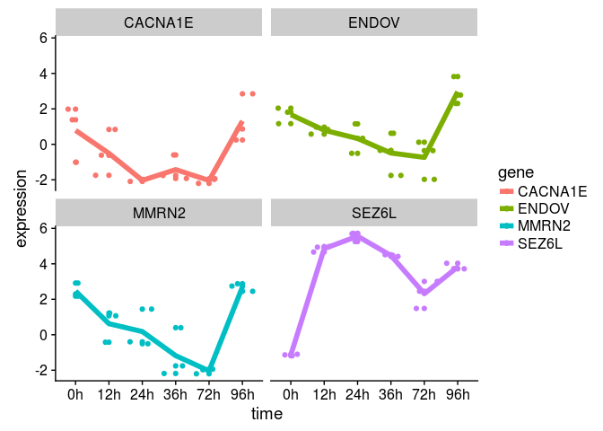
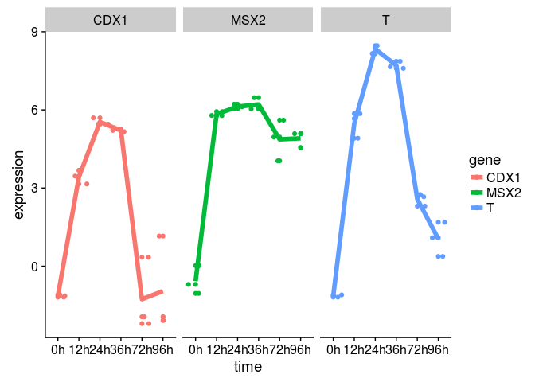
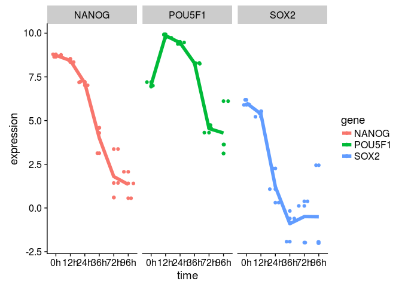
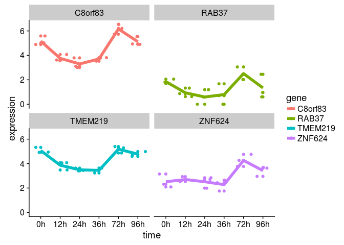
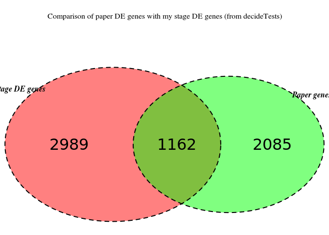
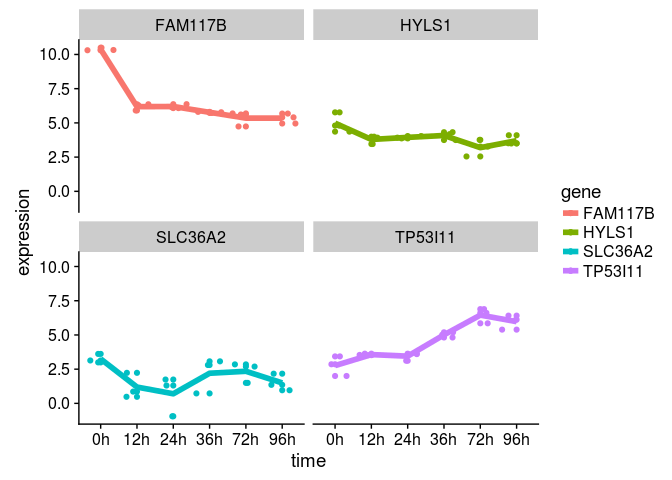

GSE75748 data analysis
================
German Novakovskiy
4 March 2018

Here we analyze gene expression data from [this paper](https://genomebiology.biomedcentral.com/articles/10.1186/s13059-016-1033-x). Some analysis steps are made according to [this workflow article](https://www.ncbi.nlm.nih.gov/pmc/articles/PMC4937821/).

``` r
library(knitr)
suppressWarnings(suppressMessages(library(tidyverse)))
suppressWarnings(suppressMessages(library(GEOquery)))
suppressWarnings(suppressMessages(library(data.table)))
suppressWarnings(suppressMessages(library(reshape2)))
suppressWarnings(suppressMessages(library(dplyr)))
suppressWarnings(suppressMessages(library(ggplot2)))
suppressWarnings(suppressMessages(library(cowplot)))
suppressWarnings(suppressMessages(library(limma)))
suppressWarnings(suppressMessages(library(tibble)))
suppressWarnings(suppressMessages(library(RColorBrewer)))
suppressWarnings(suppressMessages(library(edgeR)))
suppressWarnings(suppressMessages(library(readxl)))
suppressWarnings(suppressMessages(library(VennDiagram)))
```

Let's read our data into R (GSE75748):

``` r
if (file.exists("GSE75748.Rdata")) {
    # if previously downloaded
    load("GSE75748.Rdata")
} else {
    # Get geo object that contains our data and phenotype information
    geo_obj <- getGEO("GSE75748", GSEMatrix = TRUE)
    #geo_obj contains 1810 entries ((1018 + 758) single cells + (19 + 15) bulk RNA-seq)
    geo_obj <- geo_obj[[1]]
    save(geo_obj, file = "GSE75748.Rdata")
}
```

Further analysis of the downloaded data:

``` r
#show data structure
show(geo_obj)
```

    ## ExpressionSet (storageMode: lockedEnvironment)
    ## assayData: 0 features, 1810 samples 
    ##   element names: exprs 
    ## protocolData: none
    ## phenoData
    ##   sampleNames: GSM1964932 GSM1964933 ... GSM1966747 (1810 total)
    ##   varLabels: title geo_accession ... passage:ch1 (45 total)
    ##   varMetadata: labelDescription
    ## featureData: none
    ## experimentData: use 'experimentData(object)'
    ## Annotation: GPL16791

Let's load metadata:

``` r
geo_metadata <- pData(geo_obj)

#due to complexity of metadata table it's more convenient to create your own (see below)
```

assayData has 0 features, it's not possible to load expression data from this dataset. That's why we will use expression data downloaded directly from the website

``` r
#cell type
bulk_cell_type_ec <- read.csv("GSE75748_bulk_cell_type_ec.csv/GSE75748_bulk_cell_type_ec.csv", header=TRUE)
#time course
bulk_time_course_ec <- read.csv("GSE75748_bulk_time_course_ec.csv/GSE75748_bulk_time_course_ec.csv", header=TRUE)
```

Let's create metadata data frame:

``` r
sample_names <- colnames(bulk_time_course_ec[-1]) #without gene name
time_fact <- paste(c(12,24,36,72,96), sep="", 'h') #factors of time
time_fact <- rep(time_fact, each=3)

time_int <- rep(c(12,24,36,72,96), each=3) #time as continious variable

metadata <- data.frame(samples = sample_names, time = time_fact, age = time_int)

metadata %>% kable()
```

| samples       | time |  age|
|:--------------|:-----|----:|
| H9\_12h\_rep1 | 12h  |   12|
| H9\_12h\_rep2 | 12h  |   12|
| H9\_12h\_rep3 | 12h  |   12|
| H9\_24h\_rep1 | 24h  |   24|
| H9\_24h\_rep2 | 24h  |   24|
| H9\_24h\_rep3 | 24h  |   24|
| H9\_36h\_rep1 | 36h  |   36|
| H9\_36h\_rep2 | 36h  |   36|
| H9\_36h\_rep3 | 36h  |   36|
| H9\_72h\_rep1 | 72h  |   72|
| H9\_72h\_rep2 | 72h  |   72|
| H9\_72h\_rep3 | 72h  |   72|
| H9\_96h\_rep1 | 96h  |   96|
| H9\_96h\_rep2 | 96h  |   96|
| H9\_96h\_rep3 | 96h  |   96|

``` r
str(metadata)
```

    ## 'data.frame':    15 obs. of  3 variables:
    ##  $ samples: Factor w/ 15 levels "H9_12h_rep1",..: 1 2 3 4 5 6 7 8 9 10 ...
    ##  $ time   : Factor w/ 5 levels "12h","24h","36h",..: 1 1 1 2 2 2 3 3 3 4 ...
    ##  $ age    : num  12 12 12 24 24 24 36 36 36 72 ...

Our primary goal here is to analyze bulk\_time\_course data (each stage with the next stage, step-by-step).

Our data here is in gene expected counts that were calculated using RSEM 1.2.3 (according to GEO query). Thus, we first have to transform them to CPM (counts per million) using edgeR (and also perform a library size normalization):

``` r
#first let's create a edgeR DGElist object
bulk_time_course_ec <- as.matrix(bulk_time_course_ec)
rows <- bulk_time_course_ec[,1]
bulk_time_course_ec <- bulk_time_course_ec[,-1]
bulk_time_course_ec <- apply(bulk_time_course_ec, 2, as.double)
rownames(bulk_time_course_ec) <- rows

DGE_bulk_time_course_ec <- DGEList(counts = bulk_time_course_ec) 
normalized_factors_expression <- calcNormFactors(DGE_bulk_time_course_ec, method = "TMM") #calculation of scaling factors (for library size)

normalized_factors_expression$samples$norm.factors
```

    ##  [1] 1.0390140 1.0503689 1.0471506 1.0146746 1.0177200 1.0195859 0.9802117
    ##  [8] 0.9791931 0.9844451 0.9091888 0.9827987 0.9827599 0.9910700 1.0018154
    ## [15] 1.0088136

For this dataset the effect of TMM-normalisation is mild, as evident in the magnitude of the scaling factors, which are all relatively close to 1.

Now let's calculate the cpm values for this expression dataset (taking into consideration the calculated above factors)

``` r
cpm_bulk_time_course_expression <- cpm(normalized_factors_expression, log = FALSE)

head(cpm_bulk_time_course_expression) %>% kable()
```

|        |  H9\_12h\_rep1|  H9\_12h\_rep2|  H9\_12h\_rep3|  H9\_24h\_rep1|  H9\_24h\_rep2|  H9\_24h\_rep3|  H9\_36h\_rep1|  H9\_36h\_rep2|  H9\_36h\_rep3|  H9\_72h\_rep1|  H9\_72h\_rep2|  H9\_72h\_rep3|  H9\_96h\_rep1|  H9\_96h\_rep2|  H9\_96h\_rep3|
|--------|--------------:|--------------:|--------------:|--------------:|--------------:|--------------:|--------------:|--------------:|--------------:|--------------:|--------------:|--------------:|--------------:|--------------:|--------------:|
| A1BG   |      2.4918092|      0.5368073|      1.7982145|      2.0428472|       1.924645|      0.5195352|       1.614739|       2.419409|      0.8971319|      26.383980|       7.028642|     10.7367225|      5.8926452|      5.3799032|      3.0933946|
| A1CF   |      0.0000000|      0.7515303|      0.4450581|      0.0000000|       0.000000|      0.0000000|       0.000000|       0.000000|      0.0000000|       0.000000|       0.000000|      0.0000000|      0.0000000|      0.0000000|      0.0000000|
| A2LD1  |      0.0000000|      0.0000000|      0.4495536|      0.5107118|       0.000000|      1.0390705|       1.076492|       0.000000|      0.0000000|       1.055359|       2.342881|      1.6105084|      0.0000000|      0.5379903|      3.6089603|
| A2M    |      0.0000000|      0.0000000|      0.0000000|      0.0000000|       0.000000|      0.0000000|       0.000000|       0.000000|      0.0000000|       0.000000|       0.000000|      0.0000000|      1.4731613|      0.0000000|      0.0000000|
| A2ML1  |      0.6229523|      1.9754510|      0.1663348|      1.5832066|       2.405806|      0.0000000|       0.000000|       1.022200|      1.6686653|       0.000000|       0.000000|      0.6710452|      1.9249308|      0.5379903|      2.0622630|
| A4GALT |      1.2459046|      1.6104220|      0.8991072|      5.6178298|       5.773934|      2.5976762|       1.614739|       2.419409|      1.3456979|       0.000000|       1.405728|      0.0000000|      0.4910538|      0.0000000|      0.5155658|

Now let's do some sanity check: let's see how gene expression is distributed across different samples in different time points:

``` r
#change first column name to gene
cpm_df <- as.data.frame(cpm_bulk_time_course_expression)
cpm_df <- cpm_df %>%
  rownames_to_column("gene")

meltedBultTimeCourseEc <- melt(cpm_df, id='gene')

meltedBultTimeCourseEc %>%
  ggplot(aes(x = variable, y = value)) +
  geom_boxplot() + 
  theme(axis.text.x = element_text(angle = 90, hjust = 1))
```

 Let's look at density plots:

``` r
meltedBultTimeCourseEc %>% 
  ggplot(aes(x = value, color = variable)) +
  geom_density() +
  theme(axis.text.x = element_text(angle = 90, hjust = 1))
```


We can look at the variance and means across all samples to see, how bad is the situation:

``` r
#calculating variances of different samples
var_column <- apply(cpm_df[,-1], 2, var)

#calculating means of different samples
mean_column <- apply(cpm_df[,-1], 2, mean)

#creating a data frame
df <- data.frame(Samples = names(var_column), Variance = var_column, Mean = mean_column)
rownames(df) <- c()

head(df)
```

    ##       Samples Variance     Mean
    ## 1 H9_12h_rep1 31374.48 50.39802
    ## 2 H9_12h_rep2 28940.27 49.85320
    ## 3 H9_12h_rep3 30429.89 50.00641
    ## 4 H9_24h_rep1 32471.56 51.60694
    ## 5 H9_24h_rep2 32293.80 51.45251
    ## 6 H9_24h_rep3 32093.72 51.35834


We can see that variance and means are both not the same at all for different samples (especially for 72 hours samples). Let's look at distribution of values:

``` r
#removing gene column and transforming into matrix (for hist)
data <- as.matrix(cpm_df[,-1])

hist(data, main="GSE75748", xlim = c(0,1500), xlab = "Expression",
     ylab = "Frequency", breaks = 300)
```

 Let's try a log transformation here:

``` r
hist(log2(data + 0.25), main="GSE75748 - log2 transformed", xlab = "Expression",
     ylab = "Frequency")
```


All datasets will include a mix of genes that are expressed and those that are not expressed. Whilst it is of interest to examine genes that are expressed in one condition but not in another, some genes are unexpressed throughout all samples. Let's check how many genes have zero expression across all 15 samples (in time series data):

``` r
#changing the original data frame into log2
log_cpm_df <- cpm_df
log_cpm_df[,2 : ncol(cpm_df)] <- log2(log_cpm_df[,2:ncol(cpm_df)] + 1)

table(rowSums(log_cpm_df[,-1]==0)==15)
```

    ## 
    ## FALSE  TRUE 
    ## 16172  2925

We see that more than 18% of genes don't have any expression across all samples. Let's just delete them:

``` r
#let's delete those genes that have less than 3 samples without zero expression
keep.exprs <- rowSums(log_cpm_df[,-1] > 0) > 3
cleaned_log_cpm_df <- log_cpm_df[keep.exprs,]
```

The number of remained genes:

``` r
nrow(cleaned_log_cpm_df)
```

    ## [1] 14593

``` r
log_clean_data <- as.matrix(cleaned_log_cpm_df[,-1])

hist(log_clean_data, main="cleaned GSE75748 - log2 transformed", xlab = "Expression",
     ylab = "Frequency")
```

 Let's build boxplots and explore the data:

``` r
meltedLogedBultTimeCourseEc <- melt(cleaned_log_cpm_df, id='gene')

meltedLogedBultTimeCourseEc %>%
  ggplot(aes(x = variable, y = value)) +
  geom_boxplot() + 
  theme(axis.text.x = element_text(angle = 90, hjust = 1))
```


Looks much better now!

``` r
plotMDS(cleaned_log_cpm_df[,-1], cex=1.5)
```


It's clear that time ponts 12h, 24h and 36h are well separated from each other and 72h with 96h, however the last group (72 and 96) is clustered closer together, thus we don't expect to see much DE genes in these groups.

Let's now perform RNA-seq analysis with limma, using only time factor variable (time column in metadata) and let's look separately at DE gene at each stage (from 12 to 24, from 24 to 36 and etc.):

``` r
metadata_time <- metadata[,-3]
metadata_time %>% kable()
```

| samples       | time |
|:--------------|:-----|
| H9\_12h\_rep1 | 12h  |
| H9\_12h\_rep2 | 12h  |
| H9\_12h\_rep3 | 12h  |
| H9\_24h\_rep1 | 24h  |
| H9\_24h\_rep2 | 24h  |
| H9\_24h\_rep3 | 24h  |
| H9\_36h\_rep1 | 36h  |
| H9\_36h\_rep2 | 36h  |
| H9\_36h\_rep3 | 36h  |
| H9\_72h\_rep1 | 72h  |
| H9\_72h\_rep2 | 72h  |
| H9\_72h\_rep3 | 72h  |
| H9\_96h\_rep1 | 96h  |
| H9\_96h\_rep2 | 96h  |
| H9\_96h\_rep3 | 96h  |

``` r
designMatrix <- model.matrix(~0 + time, metadata_time)
head(designMatrix, 10) %>% kable()
```

|  time12h|  time24h|  time36h|  time72h|  time96h|
|--------:|--------:|--------:|--------:|--------:|
|        1|        0|        0|        0|        0|
|        1|        0|        0|        0|        0|
|        1|        0|        0|        0|        0|
|        0|        1|        0|        0|        0|
|        0|        1|        0|        0|        0|
|        0|        1|        0|        0|        0|
|        0|        0|        1|        0|        0|
|        0|        0|        1|        0|        0|
|        0|        0|        1|        0|        0|
|        0|        0|        0|        1|        0|

``` r
rownames(cleaned_log_cpm_df) <- cleaned_log_cpm_df$gene
cleaned_log_cpm_df <- cleaned_log_cpm_df[,-1]

# construct the contrast matrix
contrastMatrix <- makeContrasts(
  v24v12 = time24h - time12h,
  v36v24 = time36h - time24h,
  v72v36 = time72h - time36h,
  v96v72 = time96h - time72h,
  levels = designMatrix
)

contrastMatrix %>% kable()
```

|         |  v24v12|  v36v24|  v72v36|  v96v72|
|---------|-------:|-------:|-------:|-------:|
| time12h |      -1|       0|       0|       0|
| time24h |       1|      -1|       0|       0|
| time36h |       0|       1|      -1|       0|
| time72h |       0|       0|       1|      -1|
| time96h |       0|       0|       0|       1|

``` r
# keep the fit around as we will need to it for looking at other contrasts later 
time_course_Fit <- lmFit(cleaned_log_cpm_df, designMatrix)

# fit the contrast using the original fitted model
contrastFit <- contrasts.fit(time_course_Fit, contrastMatrix)

# apply eBayes() for moderated statistics
contrastFitEb <- eBayes(contrastFit)

contrastGenes <- topTable(contrastFitEb)

contrastGenes %>% kable()
```

|         |      v24v12|      v36v24|      v72v36|      v96v72|   AveExpr|         F|  P.Value|  adj.P.Val|
|---------|-----------:|-----------:|-----------:|-----------:|---------:|---------:|--------:|----------:|
| GRM4    |   1.1400007|  -2.4363158|  -4.1142524|   0.0000000|  3.215078|  885.5448|        0|          0|
| HTRA1   |  -0.7438591|  -0.2711237|   6.6456062|  -0.0029534|  5.437368|  681.7934|        0|          0|
| CRHBP   |  -0.4600122|   1.5381106|   6.9280273|   1.1196407|  4.400127|  591.7846|        0|          0|
| COLEC12 |   4.3368289|   2.1927176|   0.8764917|  -0.3848073|  6.404091|  587.1453|        0|          0|
| GYPE    |   0.3979911|  -0.1908956|   6.6485918|   0.2202076|  2.907334|  562.0698|        0|          0|
| RHOBTB3 |   1.3816226|   2.2069855|   2.7176436|   0.1314005|  8.679175|  448.4117|        0|          0|
| RSPO3   |   3.8981163|   2.1358603|   0.4757521|   0.0751312|  4.605336|  397.2745|        0|          0|
| STC1    |   0.8308211|   0.6043747|   4.4336414|   1.7403550|  4.718096|  397.2286|        0|          0|
| CYP26A1 |   1.9429306|   1.3556967|   4.0963478|   0.5445900|  7.075719|  396.3116|        0|          0|
| RSPO2   |  -0.1867722|  -0.1984095|   6.9000464|  -0.8453999|  2.707657|  386.5942|        0|          0|

``` r
cutoff <- 5e-02 #0.05 p value
#adjust method by default is BH (equivalent to fdr)
time_course_res <- decideTests(contrastFitEb, p.value = cutoff, lfc = 1)
summary(time_course_res)
```

    ##        v24v12 v36v24 v72v36 v96v72
    ## Down      137    294   1697    121
    ## NotSig  14208  13902  11032  14336
    ## Up        248    397   1864    136

We see there are different number of genes up and down regulated at each stage.

Here are the genes that upregulated from 24 hours to 36 hours.

``` r
hits2 <- time_course_res %>% 
  as.data.frame() %>% 
  rownames_to_column("gene") %>% 
  filter(v36v24 > 0)

head(hits2) %>% kable()
```

| gene   |  v24v12|  v36v24|  v72v36|  v96v72|
|:-------|-------:|-------:|-------:|-------:|
| ABHD6  |       1|       1|      -1|       0|
| ABLIM1 |       0|       1|      -1|       0|
| ABTB2  |       0|       1|       0|       0|
| ACSS3  |       1|       1|       0|       0|
| ACVRL1 |       0|       1|       1|       0|
| ADAM12 |       0|       1|       0|       1|

``` r
#function for plotting genes
plotGenes <- function(genes, expressionMatrix, metadata) {
  
  expressionDataForGenes <- expressionMatrix %>%
    rownames_to_column("gene") %>%
    filter(gene %in% genes) %>%
    melt()
  
  colnames(expressionDataForGenes) <- c("gene", "samples", "expression")
  expressionDataForGenes <- expressionDataForGenes %>%
    left_join(metadata, id="time")
  
  expressionDataForGenes %>% 
    ggplot(aes(x = time, y = expression, color=gene)) +
    geom_point() +
    geom_jitter() +
    stat_summary(aes(y = expression, group=1), fun.y = "mean", geom="line", size=2) +
    facet_wrap(~gene)
}
```

Let's plot 4 random genes that are upregulated at each stage.

``` r
#stage 24v12
hits1 <- time_course_res %>% 
  as.data.frame() %>% 
  rownames_to_column("gene") %>% 
  filter(v24v12 > 0)

#stage 72v36
hits3 <- time_course_res %>% 
  as.data.frame() %>% 
  rownames_to_column("gene") %>% 
  filter(v72v36 > 0)

#stage 96v72
hits4 <- time_course_res %>% 
  as.data.frame() %>% 
  rownames_to_column("gene") %>% 
  filter(v96v72 > 0)
```

``` r
sample_genes_24v12 <- sample(hits1$gene,4)
plotGenes(sample_genes_24v12, cleaned_log_cpm_df, metadata)
```

    ## Using gene as id variables

    ## Joining, by = "samples"



``` r
sample_genes_36v24 <- sample(hits2$gene,4)
plotGenes(sample_genes_36v24, cleaned_log_cpm_df, metadata)
```

    ## Using gene as id variables

    ## Joining, by = "samples"



``` r
sample_genes_72v36 <- sample(hits3$gene,4)
plotGenes(sample_genes_72v36, cleaned_log_cpm_df, metadata)
```

    ## Using gene as id variables

    ## Joining, by = "samples"


``` r
sample_genes_96v72 <- sample(hits4$gene,4)
plotGenes(sample_genes_96v72, cleaned_log_cpm_df, metadata)
```

    ## Using gene as id variables

    ## Joining, by = "samples"



let's build those genes that according to the paper are DE in 24v12 transition:

``` r
sample_genes <- c("T", "CDX1", "MSX2")
plotGenes(sample_genes, cleaned_log_cpm_df, metadata)
```

    ## Using gene as id variables

    ## Joining, by = "samples"


COMMENTS
--------

-   paper reports that CDX1, MSX2 and T are over expressed from 12 to 24h transition. I see only T and CDX1 (p-value cutoff 5e-02, FDR)
-   paper reports that CER1 and GATA4 are over expressed from 24 to 36h transition.I see both (p-value cutoff 5e-02, FDR)
-   paper reports that DKK4 and MYCT1 are over expressed from 36 to 72. I see both (p-value cutoff 5e-02, FDR)

Let's look at the expression of these genes EOMES, CER1, GATA4, PRDM1, and POU2AF1 at 96h because they are expected to be highly expressed during 96h stage, according to the paper (and KLF8 - "KLF8 may play a specific role during the transition from mesendoderm toward DE cells"):

``` r
sample_genes <- c("EOMES", "CER1", "GATA4", "PRDM1", "POU2AF1", "KLF8")
plotGenes(sample_genes, cleaned_log_cpm_df, metadata)
```

    ## Using gene as id variables

    ## Joining, by = "samples"

 Let's look at the expression of pluripotency genes POU5F1, NANOG, and SOX2:

``` r
sample_genes <- c("POU5F1", "NANOG", "SOX2")
plotGenes(sample_genes, cleaned_log_cpm_df, metadata)
```

    ## Using gene as id variables

    ## Joining, by = "samples"

 Their expression is going down, just as expected.

Now let's look at key DE markers CXCR4, SOX17, HNF1B, KIT, and KRT19:

``` r
#sample_genes <- c("FOXA2")
sample_genes <- c("CXCR4", "SOX17", "HNF1B", "KIT", "KRT19")
plotGenes(sample_genes, cleaned_log_cpm_df, metadata)
```

    ## Using gene as id variables

    ## Joining, by = "samples"

 It's clear that CXCR4, SOX17 and KIT are upregulated at 96h, expression of KRT19 and HNF1B did not change so much, but KRT19 remained highly expressed, while HNF1B remained to be down-regulated.

Comparisons with the paper
==========================

"A total of 3247 differentially expressed genes were identified in the scRNA-seq time course experiment listed in Additional file 4: Table S3."

In my work I found this number of DE genes:

``` r
#list all DE genes
allDEGenes <- topTable(contrastFitEb, number = Inf, p.value = 0.05, lfc = 1)
nrow(allDEGenes)
```

    ## [1] 4601

According to Decide tests we have this number of DE genes (at different time stages):

``` r
de_genes_rows <- apply(time_course_res, 1, function(x) any(x != 0))
de_genes_at_stages <- time_course_res[de_genes_rows,]
nrow(de_genes_at_stages)
```

    ## [1] 4151

We will check both numbers.

``` r
all_de_genes <- rownames(allDEGenes)
stages_de_genes <- rownames(de_genes_at_stages)
```

Get list of DE genes from the study:

``` r
paper_de_genes <- read_excel("13059_2016_1033_MOESM4_ESM.xlsx")
head(paper_de_genes) %>% kable()
```

| GeneID | most likely pattern |  PP pattern|
|:-------|:--------------------|-----------:|
| A2ML1  | Down-NC-NC-NC-NC    |   0.2976393|
| AAK1   | Down-NC-Up-NC-NC    |   0.4062348|
| AARS   | Down-NC-NC-NC-NC    |   0.4685744|
| AARS2  | Down-Up-NC-NC-NC    |   0.2714841|
| AASS   | Down-NC-Up-NC-NC    |   0.5190453|
| AATF   | NC-NC-Up-NC-NC      |   0.3152373|

``` r
paper_de_genes <- paper_de_genes$GeneID
length(paper_de_genes)
```

    ## [1] 3247

So there is in fact 3247 genes in the result of this study.

Comparison of DE genes from decideTest with DE genes from the paper:

Comparison of DE genes from topTable with DE genes from the paper:

``` r
temp <- venn.diagram(list(My_TopTable = all_de_genes, Paper_genes = paper_de_genes),fill = c("red", "green"), alpha = c(0.5, 0.5), cex = 2, cat.fontface = 4, lty =2, fontfamily =3, filename = NULL, main = "Comparison of paper DE genes with my all DE genes (from TopTable)", category.names = c("My topTable", "Paper genes"))

grid::grid.newpage()
grid::grid.draw(temp)
```


``` r
temp2 <- venn.diagram(list(My_TopTable = stages_de_genes, Paper_genes = paper_de_genes),fill = c("red", "green"), alpha = c(0.5, 0.5), cex = 2, cat.fontface = 4, lty =2, fontfamily =3, filename = NULL, main = "Comparison of paper DE genes with my stage DE genes (from decideTests)", category.names = c("Stage DE genes", "Paper genes"))

grid::grid.newpage()
grid::grid.draw(temp2)
```



Using age as continious
=======================

``` r
metadata_cont_time <- metadata[,-2]
metadata_cont_time %>% kable()
```

| samples       |  age|
|:--------------|----:|
| H9\_12h\_rep1 |   12|
| H9\_12h\_rep2 |   12|
| H9\_12h\_rep3 |   12|
| H9\_24h\_rep1 |   24|
| H9\_24h\_rep2 |   24|
| H9\_24h\_rep3 |   24|
| H9\_36h\_rep1 |   36|
| H9\_36h\_rep2 |   36|
| H9\_36h\_rep3 |   36|
| H9\_72h\_rep1 |   72|
| H9\_72h\_rep2 |   72|
| H9\_72h\_rep3 |   72|
| H9\_96h\_rep1 |   96|
| H9\_96h\_rep2 |   96|
| H9\_96h\_rep3 |   96|

``` r
designMatrix <- model.matrix(~0 + age, metadata_cont_time)
head(designMatrix, 10) %>% kable()
```

|  age|
|----:|
|   12|
|   12|
|   12|
|   24|
|   24|
|   24|
|   36|
|   36|
|   36|
|   72|

``` r
expressionFit_age <- lmFit(cleaned_log_cpm_df, designMatrix)
expressionFitBayes_age <- eBayes(expressionFit_age)

topGenesAge <- topTable(expressionFitBayes_age, number = Inf, p.value = 0.05)
nrow(topGenesAge)
```

    ## [1] 12936

``` r
head(topGenesAge) %>% kable()
```

|        |      logFC|   AveExpr|         t|  P.Value|  adj.P.Val|         B|
|--------|----------:|---------:|---------:|--------:|----------:|---------:|
| STC1   |  0.0975435|  4.718096|  29.93289|        0|          0|  25.35145|
| FGF17  |  0.0881559|  4.319202|  20.42987|        0|          0|  19.95752|
| ERBB4  |  0.1187449|  5.551878|  20.42332|        0|          0|  19.95280|
| COL6A3 |  0.0750285|  3.680885|  20.20303|        0|          0|  19.79337|
| ITGA4  |  0.0814500|  4.065051|  18.79581|        0|          0|  18.72657|
| TDRD7  |  0.0875289|  4.124570|  18.73015|        0|          0|  18.67465|

``` r
sample_genes <- rownames(topGenesAge)[1:6]
plotGenes(sample_genes, cleaned_log_cpm_df, metadata)
```

    ## Using gene as id variables

    ## Joining, by = "samples"


``` r
temp <- venn.diagram(list(My_TopTable = rownames(topGenesAge), Paper_genes = paper_de_genes),fill = c("red", "green"), alpha = c(0.5, 0.5), cex = 2, cat.fontface = 4, lty =2, fontfamily =3, filename = NULL, main = "Comparison of paper DE genes with my all DE genes (from TopTable)", category.names = c("My topTable", "Paper genes"))

grid::grid.newpage()
grid::grid.draw(temp)
```

 \# Finding discrepancies

``` r
paper_de_genes <- read_excel("13059_2016_1033_MOESM4_ESM.xlsx")
foo <- data.frame(do.call('rbind', strsplit(as.character(paper_de_genes$`most likely pattern`),'-',fixed=TRUE)))
df <- data.frame(Gene = paper_de_genes$GeneID)
dfx <- cbind(df, foo)
paper_de_genes <- dfx
colnames(paper_de_genes) <- c("Gene", "12v0", "24v12", "36v24", "72v36", "96v72")
head(paper_de_genes) %>% kable()
```

| Gene  | 12v0 | 24v12 | 36v24 | 72v36 | 96v72 |
|:------|:-----|:------|:------|:------|:------|
| A2ML1 | Down | NC    | NC    | NC    | NC    |
| AAK1  | Down | NC    | Up    | NC    | NC    |
| AARS  | Down | NC    | NC    | NC    | NC    |
| AARS2 | Down | Up    | NC    | NC    | NC    |
| AASS  | Down | NC    | Up    | NC    | NC    |
| AATF  | NC   | NC    | Up    | NC    | NC    |

``` r
#deleting column 12v0, because I didn't  have that comparison
paper_de_genes <- paper_de_genes[,-2]

paper_de_genes <- paper_de_genes %>%
  filter(`24v12` != "NC" | `36v24` != "NC" | `72v36` != "NC" | `96v72` != "NC")
dim(paper_de_genes)
```

    ## [1] 2149    5

``` r
temp2 <- venn.diagram(list(My_TopTable = stages_de_genes, Paper_genes = paper_de_genes$Gene),fill = c("red", "green"), alpha = c(0.5, 0.5), cex = 2, cat.fontface = 4, lty =2, fontfamily =3, filename = NULL, main = "Comparison of paper DE genes with my stage DE genes (from decideTests)", category.names = c("Stage DE genes", "Paper genes"))

grid::grid.newpage()
grid::grid.draw(temp2)
```


``` r
#reminder
summary(time_course_res)
```

    ##        v24v12 v36v24 v72v36 v96v72
    ## Down      137    294   1697    121
    ## NotSig  14208  13902  11032  14336
    ## Up        248    397   1864    136

``` r
paper_res <- list(`24v12` = table(paper_de_genes$`24v12`), `36v24` = table(paper_de_genes$`36v24`),
                  `72v36` = table(paper_de_genes$`72v36`), `96v72` = table(paper_de_genes$`96v72`))

paper_res
```

    ## $`24v12`
    ## 
    ## Down   NC   Up 
    ##   53 1319  777 
    ## 
    ## $`36v24`
    ## 
    ## Down   NC   Up 
    ##  328  832  989 
    ## 
    ## $`72v36`
    ## 
    ## Down   NC   Up 
    ##  235 1683  231 
    ## 
    ## $`96v72`
    ## 
    ## Down   NC   Up 
    ##   10 2138    1

``` r
#hits at 36v24
head(hits2) %>% kable()
```

| gene   |  v24v12|  v36v24|  v72v36|  v96v72|
|:-------|-------:|-------:|-------:|-------:|
| ABHD6  |       1|       1|      -1|       0|
| ABLIM1 |       0|       1|      -1|       0|
| ABTB2  |       0|       1|       0|       0|
| ACSS3  |       1|       1|       0|       0|
| ACVRL1 |       0|       1|       1|       0|
| ADAM12 |       0|       1|       0|       1|

``` r
paper_up_36v24 <- paper_de_genes %>%
  filter(`36v24` == "Up")
nrow(paper_up_36v24)
```

    ## [1] 989

``` r
#in paper but not in my research
s <- setdiff(paper_up_36v24$Gene, hits2$gene)
length(s)
```

    ## [1] 808

``` r
#plot genes that are DE in paper at 36 to 24 but not in my results
set.seed(123)
sample_genes <- sample(s, 4)
plotGenes(sample_genes, cleaned_log_cpm_df, metadata)
```

    ## Using gene as id variables

    ## Joining, by = "samples"


