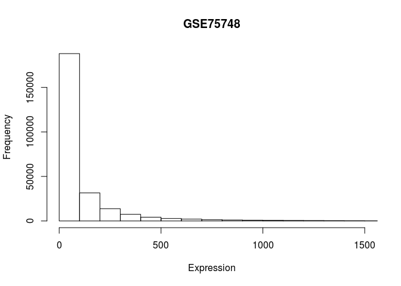
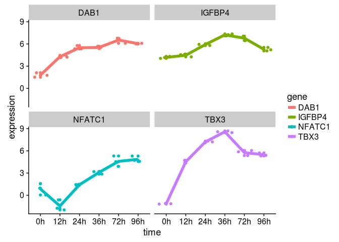
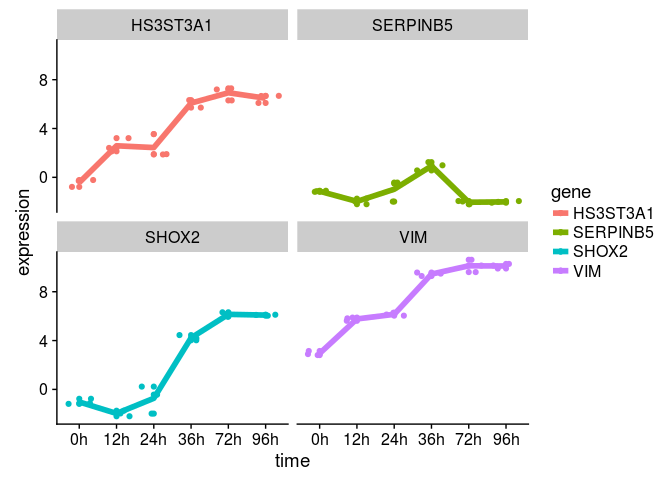
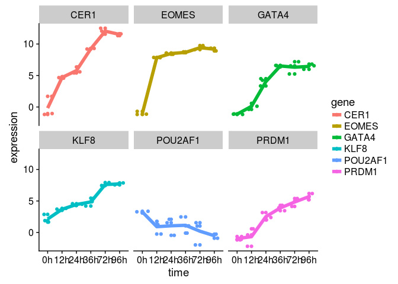

GSE75748 data analysis
================
German Novakovskiy
4 March 2018

Here we analyze gene expression data from [this paper](https://genomebiology.biomedcentral.com/articles/10.1186/s13059-016-1033-x). Some analysis steps are made according to [this workflow article](https://www.ncbi.nlm.nih.gov/pmc/articles/PMC4937821/).

``` r
library(knitr)
#suppressWarnings(suppressMessages(library(tidyverse)))
suppressWarnings(suppressMessages(library(GEOquery)))
suppressWarnings(suppressMessages(library(data.table)))
suppressWarnings(suppressMessages(library(reshape2)))
suppressWarnings(suppressMessages(library(dplyr)))
suppressWarnings(suppressMessages(library(ggplot2)))
suppressWarnings(suppressMessages(library(cowplot)))
suppressWarnings(suppressMessages(library(limma)))
suppressWarnings(suppressMessages(library(tibble)))
suppressWarnings(suppressMessages(library(RColorBrewer)))
```

Let's read our data into R (GSE75748):

``` r
if (file.exists("GSE75748.Rdata")) {
    # if previously downloaded
    load("GSE75748.Rdata")
} else {
    # Get geo object that contains our data and phenotype information
    geo_obj <- getGEO("GSE75748", GSEMatrix = TRUE)
    #geo_obj contains 1810 entries ((1018 + 758) single cells + (19 + 15) bulk RNA-seq)
    geo_obj <- geo_obj[[1]]
    save(geo_obj, file = "GSE75748.Rdata")
}
```

Further analysis of the downloaded data:

``` r
#show data structure
show(geo_obj)
```

    ## ExpressionSet (storageMode: lockedEnvironment)
    ## assayData: 0 features, 1810 samples 
    ##   element names: exprs 
    ## protocolData: none
    ## phenoData
    ##   sampleNames: GSM1964932 GSM1964933 ... GSM1966747 (1810 total)
    ##   varLabels: title geo_accession ... passage:ch1 (45 total)
    ##   varMetadata: labelDescription
    ## featureData: none
    ## experimentData: use 'experimentData(object)'
    ## Annotation: GPL16791

Let's load metadata:

``` r
geo_metadata <- pData(geo_obj)

#due to complexity of metadata table it's more convenient to create your own (see below)
```

assayData has 0 features, it's not possible to load expression data from this dataset. That's why we will use expression data downloaded directly from the website

``` r
#cell type
bulk_cell_type_ec <- read.csv("GSE75748_bulk_cell_type_ec.csv/GSE75748_bulk_cell_type_ec.csv", header=TRUE)
#time course
bulk_time_course_ec <- read.csv("GSE75748_bulk_time_course_ec.csv/GSE75748_bulk_time_course_ec.csv", header=TRUE)
```

Let's create metadata data frame:

``` r
sample_names <- colnames(bulk_time_course_ec[-1]) #without gene name
time_fact <- paste(c(12,24,36,72,96), sep="", 'h') #factors of time
time_fact <- rep(time_fact, each=3)

time_int <- rep(c(12,24,36,72,96), each=3) #time as continious variable

metadata <- data.frame(samples = sample_names, time = time_fact, age = time_int)

metadata
```

    ##        samples time age
    ## 1  H9_12h_rep1  12h  12
    ## 2  H9_12h_rep2  12h  12
    ## 3  H9_12h_rep3  12h  12
    ## 4  H9_24h_rep1  24h  24
    ## 5  H9_24h_rep2  24h  24
    ## 6  H9_24h_rep3  24h  24
    ## 7  H9_36h_rep1  36h  36
    ## 8  H9_36h_rep2  36h  36
    ## 9  H9_36h_rep3  36h  36
    ## 10 H9_72h_rep1  72h  72
    ## 11 H9_72h_rep2  72h  72
    ## 12 H9_72h_rep3  72h  72
    ## 13 H9_96h_rep1  96h  96
    ## 14 H9_96h_rep2  96h  96
    ## 15 H9_96h_rep3  96h  96

``` r
str(metadata)
```

    ## 'data.frame':    15 obs. of  3 variables:
    ##  $ samples: Factor w/ 15 levels "H9_12h_rep1",..: 1 2 3 4 5 6 7 8 9 10 ...
    ##  $ time   : Factor w/ 5 levels "12h","24h","36h",..: 1 1 1 2 2 2 3 3 3 4 ...
    ##  $ age    : num  12 12 12 24 24 24 36 36 36 72 ...

Our primary goal here is to analyze bulk\_time\_course data (each stage with the next stage, step-by-step).

Now let's do some sanity check: let's see how gene expression is distributed across different samples in different time points:

``` r
#change first column name to gene
colnames(bulk_time_course_ec)[1] <- "gene"
meltedBultTimeCourseEc <- melt(bulk_time_course_ec, id='gene')

meltedBultTimeCourseEc %>%
  ggplot(aes(x = variable, y = value)) +
  geom_boxplot() + 
  theme(axis.text.x = element_text(angle = 90, hjust = 1))
```

 Let's look at density plots:

``` r
meltedBultTimeCourseEc %>% 
  ggplot(aes(x = value, color = variable)) +
  geom_density() +
  theme(axis.text.x = element_text(angle = 90, hjust = 1))
```


We can look at the variance and means across all samples to see, how bad is the situation:

``` r
#calculating variances of different samples
var_column <- apply(bulk_time_course_ec[,-1], 2, var)

#calculating means of different samples
mean_column <- apply(bulk_time_course_ec[,-1], 2, mean)

#creating a data frame
df <- data.frame(Samples = names(var_column), Variance = var_column, Mean = mean_column)
rownames(df) <- c()

head(df)
```

    ##       Samples  Variance      Mean
    ## 1 H9_12h_rep1  80847.57  80.90189
    ## 2 H9_12h_rep2 100430.51  92.86981
    ## 3 H9_12h_rep3 150569.62 111.23571
    ## 4 H9_24h_rep1 124494.85 101.04904
    ## 5 H9_24h_rep2 139488.38 106.93405
    ## 6 H9_24h_rep3 118902.23  98.85440


We can see that variance and means are both not the same at all for different samples (even the same replicates). Let's look at H9\_12\_rep1 distribution of values:

``` r
#removing gene column and transforming into matrix (for hist)
data <- as.matrix(bulk_time_course_ec[,-1])

hist(data, main="GSE75748", xlim = c(0,1500), xlab = "Expression",
     ylab = "Frequency", breaks = 300)
```


Let's try a log transformation here:

``` r
hist(log2(data + 1), main="GSE75748 - log2 transformed", xlab = "Expression",
     ylab = "Frequency")
```



All datasets will include a mix of genes that are expressed and those that are not expressed. Whilst it is of interest to examine genes that are expressed in one condition but not in another, some genes are unexpressed throughout all samples. Let's check how many genes have zero expression across all 15 samples (in time series data):

``` r
#changing the original data frame into log2
loged_bulk_time_course_ec <- bulk_time_course_ec
loged_bulk_time_course_ec[,2:dim(bulk_time_course_ec)[2]] <- log2(loged_bulk_time_course_ec[,
                                                                                        2:dim(bulk_time_course_ec)[2]]
                                                                  + 1)

table(rowSums(loged_bulk_time_course_ec[,-1]==0)==15)
```

    ## 
    ## FALSE  TRUE 
    ## 16172  2925

We see that more than 15% of genes don't have any expression across all samples. Let's just delete them:

``` r
#let's delete those genes that have less than 3 samples without zero expression
keep.exprs <- rowSums(loged_bulk_time_course_ec[,-1] > 0) > 3
cleaned_log_bulk_time_course_ec <- loged_bulk_time_course_ec[keep.exprs,]
```

``` r
log_clean_data <- as.matrix(cleaned_log_bulk_time_course_ec[,-1])

hist(log_clean_data, main="cleaned GSE75748 - log2 transformed", xlab = "Expression",
     ylab = "Frequency")
```

 Let's build boxplots and explore the data:

``` r
meltedLogedBultTimeCourseEc <- melt(cleaned_log_bulk_time_course_ec, id='gene')

meltedLogedBultTimeCourseEc %>%
  ggplot(aes(x = variable, y = value)) +
  geom_boxplot() + 
  theme(axis.text.x = element_text(angle = 90, hjust = 1))
```


Looks much better now!

``` r
plotMDS(cleaned_log_bulk_time_course_ec[,-1], cex=1.5)
```

 It's clear that time ponts 12h, 24h and 36h are clearly separated from each other and 72h with 96h, however the last group is clustered closer together, thus we don't expect to see much DE genes in these groups.

Let's now perform RNA-seq analysis with limma, using only time factor variable (time column in metadata) and let's look separately at DE gene at each stage (from 12 to 24, from 24 to 36 and etc.):

``` r
metadata_time <- metadata[,-3]
metadata_time
```

    ##        samples time
    ## 1  H9_12h_rep1  12h
    ## 2  H9_12h_rep2  12h
    ## 3  H9_12h_rep3  12h
    ## 4  H9_24h_rep1  24h
    ## 5  H9_24h_rep2  24h
    ## 6  H9_24h_rep3  24h
    ## 7  H9_36h_rep1  36h
    ## 8  H9_36h_rep2  36h
    ## 9  H9_36h_rep3  36h
    ## 10 H9_72h_rep1  72h
    ## 11 H9_72h_rep2  72h
    ## 12 H9_72h_rep3  72h
    ## 13 H9_96h_rep1  96h
    ## 14 H9_96h_rep2  96h
    ## 15 H9_96h_rep3  96h

``` r
designMatrix <- model.matrix(~0 + time, metadata_time)
head(designMatrix, 10) %>% kable()
```

|  time12h|  time24h|  time36h|  time72h|  time96h|
|--------:|--------:|--------:|--------:|--------:|
|        1|        0|        0|        0|        0|
|        1|        0|        0|        0|        0|
|        1|        0|        0|        0|        0|
|        0|        1|        0|        0|        0|
|        0|        1|        0|        0|        0|
|        0|        1|        0|        0|        0|
|        0|        0|        1|        0|        0|
|        0|        0|        1|        0|        0|
|        0|        0|        1|        0|        0|
|        0|        0|        0|        1|        0|

``` r
rownames(cleaned_log_bulk_time_course_ec) <- cleaned_log_bulk_time_course_ec$gene
cleaned_log_bulk_time_course_ec <- cleaned_log_bulk_time_course_ec[,-1]

# construct the contrast matrix
contrastMatrix <- makeContrasts(
  v24v12 = time24h - time12h,
  v36v24 = time36h - time24h,
  v72v36 = time72h - time36h,
  v96v72 = time96h - time72h,
  levels = designMatrix
)

contrastMatrix
```

    ##          Contrasts
    ## Levels    v24v12 v36v24 v72v36 v96v72
    ##   time12h     -1      0      0      0
    ##   time24h      1     -1      0      0
    ##   time36h      0      1     -1      0
    ##   time72h      0      0      1     -1
    ##   time96h      0      0      0      1

``` r
# keep the fit around as we will need to it for looking at other contrasts later 
time_course_Fit <- lmFit(cleaned_log_bulk_time_course_ec, designMatrix)

# fit the contrast using the original fitted model
contrastFit <- contrasts.fit(time_course_Fit, contrastMatrix)

# apply eBayes() for moderated statistics
contrastFitEb <- eBayes(contrastFit)

contrastGenes <- topTable(contrastFitEb)

contrastGenes
```

    ##             v24v12     v36v24     v72v36       v96v72  AveExpr        F
    ## HTRA1   -0.7150168 -0.3521945  6.8160661 -0.015343569 6.329167 560.1764
    ## GRM4     1.2266305 -2.5328551 -4.9998826  0.000000000 3.767746 544.2499
    ## GYPE     0.6642561 -0.3309228  7.4872985  0.208751954 3.369521 360.9355
    ## CRHBP   -0.6666667  1.9924266  7.1667234  1.108108072 5.083767 349.5612
    ## RSPO3    4.8388129  2.1098879  0.5243886  0.063111580 5.359361 336.3750
    ## CYP26A1  2.0921258  1.3067258  4.1506019  0.532368673 8.001049 333.2739
    ## COLEC12  4.6889206  2.1393391  0.9236546 -0.397683638 7.293629 330.6168
    ## RHOBTB3  1.4719864  2.1485803  2.7649075  0.119027239 9.624495 327.2605
    ## C7orf58  0.0000000  0.0000000  4.3764277  1.351554152 2.020882 310.4727
    ## NRP1     2.7980947  4.3072037 -0.1928370  0.001813844 6.607680 291.0786
    ##              P.Value    adj.P.Val
    ## HTRA1   2.032330e-14 1.786790e-10
    ## GRM4    2.448832e-14 1.786790e-10
    ## GYPE    3.466564e-13 1.187902e-09
    ## CRHBP   4.260429e-13 1.187902e-09
    ## RSPO3   5.457003e-13 1.187902e-09
    ## CYP26A1 5.792177e-13 1.187902e-09
    ## COLEC12 6.098356e-13 1.187902e-09
    ## RHOBTB3 6.512174e-13 1.187902e-09
    ## C7orf58 9.137582e-13 1.481608e-09
    ## NRP1    1.383223e-12 2.018537e-09

``` r
cutoff <- 1e-03
time_course_res <- decideTests(contrastFitEb, p.value = cutoff, method = "global")
summary(time_course_res)
```

    ##        v24v12 v36v24 v72v36 v96v72
    ## Down       11     28    172     11
    ## NotSig  14500  14468  14005  14561
    ## Up         82     97    416     21

We see there are different number of genes up and down regulated at each stage.

Here are the 34 genes that upregulated from 24 hours to 36 hours.

``` r
hits2 <- time_course_res %>% 
  as.data.frame() %>% 
  rownames_to_column("gene") %>% 
  filter(v36v24 > 0)

hits2
```

    ##        gene v24v12 v36v24 v72v36 v96v72
    ## 1     ABHD6      0      1      0      0
    ## 2   ADAMTS9      0      1      0      0
    ## 3     ALPK2      0      1      0      0
    ## 4    ANGPT2      0      1      1      0
    ## 5   ANKRD55      0      1      0      0
    ## 6    ANTXR2      0      1      0      0
    ## 7     ANXA1      0      1      0      0
    ## 8     APLNR      1      1      0      0
    ## 9  APOBEC3G      1      1      1      0
    ## 10 ARHGAP31      0      1      0      0
    ## 11    ARL4D      0      1      0      0
    ## 12     BMP4      0      1      0      0
    ## 13    CDH11      0      1      0      0
    ## 14     CER1      0      1      1      0
    ## 15    CGNL1      0      1      0      0
    ## 16   CLDN11      1      1      0      0
    ## 17    CNGA3      0      1     -1      0
    ## 18   COL5A1      1      1      0      0
    ## 19  COLEC12      1      1      0      0
    ## 20     DLL3      0      1      0      0
    ## 21   EGFLAM      0      1      0      0
    ## 22   ELOVL2      0      1      1      0
    ## 23  EMILIN2      0      1     -1      0
    ## 24     ENC1      1      1      0      0
    ## 25    ERBB4      0      1      1      0
    ## 26   FAM89A      0      1      0      0
    ## 27     FLI1      0      1      0      0
    ## 28     FLT1      0      1      1      0
    ## 29     FMOD      0      1      0      0
    ## 30    FOXC1      0      1      0      0
    ## 31    FREM1      0      1      1      0
    ## 32     FSHR      0      1      0      0
    ## 33    GPR55      0      1      0      0
    ## 34    GRAP2      0      1      0      0
    ## 35      GRP      0      1      0      0
    ## 36    HAND1      1      1      0      0
    ## 37   HAPLN1      0      1      1      0
    ## 38     HAS2      0      1      0      0
    ## 39    HOXB2      0      1      0      0
    ## 40    HOXB3      0      1      0      0
    ## 41    HOXB6      0      1      0      0
    ## 42 HS3ST3A1      0      1      0      0
    ## 43    IFI16      0      1      0      0
    ## 44     IRX3      0      1      0      0
    ## 45    ITGA1      0      1      0      0
    ## 46    ITGA9      0      1      0      0
    ## 47 KIAA1462      0      1      0      0
    ## 48     LGR5      0      1      0      0
    ## 49     LHX1      1      1      0      0
    ## 50     LIFR      0      1      0      0
    ## 51     LIPG      0      1      0      0
    ## 52     LIX1      0      1     -1      0
    ## 53     LMO2      0      1      0      0
    ## 54    LRRC2      0      1      0      0
    ## 55    LZTS1      1      1      0      0
    ## 56    MEIS1      0      1      0      0
    ## 57     MID1      0      1      0      0
    ## 58    NCAM1      0      1      0      0
    ## 59     NRP1      1      1      0      0
    ## 60    OLFM1      0      1      0      0
    ## 61     PAG1      0      1      0      0
    ## 62   PCDH19      0      1     -1      0
    ## 63   PDGFRA      0      1      0      0
    ## 64    PELI2      0      1      0      0
    ## 65     PLAU      0      1      1     -1
    ## 66     PLK2      0      1      0      0
    ## 67   PLXNA2      0      1      0      0
    ## 68    PMP22      0      1      0      0
    ## 69 PPAPDC1A      0      1      0      0
    ## 70 PRICKLE1      0      1     -1      0
    ## 71     PRTG      1      1      0      0
    ## 72  RASGRP3      0      1      0      0
    ## 73   RBFOX1      0      1      0      0
    ## 74    RBM24      1      1      0      0
    ## 75    RCSD1      0      1      0      0
    ## 76  RHOBTB3      0      1      1      0
    ## 77    RSPO3      1      1      0      0
    ## 78     RXRG      0      1      0      0
    ## 79   SEMA5A      0      1      0      0
    ## 80   SHISA6      0      1      0      0
    ## 81    SHOX2      0      1      0      0
    ## 82     SNCB      0      1     -1      0
    ## 83   SPHKAP      0      1     -1      0
    ## 84  ST8SIA1      0      1      1      0
    ## 85    STAB2      0      1      0      0
    ## 86    SULF1      0      1      0      0
    ## 87   TAGLN3      0      1      0      0
    ## 88     TBX6      0      1     -1      0
    ## 89   THSD7A      0      1      0      0
    ## 90   TMEM51      0      1      0      0
    ## 91    TMOD1      0      1      1      0
    ## 92    UNC5C      0      1      0      0
    ## 93      VIM      0      1      0      0
    ## 94    WNT5A      1      1     -1      0
    ## 95     ZEB1      0      1      0      0
    ## 96     ZEB2      0      1      0      0
    ## 97     ZIC3      0      1      0      0

``` r
#function for plotting genes
plotGenes <- function(genes, expressionMatrix, metadata) {
  
  expressionDataForGenes <- expressionMatrix %>%
    rownames_to_column("gene") %>%
    filter(gene %in% genes) %>%
    melt()
  
  colnames(expressionDataForGenes) <- c("gene", "samples", "expression")
  expressionDataForGenes <- expressionDataForGenes %>%
    left_join(metadata, id="time")
  
  expressionDataForGenes %>% 
    ggplot(aes(x = time, y = expression, color=gene)) +
    geom_point() +
    geom_jitter() +
    stat_summary(aes(y = expression, group=1), fun.y = "mean", geom="line", size=2) +
    facet_wrap(~gene)
}
```

Let's plot 4 random genes that are upregulated at each stage.

``` r
#stage 24v12
hits1 <- time_course_res %>% 
  as.data.frame() %>% 
  rownames_to_column("gene") %>% 
  filter(v24v12 > 0)

#stage 72v36
hits3 <- time_course_res %>% 
  as.data.frame() %>% 
  rownames_to_column("gene") %>% 
  filter(v72v36 > 0)

#stage 96v72
hits4 <- time_course_res %>% 
  as.data.frame() %>% 
  rownames_to_column("gene") %>% 
  filter(v96v72 > 0)
```

``` r
sample_genes_24v12 <- sample(hits1$gene,4)
plotGenes(sample_genes_24v12, cleaned_log_bulk_time_course_ec, metadata)
```

    ## Using gene as id variables

    ## Joining, by = "samples"



``` r
sample_genes_36v24 <- sample(hits2$gene,4)
plotGenes(sample_genes_36v24, cleaned_log_bulk_time_course_ec, metadata)
```

    ## Using gene as id variables

    ## Joining, by = "samples"



``` r
sample_genes_72v36 <- sample(hits3$gene,4)
plotGenes(sample_genes_72v36, cleaned_log_bulk_time_course_ec, metadata)
```

    ## Using gene as id variables

    ## Joining, by = "samples"


``` r
sample_genes_96v72 <- sample(hits4$gene,4)
plotGenes(sample_genes_96v72, cleaned_log_bulk_time_course_ec, metadata)
```

    ## Using gene as id variables

    ## Joining, by = "samples"


let's build those genes that according to the paper are DE in 24v12 transition:

``` r
sample_genes <- c("T", "CDX1", "MSX2")
plotGenes(sample_genes, cleaned_log_bulk_time_course_ec, metadata)
```

    ## Using gene as id variables

    ## Joining, by = "samples"


-   COMMENTS \*
-   paper reports that CDX1, MSX2 and T are over expressed from 12 to 24h transition. I see only T (p-value cutoff 1e-3)
-   paper reports that CER1 and GATA4 are over expressed from 24 to 36h transition.I see both (p-value cutoff 1e-3)
-   paper reports that DKK4 and MYCT1 are over expressed from 36 to 72. I see both (p-value cutoff 1e-3)
-   let's look at the expression of these genes EOMES, CER1, GATA4, PRDM1, and POU2AF1 at 96h:

``` r
sample_genes <- c("EOMES", "CER1", "GATA4", "PRDM1", "POU2AF1")
plotGenes(sample_genes, cleaned_log_bulk_time_course_ec, metadata)
```

    ## Using gene as id variables

    ## Joining, by = "samples"


