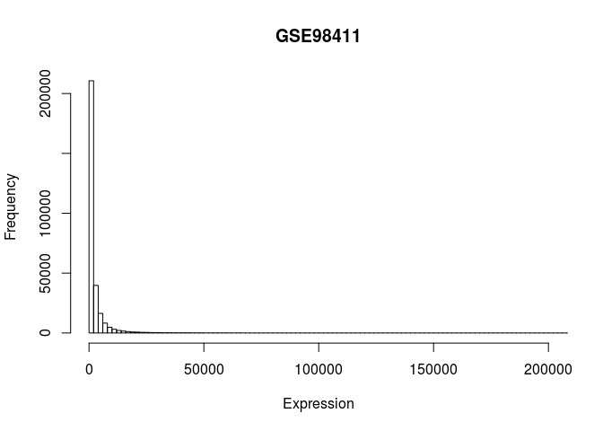
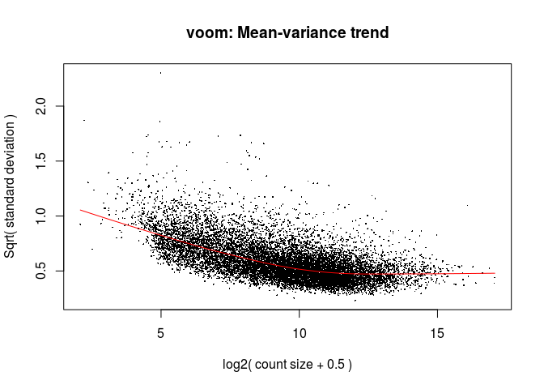
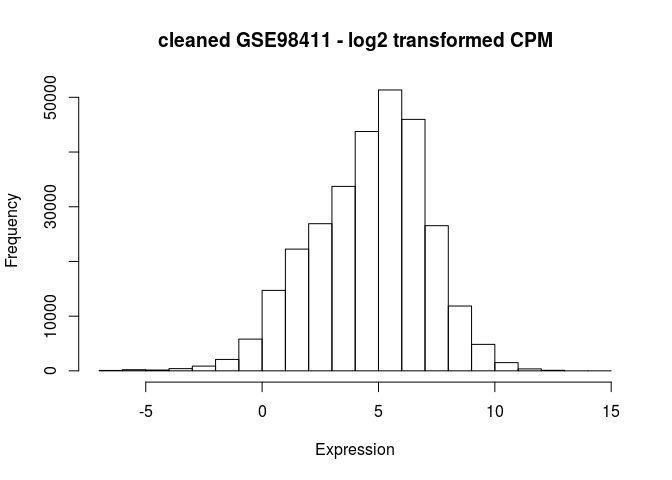
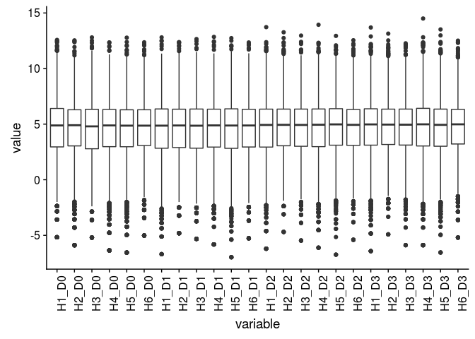
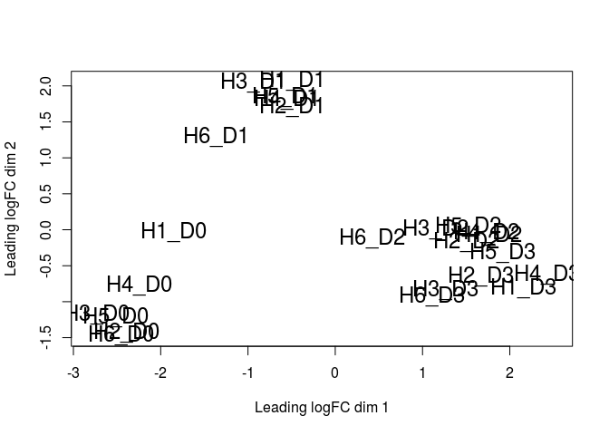
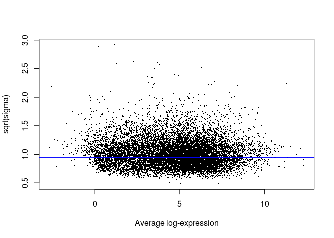
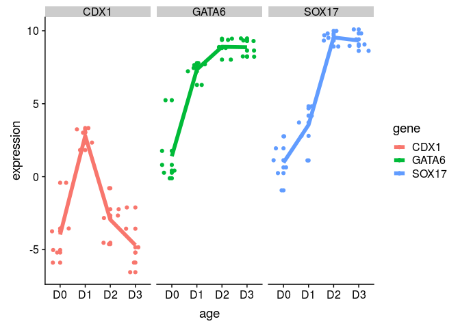
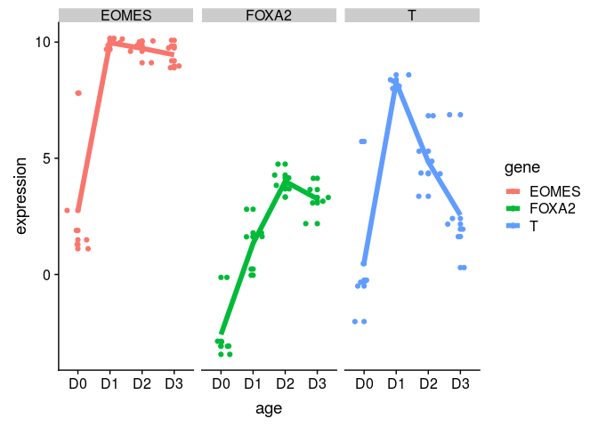
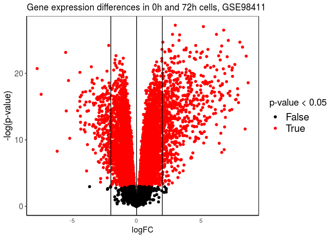
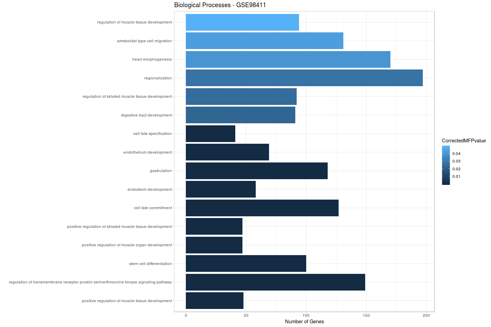

GSE98411 data analysis
================
German Novakovskiy
August 23, 2018

Here we analyze gene expression data from [this data set.](https://www.ncbi.nlm.nih.gov/geo/query/acc.cgi?acc=GSE98411).
Differentiation protocol: day 1 (Primitive streak induction) media included 100 ng/mL Activin A, 50 nM PI-103 (PI3K inhibitor), 2 nM CHIR99021 (Wnt agonist), days 2-3 media included 100 ng/mL Activin A and 250 nM LDN-193189 (BMP inhibitor).

``` r
if (file.exists("GSE98411.Rdata")) {
    # if previously downloaded
    load("GSE98411.Rdata")
} else {
    # Get geo object that contains our data and phenotype information
    geo_obj <- getGEO("GSE98411", GSEMatrix = TRUE)
    geo_obj <- geo_obj[[1]]
    save(geo_obj, file = "GSE98411.Rdata")
}
```

``` r
show(geo_obj)
```

    ## ExpressionSet (storageMode: lockedEnvironment)
    ## assayData: 0 features, 32 samples 
    ##   element names: exprs 
    ## protocolData: none
    ## phenoData
    ##   sampleNames: GSM2594449 GSM2594450 ... GSM2594504 (32 total)
    ##   varLabels: title geo_accession ... Sex:ch1 (45 total)
    ##   varMetadata: labelDescription
    ## featureData: none
    ## experimentData: use 'experimentData(object)'
    ## Annotation: GPL20301

Constructing an appropriate metadata matrix:

``` r
#get covariate matrix
geo_metadata <- pData(geo_obj)[, c("organism_ch1", "title", colnames(pData(geo_obj))[grep("characteristics", 
    colnames(pData(geo_obj)))])]

#splitting the column with cell line and age info
x <- str_split_fixed(geo_metadata$title, "_", 2)

#geo_metadata <- geo_metadata[,-2] will be used for filtering raw counts
geo_metadata$cell_type <- x[,1]
geo_metadata$age <- x[,2]

#delete columns characteristics_ch1 and characteristics_ch1.2
geo_metadata <- geo_metadata[,c(-3,-5)]

#splitting the sex column
x <- str_split_fixed(geo_metadata[,3], ": ", 2)
geo_metadata <- geo_metadata[,-3]
geo_metadata$sex <- x[,2]

colnames(geo_metadata) <- c("organism", "title", "cell", "age", "sex")

geo_metadata 
```

    ##                organism  title cell age    sex
    ## GSM2594449 Homo sapiens H1A_D0  H1A  D0 Female
    ## GSM2594450 Homo sapiens H1B_D0  H1B  D0 Female
    ## GSM2594451 Homo sapiens  H2_D0   H2  D0   Male
    ## GSM2594452 Homo sapiens  H3_D0   H3  D0 Female
    ## GSM2594453 Homo sapiens  H4_D0   H4  D0   Male
    ## GSM2594454 Homo sapiens H5A_D0  H5A  D0   Male
    ## GSM2594455 Homo sapiens H5B_D0  H5B  D0   Male
    ## GSM2594456 Homo sapiens  H6_D0   H6  D0 Female
    ## GSM2594465 Homo sapiens H1A_D1  H1A  D1 Female
    ## GSM2594466 Homo sapiens H1B_D1  H1B  D1 Female
    ## GSM2594467 Homo sapiens  H2_D1   H2  D1   Male
    ## GSM2594468 Homo sapiens  H3_D1   H3  D1 Female
    ## GSM2594469 Homo sapiens  H4_D1   H4  D1   Male
    ## GSM2594470 Homo sapiens H5A_D1  H5A  D1   Male
    ## GSM2594471 Homo sapiens H5B_D1  H5B  D1   Male
    ## GSM2594472 Homo sapiens  H6_D1   H6  D1 Female
    ## GSM2594481 Homo sapiens H1A_D2  H1A  D2 Female
    ## GSM2594482 Homo sapiens H1B_D2  H1B  D2 Female
    ## GSM2594483 Homo sapiens  H2_D2   H2  D2   Male
    ## GSM2594484 Homo sapiens  H3_D2   H3  D2 Female
    ## GSM2594485 Homo sapiens  H4_D2   H4  D2   Male
    ## GSM2594486 Homo sapiens H5A_D2  H5A  D2   Male
    ## GSM2594487 Homo sapiens H5B_D2  H5B  D2   Male
    ## GSM2594488 Homo sapiens  H6_D2   H6  D2 Female
    ## GSM2594497 Homo sapiens H1A_D3  H1A  D3 Female
    ## GSM2594498 Homo sapiens H1B_D3  H1B  D3 Female
    ## GSM2594499 Homo sapiens  H2_D3   H2  D3   Male
    ## GSM2594500 Homo sapiens  H3_D3   H3  D3 Female
    ## GSM2594501 Homo sapiens  H4_D3   H4  D3   Male
    ## GSM2594502 Homo sapiens H5A_D3  H5A  D3   Male
    ## GSM2594503 Homo sapiens H5B_D3  H5B  D3   Male
    ## GSM2594504 Homo sapiens  H6_D3   H6  D3 Female

Collapsing info in geo\_metadata:

``` r
old_samples <- geo_metadata$title
#tech_replicates rows
tech_rep <- c(1,2,6,7,9,10,14,15,17,18,22,23,25,26,30,31)

geo_metadata <- geo_metadata[-tech_rep,]
geo_metadata$title <- as.character(geo_metadata$title)
rownames(geo_metadata) <- NULL

geo_metadata <- rbind(geo_metadata, c("Homo sapiens", "H1_D0", "H1", "D0", "Female"))
geo_metadata <- rbind(geo_metadata, c("Homo sapiens", "H5_D0", "H5", "D0", "Male"))
geo_metadata <- rbind(geo_metadata, c("Homo sapiens", "H1_D1", "H1", "D1", "Female"))
geo_metadata <- rbind(geo_metadata, c("Homo sapiens", "H5_D1", "H5", "D1", "Male"))
geo_metadata <- rbind(geo_metadata, c("Homo sapiens", "H1_D2", "H1", "D2", "Female"))
geo_metadata <- rbind(geo_metadata, c("Homo sapiens", "H5_D2", "H5", "D2", "Male"))
geo_metadata <- rbind(geo_metadata, c("Homo sapiens", "H1_D3", "H1", "D3", "Female"))
geo_metadata <- rbind(geo_metadata, c("Homo sapiens", "H5_D3", "H5", "D3", "Male"))

geo_metadata <- geo_metadata[c(17,1,2,3,18,4,19,5,6,7,20,8,21,9,10,11,22,12,23,13,14,15,24,16),]
rownames(geo_metadata) <- NULL

geo_metadata$title <- as.factor(geo_metadata$title)
geo_metadata$age <- as.factor(geo_metadata$age)
geo_metadata$sex <- as.factor(geo_metadata$sex)
geo_metadata$cell <- as.factor(geo_metadata$cell)

geo_metadata
```

    ##        organism title cell age    sex
    ## 1  Homo sapiens H1_D0   H1  D0 Female
    ## 2  Homo sapiens H2_D0   H2  D0   Male
    ## 3  Homo sapiens H3_D0   H3  D0 Female
    ## 4  Homo sapiens H4_D0   H4  D0   Male
    ## 5  Homo sapiens H5_D0   H5  D0   Male
    ## 6  Homo sapiens H6_D0   H6  D0 Female
    ## 7  Homo sapiens H1_D1   H1  D1 Female
    ## 8  Homo sapiens H2_D1   H2  D1   Male
    ## 9  Homo sapiens H3_D1   H3  D1 Female
    ## 10 Homo sapiens H4_D1   H4  D1   Male
    ## 11 Homo sapiens H5_D1   H5  D1   Male
    ## 12 Homo sapiens H6_D1   H6  D1 Female
    ## 13 Homo sapiens H1_D2   H1  D2 Female
    ## 14 Homo sapiens H2_D2   H2  D2   Male
    ## 15 Homo sapiens H3_D2   H3  D2 Female
    ## 16 Homo sapiens H4_D2   H4  D2   Male
    ## 17 Homo sapiens H5_D2   H5  D2   Male
    ## 18 Homo sapiens H6_D2   H6  D2 Female
    ## 19 Homo sapiens H1_D3   H1  D3 Female
    ## 20 Homo sapiens H2_D3   H2  D3   Male
    ## 21 Homo sapiens H3_D3   H3  D3 Female
    ## 22 Homo sapiens H4_D3   H4  D3   Male
    ## 23 Homo sapiens H5_D3   H5  D3   Male
    ## 24 Homo sapiens H6_D3   H6  D3 Female

Let's load the expression data (in raw counts - after featureCounts):

``` r
expr_data_counts <- read.table("GSE98411_RNA_counts.txt", header=TRUE) 

expr_data_counts <- expr_data_counts[, colnames(expr_data_counts) %in% old_samples]

#colnames(expr_data_counts)[-1] <- as.character(geo_metadata$sample)

head(expr_data_counts, 10) #%>% kable()
```

    ##                 H1A_D0 H1B_D0 H2_D0 H3_D0 H4_D0 H5A_D0 H5B_D0 H6_D0 H1A_D1
    ## ENSG00000000003   2939   1675  4236  4392  7629   4065   4562  2392   6818
    ## ENSG00000000005     40      7    36    28   150     58    136     6    208
    ## ENSG00000000419   1405   1175  1994  2559  4208   1685   2266  1408   4004
    ## ENSG00000000457    164     50   385   270   553    270    513   254    439
    ## ENSG00000000460    695    146  1766  1135  1641    910   1253   714   1506
    ## ENSG00000000938      3      1    24    10    31      7     15     2      3
    ## ENSG00000000971      0      0     0     1     1      0      2     2      1
    ## ENSG00000001036   1370    666  2346  2059  3624   2019   2893  1975   2792
    ## ENSG00000001084   1595    490  3616  2432  4802   2264   2893  1779   4088
    ## ENSG00000001167    465      5  1229   318  1297    713    856   491   1240
    ##                 H1B_D1 H2_D1 H3_D1 H4_D1 H5A_D1 H5B_D1 H6_D1 H1A_D2 H1B_D2
    ## ENSG00000000003   3689  2289  3675  5320   6465   5388  3229   3759   1607
    ## ENSG00000000005    144   111   202   114    314    343    82     37     10
    ## ENSG00000000419   2269  1680  2482  2970   4015   3746  2314   2993   1371
    ## ENSG00000000457    221   164   215   307    476    517   228    381    143
    ## ENSG00000000460    971   726  1060  1324   1657   2182  1028    767    364
    ## ENSG00000000938      1     1     1     7      2      1     2      0      1
    ## ENSG00000000971      0     0     0     0      0      0     3      0      0
    ## ENSG00000001036   1490   821  1154  1389   2059   2552  1632   3568   1405
    ## ENSG00000001084   2373  1665  2504  3298   4058   3741  2048   3470   1780
    ## ENSG00000001167    858   571   772  1457   1077   1186   897    704    297
    ##                 H2_D2 H3_D2 H4_D2 H5A_D2 H5B_D2 H6_D2 H1A_D3 H1B_D3 H2_D3
    ## ENSG00000000003  1253  2567  4249   1607   3421  2617   3086   1687  1502
    ## ENSG00000000005    22    29     7     83    115    31     13      5    18
    ## ENSG00000000419  1121  2330  3148   3165   2475  2094   2418    960  1185
    ## ENSG00000000457   160   265   473    893    629   312    400    174   199
    ## ENSG00000000460   388   843  1087   1184   1440   911    840    280   429
    ## ENSG00000000938     0     1     6      4      3     2      0      0     0
    ## ENSG00000000971     0     0     0      0      0     1      0      0     0
    ## ENSG00000001036  1036  1950  2367   1494   2472  1901   3464   1476  1275
    ## ENSG00000001084  1691  3100  5353   4663   3568  2309   3806   1374  1649
    ## ENSG00000001167   415   627  1497   1149   1112   863    990    407   526
    ##                 H3_D3 H4_D3 H5A_D3 H5B_D3 H6_D3
    ## ENSG00000000003  2659  3408   2090   4178  2126
    ## ENSG00000000005    26     5     16    444    18
    ## ENSG00000000419  2791  2570   1514   2392  1501
    ## ENSG00000000457   493   410    287    565   230
    ## ENSG00000000460  1100   590    329   1194   516
    ## ENSG00000000938     1     2      0      1     1
    ## ENSG00000000971     0     0      0      1     0
    ## ENSG00000001036  2508  1957   1640   2893  2153
    ## ENSG00000001084  3654  4510   2307   3386  2075
    ## ENSG00000001167   996  1247    494    977   722

``` r
dim(expr_data_counts)
```

    ## [1] 30030    32

Usually one will filter genes with 10-15 read counts. We have r`min(DGE_bulk_time_course_ec$samples$lib.size)` as a lowest library size. 10 reads in such library size will be: r`10/min(DGE_bulk_time_course_ec$samples$lib.size)*1e6`. It is aproximately 2 cpm (the filtering is to this threshold) But 2 is to strict, let's go with 1.5

``` r
##first let's create a edgeR DGElist object

rownams <- rownames(expr_data_counts)

expr_data_counts <- as.matrix(expr_data_counts)
exp_data_counts_matrix <- apply(expr_data_counts, 2, function(x) as.numeric(x))
rownames(exp_data_counts_matrix) <- rownams

DGE_bulk_time_course_ec <- DGEList(counts = exp_data_counts_matrix) 

cpm <- cpm(DGE_bulk_time_course_ec)
keep.exprs <-rowSums(cpm > 1.5) >= 8 #8 samples for each condition including technical replicates

DGE_bulk_time_course_ec <- DGE_bulk_time_course_ec[keep.exprs,,]

dim(DGE_bulk_time_course_ec)
```

    ## [1] 12672    32

``` r
#converting to SYMBOL ID
x <- rownames(DGE_bulk_time_course_ec$counts)

#biomart really gives pretty the same result as bitr
#open connection between biomaRt and R. 
#human = useMart("ensembl", dataset = "hsapiens_gene_ensembl")
#names <- getBM( attributes=c("ensembl_gene_id", "hgnc_symbol") , filters= "ensembl_gene_id", values = unique(x), mart = human)

eg <-  bitr(x, fromType="ENSEMBL", toType="SYMBOL", OrgDb="org.Hs.eg.db")
```

    ## 'select()' returned 1:many mapping between keys and columns

    ## Warning in bitr(x, fromType = "ENSEMBL", toType = "SYMBOL", OrgDb =
    ## "org.Hs.eg.db"): 3.49% of input gene IDs are fail to map...

``` r
dim(eg)
```

    ## [1] 12308     2

``` r
length(unique(eg$ENSEMBL))
```

    ## [1] 12230

``` r
length(unique(eg$SYMBOL))
```

    ## [1] 12301

``` r
#delete replicates
eg <- eg[-which(duplicated(eg$ENSEMBL)),]
eg <- eg[-which(duplicated(eg$SYMBOL)),]

new_df <- DGE_bulk_time_course_ec$counts %>%
  as.data.frame() %>%
  rownames_to_column("ENSEMBL") %>%
  filter(ENSEMBL %in% eg$ENSEMBL) %>%
  merge(eg) %>%
  column_to_rownames("SYMBOL")

new_df <- new_df[,-1]
new_df <- as.matrix(new_df)

DGE_bulk_time_course_ec <- DGEList(counts = new_df) 
```

We should collapse technical replicates:

``` r
temp_df <- DGE_bulk_time_course_ec$counts

H1_D0 <- temp_df[,1] + temp_df[,2]
H5_D0 <- temp_df[,6] + temp_df[,7] 
H1_D1 <- temp_df[,9] + temp_df[,10]
H5_D1 <- temp_df[,14] + temp_df[,15] 
H1_D2 <- temp_df[,17] + temp_df[,18]
H5_D2 <- temp_df[,22] + temp_df[,23] 
H1_D3 <- temp_df[,25] + temp_df[,26]
H5_D3 <- temp_df[,30] + temp_df[,31] 

temp_df <- temp_df[,-tech_rep]

#assigning new columns (merged replicates)
temp_df <- cbind(temp_df, H1_D0)
temp_df <- cbind(temp_df, H5_D0)
temp_df <- cbind(temp_df, H1_D1)
temp_df <- cbind(temp_df, H5_D1)
temp_df <- cbind(temp_df, H1_D2)
temp_df <- cbind(temp_df, H5_D2)
temp_df <- cbind(temp_df, H1_D3)
temp_df <- cbind(temp_df, H5_D3)

#stupid, I know, but I need things fast
temp_df <- temp_df[,c(17,1,2,3,18,4,19,5,6,7,20,8,21,9,10,11,22,12,23,13,14,15,24,16)]
DGE_bulk_time_course_ec <- DGEList(counts = temp_df) 

head(DGE_bulk_time_course_ec$counts)
```

    ##          H1_D0 H2_D0 H3_D0 H4_D0 H5_D0 H6_D0 H1_D1 H2_D1 H3_D1 H4_D1 H5_D1
    ## TSPAN6    4614  4236  4392  7629  8627  2392 10507  2289  3675  5320 11853
    ## TNMD        47    36    28   150   194     6   352   111   202   114   657
    ## DPM1      2580  1994  2559  4208  3951  1408  6273  1680  2482  2970  7761
    ## SCYL3      214   385   270   553   783   254   660   164   215   307   993
    ## C1orf112   841  1766  1135  1641  2163   714  2477   726  1060  1324  3839
    ## FUCA2     2036  2346  2059  3624  4912  1975  4282   821  1154  1389  4611
    ##          H6_D1 H1_D2 H2_D2 H3_D2 H4_D2 H5_D2 H6_D2 H1_D3 H2_D3 H3_D3 H4_D3
    ## TSPAN6    3229  5366  1253  2567  4249  5028  2617  4773  1502  2659  3408
    ## TNMD        82    47    22    29     7   198    31    18    18    26     5
    ## DPM1      2314  4364  1121  2330  3148  5640  2094  3378  1185  2791  2570
    ## SCYL3      228   524   160   265   473  1522   312   574   199   493   410
    ## C1orf112  1028  1131   388   843  1087  2624   911  1120   429  1100   590
    ## FUCA2     1632  4973  1036  1950  2367  3966  1901  4940  1275  2508  1957
    ##          H5_D3 H6_D3
    ## TSPAN6    6268  2126
    ## TNMD       460    18
    ## DPM1      3906  1501
    ## SCYL3      852   230
    ## C1orf112  1523   516
    ## FUCA2     4533  2153

We have raw counts, thus we need to perform a library size normalization using edgeR:

``` r
normalized_factors_expression <- calcNormFactors(DGE_bulk_time_course_ec, method = "TMM") #calculation of scaling factors (for library size)

normalized_factors_expression$samples$norm.factors
```

    ##  [1] 0.9367720 1.0561968 1.0028686 1.0660507 1.0679305 1.0669407 1.0079249
    ##  [8] 1.0169165 1.0174137 1.0198441 0.9982928 1.0364230 0.9678365 0.9531486
    ## [15] 0.9852442 0.9589690 1.0128520 1.0307662 0.9551699 0.9747372 1.0121062
    ## [22] 0.8866975 0.9644564 1.0282688

Let's look at distribution of values:

``` r
#removing gene column and transforming into matrix (for hist)
data <- as.matrix(DGE_bulk_time_course_ec$counts)

hist(data, main="GSE98411", xlim = c(0,200000), xlab = "Expression",
     ylab = "Frequency", breaks = 300)
```



Let's now perform RNA-seq analysis with limma, using age, sex, cell columns and let's look separately at DE gene at each stage:

``` r
metadata_age <- geo_metadata[,-1]
metadata_age
```

    ##    title cell age    sex
    ## 1  H1_D0   H1  D0 Female
    ## 2  H2_D0   H2  D0   Male
    ## 3  H3_D0   H3  D0 Female
    ## 4  H4_D0   H4  D0   Male
    ## 5  H5_D0   H5  D0   Male
    ## 6  H6_D0   H6  D0 Female
    ## 7  H1_D1   H1  D1 Female
    ## 8  H2_D1   H2  D1   Male
    ## 9  H3_D1   H3  D1 Female
    ## 10 H4_D1   H4  D1   Male
    ## 11 H5_D1   H5  D1   Male
    ## 12 H6_D1   H6  D1 Female
    ## 13 H1_D2   H1  D2 Female
    ## 14 H2_D2   H2  D2   Male
    ## 15 H3_D2   H3  D2 Female
    ## 16 H4_D2   H4  D2   Male
    ## 17 H5_D2   H5  D2   Male
    ## 18 H6_D2   H6  D2 Female
    ## 19 H1_D3   H1  D3 Female
    ## 20 H2_D3   H2  D3   Male
    ## 21 H3_D3   H3  D3 Female
    ## 22 H4_D3   H4  D3   Male
    ## 23 H5_D3   H5  D3   Male
    ## 24 H6_D3   H6  D3 Female

First, let's use contrast matrix:

``` r
designMatrix <- model.matrix(~0 + age + sex, metadata_age)
head(designMatrix, 10) 
```

    ##    ageD0 ageD1 ageD2 ageD3 sexMale
    ## 1      1     0     0     0       0
    ## 2      1     0     0     0       1
    ## 3      1     0     0     0       0
    ## 4      1     0     0     0       1
    ## 5      1     0     0     0       1
    ## 6      1     0     0     0       0
    ## 7      0     1     0     0       0
    ## 8      0     1     0     0       1
    ## 9      0     1     0     0       0
    ## 10     0     1     0     0       1

We can apply voom (which usually takes count data as an input and transforms them to logCPM) that estimates the mean-variance relationship and uses this to compute appropriate observation-level weights. The data are then ready for linear modelling.

"Moreover, the voom-plot provides a visual check on the level of filtering performed upstream. If filtering of lowly-expressed genes is insufficient, a drop in variance levels can be observed at the low end of the expression scale due to very small counts. If this is observed, one should return to the earlier filtering step and increase the expression threshold applied to the dataset."

``` r
after_voom_cpm <- voom(normalized_factors_expression, designMatrix, plot=TRUE)
```



``` r
hist(after_voom_cpm$E, main="cleaned GSE98411 - log2 transformed CPM", xlab = "Expression",
     ylab = "Frequency")
```



Boxplots to explore the data:

``` r
cleaned_log_cpm_df <- as.data.frame(after_voom_cpm$E)

cleaned_log_cpm_df <- cleaned_log_cpm_df %>% rownames_to_column("gene")

meltedLogedBultTimeCourseEc <- melt(cleaned_log_cpm_df, id='gene')

meltedLogedBultTimeCourseEc %>%
  ggplot(aes(x = variable, y = value)) +
  geom_boxplot() + 
  theme(axis.text.x = element_text(angle = 90, hjust = 1))
```



``` r
plotMDS(cleaned_log_cpm_df[,-1], cex=1.5)
```



Let's create a contrast matrix because we are interested in DE genes across different time points:

``` r
rownames(cleaned_log_cpm_df) <- cleaned_log_cpm_df$gene
cleaned_log_cpm_df <- cleaned_log_cpm_df[,-1]

# construct the contrast matrix
contrastMatrix <- makeContrasts(
  D1vD0 = ageD1 - ageD0,
  D2vD1 = ageD2 - ageD1,
  D3vD2 = ageD3 - ageD2,
  D3vD1 = ageD3 - ageD1,
  D3vD0 = ageD3 - ageD0,
  levels = designMatrix
)

#contrastMatrix #%>% kable()
```

``` r
# keep the fit around as we will need to it for looking at other contrasts later 
time_course_Fit <- lmFit(after_voom_cpm, designMatrix)

# fit the contrast using the original fitted model
contrastFit <- contrasts.fit(time_course_Fit, contrastMatrix)

# apply eBayes() for moderated statistics
contrastFitEb <- eBayes(contrastFit)

#contrastGenes <- topTable(contrastFitEb, number = Inf, p.value = 0.05)

plotSA(contrastFitEb)
```



``` r
cutoff <- 5e-02 #0.05 p value
#adjust method by default is BH (equivalent to fdr)
time_course_res <- decideTests(contrastFitEb, p.value = cutoff, lfc = 1)
summary(time_course_res)
```

    ##        D1vD0 D2vD1 D3vD2 D3vD1 D3vD0
    ## Down     840   345    43   657  1025
    ## NotSig 10746 10945 12006 10060  9594
    ## Up       641   937   178  1510  1608

Let's look at top upregulated genes at different stages:

``` r
hits1 <- time_course_res %>% 
  as.data.frame() %>% 
  rownames_to_column("gene") %>% 
  filter(D1vD0 > 0)


hits2 <- time_course_res %>% 
  as.data.frame() %>% 
  rownames_to_column("gene") %>% 
  filter(D2vD1 > 0)


hits3 <- time_course_res %>% 
  as.data.frame() %>% 
  rownames_to_column("gene") %>% 
  filter(D3vD2 > 0)
```

``` r
#function for plotting genes
plotGenes <- function(genes, expressionMatrix, metadata) {
  
  expressionDataForGenes <- expressionMatrix %>%
    rownames_to_column("gene") %>%
    filter(gene %in% genes) %>%
    melt()
  
  colnames(expressionDataForGenes) <- c("gene", "title", "expression")
  expressionDataForGenes <- expressionDataForGenes %>%
    left_join(metadata, id="age")
  
  expressionDataForGenes %>% 
    ggplot(aes(x = age, y = expression, color=gene)) +
    geom_point() +
    geom_jitter() +
    stat_summary(aes(y = expression, group=1), fun.y = "mean", geom="line", size=2) +
    facet_wrap(~gene)
}
```

Comparisons to key genes from previous analysis.

``` r
#CDX1 - ENSG00000113722
#SOX17 - ENSG00000164736
sample_genes <- c("CDX1", "SOX17", "GATA6")
plotGenes(sample_genes, cleaned_log_cpm_df, metadata_age)
```



``` r
#SOX2 - ENSG00000181449
#FOXA2 - ENSG00000125798
sample_genes <- c("FOXA2", "EOMES", "T")
plotGenes(sample_genes, cleaned_log_cpm_df, metadata_age)
```



For pathway analysis

``` r
#we have only 3 days
DEgenes_0h_72h <- topTable(contrastFitEb, number = Inf, coef = "D3vD0")
DEgenes_0h_24h <- topTable(contrastFitEb, number = Inf, coef = "D1vD0")
DEgenes_24h_72h <- topTable(contrastFitEb, number = Inf, coef = "D3vD1")

#for pathway enrichment analysis
DEgenes_0h_72h_98411 <- DEgenes_0h_72h
DEgenes_0h_24h_98411 <- DEgenes_0h_24h
DEgenes_24h_72h_98411 <- DEgenes_24h_72h
save(DEgenes_0h_72h_98411, file = "DEgenes_0h_72h_98411.Rdata")
save(DEgenes_0h_24h_98411, file = "DEgenes_0h_24h_98411.Rdata")
save(DEgenes_24h_72h_98411, file = "DEgenes_24h_72h_98411.Rdata")
################################
```

Gene set enrichment analysis of GSE98411
----------------------------------------

``` r
if (!file.exists("GO.xml")) { goToday("GO.xml") }

ggplot(data = DEgenes_0h_72h, aes(x = logFC, y = -log(adj.P.Val), color = (-log(adj.P.Val) > 3)))+
  scale_colour_manual(name = 'p-value < 0.05', values = setNames(c('red','black'),c(T, F)), labels = c("False", "True"))+
  geom_point()+
  geom_vline(xintercept=0)+
  geom_vline(xintercept=-2)+
  geom_vline(xintercept=2)+
  #xlim(-1.5,1.5)+
  ylab("-log(p-value)")+
  xlab("logFC")+
  labs(title="Gene expression differences in 0h and 72h cells, GSE98411")+
  theme_bw()+
  theme(axis.line = element_line(colour = "black"),
        panel.grid.major = element_blank(),
        panel.grid.minor = element_blank(),
        #panel.border = element_blank(),
        panel.background = element_blank()) +
  theme(axis.title.x=element_text(size=12),
        axis.text.y=element_text(size=12),
        axis.title.y=element_text(size=14),
        axis.ticks.x=element_blank(),
        strip.text.x = element_text(size=14),
        strip.background = element_rect(colour="white", fill="white"),
        legend.text=element_text(size=15),
        legend.title=element_text(size=14))
```



``` r
ermineInputGeneScores <- DEgenes_0h_72h %>% 
  rownames_to_column("gene") %>%
  #mutate(absolute_logFC = abs(logFC)) %>% 
  dplyr::select(gene, logFC) %>% 
  na.omit() %>% 
  as.data.frame() %>% 
  arrange(desc(logFC)) %>% 
  column_to_rownames("gene")

head(ermineInputGeneScores, 10) %>% kable() # print the first few rows
```

|           |     logFC|
|-----------|---------:|
| SLC40A1   |  8.668667|
| SOX17     |  8.518783|
| ERBB4     |  8.435599|
| FGF17     |  8.234107|
| CXCR4     |  8.022457|
| APOA2     |  7.920356|
| LINC01467 |  7.868279|
| SLC5A9    |  7.850093|
| VWA3B     |  7.737221|
| ADAMTS18  |  7.690822|

``` r
enrichmentResult <- precRecall(scores = ermineInputGeneScores, 
                               scoreColumn = 1, # column 1 is the scores 
                               bigIsBetter = TRUE, # larger logFC should be ranked higher
                               annotation = "Generic_human", # ask ermineJ to use the Generic_human annotation file (will automatically download)
                               aspects = "B", # look at only biological processes 
                               iterations = 10000, # 10K sampling iterations so that results are stable
                               geneSetDescription = "GO.xml") # use the GO XML file in current directory

enrichmentResult$results %>% arrange(MFPvalue) %>% head(10) %>% kable()
```

| Name                                                                                   | ID           |  NumProbes|  NumGenes|   RawScore|  Pval|  CorrectedPvalue|  MFPvalue|  CorrectedMFPvalue|  Multifunctionality| Same as                                                                   | GeneMembers                                                                                                                                                                                                                                                                                                                                                                                                                                                                                                                                                                                                                                                                                                                                                                                                                                                                                                         |
|:---------------------------------------------------------------------------------------|:-------------|----------:|---------:|----------:|-----:|----------------:|---------:|------------------:|-------------------:|:--------------------------------------------------------------------------|:--------------------------------------------------------------------------------------------------------------------------------------------------------------------------------------------------------------------------------------------------------------------------------------------------------------------------------------------------------------------------------------------------------------------------------------------------------------------------------------------------------------------------------------------------------------------------------------------------------------------------------------------------------------------------------------------------------------------------------------------------------------------------------------------------------------------------------------------------------------------------------------------------------------------|
| cell fate specification                                                                | <GO:0001708> |         41|        41|  0.0389626|     0|                0|         0|                  0|               0.883| NA                                                                        | APC|APC2|CDON|CTNNB1|DLL1|EOMES|EVX1|EYA1|EYA2|FKBP8|FOXA1|FOXA2|GLI2|GLI3|GSC|ISL1|ITGB1|NKX6-1|NODAL|NOTCH1|NRP1|NTRK3|OLIG3|PAX6|PPDPF|PRDM14|PSEN1|PTCH1|PTCH2|RBPJ|SHH|SIX2|SMO|SOX17|SOX18|SOX2|SOX6|SOX9|SUFU|TBX6|TENM4|                                                                                                                                                                                                                                                                                                                                                                                                                                                                                                                                                                                                                                                                                    |
| endothelium development                                                                | <GO:0003158> |         69|        69|  0.0393608|     0|                0|         0|                  0|               0.885| NA                                                                        | ACVR1|ACVR2B|AFDN|ARHGEF26|BMP4|BMPR2|CCM2|CLDN1|CLIC4|COL18A1|CSNK2B|CTNNB1|DLL1|EDF1|ENG|EZR|F11R|GJA4|GSTM3|HEG1|HEY1|HEY2|ICAM1|JAG1|KDM6B|KDR|LAMA5|MARVELD2|MESP1|MET|MYADM|NOTCH1|NOTCH4|NRG1|NRP1|PDE2A|PDE4D|PDPN|PLOD3|PPP1R16B|PRKD2|PROX1|PTN|PTPRS|RAB1A|RAB1B|RAP1A|RAP1B|RAP2B|RAP2C|RAPGEF1|RAPGEF2|RAPGEF3|RAPGEF6|RBPJ|RDX|RHOA|RHOB|SCUBE1|SLC40A1|SMAD4|SOX17|SOX18|STARD13|STC1|TJP1|TJP2|TNMD|VEZF1|                                                                                                                                                                                                                                                                                                                                                                                                                                                                                          |
| gastrulation                                                                           | <GO:0007369> |        118|       118|  0.0433015|     0|                0|         0|                  0|               0.989| NA                                                                        | ACVR1|ACVR2A|ACVR2B|AMOT|APELA|APLN|ARFRP1|ARID1A|AXIN1|BMP4|BMP7|BMPR2|CDC73|CER1|CHRD|COL11A1|COL12A1|COL4A2|COL6A1|COL7A1|COL8A1|CTNNB1|CTR9|CUL3|DKK1|DLD|DUSP1|DUSP4|DUSP5|DVL1|DVL2|EOMES|EPB41L5|ETS2|EXOC4|EXT1|EXT2|EYA1|EYA2|FGF8|FGFR2|FN1|FOXA2|FRS2|GATA6|GDF3|GPI|GSC|HHEX|HIRA|HMGA2|HSBP1|ITGA2|ITGA3|ITGA4|ITGA5|ITGA7|ITGAV|ITGB1|ITGB4|ITGB5|KDM6A|KDM6B|KIF16B|KLF4|LAMA3|LAMB1|LDB1|LEF1|LEO1|LRP5|LRP6|MEGF8|MESP1|MIXL1|MKKS|MMP14|MMP15|MMP2|MMP9|NF2|NODAL|NOG|NPHP3|NR4A3|OTX2|PAF1|POFUT2|POGLUT1|PRKAR1A|RACK1|RIC8A|RNF2|RPS6|RTF1|SETD2|SFRP1|SIX2|SMAD1|SMAD2|SMAD3|SMAD4|SNAI1|SOX17|SOX2|SRF|SUPT20H|SYF2|TBX6|TENM4|TGFBR2|TWSG1|UGDH|VANGL2|WLS|WNT3|WNT5A|ZBTB17|                                                                                                                                                                                                               |
| endoderm development                                                                   | <GO:0007492> |         58|        58|  0.0355508|     0|                0|         0|                  0|               0.870| NA                                                                        | APELA|ARC|BMP4|BPTF|CDC73|COL11A1|COL12A1|COL4A2|COL6A1|COL7A1|COL8A1|CTNNB1|CTR9|DKK1|DUSP1|DUSP4|DUSP5|EOMES|EPB41L5|EXT1|FGF8|FN1|GATA6|GDF3|HHEX|HMGA2|HSBP1|ITGA4|ITGA5|ITGA7|ITGAV|ITGB5|KIF16B|LAMA3|LAMB1|LAMC1|LEO1|MED12|MIXL1|MMP14|MMP15|MMP2|MMP9|NODAL|NOG|NOTCH1|PAF1|PAX9|PELO|RTF1|SETD2|SMAD2|SMAD3|SMAD4|SOX17|SOX2|TGFB1|ZFP36L1|                                                                                                                                                                                                                                                                                                                                                                                                                                                                                                                                                               |
| cell fate commitment                                                                   | <GO:0045165> |        127|       127|  0.0494632|     0|                0|         0|                  0|               0.998| NA                                                                        | ACVR1|APC|APC2|ARHGEF2|AXIN1|BCL11B|BCL2|BMP2|BMP4|BRAF|CASP3|CDC73|CDON|CHD5|CTNNB1|CTR9|CYLD|CYP26B1|DLL1|DOCK7|EBF2|EOMES|EPAS1|ERBB4|ETS2|EVX1|EYA1|EYA2|FGF10|FGF13|FGF8|FGFR2|FKBP8|FOXA1|FOXA2|GAP43|GATA3|GATA6|GLI2|GLI3|GSC|HES1|HEY2|ID2|IFRD1|ISL1|ITGB1|JAG1|JAG2|KDM6B|KLF4|LATS1|LATS2|LEO1|MCL1|MESP1|NKX6-1|NODAL|NOTCH1|NOTCH2|NOTCH3|NOTCH4|NRG1|NRP1|NTRK3|OLIG3|ONECUT2|PAF1|PAX6|PAX7|PDPN|PML|POU6F2|PPDPF|PRDM1|PRDM14|PRKDC|PROX1|PSEN1|PTCH1|PTCH2|RAB10|RARA|RBPJ|RHOA|ROR2|RORA|RTF1|RUNX2|SATB2|SFRP1|SH3PXD2B|SHH|SIX2|SMAD1|SMAD2|SMAD4|SMAD5|SMO|SOX17|SOX18|SOX2|SOX5|SOX6|SOX8|SOX9|SPRY2|STAT3|STAT6|SUFU|TBX19|TBX3|TBX6|TCF3|TCF7L2|TEAD3|TENM4|TGFB1I1|TGFBR1|WNT2B|WNT3|WNT5A|WNT5B|WNT8A|WNT9B|WT1|ZNF521|                                                                                                                                                                  |
| positive regulation of striated muscle tissue development                              | <GO:0045844> |         47|        47|  0.0402324|     0|                0|         0|                  0|               0.904| <GO:0048636%7Cpositive> regulation of muscle organ development,           | ACTN3|AKAP6|ARNTL|ARRB2|BCL2|BMP4|CCNB1|CDK1|CDON|CREB1|CTNNB1|CYP26B1|DDX39B|DLL1|EDN1|EFNB2|ERBB3|ERBB4|FAM129B|FGF2|FGFR1|FGFR2|FLOT1|GATA6|GLI1|GPC1|GREM1|HEY2|HMGCR|MAPK14|MKL2|MTM1|MTOR|MYOCD|NOTCH1|NRG1|PIM1|PIN1|PRKAA1|RBPJ|RPS6KB1|SHH|SHOX2|SOX17|TGFB1|TGFBR3|ZFPM2|                                                                                                                                                                                                                                                                                                                                                                                                                                                                                                                                                                                                                                 |
| positive regulation of muscle organ development                                        | <GO:0048636> |         47|        47|  0.0402324|     0|                0|         0|                  0|               0.904| <GO:0045844%7Cpositive> regulation of striated muscle tissue development, | ACTN3|AKAP6|ARNTL|ARRB2|BCL2|BMP4|CCNB1|CDK1|CDON|CREB1|CTNNB1|CYP26B1|DDX39B|DLL1|EDN1|EFNB2|ERBB3|ERBB4|FAM129B|FGF2|FGFR1|FGFR2|FLOT1|GATA6|GLI1|GPC1|GREM1|HEY2|HMGCR|MAPK14|MKL2|MTM1|MTOR|MYOCD|NOTCH1|NRG1|PIM1|PIN1|PRKAA1|RBPJ|RPS6KB1|SHH|SHOX2|SOX17|TGFB1|TGFBR3|ZFPM2|                                                                                                                                                                                                                                                                                                                                                                                                                                                                                                                                                                                                                                 |
| stem cell differentiation                                                              | <GO:0048863> |        100|       100|  0.0412965|     0|                0|         0|                  0|               0.986| NA                                                                        | ACE|ACVR1|ALX1|BCHE|CFL1|CHD2|CORO1C|EDN1|EDNRA|EDNRB|EFNB1|EOMES|EPCAM|ERBB4|ERCC2|FGFR2|FOLR1|FOXA1|FOXO4|FRZB|GBX2|GDNF|GPM6A|GREM1|GSC|HES1|HHEX|HIF1A|HMGA2|ISL1|JAG1|JARID2|KBTBD8|KIT|KITLG|KLHL12|LAMA5|LEF1|LIF|LRP6|MAPK1|MAPK3|MSI2|MSX1|MSX2|MTF2|MYOCD|NOLC1|NOTCH1|NRG1|NRP1|NRTN|OVOL2|PDCD6|PHACTR4|PITX2|POU6F2|PSMD11|PUM1|RBPJ|RDH10|REST|RET|RUNX2|SEMA3A|SEMA3B|SEMA3C|SEMA3D|SEMA3E|SEMA3F|SEMA3G|SEMA4A|SEMA4B|SEMA4C|SEMA4D|SEMA4F|SEMA4G|SEMA7A|SETD2|SETD6|SFRP1|SHH|SMAD4|SMO|SOX10|SOX11|SOX17|SOX18|SOX8|SOX9|SRF|TAPT1|TCOF1|TGFB2|TWIST1|WNT3|WNT8A|XRCC5|ZEB2|ZNF281|                                                                                                                                                                                                                                                                                                               |
| regulation of transmembrane receptor protein serine/threonine kinase signaling pathway | <GO:0090092> |        149|       149|  0.0333995|     0|                0|         0|                  0|               0.964| NA                                                                        | ABL1|ACVR1|ACVR1B|ACVR2A|ACVR2B|ADAM17|ADAMTSL2|BAMBI|BCL9|BCL9L|BMP2|BMP3|BMP4|BMP7|BMPER|BMPR2|CAV1|CAV2|CD109|CDKN1C|CDKN2B|CER1|CHRD|CHRDL1|CHST11|CITED2|CSNK2B|CTDSPL2|CYR61|DAB2|DACT1|DACT2|DKK1|DKK3|DNM2|ENG|FAM89B|FBN1|FBN2|FBXL15|FERMT1|FGF10|FKBP1A|FKBP8|FLCN|FOLR1|FST|FSTL3|GATA6|GDF11|GDF15|GDF3|GIPC1|GLG1|GPC3|GREM1|HES1|HIPK2|HSPA5|HTRA1|HTRA3|ILK|ING2|INHBE|ITGA3|LDLRAD4|LEFTY1|LEFTY2|LEMD2|LEMD3|LRG1|LRP2|LTBP1|LTBP4|MAGI2|MEN1|MSX1|MSX2|MTMR4|MYOCD|NBL1|NEO1|NODAL|NOG|NOTCH1|NREP|NUMA1|NUP93|ONECUT2|PARP1|PBLD|PCSK6|PDPK1|PEG10|PELO|PIN1|PMEPA1|PPM1A|RASL11B|RBPJ|RBPMS|RBPMS2|RNF111|RNF165|RPS27A|SFRP1|SFRP2|SFRP5|SHH|SIRT1|SKI|SKIL|SMAD2|SMAD3|SMAD4|SMAD6|SMAD7|SMURF1|SMURF2|SNW1|SNX25|SNX6|SOX11|SPART|STK11|STRAP|STUB1|SULF1|TGFB1|TGFB1I1|TGFB2|TGFB3|TGFBR1|TGFBR2|TGFBR3|THBS1|TOB1|TRIM33|TTK|TWSG1|UBC|UBE2O|WNT5A|WWTR1|ZC3H3|ZEB1|ZNF423|ZNF451|ZNF703| |
| positive regulation of muscle tissue development                                       | <GO:1901863> |         48|        48|  0.0400179|     0|                0|         0|                  0|               0.904| NA                                                                        | ACTN3|AKAP6|ARNTL|ARRB2|BCL2|BMP4|CCNB1|CDK1|CDON|CREB1|CTNNB1|CYP26B1|DDX39B|DLL1|EDN1|EFNB2|ERBB3|ERBB4|FAM129B|FGF2|FGFR1|FGFR2|FLOT1|GATA6|GLI1|GPC1|GREM1|HEY2|HMGCR|MAPK14|MKL2|MTM1|MTOR|MYOCD|NOTCH1|NRG1|PIM1|PIN1|PPARGC1A|PRKAA1|RBPJ|RPS6KB1|SHH|SHOX2|SOX17|TGFB1|TGFBR3|ZFPM2|                                                                                                                                                                                                                                                                                                                                                                                                                                                                                                                                                                                                                        |

``` r
enrichmentResult$results %>% 
  dplyr::select(Name, CorrectedPvalue, CorrectedMFPvalue) %>% 
  arrange(CorrectedMFPvalue) %>% 
  head(10) %>% 
  kable(align = "l", col.names = c("Biological Process", "Corrected p-value", 
                                   "Corrected MF p-value"))
```

| Biological Process                                                                     | Corrected p-value | Corrected MF p-value |
|:---------------------------------------------------------------------------------------|:------------------|:---------------------|
| positive regulation of muscle tissue development                                       | 0                 | 0                    |
| regulation of transmembrane receptor protein serine/threonine kinase signaling pathway | 0                 | 0                    |
| stem cell differentiation                                                              | 0                 | 0                    |
| positive regulation of striated muscle tissue development                              | 0                 | 0                    |
| positive regulation of muscle organ development                                        | 0                 | 0                    |
| cell fate commitment                                                                   | 0                 | 0                    |
| endoderm development                                                                   | 0                 | 0                    |
| gastrulation                                                                           | 0                 | 0                    |
| endothelium development                                                                | 0                 | 0                    |
| cell fate specification                                                                | 0                 | 0                    |

``` r
Enrichment <- enrichmentResult$results
Enrichment$Name <- as.factor(Enrichment$Name)

Enrichment %>% 
  dplyr::select(Name, NumGenes, CorrectedMFPvalue) %>% 
  arrange(CorrectedMFPvalue) %>% 
  filter(CorrectedMFPvalue <= 5e-2) %>% 
  head(25) %>% 
  ggplot(aes(x = fct_reorder(Name, CorrectedMFPvalue), 
             y = NumGenes, fill = CorrectedMFPvalue)) +
  geom_col() +
  labs(title = "Biological Processes - GSE98411", 
       x = "", y = "Number of Genes") +
  theme(axis.text.x = element_text(angle = 90, hjust = 1)) +
  coord_flip() +
  theme_light() 
```


