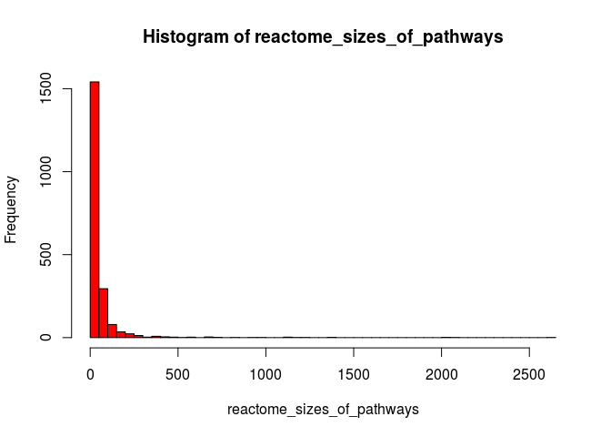
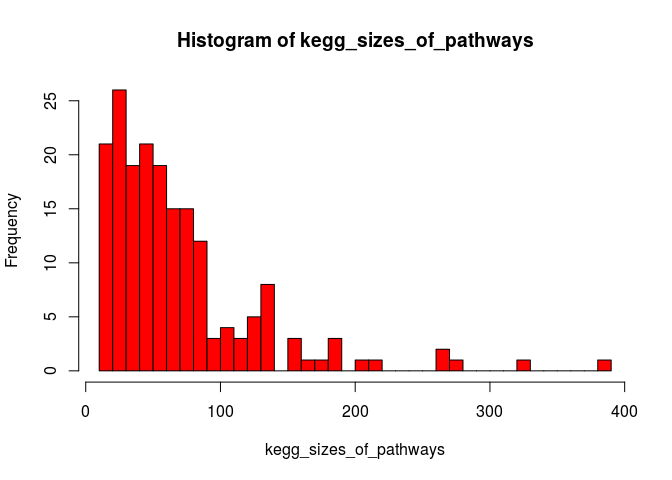
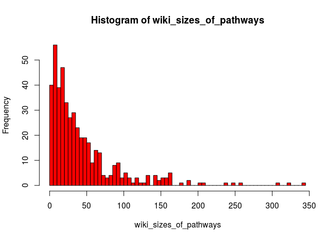
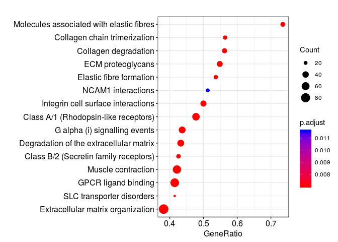
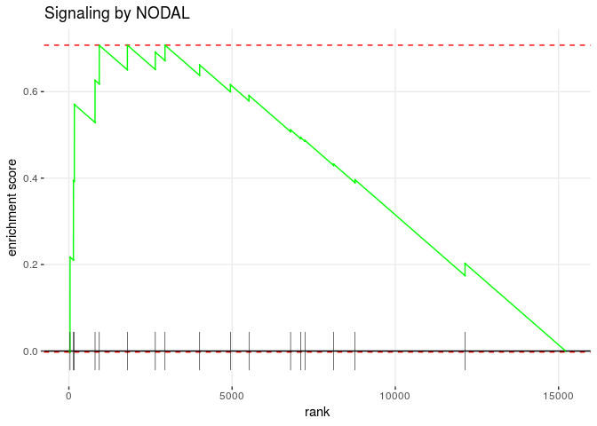
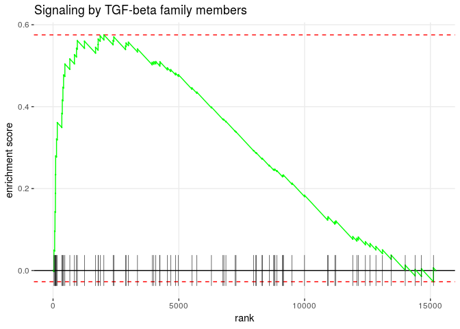

Pathway enrichment analysis, GEO109658
================
German Novakovskiy
August 17, 2018

Pathway enrichment analysis of individual definitive endoderm differentiation experiments (from GEO) and LINS data

Analysis of pathways
--------------------

KEGG pathways were dowloaded from here (<http://www.broadinstitute.org/gsea/msigdb/collections.jsp#C2>) in gmt format. Wikipathways were downloaded from the official website (<http://data.wikipathways.org/20180810/gmt/>), latest version August 10, 2018. Reactome pathways (gmt file) were dowloaded from here (<https://reactome.org/download/current/ReactomePathways.gmt.zip>).

### Analysis of REACTOME pathways

Reading data from file:

``` r
x <- scan("~/ESC_RNA_seq/pathway_enrichment_analysis/ReactomePathways.tsv", what = "", sep = "\n")
x <- strsplit(x, "[ \t]+")
max.col <- max(sapply(x, length))

## specify col.names as ?read.table suggests
cn <- paste("V", 1:max.col, sep = "")
reactome_pathways <- read.table("~/ESC_RNA_seq/pathway_enrichment_analysis/ReactomePathways.tsv", fill = TRUE, 
                 col.names = cn, sep = '\t', quote = "")

reactome_pathways[1:5, 1:10] %>% kable()
```

| V1            | V2                                                              | V3     | V4      | V5     | V6     | V7     | V8      | V9     | V10    |
|:--------------|:----------------------------------------------------------------|:-------|:--------|:-------|:-------|:-------|:--------|:-------|:-------|
| R-HSA-164843  | 2-LTR circle formation                                          | BANF1  | HMGA1   | LIG4   | PSIP1  | XRCC4  | XRCC5   | XRCC6  | gag    |
| R-HSA-73843   | 5-Phosphoribose 1-diphosphate biosynthesis                      | PRPS1  | PRPS1L1 | PRPS2  |        |        |         |        |        |
| R-HSA-1971475 | A tetrasaccharide linker sequence is required for GAG synthesis | AGRN   | B3GALT6 | B3GAT1 | B3GAT2 | B3GAT3 | B4GALT7 | BCAN   | BGN    |
| R-HSA-5619084 | ABC transporter disorders                                       | ABCC8  | CFTR    | DERL1  | DERL2  | DERL3  | ERLEC1  | ERLIN1 | ERLIN2 |
| R-HSA-1369062 | ABC transporters in lipid homeostasis                           | ABCA10 | ABCA12  | ABCA2  | ABCA3  | ABCA5  | ABCA6   | ABCA7  | ABCA9  |

There are 2029 pathways in total.

Distribution of counts of genes in each pathway for REACTOME:

``` r
calculateSize <- function(row_of_df){
  x <- row_of_df[3:length(row_of_df)]
  x <- x[!is.na(x)]
  return(sum(x != ""))
}

reactome_sizes_of_pathways <- apply(reactome_pathways, 1, calculateSize)

hist(reactome_sizes_of_pathways, breaks = 50, col = "red")
```



Sorting pathways by size:

``` r
reactome_pathways_amount <- as.data.frame(reactome_pathways[,2])
colnames(reactome_pathways_amount) <- "Pathway"
reactome_pathways_amount$Size <- reactome_sizes_of_pathways

reactome_pathways_amount <- reactome_pathways_amount %>%
  arrange(desc(Size))
```

We see that are the largest pathways are very broad:

``` r
head(reactome_pathways_amount, n = 10) %>% kable()
```

| Pathway                                 |  Size|
|:----------------------------------------|-----:|
| Signal Transduction                     |  2623|
| Metabolism of proteins                  |  2064|
| Immune System                           |  2047|
| Metabolism                              |  2013|
| Post-translational protein modification |  1398|
| Gene expression (Transcription)         |  1376|
| RNA Polymerase II Transcription         |  1240|
| Signaling by GPCR                       |  1162|
| Innate Immune System                    |  1114|
| Generic Transcription Pathway           |  1112|

However, the smallest pathways contain just one gene:

``` r
tail(reactome_pathways_amount, n = 10) %>% kable()
```

|      | Pathway                                                         |  Size|
|------|:----------------------------------------------------------------|-----:|
| 2020 | Synthesis of CL                                                 |     1|
| 2021 | Synthesis of Hepoxilins (HX) and Trioxilins (TrX)               |     1|
| 2022 | Synthesis of IPs in the ER lumen                                |     1|
| 2023 | TLR3 deficiency - HSE                                           |     1|
| 2024 | TWIK-related spinal cord K+ channel (TRESK)                     |     1|
| 2025 | Tandem pore domain halothane-inhibited K+ channel (THIK)        |     1|
| 2026 | UNC93B1 deficiency - HSE                                        |     1|
| 2027 | Vitamin E                                                       |     1|
| 2028 | WNT ligand secretion is abrogated by the PORCN inhibitor LGK974 |     1|
| 2029 | t(4;14) translocations of FGFR3                                 |     1|

In our enrichment analysis we will consider only pathways that contain at least 15 genes and no more than 300 genes:

``` r
reactome_selected_pathways <- reactome_pathways_amount %>% 
  filter(Size >= 15 & Size <= 300)
```

There are 1070 of such pathways.

### Analysis of KEGG pathways

Reading data from file:

``` r
x <- scan("~/ESC_RNA_seq/pathway_enrichment_analysis/KeggPathways.gmt", what = "", sep = "\n")
x <- strsplit(x, "[ \t]+")
max.col <- max(sapply(x, length))

## specify col.names as ?read.table suggests
cn <- paste("V", 1:max.col, sep = "")
kegg_pathways <- read.table("~/ESC_RNA_seq/pathway_enrichment_analysis/KeggPathways.gmt", fill = TRUE, 
                 col.names = cn, sep = '\t', quote = "")

kegg_pathways <- kegg_pathways[,c(2,1,3:ncol(kegg_pathways))]
```

There are 186 pathways in total.

Distribution of counts of genes in each pathway for KEGG:

``` r
kegg_sizes_of_pathways <- apply(kegg_pathways, 1, calculateSize)

hist(kegg_sizes_of_pathways, breaks = 50, col = "red")
```



Sorting pathways by size:

``` r
kegg_pathways_amount <- as.data.frame(kegg_pathways[,2])
colnames(kegg_pathways_amount) <- "Pathway"
kegg_pathways_amount$Size <- kegg_sizes_of_pathways

kegg_pathways_amount <- kegg_pathways_amount %>%
  arrange(desc(Size))
```

The largest KEGG pathways:

``` r
head(kegg_pathways_amount, n = 10) %>% kable()
```

| Pathway                                          |  Size|
|:-------------------------------------------------|-----:|
| KEGG\_OLFACTORY\_TRANSDUCTION                    |   389|
| KEGG\_PATHWAYS\_IN\_CANCER                       |   328|
| KEGG\_NEUROACTIVE\_LIGAND\_RECEPTOR\_INTERACTION |   272|
| KEGG\_MAPK\_SIGNALING\_PATHWAY                   |   267|
| KEGG\_CYTOKINE\_CYTOKINE\_RECEPTOR\_INTERACTION  |   267|
| KEGG\_REGULATION\_OF\_ACTIN\_CYTOSKELETON        |   216|
| KEGG\_FOCAL\_ADHESION                            |   201|
| KEGG\_CHEMOKINE\_SIGNALING\_PATHWAY              |   190|
| KEGG\_HUNTINGTONS\_DISEASE                       |   185|
| KEGG\_ENDOCYTOSIS                                |   183|

Smallest pathways contain at least 10 genes:

``` r
tail(kegg_pathways_amount, n = 10) %>% kable()
```

|     | Pathway                                                |  Size|
|-----|:-------------------------------------------------------|-----:|
| 177 | KEGG\_GLYCOSPHINGOLIPID\_BIOSYNTHESIS\_GANGLIO\_SERIES |    15|
| 178 | KEGG\_TERPENOID\_BACKBONE\_BIOSYNTHESIS                |    15|
| 179 | KEGG\_GLYCOSPHINGOLIPID\_BIOSYNTHESIS\_GLOBO\_SERIES   |    14|
| 180 | KEGG\_NON\_HOMOLOGOUS\_END\_JOINING                    |    14|
| 181 | KEGG\_SULFUR\_METABOLISM                               |    13|
| 182 | KEGG\_CIRCADIAN\_RHYTHM\_MAMMAL                        |    13|
| 183 | KEGG\_VALINE\_LEUCINE\_AND\_ISOLEUCINE\_BIOSYNTHESIS   |    11|
| 184 | KEGG\_FOLATE\_BIOSYNTHESIS                             |    11|
| 185 | KEGG\_TAURINE\_AND\_HYPOTAURINE\_METABOLISM            |    10|
| 186 | KEGG\_LIMONENE\_AND\_PINENE\_DEGRADATION               |    10|

Again, we consider only pathways that contain at least 15 genes and no more than 300 genes:

``` r
kegg_selected_pathways <- kegg_pathways_amount %>% 
  filter(Size >= 15 & Size <= 300)
```

There are 176 of such pathways.

### Analysis of Wikipathways

Reading data from file:

``` r
x <- scan("~/ESC_RNA_seq/pathway_enrichment_analysis/Wikipathways.gmt", what = "", sep = "\n")
x <- strsplit(x, "[ \t]+")
max.col <- max(sapply(x, length))

## specify col.names as ?read.table suggests
cn <- paste("V", 1:max.col, sep = "")
wiki_pathways <- read.table("~/ESC_RNA_seq/pathway_enrichment_analysis/Wikipathways.gmt", fill = TRUE, 
                 col.names = cn, sep = '\t', quote = "")

wiki_pathways <- wiki_pathways[,c(2,1,3:ncol(wiki_pathways))]
wiki_pathways[1:5, 1:10] %>% kable()
```

| V2                                                   | V1                                                                                      |    V3|     V4|     V5|      V6|     V7|     V8|     V9|     V10|
|:-----------------------------------------------------|:----------------------------------------------------------------------------------------|-----:|------:|------:|-------:|------:|------:|------:|-------:|
| <http://www.wikipathways.org/instance/WP23_r92558>   | B Cell Receptor Signaling Pathway%WikiPathways\_20180810%WP23%Homo sapiens              |  4690|   5781|  11184|    6195|   4609|    998|   5777|   10892|
| <http://www.wikipathways.org/instance/WP2333_r72015> | Trans-sulfuration pathway%WikiPathways\_20180810%WP2333%Homo sapiens                    |  1786|   2730|  27430|     875|    191|   4357|   1491|    2805|
| <http://www.wikipathways.org/instance/WP2509_r92315> | Nanoparticle triggered autophagic cell death%WikiPathways\_20180810%WP2509%Homo sapiens |  9474|   8678|   7248|  285973|  64422|  55054|  22863|  406991|
| <http://www.wikipathways.org/instance/WP3891_r97681> | Benzene metabolism%WikiPathways\_20180810%WP3891%Homo sapiens                           |  2944|  27294|   4353|    1571|   1728|   2052|     NA|      NA|
| <http://www.wikipathways.org/instance/WP1604_r98130> | Codeine and Morphine Metabolism%WikiPathways\_20180810%WP1604%Homo sapiens              |  7363|   7364|   5243|    1558|   1576|   1565|  54578|   54600|

There are 462 pathways in total.

Distribution of counts of genes in each pathway for Wikipathways:

``` r
wiki_sizes_of_pathways <- apply(wiki_pathways, 1, calculateSize)

hist(wiki_sizes_of_pathways, breaks = 50, col = "red")
```



Sorting pathways by size:

``` r
wiki_pathways_amount <- as.data.frame(wiki_pathways[,2])
colnames(wiki_pathways_amount) <- "Pathway"
wiki_pathways_amount$Size <- wiki_sizes_of_pathways

wiki_pathways_amount <- wiki_pathways_amount %>%
  arrange(desc(Size))
```

Here are the largest pathways from Wiki:

``` r
head(wiki_pathways_amount, n = 10) %>% kable()
```

| Pathway                                                                                   |  Size|
|:------------------------------------------------------------------------------------------|-----:|
| PI3K-Akt Signaling Pathway%WikiPathways\_20180810%WP4172%Homo sapiens                     |   345|
| Nuclear Receptors Meta-Pathway%WikiPathways\_20180810%WP2882%Homo sapiens                 |   321|
| Focal Adhesion-PI3K-Akt-mTOR-signaling pathway%WikiPathways\_20180810%WP3932%Homo sapiens |   309|
| GPCRs, Class A Rhodopsin-like%WikiPathways\_20180810%WP455%Homo sapiens                   |   258|
| MAPK Signaling Pathway%WikiPathways\_20180810%WP382%Homo sapiens                          |   249|
| VEGFA-VEGFR2 Signaling Pathway%WikiPathways\_20180810%WP3888%Homo sapiens                 |   238|
| Circadian rythm related genes%WikiPathways\_20180810%WP3594%Homo sapiens                  |   207|
| Focal Adhesion%WikiPathways\_20180810%WP306%Homo sapiens                                  |   202|
| Vitamin D Receptor Pathway%WikiPathways\_20180810%WP2877%Homo sapiens                     |   186|
| Ras Signaling%WikiPathways\_20180810%WP4223%Homo sapiens                                  |   186|

Some pathways from Wiki contain just one gene.

``` r
tail(wiki_pathways_amount, n = 10) %>% kable()
```

|     | Pathway                                                                                                       |  Size|
|-----|:--------------------------------------------------------------------------------------------------------------|-----:|
| 453 | Influenza A virus infection%WikiPathways\_20180810%WP1438%Homo sapiens                                        |     2|
| 454 | Lidocaine metabolism%WikiPathways\_20180810%WP2646%Homo sapiens                                               |     2|
| 455 | Metabolism of Tetrahydrocannabinol (THC)%WikiPathways\_20180810%WP4174%Homo sapiens                           |     2|
| 456 | Mevalonate arm of cholesterol biosynthesis pathway with inhibitors%WikiPathways\_20180810%WP4189%Homo sapiens |     2|
| 457 | Hormonal control of Pubertal Growth Spurt%WikiPathways\_20180810%WP4194%Homo sapiens                          |     2|
| 458 | Metabolism of Dichloroethylene by CYP450%WikiPathways\_20180810%WP3666%Homo sapiens                           |     1|
| 459 | Gut-Liver Indole Metabolism %WikiPathways\_20180810%WP3627%Homo sapiens                                       |     1|
| 460 | Colchicine Metabolic Pathway%WikiPathways\_20180810%WP2536%Homo sapiens                                       |     1|
| 461 | Glucose Homeostasis%WikiPathways\_20180810%WP661%Homo sapiens                                                 |     1|
| 462 | Acrylamide Biotransformation and Exposure Biomarkers%WikiPathways\_20180810%WP4233%Homo sapiens               |     1|

In our enrichment analysis we will consider only pathways that contain at least 15 genes and no more than 300 genes:

``` r
wiki_selected_pathways <- wiki_pathways_amount %>% 
  filter(Size >= 15 & Size <= 300)
```

There are 1070 of such pathways.

Analysis of GSE109658
---------------------

Load DE data:

``` r
load("~/ESC_RNA_seq/analysis_of_public_data/GSE109658/DEgenes_0h_96h_109658.Rdata")
```

Sorted log Fold Changes give us a sorted list:

``` r
ermineInputGeneScores <- DEgenes_0h_96h_109658 %>% 
  rownames_to_column("gene") %>%
  mutate(absolute_logFC = abs(logFC)) %>% 
  dplyr::select(gene, absolute_logFC) %>% 
  na.omit() %>% 
  as.data.frame() %>% 
  arrange(desc(absolute_logFC)) %>% 
  column_to_rownames("gene")

save(ermineInputGeneScores, file = "ermineInputScores109658.Rdata")
head(ermineInputGeneScores, 10) %>% kable() # print the first few rows
```

|         |  absolute\_logFC|
|---------|----------------:|
| KLHL6   |         9.508121|
| HOXB6   |         9.093383|
| GRP     |         9.070627|
| NPPB    |         8.925313|
| OVCH2   |         8.885852|
| HRH3    |         8.871847|
| CASQ2   |         8.842371|
| MIR1247 |         8.714118|
| HP      |         8.629687|
| MYL4    |         8.566040|

#### Reactome pathways

``` r
enrichmentResultReactome <- precRecall(scores = ermineInputGeneScores,
                               scoreColumn = 1,
                               bigIsBetter = TRUE,
                               aspects = "B",
                               iterations = 10000,
                               geneSetDescription = NULL,
                               customGeneSets = "~/ESC_RNA_seq/pathway_enrichment_analysis/ReactomePathways.tsv",
                               minClassSize = 15,
                               maxClassSize = 300)

enrichmentResultReactome$results %>% arrange(MFPvalue) %>% head(10) %>% kable()
```

| Name                                                 | ID            |  NumProbes|  NumGenes|   RawScore|    Pval|  CorrectedPvalue|  MFPvalue|  CorrectedMFPvalue|  Multifunctionality| Same as | GeneMembers                                                                                                                                                                                                                                                                                                                                                                                                                                                                                                                                                                                                                                                                                                                                                                                                                                                                                                                                                                                                                                                                                                                                                                                                                                                                                                                                                                                                                                                                                                                                                                                                                                                                                                                                                                                                                                                                                       |
|:-----------------------------------------------------|:--------------|----------:|---------:|----------:|-------:|----------------:|---------:|------------------:|-------------------:|:--------|:--------------------------------------------------------------------------------------------------------------------------------------------------------------------------------------------------------------------------------------------------------------------------------------------------------------------------------------------------------------------------------------------------------------------------------------------------------------------------------------------------------------------------------------------------------------------------------------------------------------------------------------------------------------------------------------------------------------------------------------------------------------------------------------------------------------------------------------------------------------------------------------------------------------------------------------------------------------------------------------------------------------------------------------------------------------------------------------------------------------------------------------------------------------------------------------------------------------------------------------------------------------------------------------------------------------------------------------------------------------------------------------------------------------------------------------------------------------------------------------------------------------------------------------------------------------------------------------------------------------------------------------------------------------------------------------------------------------------------------------------------------------------------------------------------------------------------------------------------------------------------------------------------|
| Extracellular matrix organization                    | R-HSA-1474244 |        225|       225|  0.0659416|  0.0000|         0.000000|    0.0000|            0.00000|              0.4760| NA      | ACAN|ACTN1|ADAM10|ADAM12|ADAM15|ADAM17|ADAM19|ADAM8|ADAM9|ADAMTS1|ADAMTS14|ADAMTS16|ADAMTS18|ADAMTS2|ADAMTS3|ADAMTS4|ADAMTS5|ADAMTS8|ADAMTS9|AGRN|BCAN|BGN|BMP1|BMP2|BMP4|BMP7|BSG|CAPN1|CAPN10|CAPN12|CAPN13|CAPN2|CAPN3|CAPN5|CAPN6|CAPN7|CAPNS1|CASK|CASP3|CD151|CD44|CD47|CDH1|COL11A1|COL11A2|COL12A1|COL13A1|COL14A1|COL15A1|COL16A1|COL17A1|COL18A1|COL19A1|COL1A1|COL1A2|COL21A1|COL22A1|COL23A1|COL24A1|COL25A1|COL27A1|COL2A1|COL3A1|COL4A1|COL4A2|COL4A4|COL4A5|COL4A6|COL5A1|COL5A2|COL5A3|COL6A1|COL6A2|COL6A3|COL6A5|COL6A6|COL7A1|COL8A1|COL8A2|COL9A1|COL9A2|COL9A3|CRTAP|CTSB|CTSD|CTSK|DAG1|DDR1|DDR2|DMD|DST|EFEMP1|EFEMP2|ELN|F11R|FBLN1|FBLN2|FBLN5|FBN1|FBN2|FBN3|FGF2|FMOD|FN1|FURIN|HAPLN1|HSPG2|HTRA1|ICAM1|ICAM3|ICAM4|ICAM5|ITGA1|ITGA10|ITGA11|ITGA2|ITGA2B|ITGA3|ITGA4|ITGA5|ITGA6|ITGA7|ITGA8|ITGA9|ITGAE|ITGAM|ITGAV|ITGB1|ITGB2|ITGB3|ITGB4|ITGB5|ITGB7|ITGB8|JAM2|JAM3|KDR|KLKB1|LAMA1|LAMA2|LAMA3|LAMA4|LAMA5|LAMB1|LAMB2|LAMB3|LAMC1|LAMC2|LAMC3|LOX|LOXL1|LOXL2|LOXL3|LOXL4|LRP4|LTBP1|LTBP2|LTBP3|LTBP4|LUM|MATN3|MATN4|MFAP1|MFAP2|MFAP3|MFAP4|MMP11|MMP14|MMP15|MMP16|MMP17|MMP19|MMP2|MMP24|MMP25|MMP9|NCAM1|NCAN|NCSTN|NID1|NID2|NRXN1|NTN4|P4HA1|P4HA2|P4HB|PCOLCE|PDGFA|PDGFB|PLEC|PLOD1|PLOD2|PLOD3|PPIB|PRKCA|PRSS1|PSEN1|PTPRS|PXDN|SCUBE1|SCUBE3|SDC1|SDC2|SDC3|SDC4|SERPINE1|SERPINH1|SH3PXD2A|SPARC|SPP1|TGFB1|TGFB2|TGFB3|THBS1|TIMP1|TIMP2|TLL1|TLL2|TNC|TNR|TNXB|TRAPPC4|VCAM1|VCAN|VTN|                                                                                                                                                                                                                                                                                                                                                                                                                                                      |
| Class A/1 (Rhodopsin-like receptors)                 | R-HSA-373076  |        114|       114|  0.0632970|  0.0000|         0.000000|    0.0000|            0.00000|              0.2140| NA      | ADORA1|ADORA2A|ADORA2B|ADRA1D|ADRA2A|ADRA2B|ADRA2C|ADRB2|ANXA1|APLN|APLNR|APP|BDKRB2|C3|C5|CCKBR|CCR7|CHRM3|CMKLR1|CNR1|CX3CL1|CXCL12|CXCL16|CXCL5|CXCL6|CXCR2|CXCR4|DRD1|DRD2|ECE1|ECE2|EDN1|EDNRA|EDNRB|F2R|F2RL1|F2RL2|FSHR|GAL|GNRH1|GNRHR2|GPR143|GPR183|GPR37|GPR39|GPR55|GRP|GRPR|HCRTR2|HEBP1|HRH2|HRH3|HTR1A|HTR1B|HTR1D|HTR1E|HTR2C|HTR7|KEL|KISS1R|LPAR1|LPAR2|LPAR3|LPAR4|LPAR6|LTB4R|LTB4R2|MC1R|NLN|NMB|NMU|NPFFR2|NPW|NPY|NPY1R|NPY2R|NPY5R|NTS|OPN3|OPRK1|OPRL1|OXER1|OXTR|P2RY1|P2RY11|P2RY2|PDYN|PENK|PMCH|POMC|PROK2|PROKR1|PROKR2|PSAP|PTAFR|PTGER2|PTGER3|PTGER4|PTGFR|QRFPR|S1PR1|S1PR2|S1PR3|S1PR5|SSTR1|SSTR2|SSTR5|TAC1|TAC3|TACR1|TBXA2R|TRH|XCL1|XK|                                                                                                                                                                                                                                                                                                                                                                                                                                                                                                                                                                                                                                                                                                                                                                                                                                                                                                                                                                                                                                                                                                                                                                                                                   |
| GPCR ligand binding                                  | R-HSA-500792  |        177|       177|  0.0727160|  0.0000|         0.000000|    0.0000|            0.00000|              0.5600| NA      | ADCYAP1R1|ADM|ADM2|ADORA1|ADORA2A|ADORA2B|ADRA1D|ADRA2A|ADRA2B|ADRA2C|ADRB2|ANXA1|APLN|APLNR|APP|BDKRB2|C3|C5|CALCA|CALCB|CALCR|CALCRL|CCKBR|CCR7|CD55|CD97|CHRM3|CMKLR1|CNR1|CRHBP|CRHR1|CX3CL1|CXCL12|CXCL16|CXCL5|CXCL6|CXCR2|CXCR4|DRD1|DRD2|ECE1|ECE2|EDN1|EDNRA|EDNRB|F2R|F2RL1|F2RL2|FSHR|FZD1|FZD10|FZD2|FZD3|FZD4|FZD5|FZD6|FZD7|FZD8|FZD9|GABBR1|GABBR2|GAL|GIPR|GNAS|GNB1|GNB2|GNB3|GNB4|GNB5|GNG10|GNG11|GNG12|GNG2|GNG3|GNG4|GNG5|GNG7|GNRH1|GNRHR2|GPR143|GPR183|GPR37|GPR39|GPR55|GRM1|GRM2|GRM3|GRM4|GRM8|GRP|GRPR|HCRTR2|HEBP1|HRH2|HRH3|HTR1A|HTR1B|HTR1D|HTR1E|HTR2C|HTR7|KEL|KISS1R|LPAR1|LPAR2|LPAR3|LPAR4|LPAR6|LTB4R|LTB4R2|MC1R|NLN|NMB|NMU|NPFFR2|NPW|NPY|NPY1R|NPY2R|NPY5R|NTS|OPN3|OPRK1|OPRL1|OXER1|OXTR|P2RY1|P2RY11|P2RY2|PDYN|PENK|PMCH|POMC|PROK2|PROKR1|PROKR2|PSAP|PTAFR|PTCH1|PTCH2|PTGER2|PTGER3|PTGER4|PTGFR|PTH1R|PTHLH|QRFPR|RAMP2|S1PR1|S1PR2|S1PR3|S1PR5|SCTR|SMO|SSTR1|SSTR2|SSTR5|TAC1|TAC3|TACR1|TAS2R20|TAS2R31|TBXA2R|TRH|VIPR1|VIPR2|WNT11|WNT2B|WNT3|WNT3A|WNT4|WNT5A|WNT6|WNT8A|WNT9B|XCL1|XK|                                                                                                                                                                                                                                                                                                                                                                                                                                                                                                                                                                                                                                                                                                                                                                                                                                                   |
| Peptide ligand-binding receptors                     | R-HSA-375276  |         64|        64|  0.0400681|  0.0002|         0.035280|    0.0002|            0.04410|              0.0206| NA      | ANXA1|APLN|APLNR|APP|BDKRB2|C3|C5|CCKBR|CCR7|CX3CL1|CXCL12|CXCL16|CXCL5|CXCL6|CXCR2|CXCR4|ECE1|ECE2|EDN1|EDNRA|EDNRB|F2R|F2RL1|F2RL2|GAL|GPR37|GRP|GRPR|HCRTR2|HEBP1|KEL|KISS1R|MC1R|NLN|NMB|NMU|NPFFR2|NPW|NPY|NPY1R|NPY2R|NPY5R|NTS|OPRK1|OPRL1|OXTR|PDYN|PENK|PMCH|POMC|PROK2|PROKR1|PROKR2|PSAP|QRFPR|SSTR1|SSTR2|SSTR5|TAC1|TAC3|TACR1|TRH|XCL1|XK|                                                                                                                                                                                                                                                                                                                                                                                                                                                                                                                                                                                                                                                                                                                                                                                                                                                                                                                                                                                                                                                                                                                                                                                                                                                                                                                                                                                                                                                                                                                                          |
| G alpha (i) signalling events                        | R-HSA-418594  |        187|       187|  0.0429780|  0.0000|         0.000000|    0.0004|            0.07056|              0.9640| NA      | ADCY1|ADCY2|ADCY3|ADCY5|ADCY6|ADCY7|ADCY8|ADCY9|ADORA1|ADRA2A|ADRA2B|ADRA2C|AGRN|AKR1C3|ANXA1|APLN|APLNR|APOA1|APOA2|APOB|APOE|APOM|APP|BDKRB2|C3|C5|CALM1|CAMK4|CAMKMT|CCR7|CDK5|CNGA1|CNR1|CREB1|CX3CL1|CXCL12|CXCL16|CXCL5|CXCL6|CXCR2|CXCR4|CYP4V2|DHRS3|DRD2|FNTA|FNTB|GABBR1|GABBR2|GAL|GNAI1|GNAI2|GNAI3|GNAL|GNAO1|GNAT2|GNAZ|GNB1|GNB2|GNB3|GNB4|GNB5|GNG10|GNG11|GNG12|GNG2|GNG3|GNG4|GNG5|GNG7|GPC1|GPC2|GPC3|GPC4|GPC6|GPR183|GPR37|GPR55|GRK4|GRM2|GRM3|GRM4|GRM8|GUCA1A|GUCA1B|HEBP1|HRH3|HSD17B1|HSD17B6|HSPG2|HTR1A|HTR1B|HTR1D|HTR1E|ITPR1|ITPR2|ITPR3|LDLR|LPAR1|LPAR2|LPAR3|LPL|LRAT|LRP1|LRP10|LRP12|LRP2|LRP8|MAPK1|METAP1|METAP2|NAPEPLD|NMT1|NMT2|NMU|NPW|NPY|NPY1R|NPY2R|NPY5R|OPN3|OPRK1|OPRL1|OXER1|PDE1B|PDE1C|PDE4A|PDE4B|PDE4C|PDE4D|PDE6B|PDE6G|PDYN|PENK|PLA2G4A|PLCB1|PLCB2|PLCB3|PLCB4|PMCH|POMC|PPEF1|PPP1CA|PPP1R1B|PPP2CA|PPP2CB|PPP2R1A|PPP2R1B|PPP2R5D|PPP3CA|PPP3CB|PPP3CC|PPP3R1|PRKACA|PRKACB|PRKAR1A|PRKAR1B|PRKAR2A|PRKAR2B|PRKCA|PRKCD|PRKCG|PRKCQ|PSAP|PTGER3|RBP1|RBP4|RDH10|RDH11|RDH12|RDH16|RETSAT|RGS9|S1PR1|S1PR2|S1PR3|S1PR5|SDC1|SDC2|SDC3|SDC4|SLC24A1|SSTR1|SSTR2|SSTR5|STRA6|TAS2R20|TAS2R31|                                                                                                                                                                                                                                                                                                                                                                                                                                                                                                                                                                                                                                                                                                                                             |
| Amine ligand-binding receptors                       | R-HSA-375280  |         17|        17|  0.0530953|  0.0025|         0.275625|    0.0026|            0.38220|              0.5020| NA      | ADRA1D|ADRA2A|ADRA2B|ADRA2C|ADRB2|CHRM3|DRD1|DRD2|GPR143|HRH2|HRH3|HTR1A|HTR1B|HTR1D|HTR1E|HTR2C|HTR7|                                                                                                                                                                                                                                                                                                                                                                                                                                                                                                                                                                                                                                                                                                                                                                                                                                                                                                                                                                                                                                                                                                                                                                                                                                                                                                                                                                                                                                                                                                                                                                                                                                                                                                                                                                                            |
| Neuronal System                                      | R-HSA-112316  |        287|       287|  0.0500183|  0.0004|         0.058800|    0.0029|            0.36540|              0.9530| NA      | ABAT|ABCC9|ACHE|ACTN2|ADCY1|ADCY2|ADCY3|ADCY5|ADCY6|ADCY7|ADCY8|ADCY9|AKAP5|AKAP9|ALDH2|ALDH5A1|AP2A1|AP2A2|AP2B1|AP2M1|AP2S1|APBA1|APBA2|APBA3|ARHGEF9|BCHE|BEGAIN|BRAF|CACNA1A|CACNA1B|CACNA1E|CACNA2D1|CACNA2D2|CACNA2D3|CACNB1|CACNB2|CACNB3|CACNB4|CACNG4|CACNG8|CALM1|CAMK2A|CAMK2D|CAMK2G|CAMK4|CAMKK1|CASK|CHRNA1|CHRNA3|CHRNA5|CHRNA7|CHRNA9|CHRNB2|CHRNB4|COMT|CREB1|DBNL|DLG1|DLG2|DLG3|DLG4|DLGAP1|DLGAP2|DLGAP3|DLGAP4|DNAJC5|EPB41|EPB41L1|EPB41L2|EPB41L3|EPB41L5|FLOT1|FLOT2|GABBR1|GABBR2|GABRA1|GABRA2|GABRA3|GABRA4|GABRA5|GABRB2|GABRB3|GABRG2|GABRG3|GABRQ|GAD1|GJC1|GLRA4|GLRB|GLS|GLS2|GLUL|GNAI1|GNAI2|GNAI3|GNAL|GNB1|GNB2|GNB3|GNB4|GNB5|GNG10|GNG11|GNG12|GNG2|GNG3|GNG4|GNG5|GNG7|GRIA1|GRIA3|GRIA4|GRIK2|GRIK3|GRIK4|GRIK5|GRIN2A|GRIN2B|GRIN2D|GRIP1|GRIP2|GRM1|HCN1|HCN2|HCN3|HCN4|HOMER1|HOMER2|HOMER3|HRAS|HSPA8|HTR3A|IL1RAP|IL1RAPL1|IL1RAPL2|KCNA1|KCNA5|KCNA6|KCNAB1|KCNAB2|KCNAB3|KCNB1|KCNB2|KCNC4|KCND1|KCND2|KCNF1|KCNG1|KCNG3|KCNH1|KCNH2|KCNH3|KCNH5|KCNH6|KCNH7|KCNH8|KCNJ10|KCNJ11|KCNJ12|KCNJ14|KCNJ2|KCNJ3|KCNJ4|KCNJ5|KCNJ6|KCNJ8|KCNK1|KCNK10|KCNK13|KCNK17|KCNK2|KCNK3|KCNK6|KCNMA1|KCNMB3|KCNMB4|KCNN1|KCNN2|KCNN3|KCNQ1|KCNQ2|KCNQ3|KCNQ4|KCNQ5|KCNS1|KCNS3|KCNV1|KCNV2|LIN7A|LIN7B|LIN7C|LRFN1|LRFN2|LRFN3|LRFN4|LRRC4B|LRRTM1|LRRTM3|LRRTM4|LRTOMT|MAOA|MAPK1|MDM2|MYO6|NAAA|NCALD|NEFL|NLGN1|NLGN2|NLGN3|NLGN4X|NLGN4Y|NPTN|NRXN1|NRXN2|NRXN3|NSF|NTRK3|PANX1|PANX2|PDLIM5|PDPK1|PICK1|PLCB1|PLCB2|PLCB3|PPFIA1|PPFIA2|PPFIA3|PPFIA4|PPFIBP1|PPFIBP2|PRKACA|PRKACB|PRKCA|PRKCB|PRKCG|PTPRD|PTPRF|PTPRS|RAB3A|RAF1|RASGRF2|RIMS1|RPS6KA1|RPS6KA2|RPS6KA3|RPS6KA6|RRAS|RTN3|SHANK1|SHANK2|SHANK3|SHARPIN|SIPA1L1|SLC17A7|SLC18A2|SLC1A1|SLC1A2|SLC1A3|SLC1A6|SLC22A2|SLC32A1|SLC38A1|SLC38A2|SLC6A1|SLC6A11|SLC6A4|SLITRK1|SLITRK2|SLITRK3|SLITRK4|SLITRK5|SLITRK6|STX1A|STXBP1|SYN1|SYN2|SYN3|SYT1|SYT10|SYT12|SYT2|SYT7|SYT9|UNC13B|VAMP2| |
| G alpha (q) signalling events                        | R-HSA-416476  |        119|       119|  0.0287023|  0.0019|         0.239400|    0.0038|            0.41895|              0.7710| NA      | ABHD12|ABHD6|ADRA1D|ANXA1|APP|ARHGEF25|BDKRB2|CCKBR|CHRM3|CREB1|DAGLA|DAGLB|DGKA|DGKB|DGKD|DGKE|DGKG|DGKH|DGKI|DGKK|DGKQ|DGKZ|EDN1|EDNRA|EDNRB|EGFR|F2R|F2RL1|F2RL2|GNA11|GNA14|GNA15|GNAQ|GNB1|GNB2|GNB3|GNB4|GNB5|GNG10|GNG11|GNG12|GNG2|GNG3|GNG4|GNG5|GNG7|GNRH1|GNRHR2|GPR143|GPR39|GRB2|GRK5|GRM1|GRP|GRPR|HBEGF|HCRTR2|HRAS|HTR2C|ITPR1|ITPR2|ITPR3|KALRN|KISS1R|KRAS|LPAR1|LPAR2|LPAR3|LPAR4|LPAR6|LTB4R|LTB4R2|MAPK1|MAPK3|MAPK7|NMB|NMU|NPFFR2|NRAS|NTS|OXTR|P2RY1|P2RY11|P2RY2|PIK3CA|PIK3R1|PIK3R2|PIK3R3|PLCB1|PLCB2|PLCB3|PLCB4|PMCH|PRKCA|PRKCD|PRKCE|PRKCH|PRKCQ|PROK2|PROKR1|PROKR2|PTAFR|PTGFR|QRFPR|RASGRP1|RASGRP2|RPS6KA1|RPS6KA2|RPS6KA3|SOS1|TAC1|TAC3|TACR1|TBXA2R|TRH|TRIO|TRPC3|TRPC6|XCL1|                                                                                                                                                                                                                                                                                                                                                                                                                                                                                                                                                                                                                                                                                                                                                                                                                                                                                                                                                                                                                                                                                                                                                                             |
| Muscle contraction                                   | R-HSA-397014  |        135|       135|  0.0283870|  0.0039|         0.382200|    0.0065|            0.63700|              0.5400| NA      | ABCC9|ACTA2|ACTG2|ACTN2|ACTN3|AHCYL1|AKAP9|ANXA1|ANXA2|ANXA6|ASPH|ATP1A1|ATP1A2|ATP1A3|ATP1B1|ATP1B2|ATP1B3|ATP2A1|ATP2A2|ATP2A3|ATP2B1|ATP2B2|ATP2B4|CACNA1C|CACNA1D|CACNA1F|CACNA2D1|CACNA2D2|CACNA2D3|CACNB1|CACNB2|CACNB3|CACNB4|CACNG4|CACNG6|CACNG7|CACNG8|CALD1|CALM1|DES|DMD|DMPK|DYSF|FKBP1B|FXYD6|FXYD7|ITGA1|ITGB5|ITPR1|ITPR2|ITPR3|KCND1|KCND2|KCNE2|KCNE3|KCNH2|KCNIP2|KCNIP3|KCNIP4|KCNJ11|KCNJ12|KCNJ14|KCNJ2|KCNJ4|KCNK1|KCNK10|KCNK12|KCNK13|KCNK17|KCNK2|KCNK3|KCNK5|KCNK6|KCNQ1|LMOD1|MYBPC2|MYH11|MYH3|MYL12A|MYL12B|MYL3|MYL4|MYL5|MYL6|MYL6B|MYL7|MYL9|MYLK|NEB|NOS1|NPPA|NPPC|NPR1|NPR2|ORAI1|ORAI2|PRKACA|PXN|RYR1|RYR2|RYR3|SCN11A|SCN1B|SCN2A|SCN3B|SCN4A|SCN4B|SCN5A|SCN8A|SCN9A|SLC8A1|SLC8A2|SLC8A3|SORBS1|SORBS3|STIM1|TCAP|TLN1|TMOD1|TMOD2|TMOD3|TNNC1|TNNC2|TNNI1|TNNI3|TNNT1|TPM1|TPM2|TPM3|TPM4|TRDN|TRPC1|TTN|VCL|VIM|                                                                                                                                                                                                                                                                                                                                                                                                                                                                                                                                                                                                                                                                                                                                                                                                                                                                                                                                                                                                                                       |
| Binding and Uptake of Ligands by Scavenger Receptors | R-HSA-2173782 |         28|        28|  0.0223334|  0.0069|         0.608580|    0.0070|            0.61740|              0.6070| NA      | AMBP|APOA1|APOB|APOE|CALR|CD163|COL1A1|COL1A2|COL3A1|COL4A1|COL4A2|COLEC12|FTH1|FTL|HP|HPX|HSP90AA1|HSP90B1|HSPH1|HYOU1|LRP1|MASP1|SCARB1|SCARF1|SCGB3A2|SPARC|SSC5D|STAB2|                                                                                                                                                                                                                                                                                                                                                                                                                                                                                                                                                                                                                                                                                                                                                                                                                                                                                                                                                                                                                                                                                                                                                                                                                                                                                                                                                                                                                                                                                                                                                                                                                                                                                                                       |

``` r
enrichmentResultReactome$results %>% 
  dplyr::select(Name, CorrectedPvalue, CorrectedMFPvalue) %>% 
  arrange(CorrectedMFPvalue) %>% 
  head(10) %>% 
  kable(align = "l", col.names = c("Pathway", "Corrected p-value", 
                                   "Corrected MF p-value"))
```

| Pathway                                                      | Corrected p-value | Corrected MF p-value |
|:-------------------------------------------------------------|:------------------|:---------------------|
| GPCR ligand binding                                          | 0.000000          | 0.0000000            |
| Class A/1 (Rhodopsin-like receptors)                         | 0.000000          | 0.0000000            |
| Extracellular matrix organization                            | 0.000000          | 0.0000000            |
| Peptide ligand-binding receptors                             | 0.035280          | 0.0441000            |
| G alpha (i) signalling events                                | 0.000000          | 0.0705600            |
| Neuronal System                                              | 0.058800          | 0.3654000            |
| Amine ligand-binding receptors                               | 0.275625          | 0.3822000            |
| G alpha (q) signalling events                                | 0.239400          | 0.4189500            |
| Assembly of collagen fibrils and other multimeric structures | 0.487200          | 0.4613538            |
| SHC-mediated cascade:FGFR2                                   | 0.400680          | 0.4630500            |

#### Reactome pathways via ReactomPA

``` r
#converting symbols to EntrezID
geneSymbols <- rownames(ermineInputGeneScores)
geneEntrez <- bitr(geneSymbols, fromType="SYMBOL", toType="ENTREZID", OrgDb="org.Hs.eg.db")
```

    ## 'select()' returned 1:many mapping between keys and columns

    ## Warning in bitr(geneSymbols, fromType = "SYMBOL", toType = "ENTREZID",
    ## OrgDb = "org.Hs.eg.db"): 8.91% of input gene IDs are fail to map...

``` r
head(geneEntrez)
```

    ##   SYMBOL ENTREZID
    ## 1  KLHL6    89857
    ## 2  HOXB6     3216
    ## 3    GRP     2922
    ## 4   NPPB     4879
    ## 5  OVCH2   341277
    ## 6   HRH3    11255

``` r
ermineInputGeneScoresRPA <- ermineInputGeneScores %>%
  rownames_to_column("SYMBOL") %>%
  filter(SYMBOL %in% geneEntrez$SYMBOL)

inputGSEA <- merge(ermineInputGeneScoresRPA, geneEntrez, sort=FALSE)

inputGSEA <- inputGSEA %>%
  dplyr::select(absolute_logFC, ENTREZID) %>%
  column_to_rownames('ENTREZID')
```

Performing GSEA with the input:

``` r
#test2 variable contains data with absolute log fold change
#and entrez id
test2 <- inputGSEA$absolute_logFC
names(test2) <- rownames(inputGSEA)

y <- gsePathway(test2, nPerm=10000,
                pvalueCutoff=0.05,
                pAdjustMethod="BH", verbose=FALSE, minGSSize = 15, maxGSSize = 300)

dotplot(y, showCategory=15)
```



#### KEGG pathways

``` r
enrichmentResultKEGG <- precRecall(scores = ermineInputGeneScores,
                               scoreColumn = 1,
                               bigIsBetter = TRUE,
                               aspects = "B",
                               iterations = 10000,
                               geneSetDescription = NULL,
                               customGeneSets = "~/ESC_RNA_seq/pathway_enrichment_analysis/KeggPathways.gmt",
                               minClassSize = 15,
                               maxClassSize = 300)

enrichmentResultKEGG$results %>% arrange(MFPvalue) %>% head(10) %>% kable()
```

| Name                                         | ID                                               |  NumProbes|  NumGenes|   RawScore|    Pval|  CorrectedPvalue|  MFPvalue|  CorrectedMFPvalue|  Multifunctionality| Same as | GeneMembers                                                                                                                                                                                                                                                                                                                                                                                                                                                                                                                                                                                                                                                                                                                                                                                                                                                                                                                                                                                                                                                                                                                                                                                                                                                                                                                                                                                                                                                                                                                                                                                                                                                                                                            |
|:---------------------------------------------|:-------------------------------------------------|----------:|---------:|----------:|-------:|----------------:|---------:|------------------:|-------------------:|:--------|:-----------------------------------------------------------------------------------------------------------------------------------------------------------------------------------------------------------------------------------------------------------------------------------------------------------------------------------------------------------------------------------------------------------------------------------------------------------------------------------------------------------------------------------------------------------------------------------------------------------------------------------------------------------------------------------------------------------------------------------------------------------------------------------------------------------------------------------------------------------------------------------------------------------------------------------------------------------------------------------------------------------------------------------------------------------------------------------------------------------------------------------------------------------------------------------------------------------------------------------------------------------------------------------------------------------------------------------------------------------------------------------------------------------------------------------------------------------------------------------------------------------------------------------------------------------------------------------------------------------------------------------------------------------------------------------------------------------------------|
| Kegg cytokine cytokine receptor interaction  | KEGG\_CYTOKINE\_CYTOKINE\_RECEPTOR\_INTERACTION  |        126|       126|  0.0644768|  0.0000|        0.0000000|    0.0000|          0.0000000|             0.06450| NA      | ACVR1|ACVR1B|ACVR2A|ACVR2B|ACVRL1|AMH|AMHR2|BMP2|BMP7|BMPR1A|BMPR1B|BMPR2|CCL2|CCL26|CCR7|CD40|CD70|CLCF1|CNTFR|CSF1|CSF2RA|CSF3R|CTF1|CX3CL1|CXCL12|CXCL14|CXCL16|CXCL5|CXCL6|CXCR2|CXCR4|EDA|EDA2R|EDAR|EGF|EGFR|EPOR|FAS|FLT1|FLT3|FLT3LG|FLT4|GHR|HGF|IFNAR1|IFNAR2|IFNGR1|IFNGR2|IL10RA|IL10RB|IL11|IL11RA|IL12RB2|IL13RA1|IL15|IL15RA|IL17RA|IL17RB|IL18R1|IL1A|IL1R1|IL1RAP|IL20RA|IL20RB|IL21R|IL23A|IL28RA|IL2RB|IL3RA|IL4R|IL6|IL6R|IL6ST|IL7R|IL9R|INHBA|INHBB|INHBE|KDR|KIT|KITLG|LEPR|LIF|LIFR|LTBR|MET|NGFR|OSMR|PDGFA|PDGFB|PDGFC|PDGFRA|PDGFRB|PLEKHO2|PRLR|RELT|TGFB1|TGFB2|TGFB3|TGFBR1|TGFBR2|TNFRSF10A|TNFRSF10B|TNFRSF10C|TNFRSF10D|TNFRSF11A|TNFRSF11B|TNFRSF12A|TNFRSF19|TNFRSF1A|TNFRSF1B|TNFRSF21|TNFRSF25|TNFRSF8|TNFRSF9|TNFSF11|TNFSF12|TNFSF13|TNFSF13B|TNFSF4|TNFSF9|TSLP|VEGFA|VEGFB|VEGFC|XCL1|                                                                                                                                                                                                                                                                                                                                                                                                                                                                                                                                                                                                                                                                                                                                                                                                                                                                                        |
| Kegg neuroactive ligand receptor interaction | KEGG\_NEUROACTIVE\_LIGAND\_RECEPTOR\_INTERACTION |        134|       134|  0.0931454|  0.0000|        0.0000000|    0.0000|          0.0000000|             0.00538| NA      | ADCYAP1R1|ADORA1|ADORA2A|ADORA2B|ADRA1D|ADRA2A|ADRA2B|ADRA2C|ADRB2|APLNR|BDKRB2|CALCR|CALCRL|CCKBR|CHRM3|CHRNA1|CHRNA10|CHRNA3|CHRNA5|CHRNA7|CHRNA9|CHRNB1|CHRNB2|CHRNB4|CNR1|CRHR1|DRD1|DRD2|EDNRA|EDNRB|F2R|F2RL1|F2RL2|FSHR|GABBR1|GABBR2|GABRA1|GABRA2|GABRA3|GABRA4|GABRA5|GABRB2|GABRB3|GABRD|GABRE|GABRG2|GABRG3|GABRP|GABRQ|GHR|GIPR|GLRB|GPR156|GPR50|GPR83|GRIA1|GRIA3|GRIA4|GRID1|GRID2|GRIK2|GRIK3|GRIK4|GRIK5|GRIN2A|GRIN2B|GRIN2D|GRIN3A|GRIN3B|GRM1|GRM2|GRM3|GRM4|GRM8|GRPR|HCRTR2|HRH2|HRH3|HTR1A|HTR1B|HTR1D|HTR1E|HTR2C|HTR7|KISS1R|LEPR|LPAR1|LPAR2|LPAR3|LPAR4|LPAR6|LTB4R|LTB4R2|MC1R|NPFFR2|NPY1R|NPY2R|NPY5R|NR3C1|OPRK1|OPRL1|OXTR|P2RX4|P2RX5|P2RX6|P2RY1|P2RY11|P2RY2|PARD3|PPYR1|PRLR|PRSS1|PTAFR|PTGER2|PTGER3|PTGER4|PTGFR|PTH1R|S1PR1|S1PR2|S1PR3|S1PR5|SCTR|SSTR1|SSTR2|SSTR5|TACR1|TBXA2R|THRA|THRB|TRPV1|TSPO|VIPR1|VIPR2|                                                                                                                                                                                                                                                                                                                                                                                                                                                                                                                                                                                                                                                                                                                                                                                                                                                           |
| Kegg pathways in cancer                      | KEGG\_PATHWAYS\_IN\_CANCER                       |        293|       293|  0.0914554|  0.0007|        0.0229600|    0.0000|          0.0000000|             0.99500| NA      | ABL1|AKT1|AKT2|AKT3|APC|APC2|APPL1|AR|ARAF|ARNT|ARNT2|AXIN1|AXIN2|BAD|BAX|BCL2|BCL2L1|BCR|BID|BIRC2|BIRC5|BMP2|BMP4|BRAF|BRCA2|CASP3|CASP8|CASP9|CBL|CBLB|CBLC|CCDC6|CCNA1|CCND1|CCNE1|CCNE2|CDC42|CDH1|CDK2|CDK4|CDK6|CDKN1A|CDKN1B|CDKN2B|CEBPA|CHUK|CKS1B|COL4A1|COL4A2|COL4A4|COL4A6|CREBBP|CRK|CRKL|CSF2RA|CSF3R|CTBP1|CTBP2|CTNNA1|CTNNA2|CTNNA3|CTNNB1|CUL2|CYCS|DAPK1|DAPK2|DAPK3|DCC|DVL1|DVL2|DVL3|E2F1|E2F2|E2F3|EGF|EGFR|EGLN1|EGLN3|EP300|EPAS1|ERBB2|ETS1|FADD|FAS|FGF10|FGF11|FGF12|FGF13|FGF14|FGF17|FGF18|FGF19|FGF2|FGF20|FGF21|FGF4|FGF5|FGF8|FGFR1|FGFR2|FGFR3|FH|FLT3|FLT3LG|FN1|FOS|FOXO1|FZD1|FZD10|FZD2|FZD3|FZD4|FZD5|FZD6|FZD7|FZD8|FZD9|GLI1|GLI2|GLI3|GRB2|GSK3B|GSTP1|HDAC1|HDAC2|HGF|HHIP|HIF1A|HRAS|HSP90AA1|HSP90AB1|HSP90B1|IGF1R|IKBKB|IKBKG|IL6|ITGA2|ITGA2B|ITGA3|ITGA6|ITGAV|ITGB1|JAK1|JUN|JUP|KIT|KITLG|KRAS|LAMA1|LAMA2|LAMA3|LAMA4|LAMA5|LAMB1|LAMB2|LAMB3|LAMC1|LAMC2|LAMC3|LEF1|MAP2K1|MAP2K2|MAPK1|MAPK10|MAPK3|MAPK8|MAPK9|MAX|MDM2|MECOM|MET|MITF|MLH1|MMP2|MMP9|MSH2|MSH3|MSH6|MTOR|MYC|NCOA4|NFKB1|NFKB2|NFKBIA|NKX3-1|NOS2|NRAS|NTRK1|PDGFA|PDGFB|PDGFRA|PDGFRB|PGF|PIAS1|PIAS2|PIAS3|PIAS4|PIK3CA|PIK3CB|PIK3CD|PIK3R1|PIK3R2|PIK3R3|PIK3R5|PLCG1|PLCG2|PLD1|PML|PPARD|PPARG|PRKCA|PRKCB|PRKCG|PTCH1|PTCH2|PTEN|PTGS2|PTK2|RAC1|RAC2|RAC3|RAD51|RAF1|RALA|RALB|RALBP1|RALGDS|RARA|RARB|RASSF1|RASSF5|RB1|RBX1|RELA|RET|RHOA|RUNX1|RUNX1T1|RXRA|RXRB|RXRG|SKP2|SLC2A1|SMAD2|SMAD3|SMAD4|SMO|SOS1|SOS2|STAT1|STAT3|STAT5A|STAT5B|STK36|STK4|SUFU|TCEB1|TCEB2|TCF7|TCF7L1|TCF7L2|TFG|TGFA|TGFB1|TGFB2|TGFB3|TGFBR1|TGFBR2|TP53|TPM3|TPR|TRAF1|TRAF2|TRAF3|TRAF4|TRAF5|TRAF6|VEGFA|VEGFB|VEGFC|VHL|WNT11|WNT2B|WNT3|WNT3A|WNT4|WNT5A|WNT5B|WNT6|WNT8A|WNT9B|XIAP|ZBTB16| |
| Kegg focal adhesion                          | KEGG\_FOCAL\_ADHESION                            |        182|       182|  0.0634638|  0.0012|        0.0281143|    0.0000|          0.0000000|             0.97300| NA      | ACTB|ACTG1|ACTN1|ACTN2|ACTN3|ACTN4|AKT1|AKT2|AKT3|ARHGAP35|ARHGAP5|BAD|BCAR1|BCL2|BIRC2|BRAF|CAPN2|CAV1|CAV2|CCND1|CCND2|CCND3|CDC42|COL11A1|COL11A2|COL1A1|COL1A2|COL2A1|COL3A1|COL4A1|COL4A2|COL4A4|COL4A6|COL5A1|COL5A2|COL5A3|COL6A1|COL6A2|COL6A3|COL6A6|CRK|CRKL|CTNNB1|DIAPH1|DOCK1|EGF|EGFR|ELK1|ERBB2|FLNA|FLNB|FLNC|FLT1|FLT4|FN1|FYN|GRB2|GSK3B|HGF|HRAS|IGF1R|ILK|ITGA1|ITGA10|ITGA11|ITGA2|ITGA2B|ITGA3|ITGA4|ITGA5|ITGA6|ITGA7|ITGA8|ITGA9|ITGAV|ITGB1|ITGB3|ITGB4|ITGB5|ITGB7|ITGB8|JUN|KDR|LAMA1|LAMA2|LAMA3|LAMA4|LAMA5|LAMB1|LAMB2|LAMB3|LAMC1|LAMC2|LAMC3|MAP2K1|MAPK1|MAPK10|MAPK3|MAPK8|MAPK9|MET|MYL12A|MYL12B|MYL5|MYL7|MYL9|MYLK|MYLK3|PAK1|PAK2|PAK3|PAK4|PAK6|PAK7|PARVA|PARVB|PDGFA|PDGFB|PDGFC|PDGFD|PDGFRA|PDGFRB|PDPK1|PGF|PIK3CA|PIK3CB|PIK3CD|PIK3R1|PIK3R2|PIK3R3|PIK3R5|PIP5K1C|PPP1CA|PPP1CB|PPP1CC|PPP1R12A|PRKCA|PRKCB|PRKCG|PTEN|PTK2|PXN|RAC1|RAC2|RAC3|RAF1|RAP1A|RAP1B|RAPGEF1|RELN|RHOA|ROCK1|ROCK2|SHC1|SHC2|SHC3|SHC4|SOS1|SOS2|SPP1|SRC|THBS1|THBS2|THBS3|THBS4|TLN1|TLN2|TNC|TNR|TNXB|VASP|VAV1|VAV2|VAV3|VCL|VEGFA|VEGFB|VEGFC|VTN|VWF|XIAP|ZYX|                                                                                                                                                                                                                                                                                                                                                                                                                                                                                                                                                                                                                        |
| Kegg hematopoietic cell lineage              | KEGG\_HEMATOPOIETIC\_CELL\_LINEAGE               |         44|        44|  0.0480104|  0.0005|        0.0273333|    0.0004|          0.0109333|             0.52700| NA      | ANPEP|CD1D|CD34|CD37|CD4|CD44|CD55|CD59|CD8B|CD9|CR2|CSF1|CSF2RA|CSF3R|EPOR|FLT3|FLT3LG|GYPA|HLA-DRA|HLA-DRB1|HLA-DRB5|IL11|IL11RA|IL1A|IL1R1|IL3RA|IL4R|IL6|IL6R|IL7R|IL9R|ITGA1|ITGA2|ITGA2B|ITGA3|ITGA4|ITGA5|ITGA6|ITGAM|ITGB3|KIT|KITLG|MME|TFRC|                                                                                                                                                                                                                                                                                                                                                                                                                                                                                                                                                                                                                                                                                                                                                                                                                                                                                                                                                                                                                                                                                                                                                                                                                                                                                                                                                                                                                                                                 |
| Kegg ecm receptor interaction                | KEGG\_ECM\_RECEPTOR\_INTERACTION                 |         71|        71|  0.0481808|  0.0007|        0.0287000|    0.0004|          0.0131200|             0.15100| NA      | AGRN|CD44|CD47|COL11A1|COL11A2|COL1A1|COL1A2|COL2A1|COL3A1|COL4A1|COL4A2|COL4A4|COL4A6|COL5A1|COL5A2|COL5A3|COL6A1|COL6A2|COL6A3|COL6A6|DAG1|FN1|HMMR|HSPG2|ITGA1|ITGA10|ITGA11|ITGA2|ITGA2B|ITGA3|ITGA4|ITGA5|ITGA6|ITGA7|ITGA8|ITGA9|ITGAV|ITGB1|ITGB3|ITGB4|ITGB5|ITGB7|ITGB8|LAMA1|LAMA2|LAMA3|LAMA4|LAMA5|LAMB1|LAMB2|LAMB3|LAMC1|LAMC2|LAMC3|RELN|SDC1|SDC2|SDC3|SDC4|SPP1|SV2A|SV2B|THBS1|THBS2|THBS3|THBS4|TNC|TNR|TNXB|VTN|VWF|                                                                                                                                                                                                                                                                                                                                                                                                                                                                                                                                                                                                                                                                                                                                                                                                                                                                                                                                                                                                                                                                                                                                                                                                                                                                               |
| Kegg cell adhesion molecules cams            | KEGG\_CELL\_ADHESION\_MOLECULES\_CAMS            |         97|        97|  0.0476902|  0.0008|        0.0218667|    0.0006|          0.0140571|             0.09680| NA      | ALCAM|CADM1|CADM3|CD276|CD34|CD4|CD40|CD58|CD6|CD86|CD8B|CD99|CDH1|CDH2|CDH3|CDH4|CDH5|CLDN1|CLDN10|CLDN11|CLDN15|CLDN16|CLDN18|CLDN19|CLDN2|CLDN20|CLDN23|CLDN3|CLDN4|CLDN5|CLDN6|CLDN7|CNTN1|CNTN2|CNTNAP1|CNTNAP2|F11R|GLG1|HLA-A|HLA-B|HLA-C|HLA-DMA|HLA-DOA|HLA-DPA1|HLA-DPB1|HLA-DQA1|HLA-DQB1|HLA-DRA|HLA-DRB1|HLA-DRB5|HLA-E|ICAM1|ICAM3|ICOSLG|ITGA4|ITGA6|ITGA8|ITGA9|ITGAM|ITGAV|ITGB1|ITGB2|ITGB7|ITGB8|JAM2|JAM3|L1CAM|MPZ|MPZL1|NCAM1|NCAM2|NEGR1|NEO1|NFASC|NLGN1|NLGN2|NLGN3|NLGN4X|NRCAM|NRXN1|NRXN2|NRXN3|OCLN|PTPRF|PTPRM|PVR|PVRL1|PVRL2|PVRL3|SDC1|SDC2|SDC3|SDC4|SELL|SPN|VCAM1|VCAN|                                                                                                                                                                                                                                                                                                                                                                                                                                                                                                                                                                                                                                                                                                                                                                                                                                                                                                                                                                                                                                                                                                            |
| Kegg tgf beta signaling pathway              | KEGG\_TGF\_BETA\_SIGNALING\_PATHWAY              |         77|        77|  0.0425568|  0.0019|        0.0389500|    0.0015|          0.0307500|             0.07530| NA      | ACVR1|ACVR1C|ACVR2A|ACVR2B|ACVRL1|AMH|AMHR2|BMP2|BMP4|BMP5|BMP6|BMP7|BMP8A|BMPR1A|BMPR1B|BMPR2|CDKN2B|CHRD|CREBBP|CUL1|E2F4|E2F5|EP300|FST|GDF6|ID1|ID2|ID3|ID4|INHBA|INHBB|INHBE|LEFTY1|LEFTY2|LTBP1|MAPK1|MAPK3|MYC|NODAL|NOG|PITX2|PPP2CA|PPP2CB|PPP2R1A|PPP2R1B|RBL1|RBL2|RBX1|RHOA|ROCK1|ROCK2|RPS6KB1|RPS6KB2|SKP1|SMAD1|SMAD2|SMAD3|SMAD4|SMAD5|SMAD6|SMAD7|SMAD9|SMURF1|SMURF2|SP1|TFDP1|TGFB1|TGFB2|TGFB3|TGFBR1|TGFBR2|THBS1|THBS2|THBS3|THBS4|ZFYVE16|ZFYVE9|                                                                                                                                                                                                                                                                                                                                                                                                                                                                                                                                                                                                                                                                                                                                                                                                                                                                                                                                                                                                                                                                                                                                                                                                                                               |
| Kegg calcium signaling pathway               | KEGG\_CALCIUM\_SIGNALING\_PATHWAY                |        126|       126|  0.0459089|  0.0148|        0.2427200|    0.0037|          0.0674222|             0.34400| NA      | ADCY1|ADCY2|ADCY3|ADCY7|ADCY8|ADCY9|ADORA2A|ADORA2B|ADRA1D|ADRB2|ATP2A1|ATP2A2|ATP2A3|ATP2B1|ATP2B2|ATP2B4|BDKRB2|BST1|CACNA1A|CACNA1B|CACNA1C|CACNA1D|CACNA1E|CACNA1F|CACNA1G|CACNA1H|CACNA1I|CALM1|CALM2|CALM3|CAMK2A|CAMK2D|CAMK2G|CAMK4|CCKBR|CHP|CHRM3|CHRNA7|DRD1|EDNRA|EDNRB|EGFR|ERBB2|ERBB3|ERBB4|F2R|GNA11|GNA14|GNA15|GNAL|GNAQ|GNAS|GRIN2A|GRIN2D|GRM1|GRPR|HRH2|HTR2C|HTR7|ITPKA|ITPKB|ITPR1|ITPR2|ITPR3|LTB4R2|MYLK|MYLK3|NOS1|NOS2|NOS3|OXTR|P2RX4|P2RX5|P2RX6|PDE1B|PDE1C|PDGFRA|PDGFRB|PHKA1|PHKA2|PHKB|PHKG2|PLCB1|PLCB2|PLCB3|PLCB4|PLCD1|PLCD3|PLCD4|PLCE1|PLCG1|PLCG2|PPID|PPP3CA|PPP3CB|PPP3CC|PPP3R1|PRKACA|PRKACB|PRKCA|PRKCB|PRKCG|PRKX|PTAFR|PTGER3|PTGFR|PTK2B|RYR1|RYR2|RYR3|SLC25A4|SLC25A5|SLC25A6|SLC8A1|SLC8A2|SLC8A3|SPHK1|SPHK2|TACR1|TBXA2R|TNNC1|TNNC2|TRPC1|VDAC1|VDAC2|VDAC3|                                                                                                                                                                                                                                                                                                                                                                                                                                                                                                                                                                                                                                                                                                                                                                                                                                                                                                    |
| Kegg maturity onset diabetes of the young    | KEGG\_MATURITY\_ONSET\_DIABETES\_OF\_THE\_YOUNG  |         15|        15|  0.0222016|  0.0142|        0.2587556|    0.0116|          0.1902400|             0.28500| NA      | FOXA2|FOXA3|GCK|HES1|HHEX|HNF1A|HNF1B|HNF4A|HNF4G|MAFA|MNX1|NKX6-1|NR5A2|PAX6|PKLR|                                                                                                                                                                                                                                                                                                                                                                                                                                                                                                                                                                                                                                                                                                                                                                                                                                                                                                                                                                                                                                                                                                                                                                                                                                                                                                                                                                                                                                                                                                                                                                                                                                    |

``` r
enrichmentResultKEGG$results %>% 
  dplyr::select(Name, CorrectedPvalue, CorrectedMFPvalue) %>% 
  arrange(CorrectedMFPvalue) %>% 
  head(10) %>% 
  kable(align = "l", col.names = c("Pathway", "Corrected p-value", 
                                   "Corrected MF p-value"))
```

| Pathway                                      | Corrected p-value | Corrected MF p-value |
|:---------------------------------------------|:------------------|:---------------------|
| Kegg pathways in cancer                      | 0.0229600         | 0.0000000            |
| Kegg neuroactive ligand receptor interaction | 0.0000000         | 0.0000000            |
| Kegg focal adhesion                          | 0.0281143         | 0.0000000            |
| Kegg cytokine cytokine receptor interaction  | 0.0000000         | 0.0000000            |
| Kegg hematopoietic cell lineage              | 0.0273333         | 0.0109333            |
| Kegg ecm receptor interaction                | 0.0287000         | 0.0131200            |
| Kegg cell adhesion molecules cams            | 0.0218667         | 0.0140571            |
| Kegg tgf beta signaling pathway              | 0.0389500         | 0.0307500            |
| Kegg calcium signaling pathway               | 0.2427200         | 0.0674222            |
| Kegg maturity onset diabetes of the young    | 0.2587556         | 0.1902400            |

#### Wikipathways

``` r
entrezScores <- as.data.frame(test2)
enrichmentResultWiki <- precRecall(scores = entrezScores,
                               scoreColumn = 1,
                               bigIsBetter = TRUE,
                               aspects = "B",
                               iterations = 10000,
                               geneSetDescription = NULL,
                               customGeneSets = "~/ESC_RNA_seq/pathway_enrichment_analysis/Wikipathways.gmt",
                               minClassSize = 15,
                               maxClassSize = 300)

enrichmentResultWiki$results %>% arrange(MFPvalue) %>% head(10) %>% kable()
```

| Name                                                 | ID                                                                              |  NumProbes|  NumGenes|   RawScore|    Pval|  CorrectedPvalue|  MFPvalue|  CorrectedMFPvalue|  Multifunctionality| Same as | GeneMembers                                                                                                                                                                                                                                                                                                                                                                                                                                                                                                                                                                                                                                                                                                                                                                                  |
|:-----------------------------------------------------|:--------------------------------------------------------------------------------|----------:|---------:|----------:|-------:|----------------:|---------:|------------------:|-------------------:|:--------|:---------------------------------------------------------------------------------------------------------------------------------------------------------------------------------------------------------------------------------------------------------------------------------------------------------------------------------------------------------------------------------------------------------------------------------------------------------------------------------------------------------------------------------------------------------------------------------------------------------------------------------------------------------------------------------------------------------------------------------------------------------------------------------------------|
| <http://www.wikipathways.org/instance/WP2857_r87780> | Mesodermal Commitment Pathway%WikiPathways\_20180810%WP2857%Homo sapiens        |        142|       142|  0.0548742|  0.0002|        0.0592000|    0.0003|          0.0888000|             0.09640| NA      | 100423031|10124|10155|10413|10451|10637|10973|11166|11169|11190|115825|121536|131405|1466|1488|154091|1789|2005|203228|2131|2132|2253|2260|22823|22943|2296|23007|23181|23373|23499|23528|23576|2625|2627|26610|268|27244|27245|27324|28514|29072|3064|31|3169|3170|3172|3251|343930|3624|3717|3720|4086|4087|4088|4089|4091|4211|442895|4780|4838|5080|5087|5090|51176|51366|51701|5308|5460|54799|54892|5515|5566|55704|5573|55809|57045|57198|57669|58499|5915|5916|595|6001|6169|63035|64321|643314|652|655|657|659|6615|6657|6722|688|6911|6925|6926|7003|7044|708|7403|7473|7546|7547|7855|79668|79776|79923|79977|8030|80312|8091|8312|8313|8320|8322|8325|83439|83881|84159|84295|8450|8463|84667|85363|85416|8553|8554|8646|8728|8928|89780|90|9113|92|9241|93|9314|9421|9573|9760| |
| <http://www.wikipathways.org/instance/WP455_r96878>  | GPCRs, Class A Rhodopsin-like%WikiPathways\_20180810%WP455%Homo sapiens         |         75|        75|  0.0464011|  0.0003|        0.0444000|    0.0006|          0.0592000|             0.31800| NA      | 10161|10886|10888|10936|11255|1131|1236|1240|1241|1268|134|135|136|146|150|151|152|154|1812|1813|187|1909|1910|2149|2150|2151|23432|23596|23637|2492|26212|266747|2827|2842|2843|2846|2850|2861|2863|2925|3062|3274|3350|3351|3352|3354|3358|3363|3579|4157|4886|4887|4889|4986|4987|5021|5028|5029|5032|53836|54328|5724|5732|5733|5734|5737|624|6751|6752|6755|6915|7852|81491|887|9248|                                                                                                                                                                                                                                                                                                                                                                                                   |
| <http://www.wikipathways.org/instance/WP2406_r89157> | Cardiac Progenitor Differentiation%WikiPathways\_20180810%WP2406%Homo sapiens   |         45|        45|  0.0436570|  0.0006|        0.0592000|    0.0006|          0.0888000|             0.46900| NA      | 132625|140885|1432|145873|1482|2247|22943|2626|290|2932|3084|3170|3481|3624|3670|3791|3815|389421|4684|4838|4851|4920|5080|50805|5156|5460|55897|57057|6331|64321|649|652|6657|6862|70|7040|7070|7137|7852|79727|79923|83881|89780|91807|9241|                                                                                                                                                                                                                                                                                                                                                                                                                                                                                                                                               |
| <http://www.wikipathways.org/instance/WP2858_r94911> | Ectoderm Differentiation%WikiPathways\_20180810%WP2858%Homo sapiens             |        125|       125|  0.0428452|  0.0017|        0.1006400|    0.0008|          0.0592000|             0.00673| NA      | 10013|1004|1006|10253|10257|10486|10634|11177|114815|114822|1487|1496|1499|1501|151613|152789|166|170302|1756|1896|1952|2263|2274|22871|23133|23229|2534|25987|2627|2720|27324|27352|2737|3148|3170|345557|3728|3801|3975|4061|4089|4204|440193|460|4609|4771|4772|4920|4926|4982|5010|5080|50937|51043|51222|51422|5150|51592|51701|51762|5236|5269|5292|5297|5362|5420|54207|5452|54521|5467|54806|54828|54880|54898|54903|56899|56913|56963|57154|57476|57621|5783|5787|6016|60401|6238|6347|6386|6498|652|657|6622|6657|6781|6785|6907|6929|7020|7022|7026|7226|7343|7593|7704|7855|7903|79658|79731|79776|81576|8322|8325|83439|83933|8473|8495|8675|8820|8835|8848|9079|91653|9687|9924|9935|                                                                                          |
| <http://www.wikipathways.org/instance/WP4008_r96448> | NO/cGMP/PKG mediated Neuroprotection%WikiPathways\_20180810%WP4008%Homo sapiens |         38|        38|  0.0410401|  0.0013|        0.0962000|    0.0019|          0.1124800|             0.43500| NA      | 10142|1259|1261|1262|1385|1742|2903|2904|2906|2977|2982|2983|331|4747|4790|4792|4842|4843|4846|4878|4879|4881|5138|5139|54205|5481|5593|572|596|5970|706|801|805|815|817|818|842|88|                                                                                                                                                                                                                                                                                                                                                                                                                                                                                                                                                                                                         |
| <http://www.wikipathways.org/instance/WP2853_r88152> | Endoderm Differentiation%WikiPathways\_20180810%WP2853%Homo sapiens             |        134|       134|  0.0423373|  0.0044|        0.1860571|    0.0030|          0.1480000|             0.02020| NA      | 10128|10153|10451|10459|10973|1112|11166|11169|11190|115825|121536|123169|131405|140597|1488|1499|154091|1601|1789|1844|1846|1847|1994|2005|2131|2146|2186|22823|22943|23007|2308|23168|23181|23286|23373|23528|23576|23682|2626|2627|26610|26986|27244|27245|27324|2736|2908|30009|3087|31|3169|3170|3198|324|3251|351|3720|3915|3975|4087|4088|4089|4830|4838|4851|5015|5083|5087|5090|51176|51366|51460|51701|5460|54623|54799|54892|55809|55832|5606|57198|5744|57669|57690|58499|5916|6001|63035|63978|6422|64321|6478|64864|655|657|6657|6671|6772|6875|6877|6925|6928|6932|7040|708|7473|7478|7547|7709|79577|79668|79776|79923|79977|80155|80312|8320|83439|83595|83881|84295|8450|85363|85416|8554|8928|9044|9241|9350|9425|9573|9646|9682|9760|                                    |
| <http://www.wikipathways.org/instance/WP727_r97828>  | Monoamine Transport%WikiPathways\_20180810%WP727%Homo sapiens                   |         22|        22|  0.0364713|  0.0057|        0.2109000|    0.0060|          0.2537143|             0.57000| NA      | 10066|10497|11255|114907|135|1432|273|3554|3690|43|4842|4982|5516|5934|6529|6530|6532|6804|6853|7041|7249|995|                                                                                                                                                                                                                                                                                                                                                                                                                                                                                                                                                                                                                                                                               |
| <http://www.wikipathways.org/instance/WP1591_r94736> | Heart Development%WikiPathways\_20180810%WP1591%Homo sapiens                    |         37|        37|  0.0340835|  0.0080|        0.2152727|    0.0083|          0.3071000|             0.70400| NA      | 1482|1499|2065|2253|2255|2296|23462|23493|2626|2627|3170|3670|4086|4089|4772|4773|4775|4776|4851|50805|5308|5594|57057|5781|650|652|657|659|6722|6909|7422|7423|7424|8553|8928|9421|9464|                                                                                                                                                                                                                                                                                                                                                                                                                                                                                                                                                                                                    |
| <http://www.wikipathways.org/instance/WP2877_r94793> | Vitamin D Receptor Pathway%WikiPathways\_20180810%WP2877%Homo sapiens           |        117|       117|  0.0390809|  0.0075|        0.2466667|    0.0112|          0.3683556|             0.06050| NA      | 10125|1017|1026|1027|1030|1031|1032|1045|1050|10568|11096|11221|1305|1469|154|1555|1565|1576|1577|1594|1647|168002|1946|1992|2050|215|219855|22906|22997|2308|23274|240|2539|29785|29923|3091|3117|3123|3397|3400|3486|3488|3662|3684|3726|373863|3965|4041|4084|412|4345|4600|4609|4650|4773|4814|490|4982|5004|50486|5243|5467|54901|55090|55503|5588|5653|57167|5734|5744|595|604|6256|6275|6277|6304|634|639|6422|6517|654|6546|6696|6819|6927|7040|7042|7056|7077|7078|7128|7168|727936|7292|7421|768|7869|79789|79963|8027|81037|8204|8600|875|8853|892|898|9075|9173|92737|928|9314|9365|958|9914|9926|997|                                                                                                                                                                           |
| <http://www.wikipathways.org/instance/WP170_r71083>  | Nuclear Receptors%WikiPathways\_20180810%WP170%Homo sapiens                     |         30|        30|  0.0247843|  0.0118|        0.2910667|    0.0140|          0.4144000|             0.48400| NA      | 10062|190|2063|2101|2494|2908|3164|3172|367|4919|4929|5241|5465|5467|5468|5914|5915|5916|6095|6256|6257|6258|7026|7067|7068|7182|7376|7421|9970|9975|                                                                                                                                                                                                                                                                                                                                                                                                                                                                                                                                                                                                                                        |

``` r
enrichmentResultWiki$results %>% 
  dplyr::select(ID, CorrectedPvalue, CorrectedMFPvalue) %>% 
  arrange(CorrectedMFPvalue) %>% 
  head(10) %>% 
  kable(align = "l", col.names = c("ID", "Corrected p-value", 
                                   "Corrected MF p-value"))
```

| ID                                                                              | Corrected p-value | Corrected MF p-value |
|:--------------------------------------------------------------------------------|:------------------|:---------------------|
| GPCRs, Class A Rhodopsin-like%WikiPathways\_20180810%WP455%Homo sapiens         | 0.0444000         | 0.0592000            |
| Ectoderm Differentiation%WikiPathways\_20180810%WP2858%Homo sapiens             | 0.1006400         | 0.0592000            |
| Mesodermal Commitment Pathway%WikiPathways\_20180810%WP2857%Homo sapiens        | 0.0592000         | 0.0888000            |
| Cardiac Progenitor Differentiation%WikiPathways\_20180810%WP2406%Homo sapiens   | 0.0592000         | 0.0888000            |
| NO/cGMP/PKG mediated Neuroprotection%WikiPathways\_20180810%WP4008%Homo sapiens | 0.0962000         | 0.1124800            |
| Endoderm Differentiation%WikiPathways\_20180810%WP2853%Homo sapiens             | 0.1860571         | 0.1480000            |
| Monoamine Transport%WikiPathways\_20180810%WP727%Homo sapiens                   | 0.2109000         | 0.2537143            |
| Heart Development%WikiPathways\_20180810%WP1591%Homo sapiens                    | 0.2152727         | 0.3071000            |
| Vitamin D Receptor Pathway%WikiPathways\_20180810%WP2877%Homo sapiens           | 0.2466667         | 0.3683556            |
| Nuclear Receptors%WikiPathways\_20180810%WP170%Homo sapiens                     | 0.2910667         | 0.4144000            |

#### Trying to run everything with fgsea

``` r
# scores forfgsea
ermineInputGeneScoresFGSEA <- DEgenes_0h_96h_109658 %>% 
  rownames_to_column("gene") %>%
  #mutate(absolute_logFC = abs(logFC)) %>% 
  dplyr::select(gene, logFC) %>% 
  na.omit() %>% 
  as.data.frame() %>% 
  arrange(desc(logFC)) %>% 
  column_to_rownames("gene")


scoresFGSEA <- ermineInputGeneScoresFGSEA$logFC
names(scoresFGSEA) <- rownames(ermineInputGeneScoresFGSEA)

#for wikipathways
ermineInputGeneScoresWiki <- ermineInputGeneScoresFGSEA %>%
  rownames_to_column("SYMBOL") %>%
  filter(SYMBOL %in% geneEntrez$SYMBOL)

scoresWikiFGSEA <- merge(ermineInputGeneScoresWiki, geneEntrez, sort=FALSE)

scoresWikiFGSEA <- scoresWikiFGSEA %>%
  dplyr::select(logFC, ENTREZID) %>%
  column_to_rownames('ENTREZID')

scoresWiki <- scoresWikiFGSEA$logFC
names(scoresWiki) <- rownames(scoresWikiFGSEA)
```

Reactome:

``` r
pathwaysReactome <- gmtPathways("~/ESC_RNA_seq/pathway_enrichment_analysis/ReactomePathways.tsv")

#ES – enrichment score, same as in Broad GSEA implementation;
#NES – enrichment score normalized to mean enrichment of random samples of the same size;
fgseaRes <- fgsea(pathwaysReactome, scoresFGSEA, minSize=15, maxSize=300, nperm=10000)
reactomeIdPathway <- reactome_pathways[,c(1,2)]
colnames(reactomeIdPathway) <- c("pathway", "Description") 
fgseaRes <- merge(fgseaRes, reactomeIdPathway, sort = FALSE)

#activated pathways
activPathwaysReactome <- fgseaRes %>% 
  arrange(padj) %>% filter(NES > 0) %>% filter(padj <= 0.05) %>% 
  dplyr::select(c("pathway", "Description", "padj", "ES", "NES", "nMoreExtreme"))

#inactivated pathways
inactivPathwaysReactome <- fgseaRes %>% 
  arrange(padj) %>% filter(NES < 0) %>% filter(padj <= 0.05) %>%
  dplyr::select(c("pathway", "Description", "padj", "ES", "NES", "nMoreExtreme"))
```

There are 24 activated and 182 inactivated pathways in Reactome for this data set.

All active pathways:

``` r
activPathwaysReactome %>% kable()
```

| pathway       | Description                                                  |       padj|         ES|       NES|  nMoreExtreme|
|:--------------|:-------------------------------------------------------------|----------:|----------:|---------:|-------------:|
| R-HSA-2022090 | Assembly of collagen fibrils and other multimeric structures |  0.0084694|  0.6025383|  1.853634|             1|
| R-HSA-373080  | Class B/2 (Secretin family receptors)                        |  0.0084694|  0.5952544|  1.862259|             2|
| R-HSA-1650814 | Collagen biosynthesis and modifying enzymes                  |  0.0084694|  0.6086108|  1.909729|             1|
| R-HSA-8948216 | Collagen chain trimerization                                 |  0.0084694|  0.6778319|  2.005472|             0|
| R-HSA-1442490 | Collagen degradation                                         |  0.0084694|  0.6976477|  1.910253|             1|
| R-HSA-1474290 | Collagen formation                                           |  0.0084694|  0.5856380|  1.913662|             0|
| R-HSA-3000178 | ECM proteoglycans                                            |  0.0084694|  0.6568718|  1.991021|             0|
| R-HSA-1566948 | Elastic fibre formation                                      |  0.0084694|  0.7379812|  2.156643|             0|
| R-HSA-1474244 | Extracellular matrix organization                            |  0.0084694|  0.5519288|  2.061209|             0|
| R-HSA-500792  | GPCR ligand binding                                          |  0.0084694|  0.4399346|  1.609468|             2|
| R-HSA-216083  | Integrin cell surface interactions                           |  0.0084694|  0.6334096|  1.976384|             0|
| R-HSA-2022854 | Keratan sulfate biosynthesis                                 |  0.0084694|  0.6983423|  1.846460|             3|
| R-HSA-1638074 | Keratan sulfate/keratin metabolism                           |  0.0084694|  0.6555298|  1.806937|             3|
| R-HSA-2129379 | Molecules associated with elastic fibres                     |  0.0084694|  0.7410476|  2.029088|             0|
| R-HSA-201451  | Signaling by BMP                                             |  0.0084694|  0.6841620|  1.873327|             2|
| R-HSA-3238698 | WNT ligand biogenesis and trafficking                        |  0.0084694|  0.8271799|  2.036331|             0|
| R-HSA-202733  | Cell surface interactions at the vascular wall               |  0.0130248|  0.4841198|  1.637535|            12|
| R-HSA-1181150 | Signaling by NODAL                                           |  0.0172771|  0.7074745|  1.768640|            15|
| R-HSA-2173782 | Binding and Uptake of Ligands by Scavenger Receptors         |  0.0231522|  0.6193738|  1.720188|            26|
| R-HSA-114608  | Platelet degranulation                                       |  0.0278023|  0.4562391|  1.546001|            40|
| R-HSA-5173105 | O-linked glycosylation                                       |  0.0304515|  0.4732042|  1.565670|            44|
| R-HSA-6783589 | Interleukin-6 family signaling                               |  0.0341802|  0.6508816|  1.687829|            42|
| R-HSA-445144  | Signal transduction by L1                                    |  0.0352830|  0.6398273|  1.674700|            44|
| R-HSA-9006936 | Signaling by TGF-beta family members                         |  0.0383098|  0.4409862|  1.506409|            61|

``` r
#genes that are involved in signaling by Nodal (activin mimicks it) are enriched at the beginning of the list;
#means that this pathway is activated
plotEnrichment(pathwaysReactome[["R-HSA-1181150"]], scoresFGSEA) + labs(title="Signaling by NODAL")
```



KEGG:

``` r
pathwaysKEGG <- gmtPathways("~/ESC_RNA_seq/pathway_enrichment_analysis/KeggPathways.gmt")

fgseaRes <- fgsea(pathwaysKEGG, scoresFGSEA, minSize=15, maxSize=300, nperm=10000)

#activated pathways
activPathwaysKEGG <- fgseaRes %>% arrange(padj) %>% filter(NES > 0) %>% filter(padj <= 0.05)

#inactivated pathways
inactivPathwaysKEGG <- fgseaRes %>% arrange(padj) %>% filter(NES < 0) %>% filter(padj <= 0.05)
```

There are 10 activated and 7 inactivated pathways in Reactome for this data set.

All active pathways:

``` r
activPathwaysKEGG
```

    ##                                        pathway         pval        padj
    ## 1              KEGG_HEDGEHOG_SIGNALING_PATHWAY 0.0001387155 0.003269722
    ## 2              KEGG_TGF_BETA_SIGNALING_PATHWAY 0.0001264382 0.003269722
    ## 3                           KEGG_AXON_GUIDANCE 0.0001181335 0.003269722
    ## 4                          KEGG_FOCAL_ADHESION 0.0001120323 0.003269722
    ## 5                KEGG_ECM_RECEPTOR_INTERACTION 0.0001275510 0.003269722
    ## 6                      KEGG_PATHWAYS_IN_CANCER 0.0001060670 0.003269722
    ## 7                    KEGG_BASAL_CELL_CARCINOMA 0.0001380072 0.003269722
    ## 8              KEGG_HEMATOPOIETIC_CELL_LINEAGE 0.0002766252 0.005574324
    ## 9  KEGG_CYTOKINE_CYTOKINE_RECEPTOR_INTERACTION 0.0020082693 0.022090963
    ## 10                  KEGG_WNT_SIGNALING_PATHWAY 0.0037466339 0.038637162
    ##           ES      NES nMoreExtreme size
    ## 1  0.6493254 1.960582            0   43
    ## 2  0.5752288 1.905839            0   77
    ## 3  0.5025458 1.768912            0  126
    ## 4  0.4824189 1.767020            0  182
    ## 5  0.6018477 1.971534            0   71
    ## 6  0.4193480 1.592099            0  293
    ## 7  0.6480634 1.971915            0   45
    ## 8  0.6173100 1.872883            1   44
    ## 9  0.4471618 1.573966           16  126
    ## 10 0.4376114 1.549916           31  134
    ##                                                                                                                                                                                                                                                                                                                                                                                                                                                                                                                                                                                                                                leadingEdge
    ## 1                                                                                                                                                                                                                                                                                                                                                                                                                                                                                                                                                                      IHH, BMP5, WNT3, WNT4, WNT9B, WNT11, BMP2, WNT8A, BMP4, HHIP, PTCH2
    ## 2                                                                                                                                                                                                                                                                                                                                                                                                                                                                                   LEFTY2, BMP5, NOG, AMHR2, PITX2, SMAD6, CDKN2B, LEFTY1, BMP2, ACVRL1, GDF6, FST, BMP4, TGFB1, TGFB3, NODAL, THBS3, BMPR2, ID1, LTBP1, SMAD3, ID2, BMP7
    ## 3                                                                                                                                                                                                                                                      CXCR4, NTN1, NTN4, PLXNA2, SEMA3B, SEMA3E, SLIT3, NRP1, EPHB3, SEMA3C, UNC5C, SEMA5A, NFATC1, SLIT1, EPHA2, EPHA3, EPHA4, EPHB2, LRRC4C, EPHA5, EFNA2, NFATC2, PLXNA3, SEMA4G, FES, SEMA4C, EFNA5, L1CAM, SEMA6D, PPP3CC, RHOD, SEMA3F, SEMA6C, SRGAP3, RAC2, EPHA6, ROBO3, SEMA6B, NFATC4, CDK5, EFNA1, PLXNB2, SEMA3D, PLXNA1, UNC5B, RGS3, GNAI2, SRGAP1, SEMA4F, SRGAP2, SEMA3G
    ## 4                                                                                                                                                                   TNR, VTN, COL5A2, MYL7, VWF, ITGA8, RELN, COL5A1, SHC2, PIK3R5, COL6A6, TNC, ITGA5, COL6A2, MYLK3, ITGA11, COL6A1, MAPK10, FN1, COL4A2, ITGA9, EGF, COL4A6, FLNC, COL3A1, PDGFRA, THBS3, ITGA4, COL4A1, FLNB, ITGB3, CAV2, TNXB, SRC, ITGA2B, VEGFB, COL1A2, JUN, LAMB2, AKT1, PIK3R1, LAMA1, CAV1, RAC2, BAD, VEGFA, ITGA3, PARVB, PGF, ITGB5, TLN2, COL2A1, LAMB1, LAMC3, ITGB7, HGF, LAMA2, CAPN2, COL11A2, ILK, PDGFB, PDGFRB, PARVA, TLN1, PIP5K1C, COL11A1, FLNA
    ## 5                                                                                                                                                                                                                                                                                                                                                                                      TNR, VTN, COL5A2, VWF, ITGA8, RELN, COL5A1, COL6A6, TNC, ITGA5, COL6A2, ITGA11, COL6A1, FN1, SV2B, COL4A2, ITGA9, COL4A6, COL3A1, HSPG2, THBS3, ITGA4, COL4A1, ITGB3, TNXB, ITGA2B, COL1A2, LAMB2, LAMA1, ITGA3, ITGB5, COL2A1, LAMB1, LAMC3, ITGB7
    ## 6  CSF3R, RXRG, FGF17, FGF10, WNT3, CDKN2B, FGF8, NTRK1, WNT4, WNT9B, WNT11, PIK3R5, BMP2, WNT8A, BMP4, MMP9, HHIP, TGFB1, NFKBIA, FZD5, MAPK10, MITF, RARB, FZD8, FN1, COL4A2, TGFB3, PPARG, PTCH2, FZD1, RUNX1, EGF, COL4A6, PDGFRA, PLD1, CEBPA, COL4A1, FLT3LG, KIT, APC2, FZD4, ZBTB16, LEF1, ITGA2B, VEGFB, FGF14, IL6, CDKN1B, FGFR3, JUN, LAMB2, AKT1, PIK3R1, ETS1, LAMA1, SMAD3, RAC2, RXRA, BAD, VEGFA, ITGA3, PGF, CTNNA3, DAPK2, LAMB1, PLCG2, TRAF5, LAMC3, BAX, AXIN2, RARA, CDKN1A, FGF20, DVL1, RALGDS, SUFU, CTNNA2, CSF2RA, MECOM, NFKB2, HGF, LAMA2, TGFB2, WNT6, CDK6, TRAF1, FGF21, PDGFB, PDGFRB, DVL2, TRAF3, NOS2
    ## 7                                                                                                                                                                                                                                                                                                                                                                                                                                                                                           WNT3, WNT4, WNT9B, WNT11, BMP2, WNT8A, BMP4, HHIP, FZD5, FZD8, PTCH2, FZD1, APC2, FZD4, LEF1, AXIN2, DVL1, SUFU, WNT6, DVL2, TCF7, WNT5B, DVL3
    ## 8                                                                                                                                                                                                                                                                                                                                                                                                                                                                                     CSF3R, GYPA, IL9R, ITGA5, IL11RA, CD37, ANPEP, IL1R1, IL11, EPOR, HLA-DRB5, ITGA4, FLT3LG, IL7R, KIT, CD1D, ITGB3, ITGA2B, IL6, CSF1, CD34, HLA-DRB1
    ## 9                                                                                                                                                                                                                                                                                                                                                  CSF3R, CXCR4, AMHR2, IL18R1, BMP2, ACVRL1, IL9R, IL11RA, TNFRSF19, TNFSF4, IL6ST, TGFB1, EDA, TNFRSF11B, IL1R1, TGFB3, EGF, IL11, CCL2, PDGFRA, EPOR, LIFR, TNFSF9, CXCL14, FLT3LG, CLCF1, LEPR, IL7R, KIT, BMPR2, EDAR, VEGFB, IL6, CSF1, CNTFR, IL17RA, IL23A, TNFSF12, CTF1, IL13RA1
    ## 10                                                                                                                                                                                                                                                                                                                                                                                    SOX17, WNT3, CER1, WNT4, WNT9B, WNT11, DKK1, WNT8A, NFATC1, DKK4, NKD1, FZD5, MAPK10, FZD8, PORCN, FZD1, APC2, FZD4, CAMK2D, NFATC2, LEF1, PPP2R5B, PLCB1, JUN, SMAD3, PPP3CC, RAC2, LRP5, VANGL1, CAMK2A, DAAM1, NFATC4, FRAT1, AXIN2, VANGL2, DVL1

Results for KEGG also demonstrate enrichment of TGF-beta pathway:

``` r
#genes that are involved in TGF-beta pathway are enriched at the beginning of the list;
#means that this pathway is activated
plotEnrichment(pathwaysKEGG[["KEGG_TGF_BETA_SIGNALING_PATHWAY"]], scoresFGSEA)+ labs(title="Signaling by TGF-beta family members")
```



WikiPathways:

``` r
pathwaysWiki <- gmtPathways("~/ESC_RNA_seq/pathway_enrichment_analysis/Wikipathways.gmt")

fgseaRes <- fgsea(pathwaysWiki, scoresWiki, minSize=15, maxSize=300, nperm=10000)

#activated pathways
activPathwaysWiki <- fgseaRes %>% arrange(padj) %>% filter(NES > 0) %>% filter(padj <= 0.05)

#inactivated pathways
inactivPathwaysWiki <- fgseaRes %>% arrange(padj) %>% filter(NES < 0) %>% filter(padj <= 0.05)
```

There are 25 activated and 13 inactivated pathways in Reactome for this data set.

All active pathways:

``` r
activPathwaysKEGG
```

    ##                                        pathway         pval        padj
    ## 1              KEGG_HEDGEHOG_SIGNALING_PATHWAY 0.0001387155 0.003269722
    ## 2              KEGG_TGF_BETA_SIGNALING_PATHWAY 0.0001264382 0.003269722
    ## 3                           KEGG_AXON_GUIDANCE 0.0001181335 0.003269722
    ## 4                          KEGG_FOCAL_ADHESION 0.0001120323 0.003269722
    ## 5                KEGG_ECM_RECEPTOR_INTERACTION 0.0001275510 0.003269722
    ## 6                      KEGG_PATHWAYS_IN_CANCER 0.0001060670 0.003269722
    ## 7                    KEGG_BASAL_CELL_CARCINOMA 0.0001380072 0.003269722
    ## 8              KEGG_HEMATOPOIETIC_CELL_LINEAGE 0.0002766252 0.005574324
    ## 9  KEGG_CYTOKINE_CYTOKINE_RECEPTOR_INTERACTION 0.0020082693 0.022090963
    ## 10                  KEGG_WNT_SIGNALING_PATHWAY 0.0037466339 0.038637162
    ##           ES      NES nMoreExtreme size
    ## 1  0.6493254 1.960582            0   43
    ## 2  0.5752288 1.905839            0   77
    ## 3  0.5025458 1.768912            0  126
    ## 4  0.4824189 1.767020            0  182
    ## 5  0.6018477 1.971534            0   71
    ## 6  0.4193480 1.592099            0  293
    ## 7  0.6480634 1.971915            0   45
    ## 8  0.6173100 1.872883            1   44
    ## 9  0.4471618 1.573966           16  126
    ## 10 0.4376114 1.549916           31  134
    ##                                                                                                                                                                                                                                                                                                                                                                                                                                                                                                                                                                                                                                leadingEdge
    ## 1                                                                                                                                                                                                                                                                                                                                                                                                                                                                                                                                                                      IHH, BMP5, WNT3, WNT4, WNT9B, WNT11, BMP2, WNT8A, BMP4, HHIP, PTCH2
    ## 2                                                                                                                                                                                                                                                                                                                                                                                                                                                                                   LEFTY2, BMP5, NOG, AMHR2, PITX2, SMAD6, CDKN2B, LEFTY1, BMP2, ACVRL1, GDF6, FST, BMP4, TGFB1, TGFB3, NODAL, THBS3, BMPR2, ID1, LTBP1, SMAD3, ID2, BMP7
    ## 3                                                                                                                                                                                                                                                      CXCR4, NTN1, NTN4, PLXNA2, SEMA3B, SEMA3E, SLIT3, NRP1, EPHB3, SEMA3C, UNC5C, SEMA5A, NFATC1, SLIT1, EPHA2, EPHA3, EPHA4, EPHB2, LRRC4C, EPHA5, EFNA2, NFATC2, PLXNA3, SEMA4G, FES, SEMA4C, EFNA5, L1CAM, SEMA6D, PPP3CC, RHOD, SEMA3F, SEMA6C, SRGAP3, RAC2, EPHA6, ROBO3, SEMA6B, NFATC4, CDK5, EFNA1, PLXNB2, SEMA3D, PLXNA1, UNC5B, RGS3, GNAI2, SRGAP1, SEMA4F, SRGAP2, SEMA3G
    ## 4                                                                                                                                                                   TNR, VTN, COL5A2, MYL7, VWF, ITGA8, RELN, COL5A1, SHC2, PIK3R5, COL6A6, TNC, ITGA5, COL6A2, MYLK3, ITGA11, COL6A1, MAPK10, FN1, COL4A2, ITGA9, EGF, COL4A6, FLNC, COL3A1, PDGFRA, THBS3, ITGA4, COL4A1, FLNB, ITGB3, CAV2, TNXB, SRC, ITGA2B, VEGFB, COL1A2, JUN, LAMB2, AKT1, PIK3R1, LAMA1, CAV1, RAC2, BAD, VEGFA, ITGA3, PARVB, PGF, ITGB5, TLN2, COL2A1, LAMB1, LAMC3, ITGB7, HGF, LAMA2, CAPN2, COL11A2, ILK, PDGFB, PDGFRB, PARVA, TLN1, PIP5K1C, COL11A1, FLNA
    ## 5                                                                                                                                                                                                                                                                                                                                                                                      TNR, VTN, COL5A2, VWF, ITGA8, RELN, COL5A1, COL6A6, TNC, ITGA5, COL6A2, ITGA11, COL6A1, FN1, SV2B, COL4A2, ITGA9, COL4A6, COL3A1, HSPG2, THBS3, ITGA4, COL4A1, ITGB3, TNXB, ITGA2B, COL1A2, LAMB2, LAMA1, ITGA3, ITGB5, COL2A1, LAMB1, LAMC3, ITGB7
    ## 6  CSF3R, RXRG, FGF17, FGF10, WNT3, CDKN2B, FGF8, NTRK1, WNT4, WNT9B, WNT11, PIK3R5, BMP2, WNT8A, BMP4, MMP9, HHIP, TGFB1, NFKBIA, FZD5, MAPK10, MITF, RARB, FZD8, FN1, COL4A2, TGFB3, PPARG, PTCH2, FZD1, RUNX1, EGF, COL4A6, PDGFRA, PLD1, CEBPA, COL4A1, FLT3LG, KIT, APC2, FZD4, ZBTB16, LEF1, ITGA2B, VEGFB, FGF14, IL6, CDKN1B, FGFR3, JUN, LAMB2, AKT1, PIK3R1, ETS1, LAMA1, SMAD3, RAC2, RXRA, BAD, VEGFA, ITGA3, PGF, CTNNA3, DAPK2, LAMB1, PLCG2, TRAF5, LAMC3, BAX, AXIN2, RARA, CDKN1A, FGF20, DVL1, RALGDS, SUFU, CTNNA2, CSF2RA, MECOM, NFKB2, HGF, LAMA2, TGFB2, WNT6, CDK6, TRAF1, FGF21, PDGFB, PDGFRB, DVL2, TRAF3, NOS2
    ## 7                                                                                                                                                                                                                                                                                                                                                                                                                                                                                           WNT3, WNT4, WNT9B, WNT11, BMP2, WNT8A, BMP4, HHIP, FZD5, FZD8, PTCH2, FZD1, APC2, FZD4, LEF1, AXIN2, DVL1, SUFU, WNT6, DVL2, TCF7, WNT5B, DVL3
    ## 8                                                                                                                                                                                                                                                                                                                                                                                                                                                                                     CSF3R, GYPA, IL9R, ITGA5, IL11RA, CD37, ANPEP, IL1R1, IL11, EPOR, HLA-DRB5, ITGA4, FLT3LG, IL7R, KIT, CD1D, ITGB3, ITGA2B, IL6, CSF1, CD34, HLA-DRB1
    ## 9                                                                                                                                                                                                                                                                                                                                                  CSF3R, CXCR4, AMHR2, IL18R1, BMP2, ACVRL1, IL9R, IL11RA, TNFRSF19, TNFSF4, IL6ST, TGFB1, EDA, TNFRSF11B, IL1R1, TGFB3, EGF, IL11, CCL2, PDGFRA, EPOR, LIFR, TNFSF9, CXCL14, FLT3LG, CLCF1, LEPR, IL7R, KIT, BMPR2, EDAR, VEGFB, IL6, CSF1, CNTFR, IL17RA, IL23A, TNFSF12, CTF1, IL13RA1
    ## 10                                                                                                                                                                                                                                                                                                                                                                                    SOX17, WNT3, CER1, WNT4, WNT9B, WNT11, DKK1, WNT8A, NFATC1, DKK4, NKD1, FZD5, MAPK10, FZD8, PORCN, FZD1, APC2, FZD4, CAMK2D, NFATC2, LEF1, PPP2R5B, PLCB1, JUN, SMAD3, PPP3CC, RAC2, LRP5, VANGL1, CAMK2A, DAAM1, NFATC4, FRAT1, AXIN2, VANGL2, DVL1

Results for KEGG also demonstrate enrichment of TGF-beta pathway:

``` r
#genes that are involved in TGF-beta pathway are enriched at the beginning of the list;
#means that this pathway is activated
plotEnrichment(pathwaysKEGG[["KEGG_TGF_BETA_SIGNALING_PATHWAY"]], scoresFGSEA)+ labs(title="Signaling by TGF-beta family members")
```


