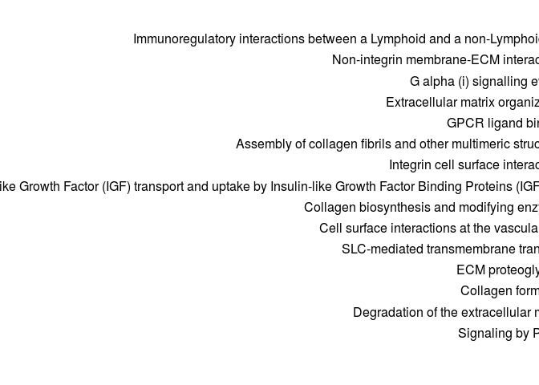
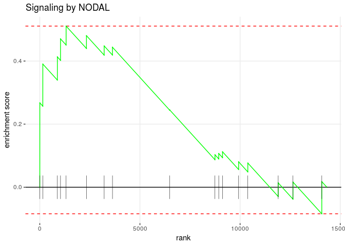
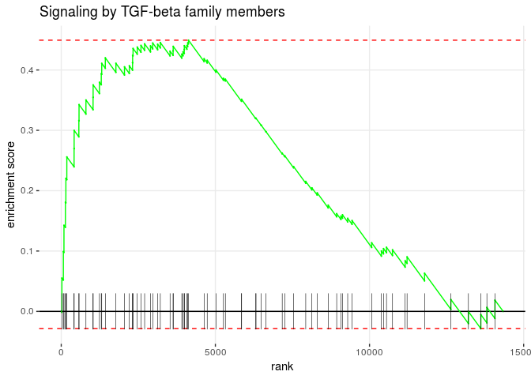

Pathway enrichment analysis, GEO75748
================
German Novakovskiy
August 21, 2018

Pathways
--------

``` r
x <- scan("~/ESC_RNA_seq/pathway_enrichment_analysis/ReactomePathways.tsv", what = "", sep = "\n")
x <- strsplit(x, "[ \t]+")
max.col <- max(sapply(x, length))

## specify col.names as ?read.table suggests
cn <- paste("V", 1:max.col, sep = "")
reactome_pathways <- read.table("~/ESC_RNA_seq/pathway_enrichment_analysis/ReactomePathways.tsv", fill = TRUE, 
                 col.names = cn, sep = '\t', quote = "")

reactome_pathways[1:5, 1:10] %>% kable()
```

| V1            | V2                                                              | V3     | V4      | V5     | V6     | V7     | V8      | V9     | V10    |
|:--------------|:----------------------------------------------------------------|:-------|:--------|:-------|:-------|:-------|:--------|:-------|:-------|
| R-HSA-164843  | 2-LTR circle formation                                          | BANF1  | HMGA1   | LIG4   | PSIP1  | XRCC4  | XRCC5   | XRCC6  | gag    |
| R-HSA-73843   | 5-Phosphoribose 1-diphosphate biosynthesis                      | PRPS1  | PRPS1L1 | PRPS2  |        |        |         |        |        |
| R-HSA-1971475 | A tetrasaccharide linker sequence is required for GAG synthesis | AGRN   | B3GALT6 | B3GAT1 | B3GAT2 | B3GAT3 | B4GALT7 | BCAN   | BGN    |
| R-HSA-5619084 | ABC transporter disorders                                       | ABCC8  | CFTR    | DERL1  | DERL2  | DERL3  | ERLEC1  | ERLIN1 | ERLIN2 |
| R-HSA-1369062 | ABC transporters in lipid homeostasis                           | ABCA10 | ABCA12  | ABCA2  | ABCA3  | ABCA5  | ABCA6   | ABCA7  | ABCA9  |

Analysis of GSE75748
--------------------

Load DE data:

``` r
load("~/ESC_RNA_seq/analysis_of_public_data/GSE75748/DEgenes_0h_96h_75748.Rdata")
```

Sorted log Fold Changes give us a sorted list:

``` r
ermineInputGeneScores <- DEgenes_0h_96h_75748 %>% 
  rownames_to_column("gene") %>%
  mutate(absolute_logFC = abs(logFC)) %>% 
  dplyr::select(gene, absolute_logFC) %>% 
  na.omit() %>% 
  as.data.frame() %>% 
  arrange(desc(absolute_logFC)) %>% 
  column_to_rownames("gene")

save(ermineInputGeneScores, file = "ermineInputScores75748.Rdata")
head(ermineInputGeneScores, 10) %>% kable() # print the first few rows
```

|        |  absolute\_logFC|
|--------|----------------:|
| HAPLN1 |        11.784025|
| CER1   |        11.705976|
| ERBB4  |        11.489550|
| COL3A1 |        11.315344|
| EOMES  |        10.183182|
| CRHBP  |        10.167101|
| COL5A1 |        10.017074|
| GATA6  |         9.741286|
| DKK4   |         9.730866|
| LUM    |         9.698491|

#### Reactome pathways

``` r
enrichmentResultReactome <- precRecall(scores = ermineInputGeneScores,
                               scoreColumn = 1,
                               bigIsBetter = TRUE,
                               aspects = "B",
                               iterations = 10000,
                               geneSetDescription = NULL,
                               customGeneSets = "~/ESC_RNA_seq/pathway_enrichment_analysis/ReactomePathways.tsv",
                               minClassSize = 15,
                               maxClassSize = 300)

enrichmentResultReactome$results %>% arrange(MFPvalue) %>% head(10) %>% kable()
```

| Name                                                         | ID            |  NumProbes|  NumGenes|   RawScore|    Pval|  CorrectedPvalue|  MFPvalue|  CorrectedMFPvalue|  Multifunctionality| Same as | GeneMembers                                                                                                                                                                                                                                                                                                                                                                                                                                                                                                                                                                                                                                                                                                                                                                                                                                                                                                                                                                                                                                                                                                                                                                                                                                                                                                                                                                                                                      |
|:-------------------------------------------------------------|:--------------|----------:|---------:|----------:|-------:|----------------:|---------:|------------------:|-------------------:|:--------|:---------------------------------------------------------------------------------------------------------------------------------------------------------------------------------------------------------------------------------------------------------------------------------------------------------------------------------------------------------------------------------------------------------------------------------------------------------------------------------------------------------------------------------------------------------------------------------------------------------------------------------------------------------------------------------------------------------------------------------------------------------------------------------------------------------------------------------------------------------------------------------------------------------------------------------------------------------------------------------------------------------------------------------------------------------------------------------------------------------------------------------------------------------------------------------------------------------------------------------------------------------------------------------------------------------------------------------------------------------------------------------------------------------------------------------|
| Extracellular matrix organization                            | R-HSA-1474244 |        224|       224|  0.0894020|  0.0000|        0.0000000|    0.0000|          0.0000000|               0.480| NA      | ACAN|ACTN1|ADAM10|ADAM12|ADAM15|ADAM17|ADAM19|ADAM8|ADAM9|ADAMTS1|ADAMTS16|ADAMTS18|ADAMTS2|ADAMTS3|ADAMTS4|ADAMTS5|ADAMTS8|ADAMTS9|AGRN|ASPN|BCAN|BGN|BMP1|BMP10|BMP2|BMP4|BMP7|BSG|CAPN1|CAPN10|CAPN12|CAPN13|CAPN14|CAPN2|CAPN3|CAPN5|CAPN6|CAPN7|CAPNS1|CASK|CASP3|CD151|CD44|CD47|CDH1|COL11A1|COL11A2|COL12A1|COL13A1|COL14A1|COL15A1|COL16A1|COL17A1|COL18A1|COL19A1|COL1A1|COL1A2|COL21A1|COL22A1|COL23A1|COL24A1|COL25A1|COL27A1|COL2A1|COL3A1|COL4A1|COL4A2|COL4A4|COL4A5|COL4A6|COL5A1|COL5A2|COL5A3|COL6A1|COL6A2|COL6A3|COL6A5|COL6A6|COL7A1|COL8A2|COL9A1|COL9A2|COL9A3|CRTAP|CTSB|CTSD|CTSK|CTSS|DAG1|DDR1|DDR2|DMD|DST|EFEMP1|EFEMP2|ELN|F11R|FBLN1|FBLN2|FBLN5|FBN1|FBN2|FBN3|FGB|FGF2|FMOD|FN1|FURIN|HAPLN1|HSPG2|HTRA1|ICAM1|ICAM3|ICAM4|ITGA1|ITGA11|ITGA2|ITGA2B|ITGA3|ITGA4|ITGA5|ITGA6|ITGA7|ITGA8|ITGA9|ITGAE|ITGAL|ITGAM|ITGAV|ITGAX|ITGB1|ITGB2|ITGB5|ITGB8|JAM2|JAM3|KDR|KLK7|KLKB1|LAMA1|LAMA2|LAMA3|LAMA4|LAMA5|LAMB1|LAMB2|LAMC1|LAMC2|LAMC3|LOX|LOXL1|LOXL2|LOXL3|LOXL4|LRP4|LTBP1|LTBP2|LTBP3|LTBP4|LUM|MATN3|MFAP1|MFAP2|MFAP3|MFAP4|MFAP5|MMP11|MMP14|MMP15|MMP16|MMP17|MMP19|MMP2|MMP24|MMP25|MMP9|NCAM1|NCAN|NCSTN|NID1|NID2|NRXN1|NTN4|OPTC|P4HA1|P4HA2|P4HB|PCOLCE|PDGFA|PDGFB|PECAM1|PLEC|PLOD1|PLOD2|PLOD3|PPIB|PRKCA|PRSS1|PSEN1|PTPRS|PXDN|SCUBE1|SCUBE3|SDC1|SDC2|SDC3|SDC4|SERPINE1|SERPINH1|SH3PXD2A|SPARC|SPP1|TGFB1|TGFB2|TGFB3|THBS1|TIMP1|TIMP2|TLL2|TNC|TNXB|TRAPPC4|VCAN|VTN| |
| Collagen formation                                           | R-HSA-1474290 |         67|        67|  0.0427348|  0.0000|        0.0000000|    0.0000|          0.0000000|               0.307| NA      | ADAMTS2|ADAMTS3|BMP1|CD151|COL11A1|COL11A2|COL12A1|COL13A1|COL14A1|COL15A1|COL16A1|COL17A1|COL18A1|COL19A1|COL1A1|COL1A2|COL21A1|COL22A1|COL23A1|COL24A1|COL25A1|COL27A1|COL2A1|COL3A1|COL4A1|COL4A2|COL4A4|COL4A5|COL4A6|COL5A1|COL5A2|COL5A3|COL6A1|COL6A2|COL6A3|COL6A5|COL6A6|COL7A1|COL8A2|COL9A1|COL9A2|COL9A3|CRTAP|CTSB|CTSS|DST|ITGA6|LAMA3|LAMC2|LOX|LOXL1|LOXL2|LOXL3|LOXL4|MMP9|P4HA1|P4HA2|P4HB|PCOLCE|PLEC|PLOD1|PLOD2|PLOD3|PPIB|PXDN|SERPINH1|TLL2|                                                                                                                                                                                                                                                                                                                                                                                                                                                                                                                                                                                                                                                                                                                                                                                                                                                                                                                                                              |
| Collagen chain trimerization                                 | R-HSA-8948216 |         38|        38|  0.0508651|  0.0000|        0.0000000|    0.0000|          0.0000000|               0.151| NA      | COL11A1|COL11A2|COL12A1|COL13A1|COL14A1|COL15A1|COL16A1|COL17A1|COL18A1|COL19A1|COL1A1|COL1A2|COL21A1|COL22A1|COL23A1|COL24A1|COL25A1|COL27A1|COL2A1|COL3A1|COL4A1|COL4A2|COL4A4|COL4A5|COL4A6|COL5A1|COL5A2|COL5A3|COL6A1|COL6A2|COL6A3|COL6A5|COL6A6|COL7A1|COL8A2|COL9A1|COL9A2|COL9A3|                                                                                                                                                                                                                                                                                                                                                                                                                                                                                                                                                                                                                                                                                                                                                                                                                                                                                                                                                                                                                                                                                                                                       |
| Collagen biosynthesis and modifying enzymes                  | R-HSA-1650814 |         52|        52|  0.0440767|  0.0001|        0.0222500|    0.0001|          0.0222500|               0.106| NA      | ADAMTS2|ADAMTS3|BMP1|COL11A1|COL11A2|COL12A1|COL13A1|COL14A1|COL15A1|COL16A1|COL17A1|COL18A1|COL19A1|COL1A1|COL1A2|COL21A1|COL22A1|COL23A1|COL24A1|COL25A1|COL27A1|COL2A1|COL3A1|COL4A1|COL4A2|COL4A4|COL4A5|COL4A6|COL5A1|COL5A2|COL5A3|COL6A1|COL6A2|COL6A3|COL6A5|COL6A6|COL7A1|COL8A2|COL9A1|COL9A2|COL9A3|CRTAP|P4HA1|P4HA2|P4HB|PCOLCE|PLOD1|PLOD2|PLOD3|PPIB|SERPINH1|TLL2|                                                                                                                                                                                                                                                                                                                                                                                                                                                                                                                                                                                                                                                                                                                                                                                                                                                                                                                                                                                                                                               |
| Assembly of collagen fibrils and other multimeric structures | R-HSA-2022090 |         46|        46|  0.0461852|  0.0001|        0.0178000|    0.0001|          0.0178000|               0.445| NA      | BMP1|CD151|COL11A1|COL11A2|COL15A1|COL18A1|COL1A1|COL1A2|COL24A1|COL27A1|COL2A1|COL3A1|COL4A1|COL4A2|COL4A4|COL4A5|COL4A6|COL5A1|COL5A2|COL5A3|COL6A1|COL6A2|COL6A3|COL6A5|COL6A6|COL7A1|COL8A2|COL9A1|COL9A2|COL9A3|CTSB|CTSS|DST|ITGA6|LAMA3|LAMC2|LOX|LOXL1|LOXL2|LOXL3|LOXL4|MMP9|PCOLCE|PLEC|PXDN|TLL2|                                                                                                                                                                                                                                                                                                                                                                                                                                                                                                                                                                                                                                                                                                                                                                                                                                                                                                                                                                                                                                                                                                                     |
| ECM proteoglycans                                            | R-HSA-3000178 |         44|        44|  0.0505244|  0.0001|        0.0148333|    0.0002|          0.0296667|               0.482| NA      | ACAN|AGRN|ASPN|BCAN|BGN|COL9A1|COL9A2|COL9A3|DAG1|FMOD|HAPLN1|HSPG2|ITGA2|ITGA2B|ITGA7|ITGA8|ITGA9|ITGAV|ITGAX|ITGB1|ITGB5|LAMA1|LAMA2|LAMA3|LAMA4|LAMA5|LAMB1|LAMB2|LAMC1|LRP4|LUM|MATN3|NCAM1|NCAN|PTPRS|SERPINE1|SPARC|TGFB1|TGFB2|TGFB3|TNC|TNXB|VCAN|VTN|                                                                                                                                                                                                                                                                                                                                                                                                                                                                                                                                                                                                                                                                                                                                                                                                                                                                                                                                                                                                                                                                                                                                                                   |
| GPCR ligand binding                                          | R-HSA-500792  |        188|       188|  0.0403702|  0.0002|        0.0254286|    0.0008|          0.1017143|               0.542| NA      | ADCYAP1R1|ADM|ADM2|ADORA1|ADORA2A|ADORA2B|ADRA1A|ADRA1D|ADRA2A|ADRA2B|ADRA2C|ADRB2|ANXA1|APLNR|APP|BDKRB2|C3|C5|CALCB|CALCR|CALCRL|CCKBR|CCL16|CCL28|CCL5|CCR6|CD55|CD97|CHRM3|CMKLR1|CNR1|CRHBP|CRHR1|CXCL1|CXCL12|CXCL16|CXCL3|CXCL5|CXCL6|CXCR2|CXCR4|CXCR5|CYSLTR2|DRD5|ECE1|ECE2|EDN1|EDNRA|EDNRB|F2R|F2RL1|F2RL2|F2RL3|FFAR2|FSHR|FZD1|FZD10|FZD2|FZD3|FZD4|FZD5|FZD6|FZD7|FZD8|FZD9|GABBR1|GABBR2|GAL|GNAS|GNB1|GNB2|GNB3|GNB4|GNB5|GNG10|GNG11|GNG12|GNG2|GNG3|GNG4|GNG5|GNG7|GNRH1|GPR132|GPR143|GPR183|GPR37|GPR37L1|GPR39|GPR4|GPR55|GPR65|GRM1|GRM2|GRM3|GRM4|GRM6|GRM8|GRP|GRPR|HCAR1|HCRTR2|HEBP1|HRH1|HRH2|HRH4|HTR1D|HTR1E|HTR2A|HTR2B|HTR2C|HTR7|IAPP|KEL|LPAR1|LPAR2|LPAR3|LPAR4|LPAR6|LTB4R|LTB4R2|MC1R|MC2R|MCHR1|NLN|NMB|NMU|NMUR1|NPFFR2|NPW|NPY|NPY1R|NPY5R|NTS|OPN3|OPRK1|OPRL1|OPRM1|OXER1|OXTR|P2RY1|P2RY14|PENK|PF4|POMC|PROK2|PROKR1|PSAP|PTAFR|PTCH1|PTCH2|PTGDR2|PTGER2|PTGER3|PTGER4|PTGFR|PTH1R|QRFPR|RAMP2|RGR|RLN2|S1PR1|S1PR2|S1PR3|S1PR5|SMO|SSTR1|SSTR2|SSTR5|TAC1|TAC3|TACR1|TACR3|TAS2R20|TAS2R30|TBXA2R|TRH|VIPR1|VIPR2|WNT11|WNT3|WNT3A|WNT4|WNT5A|WNT7B|WNT8A|WNT9B|XK|                                                                                                                                                                                                                                                                                                                |
| Cell surface interactions at the vascular wall               | R-HSA-202733  |         99|        99|  0.0291798|  0.0008|        0.0890000|    0.0011|          0.1223750|               0.506| NA      | ANGPT1|ANGPT2|APOB|ATP1B1|ATP1B2|ATP1B3|BSG|CAV1|CD177|CD44|CD47|CD48|CD58|CD74|CD84|CD99|CD99L2|CEACAM1|CEACAM5|CEACAM8|CXADR|EPCAM|ESAM|F11R|FN1|FYN|GAS6|GLG1|GP6|GPC1|GRB14|GRB2|GRB7|GYPA|GYPB|GYPC|HRAS|INPP5D|ITGA3|ITGA4|ITGA5|ITGA6|ITGAL|ITGAM|ITGAV|ITGAX|ITGB1|ITGB2|JAM2|JAM3|KRAS|L1CAM|LCK|LYN|MERTK|MIF|NRAS|OLR1|PECAM1|PICK1|PIK3CA|PIK3CB|PIK3R1|PIK3R2|PLCG1|PPIA|PPIL2|PROCR|PROS1|PTPN11|PTPN6|SDC1|SDC2|SDC3|SDC4|SELE|SELL|SHC1|SIRPA|SLC16A1|SLC16A3|SLC3A2|SLC7A10|SLC7A11|SLC7A5|SLC7A6|SLC7A7|SLC7A8|SOS1|SPN|SRC|TEK|TGFB1|THBD|TNFRSF10A|TNFRSF10B|TNFRSF10D|TSPAN7|YES1|                                                                                                                                                                                                                                                                                                                                                                                                                                                                                                                                                                                                                                                                                                                                                                                                                          |
| Signaling by NODAL                                           | R-HSA-1181150 |         17|        17|  0.0334941|  0.0025|        0.1711538|    0.0029|          0.2867778|               0.499| NA      | ACVR1B|ACVR1C|ACVR2A|ACVR2B|CER1|DAND5|FOXH1|FOXO3|FURIN|LEFTY1|LEFTY2|NODAL|PCSK6|SMAD2|SMAD3|SMAD4|TDGF1|                                                                                                                                                                                                                                                                                                                                                                                                                                                                                                                                                                                                                                                                                                                                                                                                                                                                                                                                                                                                                                                                                                                                                                                                                                                                                                                      |
| Scavenging by Class A Receptors                              | R-HSA-3000480 |         15|        15|  0.0367921|  0.0024|        0.1780000|    0.0032|          0.2848000|               0.433| NA      | APOB|APOE|CALR|COL1A1|COL1A2|COL3A1|COL4A1|COL4A2|COLEC11|COLEC12|FTH1|FTL|HSP90B1|MASP1|SCGB3A2|                                                                                                                                                                                                                                                                                                                                                                                                                                                                                                                                                                                                                                                                                                                                                                                                                                                                                                                                                                                                                                                                                                                                                                                                                                                                                                                                |

``` r
enrichmentResultReactome$results %>% 
  dplyr::select(Name, CorrectedPvalue, CorrectedMFPvalue) %>% 
  arrange(CorrectedMFPvalue) %>% 
  head(10) %>% 
  kable(align = "l", col.names = c("Pathway", "Corrected p-value", 
                                   "Corrected MF p-value"))
```

| Pathway                                                      | Corrected p-value | Corrected MF p-value |
|:-------------------------------------------------------------|:------------------|:---------------------|
| Collagen chain trimerization                                 | 0.0000000         | 0.0000000            |
| Collagen formation                                           | 0.0000000         | 0.0000000            |
| Extracellular matrix organization                            | 0.0000000         | 0.0000000            |
| Assembly of collagen fibrils and other multimeric structures | 0.0178000         | 0.0178000            |
| Collagen biosynthesis and modifying enzymes                  | 0.0222500         | 0.0222500            |
| ECM proteoglycans                                            | 0.0148333         | 0.0296667            |
| GPCR ligand binding                                          | 0.0254286         | 0.1017143            |
| Cell surface interactions at the vascular wall               | 0.0890000         | 0.1223750            |
| Integrin cell surface interactions                           | 0.1051818         | 0.2831818            |
| Scavenging by Class A Receptors                              | 0.1780000         | 0.2848000            |

#### Reactome pathways via ReactomPA

``` r
#converting symbols to EntrezID
geneSymbols <- rownames(ermineInputGeneScores)
geneEntrez <- bitr(geneSymbols, fromType="SYMBOL", toType="ENTREZID", OrgDb="org.Hs.eg.db")
```

    ## 'select()' returned 1:many mapping between keys and columns

    ## Warning in bitr(geneSymbols, fromType = "SYMBOL", toType = "ENTREZID",
    ## OrgDb = "org.Hs.eg.db"): 6.27% of input gene IDs are fail to map...

``` r
head(geneEntrez)
```

    ##   SYMBOL ENTREZID
    ## 1 HAPLN1     1404
    ## 2   CER1     9350
    ## 3  ERBB4     2066
    ## 4 COL3A1     1281
    ## 5  EOMES     8320
    ## 6  CRHBP     1393

``` r
ermineInputGeneScoresRPA <- ermineInputGeneScores %>%
  rownames_to_column("SYMBOL") %>%
  filter(SYMBOL %in% geneEntrez$SYMBOL)

inputGSEA <- merge(ermineInputGeneScoresRPA, geneEntrez, sort=FALSE)

inputGSEA <- inputGSEA %>%
  dplyr::select(absolute_logFC, ENTREZID) %>%
  column_to_rownames('ENTREZID')
```

Performing GSEA with the input:

``` r
#test2 variable contains data with absolute log fold change
#and entrez id
test2 <- inputGSEA$absolute_logFC
names(test2) <- rownames(inputGSEA)

y <- gsePathway(test2, nPerm=10000,
                pvalueCutoff=0.05,
                pAdjustMethod="BH", verbose=FALSE, minGSSize = 15, maxGSSize = 300)

dotplot(y, showCategory=15)
```



#### KEGG pathways

``` r
enrichmentResultKEGG <- precRecall(scores = ermineInputGeneScores,
                               scoreColumn = 1,
                               bigIsBetter = TRUE,
                               aspects = "B",
                               iterations = 10000,
                               geneSetDescription = NULL,
                               customGeneSets = "~/ESC_RNA_seq/pathway_enrichment_analysis/KeggPathways.gmt",
                               minClassSize = 15,
                               maxClassSize = 300)

enrichmentResultKEGG$results %>% arrange(MFPvalue) %>% head(10) %>% kable()
```

| Name                                        | ID                                              |  NumProbes|  NumGenes|   RawScore|    Pval|  CorrectedPvalue|  MFPvalue|  CorrectedMFPvalue|  Multifunctionality| Same as | GeneMembers                                                                                                                                                                                                                                                                                                                                                                                                                                                                                                                                                                                                                                                                                                                                                                                                                                                                                                                                                                                                                                                                                                                                                                                                                                                                                                                                                                                                                                                                                                                                                                                                                                                                                                     |
|:--------------------------------------------|:------------------------------------------------|----------:|---------:|----------:|-------:|----------------:|---------:|------------------:|-------------------:|:--------|:----------------------------------------------------------------------------------------------------------------------------------------------------------------------------------------------------------------------------------------------------------------------------------------------------------------------------------------------------------------------------------------------------------------------------------------------------------------------------------------------------------------------------------------------------------------------------------------------------------------------------------------------------------------------------------------------------------------------------------------------------------------------------------------------------------------------------------------------------------------------------------------------------------------------------------------------------------------------------------------------------------------------------------------------------------------------------------------------------------------------------------------------------------------------------------------------------------------------------------------------------------------------------------------------------------------------------------------------------------------------------------------------------------------------------------------------------------------------------------------------------------------------------------------------------------------------------------------------------------------------------------------------------------------------------------------------------------------|
| Kegg ecm receptor interaction               | KEGG\_ECM\_RECEPTOR\_INTERACTION                |         67|        67|  0.0891158|  0.0000|        0.0000000|    0.0000|          0.0000000|              0.1510| NA      | AGRN|CD36|CD44|CD47|COL11A1|COL11A2|COL1A1|COL1A2|COL2A1|COL3A1|COL4A1|COL4A2|COL4A4|COL4A6|COL5A1|COL5A2|COL5A3|COL6A1|COL6A2|COL6A3|COL6A6|DAG1|FN1|GP6|HMMR|HSPG2|ITGA1|ITGA11|ITGA2|ITGA2B|ITGA3|ITGA4|ITGA5|ITGA6|ITGA7|ITGA8|ITGA9|ITGAV|ITGB1|ITGB5|ITGB8|LAMA1|LAMA2|LAMA3|LAMA4|LAMA5|LAMB1|LAMB2|LAMC1|LAMC2|LAMC3|RELN|SDC1|SDC2|SDC3|SDC4|SPP1|SV2A|SV2B|THBS1|THBS2|THBS3|THBS4|TNC|TNXB|VTN|VWF|                                                                                                                                                                                                                                                                                                                                                                                                                                                                                                                                                                                                                                                                                                                                                                                                                                                                                                                                                                                                                                                                                                                                                                                                                                                                                                  |
| Kegg focal adhesion                         | KEGG\_FOCAL\_ADHESION                           |        177|       177|  0.0938682|  0.0000|        0.0000000|    0.0000|          0.0000000|              0.9840| NA      | ACTB|ACTG1|ACTN1|ACTN2|ACTN3|ACTN4|AKT1|AKT2|AKT3|ARHGAP35|ARHGAP5|BAD|BCAR1|BCL2|BIRC2|BIRC3|BRAF|CAPN2|CAV1|CAV2|CCND1|CCND2|CCND3|CDC42|COL11A1|COL11A2|COL1A1|COL1A2|COL2A1|COL3A1|COL4A1|COL4A2|COL4A4|COL4A6|COL5A1|COL5A2|COL5A3|COL6A1|COL6A2|COL6A3|COL6A6|CRK|CRKL|CTNNB1|DIAPH1|DOCK1|EGF|EGFR|ELK1|ERBB2|FLNA|FLNB|FLNC|FLT1|FLT4|FN1|FYN|GRB2|GSK3B|HGF|HRAS|IGF1|IGF1R|ILK|ITGA1|ITGA11|ITGA2|ITGA2B|ITGA3|ITGA4|ITGA5|ITGA6|ITGA7|ITGA8|ITGA9|ITGAV|ITGB1|ITGB5|ITGB8|JUN|KDR|LAMA1|LAMA2|LAMA3|LAMA4|LAMA5|LAMB1|LAMB2|LAMC1|LAMC2|LAMC3|MAP2K1|MAPK1|MAPK10|MAPK3|MAPK8|MAPK9|MET|MYL10|MYL12A|MYL12B|MYL5|MYL7|MYL9|MYLK|MYLK3|PAK1|PAK2|PAK3|PAK4|PAK6|PARVA|PARVB|PDGFA|PDGFB|PDGFC|PDGFD|PDGFRA|PDGFRB|PDPK1|PGF|PIK3CA|PIK3CB|PIK3CD|PIK3CG|PIK3R1|PIK3R2|PIK3R3|PIK3R5|PIP5K1C|PPP1CA|PPP1CB|PPP1CC|PPP1R12A|PRKCA|PRKCB|PRKCG|PTEN|PTK2|PXN|RAC1|RAC2|RAC3|RAF1|RAP1A|RAP1B|RAPGEF1|RELN|RHOA|ROCK1|ROCK2|SHC1|SHC2|SHC3|SOS1|SOS2|SPP1|SRC|THBS1|THBS2|THBS3|THBS4|TLN1|TLN2|TNC|TNXB|VASP|VAV2|VAV3|VCL|VEGFA|VEGFB|VEGFC|VTN|VWF|XIAP|ZYX|                                                                                                                                                                                                                                                                                                                                                                                                                                                                                                                                                                                                                                           |
| Kegg pathways in cancer                     | KEGG\_PATHWAYS\_IN\_CANCER                      |        292|       292|  0.0929992|  0.0009|        0.0291600|    0.0000|          0.0000000|              0.9950| NA      | ABL1|AKT1|AKT2|AKT3|APC|APPL1|AR|ARAF|ARNT|ARNT2|AXIN1|AXIN2|BAD|BAX|BCL2|BCL2L1|BCR|BID|BIRC2|BIRC3|BIRC5|BMP2|BMP4|BRAF|BRCA2|CASP3|CASP8|CASP9|CBL|CBLB|CBLC|CCDC6|CCND1|CCNE1|CCNE2|CDC42|CDH1|CDK2|CDK4|CDK6|CDKN1A|CDKN1B|CDKN2A|CDKN2B|CEBPA|CHUK|CKS1B|COL4A1|COL4A2|COL4A4|COL4A6|CREBBP|CRK|CRKL|CSF2RA|CSF3R|CTBP1|CTBP2|CTNNA1|CTNNA2|CTNNA3|CTNNB1|CUL2|CYCS|DAPK1|DAPK2|DAPK3|DCC|DVL1|DVL2|DVL3|E2F1|E2F2|E2F3|EGF|EGFR|EGLN1|EGLN2|EGLN3|EP300|EPAS1|ERBB2|ETS1|FADD|FAS|FGF1|FGF10|FGF11|FGF12|FGF13|FGF14|FGF17|FGF18|FGF19|FGF2|FGF20|FGF4|FGF5|FGF7|FGF8|FGF9|FGFR1|FGFR2|FGFR3|FH|FN1|FOS|FOXO1|FZD1|FZD10|FZD2|FZD3|FZD4|FZD5|FZD6|FZD7|FZD8|FZD9|GLI1|GLI2|GLI3|GRB2|GSK3B|GSTP1|HDAC1|HDAC2|HGF|HHIP|HIF1A|HRAS|HSP90AA1|HSP90AB1|HSP90B1|IGF1|IGF1R|IKBKB|IKBKG|IL6|ITGA2|ITGA2B|ITGA3|ITGA6|ITGAV|ITGB1|JAK1|JUN|JUP|KIT|KITLG|KRAS|LAMA1|LAMA2|LAMA3|LAMA4|LAMA5|LAMB1|LAMB2|LAMC1|LAMC2|LAMC3|LEF1|MAP2K1|MAP2K2|MAPK1|MAPK10|MAPK3|MAPK8|MAPK9|MAX|MDM2|MECOM|MET|MITF|MLH1|MMP2|MMP9|MSH2|MSH3|MSH6|MTOR|MYC|NCOA4|NFKB1|NFKB2|NFKBIA|NKX3-1|NOS2|NRAS|NTRK1|PDGFA|PDGFB|PDGFRA|PDGFRB|PGF|PIAS1|PIAS2|PIAS3|PIAS4|PIK3CA|PIK3CB|PIK3CD|PIK3CG|PIK3R1|PIK3R2|PIK3R3|PIK3R5|PLCG1|PLCG2|PLD1|PML|PPARD|PRKCA|PRKCB|PRKCG|PTCH1|PTCH2|PTEN|PTGS2|PTK2|RAC1|RAC2|RAC3|RAD51|RAF1|RALA|RALB|RALBP1|RALGDS|RARA|RARB|RASSF1|RASSF5|RB1|RBX1|RELA|RET|RHOA|RUNX1|RUNX1T1|RXRA|RXRB|RXRG|SKP2|SLC2A1|SMAD2|SMAD3|SMAD4|SMO|SOS1|SOS2|STAT1|STAT3|STAT5A|STAT5B|STK36|STK4|SUFU|TCEB1|TCEB2|TCF7|TCF7L1|TCF7L2|TFG|TGFA|TGFB1|TGFB2|TGFB3|TGFBR1|TGFBR2|TP53|TPM3|TPR|TRAF1|TRAF2|TRAF3|TRAF4|TRAF5|TRAF6|VEGFA|VEGFB|VEGFC|VHL|WNT11|WNT3|WNT3A|WNT4|WNT5A|WNT5B|WNT7B|WNT8A|WNT9B|XIAP| |
| Kegg wnt signaling pathway                  | KEGG\_WNT\_SIGNALING\_PATHWAY                   |        130|       130|  0.0579457|  0.0004|        0.0162000|    0.0002|          0.0081000|              0.4680| NA      | APC|AXIN1|AXIN2|BTRC|CACYBP|CAMK2D|CAMK2G|CCND1|CCND2|CCND3|CER1|CHD8|CHP|CHP2|CREBBP|CSNK1A1|CSNK1E|CSNK2A1|CSNK2A2|CSNK2B|CTBP1|CTBP2|CTNNB1|CTNNBIP1|CUL1|CXXC4|DAAM1|DAAM2|DKK1|DKK2|DKK4|DVL1|DVL2|DVL3|EP300|FBXW11|FOSL1|FRAT1|FRAT2|FZD1|FZD10|FZD2|FZD3|FZD4|FZD5|FZD6|FZD7|FZD8|FZD9|GSK3B|JUN|LEF1|LRP5|LRP6|MAP3K7|MAPK10|MAPK8|MAPK9|MYC|NFAT5|NFATC1|NFATC2|NFATC3|NFATC4|NKD1|NKD2|NLK|PLCB1|PLCB2|PLCB3|PLCB4|PORCN|PPARD|PPP2CA|PPP2CB|PPP2R1A|PPP2R1B|PPP2R5A|PPP2R5B|PPP2R5C|PPP2R5D|PPP2R5E|PPP3CA|PPP3CB|PPP3CC|PPP3R1|PRICKLE1|PRICKLE2|PRKACA|PRKACB|PRKCA|PRKCB|PRKCG|PRKX|PSEN1|RAC1|RAC2|RAC3|RBX1|RHOA|ROCK1|ROCK2|RUVBL1|SENP2|SFRP1|SFRP2|SFRP5|SIAH1|SKP1|SMAD2|SMAD3|SMAD4|SOX17|TBL1X|TBL1XR1|TCF7|TCF7L1|TCF7L2|TP53|VANGL1|VANGL2|WNT11|WNT3|WNT3A|WNT4|WNT5A|WNT5B|WNT7B|WNT8A|WNT9B|                                                                                                                                                                                                                                                                                                                                                                                                                                                                                                                                                                                                                                                                                                                                                                                                                                                                                        |
| Kegg mapk signaling pathway                 | KEGG\_MAPK\_SIGNALING\_PATHWAY                  |        232|       232|  0.0761862|  0.0026|        0.0601714|    0.0006|          0.0194400|              0.2470| NA      | AKT1|AKT2|AKT3|ARRB1|ARRB2|ATF2|ATF4|BDNF|BRAF|CACNA1A|CACNA1B|CACNA1C|CACNA1D|CACNA1E|CACNA1G|CACNA1H|CACNA2D1|CACNA2D2|CACNA2D3|CACNB1|CACNB2|CACNB3|CACNB4|CACNG4|CACNG7|CACNG8|CASP3|CDC25B|CDC42|CHP|CHP2|CHUK|CRK|CRKL|DAXX|DDIT3|DUSP1|DUSP10|DUSP14|DUSP16|DUSP2|DUSP3|DUSP4|DUSP5|DUSP6|DUSP7|DUSP8|DUSP9|ECSIT|EGF|EGFR|ELK1|ELK4|FAS|FGF1|FGF10|FGF11|FGF12|FGF13|FGF14|FGF17|FGF18|FGF19|FGF2|FGF20|FGF4|FGF5|FGF7|FGF8|FGF9|FGFR1|FGFR2|FGFR3|FGFR4|FLNA|FLNB|FLNC|FOS|GADD45A|GADD45B|GADD45G|GNA12|GNG12|GRB2|HRAS|HSPA1A|HSPA1B|HSPA1L|HSPA2|HSPA8|HSPB1|IKBKB|IKBKG|IL1A|IL1R1|JMJD7-PLA2G4B|JUN|JUND|KRAS|LAMTOR3|MAP2K1|MAP2K2|MAP2K3|MAP2K4|MAP2K5|MAP2K6|MAP2K7|MAP3K1|MAP3K11|MAP3K12|MAP3K13|MAP3K14|MAP3K2|MAP3K3|MAP3K4|MAP3K5|MAP3K6|MAP3K7|MAP3K8|MAP4K1|MAP4K2|MAP4K3|MAP4K4|MAPK1|MAPK10|MAPK11|MAPK12|MAPK13|MAPK14|MAPK3|MAPK7|MAPK8|MAPK8IP1|MAPK8IP2|MAPK8IP3|MAPK9|MAPKAPK2|MAPKAPK3|MAPKAPK5|MAPT|MAX|MECOM|MEF2C|MKNK1|MKNK2|MRAS|MYC|NF1|NFATC2|NFATC4|NFKB1|NFKB2|NLK|NR4A1|NRAS|NTF3|NTF4|NTRK1|NTRK2|PAK1|PAK2|PDGFA|PDGFB|PDGFRA|PDGFRB|PLA2G12A|PLA2G2A|PLA2G2D|PLA2G3|PLA2G4A|PLA2G4B|PLA2G4E|PLA2G6|PPM1A|PPM1B|PPP3CA|PPP3CB|PPP3CC|PPP3R1|PPP5C|PRKACA|PRKACB|PRKCA|PRKCB|PRKCG|PRKX|PTPN5|RAC1|RAC2|RAC3|RAF1|RAP1A|RAP1B|RAPGEF2|RASA1|RASA2|RASGRF2|RASGRP1|RASGRP2|RASGRP3|RASGRP4|RELA|RELB|RPS6KA1|RPS6KA2|RPS6KA3|RPS6KA4|RPS6KA5|RPS6KA6|RRAS|RRAS2|SOS1|SOS2|SRF|STK3|STK4|STMN1|TAB1|TAB2|TAOK1|TAOK2|TAOK3|TGFB1|TGFB2|TGFB3|TGFBR1|TGFBR2|TNFRSF1A|TP53|TRAF2|TRAF6|ZAK|                                                                                                                                                                              |
| Kegg axon guidance                          | KEGG\_AXON\_GUIDANCE                            |        122|       122|  0.0540464|  0.0002|        0.0108000|    0.0007|          0.0189000|              0.0376| NA      | ABL1|ABLIM1|ABLIM3|ARHGEF12|CDC42|CDK5|CFL1|CFL2|CHP|CHP2|CXCL12|CXCR4|DCC|DPYSL2|DPYSL5|EFNA1|EFNA2|EFNA3|EFNA4|EFNA5|EFNB1|EFNB2|EFNB3|EPHA1|EPHA2|EPHA3|EPHA4|EPHA5|EPHA6|EPHA7|EPHA8|EPHB1|EPHB2|EPHB3|EPHB4|EPHB6|FES|FYN|GNAI1|GNAI2|GNAI3|GSK3B|HRAS|ITGB1|KRAS|L1CAM|LIMK1|LIMK2|LRRC4C|MAPK1|MAPK3|MET|NCK1|NCK2|NFAT5|NFATC1|NFATC2|NFATC3|NFATC4|NRAS|NRP1|NTN1|NTN4|NTNG1|PAK1|PAK2|PAK3|PAK4|PAK6|PLXNA1|PLXNA2|PLXNA3|PLXNB1|PLXNB2|PLXNB3|PLXNC1|PPP3CA|PPP3CB|PPP3CC|PPP3R1|PTK2|RAC1|RAC2|RAC3|RASA1|RGS3|RHOA|RHOD|ROBO1|ROBO2|ROBO3|ROCK1|ROCK2|SEMA3A|SEMA3B|SEMA3C|SEMA3D|SEMA3E|SEMA3F|SEMA3G|SEMA4A|SEMA4B|SEMA4C|SEMA4D|SEMA4F|SEMA4G|SEMA5A|SEMA5B|SEMA6A|SEMA6B|SEMA6C|SEMA6D|SEMA7A|SLIT1|SLIT2|SLIT3|SRGAP1|SRGAP2|SRGAP3|UNC5B|UNC5C|UNC5D|                                                                                                                                                                                                                                                                                                                                                                                                                                                                                                                                                                                                                                                                                                                                                                                                                                                                                                                                        |
| Kegg cell adhesion molecules cams           | KEGG\_CELL\_ADHESION\_MOLECULES\_CAMS           |         98|        98|  0.0471463|  0.0012|        0.0324000|    0.0009|          0.0208286|              0.0806| NA      | ALCAM|CADM1|CADM3|CD226|CD276|CD28|CD34|CD4|CD40|CD58|CD6|CD99|CDH1|CDH2|CDH3|CDH4|CDH5|CLDN1|CLDN10|CLDN11|CLDN15|CLDN16|CLDN18|CLDN19|CLDN2|CLDN23|CLDN3|CLDN4|CLDN6|CLDN7|CNTN1|CNTNAP1|CNTNAP2|ESAM|F11R|GLG1|HLA-A|HLA-B|HLA-C|HLA-DMA|HLA-DOA|HLA-DPA1|HLA-DPB1|HLA-DQA1|HLA-DQB1|HLA-DRA|HLA-DRB1|HLA-DRB5|HLA-E|HLA-F|HLA-G|ICAM1|ICAM3|ICOSLG|ITGA4|ITGA6|ITGA8|ITGA9|ITGAL|ITGAM|ITGAV|ITGB1|ITGB2|ITGB8|JAM2|JAM3|L1CAM|MPZ|MPZL1|NCAM1|NCAM2|NEGR1|NEO1|NFASC|NLGN1|NLGN2|NLGN3|NLGN4X|NRCAM|NRXN1|NRXN2|NRXN3|OCLN|PECAM1|PTPRF|PTPRM|PVR|PVRL1|PVRL2|PVRL3|SDC1|SDC2|SDC3|SDC4|SELE|SELL|SPN|VCAN|                                                                                                                                                                                                                                                                                                                                                                                                                                                                                                                                                                                                                                                                                                                                                                                                                                                                                                                                                                                                                                                                                                |
| Kegg dilated cardiomyopathy                 | KEGG\_DILATED\_CARDIOMYOPATHY                   |         68|        68|  0.0324825|  0.0148|        0.2397600|    0.0035|          0.0708750|              0.8820| NA      | ACTB|ACTC1|ACTG1|ADCY1|ADCY2|ADCY3|ADCY5|ADCY6|ADCY7|ADCY8|ADCY9|ATP2A2|CACNA1C|CACNA1D|CACNA2D1|CACNA2D2|CACNA2D3|CACNB1|CACNB2|CACNB3|CACNB4|CACNG4|CACNG7|CACNG8|DAG1|DES|DMD|EMD|GNAS|IGF1|ITGA1|ITGA11|ITGA2|ITGA2B|ITGA3|ITGA4|ITGA5|ITGA6|ITGA7|ITGA8|ITGA9|ITGAV|ITGB1|ITGB5|ITGB8|LAMA2|LMNA|MYH6|PLN|PRKACA|PRKACB|PRKX|RYR2|SGCB|SGCD|SGCG|SLC8A1|TGFB1|TGFB2|TGFB3|TNNC1|TNNI3|TNNT2|TPM1|TPM2|TPM3|TPM4|TTN|                                                                                                                                                                                                                                                                                                                                                                                                                                                                                                                                                                                                                                                                                                                                                                                                                                                                                                                                                                                                                                                                                                                                                                                                                                                                                       |
| Kegg cytokine cytokine receptor interaction | KEGG\_CYTOKINE\_CYTOKINE\_RECEPTOR\_INTERACTION |        130|       130|  0.0490927|  0.0034|        0.0688500|    0.0041|          0.0738000|              0.0699| NA      | ACVR1|ACVR1B|ACVR2A|ACVR2B|ACVRL1|AMH|AMHR2|BMP2|BMP7|BMPR1A|BMPR1B|BMPR2|CCL16|CCL2|CCL22|CCL28|CCL5|CCR6|CD40|CLCF1|CNTF|CNTFR|CSF1|CSF2RA|CSF3R|CTF1|CXCL1|CXCL12|CXCL14|CXCL16|CXCL3|CXCL5|CXCL6|CXCR2|CXCR4|CXCR5|EDA|EDA2R|EDAR|EGF|EGFR|EPOR|FAS|FLT1|FLT4|GHR|HGF|IFNAR1|IFNAR2|IFNGR1|IFNGR2|IL10|IL10RB|IL11|IL11RA|IL12RB1|IL12RB2|IL13RA1|IL15|IL17RA|IL17RB|IL18|IL18R1|IL1A|IL1R1|IL1RAP|IL20RA|IL20RB|IL21R|IL23A|IL28RA|IL2RA|IL2RB|IL4R|IL6|IL6R|IL6ST|IL9R|INHBE|KDR|KIT|KITLG|LEPR|LIF|LIFR|LTBR|MET|MPL|NGFR|OSMR|PDGFA|PDGFB|PDGFC|PDGFRA|PDGFRB|PF4|PLEKHO2|PRLR|RELT|TGFB1|TGFB2|TGFB3|TGFBR1|TGFBR2|TNFRSF10A|TNFRSF10B|TNFRSF10C|TNFRSF10D|TNFRSF11A|TNFRSF11B|TNFRSF12A|TNFRSF19|TNFRSF1A|TNFRSF1B|TNFRSF21|TNFRSF25|TNFRSF8|TNFRSF9|TNFSF11|TNFSF12|TNFSF13|TNFSF13B|TNFSF14|TNFSF15|TNFSF4|TNFSF9|TSLP|VEGFA|VEGFB|VEGFC|                                                                                                                                                                                                                                                                                                                                                                                                                                                                                                                                                                                                                                                                                                                                                                                                                                                           |
| Kegg erbb signaling pathway                 | KEGG\_ERBB\_SIGNALING\_PATHWAY                  |         81|        81|  0.0329977|  0.0165|        0.2227500|    0.0044|          0.0712800|              0.9090| NA      | ABL1|ABL2|AKT1|AKT2|AKT3|ARAF|BAD|BRAF|CAMK2D|CAMK2G|CBL|CBLB|CBLC|CDKN1A|CDKN1B|CRK|CRKL|EGF|EGFR|EIF4EBP1|ELK1|ERBB2|ERBB3|ERBB4|EREG|GAB1|GRB2|GSK3B|HBEGF|HRAS|JUN|KRAS|MAP2K1|MAP2K2|MAP2K4|MAP2K7|MAPK1|MAPK10|MAPK3|MAPK8|MAPK9|MTOR|MYC|NCK1|NCK2|NRAS|NRG1|NRG2|NRG3|NRG4|PAK1|PAK2|PAK3|PAK4|PAK6|PIK3CA|PIK3CB|PIK3CD|PIK3CG|PIK3R1|PIK3R2|PIK3R3|PIK3R5|PLCG1|PLCG2|PRKCA|PRKCB|PRKCG|PTK2|RAF1|RPS6KB1|RPS6KB2|SHC1|SHC2|SHC3|SOS1|SOS2|SRC|STAT5A|STAT5B|TGFA|                                                                                                                                                                                                                                                                                                                                                                                                                                                                                                                                                                                                                                                                                                                                                                                                                                                                                                                                                                                                                                                                                                                                                                                                                                    |

``` r
enrichmentResultKEGG$results %>% 
  dplyr::select(Name, CorrectedPvalue, CorrectedMFPvalue) %>% 
  arrange(CorrectedMFPvalue) %>% 
  head(10) %>% 
  kable(align = "l", col.names = c("Pathway", "Corrected p-value", 
                                   "Corrected MF p-value"))
```

| Pathway                                     | Corrected p-value | Corrected MF p-value |
|:--------------------------------------------|:------------------|:---------------------|
| Kegg pathways in cancer                     | 0.0291600         | 0.0000000            |
| Kegg focal adhesion                         | 0.0000000         | 0.0000000            |
| Kegg ecm receptor interaction               | 0.0000000         | 0.0000000            |
| Kegg wnt signaling pathway                  | 0.0162000         | 0.0081000            |
| Kegg axon guidance                          | 0.0108000         | 0.0189000            |
| Kegg mapk signaling pathway                 | 0.0601714         | 0.0194400            |
| Kegg cell adhesion molecules cams           | 0.0324000         | 0.0208286            |
| Kegg dilated cardiomyopathy                 | 0.2397600         | 0.0708750            |
| Kegg erbb signaling pathway                 | 0.2227500         | 0.0712800            |
| Kegg cytokine cytokine receptor interaction | 0.0688500         | 0.0738000            |

#### Wikipathways

``` r
entrezScores <- as.data.frame(test2)
enrichmentResultWiki <- precRecall(scores = entrezScores,
                               scoreColumn = 1,
                               bigIsBetter = TRUE,
                               aspects = "B",
                               iterations = 10000,
                               geneSetDescription = NULL,
                               customGeneSets = "~/ESC_RNA_seq/pathway_enrichment_analysis/Wikipathways.gmt",
                               minClassSize = 15,
                               maxClassSize = 300)

enrichmentResultWiki$results %>% arrange(MFPvalue) %>% head(10) %>% kable()
```

| Name                                                 | ID                                                                                                             |  NumProbes|  NumGenes|   RawScore|    Pval|  CorrectedPvalue|  MFPvalue|  CorrectedMFPvalue|  Multifunctionality| Same as | GeneMembers                                                                                                                                                                                                                                                                                                                                                                                                                                                                                                                                                                                                                                                                                                                                                                                                                                                                                                                                                                                                                                                                                                                                                                                                                                                                                                                                                                                                                 |
|:-----------------------------------------------------|:---------------------------------------------------------------------------------------------------------------|----------:|---------:|----------:|-------:|----------------:|---------:|------------------:|-------------------:|:--------|:----------------------------------------------------------------------------------------------------------------------------------------------------------------------------------------------------------------------------------------------------------------------------------------------------------------------------------------------------------------------------------------------------------------------------------------------------------------------------------------------------------------------------------------------------------------------------------------------------------------------------------------------------------------------------------------------------------------------------------------------------------------------------------------------------------------------------------------------------------------------------------------------------------------------------------------------------------------------------------------------------------------------------------------------------------------------------------------------------------------------------------------------------------------------------------------------------------------------------------------------------------------------------------------------------------------------------------------------------------------------------------------------------------------------------|
| <http://www.wikipathways.org/instance/WP2406_r89157> | Cardiac Progenitor Differentiation%WikiPathways\_20180810%WP2406%Homo sapiens                                  |         48|        48|  0.0548905|  0.0000|        0.0000000|    0.0000|          0.0000000|             0.51200| NA      | 132625|140885|1432|145873|1482|2247|22943|2626|290|2932|3084|3170|3479|3481|3670|3791|3815|389421|4208|4624|4684|4838|4851|4920|5080|50805|5156|5460|55897|57057|6331|64321|649|652|6657|6862|70|7040|7070|7137|7139|7852|79727|79923|83881|89780|91807|9241|                                                                                                                                                                                                                                                                                                                                                                                                                                                                                                                                                                                                                                                                                                                                                                                                                                                                                                                                                                                                                                                                                                                                                               |
| <http://www.wikipathways.org/instance/WP2853_r88152> | Endoderm Differentiation%WikiPathways\_20180810%WP2853%Homo sapiens                                            |        134|       134|  0.0714845|  0.0000|        0.0000000|    0.0000|          0.0000000|             0.02230| NA      | 10128|10153|10451|10459|10973|1112|11166|11169|11190|115825|121536|123169|131405|140597|1488|1499|154091|1601|1789|1844|1846|1847|1994|2005|2131|2146|2186|22823|22943|23007|2308|23168|23181|23286|23373|23528|23576|23682|2626|2627|26610|26986|27244|27245|27324|2736|2908|29970|3087|31|3169|3170|3175|3198|324|3251|351|3720|3915|3975|4087|4088|4089|4830|4838|4851|5015|5077|5083|5087|5090|51176|51366|51460|51701|5460|54623|54799|54892|55809|55832|5606|57198|57669|57690|58499|5916|6001|63035|63978|6422|64321|6478|64864|655|657|6657|6671|6772|6875|6877|6925|6932|7040|708|7473|7478|7547|7709|79577|79668|79776|79923|79977|80155|80312|8320|83439|83595|83881|84295|8450|85363|85416|8554|8928|9044|9241|9350|9425|9573|9646|9682|9760|                                                                                                                                                                                                                                                                                                                                                                                                                                                                                                                                                                                                                                                                   |
| <http://www.wikipathways.org/instance/WP2857_r87780> | Mesodermal Commitment Pathway%WikiPathways\_20180810%WP2857%Homo sapiens                                       |        141|       141|  0.0573538|  0.0000|        0.0000000|    0.0002|          0.0198000|             0.10900| NA      | 10124|10155|10413|10451|10637|10973|11166|11169|11190|115825|121536|131405|1466|1488|154091|1789|2005|203228|2131|2132|2253|2260|22823|22943|2296|23007|2303|23181|23373|23499|23528|23576|2625|2627|26610|268|27244|27245|27324|28514|29072|29970|3064|31|3169|3170|3172|3251|343930|3717|3720|4086|4087|4088|4089|4091|4211|4780|4838|5080|5087|5090|51176|51366|51701|5308|5460|54799|54892|5515|5566|55704|5573|55809|57045|57198|57669|58499|5915|5916|595|6001|6169|63035|64321|643314|652|655|657|659|6615|6657|6722|688|6899|6911|6925|6926|7003|7044|708|7403|7473|7546|7547|7855|79668|79776|79923|79977|8030|80312|8091|8312|8313|8320|8322|8325|83439|83881|84159|84295|8450|8463|85363|85416|8553|8554|8646|8728|8928|89780|90|9113|92|9241|93|9314|9421|9573|9760|                                                                                                                                                                                                                                                                                                                                                                                                                                                                                                                                                                                                                                            |
| <http://www.wikipathways.org/instance/WP2911_r87847> | miRNA targets in ECM and membrane receptors%WikiPathways\_20180810%WP2911%Homo sapiens                         |         21|        21|  0.0698577|  0.0002|        0.0084860|    0.0002|          0.0148500|             0.24900| NA      | 1278|1281|1282|1284|1289|1290|1291|1292|1293|22801|2335|3672|3693|3910|3913|3915|50509|6383|7057|7058|7148|                                                                                                                                                                                                                                                                                                                                                                                                                                                                                                                                                                                                                                                                                                                                                                                                                                                                                                                                                                                                                                                                                                                                                                                                                                                                                                                 |
| <http://www.wikipathways.org/instance/WP4258_r97136> | LncRNA involvement in canonical Wnt signaling and colorectal cancer%WikiPathways\_20180810%WP4258%Homo sapiens |         79|        79|  0.0444369|  0.0001|        0.0059400|    0.0003|          0.0178200|             0.70200| NA      | 10023|1021|1024|11211|1452|1454|1457|1459|1460|147111|1487|1488|1499|1855|1856|1857|2146|22943|23401|2535|27121|27123|2932|3190|3192|324|3725|4040|4041|4609|467|4919|4920|51176|51701|5176|5328|54361|55506|56998|57680|59343|595|6259|6422|6423|6425|64321|64840|6885|6929|6932|6934|7020|7473|7474|7477|7481|7855|7976|80319|8061|81029|8312|8313|8321|8323|8324|8325|8326|83439|83999|85407|85409|8607|894|896|89780|9350|                                                                                                                                                                                                                                                                                                                                                                                                                                                                                                                                                                                                                                                                                                                                                                                                                                                                                                                                                                                              |
| <http://www.wikipathways.org/instance/WP428_r94896>  | Wnt Signaling Pathway%WikiPathways\_20180810%WP428%Homo sapiens                                                |         98|        98|  0.0476275|  0.0000|        0.0000000|    0.0008|          0.0396000|             0.78000| NA      | 10023|11211|144165|1452|1454|1457|1459|1460|147111|1487|1488|1499|166336|1855|1856|1857|2239|22943|23002|23236|23401|23500|2535|27121|27123|27130|2932|324|3725|387|4040|4041|4609|4772|4773|4775|4776|4919|4920|51176|51701|5176|5328|5330|5331|5332|54361|5530|5532|5533|5534|5578|5579|5582|5599|5601|56998|57216|57680|5879|59343|595|6259|6422|6423|6425|64321|64840|6885|6932|6934|7473|7474|7477|7481|7855|7976|80319|8061|81029|817|818|81839|8312|8321|8323|8324|8325|8326|83439|83999|85407|85409|894|896|89780|9350|9475|                                                                                                                                                                                                                                                                                                                                                                                                                                                                                                                                                                                                                                                                                                                                                                                                                                                                                        |
| <http://www.wikipathways.org/instance/WP2858_r94911> | Ectoderm Differentiation%WikiPathways\_20180810%WP2858%Homo sapiens                                            |        126|       126|  0.0425928|  0.0040|        0.0990000|    0.0011|          0.0466714|             0.00668| NA      | 10013|1004|1006|10253|10257|10486|10634|11177|114815|114822|1487|1496|1499|1501|151613|152789|166|1756|1896|1952|2263|2274|22871|2300|23133|23229|2534|25987|2627|2720|27324|27352|2737|29970|3148|3170|345557|3728|3801|3975|4061|4089|4204|440193|460|4609|4771|4772|4920|4926|4982|4990|5010|5077|5080|50937|51043|51222|51422|5150|51592|51701|51762|5236|5269|5292|5297|5362|5420|5452|54521|5467|54806|54828|54880|54898|54903|56899|56913|56963|57154|57476|57621|5783|5787|6016|60401|6238|6347|6386|6498|652|657|6622|6657|6781|6785|6907|6929|7020|7022|7226|7343|7593|7855|7903|79658|79731|79776|81576|8322|8325|83439|8345|83933|8473|8495|8675|8820|8835|8848|9079|91653|9687|9924|9935|                                                                                                                                                                                                                                                                                                                                                                                                                                                                                                                                                                                                                                                                                                                      |
| <http://www.wikipathways.org/instance/WP3967_r94301> | miR-509-3p alteration of YAP1/ECM axis%WikiPathways\_20180810%WP3967%Homo sapiens                              |         17|        17|  0.0495878|  0.0034|        0.0918000|    0.0035|          0.1299375|             0.24100| NA      | 10082|10413|1277|1281|1289|1909|2335|5090|6591|6678|7003|7004|7005|7058|7291|8463|9564|                                                                                                                                                                                                                                                                                                                                                                                                                                                                                                                                                                                                                                                                                                                                                                                                                                                                                                                                                                                                                                                                                                                                                                                                                                                                                                                                     |
| <http://www.wikipathways.org/instance/WP4172_r96453> | PI3K-Akt Signaling Pathway%WikiPathways\_20180810%WP4172%Homo sapiens                                          |        268|       268|  0.0783716|  0.0001|        0.0049500|    0.0047|          0.1551000|             0.97100| NA      | 10000|10018|100533105|10161|1017|1019|1021|1026|1027|10319|10488|10681|11140|1147|117145|118788|1277|1278|1280|1282|1284|1286|1287|1288|1291|1292|1293|1297|1298|1299|131873|1385|1386|1388|1435|1441|148327|1902|1942|1943|1944|1945|1946|1950|1956|1969|1975|1977|1978|2057|207|208|2149|2246|2247|2249|2250|2252|2253|2254|2255|2256|2257|2258|2259|2260|2261|2263|2264|22801|23035|2309|2321|23239|2324|2335|23533|23566|23678|2475|2538|256076|26281|2690|2782|2783|2784|2785|2786|2787|2788|2790|2791|28227|284|284217|2846|285|2885|2932|29941|2997|3082|3265|3320|3326|3371|3454|3455|3479|3480|3481|3551|3559|3560|3566|3569|3570|3643|3655|3667|3672|3673|3674|3675|3676|3678|3679|3680|3685|3688|3693|3696|3716|3717|3718|3791|3815|3845|3908|3909|3910|3911|3912|3913|3915|3918|4170|4193|4233|4254|4602|4609|468|4790|4804|4846|4893|4908|4909|4914|4915|5106|5154|5155|5156|5159|5170|5228|5290|5291|5293|5294|5295|5296|54331|54541|55012|5515|5516|5518|5519|5520|5521|5522|5523|5525|5526|5527|5528|5529|5562|5563|5578|55844|5585|5586|5594|5595|55970|56034|5604|5605|5618|5649|572|5728|5747|57521|5879|5894|5934|59345|595|596|5970|598|6009|6194|6198|6199|627|64223|6446|64764|6654|6655|6696|672|6794|6850|7010|7039|7057|7058|7059|7060|7097|7099|7148|7157|7184|7248|7249|7422|7423|7424|7448|7450|80310|842|8503|8516|8517|8817|8822|894|896|898|90993|9134|9170|9180|92579|9470|9586|9623|9965| |
| <http://www.wikipathways.org/instance/WP306_r97459>  | Focal Adhesion%WikiPathways\_20180810%WP306%Homo sapiens                                                       |        173|       173|  0.0577313|  0.0005|        0.0185625|    0.0048|          0.1425600|             0.97300| NA      | 10000|10188|10298|10319|103910|10398|10420|10451|10627|1277|1278|1280|1282|1284|1286|1288|1290|1292|1398|1399|1499|1729|1793|1950|1956|2002|2064|207|208|22801|2316|2317|2318|2321|2335|23396|2534|25759|284217|2885|2889|2909|2932|29780|3082|3265|329|330|331|3371|340156|3479|3480|3611|3655|3672|3673|3674|3675|3676|3678|3679|3680|3685|3688|3693|3696|3725|3791|387|3908|3909|3910|3911|3912|3913|3915|3918|394|4233|4636|4638|4659|4660|50509|5058|5062|5063|5154|5155|5156|5159|5170|5228|5290|5291|5293|5295|5296|53358|54776|5499|5500|5501|55359|55742|5578|5579|5582|5594|5595|5599|5601|5602|56034|5604|5649|56924|572|5728|5747|5753|5829|58498|5879|5880|5881|5894|5906|5908|595|596|60|6093|6464|6654|6696|6714|673|7057|7058|7059|7060|7094|71|7148|7294|7408|7410|7414|7422|7423|7424|7448|7450|7791|80310|81|824|83660|8503|8516|857|858|87|8711|894|896|91807|93408|9475|9564|998|                                                                                                                                                                                                                                                                                                                                                                                                                                                                                                                      |

``` r
enrichmentResultWiki$results %>% 
  dplyr::select(ID, CorrectedPvalue, CorrectedMFPvalue) %>% 
  arrange(CorrectedMFPvalue) %>% 
  head(10) %>% 
  kable(align = "l", col.names = c("ID", "Corrected p-value", 
                                   "Corrected MF p-value"))
```

| ID                                                                                                             | Corrected p-value | Corrected MF p-value |
|:---------------------------------------------------------------------------------------------------------------|:------------------|:---------------------|
| Endoderm Differentiation%WikiPathways\_20180810%WP2853%Homo sapiens                                            | 0.0000000         | 0.0000000            |
| Cardiac Progenitor Differentiation%WikiPathways\_20180810%WP2406%Homo sapiens                                  | 0.0000000         | 0.0000000            |
| miRNA targets in ECM and membrane receptors%WikiPathways\_20180810%WP2911%Homo sapiens                         | 0.0084860         | 0.0148500            |
| LncRNA involvement in canonical Wnt signaling and colorectal cancer%WikiPathways\_20180810%WP4258%Homo sapiens | 0.0059400         | 0.0178200            |
| Mesodermal Commitment Pathway%WikiPathways\_20180810%WP2857%Homo sapiens                                       | 0.0000000         | 0.0198000            |
| Wnt Signaling Pathway%WikiPathways\_20180810%WP428%Homo sapiens                                                | 0.0000000         | 0.0396000            |
| Ectoderm Differentiation%WikiPathways\_20180810%WP2858%Homo sapiens                                            | 0.0990000         | 0.0466714            |
| miR-509-3p alteration of YAP1/ECM axis%WikiPathways\_20180810%WP3967%Homo sapiens                              | 0.0918000         | 0.1299375            |
| Focal Adhesion%WikiPathways\_20180810%WP306%Homo sapiens                                                       | 0.0185625         | 0.1425600            |
| PI3K-Akt Signaling Pathway%WikiPathways\_20180810%WP4172%Homo sapiens                                          | 0.0049500         | 0.1551000            |

#### Trying to run everything with fgsea

``` r
# scores forfgsea
ermineInputGeneScoresFGSEA <- DEgenes_0h_96h_75748 %>% 
  rownames_to_column("gene") %>%
  #mutate(absolute_logFC = abs(logFC)) %>% 
  dplyr::select(gene, logFC) %>% 
  na.omit() %>% 
  as.data.frame() %>% 
  arrange(desc(logFC)) %>% 
  column_to_rownames("gene")


scoresFGSEA <- ermineInputGeneScoresFGSEA$logFC
names(scoresFGSEA) <- rownames(ermineInputGeneScoresFGSEA)

#for wikipathways
ermineInputGeneScoresWiki <- ermineInputGeneScoresFGSEA %>%
  rownames_to_column("SYMBOL") %>%
  filter(SYMBOL %in% geneEntrez$SYMBOL)

scoresWikiFGSEA <- merge(ermineInputGeneScoresWiki, geneEntrez, sort=FALSE)

scoresWikiFGSEA <- scoresWikiFGSEA %>%
  dplyr::select(logFC, ENTREZID) %>%
  column_to_rownames('ENTREZID')

scoresWiki <- scoresWikiFGSEA$logFC
names(scoresWiki) <- rownames(scoresWikiFGSEA)
```

Reactome:

``` r
pathwaysReactome <- gmtPathways("~/ESC_RNA_seq/pathway_enrichment_analysis/ReactomePathways.tsv")

#ES – enrichment score, same as in Broad GSEA implementation;
#NES – enrichment score normalized to mean enrichment of random samples of the same size;
fgseaRes <- fgsea(pathwaysReactome, scoresFGSEA, minSize=15, maxSize=300, nperm=10000)
reactomeIdPathway <- reactome_pathways[,c(1,2)]
colnames(reactomeIdPathway) <- c("pathway", "Description") 
fgseaRes <- merge(fgseaRes, reactomeIdPathway, sort = FALSE)

#activated pathways
activPathwaysReactome <- fgseaRes %>% 
  arrange(padj) %>% filter(NES > 0) %>% filter(padj <= 0.05) %>% 
  dplyr::select(c("pathway", "Description", "padj", "ES", "NES", "nMoreExtreme"))

#inactivated pathways
inactivPathwaysReactome <- fgseaRes %>% 
  arrange(padj) %>% filter(NES < 0) %>% filter(padj <= 0.05) %>%
  dplyr::select(c("pathway", "Description", "padj", "ES", "NES", "nMoreExtreme"))
```

There are 122 activated and 99 inactivated pathways in Reactome for this data set.

All active pathways:

``` r
activPathwaysReactome %>% kable()
```

| pathway       | Description                                                                                                                 |       padj|         ES|       NES|  nMoreExtreme|
|:--------------|:----------------------------------------------------------------------------------------------------------------------------|----------:|----------:|---------:|-------------:|
| R-HSA-2022090 | Assembly of collagen fibrils and other multimeric structures                                                                |  0.0044749|  0.7283185|  2.628556|             0|
| R-HSA-446353  | Cell-extracellular matrix interactions                                                                                      |  0.0044749|  0.7182118|  2.016368|             0|
| R-HSA-1650814 | Collagen biosynthesis and modifying enzymes                                                                                 |  0.0044749|  0.7385855|  2.738224|             0|
| R-HSA-8948216 | Collagen chain trimerization                                                                                                |  0.0044749|  0.7634609|  2.648517|             0|
| R-HSA-1474290 | Collagen formation                                                                                                          |  0.0044749|  0.6776757|  2.637770|             0|
| R-HSA-3000178 | ECM proteoglycans                                                                                                           |  0.0044749|  0.6610699|  2.366472|             0|
| R-HSA-2682334 | EPH-Ephrin signaling                                                                                                        |  0.0044749|  0.4759752|  1.953039|             0|
| R-HSA-3928665 | EPH-ephrin mediated repulsion of cells                                                                                      |  0.0044749|  0.5337292|  1.957043|             0|
| R-HSA-1566948 | Elastic fibre formation                                                                                                     |  0.0044749|  0.7033912|  2.440130|             0|
| R-HSA-1474244 | Extracellular matrix organization                                                                                           |  0.0044749|  0.5731726|  2.697941|             0|
| R-HSA-1630316 | Glycosaminoglycan metabolism                                                                                                |  0.0044749|  0.4540745|  1.922899|             0|
| R-HSA-2022928 | HS-GAG biosynthesis                                                                                                         |  0.0044749|  0.6647125|  2.170909|             0|
| R-HSA-216083  | Integrin cell surface interactions                                                                                          |  0.0044749|  0.6039705|  2.239154|             0|
| R-HSA-3000157 | Laminin interactions                                                                                                        |  0.0044749|  0.7271213|  2.193619|             0|
| R-HSA-2129379 | Molecules associated with elastic fibres                                                                                    |  0.0044749|  0.6600929|  2.114411|             0|
| R-HSA-375165  | NCAM signaling for neurite out-growth                                                                                       |  0.0044749|  0.5371061|  1.969425|             0|
| R-HSA-373752  | Netrin-1 signaling                                                                                                          |  0.0044749|  0.5903280|  2.123832|             0|
| R-HSA-8957275 | Post-translational protein phosphorylation                                                                                  |  0.0044749|  0.5257458|  2.114576|             0|
| R-HSA-4641263 | Regulation of FZD by ubiquitination                                                                                         |  0.0044749|  0.6978179|  2.053498|             0|
| R-HSA-381426  | Regulation of Insulin-like Growth Factor (IGF) transport and uptake by Insulin-like Growth Factor Binding Proteins (IGFBPs) |  0.0044749|  0.5506511|  2.246553|             0|
| R-HSA-194840  | Rho GTPase cycle                                                                                                            |  0.0044749|  0.5051381|  2.192949|             0|
| R-HSA-3000480 | Scavenging by Class A Receptors                                                                                             |  0.0044749|  0.7379233|  2.033948|             0|
| R-HSA-166520  | Signaling by NTRKs                                                                                                          |  0.0044749|  0.4273089|  1.775738|             0|
| R-HSA-9006936 | Signaling by TGF-beta family members                                                                                        |  0.0044749|  0.4308600|  1.798566|             0|
| R-HSA-194138  | Signaling by VEGF                                                                                                           |  0.0044749|  0.4735892|  1.952573|             0|
| R-HSA-195721  | Signaling by WNT                                                                                                            |  0.0044749|  0.3469942|  1.661301|             0|
| R-HSA-4420097 | VEGFA-VEGFR2 Pathway                                                                                                        |  0.0044749|  0.4483413|  1.821730|             0|
| R-HSA-1442490 | Collagen degradation                                                                                                        |  0.0060116|  0.6276843|  1.993268|             1|
| R-HSA-3781865 | Diseases of glycosylation                                                                                                   |  0.0060116|  0.4732345|  1.824342|             1|
| R-HSA-1638091 | Heparan sulfate/heparin (HS-GAG) metabolism                                                                                 |  0.0060116|  0.5241214|  1.921813|             1|
| R-HSA-193648  | NRAGE signals death through JNK                                                                                             |  0.0060116|  0.5086439|  1.877823|             1|
| R-HSA-76002   | Platelet activation, signaling and aggregation                                                                              |  0.0060116|  0.3604386|  1.674413|             1|
| R-HSA-445144  | Signal transduction by L1                                                                                                   |  0.0060116|  0.6762416|  2.015233|             1|
| R-HSA-9012852 | Signaling by NOTCH3                                                                                                         |  0.0060116|  0.5281833|  1.906253|             1|
| R-HSA-187037  | Signaling by NTRK1 (TRKA)                                                                                                   |  0.0060116|  0.4815732|  1.914545|             1|
| R-HSA-186797  | Signaling by PDGF                                                                                                           |  0.0060116|  0.5315963|  1.962560|             1|
| R-HSA-419037  | NCAM1 interactions                                                                                                          |  0.0081421|  0.6000930|  1.973856|             2|
| R-HSA-2173782 | Binding and Uptake of Ligands by Scavenger Receptors                                                                        |  0.0096017|  0.5875676|  1.918959|             3|
| R-HSA-532668  | N-glycan trimming in the ER and Calnexin/Calreticulin cycle                                                                 |  0.0096017|  0.5501566|  1.867039|             3|
| R-HSA-8941326 | RUNX2 regulates bone development                                                                                            |  0.0108570|  0.5991709|  1.919265|             4|
| R-HSA-9006925 | Intracellular signaling by second messengers                                                                                |  0.0112530|  0.3116984|  1.484679|             5|
| R-HSA-6811442 | Intra-Golgi and retrograde Golgi-to-ER traffic                                                                              |  0.0112820|  0.3497981|  1.593079|             5|
| R-HSA-3000171 | Non-integrin membrane-ECM interactions                                                                                      |  0.0128609|  0.5349328|  1.855732|             6|
| R-HSA-167044  | Signalling to RAS                                                                                                           |  0.0128609|  0.6543370|  1.925544|             6|
| R-HSA-6791312 | TP53 Regulates Transcription of Cell Cycle Genes                                                                            |  0.0128609|  0.4974348|  1.795279|             6|
| R-HSA-446203  | Asparagine N-linked glycosylation                                                                                           |  0.0133805|  0.3047148|  1.461063|             7|
| R-HSA-201681  | TCF dependent signaling in response to WNT                                                                                  |  0.0134967|  0.3304269|  1.515287|             7|
| R-HSA-373080  | Class B/2 (Secretin family receptors)                                                                                       |  0.0137792|  0.4858745|  1.790654|             7|
| R-HSA-373760  | L1CAM interactions                                                                                                          |  0.0137792|  0.4211236|  1.727970|             7|
| R-HSA-177929  | Signaling by EGFR                                                                                                           |  0.0138573|  0.5177724|  1.820420|             7|
| R-HSA-114608  | Platelet degranulation                                                                                                      |  0.0145445|  0.4036209|  1.669976|             8|
| R-HSA-5173214 | O-glycosylation of TSR domain-containing proteins                                                                           |  0.0145569|  0.5501771|  1.836431|             8|
| R-HSA-975138  | TRAF6 mediated induction of NFkB and MAP kinases upon TLR7/8 or 9 activation                                                |  0.0145569|  0.4335639|  1.719252|             8|
| R-HSA-202733  | Cell surface interactions at the vascular wall                                                                              |  0.0155681|  0.3884243|  1.624278|             9|
| R-HSA-1474228 | Degradation of the extracellular matrix                                                                                     |  0.0155681|  0.4355008|  1.746611|             9|
| R-HSA-416482  | G alpha (12/13) signalling events                                                                                           |  0.0155681|  0.4359478|  1.733156|             9|
| R-HSA-174824  | Plasma lipoprotein assembly, remodeling, and clearance                                                                      |  0.0155681|  0.4999388|  1.798638|             9|
| R-HSA-166058  | MyD88:Mal cascade initiated on plasma membrane                                                                              |  0.0162587|  0.4297435|  1.717462|            10|
| R-HSA-181438  | Toll Like Receptor 2 (TLR2) Cascade                                                                                         |  0.0162587|  0.4297435|  1.717462|            10|
| R-HSA-168179  | Toll Like Receptor TLR1:TLR2 Cascade                                                                                        |  0.0162587|  0.4297435|  1.717462|            10|
| R-HSA-168188  | Toll Like Receptor TLR6:TLR2 Cascade                                                                                        |  0.0162587|  0.4297435|  1.717462|            10|
| R-HSA-983231  | Factors involved in megakaryocyte development and platelet production                                                       |  0.0173676|  0.3718958|  1.580929|            11|
| R-HSA-1793185 | Chondroitin sulfate/dermatan sulfate metabolism                                                                             |  0.0184492|  0.4935434|  1.775629|            12|
| R-HSA-187687  | Signalling to ERKs                                                                                                          |  0.0198333|  0.5541000|  1.822574|            13|
| R-HSA-201451  | Signaling by BMP                                                                                                            |  0.0220646|  0.5650694|  1.810031|            15|
| R-HSA-168138  | Toll Like Receptor 9 (TLR9) Cascade                                                                                         |  0.0220646|  0.4205400|  1.680681|            15|
| R-HSA-975155  | MyD88 dependent cascade initiated on endosome                                                                               |  0.0228482|  0.4234219|  1.683358|            16|
| R-HSA-5173105 | O-linked glycosylation                                                                                                      |  0.0228482|  0.4138542|  1.659796|            16|
| R-HSA-168181  | Toll Like Receptor 7/8 (TLR7/8) Cascade                                                                                     |  0.0228482|  0.4234219|  1.683358|            16|
| R-HSA-5083635 | Defective B3GALTL causes Peters-plus syndrome (PpS)                                                                         |  0.0236168|  0.5402894|  1.788481|            17|
| R-HSA-2173789 | TGF-beta receptor signaling activates SMADs                                                                                 |  0.0236168|  0.5311681|  1.772981|            17|
| R-HSA-9013507 | NOTCH3 Activation and Transmission of Signal to the Nucleus                                                                 |  0.0244700|  0.5749506|  1.792340|            18|
| R-HSA-5654736 | Signaling by FGFR1                                                                                                          |  0.0244700|  0.4818392|  1.724869|            18|
| R-HSA-901042  | Calnexin/calreticulin cycle                                                                                                 |  0.0250408|  0.5631319|  1.788276|            19|
| R-HSA-975871  | MyD88 cascade initiated on plasma membrane                                                                                  |  0.0250408|  0.4215862|  1.665262|            19|
| R-HSA-168142  | Toll Like Receptor 10 (TLR10) Cascade                                                                                       |  0.0250408|  0.4215862|  1.665262|            19|
| R-HSA-168176  | Toll Like Receptor 5 (TLR5) Cascade                                                                                         |  0.0250408|  0.4215862|  1.665262|            19|
| R-HSA-4791275 | Signaling by WNT in cancer                                                                                                  |  0.0258355|  0.5181554|  1.740585|            20|
| R-HSA-445355  | Smooth Muscle Contraction                                                                                                   |  0.0258355|  0.5442570|  1.790198|            20|
| R-HSA-6785807 | Interleukin-4 and Interleukin-13 signaling                                                                                  |  0.0275362|  0.3982062|  1.622216|            22|
| R-HSA-3906995 | Diseases associated with O-glycosylation of proteins                                                                        |  0.0280163|  0.4812229|  1.691917|            22|
| R-HSA-76005   | Response to elevated platelet cytosolic Ca2+                                                                                |  0.0283486|  0.3742111|  1.562093|            23|
| R-HSA-8856828 | Clathrin-mediated endocytosis                                                                                               |  0.0289169|  0.3552260|  1.534734|            24|
| R-HSA-1257604 | PIP3 activates AKT signaling                                                                                                |  0.0290237|  0.3007838|  1.414141|            25|
| R-HSA-9006927 | Signaling by Non-Receptor Tyrosine Kinases                                                                                  |  0.0290237|  0.4502406|  1.662209|            24|
| R-HSA-8848021 | Signaling by PTK6                                                                                                           |  0.0290237|  0.4502406|  1.662209|            24|
| R-HSA-450294  | MAP kinase activation                                                                                                       |  0.0309557|  0.4316288|  1.652122|            26|
| R-HSA-73887   | Death Receptor Signalling                                                                                                   |  0.0310663|  0.3502082|  1.513315|            27|
| R-HSA-5637810 | Constitutive Signaling by EGFRvIII                                                                                          |  0.0347166|  0.6375233|  1.757214|            30|
| R-HSA-5637812 | Signaling by EGFRvIII in Cancer                                                                                             |  0.0347166|  0.6375233|  1.757214|            30|
| R-HSA-3238698 | WNT ligand biogenesis and trafficking                                                                                       |  0.0347166|  0.6375556|  1.757303|            30|
| R-HSA-500792  | GPCR ligand binding                                                                                                         |  0.0357641|  0.3085434|  1.420003|            33|
| R-HSA-450282  | MAPK targets/ Nuclear events mediated by MAP kinases                                                                        |  0.0369651|  0.5272602|  1.734291|            33|
| R-HSA-448424  | Interleukin-17 signaling                                                                                                    |  0.0370333|  0.4182031|  1.612193|            33|
| R-HSA-6802949 | Signaling by RAS mutants                                                                                                    |  0.0377611|  0.4707044|  1.654935|            34|
| R-HSA-2871796 | FCERI mediated MAPK activation                                                                                              |  0.0384149|  0.5484671|  1.741707|            35|
| R-HSA-8862803 | Deregulated CDK5 triggers multiple neurodegenerative pathways in Alzheimer's disease models                                 |  0.0384164|  0.5905766|  1.759947|            36|
| R-HSA-8863678 | Neurodegenerative Diseases                                                                                                  |  0.0384164|  0.5905766|  1.759947|            36|
| R-HSA-937061  | TRIF(TICAM1)-mediated TLR4 signaling                                                                                        |  0.0384164|  0.3930341|  1.587084|            36|
| R-HSA-109606  | Intrinsic Pathway for Apoptosis                                                                                             |  0.0389827|  0.4738608|  1.658860|            37|
| R-HSA-5357769 | Caspase activation via extrinsic apoptotic signalling pathway                                                               |  0.0390386|  0.6021679|  1.744618|            37|
| R-HSA-3928664 | Ephrin signaling                                                                                                            |  0.0397794|  0.5981383|  1.760166|            39|
| R-HSA-397795  | G-protein beta:gamma signalling                                                                                             |  0.0397794|  0.5633308|  1.738464|            39|
| R-HSA-166166  | MyD88-independent TLR4 cascade                                                                                              |  0.0397794|  0.3903218|  1.577483|            39|
| R-HSA-168164  | Toll Like Receptor 3 (TLR3) Cascade                                                                                         |  0.0397794|  0.3903218|  1.577483|            39|
| R-HSA-5683057 | MAPK family signaling cascades                                                                                              |  0.0401010|  0.2957734|  1.401481|            42|
| R-HSA-5674400 | Constitutive Signaling by AKT1 E17K in Cancer                                                                               |  0.0407947|  0.5410218|  1.705160|            41|
| R-HSA-3928662 | EPHB-mediated forward signaling                                                                                             |  0.0415139|  0.5068552|  1.691828|            42|
| R-HSA-6804115 | TP53 regulates transcription of additional cell cycle genes whose exact role in the p53 pathway remain uncertain            |  0.0418361|  0.5888055|  1.732702|            43|
| R-HSA-204998  | Cell death signalling via NRAGE, NRIF and NADE                                                                              |  0.0431201|  0.4093512|  1.593349|            45|
| R-HSA-1500931 | Cell-Cell communication                                                                                                     |  0.0431201|  0.3596496|  1.507659|            46|
| R-HSA-8940973 | RUNX2 regulates osteoblast differentiation                                                                                  |  0.0431201|  0.5791477|  1.725888|            45|
| R-HSA-1236394 | Signaling by ERBB4                                                                                                          |  0.0437519|  0.4729765|  1.640800|            46|
| R-HSA-8943724 | Regulation of PTEN gene transcription                                                                                       |  0.0442945|  0.4251492|  1.594310|            47|
| R-HSA-6807878 | COPI-mediated anterograde transport                                                                                         |  0.0447388|  0.3899728|  1.558520|            50|
| R-HSA-2894862 | Constitutive Signaling by NOTCH1 HD+PEST Domain Mutants                                                                     |  0.0447388|  0.4216026|  1.585651|            50|
| R-HSA-2644606 | Constitutive Signaling by NOTCH1 PEST Domain Mutants                                                                        |  0.0447388|  0.4216026|  1.585651|            50|
| R-HSA-2219528 | PI3K/AKT Signaling in Cancer                                                                                                |  0.0447388|  0.3860014|  1.552517|            51|
| R-HSA-373755  | Semaphorin interactions                                                                                                     |  0.0447388|  0.4176251|  1.588241|            48|
| R-HSA-2894858 | Signaling by NOTCH1 HD+PEST Domain Mutants in Cancer                                                                        |  0.0447388|  0.4216026|  1.585651|            50|
| R-HSA-2644602 | Signaling by NOTCH1 PEST Domain Mutants in Cancer                                                                           |  0.0447388|  0.4216026|  1.585651|            50|
| R-HSA-2644603 | Signaling by NOTCH1 in Cancer                                                                                               |  0.0447388|  0.4216026|  1.585651|            50|

``` r
#genes that are involved in signaling by Nodal (activin mimicks it) are enriched at the beginning of the list;
#means that this pathway is activated
plotEnrichment(pathwaysReactome[["R-HSA-1181150"]], scoresFGSEA) + labs(title="Signaling by NODAL")
```



KEGG:

``` r
pathwaysKEGG <- gmtPathways("~/ESC_RNA_seq/pathway_enrichment_analysis/KeggPathways.gmt")

fgseaRes <- fgsea(pathwaysKEGG, scoresFGSEA, minSize=15, maxSize=300, nperm=10000)

#activated pathways
activPathwaysKEGG <- fgseaRes %>% arrange(padj) %>% filter(NES > 0) %>% filter(padj <= 0.05)

#inactivated pathways
inactivPathwaysKEGG <- fgseaRes %>% arrange(padj) %>% filter(NES < 0) %>% filter(padj <= 0.05)
```

There are 47 activated and 15 inactivated pathways in Reactome for this data set.

All active pathways:

``` r
activPathwaysKEGG
```

    ##                                                      pathway         pval
    ## 1                                KEGG_MAPK_SIGNALING_PATHWAY 0.0001834189
    ## 2                                           KEGG_ENDOCYTOSIS 0.0001867414
    ## 3                                 KEGG_WNT_SIGNALING_PATHWAY 0.0001888931
    ## 4                                         KEGG_AXON_GUIDANCE 0.0001889288
    ## 5                                        KEGG_FOCAL_ADHESION 0.0001868460
    ## 6                              KEGG_ECM_RECEPTOR_INTERACTION 0.0001912412
    ## 7                        KEGG_NEUROTROPHIN_SIGNALING_PATHWAY 0.0001893939
    ## 8                                         KEGG_MELANOGENESIS 0.0001922338
    ## 9                                    KEGG_PATHWAYS_IN_CANCER 0.0001820167
    ## 10                                    KEGG_COLORECTAL_CANCER 0.0001918281
    ## 11                                    KEGG_PANCREATIC_CANCER 0.0001910585
    ## 12                                 KEGG_BASAL_CELL_CARCINOMA 0.0001921599
    ## 13                             KEGG_CHRONIC_MYELOID_LEUKEMIA 0.0001917546
    ## 14                               KEGG_SMALL_CELL_LUNG_CANCER 0.0001923077
    ## 15                      KEGG_HYPERTROPHIC_CARDIOMYOPATHY_HCM 0.0001910220
    ## 16                               KEGG_ERBB_SIGNALING_PATHWAY 0.0003842459
    ## 17                           KEGG_TGF_BETA_SIGNALING_PATHWAY 0.0003846154
    ## 18                     KEGG_REGULATION_OF_ACTIN_CYTOSKELETON 0.0003737619
    ## 19             KEGG_VASOPRESSIN_REGULATED_WATER_REABSORPTION 0.0003852080
    ## 20                                 KEGG_RENAL_CELL_CARCINOMA 0.0003816066
    ## 21                               KEGG_DILATED_CARDIOMYOPATHY 0.0003816066
    ## 22                           KEGG_HEDGEHOG_SIGNALING_PATHWAY 0.0005762582
    ## 23                            KEGG_INSULIN_SIGNALING_PATHWAY 0.0005667863
    ## 24                               KEGG_GNRH_SIGNALING_PATHWAY 0.0005767013
    ## 25                               KEGG_ACUTE_MYELOID_LEUKEMIA 0.0011481056
    ## 26                          KEGG_CHEMOKINE_SIGNALING_PATHWAY 0.0013157895
    ## 27       KEGG_GLYCOSAMINOGLYCAN_BIOSYNTHESIS_HEPARAN_SULFATE 0.0019801980
    ## 28                               KEGG_MTOR_SIGNALING_PATHWAY 0.0019256692
    ## 29 KEGG_ARRHYTHMOGENIC_RIGHT_VENTRICULAR_CARDIOMYOPATHY_ARVC 0.0021125408
    ## 30                 KEGG_TOLL_LIKE_RECEPTOR_SIGNALING_PATHWAY 0.0036252624
    ## 31                                             KEGG_LYSOSOME 0.0038138825
    ## 32                                       KEGG_PRION_DISEASES 0.0039800995
    ## 33                               KEGG_VEGF_SIGNALING_PATHWAY 0.0043884755
    ## 34              KEGG_PROGESTERONE_MEDIATED_OOCYTE_MATURATION 0.0045985821
    ## 35                                            KEGG_APOPTOSIS 0.0065384615
    ## 36                    KEGG_T_CELL_RECEPTOR_SIGNALING_PATHWAY 0.0068807339
    ## 37                                   KEGG_ENDOMETRIAL_CANCER 0.0070826953
    ## 38                        KEGG_INOSITOL_PHOSPHATE_METABOLISM 0.0082486092
    ## 39                      KEGG_FC_EPSILON_RI_SIGNALING_PATHWAY 0.0080567811
    ## 40                           KEGG_NON_SMALL_CELL_LUNG_CANCER 0.0080413555
    ## 41                   KEGG_VASCULAR_SMOOTH_MUSCLE_CONTRACTION 0.0086256469
    ## 42                KEGG_PHOSPHATIDYLINOSITOL_SIGNALING_SYSTEM 0.0092343209
    ## 43                                      KEGG_PROSTATE_CANCER 0.0098114659
    ## 44                                       KEGG_BLADDER_CANCER 0.0134822804
    ## 45                           KEGG_HEMATOPOIETIC_CELL_LINEAGE 0.0155589704
    ## 46                                         KEGG_GAP_JUNCTION 0.0166443467
    ## 47                      KEGG_ADIPOCYTOKINE_SIGNALING_PATHWAY 0.0174938201
    ##           padj        ES      NES nMoreExtreme size
    ## 1  0.002023261 0.3649497 1.726529            0  232
    ## 2  0.002023261 0.3778583 1.717000            0  168
    ## 3  0.002023261 0.4658496 2.035298            0  130
    ## 4  0.002023261 0.4539690 1.964119            0  122
    ## 5  0.002023261 0.5517971 2.525327            0  177
    ## 6  0.002023261 0.6864207 2.678064            0   67
    ## 7  0.002023261 0.5058686 2.172708            0  117
    ## 8  0.002023261 0.4873528 1.958847            0   80
    ## 9  0.002023261 0.4080179 1.983492            0  292
    ## 10 0.002023261 0.5189777 1.989813            0   61
    ## 11 0.002023261 0.5206546 2.042265            0   69
    ## 12 0.002023261 0.6165568 2.190222            0   43
    ## 13 0.002023261 0.5024482 1.988304            0   72
    ## 14 0.002023261 0.5145797 2.080115            0   82
    ## 15 0.002023261 0.4956741 1.915302            0   63
    ## 16 0.002729952 0.4471755 1.803404            1   81
    ## 17 0.002729952 0.4493235 1.793483            1   76
    ## 18 0.002729952 0.3536441 1.619401            1  178
    ## 19 0.002729952 0.5789300 2.005848            1   38
    ## 20 0.002729952 0.4768893 1.866667            1   68
    ## 21 0.002729952 0.4723732 1.848990            1   68
    ## 22 0.003481567 0.5382415 1.901112            2   42
    ## 23 0.003481567 0.3818684 1.652172            2  122
    ## 24 0.003481567 0.4203573 1.689568            2   80
    ## 25 0.006453145 0.4792117 1.781957            5   53
    ## 26 0.007149123 0.3639969 1.586423            6  127
    ## 27 0.010086634 0.5890263 1.829939            9   24
    ## 28 0.010086634 0.4843856 1.770621            9   49
    ## 29 0.010434671 0.4456180 1.702184           10   60
    ## 30 0.017379934 0.4177962 1.635361           18   68
    ## 31 0.017761796 0.3674954 1.565771           19  112
    ## 32 0.018021006 0.5582828 1.763005           19   26
    ## 33 0.018739222 0.4112727 1.609827           22   68
    ## 34 0.018739222 0.3950158 1.583614           23   78
    ## 35 0.025757371 0.3916074 1.563109           33   76
    ## 36 0.025757371 0.3747279 1.534859           35   87
    ## 37 0.025757371 0.4409380 1.625499           36   51
    ## 38 0.026363202 0.4388364 1.611007           42   50
    ## 39 0.026363202 0.4195961 1.608774           41   61
    ## 40 0.026363202 0.4341424 1.620984           41   54
    ## 41 0.027038086 0.3676556 1.513785           44   90
    ## 42 0.028399893 0.3982205 1.564845           47   70
    ## 43 0.029533899 0.3724379 1.513336           50   84
    ## 44 0.038554591 0.4578896 1.586473           69   38
    ## 45 0.042268536 0.4481770 1.582996           80   42
    ## 46 0.044475877 0.3715653 1.487101           86   77
    ## 47 0.045991817 0.3998956 1.524471           91   59
    ##                                                                                                                                                                                                                                                                                                                                                                                                                                                                                                                                                                                                                                                                                                                    leadingEdge
    ## 1  FGF17, TGFB1, DUSP4, FLNC, RASGRP3, FGF8, DUSP10, MAPKAPK2, MEF2C, PPP3R1, RAC3, NFKB2, MAPK8, PRKACA, GADD45A, IL1R1, JUN, MAPK10, TAOK2, MAP2K1, ARRB1, AKT1, PDGFRA, MAP3K11, RPS6KA4, MAP3K8, FLNA, GADD45B, PPP3CC, JUND, NTRK1, FGFR3, ELK1, CACNA1H, DUSP5, EGF, AKT2, DUSP8, MECOM, FGF10, RAP1A, IL1A, PPP3CB, HRAS, MAPK8IP3, PDGFRB, FLNB, CACNA1C, MAP2K7, MAP2K5, TNFRSF1A, MAPK12, CACNA1G, EGFR, MAPK11, HSPA1A, MAPKAPK5, NFATC4, HSPB1, CACNA2D1, PLA2G6, ZAK, CACNB3, MAP3K3, TGFB2, CACNG7, RPS6KA6, MAPK14, MAP3K4, NTRK2, MAP4K4, MAP3K6, SOS2, AKT3, MAP4K2, NF1, DUSP14, MKNK2, MAPK9, KRAS, MRAS, MAPK7, SRF, HSPA1B, MAP2K4, CDC25B, CACNG4, MAPK3, RELA, RPS6KA3, PAK2, PRKX, TAB2, CACNA1B, NRAS
    ## 2                                                                                                                                                                                                                                           ERBB4, CXCR4, EPN1, SRC, DNAJC6, PLD1, ARRB1, PDGFRA, CHMP4B, CLTB, RAB5C, ADRBK1, GRK5, NTRK1, EHD3, PIP5K1C, FGFR3, KDR, EGF, SMAP2, AP2A1, PIP5K1A, ARFGAP3, VPS37B, DNM2, SH3GLB2, EHD1, ACAP3, SMURF1, PIP4K2B, RAB11FIP3, HRAS, RAB5B, IL2RB, PIP5K1B, CLTA, EGFR, GRK6, ARAP3, HSPA1A, SH3GLB1, AP2A2, AP2B1, VPS4A, NEDD4, RAB31, F2R, KIT, WWP1, FAM125A, SH3GL1, PRKCI, ARFGAP1, ARAP1, EHD2, GIT1, FLT1, PSD4, EPN2, FAM125B, HSPA1B, GRK4, GIT2, PARD3, VPS37C, RAB11B
    ## 3                                                                                                                                                                                                                                                                                                                                                                                                                                 CER1, DKK4, SOX17, DKK1, FZD1, PPP3R1, LEF1, RAC3, WNT4, MAPK8, PRKACA, WNT3, FZD8, LRP5, JUN, NFATC1, MAPK10, NKD1, WNT9B, PPP3CC, WNT5B, CTNNBIP1, VANGL2, DKK2, DAAM2, FZD6, DVL1, PLCB3, WNT11, PPP3CB, CSNK2A2, GSK3B, PLCB1, VANGL1, AXIN2, DAAM1, PPP2R5B, NFATC4, TCF7, FBXW11, FZD4
    ## 4                                                                                                                                                                                                                                                                                                  NTN1, PLXNA2, NRP1, UNC5C, SEMA3E, CXCR4, EPHB3, SEMA4C, PPP3R1, EPHA2, NTN4, L1CAM, RAC3, SLIT3, LIMK1, NFATC1, SEMA5B, EPHA4, EFNB1, SEMA3F, PPP3CC, EPHA3, SLIT2, SEMA6C, LRRC4C, PLXNA3, SEMA3C, SEMA6D, PLXNA1, PAK4, UNC5B, PPP3CB, DCC, GNAI2, GSK3B, ITGB1, HRAS, EFNB3, EFNA2, SRGAP2, NFATC4, SEMA3D, EPHB2, SEMA7A, PLXNB2, NCK2, RHOD, SRGAP1, NFAT5, EPHA7, ROCK2, EPHB4, ARHGEF12, SEMA5A, SEMA3G, PTK2, KRAS
    ## 5                                                                                                                                                                                                                                           COL3A1, COL5A1, COL5A2, COL6A2, PIK3R5, COL6A3, TNC, FLNC, COL4A1, COL1A1, VWF, ITGA4, COL4A2, COL6A1, ITGA9, ITGA5, LAMA2, FN1, RELN, HGF, RAC3, ITGA8, COL6A6, ITGAV, SRC, MAPK8, ITGA11, COL1A2, COL2A1, JUN, ITGA3, MAPK10, MAP2K1, AKT1, PDGFRA, MYL7, COL11A1, ITGA1, FLNA, MYL9, PARVB, RAPGEF1, COL4A6, PIP5K1C, ELK1, LAMA5, VASP, KDR, EGF, AKT2, SHC2, PGF, PAK4, VEGFC, PIK3R1, RAP1A, TLN1, LAMB2, LAMB1, PARVA, GSK3B, ITGB1, HRAS, PDGFRB, VEGFA, FLNB, LAMC3, EGFR
    ## 6                                                                                                                                                                                                                                                                                                                                                                                                                                               COL3A1, COL5A1, COL5A2, COL6A2, COL6A3, TNC, COL4A1, COL1A1, VWF, ITGA4, COL4A2, COL6A1, ITGA9, ITGA5, AGRN, LAMA2, FN1, RELN, HSPG2, ITGA8, COL6A6, ITGAV, ITGA11, COL1A2, COL2A1, ITGA3, COL11A1, ITGA1, COL4A6, LAMA5, LAMB2, LAMB1, ITGB1, DAG1, LAMC3, LAMA1, SDC3, LAMC1
    ## 7                                                                                                                                                                                                                                                                PIK3R5, MAPKAPK2, MAPK8, JUN, MAPK10, ARHGDIA, MAP2K1, AKT1, RPS6KA4, RAPGEF1, CALM3, NTRK1, NFKBIA, AKT2, CSK, SHC2, BAX, PIK3R1, RAP1A, ARHGDIB, GSK3B, HRAS, MAP2K7, MAP2K5, PLCG1, MAPK12, MAPK11, PIK3R2, MAP3K3, PDPK1, BCL2, GAB1, RPS6KA6, MAPK14, NTRK2, SOS2, AKT3, PIK3CG, PIK3CB, MAPK9, KRAS, PIK3CA, SH2B1, MAPK7, MAPK3, RELA, RPS6KA3, PTPN11, NRAS, SH2B3, PRKCD, MAP2K2, CDC42, MAGED1, PSEN1, CRKL, YWHAG, IRS1, RHOA, MAPK1, MAPK13, GRB2
    ## 8                                                                                                                                                                                                                                                                                                                                                                                                                                                                                                          FZD1, LEF1, WNT4, PRKACA, WNT3, FZD8, MAP2K1, MITF, WNT9B, CALM3, WNT5B, CREB3L1, FZD6, ADCY8, EDN1, DVL1, PLCB3, WNT11, TYRP1, GNAI2, GSK3B, PLCB1, ADCY6, HRAS, ADCY9, GNAQ, TCF7, CREB3L2, FZD4, FZD7, KIT, FZD2
    ## 9                                                                                                       FGF17, TGFB1, CDKN2B, PIK3R5, COL4A1, COL4A2, BMP4, LAMA2, FZD1, FGF8, FN1, RUNX1, RXRG, LEF1, HGF, RAC3, WNT4, ETS1, NFKB2, ITGAV, MAPK8, WNT3, DAPK3, BMP2, FZD8, JUN, ITGA3, PLD1, MAPK10, MAP2K1, AKT1, PTCH2, PDGFRA, RALGDS, MITF, WNT9B, TRAF4, NTRK1, HHIP, COL4A6, WNT5B, FGFR3, CDK6, NFKBIA, LAMA5, CDKN1B, RARA, EGF, AKT2, PGF, BAX, MECOM, FZD6, FGF10, VEGFC, PIK3R1, DVL1, WNT11, PTCH1, LAMB2, DCC, LAMB1, GSK3B, ITGB1, TRAF3, HRAS, PDGFRB, VEGFA, AXIN2, MMP2, LAMC3, PLCG1, EGFR, CDKN2A, LAMA1, TCF7, SUFU, PIK3R2, CDK2, RB1, LAMC1, CDKN1A, FZD4, PTGS2, TGFB2, TRAF5, EPAS1, RALB, BCL2, FZD7
    ## 10                                                                                                                                                                                                                                                                                                                                                                                                                                                                                                   TGFB1, PIK3R5, LEF1, RAC3, MAPK8, JUN, MAPK10, MAP2K1, AKT1, RALGDS, AKT2, BAX, PIK3R1, DCC, GSK3B, AXIN2, TCF7, PIK3R2, TGFB2, BCL2, AKT3, CCND1, PIK3CG, PIK3CB, MAPK9, KRAS, PIK3CA, MAPK3, SMAD3, AXIN1, APPL1, SMAD4
    ## 11                                                                                                                                                                                                                                                                                                                                                                                                                                                                 TGFB1, PIK3R5, RAC3, MAPK8, PLD1, MAPK10, MAP2K1, AKT1, RALGDS, CDK6, EGF, AKT2, PGF, VEGFC, PIK3R1, VEGFA, EGFR, CDKN2A, PIK3R2, RB1, TGFB2, RALB, AKT3, CCND1, PIK3CG, PIK3CB, MAPK9, KRAS, PIK3CA, E2F1, MAPK3, VEGFB, SMAD3, RELA, RALBP1, CDC42, SMAD4
    ## 12                                                                                                                                                                                                                                                                                                                                                                                                                                                                                                                                                                                         BMP4, FZD1, LEF1, WNT4, WNT3, BMP2, FZD8, PTCH2, WNT9B, HHIP, WNT5B, FZD6, DVL1, WNT11, PTCH1, GSK3B, AXIN2, TCF7, SUFU, FZD4, FZD7
    ## 13                                                                                                                                                                                                                                                                                                                                                                                                                                                                    TGFB1, PIK3R5, GAB2, RUNX1, MAP2K1, AKT1, CDK6, NFKBIA, CDKN1B, AKT2, SHC2, MECOM, PIK3R1, HRAS, CDKN2A, PIK3R2, RB1, CDKN1A, TGFB2, SOS2, AKT3, CCND1, HDAC1, PIK3CG, PIK3CB, KRAS, PIK3CA, E2F1, MAPK3, SMAD3, RELA, PTPN11, NRAS, MAP2K2, SMAD4, CRKL
    ## 14                                                                                                                                                                                                                                                                                                                                                                                                                           CDKN2B, PIK3R5, COL4A1, COL4A2, LAMA2, FN1, RXRG, ITGAV, ITGA3, AKT1, TRAF4, COL4A6, CDK6, NFKBIA, LAMA5, CDKN1B, APAF1, AKT2, PIK3R1, LAMB2, LAMB1, ITGB1, TRAF3, LAMC3, LAMA1, PIK3R2, CDK2, RB1, LAMC1, PTGS2, TRAF5, BCL2, RXRA, AKT3, CCND1, PIK3CG, PIK3CB, PTK2, PIK3CA, LAMA3, RARB, E2F1
    ## 15                                                                                                                                                                                                                                                                                                                                                                                                                                                                                                                              TGFB1, ITGA4, ITGA9, ITGA5, LAMA2, ACTC1, ITGA8, ITGAV, ITGA11, ACE, ITGA3, ITGA1, PRKAG2, LMNA, EMD, TPM4, ATP2A2, ITGB1, CACNA1C, DAG1, TNNC1, CACNA2D1, PRKAB2, TPM1, CACNB3, TGFB2, CACNG7
    ## 16                                                                                                                                                                                                                                                                                                                                                                                                                                                        ERBB4, PIK3R5, NRG1, SRC, MAPK8, JUN, MAPK10, MAP2K1, AKT1, NRG3, ELK1, CDKN1B, EGF, AKT2, SHC2, PAK4, PIK3R1, GSK3B, HRAS, MAP2K7, PLCG1, EGFR, PIK3R2, HBEGF, CDKN1A, GAB1, NCK2, SOS2, AKT3, PIK3CG, PIK3CB, PTK2, MAPK9, KRAS, PIK3CA, MAP2K4, MAPK3, PAK2, NRAS
    ## 17                                                                                                                                                                                                                                                                                                                                                                                                                                          TGFB1, CDKN2B, PITX2, SMAD6, FST, BMP4, BMP5, BMP2, NOG, ID4, ACVRL1, LTBP1, LEFTY2, BMPR2, ZFYVE9, LEFTY1, SMURF1, BMP6, TGFB2, TFDP1, GDF6, THBS1, NODAL, E2F5, ROCK2, ZFYVE16, SMAD7, SP1, MAPK3, SMAD3, BMPR1A, SMAD4, SMURF2, RHOA, CHRD, RPS6KB2, MAPK1, ACVR1, PPP2CB, RBL2
    ## 18                                                                                                                                               FGF17, PIK3R5, ITGA4, ITGA9, ITGA5, FGF8, FN1, RAC3, ITGA8, ITGAV, ITGA11, LIMK1, ITGA3, MAP2K1, PDGFRA, MYL7, ITGA1, MYL9, TIAM2, PIP5K1C, FGFR3, TIAM1, EGF, CSK, PIP5K1A, PAK4, FGF10, PIK3R1, MYH9, BDKRB2, PIP4K2B, SSH1, ITGB1, HRAS, PDGFRB, MSN, PIP5K1B, EGFR, ITGB2, ARHGEF1, SSH2, GSN, SLC9A1, PIK3R2, F2R, ACTN4, SOS2, ROCK2, DIAPH3, TMSB4X, RDX, ARHGEF12, DOCK1, IQGAP1, PIK3CG, PIK3CB, GIT1, PTK2, BCAR1, KRAS, PIK3CA, MRAS, MYL12A, MAPK3, PFN1, ARHGEF7, VAV2, PAK2, NRAS, ACTN1, PDGFB, SSH3, MAP2K2, CDC42, ARHGAP35, RRAS, CRKL, VAV3, CYFIP1, GNG12
    ## 19                                                                                                                                                                                                                                                                                                                                                                                                                                                                                                                                                                                                                       DYNC1I1, DYNLL2, PRKACA, ARHGDIA, RAB5C, CREB3L1, ARHGDIB, CREB5, ADCY6, VAMP2, RAB5B, ADCY9, CREB3L2
    ## 20                                                                                                                                                                                                                                                                                                                                                                                                                                                                   TGFB1, PIK3R5, HGF, ETS1, JUN, MAP2K1, AKT1, RAPGEF1, AKT2, PGF, PAK4, VEGFC, PIK3R1, RAP1A, HRAS, VEGFA, PIK3R2, TGFB2, EPAS1, GAB1, SOS2, AKT3, PIK3CG, PIK3CB, KRAS, PIK3CA, EGLN1, MAPK3, VEGFB, PAK2, ARNT, PTPN11, NRAS, PDGFB, MAP2K2, CDC42, CRKL
    ## 21                                                                                                                                                                                                                                                                                                                                                                                                                                                                                                                      TGFB1, ITGA4, ITGA9, ITGA5, LAMA2, ACTC1, ITGA8, ITGAV, ITGA11, PRKACA, ITGA3, ITGA1, LMNA, EMD, ADCY8, TPM4, ATP2A2, ITGB1, ADCY6, CACNA1C, ADCY9, DAG1, TNNC1, CACNA2D1, TPM1, CACNB3, TGFB2, CACNG7
    ## 22                                                                                                                                                                                                                                                                                                                                                                                                                                                                                                                                                                                                   BMP4, WNT4, PRKACA, WNT3, BMP5, BMP2, PTCH2, WNT9B, HHIP, WNT5B, WNT11, PTCH1, CSNK1G2, GSK3B, BMP6, CSNK1D, SUFU, FBXW11
    ## 23                                                                                                                                                                                                                                                                                       PIK3R5, SOCS3, MAPK8, PRKACA, MAPK10, PRKAR2A, MAP2K1, AKT1, PRKAG2, RAPGEF1, FASN, CALM3, ELK1, TRIP10, PPARGC1A, AKT2, SHC2, PIK3R1, PPP1R3D, PPP1R3B, GSK3B, HRAS, SREBF1, RPTOR, PIK3R2, PRKAB2, PPP1R3C, PTPN1, PDPK1, PHKA1, SOS2, AKT3, PRKCI, INPP5K, PIK3CG, PIK3CB, SOCS1, FLOT2, MKNK2, MAPK9, KRAS, PIK3CA, SOCS4, MAPK3, PYGB, PRKX, NRAS, EXOC7, PRKAG1, MAP2K2, ACACA, CRKL, PRKAA1, IRS1, RPS6KB2, MAPK1, GRB2, PDE3B
    ## 24                                                                                                                                                                                                                                                                                                                                                                                                                               MMP14, SRC, MAPK8, PRKACA, ITPR1, JUN, PLD1, MAPK10, MAP2K1, CALM3, ELK1, ADCY8, GNA11, PLCB3, PLCB1, ADCY6, HRAS, CACNA1C, MAP2K7, MMP2, ADCY9, MAPK12, GNAQ, EGFR, MAPK11, PLA2G6, HBEGF, MAP3K3, MAPK14, MAP3K4, SOS2, MAPK9, KRAS, MAPK7, MAP2K4, MAPK3, PRKX, NRAS, PRKCD, MAP2K2, CDC42
    ## 25                                                                                                                                                                                                                                                                                                                                                                                                                                                             PIK3R5, RUNX1, LEF1, MAP2K1, AKT1, RARA, AKT2, PIM1, PIK3R1, HRAS, TCF7, PIK3R2, KIT, SOS2, AKT3, CCND1, PIK3CG, PIK3CB, KRAS, PIK3CA, MAPK3, RELA, NRAS, MAP2K2, JUP, RPS6KB2, MAPK1, GRB2, CEBPA, PPARD, IKBKG, NFKB1, IKBKB, BAD, CHUK, PIK3R3, SOS1, STAT5B
    ## 26                                                                                                                                                                                                                                                                                                                                                         PIK3R5, CXCR4, PREX1, PRKACA, GSK3A, MAP2K1, ARRB1, AKT1, ADRBK1, GRK5, TIAM2, GNB2, NFKBIA, ELMO1, TIAM1, AKT2, GNB1, CSK, SHC2, GNG11, ADCY8, PIK3R1, RAP1A, PLCB3, JAK2, GNAI2, GSK3B, PLCB1, ADCY6, HRAS, ADCY9, GRK6, GNG10, PIK3R2, GNG2, SOS2, AKT3, ROCK2, PIK3CG, PIK3CB, GNB4, PTK2, BCAR1, KRAS, PIK3CA, LYN, MAPK3, GRK4, RELA, VAV2, PRKX, PARD3, NRAS
    ## 27                                                                                                                                                                                                                                                                                                                                                                                                                                                                                                                                                                                                                                HS3ST3A1, HS3ST3B1, NDST4, EXT1, HS6ST1, NDST1, B3GALT6, HS3ST1, EXT2, B3GAT3, HS2ST1, EXTL3
    ## 28                                                                                                                                                                                                                                                                                                                                                                                                                                                                                                                          PIK3R5, STK11, AKT1, AKT2, PGF, VEGFC, PIK3R1, VEGFA, RPTOR, PIK3R2, ULK2, PDPK1, RPS6KA6, AKT3, DDIT4, PIK3CG, PIK3CB, PIK3CA, CAB39, ULK1, MAPK3, VEGFB, RPS6KA3, CAB39L, PRKAA1, RPS6KB2, MAPK1
    ## 29                                                                                                                                                                                                                                                                                                                                                                                                                                                                                                                                                                   ITGA4, ITGA9, ITGA5, CDH2, LAMA2, LEF1, ITGA8, ITGAV, ITGA11, ITGA3, ITGA1, LMNA, EMD, ATP2A2, ITGB1, CACNA1C, DAG1, TCF7, CACNA2D1, GJA1, CACNB3, CACNG7
    ## 30                                                                                                                                                                                                                                                                                                                                                                                                                                                        PIK3R5, TLR4, MAPK8, JUN, MAPK10, MAP2K1, AKT1, MAP3K8, NFKBIA, AKT2, PIK3R1, TRAF3, MAP2K7, MAPK12, MAPK11, RIPK1, PIK3R2, MAPK14, TOLLIP, AKT3, FADD, PIK3CG, PIK3CB, MAPK9, PIK3CA, MAP2K4, MAPK3, RELA, TAB2, TAB1, IFNAR2, MAP2K2, CASP8, MAP3K7, MAPK1, MAPK13
    ## 31                                                                                                                                                                                                                                                                                                                                                                                                                                                                                 CTSZ, LAMP1, HGSNAT, ATP6V0C, GALC, AP1S1, SMPD1, LAPTM5, CLTB, LAPTM4B, AP1S2, IGF2R, MAN2B1, LAPTM4A, ATP6AP1, CTSO, PSAP, CLTA, ABCA2, GNS, PPT2, AP4E1, CTSD, IDS, CD63, ACP2, CTSB, NPC2, HEXB, GM2A, SCARB2, MANBA, AP3B2, NPC1, NAGA
    ## 32                                                                                                                                                                                                                                                                                                                                                                                                                                                                                                                                                                                                                  NCAM1, PRKACA, C7, MAP2K1, C5, ELK1, NOTCH1, BAX, IL1A, HSPA1A, LAMC1, MAPK3, PRKX, FYN, C6, MAP2K2, HSPA5
    ## 33                                                                                                                                                                                                                                                                                                                                                                                                                                                                                       PIK3R5, MAPKAPK2, PPP3R1, RAC3, SRC, NFATC1, MAP2K1, AKT1, PPP3CC, KDR, AKT2, SHC2, PIK3R1, PPP3CB, HRAS, VEGFA, PLCG1, MAPK12, MAPK11, NFATC4, HSPB1, PLA2G6, PIK3R2, PTGS2, MAPK14, AKT3, NFAT5, PIK3CG, PIK3CB, PTK2, KRAS, PIK3CA
    ## 34                                                                                                                                                                                                                                                                                                                                                                                                                                      PIK3R5, MAPK8, FZR1, PRKACA, MAPK10, MAP2K1, AKT1, AKT2, ADCY8, PIK3R1, GNAI2, ADCY6, ADCY9, MAPK12, MAPK11, PIK3R2, CDK2, RPS6KA6, MAPK14, CDC27, AKT3, PIK3CG, PIK3CB, MAPK9, KRAS, PIK3CA, CDC25B, MAPK3, RPS6KA3, PRKX, PKMYT1, ANAPC2, CDC25A, CDC16, CPEB1, MAPK1, MAPK13, PDE3B
    ## 35                                                                                                                                                                                                                                                                                                                                                                                                                                                                                      PIK3R5, PPP3R1, PRKACA, IL1R1, ENDOD1, PRKAR2A, AKT1, PPP3CC, NTRK1, NFKBIA, APAF1, AKT2, BAX, PIK3R1, IL1A, PPP3CB, TNFRSF1A, RIPK1, PIK3R2, BCL2, CAPN2, AKT3, FADD, PIK3CG, PIK3CB, PIK3CA, TNFRSF10B, TNFRSF10A, RELA, CAPN1, PRKX
    ## 36                                                                                                                                                                                                                                                                                                                                                          PIK3R5, ZAP70, PPP3R1, JUN, NFATC1, MAP2K1, AKT1, MAP3K8, PPP3CC, NFKBIA, AKT2, PAK4, TEC, PIK3R1, PPP3CB, MALT1, GSK3B, HRAS, MAP2K7, PLCG1, MAPK12, MAPK11, GRAP2, NFATC4, PIK3R2, PDPK1, MAPK14, NCK2, SOS2, AKT3, NFAT5, PIK3CG, PIK3CB, MAPK9, KRAS, PIK3CA, MAPK3, RELA, VAV2, PAK2, NRAS, FYN, MAP2K2, CDC42, DLG1, VAV3, MAP3K7, RHOA, MAPK1, MAPK13, GRB2
    ## 37                                                                                                                                                                                                                                                                                                                                                                                                                                                                                                                                             PIK3R5, LEF1, MAP2K1, AKT1, ELK1, EGF, AKT2, PIK3R1, GSK3B, HRAS, AXIN2, EGFR, TCF7, PIK3R2, PDPK1, SOS2, AKT3, CCND1, PIK3CG, PIK3CB, KRAS, PIK3CA, MAPK3, NRAS, AXIN1, MAP2K2
    ## 38                                                                                                                                                                                                                                                                                                                                                                                                                                                                                                                                        PLCE1, IPMK, INPPL1, PIP5K1C, INPP4A, PIP5K1A, SYNJ1, OCRL, PLCB3, ITPKB, PIP4K2B, PLCB1, PIP5K1B, PLCG1, PLCD1, INPP4B, INPP1, INPP5K, PIK3CG, PIK3CB, PIK3CA, IPPK, INPP5A, INPP5E
    ## 39                                                                                                                                                                                                                                                                                                                                                                                                                                                    PIK3R5, GAB2, RAC3, MAPK8, MAPK10, MAP2K1, AKT1, PRKCE, AKT2, PIK3R1, HRAS, MAP2K7, PLCG1, MAPK12, MAPK11, PLA2G6, PIK3R2, PDPK1, MAPK14, SOS2, AKT3, PIK3CG, PIK3CB, MAPK9, KRAS, PIK3CA, LYN, MAP2K4, MAPK3, VAV2, NRAS, FYN, PRKCD, MAP2K2, VAV3, MAPK1, MAPK13, GRB2
    ## 40                                                                                                                                                                                                                                                                                                                                                                                                                                                                                                                                                PIK3R5, RXRG, MAP2K1, AKT1, CDK6, EGF, AKT2, PIK3R1, HRAS, PLCG1, EGFR, CDKN2A, PIK3R2, RB1, PDPK1, RXRA, SOS2, AKT3, CCND1, PIK3CG, PIK3CB, KRAS, PIK3CA, RARB, E2F1, MAPK3
    ## 41                                                                                                                                                                                                                                                                                                                                                                                                                                                                                          ACTA2, GUCY1A2, PRKACA, ITPR1, CALCRL, MAP2K1, GUCY1A3, PRKCE, MYL9, CALM3, ADCY8, GNA11, PLCB3, PLCB1, ADCY6, ADORA2A, ARHGEF11, CACNA1C, ADCY9, NPR1, GNAQ, ARHGEF1, PPP1R14A, PLA2G6, MRVI1, NPR2, ROCK2, ARHGEF12, EDNRA, MYL6
    ## 42                                                                                                                                                                                                                                                                                                                                                                                                                                                                                                                  PIK3R5, ITPR1, PLCE1, INPPL1, CALM3, PIP5K1C, INPP4A, PIP5K1A, SYNJ1, OCRL, PIK3R1, PLCB3, ITPKB, PIP4K2B, PLCB1, PIP5K1B, DGKI, PLCG1, PIK3R2, DGKZ, PLCD1, INPP4B, INPP1, INPP5K, PIK3CG, PIK3CB, PIK3CA
    ## 43                                                                                                                                                                                                                                                                                                                                                                                                                                                           PIK3R5, LEF1, MAP2K1, AKT1, PDGFRA, NFKBIA, CDKN1B, EGF, AKT2, CREB3L1, PIK3R1, CREB5, GSK3B, HRAS, PDGFRB, EGFR, TCF7, PIK3R2, CDK2, RB1, CREB3L2, CDKN1A, PDPK1, BCL2, SOS2, AKT3, CCND1, PIK3CG, PIK3CB, KRAS, PIK3CA, HSP90B1, E2F1, MAPK3, RELA, NRAS, PDGFB
    ## 44                                                                                                                                                                                                                                                                                                                                                                                                                                                                                                                                                                                   DAPK3, MAP2K1, FGFR3, EGF, PGF, VEGFC, HRAS, VEGFA, MMP2, EGFR, CDKN2A, RB1, CDKN1A, THBS1, CCND1, KRAS, E2F1, MAPK3, VEGFB, NRAS, MAP2K2
    ## 45                                                                                                                                                                                                                                                                                                                                                                                                                                                                                                                                                                                                                             GYPA, ITGA4, ITGA5, IL9R, IL1R1, ITGA3, ITGA1, HLA-DRB1, MME, HLA-DRB5, CD1D, ANPEP, IL1A, CD34
    ## 46                                                                                                                                                                                                                                                                                                                                                                                                                                                                                                                                                            GUCY1A2, SRC, PRKACA, ITPR1, MAP2K1, PDGFRA, GUCY1A3, EGF, ADCY8, GNA11, PLCB3, GNAI2, PLCB1, ADCY6, HRAS, PDGFRB, GRM1, MAP2K5, ADCY9, GNAQ, EGFR, CSNK1D, GJA1
    ## 47                                                                                                                                                                                                                                                                                                                                                                                                                                                                                                           SOCS3, RXRG, MAPK8, STK11, MAPK10, AKT1, PRKAG2, NFKBIA, PPARGC1A, AKT2, CAMKK1, CAMKK2, JAK2, TNFRSF1A, ADIPOR2, NPY, PRKAB2, RXRA, AKT3, MAPK9, RELA, PTPN11, PRKAG1, ACSL3, LEPR, TNFRSF1B, PRKAA1, RXRB, IRS1

Results for KEGG also demonstrate enrichment of TGF-beta pathway:

``` r
#genes that are involved in TGF-beta pathway are enriched at the beginning of the list;
#means that this pathway is activated
plotEnrichment(pathwaysKEGG[["KEGG_TGF_BETA_SIGNALING_PATHWAY"]], scoresFGSEA)+ labs(title="Signaling by TGF-beta family members")
```



WikiPathways:

``` r
pathwaysWiki <- gmtPathways("~/ESC_RNA_seq/pathway_enrichment_analysis/Wikipathways.gmt")

fgseaRes <- fgsea(pathwaysWiki, scoresWiki, minSize=15, maxSize=300, nperm=10000)

#activated pathways
activPathwaysWiki <- fgseaRes %>% arrange(padj) %>% filter(NES > 0) %>% filter(padj <= 0.05)

#inactivated pathways
inactivPathwaysWiki <- fgseaRes %>% arrange(padj) %>% filter(NES < 0) %>% filter(padj <= 0.05)
```

There are 108 activated and 7 inactivated pathways in Reactome for this data set.

All active pathways:

``` r
activPathwaysWiki
```

    ##                                                                                                                      pathway
    ## 1                                                        EGF/EGFR Signaling Pathway%WikiPathways_20180810%WP437%Homo sapiens
    ## 2                                                       TGF-beta Receptor Signaling%WikiPathways_20180810%WP560%Homo sapiens
    ## 3                                                                    Focal Adhesion%WikiPathways_20180810%WP306%Homo sapiens
    ## 4                                  Primary Focal Segmental Glomerulosclerosis FSGS%WikiPathways_20180810%WP2572%Homo sapiens
    ## 5                                                        TGF-beta Signaling Pathway%WikiPathways_20180810%WP366%Homo sapiens
    ## 6                                Corticotropin-releasing hormone signaling pathway%WikiPathways_20180810%WP2355%Homo sapiens
    ## 7                                                     Neural Crest Differentiation%WikiPathways_20180810%WP2064%Homo sapiens
    ## 8                                    Myometrial Relaxation and Contraction Pathways%WikiPathways_20180810%WP289%Homo sapiens
    ## 9                                          DNA Damage Response (only ATM dependent)%WikiPathways_20180810%WP710%Homo sapiens
    ## 10                                                                     Adipogenesis%WikiPathways_20180810%WP236%Homo sapiens
    ## 11                                                       ESC Pluripotency Pathways%WikiPathways_20180810%WP3931%Homo sapiens
    ## 12                                                   Mesodermal Commitment Pathway%WikiPathways_20180810%WP2857%Homo sapiens
    ## 13                                     miRNA targets in ECM and membrane receptors%WikiPathways_20180810%WP2911%Homo sapiens
    ## 14                                                        Ectoderm Differentiation%WikiPathways_20180810%WP2858%Homo sapiens
    ## 15                                                  Integrin-mediated Cell Adhesion%WikiPathways_20180810%WP185%Homo sapiens
    ## 16                                                               Heart Development%WikiPathways_20180810%WP1591%Homo sapiens
    ## 17                                               Senescence and Autophagy in Cancer%WikiPathways_20180810%WP615%Homo sapiens
    ## 18                                                        Endochondral Ossification%WikiPathways_20180810%WP474%Homo sapiens
    ## 19                                                            Wnt Signaling Pathway%WikiPathways_20180810%WP428%Homo sapiens
    ## 20                                              Cardiac Progenitor Differentiation%WikiPathways_20180810%WP2406%Homo sapiens
    ## 21                 Hypothesized Pathways in Pathogenesis of Cardiovascular Disease%WikiPathways_20180810%WP3668%Homo sapiens
    ## 22                                  Focal Adhesion-PI3K-Akt-mTOR-signaling pathway%WikiPathways_20180810%WP3932%Homo sapiens
    ## 23                                                  VEGFA-VEGFR2 Signaling Pathway%WikiPathways_20180810%WP3888%Homo sapiens
    ## 24             LncRNA involvement in canonical Wnt signaling and colorectal cancer%WikiPathways_20180810%WP4258%Homo sapiens
    ## 25                                                      PI3K-Akt Signaling Pathway%WikiPathways_20180810%WP4172%Homo sapiens
    ## 26                                                           Breast cancer pathway%WikiPathways_20180810%WP4262%Homo sapiens
    ## 27                       Epithelial to mesenchymal transition in colorectal cancer%WikiPathways_20180810%WP4239%Homo sapiens
    ## 28                                  Angiopoietin Like Protein 8 Regulatory Pathway%WikiPathways_20180810%WP3915%Homo sapiens
    ## 29                                  Wnt/beta-catenin Signaling Pathway in Leukemia%WikiPathways_20180810%WP3658%Homo sapiens
    ## 30                          Nanoparticle-mediated activation of receptor signaling%WikiPathways_20180810%WP2643%Homo sapiens
    ## 31                                                     Prolactin Signaling Pathway%WikiPathways_20180810%WP2037%Homo sapiens
    ## 32  Association Between Physico-Chemical Features and Toxicity Associated Pathways%WikiPathways_20180810%WP3680%Homo sapiens
    ## 33              RANKL/RANK (Receptor activator of NFKB (ligand)) Signaling Pathway%WikiPathways_20180810%WP2018%Homo sapiens
    ## 34                       Human Thyroid Stimulating Hormone (TSH) signaling pathway%WikiPathways_20180810%WP2032%Homo sapiens
    ## 35                                                                   Ras Signaling%WikiPathways_20180810%WP4223%Homo sapiens
    ## 36                                         Hematopoietic Stem Cell Differentiation%WikiPathways_20180810%WP2849%Homo sapiens
    ## 37                           Photodynamic therapy-induced AP-1 survival signaling.%WikiPathways_20180810%WP3611%Homo sapiens
    ## 38                    Hair Follicle Development: Cytodifferentiation (Part 3 of 3)%WikiPathways_20180810%WP2840%Homo sapiens
    ## 39                                                           MAPK Signaling Pathway%WikiPathways_20180810%WP382%Homo sapiens
    ## 40                                               Aryl Hydrocarbon Receptor Pathway%WikiPathways_20180810%WP2873%Homo sapiens
    ## 41                                     Canonical and Non-Canonical TGF-B signaling%WikiPathways_20180810%WP3874%Homo sapiens
    ## 42               Apoptosis-related network due to altered Notch3 in ovarian cancer%WikiPathways_20180810%WP2864%Homo sapiens
    ## 43                                                 Wnt Signaling in Kidney Disease%WikiPathways_20180810%WP4150%Homo sapiens
    ## 44                                                           ErbB Signaling Pathway%WikiPathways_20180810%WP673%Homo sapiens
    ## 45                Chromosomal and microsatellite instability in colorectal cancer %WikiPathways_20180810%WP4216%Homo sapiens
    ## 46                              Regulation of toll-like receptor signaling pathway%WikiPathways_20180810%WP1449%Homo sapiens
    ## 47                                  T-Cell antigen Receptor (TCR)  Signaling Pathway%WikiPathways_20180810%WP69%Homo sapiens
    ## 48                                Splicing factor NOVA regulated synaptic proteins%WikiPathways_20180810%WP4148%Homo sapiens
    ## 49          TGF-B Signaling in Thyroid Cells for Epithelial-Mesenchymal Transition%WikiPathways_20180810%WP3859%Homo sapiens
    ## 50                                          miR-509-3p alteration of YAP1/ECM axis%WikiPathways_20180810%WP3967%Homo sapiens
    ## 51           Simplified Interaction Map Between LOXL4 and Oxidative Stress Pathway%WikiPathways_20180810%WP3670%Homo sapiens
    ## 52                                          MicroRNAs in cardiomyocyte hypertrophy%WikiPathways_20180810%WP1544%Homo sapiens
    ## 53                                                Interleukin-11 Signaling Pathway%WikiPathways_20180810%WP2332%Homo sapiens
    ## 54                                                           IL-3 Signaling Pathway%WikiPathways_20180810%WP286%Homo sapiens
    ## 55                                                        Leptin signaling pathway%WikiPathways_20180810%WP2034%Homo sapiens
    ## 56                                               Pancreatic adenocarcinoma pathway%WikiPathways_20180810%WP4263%Homo sapiens
    ## 57                                                                     MAPK Cascade%WikiPathways_20180810%WP422%Homo sapiens
    ## 58                                                           IL-6 signaling pathway%WikiPathways_20180810%WP364%Homo sapiens
    ## 59                                    MET in type 1 papillary renal cell carcinoma%WikiPathways_20180810%WP4205%Homo sapiens
    ## 60                                                                    Angiogenesis%WikiPathways_20180810%WP1539%Homo sapiens
    ## 61                                           Calcium Regulation in the Cardiac Cell%WikiPathways_20180810%WP536%Homo sapiens
    ## 62                                                      Vitamin D Receptor Pathway%WikiPathways_20180810%WP2877%Homo sapiens
    ## 63                                                     Chemokine signaling pathway%WikiPathways_20180810%WP3929%Homo sapiens
    ## 64                                     BMP Signaling Pathway in Eyelid Development%WikiPathways_20180810%WP3927%Homo sapiens
    ## 65                                                       Aryl Hydrocarbon Receptor%WikiPathways_20180810%WP2586%Homo sapiens
    ## 66                                                 B Cell Receptor Signaling Pathway%WikiPathways_20180810%WP23%Homo sapiens
    ## 67                                              Signaling Pathways in Glioblastoma%WikiPathways_20180810%WP2261%Homo sapiens
    ## 68                                                                Insulin Signaling%WikiPathways_20180810%WP481%Homo sapiens
    ## 69                                                         Differentiation Pathway%WikiPathways_20180810%WP2848%Homo sapiens
    ## 70                                                 Alpha 6 Beta 4 signaling pathway%WikiPathways_20180810%WP244%Homo sapiens
    ## 71                                              Toll-like Receptor Signaling Pathway%WikiPathways_20180810%WP75%Homo sapiens
    ## 72                                                      Hedgehog Signaling Pathway%WikiPathways_20180810%WP4249%Homo sapiens
    ## 73                                                              Spinal Cord Injury%WikiPathways_20180810%WP2431%Homo sapiens
    ## 74                                                  Oncostatin M Signaling Pathway%WikiPathways_20180810%WP2374%Homo sapiens
    ## 75                                                        Endoderm Differentiation%WikiPathways_20180810%WP2853%Homo sapiens
    ## 76                                                                Hypertrophy Model%WikiPathways_20180810%WP516%Homo sapiens
    ## 77                                                            Wnt Signaling Pathway%WikiPathways_20180810%WP363%Homo sapiens
    ## 78                                        Hepatitis C and Hepatocellular Carcinoma%WikiPathways_20180810%WP3646%Homo sapiens
    ## 79                                 Arrhythmogenic Right Ventricular Cardiomyopathy%WikiPathways_20180810%WP2118%Homo sapiens
    ## 80                                                       Estrogen signaling pathway%WikiPathways_20180810%WP712%Homo sapiens
    ## 81                                      Structural Pathway of Interleukin 1 (IL-1)%WikiPathways_20180810%WP2637%Homo sapiens
    ## 82                                                  Nuclear Receptors Meta-Pathway%WikiPathways_20180810%WP2882%Homo sapiens
    ## 83                                                   Kit receptor signaling pathway%WikiPathways_20180810%WP304%Homo sapiens
    ## 84                                                           IL-1 signaling pathway%WikiPathways_20180810%WP195%Homo sapiens
    ## 85                 TNF related weak inducer of apoptosis (TWEAK) Signaling Pathway%WikiPathways_20180810%WP2036%Homo sapiens
    ## 86                                                  Regulation of Actin Cytoskeleton%WikiPathways_20180810%WP51%Homo sapiens
    ## 87                                                     Ebola Virus Pathway on Host%WikiPathways_20180810%WP4217%Homo sapiens
    ## 88                                               Signal Transduction of S1P Receptor%WikiPathways_20180810%WP26%Homo sapiens
    ## 89                                                    Inflammatory Response Pathway%WikiPathways_20180810%WP453%Homo sapiens
    ## 90                                                           IL-5 Signaling Pathway%WikiPathways_20180810%WP127%Homo sapiens
    ## 91                                    Canonical  and Non-canonical Notch signaling%WikiPathways_20180810%WP3845%Homo sapiens
    ## 92                                                           Notch Signaling Pathway%WikiPathways_20180810%WP61%Homo sapiens
    ## 93                                                        Lipid Metabolism Pathway%WikiPathways_20180810%WP3965%Homo sapiens
    ## 94                                                      TNF alpha Signaling Pathway%WikiPathways_20180810%WP231%Homo sapiens
    ## 95                      Brain-Derived Neurotrophic Factor (BDNF) signaling pathway%WikiPathways_20180810%WP2380%Homo sapiens
    ## 96                                                              Endometrial cancer%WikiPathways_20180810%WP4155%Homo sapiens
    ## 97                           Thymic Stromal LymphoPoietin (TSLP) Signaling Pathway%WikiPathways_20180810%WP2203%Homo sapiens
    ## 98                       NOTCH1 regulation of human endothelial cell calcification%WikiPathways_20180810%WP3413%Homo sapiens
    ## 99                                                           IL-4 Signaling Pathway%WikiPathways_20180810%WP395%Homo sapiens
    ## 100                                Serotonin Receptor 2 and ELK-SRF/GATA4 signaling%WikiPathways_20180810%WP732%Homo sapiens
    ## 101                    Extracellular vesicle-mediated signaling in recipient cells%WikiPathways_20180810%WP2870%Homo sapiens
    ## 102                                                     RAC1/PAK1/p38/MMP2 Pathway%WikiPathways_20180810%WP3303%Homo sapiens
    ## 103                                          Imatinib and Chronic Myeloid Leukemia%WikiPathways_20180810%WP3640%Homo sapiens
    ## 104                                                                   PDGF Pathway%WikiPathways_20180810%WP2526%Homo sapiens
    ## 105                                  Signaling of Hepatocyte Growth Factor Receptor%WikiPathways_20180810%WP313%Homo sapiens
    ## 106                                                          EPO Receptor Signaling%WikiPathways_20180810%WP581%Homo sapiens
    ## 107                                             Androgen receptor signaling pathway%WikiPathways_20180810%WP138%Homo sapiens
    ## 108                                                     Non-small cell lung cancer%WikiPathways_20180810%WP4255%Homo sapiens
    ##             pval        padj        ES      NES nMoreExtreme size
    ## 1   0.0001786671 0.002122186 0.3989701 1.786793            0  157
    ## 2   0.0001917913 0.002122186 0.6176381 2.269670            0   49
    ## 3   0.0001795977 0.002122186 0.5097105 2.306264            0  173
    ## 4   0.0001909490 0.002122186 0.6442048 2.483731            0   63
    ## 5   0.0001825817 0.002122186 0.4500663 1.952498            0  126
    ## 6   0.0001886792 0.002122186 0.5046611 2.022124            0   78
    ## 7   0.0001873712 0.002122186 0.5158416 2.101443            0   86
    ## 8   0.0001820499 0.002122186 0.4348730 1.894352            0  130
    ## 9   0.0001851852 0.002122186 0.4507485 1.873874            0   97
    ## 10  0.0001835873 0.002122186 0.5203722 2.211425            0  110
    ## 11  0.0001852195 0.002122186 0.4622360 1.927517            0   99
    ## 12  0.0001819505 0.002122186 0.4089892 1.801212            0  141
    ## 13  0.0001972776 0.002122186 0.8041657 2.421523            0   21
    ## 14  0.0001825817 0.002122186 0.4296359 1.863866            0  126
    ## 15  0.0001871958 0.002122186 0.4787230 1.953615            0   87
    ## 16  0.0001941371 0.002122186 0.7275293 2.569460            0   41
    ## 17  0.0001869159 0.002122186 0.5388780 2.217610            0   92
    ## 18  0.0001910950 0.002122186 0.6271042 2.363352            0   56
    ## 19  0.0001855632 0.002122186 0.5332985 2.219824            0   98
    ## 20  0.0001923447 0.002122186 0.6085853 2.225582            0   48
    ## 21  0.0001957713 0.002122186 0.6625199 2.056997            0   24
    ## 22  0.0001737318 0.002122186 0.4246874 2.022350            0  256
    ## 23  0.0001770538 0.002122186 0.4759047 2.225180            0  220
    ## 24  0.0001889645 0.002122186 0.5700028 2.285691            0   79
    ## 25  0.0001734004 0.002122186 0.4132502 1.977497            0  268
    ## 26  0.0001820499 0.002122186 0.4106147 1.788681            0  130
    ## 27  0.0001826150 0.002122186 0.4829492 2.121020            0  139
    ## 28  0.0003660992 0.003091689 0.3909708 1.688770            1  123
    ## 29  0.0003955696 0.003091689 0.6734948 2.044544            1   22
    ## 30  0.0003910068 0.003091689 0.6690084 2.138981            1   27
    ## 31  0.0003785728 0.003091689 0.4870824 1.927945            1   73
    ## 32  0.0003796507 0.003091689 0.5103733 1.958007            1   61
    ## 33  0.0003822630 0.003091689 0.5374950 2.004982            1   53
    ## 34  0.0003796507 0.003091689 0.5014604 1.923813            1   61
    ## 35  0.0003597769 0.003091689 0.3830946 1.707828            1  153
    ## 36  0.0005859375 0.003592192 0.5777307 2.004966            2   38
    ## 37  0.0005822981 0.003592192 0.5379339 1.940774            2   45
    ## 38  0.0005728470 0.003592192 0.5036266 1.941732            2   63
    ## 39  0.0005271481 0.003592192 0.3575754 1.668845            2  213
    ## 40  0.0005889282 0.003592192 0.6066411 1.973345            2   29
    ## 41  0.0005926511 0.003592192 0.7019356 1.996139            2   17
    ## 42  0.0005770340 0.003592192 0.5388780 1.970664            2   48
    ## 43  0.0005898545 0.003592192 0.6437870 2.070108            2   28
    ## 44  0.0005749329 0.003592192 0.5158083 1.908308            2   51
    ## 45  0.0005714286 0.003592192 0.4741848 1.865617            2   71
    ## 46  0.0007399186 0.004395117 0.4109383 1.717282            3  100
    ## 47  0.0007593014 0.004421814 0.4604169 1.816935            3   72
    ## 48  0.0007812500 0.004462139 0.5451452 1.891881            3   38
    ## 49  0.0009877519 0.005057971 0.6823482 1.940437            4   17
    ## 50  0.0009877519 0.005057971 0.6964823 1.980631            4   17
    ## 51  0.0009852217 0.005057971 0.6747657 1.950575            4   18
    ## 52  0.0009400263 0.005057971 0.4495802 1.812045            4   81
    ## 53  0.0009706853 0.005057971 0.5417170 1.913215            4   41
    ## 54  0.0009765625 0.005057971 0.5416330 1.879692            4   38
    ## 55  0.0011389522 0.005637813 0.4436301 1.750690            5   72
    ## 56  0.0011231748 0.005637813 0.4176090 1.704216            5   87
    ## 57  0.0011778563 0.005642312 0.5826328 1.895248            5   29
    ## 58  0.0011718750 0.005642312 0.5356893 1.859065            5   38
    ## 59  0.0013368984 0.006302521 0.4875766 1.832949            6   55
    ## 60  0.0013703994 0.006359510 0.5959847 1.850418            6   24
    ## 61  0.0014649332 0.006592199 0.3874143 1.666931            7  119
    ## 62  0.0014649332 0.006592199 0.3887124 1.672516            7  119
    ## 63  0.0016480498 0.007305534 0.3765263 1.617401            8  118
    ## 64  0.0017733990 0.007633326 0.6462598 1.868172            8   18
    ## 65  0.0017560976 0.007633326 0.5267824 1.848010            8   40
    ## 66  0.0018719581 0.007942451 0.4121499 1.681937            9   87
    ## 67  0.0020680579 0.008650890 0.4090615 1.648734           10   81
    ## 68  0.0021559468 0.008893281 0.3456344 1.541827           11  154
    ## 69  0.0023405500 0.009452829 0.5333665 1.802654           11   34
    ## 70  0.0023552502 0.009452829 0.5398652 1.785518           11   31
    ## 71  0.0024588614 0.009737091 0.4319551 1.689232           12   68
    ## 72  0.0027216174 0.010635794 0.5251672 1.813729           13   37
    ## 73  0.0027985075 0.010794243 0.4004925 1.642724           14   90
    ## 74  0.0028473804 0.010841948 0.4495244 1.724564           14   61
    ## 75  0.0029218408 0.010984642 0.3531775 1.543411           15  134
    ## 76  0.0029632556 0.011001087 0.6215551 1.767556           14   17
    ## 77  0.0030775149 0.011284221 0.4774436 1.746000           15   48
    ## 78  0.0032996894 0.011951314 0.4909576 1.771292           16   45
    ## 79  0.0036231884 0.012810559 0.4427742 1.691481           18   60
    ## 80  0.0035878015 0.012810559 0.6054016 1.793964           17   20
    ## 81  0.0038358266 0.013402829 0.4708771 1.730359           19   49
    ## 82  0.0042246083 0.014421939 0.3040116 1.426347           23  227
    ## 83  0.0044019139 0.014856459 0.4431447 1.680111           22   58
    ## 84  0.0045871560 0.015307700 0.4556654 1.699738           23   53
    ## 85  0.0048780488 0.016042396 0.4870180 1.708512           24   40
    ## 86  0.0049153468 0.016042396 0.3496077 1.520006           26  128
    ## 87  0.0051404443 0.016594695 0.3590918 1.526032           27  110
    ## 88  0.0056607457 0.018076082 0.5631428 1.770349           28   25
    ## 89  0.0057210495 0.018076082 0.5757371 1.733673           28   21
    ## 90  0.0073872473 0.023094868 0.4821209 1.665063           37   37
    ## 91  0.0076127269 0.023551874 0.5497633 1.728288           38   25
    ## 92  0.0088038278 0.026680988 0.4203454 1.593671           45   58
    ## 93  0.0087839157 0.026680988 0.5429885 1.706990           44   25
    ## 94  0.0093597903 0.027798577 0.3741306 1.526785           49   87
    ## 95  0.0093133674 0.027798577 0.3362748 1.469544           50  134
    ## 96  0.0096995055 0.028244631 0.4077715 1.567163           50   62
    ## 97  0.0100970874 0.029114902 0.4539192 1.609667           51   42
    ## 98  0.0104474670 0.029835555 0.6045801 1.689944           52   16
    ## 99  0.0114986585 0.032524777 0.4267597 1.578860           59   51
    ## 100 0.0122893954 0.034433495 0.5713155 1.674499           61   19
    ## 101 0.0125638005 0.034873353 0.5064609 1.647468           63   29
    ## 102 0.0133282559 0.036652704 0.3955655 1.529688           69   64
    ## 103 0.0138751239 0.037806530 0.5643316 1.654029           69   19
    ## 104 0.0141912908 0.038316485 0.4616787 1.594464           72   37
    ## 105 0.0154086210 0.041228472 0.4700848 1.588777           78   34
    ## 106 0.0162490211 0.043088922 0.5277873 1.638678           82   24
    ## 107 0.0185254491 0.048690782 0.3584852 1.455553           98   84
    ## 108 0.0193548387 0.049985975 0.3844523 1.495348          101   66
    ##                                                                                                                                                                                                                                                                                                                                                                                                                                                                                                                                                                                                                                                                leadingEdge
    ## 1                                                                                                                                                                                                                                    9846, 29924, 4208, 6714, 5599, 51196, 3725, 5337, 3636, 5604, 4209, 207, 5900, 3727, 2002, 1950, 160, 1445, 10253, 8867, 7291, 4303, 5295, 5906, 3717, 3265, 5359, 2354, 5607, 5335, 1956, 2059, 9138, 5296, 2697, 10188, 4215, 5170, 5899, 2549, 163, 4734, 1432, 9712, 8440, 4216, 6655, 5584, 8826, 9185, 5747, 9564, 5601, 3845, 6667, 5598, 1869, 6197, 7410, 5781, 10928, 5580, 5605, 998, 58513, 4605, 1399, 10451, 7837, 5898
    ## 2                                                                                                                                                                                                                                                                                                                                                                                                                                                                                                                                                                  7040, 9839, 25805, 4091, 10468, 652, 51176, 7049, 3725, 9241, 6497, 1950, 4052, 7044, 9372, 10637, 3265
    ## 3                                                                                                                                                        1290, 1292, 3371, 2318, 1282, 1277, 7450, 3676, 1284, 3680, 3678, 3908, 2335, 5649, 3082, 5881, 8516, 3685, 6714, 5599, 22801, 1278, 1280, 3725, 3675, 5602, 5604, 207, 5156, 58498, 3672, 2316, 10398, 29780, 2889, 1288, 23396, 2002, 54776, 3911, 7408, 3791, 1950, 208, 25759, 5228, 10298, 7424, 5295, 5906, 7094, 3913, 3912, 55742, 2932, 3688, 3265, 5159, 7422, 2317, 10319, 1956, 284217, 5296, 3915, 10188, 5170, 596, 824, 7057, 81, 10000, 9475, 1793, 595, 5291, 2321, 5747, 9564, 5601, 5290, 3909
    ## 4                                                                                                                                                                                                                                                                                                                                                                                                                                                       7040, 22943, 7431, 7099, 1000, 375790, 3685, 977, 51196, 4041, 3675, 207, 9076, 4311, 3911, 11346, 1027, 1287, 4851, 64423, 7490, 4627, 3856, 7094, 3913, 55742, 3688, 5420, 1605, 5335, 1028, 1026, 4010, 182, 81
    ## 5                                                                                                                                                                                                                                                                                                                           7040, 9839, 1030, 3371, 4208, 2335, 2113, 7049, 6714, 5599, 1278, 351, 6935, 3725, 1316, 467, 3726, 5576, 5604, 207, 6497, 3727, 10413, 5295, 9372, 57154, 3688, 2354, 5296, 1026, 7027, 1432, 7057, 4739, 1875, 11059, 595, 3065, 9765, 5747, 9564, 5601, 4092, 6667, 6416, 4088, 5062, 8312, 7329, 10454, 8945, 5605, 998, 8462, 4089, 64750
    ## 6                                                                                                                                                                                                                                                                                                                                                                                                                             1393, 7040, 7099, 5599, 2355, 3726, 5604, 408, 207, 3727, 2783, 2002, 4792, 8912, 2782, 2767, 1889, 2771, 2932, 2354, 5335, 2776, 2870, 2697, 10411, 2081, 596, 1432, 5584, 7020, 5747, 5601, 6667, 10499, 5595, 5970, 10155, 5580, 3728, 31
    ## 7                                                                                                                                                                                                                                                                                                                                                                                                                                                                   3975, 9421, 388, 4488, 652, 1000, 6591, 2253, 283659, 6660, 2113, 4791, 4487, 1280, 5376, 3670, 4286, 2261, 4851, 4602, 6615, 7291, 1855, 9759, 2932, 3688, 8313, 1005, 5081, 83933, 4155, 9355, 10014
    ## 8                                                                                                                                                                                                                                                                                                                                                                                                                               59, 70, 3485, 5999, 3488, 5566, 3708, 5144, 5996, 3725, 3486, 5021, 467, 5576, 408, 8490, 2982, 5581, 4635, 2869, 808, 2783, 1264, 2782, 2114, 2791, 114, 5331, 9628, 488, 112, 115, 5335, 2776, 2870, 2697, 11142, 54331, 784, 8525, 5333
    ## 9                                                                                                                                                                                                                                                                                                                                                                                                                                         7040, 23533, 51176, 5881, 54361, 4791, 5599, 7473, 3725, 5602, 207, 901, 81029, 1027, 5328, 208, 581, 5295, 1855, 7481, 2932, 3265, 1029, 6932, 5296, 1026, 596, 4216, 6655, 10000, 578, 595, 5294, 5291, 5601, 3845, 5290, 1856
    ## 10                                                                                                                                                                                                                                                                                                                                                                                                                   1592, 7040, 2626, 83881, 9021, 2487, 652, 8321, 4208, 3572, 3977, 6258, 2625, 688, 1271, 1647, 650, 2624, 1316, 649, 4209, 4616, 81029, 10891, 5914, 4000, 7291, 1855, 9612, 8609, 6720, 25937, 2908, 2303, 8788, 5925, 1026, 4692, 8204, 2034, 23175
    ## 11                                                                                                                                                                                                                                                                                                                                                                                                                                       8822, 4091, 652, 8321, 2253, 3572, 3977, 54361, 7473, 8325, 4041, 3725, 9241, 5604, 207, 5156, 7484, 81029, 2261, 2002, 1950, 208, 8323, 2255, 659, 1855, 7481, 2932, 3265, 5159, 5607, 10097, 6300, 1956, 5296, 8322, 2549, 8324
    ## 12                                                                                                                                                                                                                                                                                                                                                                                                                                           8320, 2627, 64321, 22943, 9421, 6926, 5308, 83881, 4091, 652, 2253, 63035, 51176, 2625, 688, 5566, 7473, 4211, 8553, 8325, 9241, 643314, 2131, 2296, 10413, 27245, 7044, 6615, 7547, 659, 10637, 3717, 8728, 8313, 3172, 2132
    ## 13                                                                                                                                                                                                                                                                                                                                                                                                                                                                                                                                                                                                 1281, 1289, 1290, 1292, 1293, 1282, 1284, 1291, 2335, 22801, 1278, 3672
    ## 14                                                                                                                                                                                                                                                                                                                                                                                                                                    2627, 3975, 54898, 5362, 7903, 4920, 345557, 3801, 152789, 652, 4982, 8325, 1896, 4772, 6781, 56899, 79658, 51422, 8495, 6238, 2300, 25987, 5292, 10253, 166, 4061, 51043, 57154, 10634, 5420, 57476, 83933, 5236, 5269, 91653, 8322
    ## 15                                                                                                                                                                                                                                                                                                                                                                                                          3676, 3680, 3678, 5881, 8516, 3685, 6714, 22801, 3675, 5602, 5604, 207, 3672, 2889, 7408, 208, 1445, 10298, 5906, 7145, 7094, 826, 3688, 3265, 5607, 23473, 6300, 3689, 5296, 5170, 824, 10000, 9475, 1793, 726, 5747, 9564, 5598, 8874, 9815, 7410, 5062, 823
    ## 16                                                                                                                                                                                                                                                                                                                                                                                                                                                                                                                                 2627, 2626, 9421, 5308, 23462, 652, 2253, 4208, 9464, 650, 8553, 57057, 4772, 3670, 2296, 1482, 4851, 2255, 7424, 659, 7422, 2303, 4776
    ## 17                                                                                                                                                                                                                                                                                                                                                                                                                                         1281, 4323, 7040, 1277, 3916, 3490, 2335, 3572, 3428, 3488, 6714, 29986, 650, 23770, 3725, 3486, 5604, 84335, 23710, 1027, 5328, 6678, 3552, 2932, 648, 3265, 1029, 5327, 3621, 2934, 51100, 5925, 1026, 596, 84557, 1432, 7057
    ## 18                                                                                                                                                                                                                                                                                                                                                                                                                                                                                                                           7040, 3481, 2487, 4208, 50515, 6660, 5566, 1280, 207, 7078, 579, 4921, 871, 2261, 5328, 55553, 5745, 11096, 5727, 9759, 7422, 1028, 5327, 654
    ## 19                                                                                                                                                                                                                                                                                                                                                                                                                                  9350, 27121, 64321, 22943, 4920, 147111, 8321, 5534, 51176, 54361, 5599, 7473, 8325, 4041, 3725, 4772, 85407, 5533, 81029, 56998, 57216, 5328, 27123, 23500, 8323, 1855, 5331, 7481, 5532, 1459, 2932, 23236, 81839, 23002, 4776, 6932
    ## 20                                                                                                                                                                                                                                                                                                                                                                                                                                                                                                                                       64321, 7040, 22943, 3481, 2626, 4920, 83881, 652, 7852, 70, 3084, 4208, 4684, 57057, 9241, 3670, 649, 5156, 1482, 3791, 4851, 290
    ## 21                                                                                                                                                                                                                                                                                                                                                                                                                                                                                                                                                                                2200, 285, 7049, 5599, 2201, 2316, 10631, 4052, 4053, 1432, 1490, 2022, 5595, 7182, 4088
    ## 22                                                                                                                                                                                          1281, 1289, 8822, 1290, 1292, 23533, 3371, 1282, 1277, 7450, 3676, 1284, 3680, 3678, 3908, 7010, 2253, 2335, 285, 5649, 1969, 3082, 8516, 3685, 22801, 1278, 6794, 1280, 3675, 5604, 207, 5156, 1301, 84335, 1288, 2261, 2783, 5209, 3911, 3791, 6515, 10891, 1027, 1950, 208, 2782, 5228, 90993, 2791, 2255, 7424, 5295, 3913, 3912, 3717, 9586, 2932, 3688, 3265, 5159, 7422, 6720, 3560, 57521, 10319, 1956, 5526, 1943, 3689, 284217, 2790, 5296, 54331, 3915, 64764, 1026
    ## 23  4323, 22943, 8828, 301, 10231, 3490, 29924, 9261, 4208, 2113, 3685, 6714, 5599, 10397, 6461, 2817, 3984, 3725, 4772, 5604, 207, 10755, 1003, 5581, 84335, 2889, 2002, 4792, 3791, 274, 5328, 1445, 25759, 11124, 2078, 5228, 4303, 5295, 5906, 5331, 4627, 154796, 10628, 10645, 9759, 2932, 3688, 3265, 7422, 2317, 5609, 4313, 6401, 5335, 6300, 3303, 8550, 3315, 5296, 2697, 23291, 1839, 5743, 10014, 5770, 57381, 5170, 2081, 596, 2549, 1796, 1432, 824, 8821, 2152, 182, 51564, 8772, 5780, 9475, 5584, 595, 1490, 3065, 8826, 2321, 7220, 5747, 9564, 5601, 5290, 5587, 6722, 6416, 5595, 5216, 5970, 7410, 5062, 5781, 9451, 2534, 5580, 5605, 998, 1213, 31
    ## 24                                                                                                                                                                                                                                                                                                                                                                                                                     9350, 27121, 64321, 22943, 4920, 147111, 8321, 51176, 54361, 7473, 8325, 4041, 3725, 467, 85407, 81029, 1021, 56998, 5328, 27123, 8323, 1855, 7481, 1459, 2932, 8313, 6932, 8324, 6425, 2535, 6259, 7020, 595, 55506, 1024, 1454, 1856, 64840, 6929
    ## 25              8822, 3481, 1292, 1298, 23533, 1293, 3371, 1282, 1277, 7450, 7099, 3676, 1284, 1291, 3680, 3678, 3908, 7010, 2253, 2335, 285, 5649, 1969, 3082, 8516, 131873, 3685, 22801, 1278, 6794, 1280, 3675, 5604, 207, 5156, 3672, 4914, 1288, 2261, 2783, 1021, 3911, 3791, 1027, 1287, 1950, 208, 2782, 4602, 5228, 90993, 2791, 2255, 7424, 5295, 3913, 3912, 3717, 9586, 2932, 3688, 3265, 5159, 7422, 28227, 3560, 57521, 10319, 1956, 5526, 1943, 284217, 2790, 29941, 5296, 1017, 54331, 3915, 64764, 1026, 5170, 1299, 596, 2149, 7057, 4915, 3815, 6655, 10000, 1902, 54541, 595, 5294, 5291, 5585, 4170, 59345, 2321, 5747, 10161, 3845, 5290, 1388, 3909
    ## 26                                                                                                                                                                                                                                                                                                                                                 8822, 23462, 8321, 2253, 51176, 54361, 4791, 7473, 1647, 8325, 4041, 3725, 5604, 207, 4616, 81029, 1021, 1950, 4851, 208, 25759, 581, 8323, 2255, 5295, 1855, 7481, 1459, 2932, 3265, 3714, 8313, 1956, 6932, 5296, 5925, 1026, 8324, 4854, 3815, 6655, 2535, 10000, 578, 595, 3845, 5290, 6667, 4853, 1856, 1869, 5595
    ## 27                                                                                                                                                                                                                                                                                                                  7040, 9839, 94234, 1282, 1284, 8828, 3678, 1000, 8321, 6591, 2335, 4324, 54361, 5599, 7473, 8325, 6935, 4041, 5604, 4209, 207, 9076, 7484, 1288, 81029, 1287, 4851, 208, 6615, 7291, 8323, 58190, 6678, 5295, 7481, 5317, 2932, 3265, 3714, 4313, 6300, 5600, 2303, 9518, 8788, 5296, 8322, 7042, 5629, 8324, 1432, 182, 4854, 6655, 2535, 10000, 7991
    ## 28                                                                                                                                                                                                                                                                                                                                                              5599, 143686, 5602, 2931, 5604, 207, 4296, 8986, 1326, 4294, 51422, 2889, 2194, 9322, 208, 25759, 5295, 50488, 2932, 3265, 5609, 6721, 6720, 5607, 57521, 6300, 5600, 5296, 5565, 4215, 11183, 5770, 5170, 27330, 1432, 4216, 9448, 9064, 6256, 6655, 5871, 5294, 5291, 2319, 5601, 5290, 5598, 6416, 5595
    ## 29                                                                                                                                                                                                                                                                                                                                                                                                                                                                                                                                                                                                                  22943, 51176, 4041, 207, 5914, 8323, 2932, 26108, 8313
    ## 30                                                                                                                                                                                                                                                                                                                                                                                                                                                                                                                               1277, 2335, 6714, 5599, 5602, 5604, 3672, 7094, 3688, 3265, 6300, 1956, 5600, 1432, 10000, 5747, 5601, 3845, 4893, 5605, 5594, 5603, 2885
    ## 31                                                                                                                                                                                                                                                                                                                                                                                                                                     9021, 7535, 9846, 6714, 5599, 3725, 5604, 207, 2316, 2002, 4792, 7006, 5295, 3717, 2932, 3688, 3265, 5296, 5770, 1432, 1509, 5294, 5291, 8651, 5747, 5601, 5290, 140885, 5595, 5970, 7410, 5781, 2534, 5605, 7532, 3667, 5594, 2885
    ## 32                                                                                                                                                                                                                                                                                                                                                                                                                                                                                           2066, 8321, 2335, 6714, 5599, 8325, 3725, 5604, 207, 2002, 1027, 8323, 1855, 7481, 2932, 23002, 10097, 5335, 1956, 1026, 8322, 8324, 2535, 9475, 7114, 5294, 5747, 6416, 5216
    ## 33                                                                                                                                                                                                                                                                                                                                                                                                                                                                                        9846, 4982, 4791, 6714, 5599, 799, 3725, 4772, 5604, 207, 4286, 4792, 208, 5295, 7187, 5609, 5335, 8792, 5296, 7188, 1432, 5747, 5601, 4067, 5595, 5970, 23118, 5971, 10454, 998
    ## 34                                                                                                                                                                                                                                                                                                                                                                                                                                                                                                                              6714, 5144, 3725, 5337, 5604, 207, 5900, 1027, 2782, 5295, 5906, 23513, 3717, 2771, 23236, 3265, 2776, 5296, 1017, 5925, 54331, 5170, 1432
    ## 35                                                                                                                                                                                                                                                                               7535, 9846, 25780, 7010, 1969, 5881, 2113, 5599, 5566, 51196, 5337, 5602, 5604, 207, 5156, 5900, 5878, 22821, 808, 4914, 2261, 2783, 2002, 3791, 7074, 208, 2782, 25759, 8844, 2114, 2791, 4303, 10298, 5295, 5906, 23179, 3265, 5159, 5869, 5335, 1956, 2790, 8398, 5296, 54331, 5899, 2549, 4915, 3815, 6655, 8315, 10000, 4763, 5291, 59345, 2321, 5601, 9771, 3845, 5290, 22808, 8831
    ## 36                                                                                                                                                                                                                                                                                                                                                                                                                                                                                                                                                                  2993, 2313, 4005, 7852, 861, 51176, 2624, 91, 4851, 4602, 5292, 23541, 3757, 3552, 4066, 2354, 947, 28
    ## 37                                                                                                                                                                                                                                                                                                                                                                                                                                                                                                                                   5599, 90427, 3725, 3726, 5156, 2002, 581, 5609, 4313, 7132, 6300, 1956, 5600, 1029, 5925, 1839, 1026, 7188, 596, 1432, 578, 595, 4170
    ## 38                                                                                                                                                                                                                                                                                                                                                                                                                                                                                                                                          27121, 7040, 22943, 8549, 94234, 10468, 4488, 652, 8321, 51176, 3488, 2625, 4487, 3725, 4772, 4851, 2354, 947, 1956, 654, 2908
    ## 39                                                                                                        8822, 7040, 1846, 2318, 25780, 2253, 11221, 9261, 4208, 5534, 5881, 4791, 5599, 5566, 1647, 3554, 3725, 4772, 5602, 9344, 5604, 408, 207, 4296, 8986, 1326, 2316, 5533, 3727, 4914, 2261, 2002, 8912, 1950, 208, 1850, 2255, 5906, 3552, 5532, 3265, 23162, 5159, 2317, 775, 5609, 5607, 7132, 6300, 8913, 1956, 5600, 3303, 8550, 3315, 781, 784, 7042, 59284, 1432, 4216, 4915, 9448, 9064, 6655, 10000, 5871, 4763, 2872, 5601, 3845, 22808, 5598, 6722, 3304, 6416, 994, 27092, 5595, 5970, 6197, 5062, 23118, 774, 4893, 5155, 5971, 10454, 5580, 5605, 998
    ## 40                                                                                                                                                                                                                                                                                                                                                                                                                                                                                                                                                                                                        7040, 26509, 6714, 3725, 3726, 1545, 3727, 1027, 8140, 581, 1956
    ## 41                                                                                                                                                                                                                                                                                                                                                                                                                                                                                                                                                                                       7040, 84171, 5599, 4016, 649, 4015, 26585, 659, 1432, 4017, 5601, 4088, 657, 4089
    ## 42                                                                                                                                                                                                                                                                                                                                                                                                                                                                                                         7431, 8870, 9021, 3084, 2113, 351, 27242, 207, 3727, 348, 1027, 3315, 1026, 2081, 2149, 7057, 3065, 5585, 5747, 4092, 8795, 5062, 8312, 3309, 10451, 602, 10276
    ## 43                                                                                                                                                                                                                                                                                                                                                                                                                                                                                                                                                                  8321, 54361, 5599, 7473, 8325, 4041, 5602, 7484, 81029, 8323, 1855, 7481, 8322, 8324, 2535, 5601, 1856
    ## 44                                                                                                                                                                                                                                                                                                                                                                                                                                                                                                                2066, 23533, 3084, 6714, 5599, 3725, 5604, 10718, 2002, 1027, 1950, 25759, 10298, 2932, 3265, 5609, 5335, 1956, 1839, 1026, 2549, 10000, 595, 5747, 3845
    ## 45                                                                                                                                                                                                                                                                                                                                                                                                                                                                                                      7040, 9423, 51176, 5881, 5599, 1647, 3725, 5602, 5604, 207, 5900, 4616, 208, 581, 1630, 2932, 8313, 6932, 1026, 5743, 7042, 5899, 596, 10000, 578, 595, 5601, 3845
    ## 46                                                                                                                                                                                                                                                                                                                                                                                           23533, 4091, 7099, 4791, 5599, 3725, 5602, 5604, 207, 1326, 4792, 257397, 208, 5295, 7187, 5609, 6300, 5600, 8737, 5296, 1432, 54472, 57162, 10000, 8772, 5294, 5291, 8651, 5601, 5290, 55593, 246330, 55072, 92610, 6416, 5595, 5970, 23118, 10906, 51014, 10454, 3455, 5605
    ## 47                                                                                                                                                                                                                                                                                                                                                                                                                                          7040, 7431, 7535, 9846, 2625, 5599, 3708, 3725, 4772, 5604, 207, 1326, 4792, 5295, 3552, 10892, 3265, 5335, 9402, 5296, 5170, 1432, 5601, 5595, 5970, 5781, 10019, 2534, 5580, 5605, 998, 1399, 10451, 6885, 5594, 2885, 28988
    ## 48                                                                                                                                                                                                                                                                                                                                                                                                                                                                                                                                                              10752, 1000, 375790, 23136, 1600, 2898, 23705, 4756, 8573, 334, 57863, 22883, 490, 2035, 10243, 4134, 2037
    ## 49                                                                                                                                                                                                                                                                                                                                                                                                                                                                                                                                                                                                                           7040, 7431, 3371, 1000, 6591, 2335, 207, 6615
    ## 50                                                                                                                                                                                                                                                                                                                                                                                                                                                                                                                                                                                                 1281, 1289, 1277, 6591, 2335, 10413, 7291, 6678, 1909, 7005, 7003, 9564
    ## 51                                                                                                                                                                                                                                                                                                                                                                                                                                                                                                                                                                                                                                      7040, 3490, 2335, 84171, 650, 1280
    ## 52                                                                                                                                                                                                                                                                                                                                                                                                                                                       7040, 2626, 8321, 3084, 3572, 5599, 4041, 4879, 5604, 207, 1950, 208, 1906, 5295, 1855, 5532, 9759, 2932, 5609, 5607, 4776, 5296, 10014, 5170, 1432, 51564, 2535, 9475, 5294, 5291, 5290, 5598, 50804, 6416, 5595
    ## 53                                                                                                                                                                                                                                                                                                                                                                                                                                                                                                                                        7040, 9021, 3572, 6714, 5604, 207, 5295, 3717, 3265, 5296, 5170, 596, 7525, 5595, 5970, 5781, 2534, 5605, 3589, 5594, 2885, 3590
    ## 54                                                                                                                                                                                                                                                                                                                                                                                                                                                                                                                                                                                        7040, 9846, 6714, 5599, 5566, 3725, 5604, 207, 2889, 5295, 3717, 3265, 5296, 596
    ## 55                                                                                                                                                                                                                                                                                                                                                                                                                                           9021, 6714, 5599, 2931, 5604, 207, 2002, 581, 5295, 3717, 2932, 3265, 5335, 5296, 5770, 1432, 9475, 595, 5747, 25970, 6667, 5595, 5970, 5781, 8648, 2534, 5605, 998, 31, 3953, 5562, 3667, 387, 30837, 5594, 2885, 5140, 4846
    ## 56                                                                                                                                                                                                                                                                                                                                                                                                                 7040, 5881, 5599, 1647, 5337, 5602, 5604, 207, 5900, 4616, 1021, 7074, 1950, 208, 581, 10298, 5295, 7422, 1956, 1029, 5296, 5925, 1026, 7042, 5899, 10000, 578, 595, 5291, 5601, 3845, 5290, 1869, 5595, 4088, 5970, 5062, 10928, 5580, 5605, 998, 4089
    ## 57                                                                                                                                                                                                                                                                                                                                                                                                                                                                                                                              3725, 5602, 5604, 22821, 2002, 5331, 3265, 5609, 6300, 4155, 4215, 1432, 3845, 6416, 5595, 4893, 5605, 6237, 6494, 5594, 7786, 4214, 10746
    ## 58                                                                                                                                                                                                                                                                                                                                                                                                                                                                                                                                              639, 9021, 3572, 3726, 5604, 207, 5295, 3717, 2932, 5296, 2549, 3065, 6416, 5595, 5781, 8648, 5580, 5605, 6885, 5594, 2885
    ## 59                                                                                                                                                                                                                                                                                                                                                                                                                                                 3082, 2113, 6714, 5599, 3725, 5604, 207, 116328, 2889, 208, 10298, 5295, 5906, 3265, 5335, 5296, 1026, 6801, 5546, 2549, 6655, 10000, 5291, 5747, 3845, 5290, 5595, 5062, 5781, 4893, 5605, 998, 1399, 6135, 5594, 2885
    ## 60                                                                                                                                                                                                                                                                                                                                                                                                                                                                                                                                                                                  7010, 6714, 207, 5156, 7078, 3791, 7077, 7422, 5335, 1432, 2321, 5747, 5290, 405, 5155
    ## 61                                                                                                                                                                                                                                                                                                                                                                                                                                                                  309, 845, 5999, 5566, 3708, 3760, 5996, 2702, 5576, 408, 8490, 5581, 811, 2869, 808, 2783, 2782, 2791, 114, 2767, 5331, 9628, 488, 2771, 112, 2701, 775, 115, 2776, 2870, 2697, 11142, 54331, 784, 490
    ## 62                                                                                                                                                                                                                                                                                                                                                                                                                                                 7040, 1030, 639, 1305, 4982, 11221, 215, 3488, 1469, 1647, 4041, 3486, 3726, 3400, 168002, 7078, 3123, 7292, 9926, 3117, 1027, 4650, 11096, 7077, 727936, 997, 6277, 1029, 1031, 654, 1017, 7168, 1026, 7042, 490, 8204
    ## 63                                                                                                                                                                                                                                                                                                                                                           23533, 7852, 57580, 5604, 408, 207, 2869, 26230, 2783, 4792, 9844, 7074, 208, 2782, 1445, 25759, 2791, 114, 5295, 5906, 5331, 3717, 2771, 2932, 23236, 112, 3265, 115, 2870, 2790, 5296, 54331, 6655, 10000, 9475, 5294, 5291, 59345, 5747, 9564, 3845, 5290, 4067, 5595, 2868, 5970, 7410, 5613, 56288, 4893
    ## 64                                                                                                                                                                                                                                                                                                                                                                                                                                                                                                                                                                                                                    5308, 652, 3725, 2296, 4851, 27123, 2255, 1956, 2303
    ## 65                                                                                                                                                                                                                                                                                                                                                                                                                                                                                                                                             6714, 1316, 5325, 5604, 1545, 1027, 9612, 3265, 7422, 1956, 1017, 5925, 1026, 5743, 8204, 4763, 3845, 1869, 5970, 405, 4893
    ## 66                                                                                                                                                                                                                                                                                                                                                                                                                                                                                                 9846, 25780, 4208, 2113, 5599, 3725, 2931, 5604, 4209, 207, 2889, 23396, 2002, 4792, 8394, 7006, 5295, 10892, 2932, 975, 3265, 8395, 5335, 5296, 5170, 2969, 2549, 1432
    ## 67                                                                                                                                                                                                                                                                                                                                                                                                                                                   1030, 6714, 5604, 207, 5156, 1021, 1027, 208, 10253, 4303, 5295, 3265, 5159, 5609, 5607, 5335, 1956, 1029, 1031, 5296, 1017, 5925, 1026, 5170, 2549, 10000, 5584, 4763, 595, 5294, 5291, 3845, 5290, 1869, 6416, 5595
    ## 68                                                                                                                                                                                                                            9021, 5599, 3725, 5602, 3636, 2931, 5604, 207, 4296, 8986, 1326, 4294, 2889, 2002, 208, 3631, 25759, 5295, 10938, 50488, 2932, 3265, 6844, 5609, 5607, 6300, 5600, 5296, 4215, 11183, 5770, 57381, 5170, 2549, 27330, 5211, 1432, 4216, 9448, 9064, 6655, 9265, 5871, 5584, 5294, 5291, 30846, 8651, 2319, 5601, 5290, 5598, 6722, 6416, 5595, 6197, 5781, 6616, 375, 5580, 5605, 4641, 5562, 7494, 3667, 6885, 3799, 6199, 5594, 5603, 2885
    ## 69                                                                                                                                                                                                                                                                                                                                                                                                                                                                                                                                                                                                7040, 22943, 10468, 652, 2253, 3082, 9241, 1950, 4851, 2255, 10637, 7422
    ## 70                                                                                                                                                                                                                                                                                                                                                                                                                                                                                                                                      3908, 6714, 207, 3911, 5295, 3913, 3912, 3265, 284217, 5296, 3915, 2549, 1432, 5747, 3909, 5595, 5781, 5580, 3667, 387, 5594, 2885
    ## 71                                                                                                                                                                                                                                                                                                                                                                                                                                                            23533, 7099, 4791, 5599, 3725, 5602, 5604, 207, 1326, 4792, 208, 5295, 7187, 5609, 6300, 5600, 8737, 5296, 1432, 54472, 10000, 8772, 5294, 5291, 5601, 5290, 6416, 5595, 5970, 23118, 10454, 3455, 5605, 841
    ## 72                                                                                                                                                                                                                                                                                                                                                                                                                                                                                                            5566, 64839, 408, 8643, 64399, 5727, 1455, 57154, 1453, 51684, 91653, 596, 595, 1454, 2121, 339745, 64750, 3549, 53944, 2737, 4036, 409, 374654, 50937, 8452
    ## 73                                                                                                                                                                                                                                                                                                                                                                                                                                                                                                          7040, 9423, 5362, 7832, 7431, 388, 1282, 7099, 301, 50515, 6586, 1647, 3554, 1280, 727, 2043, 9353, 1027, 3552, 1956, 1464, 8398, 2697, 1017, 4155, 5925, 5743
    ## 74                                                                                                                                                                                                                                                                                                                                                                                                                                                                     9021, 3572, 3977, 6714, 5599, 3726, 5604, 207, 7078, 5581, 3727, 4792, 1027, 5295, 3717, 3265, 7422, 1017, 1432, 3491, 5601, 3845, 5595, 5970, 5781, 9180, 5580, 5605, 1051, 3667, 5594, 2885, 3949
    ## 75                                                                                                                                                                                                                                                                                                                                                                                                                                                                                                                                             9350, 8320, 2627, 3975, 64321, 7040, 22943, 2626, 1846, 83881, 63035, 51176, 7473, 351, 9241, 2131, 3087, 1847, 4851, 27245
    ## 76                                                                                                                                                                                                                                                                                                                                                                                                                                                                                                                                                                                                        27063, 3554, 6935, 467, 3727, 3552, 7422, 1839, 3491, 11072, 102
    ## 77                                                                                                                                                                                                                                                                                                                                                                                                                                                                                                   4920, 7010, 51176, 5599, 4041, 2931, 207, 1021, 1855, 2932, 8313, 8395, 1453, 2697, 6259, 55361, 595, 5601, 1454, 1856, 6929, 8312, 53944, 6885, 387, 5594, 409, 1857
    ## 78                                                                                                                                                                                                                                                                                                                                                                                                                                                                                                                                                         7040, 2487, 26509, 1284, 51176, 5599, 3725, 207, 5420, 7422, 1026, 5743, 1432, 595, 5595, 4088, 7410, 960, 5781
    ## 79                                                                                                                                                                                                                                                                                                                                                                                                                                                                                                                                       3676, 3680, 3678, 1000, 3908, 51176, 8516, 3685, 22801, 3675, 3672, 4000, 2010, 488, 3688, 775, 1605, 6932, 781, 2697, 784, 59284
    ## 80                                                                                                                                                                                                                                                                                                                                                                                                                                                                                                                                                                      5566, 3725, 5604, 207, 2002, 2782, 596, 1432, 5601, 5290, 6667, 5594, 8517, 2778, 4790, 3551, 1147
    ## 81                                                                                                                                                                                                                                                                                                                                                                                                                                                                                                               9261, 5599, 3554, 5602, 5604, 1326, 2002, 4792, 257397, 3552, 5609, 5600, 4155, 4215, 1432, 54472, 2872, 5601, 6416, 5595, 5970, 23118, 10454, 6294, 5605
    ## 82                                                                                                                                                                                                                                                      27063, 7040, 27286, 26509, 8507, 3084, 6591, 1969, 3082, 4791, 7049, 6714, 347902, 29986, 8553, 6529, 3725, 9792, 3726, 1545, 5272, 4616, 2194, 3727, 10769, 2042, 6515, 10891, 1027, 8140, 581, 221079, 4097, 2936, 144195, 4258, 22949, 4199, 6720, 64116, 200010, 1956, 1028, 2908, 3303, 114134, 6397, 1839, 5743, 7042, 10252, 8204, 10257, 6533, 2678, 5244, 6649, 6256, 177, 23054, 1836, 1962, 595, 114112
    ## 83                                                                                                                                                                                                                                                                                                                                                                                                                                                                                        9846, 6591, 6714, 5599, 3726, 5604, 207, 4286, 6615, 7006, 5295, 3717, 3265, 9306, 5335, 5296, 596, 1796, 1432, 3815, 6909, 8651, 4067, 5595, 6197, 4254, 5781, 2534, 5605, 1399
    ## 84                                                                                                                                                                                                                                                                                                                                                                                                                                                  9261, 5599, 3554, 3725, 5604, 207, 4792, 257397, 5295, 3552, 5609, 5335, 5296, 4215, 1432, 54472, 57162, 5601, 6416, 5595, 5970, 23118, 5781, 10454, 5605, 6885, 5594, 8517, 4214, 10746, 4790, 3551, 8878, 1147, 5606
    ## 85                                                                                                                                                                                                                                                                                                                                                                                                                                                                                                                       4791, 5599, 3725, 207, 4792, 208, 2932, 7187, 8737, 7188, 8742, 1432, 8772, 3065, 5601, 5595, 5970, 5971, 841, 6885, 5594, 4790, 3551, 3569, 1147
    ## 86                                                                                                                                                                                                                                                                                                               8822, 23533, 2253, 2335, 5881, 3984, 5604, 5156, 3672, 23396, 2261, 1950, 1445, 8394, 10298, 2255, 5295, 624, 8396, 54434, 5159, 4478, 8395, 1956, 9138, 85464, 2934, 6548, 5296, 2149, 6655, 9475, 81624, 7114, 5962, 1793, 8826, 5294, 5291, 28964, 5747, 9564, 3845, 5290, 22808, 5595, 5216, 8874, 5062, 4893, 87, 5155, 54961, 5605, 998, 2909, 6237
    ## 87                                                                                                                                                                                                                                                                                                                                                                                   388, 2318, 9021, 7099, 3676, 3678, 4791, 3685, 3675, 10461, 207, 1212, 3672, 2316, 3123, 3127, 3117, 153090, 7074, 5295, 3688, 2621, 1211, 1956, 3119, 2934, 5296, 27183, 4734, 81, 1508, 10577, 7020, 8826, 5291, 5290, 4864, 5595, 4240, 708, 5970, 7410, 87, 7879, 5971, 998, 1213
    ## 88                                                                                                                                                                                                                                                                                                                                                                                                                                                                                                                                                                       1903, 1901, 207, 208, 5331, 2771, 23236, 53637, 6300, 10000, 29127, 5598, 5595, 8877, 5594, 56848
    ## 89                                                                                                                                                                                                                                                                                                                                                                                                                                                                                                                                                                                                  1281, 7535, 1277, 2335, 1278, 3911, 3913, 3912, 3560, 7132, 3915, 7057
    ## 90                                                                                                                                                                                                                                                                                                                                                                                                                                                                                                                                                          3725, 2931, 5604, 207, 2002, 5295, 3717, 2932, 5296, 596, 5294, 3845, 4067, 5595, 5781, 5605, 6199, 5594, 2885
    ## 91                                                                                                                                                                                                                                                                                                                                                                                                                                                                                                                                                  23462, 51176, 4851, 3714, 8788, 55534, 182, 4854, 102, 4853, 9794, 10683, 6237, 5663, 28514, 54567, 92737, 1147, 84441
    ## 92                                                                                                                                                                                                                                                                                                                                                                                                                                                                                              23462, 2625, 6714, 207, 4851, 51107, 5295, 9612, 3717, 2932, 3714, 5296, 1026, 55534, 182, 4854, 9253, 595, 3065, 4853, 6015, 9794, 23385, 10683, 2273, 83464, 5663, 28514
    ## 93                                                                                                                                                                                                                                                                                                                                                                                                                                                                                                                                                                                            5566, 5576, 207, 51422, 2194, 57104, 208, 5565, 55902, 10000, 5571, 31, 5562
    ## 94                                                                                                                                                                                                                                                                                                                                                                        4791, 5599, 3725, 207, 1326, 4792, 257397, 317, 8844, 581, 56957, 3265, 5609, 6401, 7132, 8737, 23291, 4215, 8772, 5871, 55312, 5601, 3845, 6416, 5595, 23118, 4893, 10454, 8945, 1535, 841, 7133, 6885, 5594, 2885, 8567, 8517, 5836, 4214, 4790, 3551, 572, 1457, 3569, 1147, 5606, 6654, 7128
    ## 95                                                                                                                                                                                                                                                       1000, 4208, 6714, 4684, 5599, 650, 3725, 5602, 5604, 207, 4914, 2002, 4792, 7074, 25759, 8844, 5295, 5906, 1938, 3717, 2932, 3265, 5607, 5335, 10048, 4776, 5296, 5170, 10817, 1432, 8440, 4915, 4904, 3738, 5601, 25970, 140885, 5598, 23373, 5595, 5970, 6197, 7410, 5781, 2534, 5580, 5605, 998, 1739, 10451, 5562, 23191, 3667, 3781, 5594, 2885, 6792, 8517, 53358, 4214, 10746, 4790, 3551, 4916, 572, 1457
    ## 96                                                                                                                                                                                                                                                                                                                                                                                                                                                                                               51176, 1647, 5604, 207, 4616, 2261, 2002, 1950, 208, 581, 5295, 2932, 3265, 8313, 1956, 6932, 5296, 1026, 5170, 6655, 10000, 578, 595, 5291, 3845, 5290, 5595, 4893, 8312
    ## 97                                                                                                                                                                                                                                                                                                                                                                                                                                                                                                                                9846, 4791, 6714, 5599, 5604, 207, 7292, 4792, 7006, 3717, 7525, 1432, 55361, 5601, 5290, 4067, 5595, 5970, 5781, 5971, 2534, 5605, 6775
    ## 98                                                                                                                                                                                                                                                                                                                                                                                                                                                                                                                                                                                    2702, 3672, 2261, 4851, 55553, 3714, 7422, 5327, 182, 1902, 10683, 28514, 813, 54567
    ## 99                                                                                                                                                                                                                                                                                                                                                                                                                                                                9021, 9846, 2625, 207, 2316, 4783, 2002, 4792, 5295, 3717, 5600, 5296, 1432, 8651, 5290, 5595, 5970, 5781, 1051, 3667, 5594, 2885, 6778, 1050, 4790, 3551, 572, 1147, 6654, 6777, 2033, 3566, 9655, 3716
    ## 100                                                                                                                                                                                                                                                                                                                                                                                                                                                                                                                                                                                                 2626, 9261, 3708, 5604, 2002, 3265, 2776, 3845, 6722, 5595, 4893, 5605
    ## 101                                                                                                                                                                                                                                                                                                                                                                                                                                                                                                                                                                              27121, 7040, 23533, 3082, 7049, 207, 3265, 1956, 7042, 3845, 4240, 4088, 4893, 8312, 4089
    ## 102                                                                                                                                                                                                                                                                                                                                                                                                                                                                                                        7010, 2335, 285, 6714, 5599, 10318, 207, 4792, 10413, 581, 5295, 3688, 3265, 4313, 6300, 1956, 5600, 1432, 5747, 5601, 3845, 5290, 5595, 5970, 5781, 4893, 7075
    ## 103                                                                                                                                                                                                                                                                                                                                                                                                                                                                                                                                                                                                     9846, 1647, 5156, 1027, 5292, 9429, 4066, 5159, 200734, 3815, 2321
    ## 104                                                                                                                                                                                                                                                                                                                                                                                                                                                                                                               6714, 5599, 3725, 5604, 2002, 4792, 7074, 5295, 3265, 5159, 5335, 6722, 6416, 5595, 7410, 5781, 5155, 998, 387, 5594, 2885, 4214, 5921, 1147, 8976, 6654
    ## 105                                                                                                                                                                                                                                                                                                                                                                                                                                                                                                                                           3082, 6714, 5599, 3725, 5604, 3672, 2889, 2002, 5906, 3688, 3265, 2549, 1793, 5747, 5290, 5595, 5781, 5605, 1399, 5594, 2885
    ## 106                                                                                                                                                                                                                                                                                                                                                                                                                                                                                                                                                                               6714, 5604, 207, 3717, 10076, 5294, 8651, 5595, 5605, 3667, 5594, 2885, 5921, 6654, 6777
    ## 107                                                                                                                                                                                                                                                                                                                                                                                                                                          388, 6714, 90427, 3725, 207, 2316, 811, 10498, 10273, 166, 5295, 9612, 2932, 1956, 5296, 5925, 1026, 9475, 595, 3065, 5883, 5747, 2288, 6667, 10499, 7182, 4088, 5970, 8648, 7329, 24149, 998, 23028, 4089, 51588, 57178, 387
    ## 108                                                                                                                                                                                                                                                                                                                                                                                                                                                                                                     6258, 1647, 5604, 207, 4616, 1021, 1950, 208, 581, 5295, 3265, 5335, 1956, 1029, 5296, 5925, 1026, 6256, 6655, 10000, 578, 595, 5291, 3845, 5290, 5915, 1869, 5595
