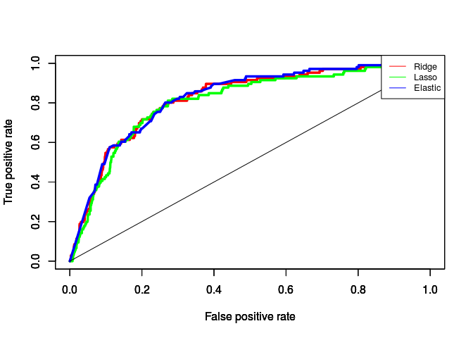
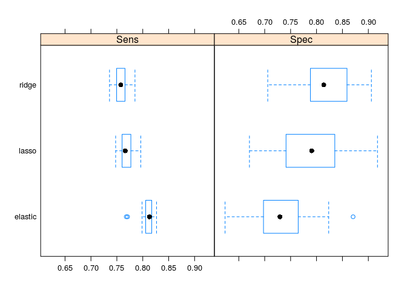
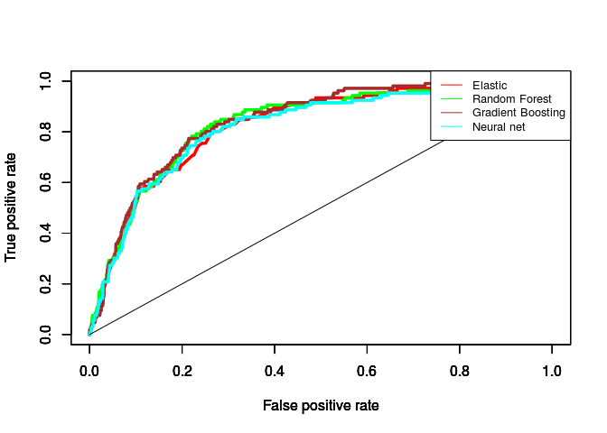
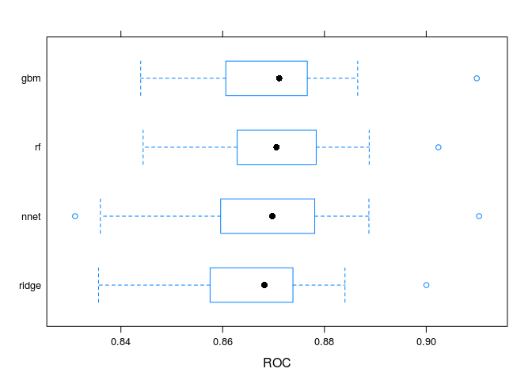
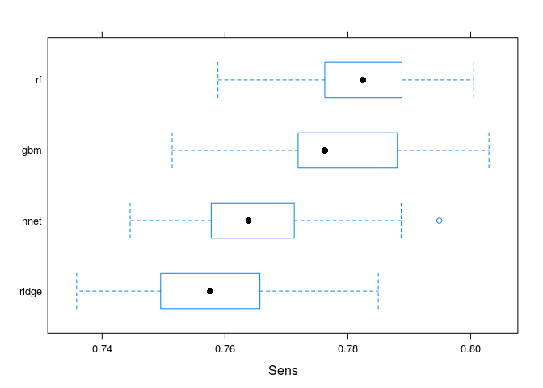

Machine learning for drug discovery
================
German Novakovskiy
September 9, 2018

Data analysis and machine learning
==================================

Let's build several machine learning models for SOX17 activation prediction based on small molecule chemical structure. We will consider this problem as a binary classification: 0 if SOX17 is not activated, 1 otherwise. Activation of SOX17 will be based on corresponding log fold change from LINCS expression data.

SOX17 is a major marker of definitive endoderm, it's highly expressed at this stage and it's expression is downregulated during pluripotency stage.

This is how distribution of SOX17 expression looks like:

``` r
load("MCF7_gene_expression.Rdata")

sox17_lfc <- rows_cols_gene_expression_mcf7["SOX17",]
#for testing
foxa2_lfc <- rows_cols_gene_expression_mcf7["FOXA2",]
rm(rows_cols_gene_expression_mcf7)

hist(sox17_lfc, breaks=50, main = "SOX17 logFC distribution",
     xlab = "logFC", col = "cyan")
```


Looks almost like normal distribution. We will take 5% (95% percentile) at the right tail as activated genes:

``` r
#what is 95% percentile
threshold <- quantile(sox17_lfc, c(.95))
threshold
```

    ##      95% 
    ## 1.776321

Expression of SOX17 in interesting drugs from KEGG/Wiki analysis:

``` r
drugs <- c("taxifolin", "SA-1462738", "SA-1938111", "SA-1938219", "SA-247654", "SA-418993", "SA-85901", "SA-89705", "SA-1459008", "BRD-K20168484", "carbetocin", "linifanib", "mestanolone")

sox17_lfc[drugs][sox17_lfc[drugs] > threshold]
```

    ##  SA-1938111   SA-247654    SA-85901    SA-89705 mestanolone 
    ##    1.938588    3.079655    2.070355    2.113455    3.732105

Only 5 out of 13 molecules!

We will have 2 classes: drugs that activate SOX17 expression, and all others.

``` r
#drugs that activate expression of SOX17 
drugs_positive <- sox17_lfc[sox17_lfc >= threshold] #532 drugs

#drugs that do not activate expression of SOX17 (we do not care about inactivation)
drugs_negative <- sox17_lfc[sox17_lfc < threshold] #10095 drugs
```

We will use MACCS small molecule descriptors - binary in nature and typically encode the presence or absence of substructural fragments (calculate them with Rcpi package). 166 bits recording 166 structural fragments.

``` r
#function for retrieving canonical SMILES from PubChem
#input - drug name
#output - SMILES
getSmiles <- function(drug_name, df_drugs){
  my_drug <- df_drugs %>% filter(pert_iname == drug_name)
  
  #if someone is not 666
  if (nrow(my_drug) > 1){ 
    if (my_drug %>% filter(pubchem_cid != -666) %>% nrow() == 1){
      my_drug <- my_drug %>% filter(pubchem_cid != -666) 
    }
    else if (my_drug %>% filter(is_touchstone != 0) %>% nrow() == 1){
      #if both 666 take with is_touchstone 1
      my_drug <- my_drug %>% filter(is_touchstone != 0)
    } else {
      #like in case of CHIR-99021
      my_drug <- my_drug[1,]
    }
    }
  
  res <- as.character(my_drug$canonical_smiles)
  if (res == -666 | res == 'restricted') { res <- NULL}
  return(res)
}

#function for retrieving MACCS 166 bit descriptors
#input - SMILES
#output - MACCS 166 descriptors
getMACCS <- function(smiles_character){
  mols <- parse.smiles(smiles_character)
  fp <- get.fingerprint(mols[[1]], type="maccs")
  
  #fp is a S4 class, bits field is a vector, indicating the bit positions that are on.
  res <- fp@bits
  return(res)
}
```

Load LINCS drug information (from GSE92742\_Broad\_LINCS\_pert\_info.txt.gz)

``` r
#cols - "pert_id", "pert_iname", "pert_type", "is_touchstone", "inchi_key_prefix", "inchi_key", "canonical_smiles","pubchem_cid" 
drug_info <- read.table("LINCS_compounds_info.txt", header = T, quote = "", sep = "\t", comment.char = "")
dim(drug_info)
```

    ## [1] 20413     8

Note that there are repeats, for example "trichostatin-a" has 2 entries. In this case we take only those, for which pubchem\_cid does not equal -666. (however, the one line for this drug with -666 has classical smiles, while another one with pubchem id has isomeric smiles...).

``` r
#how many drugs among positives have repeats in drug_info file
x <- drug_info %>% filter(pert_iname %in% names(drugs_positive)) 
length(x$pert_iname[which(duplicated(x$pert_iname))])
```

    ## [1] 3

``` r
#those replicates
as.character(x$pert_iname[which(duplicated(x$pert_iname))])
```

    ## [1] "topotecan"  "idarubicin" "WZ-3105"

``` r
#how many drugs among negatives have repeats in drug_info file
x <- drug_info %>% filter(pert_iname %in% names(drugs_negative)) 
length(x$pert_iname[which(duplicated(x$pert_iname))])
```

    ## [1] 589

Note that some of the drugs in info file don't have Smiles. We simply delete them.

Let's calculate MACCS descriptors for drugs that induce SOX17.

``` r
positive_names <- names(drugs_positive)
drugs_smiles_positive <- sapply(positive_names, getSmiles, drug_info)

#delete zeros if there are some
x <- lapply(drugs_smiles_positive, length)
deleted_positives <- sum(x == 0)
drugs_smiles_positive <- drugs_smiles_positive[which(x != 0)]
###############################

drug_maccs_positive <- sapply(drugs_smiles_positive, getMACCS)
```

Now let's calculate MACCS descriptors for all other drugs:

``` r
#takes ~1 minute
negative_names <- names(drugs_negative)
 
drugs_smiles_negative <- sapply(negative_names, getSmiles, drug_info)

#delete zeros if there are some
x <- lapply(drugs_smiles_negative, length)
deleted_negatives <- sum(x == 0)
drugs_smiles_negative <- drugs_smiles_negative[-which(x == 0)]
###############################

drug_maccs_negative <- sapply(drugs_smiles_negative, getMACCS)
```

Now let's put the data in a more appropriate form, plus delete those bits, which are 0 for every drug (there are 7 of them). And look into correlation between features:

``` r
#function for turning the maccs bit descriptors to binary vector with 166 terms
bitsToVector <- function(non_zero_indexes){
  y <- rep(0, 166)
  y[non_zero_indexes] = 1
  return(y)
}

drug_maccs_positive <- lapply(drug_maccs_positive, bitsToVector)

drug_maccs_negative <- lapply(drug_maccs_negative, bitsToVector)

#converting lists to data frame
drugs <- names(drug_maccs_positive)
drug_maccs_positive <- data.frame(matrix(unlist(drug_maccs_positive), nrow=532, byrow=T))
rownames(drug_maccs_positive) <- drugs

drugs <- names(drug_maccs_negative)
drug_maccs_negative <- data.frame(matrix(unlist(drug_maccs_negative), nrow=10057, byrow=T))
rownames(drug_maccs_negative) <- drugs

#for correlation estimates
test <- rbind(drug_maccs_positive, drug_maccs_negative)
test_for_corr <- test[,colSums(test) > 0] #there are 7 bits in 166-vector that are all 0
cormat <- round(cor(test_for_corr), 3)
melted_cormat <- melt(cormat)

melted_cormat <- melt(cormat)
ggplot(data = melted_cormat, aes(x=Var1, y=Var2, fill=value)) + 
  geom_tile()+
  theme(axis.text = element_blank(),
        axis.ticks = element_blank())
```


We see that indeed some features are highly correlated:

``` r
test <- melted_cormat %>% dplyr::filter(!(Var1 == Var2 & value == 1)) %>% arrange(desc(value))

test %>% head(15) %>% kable()
```

| Var1 | Var2 |  value|
|:-----|:-----|------:|
| X61  | X60  |  1.000|
| X60  | X61  |  1.000|
| X143 | X127 |  1.000|
| X127 | X143 |  1.000|
| X60  | X51  |  0.997|
| X61  | X51  |  0.997|
| X51  | X60  |  0.997|
| X51  | X61  |  0.997|
| X33  | X32  |  0.995|
| X32  | X33  |  0.995|
| X134 | X107 |  0.994|
| X107 | X134 |  0.994|
| X58  | X55  |  0.991|
| X55  | X58  |  0.991|
| X60  | X58  |  0.991|

``` r
#adding variavle Inducer - 1 (if yes), 0 (if not)
drug_maccs_positive$Inducer <- rep("Yes", nrow(drug_maccs_positive))

drug_maccs_negative$Inducer <- rep("No", nrow(drug_maccs_negative))

save(drug_maccs_positive, file = "drug_maccs_positive.Rdata")
save(drug_maccs_negative, file = "drug_maccs_negative.Rdata")
```

Now we can use different machine learning algorithms for prediction. Note that we have an imbalanced class problem here (10:0.5). Thus we have to take this into account (weighted classes). Here is the class proportions:

``` r
all_data <- rbind(drug_maccs_positive, drug_maccs_negative)
all_data$Inducer <- factor(all_data$Inducer)

prop.table(table(all_data$Inducer)) #0 is not an inducer, 1 is an inducer (of SOX17 expression)
```

    ## 
    ##         No        Yes 
    ## 0.94975918 0.05024082

Also we can try and do PCA in order to see, if our classes have clear separation border. Note, since we have binary features we use logistic PCA:

``` r
Inducer <- all_data$Inducer
for_pca <- all_data[,-167]

load("logpca_cv.Rdata")
logpca_model = logisticPCA(for_pca, k = 4, m = which.min(logpca_cv)) #k - number of principal components to return
#test_logpca_model = logisticPCA(for_pca, k = 2, m = which.min(logpca_cv))

first_two_pc <- logpca_model
second_two_pc <- logpca_model

first_two_pc$PCs <- logpca_model$PCs[,1:2]
second_two_pc$PCs <- logpca_model$PCs[,3:4]

plot(first_two_pc, type = "scores") + geom_point(aes(colour = Inducer, size = Inducer, alpha = Inducer)) + 
  ggtitle("Logistic PCA") + scale_colour_manual(values = c("blue", "red")) + xlab("PC1") + ylab("PC2")
```


``` r
plot(second_two_pc, type = "scores") + geom_point(aes(colour = Inducer, size = Inducer, alpha = Inducer)) + 
  ggtitle("Logistic PCA") + scale_colour_manual(values = c("blue", "red")) + xlab("PC3") + ylab("PC4")
```


It's clear that there is no distinct separation between inducers of SOX17 expression and all others.

Before we start with machine learning, we split data into inducers and all others, also we calculate class weights to take into account class imbalance. We use stratified k-fold with repeats (5 folds).

``` r
#deleting columns with zeros everywhere
x <- all_data$Inducer
all_data <- all_data[,-167]
all_data <- all_data[,colSums(all_data) > 0]
all_data$Inducer <- x

#splitting into train and test sets (using stratified shuffle split to retain class proportions)
#it was a random split
#set.seed(1492)
#train.index <- createDataPartition(all_data$Inducer, p = 0.8, list = FALSE)
#train_data <- all_data[train.index,]
#test_data <- all_data[-train.index,]
#save(train_data, file = "train_data.Rdata")
#save(test_data, file = "test_data.Rdata")

load("train_data.Rdata")
load("test_data.Rdata")

# Create model weights (they sum to one) 
model_weights <- ifelse(train_data$Inducer == "No",
                        (1/table(train_data$Inducer)[1])*0.5,
                        (1/table(train_data$Inducer)[2])*0.5)

# Set up control function for training (stratified k-fold with repeats)
ctrl <- trainControl(method = "repeatedcv",
                     number = 5,
                     repeats = 5,
                     summaryFunction = twoClassSummary,
                     classProbs = TRUE)

# Build custom AUC function to extract AUC
# from the caret model object
test_roc <- function(model, data) {
  
  pROC::roc(data$Inducer,
      predict(model, data, type = "prob")[, "Yes"])

}
```

Logistic regression
-------------------

Logistic regression was performed with 3 different regularizers: ridge, lasso, elastic.

``` r
#code for calculating logistic regression with lasso:
#tuneGrid=expand.grid(
#              .alpha=1,
#              .lambda=seq(0, 2, by = 0.1))


#weighted_logistic_fit_lasso <- train(Inducer ~ .,
#                                     data = train_data,
#                                     method = "glmnet",
#                                     weights = model_weights,
#                                     family = "binomial",
#                                     tuneGrid = tuneGrid,
#                                     tuneLength=5,
#                                     metric = "ROC",
#                                     trControl = ctrl)
load("weighted_logistic_fit_lasso.Rdata")

#code for calculating logistic regression with elastic:
#tuneGrid=expand.grid(
#              .alpha=0.5,
#              .lambda=seq(0, 2, by = 0.1))


#weighted_logistic_fit_elastic <- train(Inducer ~ .,
#                                     data = train_data,
#                                     method = "glmnet",
#                                     weights = model_weights,
#                                     family = "binomial",
#                                     tuneGrid = tuneGrid,
#                                     tuneLength=5,
#                                     metric = "ROC",
#                                     trControl = ctrl)
load("weighted_logistic_fit_elastic.Rdata")

#code for calculating logistic regression with ridge:
#tuneGrid=expand.grid(
#              .alpha=0,
#              .lambda=seq(0, 10, by = 0.1))


#weighted_logistic_fit_ridge <- train(Inducer ~ .,
#                                     data = train_data,
#                                     method = "glmnet",
#                                     weights = model_weights,
#                                     family = "binomial",
#                                     tuneGrid = tuneGrid,
#                                     tuneLength=5,
#                                     metric = "ROC",
#                                     trControl = ctrl)
load("weighted_logistic_fit_ridge.Rdata")
#load("weighted_logistic_fit_ridge_accuracy.Rdata")

model_list <- list(lasso = weighted_logistic_fit_lasso,
                   elastic = weighted_logistic_fit_elastic,
                   ridge = weighted_logistic_fit_ridge)


model_list_roc <- model_list %>%
  map(test_roc, data = test_data)

model_list_roc %>%
  map(pROC::auc)
```

    ## $lasso
    ## Area under the curve: 0.8069
    ## 
    ## $elastic
    ## Area under the curve: 0.8261
    ## 
    ## $ridge
    ## Area under the curve: 0.821

``` r
#results for test data
```

These ROC values for test predictions. We see that AUC is the biggest for model with elastic regularizer (0.8863), however, they are close.

``` r
valid_pred_ridge <- predict(weighted_logistic_fit_ridge, test_data, type = "prob")
valid_pred_lasso <- predict(weighted_logistic_fit_lasso, test_data, type = "prob")
valid_pred_elastic <- predict(weighted_logistic_fit_elastic, test_data, type = "prob")

pred_val_ridge <-prediction(valid_pred_ridge[,2], test_data$Inducer)
pred_val_lasso <-prediction(valid_pred_lasso[,2], test_data$Inducer)
pred_val_elastic <-prediction(valid_pred_elastic[,2], test_data$Inducer)

#perf_val <- performance(pred_val, "auc") #0.81

perf_val_ridge <- performance(pred_val_ridge, "tpr", "fpr")
perf_val_lasso <- performance(pred_val_lasso, "tpr", "fpr")
perf_val_elastic <- performance(pred_val_elastic, "tpr", "fpr")

plot(perf_val_ridge, col = "red", lwd = 3.5)
par(new=T)
plot(perf_val_lasso, col = "green", lwd = 3.5)
par(new=T)
plot(perf_val_elastic, col = "blue", lwd = 3.5)
par(new=T)
lines(x = c(0,1), y = c(0,1))
legend(x= "topright", y=0.92, legend=c("Ridge", "Lasso", "Elastic"),
       col=c("red", "green", "blue"), lty=1, cex=0.8)
```



ROC values for different regularizers (for cross-validation):

``` r
rValues <- resamples(model_list)
bwplot(rValues, metric="ROC")
```


Sensitivity and specificity for different regularizers (across cross-validation):

``` r
rValues <- resamples(model_list)
bwplot(rValues, metric=c("Spec", "Sens"))
```



``` r
# make predictions
x_test <- test_data[,1:159]
y_test <- test_data$Inducer
predictions <- predict(weighted_logistic_fit_elastic, x_test)
# summarize results
confusionMatrix(predictions, y_test)
```

    ## Confusion Matrix and Statistics
    ## 
    ##           Reference
    ## Prediction   No  Yes
    ##        No  1619   36
    ##        Yes  392   70
    ##                                           
    ##                Accuracy : 0.7978          
    ##                  95% CI : (0.7801, 0.8147)
    ##     No Information Rate : 0.9499          
    ##     P-Value [Acc > NIR] : 1               
    ##                                           
    ##                   Kappa : 0.1797          
    ##  Mcnemar's Test P-Value : <2e-16          
    ##                                           
    ##             Sensitivity : 0.8051          
    ##             Specificity : 0.6604          
    ##          Pos Pred Value : 0.9782          
    ##          Neg Pred Value : 0.1515          
    ##              Prevalence : 0.9499          
    ##          Detection Rate : 0.7648          
    ##    Detection Prevalence : 0.7818          
    ##       Balanced Accuracy : 0.7327          
    ##                                           
    ##        'Positive' Class : No              
    ## 

However, accuracy for elastic regression is ~79%. Sensitivity and Specificity are 0.7429 and 0.8302 respectively. Note that we have a lot of false positives. Precision (tp/(tp+fp)) is 15.15%. If we use prob threshold 0.6 it increases to 18%. With 0.7 threshold it's 22.31%.

K nearest neighbours
--------------------

``` r
#model was built with this code, number of neighbours was chosen to be 26. 
#tuneGrid <- expand.grid(k = seq(8,26,by=2))

#knn_model_fit <- train(Inducer ~ .,
#                       data = train_data,
#                       method = "knn",
#                       metric = "ROC",
#                       tuneGrid = tuneGrid, 
#                       trControl = ctrl)

load("knn_model_fit.Rdata")
load("knn_model_fit_accuracy.Rdata")
```

Let's compute AUC:

``` r
valid_pred_knn <- predict(knn_model_fit, test_data, type = "prob")

pred_val_knn <-prediction(valid_pred_knn[,2], test_data$Inducer)

knn_model_fit %>%
  test_roc(data = test_data) %>%
  pROC::auc()
```

    ## Area under the curve: 0.871

``` r
# make predictions
x_test <- test_data[,1:159]
y_test <- test_data$Inducer
predictions <- predict(knn_model_fit_accuracy, x_test)
# summarize results
confusionMatrix(predictions, y_test)
```

    ## Confusion Matrix and Statistics
    ## 
    ##           Reference
    ## Prediction   No  Yes
    ##        No  2011  106
    ##        Yes    0    0
    ##                                           
    ##                Accuracy : 0.9499          
    ##                  95% CI : (0.9398, 0.9588)
    ##     No Information Rate : 0.9499          
    ##     P-Value [Acc > NIR] : 0.5258          
    ##                                           
    ##                   Kappa : 0               
    ##  Mcnemar's Test P-Value : <2e-16          
    ##                                           
    ##             Sensitivity : 1.0000          
    ##             Specificity : 0.0000          
    ##          Pos Pred Value : 0.9499          
    ##          Neg Pred Value :    NaN          
    ##              Prevalence : 0.9499          
    ##          Detection Rate : 0.9499          
    ##    Detection Prevalence : 1.0000          
    ##       Balanced Accuracy : 0.5000          
    ##                                           
    ##        'Positive' Class : No              
    ## 

However, we see that this classifier just predicts the most abundant class (this method does not take into account weights). Specificity is zero, it's a bad classifier.

Support Vector Machines
-----------------------

### Linear Kernel

``` r
#model was built using this code

#svm_Linear <- train(Inducer ~., 
#                    data = train_data, 
#                    method = "svmLinear",
#                    trControl=ctrl,
#                    tuneLength = 9,
#                    metric = "ROC", scale=FALSE)

load("svm_Linear.Rdata")
load("svm_Linear_accuracy.Rdata")

svm_Linear %>%
  test_roc(data = test_data) %>%
  pROC::auc()
```

    ## Area under the curve: 0.7404

``` r
# make predictions
x_test <- test_data[,1:159]
y_test <- test_data$Inducer
predictions <- predict(svm_Linear_accuracy, x_test)
# summarize results
confusionMatrix(predictions, y_test)
```

    ## Confusion Matrix and Statistics
    ## 
    ##           Reference
    ## Prediction   No  Yes
    ##        No  2011  106
    ##        Yes    0    0
    ##                                           
    ##                Accuracy : 0.9499          
    ##                  95% CI : (0.9398, 0.9588)
    ##     No Information Rate : 0.9499          
    ##     P-Value [Acc > NIR] : 0.5258          
    ##                                           
    ##                   Kappa : 0               
    ##  Mcnemar's Test P-Value : <2e-16          
    ##                                           
    ##             Sensitivity : 1.0000          
    ##             Specificity : 0.0000          
    ##          Pos Pred Value : 0.9499          
    ##          Neg Pred Value :    NaN          
    ##              Prevalence : 0.9499          
    ##          Detection Rate : 0.9499          
    ##    Detection Prevalence : 1.0000          
    ##       Balanced Accuracy : 0.5000          
    ##                                           
    ##        'Positive' Class : No              
    ## 

Again we see that sensitivity is 0. This model does not take into consideration weights.

### Gausian Kernel

``` r
#this code was used to build the model
#svm_Gaussian <- train(Inducer ~., 
#                    data = train_data, 
#                    method = "svmRadial",
#                    trControl=ctrl,
#                    metric = "ROC",
#                    tuneLength = 10,
#                    scale = FALSE)

load("svm_Gaussian.Rdata")
load("svm_Gaussian_accuracy.Rdata")

svm_Gaussian %>%
  test_roc(data = test_data) %>%
  pROC::auc()
```

    ## Area under the curve: 0.8808

``` r
# make predictions
x_test <- test_data[,1:159]
y_test <- test_data$Inducer
predictions <- predict(svm_Gaussian_accuracy, x_test)
# summarize results
confusionMatrix(predictions, y_test)
```

    ## Confusion Matrix and Statistics
    ## 
    ##           Reference
    ## Prediction   No  Yes
    ##        No  2010  103
    ##        Yes    1    3
    ##                                           
    ##                Accuracy : 0.9509          
    ##                  95% CI : (0.9408, 0.9597)
    ##     No Information Rate : 0.9499          
    ##     P-Value [Acc > NIR] : 0.4464          
    ##                                           
    ##                   Kappa : 0.0511          
    ##  Mcnemar's Test P-Value : <2e-16          
    ##                                           
    ##             Sensitivity : 0.9995          
    ##             Specificity : 0.0283          
    ##          Pos Pred Value : 0.9513          
    ##          Neg Pred Value : 0.7500          
    ##              Prevalence : 0.9499          
    ##          Detection Rate : 0.9495          
    ##    Detection Prevalence : 0.9981          
    ##       Balanced Accuracy : 0.5139          
    ##                                           
    ##        'Positive' Class : No              
    ## 

Again not specific at all.

Random forest
-------------

``` r
#this code was used for building the model
#rf_weighted_fit <- train(Inducer ~., 
#                    data = train_data, 
#                    method = "ranger",
#                    trControl=ctrl,
#                    tuneLength = 5,
#                    weights = model_weights,
#                    metric = "ROC")

load("rf_weighted_fit.Rdata")
load("rf_weighted_fit_accuracy.Rdata")


rf_weighted_fit %>%
  test_roc(data = test_data) %>%
  pROC::auc()
```

    ## Area under the curve: 0.834

``` r
# make predictions
x_test <- test_data[,1:159]
y_test <- test_data$Inducer
predictions <- predict(rf_weighted_fit, x_test)
# summarize results
confusionMatrix(predictions, y_test)
```

    ## Confusion Matrix and Statistics
    ## 
    ##           Reference
    ## Prediction   No  Yes
    ##        No  1544   22
    ##        Yes  467   84
    ##                                           
    ##                Accuracy : 0.769           
    ##                  95% CI : (0.7505, 0.7868)
    ##     No Information Rate : 0.9499          
    ##     P-Value [Acc > NIR] : 1               
    ##                                           
    ##                   Kappa : 0.1875          
    ##  Mcnemar's Test P-Value : <2e-16          
    ##                                           
    ##             Sensitivity : 0.7678          
    ##             Specificity : 0.7925          
    ##          Pos Pred Value : 0.9860          
    ##          Neg Pred Value : 0.1525          
    ##              Prevalence : 0.9499          
    ##          Detection Rate : 0.7293          
    ##    Detection Prevalence : 0.7397          
    ##       Balanced Accuracy : 0.7801          
    ##                                           
    ##        'Positive' Class : No              
    ## 

We still make a lot of false positives. Precision is 15.24%. With 0.6 threshold we have 18.49% precision. With 0.7 - precision is 21.7%.

Stochastic Gradient boosting
----------------------------

``` r
#This code was used to build the model
#gbm_fit <- train(Inducer ~., 
#                    data = train_data, 
#                    method = "gbm",
#                    trControl=ctrl,
#                    weights = model_weights,
#                    metric = "ROC",
#                    tuneLength = 5, verbose = FALSE)

load("gbm_fit.Rdata")
load("gbm_fit_accuracy.Rdata")

gbm_fit %>%
  test_roc(data = test_data) %>%
  pROC::auc()
```

    ## Area under the curve: 0.8414

``` r
# make predictions
x_test <- test_data[,1:159]
y_test <- test_data$Inducer
predictions <- predict(gbm_fit, x_test)
# summarize results
confusionMatrix(predictions, y_test)
```

    ## Confusion Matrix and Statistics
    ## 
    ##           Reference
    ## Prediction   No  Yes
    ##        No  1555   24
    ##        Yes  456   82
    ##                                           
    ##                Accuracy : 0.7733          
    ##                  95% CI : (0.7548, 0.7909)
    ##     No Information Rate : 0.9499          
    ##     P-Value [Acc > NIR] : 1               
    ##                                           
    ##                   Kappa : 0.1866          
    ##  Mcnemar's Test P-Value : <2e-16          
    ##                                           
    ##             Sensitivity : 0.7732          
    ##             Specificity : 0.7736          
    ##          Pos Pred Value : 0.9848          
    ##          Neg Pred Value : 0.1524          
    ##              Prevalence : 0.9499          
    ##          Detection Rate : 0.7345          
    ##    Detection Prevalence : 0.7459          
    ##       Balanced Accuracy : 0.7734          
    ##                                           
    ##        'Positive' Class : No              
    ## 

This model is more accurate than random forest. Precision is 15.24% (0.5 threshold). With 0.6 precision is 16.74. And 21.05% with 0.7.

Neural net
----------

``` r
#This code was used to build the model
#weighted_nnet <- train(Inducer ~ .,
#                                     data = train_data,
#                                     method = "nnet",
#                                     weights = model_weights,
#                                     #family = "binomial",
#                                     #tuneGrid = nnetGrid,
#                                     tuneLength=5,
#                                     metric = "ROC",
#                                     trControl = ctrl, verbose = FALSE, MaxNWts = 2500)

load("weighted_nnet.Rdata")

weighted_nnet %>%
  test_roc(data = test_data) %>%
  pROC::auc()
```

    ## Area under the curve: 0.8207

``` r
# make predictions
x_test <- test_data[,1:159]
y_test <- test_data$Inducer
predictions <- predict(weighted_nnet, x_test)
# summarize results
confusionMatrix(predictions, y_test)
```

    ## Confusion Matrix and Statistics
    ## 
    ##           Reference
    ## Prediction   No  Yes
    ##        No  1521   24
    ##        Yes  490   82
    ##                                           
    ##                Accuracy : 0.7572          
    ##                  95% CI : (0.7384, 0.7753)
    ##     No Information Rate : 0.9499          
    ##     P-Value [Acc > NIR] : 1               
    ##                                           
    ##                   Kappa : 0.1719          
    ##  Mcnemar's Test P-Value : <2e-16          
    ##                                           
    ##             Sensitivity : 0.7563          
    ##             Specificity : 0.7736          
    ##          Pos Pred Value : 0.9845          
    ##          Neg Pred Value : 0.1434          
    ##              Prevalence : 0.9499          
    ##          Detection Rate : 0.7185          
    ##    Detection Prevalence : 0.7298          
    ##       Balanced Accuracy : 0.7650          
    ##                                           
    ##        'Positive' Class : No              
    ## 

Here precision is 14.33%. If it's 0.6 then 15.93%. If it's 0.7 then 19.24%. And if it's 0.8 then it's 20.08%.

Summary figures
===============

In conclusion, we have chosen three models: logistic regression with ridge regularizer, random forest and stochastic gradient boosting:

``` r
#valid_pred_ridge <- predict(weighted_logistic_fit_ridge, test_data, type = "prob")
valid_pred_rf <- predict(rf_weighted_fit, test_data, type = "prob")
valid_pred_gbm <- predict(gbm_fit, test_data, type = "prob")
valid_pred_nnet <- predict(weighted_nnet, test_data, type = "prob")

#pred_val_ridge <-prediction(valid_pred_ridge[,2], test_data$Inducer)
pred_val_rf <-prediction(valid_pred_rf[,2], test_data$Inducer)
pred_val_gbm <-prediction(valid_pred_gbm[,2], test_data$Inducer)
pred_val_nnet <-prediction(valid_pred_nnet[,2], test_data$Inducer)

#perf_val <- performance(pred_val, "auc") #0.81

#perf_val_ridge <- performance(pred_val_ridge, "tpr", "fpr")
perf_val_rf <- performance(pred_val_rf, "tpr", "fpr")
perf_val_gbm <- performance(pred_val_gbm, "tpr", "fpr")
perf_val_nnet <- performance(pred_val_nnet, "tpr", "fpr")

plot(perf_val_elastic, col = "red", lwd = 3.5)
par(new=T)
plot(perf_val_rf, col = "green", lwd = 3.5)
par(new=T)
plot(perf_val_gbm, col = "brown", lwd = 3.5)
par(new=T)
plot(perf_val_nnet, col = "cyan", lwd = 3.5)
par(new=T)
lines(x = c(0,1), y = c(0,1))
legend(x= "topright", y=0.92, legend=c("Elastic", "Random Forest", "Gradient Boosting", "Neural net"),
       col=c("red", "green", "brown", "cyan"), lty=1, cex=0.8)
```



ROC of key algorithms:

``` r
rValues <- resamples(list(ridge = weighted_logistic_fit_ridge,
                          rf = rf_weighted_fit,
                          gbm = gbm_fit,
                          nnet = weighted_nnet))
bwplot(rValues, metric="ROC")
```



Specificity:

``` r
bwplot(rValues, metric="Spec")
```


Sensitivity:

``` r
bwplot(rValues, metric="Sens")
```


