Pathway analysis, report
================
German Novakovskiy
August 28, 2018

Pathway enrichment analysis of public data on Definitive Endoderm (DE) differentiation
======================================================================================

In this section we do GSEA of three RNA-seq public datasets from GEO database and following papers:

-   [Single-cell RNA-seq reveals novel regulators of human embryonic stem cell differentiation to definitive endoderm](https://genomebiology.biomedcentral.com/articles/10.1186/s13059-016-1033-x); GSE75748; [Github page with analysis](https://github.com/fransilvion/ESC_RNA_seq/blob/master/analysis_of_public_data/GSE75748/GSE75748_data_analysis.md)
-   [Single-cell RNA sequencing reveals metallothionein heterogeneity during hESC differentiation to definitive endoderm](https://www.ncbi.nlm.nih.gov/pubmed/29427839); GSE109658; [Github page with analysis](https://github.com/fransilvion/ESC_RNA_seq/blob/master/analysis_of_public_data/GSE109658/GSE109658_data_analysis.md)
-   [A Comparative Study Of Endoderm Differentiation In Humans And Chimpanzees](https://www.biorxiv.org/content/early/2017/05/09/135442); GSE98411; [Github page with analysis](https://github.com/fransilvion/ESC_RNA_seq/blob/master/analysis_of_public_data/GSE98411/GSE98411_data_analysis.md)

For every data set bulk RNA-seq was analyzed using [limma-voom package](https://bioconductor.org/packages/release/bioc/html/limma.html). GSEA was performed using [fgsea package](https://bioconductor.org/packages/release/bioc/html/fgsea.html).

Every GSE data set has a time series data. So enrichemnt analysis was done for three time periods: 0h-24h (formation of anterior primitive streak), 24h-96h (formation of DE; 72h for GSE98411), 0h-96h (whole differentiation process; 72h for GSE98411). Here we gonna analyze only first two, for the third one please check the github pages below.

Three pathway databases were used for GSEA: KEGG (186 pathways, last update of the free version was in 2011, so it's not complete), Reactome (2025 pathways, has a hierarchical structure, similar to GO), WikiPathways (462 pathways, database was chosen only because it contains Endoderm differentiation term). Gmt files for fgsea were downloaded from these links:

-   [KEGG gene sets](http://software.broadinstitute.org/gsea/msigdb/collections.jsp#C2)
-   [Reactome gene sets](http://download.baderlab.org/EM_Genesets/August_01_2018/Human/symbol/Pathways/Human_Reactome_August_01_2018_symbol.gmt)
-   [WikiPathways](http://data.wikipathways.org/20180810/gmt/wikipathways-20180810-gmt-Homo_sapiens.gmt)

The GSEA of all three data sets can be found on this github pages:

-   [GSE75748 pathway analysis](https://github.com/fransilvion/ESC_RNA_seq/blob/master/pathway_enrichment_analysis/75748/pathway_enrichment_75748.md)
-   [GSE109658 pathway analysis](https://github.com/fransilvion/ESC_RNA_seq/blob/master/pathway_enrichment_analysis/109658/pathway_enrichment_109658.md)
-   [GSE98411 pathway analysis](https://github.com/fransilvion/ESC_RNA_seq/blob/master/pathway_enrichment_analysis/98411/pathway_enrichment_98411.md)

In GSEA analysis min and max cluster size were 15 and 300 respectively.

Exploring pathway databases
---------------------------

Before we jump into GSEA analysis let's first describe a little bit different pathway databases (distribution, largest pathway and etc.)

### KEGG

We shall start with probably the most famous pathway database, which is not updated (free version) since 2011, KEGG.

There are 186 pathways in total.

Distribution of counts of genes in each pathway for KEGG: 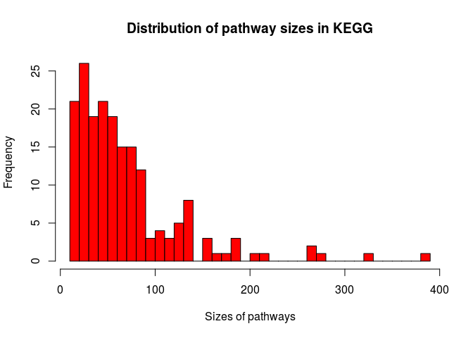

Here are the first 20 largest KEGG pathways:

    ##                                           Pathway Size
    ## 1                     KEGG_OLFACTORY_TRANSDUCTION  389
    ## 2                         KEGG_PATHWAYS_IN_CANCER  328
    ## 3    KEGG_NEUROACTIVE_LIGAND_RECEPTOR_INTERACTION  272
    ## 4                     KEGG_MAPK_SIGNALING_PATHWAY  267
    ## 5     KEGG_CYTOKINE_CYTOKINE_RECEPTOR_INTERACTION  267
    ## 6           KEGG_REGULATION_OF_ACTIN_CYTOSKELETON  216
    ## 7                             KEGG_FOCAL_ADHESION  201
    ## 8                KEGG_CHEMOKINE_SIGNALING_PATHWAY  190
    ## 9                        KEGG_HUNTINGTONS_DISEASE  185
    ## 10                               KEGG_ENDOCYTOSIS  183
    ## 11                 KEGG_CALCIUM_SIGNALING_PATHWAY  178
    ## 12                        KEGG_ALZHEIMERS_DISEASE  169
    ## 13                         KEGG_PURINE_METABOLISM  159
    ## 14                KEGG_JAK_STAT_SIGNALING_PATHWAY  155
    ## 15                     KEGG_WNT_SIGNALING_PATHWAY  151
    ## 16              KEGG_SYSTEMIC_LUPUS_ERYTHEMATOSUS  140
    ## 17            KEGG_UBIQUITIN_MEDIATED_PROTEOLYSIS  138
    ## 18 KEGG_NATURAL_KILLER_CELL_MEDIATED_CYTOTOXICITY  137
    ## 19                 KEGG_INSULIN_SIGNALING_PATHWAY  137
    ## 20                 KEGG_OXIDATIVE_PHOSPHORYLATION  135

We can see that the biggest pathway is OLFACTORY\_TRANSDUCTION. And it contains 389 genes, which is not so big. But what about the smallest ones? Here they are:

    ##                                                 Pathway Size
    ## 167                       KEGG_PHENYLALANINE_METABOLISM   18
    ## 168                           KEGG_STEROID_BIOSYNTHESIS   17
    ## 169                      KEGG_ONE_CARBON_POOL_BY_FOLATE   17
    ## 170                       KEGG_RENIN_ANGIOTENSIN_SYSTEM   17
    ## 171                 KEGG_PRIMARY_BILE_ACID_BIOSYNTHESIS   16
    ## 172                       KEGG_OTHER_GLYCAN_DEGRADATION   16
    ## 173        KEGG_GLYOXYLATE_AND_DICARBOXYLATE_METABOLISM   16
    ## 174                          KEGG_RIBOFLAVIN_METABOLISM   16
    ## 175              KEGG_PANTOTHENATE_AND_COA_BIOSYNTHESIS   16
    ## 176 KEGG_GLYCOSAMINOGLYCAN_BIOSYNTHESIS_KERATAN_SULFATE   15
    ## 177  KEGG_GLYCOSPHINGOLIPID_BIOSYNTHESIS_GANGLIO_SERIES   15
    ## 178                KEGG_TERPENOID_BACKBONE_BIOSYNTHESIS   15
    ## 179    KEGG_GLYCOSPHINGOLIPID_BIOSYNTHESIS_GLOBO_SERIES   14
    ## 180                     KEGG_NON_HOMOLOGOUS_END_JOINING   14
    ## 181                              KEGG_SULFUR_METABOLISM   13
    ## 182                        KEGG_CIRCADIAN_RHYTHM_MAMMAL   13
    ## 183     KEGG_VALINE_LEUCINE_AND_ISOLEUCINE_BIOSYNTHESIS   11
    ## 184                            KEGG_FOLATE_BIOSYNTHESIS   11
    ## 185             KEGG_TAURINE_AND_HYPOTAURINE_METABOLISM   10
    ## 186                KEGG_LIMONENE_AND_PINENE_DEGRADATION   10

Smallest pathways contain only 10 genes. Also notice how broad and vague these terms sound! Now let's switch to Reactome.

### Reactome

There are 2025 pathways in total.

Distribution of counts of genes in each pathway for Reactome: 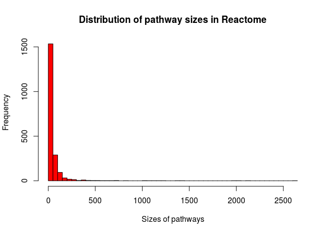

Now we see that here the distribution is much more skewed than in KEGG.

Now again let's try to look only at the largest pathways:

    ##                                    Pathway Size
    ## 1                       Signaling Pathways 2613
    ## 2                   Metabolism of proteins 2104
    ## 3                               Metabolism 2045
    ## 4                            Immune System 1954
    ## 5  Post-translational protein modification 1403
    ## 6          Gene expression (Transcription) 1368
    ## 7          RNA Polymerase II Transcription 1234
    ## 8                        Signaling by GPCR 1151
    ## 9            Generic Transcription Pathway 1113
    ## 10              GPCR downstream signalling 1096
    ## 11                   Developmental Biology 1042
    ## 12                    Innate Immune System 1039
    ## 13                                 Disease  823
    ## 14                  Adaptive Immune System  731
    ## 15                    Metabolism of lipids  721
    ## 16            Transport of small molecules  708
    ## 17     Cytokine Signaling in Immune system  680
    ## 18                       Metabolism of RNA  659
    ## 19              Vesicle-mediated transport  645
    ## 20                              Cell Cycle  614

These terms are also very broad, and they are probably stay at the beginning of the pathway hierarchy (in this sense Reactome is similar to GO terms).

However, the smallest pathways contain just one gene and they are too specific:

    ##                                                                               Pathway
    ## 1991                                                 FGFR4 mutant receptor activation
    ## 1992                                                         UNC93B1 deficiency - HSE
    ## 1993                                  FGFR1c and Klotho ligand binding and activation
    ## 1994                                                              Regulation by TREX1
    ## 1995                                                                Inhibition of PKR
    ## 1996                                         Signaling by FGFR2 amplification mutants
    ## 1997                             APC truncation mutants are not K63 polyubiquitinated
    ## 1998                                               Retinoid metabolism disease events
    ## 1999                                        Metabolism of ingested MeSeO2H into MeSeH
    ## 2000                               Biosynthesis of DPAn-3-derived 13-series resolvins
    ## 2001 Microtubule-dependent trafficking of connexons from Golgi to the plasma membrane
    ## 2002                            Defective TCN2 causes hereditary megaloblastic anemia
    ## 2003                                                 Toxicity of tetanus toxin (TeNT)
    ## 2004      Defective MMACHC causes methylmalonic aciduria and homocystinuria type cblC
    ## 2005                      Abnormal conversion of 2-oxoglutarate to 2-hydroxyglutarate
    ## 2006                  WNT ligand secretion is abrogated by the PORCN inhibitor LGK974
    ## 2007                      Reactions specific to the hybrid N-glycan synthesis pathway
    ## 2008                                                                  Synthesis of CL
    ## 2009                                                                           GSD II
    ## 2010                                                                        Vitamin E
    ##      Size
    ## 1991    1
    ## 1992    1
    ## 1993    1
    ## 1994    1
    ## 1995    1
    ## 1996    1
    ## 1997    1
    ## 1998    1
    ## 1999    1
    ## 2000    1
    ## 2001    1
    ## 2002    1
    ## 2003    1
    ## 2004    1
    ## 2005    1
    ## 2006    1
    ## 2007    1
    ## 2008    1
    ## 2009    1
    ## 2010    1

Turns out that 15 pathways in new annotation have size 0. Now let's look at Wiki pathways.

### Analysis of Wikipathways

There are 462 pathways in total.

Distribution of counts of genes in each pathway for Wikipathways: 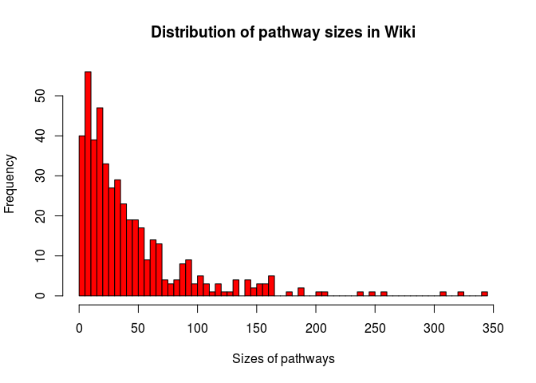

Distribution looks similar to KEGG's. Let's check the largest and smallest pathways!

The largest pathways:

    ##                                                        Pathway Size
    ## 1                                   PI3K-Akt Signaling Pathway  345
    ## 2                               Nuclear Receptors Meta-Pathway  321
    ## 3               Focal Adhesion-PI3K-Akt-mTOR-signaling pathway  309
    ## 4                                GPCRs, Class A Rhodopsin-like  258
    ## 5                                       MAPK Signaling Pathway  249
    ## 6                               VEGFA-VEGFR2 Signaling Pathway  238
    ## 7                                Circadian rythm related genes  207
    ## 8                                               Focal Adhesion  202
    ## 9                                   Vitamin D Receptor Pathway  186
    ## 10                                               Ras Signaling  186
    ## 11                Metapathway biotransformation Phase I and II  180
    ## 12                                 Chemokine signaling pathway  165
    ## 13                                  EGF/EGFR Signaling Pathway  164
    ## 14 Sudden Infant Death Syndrome (SIDS) Susceptibility Pathways  164
    ## 15   Epithelial to mesenchymal transition in colorectal cancer  164
    ## 16                                           Insulin Signaling  161
    ## 17              Myometrial Relaxation and Contraction Pathways  158
    ## 18                               Mesodermal Commitment Pathway  157
    ## 19                                       Breast cancer pathway  157
    ## 20                            Integrated Breast Cancer Pathway  154

These pathways are similar in size with KEGG terms. What about the smallest ones?

Some pathways from Wiki contain just one gene.

    ##                                                                                     Pathway
    ## 443                                                              Neurotransmitter Disorders
    ## 444 Proprotein convertase subtilisin/kexin type 9 (PCSK9) mediated LDL receptor degradation
    ## 445                                                                       Heroin metabolism
    ## 446                                                  mir34a and TGIF2 in osteoclastogenesis
    ## 447                                                                    Evolocumab Mechanism
    ## 448                                                              Lamin A-processing pathway
    ## 449                                                          Aripiprazole Metabolic Pathway
    ## 450                                                                    Felbamate Metabolism
    ## 451                                                    Butyrate-induced histone acetylation
    ## 452                                                       Hypoxia-mediated EMT and Stemness
    ## 453                                                             Influenza A virus infection
    ## 454                                                                    Lidocaine metabolism
    ## 455                                                Metabolism of Tetrahydrocannabinol (THC)
    ## 456                      Mevalonate arm of cholesterol biosynthesis pathway with inhibitors
    ## 457                                               Hormonal control of Pubertal Growth Spurt
    ## 458                                                Metabolism of Dichloroethylene by CYP450
    ## 459                                                            Gut-Liver Indole Metabolism 
    ## 460                                                            Colchicine Metabolic Pathway
    ## 461                                                                     Glucose Homeostasis
    ## 462                                    Acrylamide Biotransformation and Exposure Biomarkers
    ##     Size
    ## 443    4
    ## 444    3
    ## 445    3
    ## 446    3
    ## 447    3
    ## 448    3
    ## 449    2
    ## 450    2
    ## 451    2
    ## 452    2
    ## 453    2
    ## 454    2
    ## 455    2
    ## 456    2
    ## 457    2
    ## 458    1
    ## 459    1
    ## 460    1
    ## 461    1
    ## 462    1

These pathways are not so broad as KEGG pathways and not too specific as in Reactome (also looks like they lack hierarchical structure).

Now let's switch to actual analysis.

0h-24h Time period
------------------

### KEGG

Let's compare KEGG pathway enrichment data for different data sets at this time point.

#### GSE75748

There are 37 enriched KEGG pathways at this time point for GSE75748. Here they are:

    ##  [1] "KEGG_MAPK_SIGNALING_PATHWAY"                              
    ##  [2] "KEGG_ENDOCYTOSIS"                                         
    ##  [3] "KEGG_WNT_SIGNALING_PATHWAY"                               
    ##  [4] "KEGG_TGF_BETA_SIGNALING_PATHWAY"                          
    ##  [5] "KEGG_AXON_GUIDANCE"                                       
    ##  [6] "KEGG_FOCAL_ADHESION"                                      
    ##  [7] "KEGG_ECM_RECEPTOR_INTERACTION"                            
    ##  [8] "KEGG_NEUROTROPHIN_SIGNALING_PATHWAY"                      
    ##  [9] "KEGG_REGULATION_OF_ACTIN_CYTOSKELETON"                    
    ## [10] "KEGG_PATHWAYS_IN_CANCER"                                  
    ## [11] "KEGG_COLORECTAL_CANCER"                                   
    ## [12] "KEGG_RENAL_CELL_CARCINOMA"                                
    ## [13] "KEGG_PANCREATIC_CANCER"                                   
    ## [14] "KEGG_BASAL_CELL_CARCINOMA"                                
    ## [15] "KEGG_CHRONIC_MYELOID_LEUKEMIA"                            
    ## [16] "KEGG_SMALL_CELL_LUNG_CANCER"                              
    ## [17] "KEGG_ARRHYTHMOGENIC_RIGHT_VENTRICULAR_CARDIOMYOPATHY_ARVC"
    ## [18] "KEGG_ERBB_SIGNALING_PATHWAY"                              
    ## [19] "KEGG_HEDGEHOG_SIGNALING_PATHWAY"                          
    ## [20] "KEGG_INSULIN_SIGNALING_PATHWAY"                           
    ## [21] "KEGG_ENDOMETRIAL_CANCER"                                  
    ## [22] "KEGG_NON_SMALL_CELL_LUNG_CANCER"                          
    ## [23] "KEGG_DILATED_CARDIOMYOPATHY"                              
    ## [24] "KEGG_CHEMOKINE_SIGNALING_PATHWAY"                         
    ## [25] "KEGG_MELANOGENESIS"                                       
    ## [26] "KEGG_BLADDER_CANCER"                                      
    ## [27] "KEGG_NOTCH_SIGNALING_PATHWAY"                             
    ## [28] "KEGG_GNRH_SIGNALING_PATHWAY"                              
    ## [29] "KEGG_HYPERTROPHIC_CARDIOMYOPATHY_HCM"                     
    ## [30] "KEGG_GAP_JUNCTION"                                        
    ## [31] "KEGG_ACUTE_MYELOID_LEUKEMIA"                              
    ## [32] "KEGG_TYPE_II_DIABETES_MELLITUS"                           
    ## [33] "KEGG_GLYCOSAMINOGLYCAN_BIOSYNTHESIS_CHONDROITIN_SULFATE"  
    ## [34] "KEGG_VASOPRESSIN_REGULATED_WATER_REABSORPTION"            
    ## [35] "KEGG_B_CELL_RECEPTOR_SIGNALING_PATHWAY"                   
    ## [36] "KEGG_ADHERENS_JUNCTION"                                   
    ## [37] "KEGG_PROSTATE_CANCER"

#### GSE109658

There are 7 enriched KEGG pathways at this time point for GSE109658. Here they are:

    ## [1] "KEGG_HEDGEHOG_SIGNALING_PATHWAY" "KEGG_TGF_BETA_SIGNALING_PATHWAY"
    ## [3] "KEGG_PATHWAYS_IN_CANCER"         "KEGG_BASAL_CELL_CARCINOMA"      
    ## [5] "KEGG_WNT_SIGNALING_PATHWAY"      "KEGG_ECM_RECEPTOR_INTERACTION"  
    ## [7] "KEGG_MELANOGENESIS"

#### GSE98411

There are 5 enriched KEGG pathways at this time point for GSE98411. Here they are:

    ## [1] "KEGG_WNT_SIGNALING_PATHWAY"      "KEGG_HEDGEHOG_SIGNALING_PATHWAY"
    ## [3] "KEGG_TGF_BETA_SIGNALING_PATHWAY" "KEGG_PATHWAYS_IN_CANCER"        
    ## [5] "KEGG_BASAL_CELL_CARCINOMA"

#### Analyzing overlap between different pathway databases

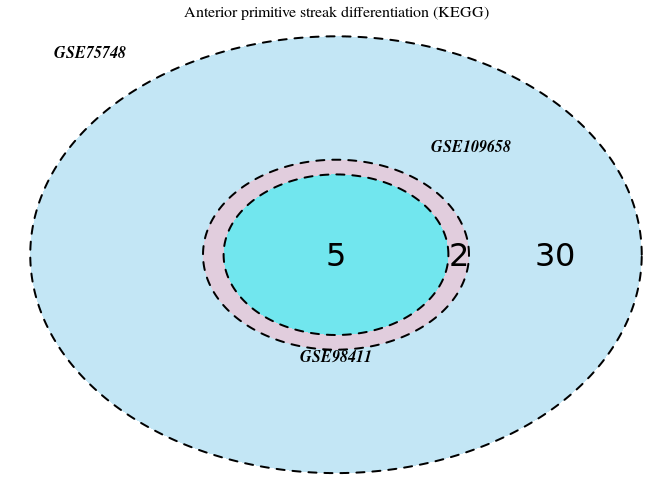

So we see that all KEGG pathways in GSE98411 are included in GSE109658, which also are all included in GSE75748. The last data set has 30 other pathways that did not show up in other two data sets; majority of them are cancer pathways (e.g. KEGG\_RENAL\_CELL\_CARCINOMA, KEGG\_BASAL\_CELL\_CARCINOMA, KEGG\_SMALL\_CELL\_LUNG\_CANCER).

Here are the common pathways of all data sets:

    ## [1] "KEGG_WNT_SIGNALING_PATHWAY"      "KEGG_HEDGEHOG_SIGNALING_PATHWAY"
    ## [3] "KEGG_TGF_BETA_SIGNALING_PATHWAY" "KEGG_PATHWAYS_IN_CANCER"        
    ## [5] "KEGG_BASAL_CELL_CARCINOMA"

So we see that according to KEGG there are 5 common pathways at 0-24h time point of differentiation. Wnt signaling pathway and TGF-beta pathway are [know regulators of DE differentiation](https://www.ncbi.nlm.nih.gov/pubmed/23585347). With Hedgehog is not so clear, but it was shown to be beneficial for [pancreas differentiation in non-human species](https://www.sciencedirect.com/science/article/pii/S096098220100402X). Presence of Pathways in cancer term is probably due to relative similarity of processes that are happening in stem cell growth and differentiation and in cancer. But still Pathways in cancer and Basal cell carcinoma look too broad to be considered as something specific for DE differentiation.

Overal, it can be concluded that according to KEGG the most important pathways at the beginnig of differentiation are TFG-beta and Wnt signaling pathways (which is consistent with the literature).

### Reactome

Let's compare Reactome pathway enrichment data for different data sets at this time point (0 hours - 24 hours)

#### GSE75748

There are 87 enriched Reactome pathways at this time point for GSE75748. Here they are:

    ##  [1] "SEMAPHORIN INTERACTIONS"                                                       
    ##  [2] "FACTORS INVOLVED IN MEGAKARYOCYTE DEVELOPMENT AND PLATELET PRODUCTION"         
    ##  [3] "COLLAGEN CHAIN TRIMERIZATION"                                                  
    ##  [4] "NCAM SIGNALING FOR NEURITE OUT-GROWTH"                                         
    ##  [5] "NRAGE SIGNALS DEATH THROUGH JNK"                                               
    ##  [6] "COLLAGEN BIOSYNTHESIS AND MODIFYING ENZYMES"                                   
    ##  [7] "EXTRACELLULAR MATRIX ORGANIZATION"                                             
    ##  [8] "SIGNALING BY NOTCH3"                                                           
    ##  [9] "EPH-EPHRIN MEDIATED REPULSION OF CELLS"                                        
    ## [10] "COLLAGEN FORMATION"                                                            
    ## [11] "EPH-EPHRIN SIGNALING"                                                          
    ## [12] "ECM PROTEOGLYCANS"                                                             
    ## [13] "SIGNALING BY PDGF"                                                             
    ## [14] "POST-TRANSLATIONAL PROTEIN PHOSPHORYLATION"                                    
    ## [15] "INTEGRIN CELL SURFACE INTERACTIONS"                                            
    ## [16] "RHO GTPASE CYCLE"                                                              
    ## [17] "SIGNALING BY NTRK1 (TRKA)"                                                     
    ## [18] "SIGNALING BY RAS MUTANTS"                                                      
    ## [19] "SIGNALING BY TGF-BETA FAMILY MEMBERS"                                          
    ## [20] "ASSEMBLY OF COLLAGEN FIBRILS AND OTHER MULTIMERIC STRUCTURES"                  
    ## [21] "REGULATION OF IGF ACTIVITY BY IGFBP"                                           
    ## [22] "CELLULAR SENESCENCE"                                                           
    ## [23] "NCAM1 INTERACTIONS"                                                            
    ## [24] "SEMA4D IN SEMAPHORIN SIGNALING"                                                
    ## [25] "ONCOGENIC MAPK SIGNALING"                                                      
    ## [26] "SIGNALING BY WNT"                                                              
    ## [27] "NON-INTEGRIN MEMBRANE-ECM INTERACTIONS"                                        
    ## [28] "SIGNALING BY FGFR1"                                                            
    ## [29] "SIGNALING BY NTRKS"                                                            
    ## [30] "NOTCH3 INTRACELLULAR DOMAIN REGULATES TRANSCRIPTION"                           
    ## [31] "DOWNSTREAM SIGNALING OF ACTIVATED FGFR1"                                       
    ## [32] "HS-GAG BIOSYNTHESIS"                                                           
    ## [33] "O-LINKED GLYCOSYLATION"                                                        
    ## [34] "GLYCOSAMINOGLYCAN METABOLISM"                                                  
    ## [35] "SEMA4D INDUCED CELL MIGRATION AND GROWTH-CONE COLLAPSE"                        
    ## [36] "DOWNSTREAM SIGNAL TRANSDUCTION"                                                
    ## [37] "MET PROMOTES CELL MOTILITY"                                                    
    ## [38] "PRE-NOTCH PROCESSING IN GOLGI"                                                 
    ## [39] "PRE-NOTCH EXPRESSION AND PROCESSING"                                           
    ## [40] "G ALPHA (12 13) SIGNALLING EVENTS"                                             
    ## [41] "CHONDROITIN SULFATE DERMATAN SULFATE METABOLISM"                               
    ## [42] "PLASMA LIPOPROTEIN CLEARANCE"                                                  
    ## [43] "SIGNALING BY VEGF"                                                             
    ## [44] "N-GLYCAN TRIMMING IN THE ER AND CALNEXIN CALRETICULIN CYCLE"                   
    ## [45] "LDL CLEARANCE"                                                                 
    ## [46] "INTERLEUKIN-4 AND INTERLEUKIN-13 SIGNALING"                                    
    ## [47] "SIGNALING BY TGF-BETA RECEPTOR COMPLEX"                                        
    ## [48] "TCF DEPENDENT SIGNALING IN RESPONSE TO WNT"                                    
    ## [49] "WNT LIGAND BIOGENESIS AND TRAFFICKING"                                         
    ## [50] "CELL-CELL COMMUNICATION"                                                       
    ## [51] "PARADOXICAL ACTIVATION OF RAF SIGNALING BY KINASE INACTIVE BRAF"               
    ## [52] "SIGNAL TRANSDUCTION BY L1"                                                     
    ## [53] "SIGNALING BY MODERATE KINASE ACTIVITY BRAF MUTANTS"                            
    ## [54] "TRANSCRIPTIONAL REGULATION BY THE AP-2 (TFAP2) FAMILY OF TRANSCRIPTION FACTORS"
    ## [55] "ACTIVATION OF BH3-ONLY PROTEINS"                                               
    ## [56] "CHROMATIN ORGANIZATION"                                                        
    ## [57] "CHROMATIN MODIFYING ENZYMES"                                                   
    ## [58] "ELASTIC FIBRE FORMATION"                                                       
    ## [59] "VEGFA-VEGFR2 PATHWAY"                                                          
    ## [60] "INTRACELLULAR SIGNALING BY SECOND MESSENGERS"                                  
    ## [61] "CLATHRIN-MEDIATED ENDOCYTOSIS"                                                 
    ## [62] "L1CAM INTERACTIONS"                                                            
    ## [63] "DISASSEMBLY OF THE DESTRUCTION COMPLEX AND RECRUITMENT OF AXIN TO THE MEMBRANE"
    ## [64] "COLLAGEN DEGRADATION"                                                          
    ## [65] "LAMININ INTERACTIONS"                                                          
    ## [66] "HEPARAN SULFATE HEPARIN (HS-GAG) METABOLISM"                                   
    ## [67] "REGULATION OF PTEN GENE TRANSCRIPTION"                                         
    ## [68] "INTRINSIC PATHWAY FOR APOPTOSIS"                                               
    ## [69] "DEGRADATION OF THE EXTRACELLULAR MATRIX"                                       
    ## [70] "TP53 REGULATES TRANSCRIPTION OF CELL CYCLE GENES"                              
    ## [71] "TGF-BETA RECEPTOR SIGNALING ACTIVATES SMADS"                                   
    ## [72] "PRE-NOTCH TRANSCRIPTION AND TRANSLATION"                                       
    ## [73] "DAG AND IP3 SIGNALING"                                                         
    ## [74] "CALMODULIN INDUCED EVENTS"                                                     
    ## [75] "CAM PATHWAY"                                                                   
    ## [76] "ASPARAGINE N-LINKED GLYCOSYLATION"                                             
    ## [77] "SIGNALING BY BRAF AND RAF FUSIONS"                                             
    ## [78] "REGULATION OF FZD BY UBIQUITINATION"                                           
    ## [79] "SIGNALING BY FGFR3 IN DISEASE"                                                 
    ## [80] "SIGNALING BY FGFR3 POINT MUTANTS IN CANCER"                                    
    ## [81] "O-GLYCOSYLATION OF TSR DOMAIN-CONTAINING PROTEINS"                             
    ## [82] "HDACS DEACETYLATE HISTONES"                                                    
    ## [83] "CA-DEPENDENT EVENTS"                                                           
    ## [84] "CELL DEATH SIGNALLING VIA NRAGE, NRIF AND NADE"                                
    ## [85] "NETRIN-1 SIGNALING"                                                            
    ## [86] "ESR-MEDIATED SIGNALING"                                                        
    ## [87] "INTRA-GOLGI AND RETROGRADE GOLGI-TO-ER TRAFFIC"

Just check how many pathways here are broad or not related to DE differentiation.

#### GSE109658

There are 12 enriched Reactome pathways at this time point for GSE109658. Here they are:

    ##  [1] "EXTRACELLULAR MATRIX ORGANIZATION"                                                   
    ##  [2] "ACTIVATION OF HOX GENES DURING DIFFERENTIATION"                                      
    ##  [3] "WNT LIGAND BIOGENESIS AND TRAFFICKING"                                               
    ##  [4] "ACTIVATION OF ANTERIOR HOX GENES IN HINDBRAIN DEVELOPMENT DURING EARLY EMBRYOGENESIS"
    ##  [5] "MOLECULES ASSOCIATED WITH ELASTIC FIBRES"                                            
    ##  [6] "GPCR LIGAND BINDING"                                                                 
    ##  [7] "PEPTIDE HORMONE METABOLISM"                                                          
    ##  [8] "SIGNALING BY NODAL"                                                                  
    ##  [9] "ELASTIC FIBRE FORMATION"                                                             
    ## [10] "INCRETIN SYNTHESIS, SECRETION, AND INACTIVATION"                                     
    ## [11] "COLLAGEN CHAIN TRIMERIZATION"                                                        
    ## [12] "CLASS B 2 (SECRETIN FAMILY RECEPTORS)"

#### GSE98411

There are 0 enriched Reactome pathways at this time point for GSE98411. Nothing.

#### Analyzing overlap between different pathway databases

We compare only GSE75748 and GSE109658 since there is no enrichment for GSE98411: 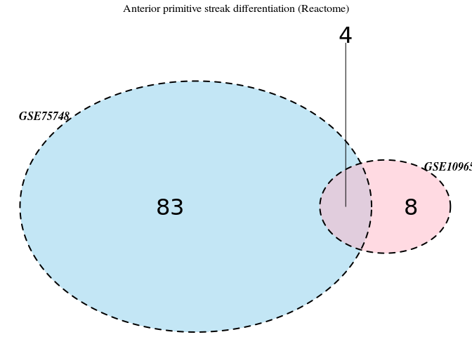

For Reactome there are only 4 common pathways between two sets. Plus (just like for KEGG) GSE75748 has huge amount of enriched terms

The common pathways of two data sets:

    ## [1] "COLLAGEN CHAIN TRIMERIZATION"         
    ## [2] "EXTRACELLULAR MATRIX ORGANIZATION"    
    ## [3] "WNT LIGAND BIOGENESIS AND TRAFFICKING"
    ## [4] "ELASTIC FIBRE FORMATION"

For Reactome we don't see consistency. GSE98411 didn't show any enrichment at all, however GSE75748 showed 87 enriched terms, and only 4 of them are common with GSE109658. But even these pathways are not specific at all. Collagen chain trimerization, extracellular matrix organization and elastic fibre formation might be relevant for every cell that is cultivated and treated with some component (see below). Thus, only Wnt ligand biogenesis and trafficking looks appropriate and conistent with the literature.

### Wiki

Let's compare Wiki pathway enrichment data for different data sets at this time point (0 hours - 24 hours)

#### GSE75748

There are 107 enriched Wiki pathways at this time point for GSE75748 (again so a lot of them!). Here they are:

    ##   [1] "B Cell Receptor Signaling Pathway"                                                   
    ##   [2] "EGF/EGFR Signaling Pathway"                                                          
    ##   [3] "Angiopoietin Like Protein 8 Regulatory Pathway"                                      
    ##   [4] "TGF-beta Receptor Signaling"                                                         
    ##   [5] "Integrated Breast Cancer Pathway"                                                    
    ##   [6] "TGF-B Signaling in Thyroid Cells for Epithelial-Mesenchymal Transition"              
    ##   [7] "Focal Adhesion"                                                                      
    ##   [8] "Primary Focal Segmental Glomerulosclerosis FSGS"                                     
    ##   [9] "Wnt/beta-catenin Signaling Pathway in Leukemia"                                      
    ##  [10] "Hepatitis C and Hepatocellular Carcinoma"                                            
    ##  [11] "miR-509-3p alteration of YAP1/ECM axis"                                              
    ##  [12] "TGF-beta Signaling Pathway"                                                          
    ##  [13] "Neural Crest Differentiation"                                                        
    ##  [14] "Arrhythmogenic Right Ventricular Cardiomyopathy"                                     
    ##  [15] "Hair Follicle Development: Cytodifferentiation (Part 3 of 3)"                        
    ##  [16] "Leptin signaling pathway"                                                            
    ##  [17] "DNA Damage Response (only ATM dependent)"                                            
    ##  [18] "Adipogenesis"                                                                        
    ##  [19] "Bladder Cancer"                                                                      
    ##  [20] "ESC Pluripotency Pathways"                                                           
    ##  [21] "Notch Signaling Pathway"                                                             
    ##  [22] "Mesodermal Commitment Pathway"                                                       
    ##  [23] "miRNA targets in ECM and membrane receptors"                                         
    ##  [24] "Integrin-mediated Cell Adhesion"                                                     
    ##  [25] "Endoderm Differentiation"                                                            
    ##  [26] "MAPK Signaling Pathway"                                                              
    ##  [27] "Prolactin Signaling Pathway"                                                         
    ##  [28] "Heart Development"                                                                   
    ##  [29] "Endometrial cancer"                                                                  
    ##  [30] "Association Between Physico-Chemical Features and Toxicity Associated Pathways"      
    ##  [31] "Endochondral Ossification"                                                           
    ##  [32] "IL-6 signaling pathway"                                                              
    ##  [33] "RANKL/RANK (Receptor activator of NFKB (ligand)) Signaling Pathway"                  
    ##  [34] "Wnt Signaling Pathway"                                                               
    ##  [35] "Cardiac Progenitor Differentiation"                                                  
    ##  [36] "Ebola Virus Pathway on Host"                                                         
    ##  [37] "Androgen receptor signaling pathway"                                                 
    ##  [38] "Splicing factor NOVA regulated synaptic proteins"                                    
    ##  [39] "Interleukin-11 Signaling Pathway"                                                    
    ##  [40] "Focal Adhesion-PI3K-Akt-mTOR-signaling pathway"                                      
    ##  [41] "IL-3 Signaling Pathway"                                                              
    ##  [42] "VEGFA-VEGFR2 Signaling Pathway"                                                      
    ##  [43] "LncRNA involvement in canonical Wnt signaling and colorectal cancer"                 
    ##  [44] "Pancreatic adenocarcinoma pathway"                                                   
    ##  [45] "PI3K-Akt Signaling Pathway"                                                          
    ##  [46] "Breast cancer pathway"                                                               
    ##  [47] "MET in type 1 papillary renal cell carcinoma"                                        
    ##  [48] "Ras Signaling"                                                                       
    ##  [49] "Epithelial to mesenchymal transition in colorectal cancer"                           
    ##  [50] "Wnt Signaling Pathway and Pluripotency"                                              
    ##  [51] "Corticotropin-releasing hormone signaling pathway"                                   
    ##  [52] "Insulin Signaling"                                                                   
    ##  [53] "PDGF Pathway"                                                                        
    ##  [54] "MicroRNAs in cardiomyocyte hypertrophy"                                              
    ##  [55] "Signaling Pathways in Glioblastoma"                                                  
    ##  [56] "Apoptosis-related network due to altered Notch3 in ovarian cancer"                   
    ##  [57] "IL-4 Signaling Pathway"                                                              
    ##  [58] "Wnt Signaling Pathway"                                                               
    ##  [59] "Chromosomal and microsatellite instability in colorectal cancer "                    
    ##  [60] "Regulation of Actin Cytoskeleton"                                                    
    ##  [61] "Human Thyroid Stimulating Hormone (TSH) signaling pathway"                           
    ##  [62] "Alpha 6 Beta 4 signaling pathway"                                                    
    ##  [63] "Differentiation Pathway"                                                             
    ##  [64] "Senescence and Autophagy in Cancer"                                                  
    ##  [65] "IL-5 Signaling Pathway"                                                              
    ##  [66] "IL17 signaling pathway"                                                              
    ##  [67] "Estrogen signaling pathway"                                                          
    ##  [68] "T-Cell antigen Receptor (TCR)  Signaling Pathway"                                    
    ##  [69] "Non-small cell lung cancer"                                                          
    ##  [70] "Chemokine signaling pathway"                                                         
    ##  [71] "Myometrial Relaxation and Contraction Pathways"                                      
    ##  [72] "Hedgehog Signaling Pathway"                                                          
    ##  [73] "Oncostatin M Signaling Pathway"                                                      
    ##  [74] "Kit receptor signaling pathway"                                                      
    ##  [75] "Wnt Signaling in Kidney Disease"                                                     
    ##  [76] "TNF related weak inducer of apoptosis (TWEAK) Signaling Pathway"                     
    ##  [77] "Nanoparticle-mediated activation of receptor signaling"                              
    ##  [78] "Spinal Cord Injury"                                                                  
    ##  [79] "Notch Signaling Pathway"                                                             
    ##  [80] "PDGFR-beta pathway"                                                                  
    ##  [81] "Lipid Metabolism Pathway"                                                            
    ##  [82] "Photodynamic therapy-induced AP-1 survival signaling."                               
    ##  [83] "Leptin Insulin Overlap"                                                              
    ##  [84] "Viral Acute Myocarditis"                                                             
    ##  [85] "Signaling of Hepatocyte Growth Factor Receptor"                                      
    ##  [86] "Aryl Hydrocarbon Receptor Pathway"                                                   
    ##  [87] "Brain-Derived Neurotrophic Factor (BDNF) signaling pathway"                          
    ##  [88] "IL-1 signaling pathway"                                                              
    ##  [89] "Aryl Hydrocarbon Receptor"                                                           
    ##  [90] "Extracellular vesicle-mediated signaling in recipient cells"                         
    ##  [91] "Ectoderm Differentiation"                                                            
    ##  [92] "Thymic Stromal LymphoPoietin (TSLP) Signaling Pathway"                               
    ##  [93] "BMP Signaling Pathway in Eyelid Development"                                         
    ##  [94] "miRs in Muscle Cell Differentiation"                                                 
    ##  [95] "ErbB Signaling Pathway"                                                              
    ##  [96] "Simplified Interaction Map Between LOXL4 and Oxidative Stress Pathway"               
    ##  [97] "AGE/RAGE pathway"                                                                    
    ##  [98] "The effect of progerin on the involved genes in Hutchinson-Gilford Progeria Syndrome"
    ##  [99] "White fat cell differentiation"                                                      
    ## [100] "TNF alpha Signaling Pathway"                                                         
    ## [101] "Serotonin Receptor 4/6/7 and NR3C Signaling"                                         
    ## [102] "MAPK Cascade"                                                                        
    ## [103] "Calcium Regulation in the Cardiac Cell"                                              
    ## [104] "Nuclear Receptors Meta-Pathway"                                                      
    ## [105] "Regulation of Wnt/B-catenin Signaling by Small Molecule Compounds"                   
    ## [106] "Vitamin D Receptor Pathway"                                                          
    ## [107] "Preimplantation Embryo"

#### GSE109658

There are 17 enriched Wiki pathways at this time point for GSE109658. Here they are:

    ##  [1] "Neural Crest Differentiation"                                          
    ##  [2] "ESC Pluripotency Pathways"                                             
    ##  [3] "Mesodermal Commitment Pathway"                                         
    ##  [4] "Heart Development"                                                     
    ##  [5] "Cardiac Progenitor Differentiation"                                    
    ##  [6] "LncRNA involvement in canonical Wnt signaling and colorectal cancer"   
    ##  [7] "Breast cancer pathway"                                                 
    ##  [8] "Epithelial to mesenchymal transition in colorectal cancer"             
    ##  [9] "Adipogenesis"                                                          
    ## [10] "Differentiation Pathway"                                               
    ## [11] "Wnt Signaling Pathway"                                                 
    ## [12] "TGF-B Signaling in Thyroid Cells for Epithelial-Mesenchymal Transition"
    ## [13] "Hair Follicle Development: Cytodifferentiation (Part 3 of 3)"          
    ## [14] "Endoderm Differentiation"                                              
    ## [15] "Wnt Signaling in Kidney Disease"                                       
    ## [16] "T-Cell antigen Receptor (TCR)  Signaling Pathway"                      
    ## [17] "DNA Damage Response (only ATM dependent)"

#### GSE98411

There are 12 enriched Wiki pathways at this time point for GSE98411.

    ##  [1] "Differentiation Pathway"                                            
    ##  [2] "ESC Pluripotency Pathways"                                          
    ##  [3] "Mesodermal Commitment Pathway"                                      
    ##  [4] "Endoderm Differentiation"                                           
    ##  [5] "Heart Development"                                                  
    ##  [6] "Cardiac Progenitor Differentiation"                                 
    ##  [7] "Breast cancer pathway"                                              
    ##  [8] "LncRNA involvement in canonical Wnt signaling and colorectal cancer"
    ##  [9] "Wnt Signaling in Kidney Disease"                                    
    ## [10] "Nuclear Receptors Meta-Pathway"                                     
    ## [11] "Dopaminergic Neurogenesis"                                          
    ## [12] "Wnt Signaling Pathway"

#### Analyzing overlap between different pathway databases

We compare GSE75748, GSE109658 and GSE98411: 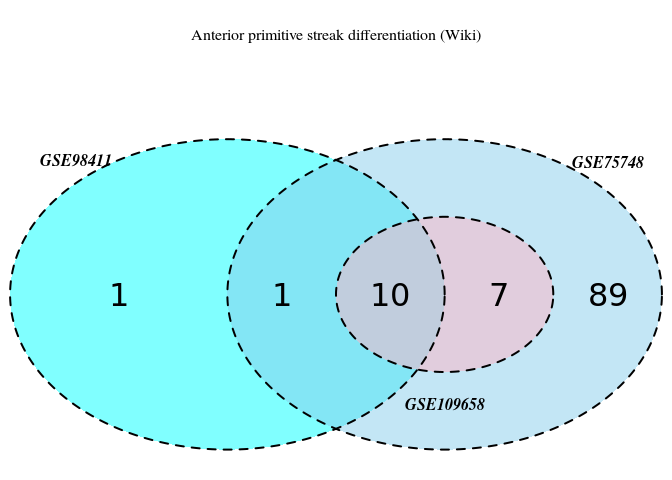

For Wiki pathways we see that enriched pathways of GSE109658 are completely included in GSE75748. Total intersection between all three data sets is 10 terms.

The common pathways of three data sets:

    ##  [1] "ESC Pluripotency Pathways"                                          
    ##  [2] "Mesodermal Commitment Pathway"                                      
    ##  [3] "Endoderm Differentiation"                                           
    ##  [4] "Heart Development"                                                  
    ##  [5] "Wnt Signaling Pathway"                                              
    ##  [6] "Cardiac Progenitor Differentiation"                                 
    ##  [7] "LncRNA involvement in canonical Wnt signaling and colorectal cancer"
    ##  [8] "Breast cancer pathway"                                              
    ##  [9] "Differentiation Pathway"                                            
    ## [10] "Wnt Signaling in Kidney Disease"

Results for Wiki pathways are much more interesting than for Reactome. It has Endoderm Differentiation term, which is very helpful in this analysis. Also we see mesodermal commitment pathway, which is consistent with findings from [papers](https://genomebiology.biomedcentral.com/articles/10.1186/s13059-016-1033-x) that definitive endoderm and mesoderm have some common markers and share some pathways. The same for heart development and cardiac progenitor differentiation terms, since heart comes from mesoderm. And since it's a primitive streak differentiation step, which is common for both definitive endoderm and mesoderm, it's no surprise here that we see presence of mesoderm related terms. Moreover, there is a differentiation pathway term, which points to differentiation process here. And there are Wnt signaling pathway related terms as well.

Overall, terms that might be specific only for DE differentiation (or related to it) are Endoderm differentiation, Wnt signaling pathway, LncRNA involvement in canonical Wnt signaling and colorectal cancer and Differentiation pathway.

#### Conclusion for 0h-24h time point

After running GSEA with three key pathway databases (KEGG, Wiki and Reactome) it's clear that only KEGG and Wiki give biologically meaningful results: presence of TGF-beta (KEGG), Wnt (KEGG and Wiki) and endoderm differentiation pathways (Wiki). Noteworthy, BMP and FGF pathways, which were shown to be beneficial for first stage of DE differentiation, are included in TGF-beta pathway of KEGG.

24h-96(72)h Time period
-----------------------

Now let's check the second time point in this differentiation process -&gt; differentiation of DE from anterior primitive streak.

### KEGG

Let's compare KEGG pathway enrichment data for different data sets at this time point.

#### GSE75748

There are 4 enriched KEGG pathways at this time point for GSE75748. Here they are:

    ## [1] "KEGG_FOCAL_ADHESION"                     
    ## [2] "KEGG_ECM_RECEPTOR_INTERACTION"           
    ## [3] "KEGG_COMPLEMENT_AND_COAGULATION_CASCADES"
    ## [4] "KEGG_HEMATOPOIETIC_CELL_LINEAGE"

Nothing really related to DE differentiation, except maybe HEMATOPOIETIC\_CELL\_LINEAGE, which is mesoderm related.

#### GSE109658

There are 6 enriched KEGG pathways at this time point for GSE109658. Here they are:

    ## [1] "KEGG_AXON_GUIDANCE"                                           
    ## [2] "KEGG_ECM_RECEPTOR_INTERACTION"                                
    ## [3] "KEGG_LEUKOCYTE_TRANSENDOTHELIAL_MIGRATION"                    
    ## [4] "KEGG_CELL_ADHESION_MOLECULES_CAMS"                            
    ## [5] "KEGG_GLYCOSPHINGOLIPID_BIOSYNTHESIS_LACTO_AND_NEOLACTO_SERIES"
    ## [6] "KEGG_FOCAL_ADHESION"

Again nothing really related to DE differentiation.

#### GSE98411

There are 10 enriched KEGG pathways at this time point for GSE98411. Here they are:

    ##  [1] "KEGG_AXON_GUIDANCE"                         
    ##  [2] "KEGG_FOCAL_ADHESION"                        
    ##  [3] "KEGG_ECM_RECEPTOR_INTERACTION"              
    ##  [4] "KEGG_COMPLEMENT_AND_COAGULATION_CASCADES"   
    ##  [5] "KEGG_CYTOKINE_CYTOKINE_RECEPTOR_INTERACTION"
    ##  [6] "KEGG_PPAR_SIGNALING_PATHWAY"                
    ##  [7] "KEGG_LEUKOCYTE_TRANSENDOTHELIAL_MIGRATION"  
    ##  [8] "KEGG_DILATED_CARDIOMYOPATHY"                
    ##  [9] "KEGG_HYPERTROPHIC_CARDIOMYOPATHY_HCM"       
    ## [10] "KEGG_MAPK_SIGNALING_PATHWAY"

#### Analyzing overlap between different pathway databases

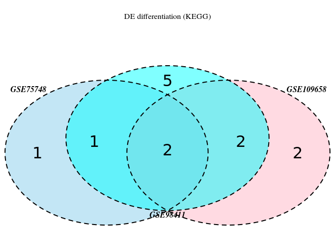

Now we have approximately the same number of pathways. But there are only two of them, which are common.

Here are the common pathways of all data sets:

    ## [1] "KEGG_FOCAL_ADHESION"           "KEGG_ECM_RECEPTOR_INTERACTION"

Those are not specific at all, which basically says that KEGG is not good for consistent enrichment analysis of pathways occuring at later stage of DE differentiation (or maybe data sets are not that good as well).

### Reactome

Let's compare Reactome pathway enrichment data for different data sets at this time point (24 hours - 96 hours)

#### GSE75748

There are 22 enriched Reactome pathways at this time point for GSE75748. Here they are:

    ##  [1] "COLLAGEN CHAIN TRIMERIZATION"                                
    ##  [2] "PLATELET ACTIVATION, SIGNALING AND AGGREGATION"              
    ##  [3] "COLLAGEN BIOSYNTHESIS AND MODIFYING ENZYMES"                 
    ##  [4] "EXTRACELLULAR MATRIX ORGANIZATION"                           
    ##  [5] "COLLAGEN FORMATION"                                          
    ##  [6] "PLATELET DEGRANULATION"                                      
    ##  [7] "GPCR LIGAND BINDING"                                         
    ##  [8] "ASSEMBLY OF COLLAGEN FIBRILS AND OTHER MULTIMERIC STRUCTURES"
    ##  [9] "REGULATION OF IGF ACTIVITY BY IGFBP"                         
    ## [10] "ECM PROTEOGLYCANS"                                           
    ## [11] "ELASTIC FIBRE FORMATION"                                     
    ## [12] "RESPONSE TO ELEVATED PLATELET CYTOSOLIC CA2+"                
    ## [13] "POST-TRANSLATIONAL PROTEIN PHOSPHORYLATION"                  
    ## [14] "NETRIN-1 SIGNALING"                                          
    ## [15] "SCAVENGING BY CLASS A RECEPTORS"                             
    ## [16] "CLASS A 1 (RHODOPSIN-LIKE RECEPTORS)"                        
    ## [17] "PEPTIDE LIGAND-BINDING RECEPTORS"                            
    ## [18] "COMPLEMENT CASCADE"                                          
    ## [19] "SIGNAL TRANSDUCTION BY L1"                                   
    ## [20] "DISEASES OF GLYCOSYLATION"                                   
    ## [21] "BINDING AND UPTAKE OF LIGANDS BY SCAVENGER RECEPTORS"        
    ## [22] "G ALPHA (Q) SIGNALLING EVENTS"

A lot of pathways that are associated with ECM organization and collagen formation.

#### GSE109658

There are 30 enriched Reactome pathways at this time point for GSE109658. Here they are:

    ##  [1] "COLLAGEN CHAIN TRIMERIZATION"                  
    ##  [2] "EXTRACELLULAR MATRIX ORGANIZATION"             
    ##  [3] "ECM PROTEOGLYCANS"                             
    ##  [4] "POST-TRANSLATIONAL PROTEIN PHOSPHORYLATION"    
    ##  [5] "COLLAGEN BIOSYNTHESIS AND MODIFYING ENZYMES"   
    ##  [6] "REGULATION OF IGF ACTIVITY BY IGFBP"           
    ##  [7] "G ALPHA (I) SIGNALLING EVENTS"                 
    ##  [8] "LIPOPROTEIN METABOLISM"                        
    ##  [9] "COLLAGEN FORMATION"                            
    ## [10] "DOPAMINE NEUROTRANSMITTER RELEASE CYCLE"       
    ## [11] "PLATELET DEGRANULATION"                        
    ## [12] "ELASTIC FIBRE FORMATION"                       
    ## [13] "NETRIN-1 SIGNALING"                            
    ## [14] "INTEGRIN CELL SURFACE INTERACTIONS"            
    ## [15] "OTHER SEMAPHORIN INTERACTIONS"                 
    ## [16] "SURFACTANT METABOLISM"                         
    ## [17] "PLATELET ACTIVATION, SIGNALING AND AGGREGATION"
    ## [18] "RESPONSE TO ELEVATED PLATELET CYTOSOLIC CA2+"  
    ## [19] "REGULATION OF COMPLEMENT CASCADE"              
    ## [20] "COMPLEMENT CASCADE"                            
    ## [21] "PLASMA LIPOPROTEIN CLEARANCE"                  
    ## [22] "ION CHANNEL TRANSPORT"                         
    ## [23] "EFFECTS OF PIP2 HYDROLYSIS"                    
    ## [24] "KERATAN SULFATE KERATIN METABOLISM"            
    ## [25] "SIGNALING BY BMP"                              
    ## [26] "COLLAGEN DEGRADATION"                          
    ## [27] "PLASMA LIPOPROTEIN REMODELING"                 
    ## [28] "CELL-CELL JUNCTION ORGANIZATION"               
    ## [29] "MUSCLE CONTRACTION"                            
    ## [30] "DISEASES OF GLYCOSYLATION"

Again we have a lot of collagen and ECM related pathways. Also, notice that there is a signaling by BMP. According to [published data](https://www.cell.com/cell-reports/abstract/S2211-1247(18)30151-7) BMP is inhibited at later stages of DE differentiation. Here comes the question, how should we interpret the result of GSEA enrichment: if we see enrichment at the top for one of the pathways, does it mean that it's activated? Probably it depends on annotation, here it's Reactome, and probably signaling by BMP has no direction.

#### GSE98411

There are 41 enriched Reactome pathways at this time point for GSE98411.

    ##  [1] "COLLAGEN CHAIN TRIMERIZATION"                                
    ##  [2] "PLATELET ACTIVATION, SIGNALING AND AGGREGATION"              
    ##  [3] "LIPOPROTEIN METABOLISM"                                      
    ##  [4] "EXTRACELLULAR MATRIX ORGANIZATION"                           
    ##  [5] "RESPONSE TO ELEVATED PLATELET CYTOSOLIC CA2+"                
    ##  [6] "G ALPHA (I) SIGNALLING EVENTS"                               
    ##  [7] "COLLAGEN FORMATION"                                          
    ##  [8] "POST-TRANSLATIONAL PROTEIN PHOSPHORYLATION"                  
    ##  [9] "PLATELET DEGRANULATION"                                      
    ## [10] "NETRIN-1 SIGNALING"                                          
    ## [11] "ASSEMBLY OF COLLAGEN FIBRILS AND OTHER MULTIMERIC STRUCTURES"
    ## [12] "PLASMA LIPOPROTEIN REMODELING"                               
    ## [13] "REGULATION OF IGF ACTIVITY BY IGFBP"                         
    ## [14] "INTEGRIN CELL SURFACE INTERACTIONS"                          
    ## [15] "COLLAGEN BIOSYNTHESIS AND MODIFYING ENZYMES"                 
    ## [16] "SEMAPHORIN INTERACTIONS"                                     
    ## [17] "MUSCLE CONTRACTION"                                          
    ## [18] "PEPTIDE LIGAND-BINDING RECEPTORS"                            
    ## [19] "ELASTIC FIBRE FORMATION"                                     
    ## [20] "PLASMA LIPOPROTEIN CLEARANCE"                                
    ## [21] "STRIATED MUSCLE CONTRACTION"                                 
    ## [22] "CELL JUNCTION ORGANIZATION"                                  
    ## [23] "VISUAL PHOTOTRANSDUCTION"                                    
    ## [24] "DEGRADATION OF THE EXTRACELLULAR MATRIX"                     
    ## [25] "CLASS A 1 (RHODOPSIN-LIKE RECEPTORS)"                        
    ## [26] "DEATH RECEPTOR SIGNALLING"                                   
    ## [27] "CELL-CELL COMMUNICATION"                                     
    ## [28] "RETINOID METABOLISM AND TRANSPORT"                           
    ## [29] "CELL SURFACE INTERACTIONS AT THE VASCULAR WALL"              
    ## [30] "NCAM SIGNALING FOR NEURITE OUT-GROWTH"                       
    ## [31] "NON-INTEGRIN MEMBRANE-ECM INTERACTIONS"                      
    ## [32] "P75 NTR RECEPTOR-MEDIATED SIGNALLING"                        
    ## [33] "METABOLISM OF FAT-SOLUBLE VITAMINS"                          
    ## [34] "ECM PROTEOGLYCANS"                                           
    ## [35] "ACTIVATION OF MATRIX METALLOPROTEINASES"                     
    ## [36] "GAP JUNCTION TRAFFICKING AND REGULATION"                     
    ## [37] "CELL-CELL JUNCTION ORGANIZATION"                             
    ## [38] "MOLECULES ASSOCIATED WITH ELASTIC FIBRES"                    
    ## [39] "NCAM1 INTERACTIONS"                                          
    ## [40] "GPCR LIGAND BINDING"                                         
    ## [41] "NRAGE SIGNALS DEATH THROUGH JNK"

#### Analyzing overlap between different pathway databases

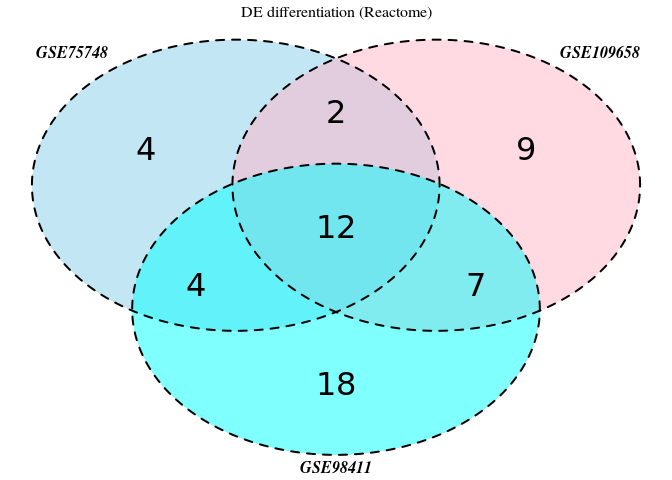

For Reactome there are only 12 common pathways between three sets. This time again the overall numbers are comparable.

The common pathways of two data sets:

    ##  [1] "COLLAGEN CHAIN TRIMERIZATION"                  
    ##  [2] "PLATELET ACTIVATION, SIGNALING AND AGGREGATION"
    ##  [3] "COLLAGEN BIOSYNTHESIS AND MODIFYING ENZYMES"   
    ##  [4] "EXTRACELLULAR MATRIX ORGANIZATION"             
    ##  [5] "COLLAGEN FORMATION"                            
    ##  [6] "PLATELET DEGRANULATION"                        
    ##  [7] "REGULATION OF IGF ACTIVITY BY IGFBP"           
    ##  [8] "ECM PROTEOGLYCANS"                             
    ##  [9] "ELASTIC FIBRE FORMATION"                       
    ## [10] "RESPONSE TO ELEVATED PLATELET CYTOSOLIC CA2+"  
    ## [11] "POST-TRANSLATIONAL PROTEIN PHOSPHORYLATION"    
    ## [12] "NETRIN-1 SIGNALING"

So among common pathways we see presence of mostly not related to DE differentiation processes, such as collagen formation and ECM organization. Also, there is presence of Regulation of IGF activity by IGFBP term, which is also controversial to some [papers](https://www.ncbi.nlm.nih.gov/pubmed/17204604) that state that reduced level of IGF is critical for stem cell commitment into DE.

### Wiki

Let's compare Wiki pathway enrichment data for different data sets at this time point (24 hours - 96 hours)

#### GSE75748

There are 10 enriched Wiki pathways at this time point for GSE75748. Here they are:

    ##  [1] "Hematopoietic Stem Cell Differentiation"       
    ##  [2] "Senescence and Autophagy in Cancer"            
    ##  [3] "Endothelin Pathways"                           
    ##  [4] "Ectoderm Differentiation"                      
    ##  [5] "Heart Development"                             
    ##  [6] "Wnt Signaling Pathway"                         
    ##  [7] "PI3K-Akt Signaling Pathway"                    
    ##  [8] "Focal Adhesion-PI3K-Akt-mTOR-signaling pathway"
    ##  [9] "Endochondral Ossification"                     
    ## [10] "Complement and Coagulation Cascades"

Surprisingly, but again we see mesoderm related terms. And even ectoderm differentiation.

#### GSE109658

There are 4 enriched Wiki pathways at this time point for GSE109658. Here they are:

    ## [1] "Ectoderm Differentiation"                      
    ## [2] "Focal Adhesion-PI3K-Akt-mTOR-signaling pathway"
    ## [3] "PI3K-Akt Signaling Pathway"                    
    ## [4] "Phosphodiesterases in neuronal function"

#### GSE98411

There are 21 enriched Wiki pathways at this time point for GSE98411.

    ##  [1] "GPCRs, Class A Rhodopsin-like"                                                                                   
    ##  [2] "Focal Adhesion"                                                                                                  
    ##  [3] "Primary Focal Segmental Glomerulosclerosis FSGS"                                                                 
    ##  [4] "Nuclear Receptors Meta-Pathway"                                                                                  
    ##  [5] "Ectoderm Differentiation"                                                                                        
    ##  [6] "Senescence and Autophagy in Cancer"                                                                              
    ##  [7] "Peptide GPCRs"                                                                                                   
    ##  [8] "Hypothesized Pathways in Pathogenesis of Cardiovascular Disease"                                                 
    ##  [9] "Vitamin D Receptor Pathway"                                                                                      
    ## [10] "VEGFA-VEGFR2 Signaling Pathway"                                                                                  
    ## [11] "Myometrial Relaxation and Contraction Pathways"                                                                  
    ## [12] "Adipogenesis"                                                                                                    
    ## [13] "Complement and Coagulation Cascades"                                                                             
    ## [14] "Oligodendrocyte Specification and differentiation(including remyelination), leading to Myelin Components for CNS"
    ## [15] "Striated Muscle Contraction"                                                                                     
    ## [16] "Focal Adhesion-PI3K-Akt-mTOR-signaling pathway"                                                                  
    ## [17] "Statin Pathway"                                                                                                  
    ## [18] "Canonical and Non-Canonical TGF-B signaling"                                                                     
    ## [19] "Endochondral Ossification"                                                                                       
    ## [20] "Vitamin B12 Metabolism"                                                                                          
    ## [21] "Photodynamic therapy-induced unfolded protein response"

#### Analyzing overlap between different pathway databases

We compare only GSE75748, GSE109658 and GSE98411: 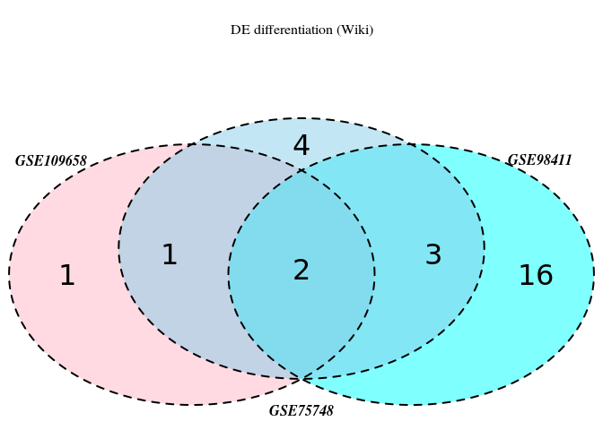

Again we have not very informative Vienn diagram.

The common pathways of three data sets:

    ## [1] "Ectoderm Differentiation"                      
    ## [2] "Focal Adhesion-PI3K-Akt-mTOR-signaling pathway"

With Wiki pathways results are also not that great and informative. We see that all three data sets enriched at this time point with Ectoderm Differentiation pathway, which probably doesn't make sense. Or, taking into account that it's a differentiation between 24 and 96(72) hours, there might be common regulators between endoderm and ectoderm that are upregulated only at late stages of DE differentiation. PI3K-Akt-mTOR axis migh be relevant here, since It's known to interact with Activin/Nodal/TGF-beta pathway during differentiation, and also we can't say after GSEA without appropriate annotation, whether it's activated or down-regulated pathway.

#### Conclusion for 24h-96h time point

This time point turns out to be not so informative. Both KEGG and Reactome mostly showed common presence of collagen and ECM related pathways. Wiki showed controversial common enrichment of Ectoderm differentiation at that time point and PI3K-Akt-mTOR signaling pathway, which with some hands waving can be interpreted as a reasonable finding. Why this time point is not informative? There might be several reasons:

1.  bulk RNA-seq is not good for that type of analysis since population of cell can become more heterogeneous during time.
2.  annotations are not good enough in terms of annotation of appropriate pathways like FGF or BMP (KEGG for example), but these databases are common among all researchers in the world so it's hard to say that.
3.  all major pathways that play crucial role during DE differentiation (TGF-beta, Wnt, MAPK pathway and so on) are already enriched during first stage and do not change significantly between 24 and 96 hours.

Analysis of LINCS database
==========================

LINCS data was converted to log-fold changes for each individual experiment by PhD student from Paul Pavlidis lab, Nathaniel Lim.

Several assumptions, which he made:

1.  All samples with the same "$DOSE $CHEMICAL $TIME $CELL" properties to be an identical experiment, while disregarding which L1000-plate the data comes from. The shortcoming of this is the inability to perform batch correction, especially if the same experiment is performed many times across different plates and/or centres; The good approximation of the "true mean" can be made with law of large numbers only for controls (their mean sample size is around 400), however for actual treatments it is around 10.
2.  Fold Change is calculated as the difference between the mean treatment expression and mean control expression (both which are log2-transformed). The method used for "condition matching" is a little complicated, though the underlying logic is very simple. The idea is to match the treatment and control groups so that as many factors are similar as possible. In the order of strictness, the factors taken into consideration are:

-   The treatment and control samples are from the same cell line. (Absolute minimum)
-   The treatment and control samples are from the same time point. (This rule is broken very infrequently when the appropriate control samples do not exist)

1.  For compound treatments (trt\_cp), the control must either be vehicle controls (ctl\_vehicle) or untreated controls (ctl\_untrt). The order of preferred control samples are (left-most being highly preferred): DMSO, PBS/H2O/Untreated, Misc\*. Conditioned upon the above rules being fulfilled, the group with the most samples will be chosen for the control group.

LINCS has around 70 cell lines, but only ~15 of them have big number of samples. For now let's focus on one cell line. Since we try to predict small molecules that can be beneficial for stem cell differentiation, it would be better to find cell line, which is the most similar to stem cells. LINCS mostly contains cancer cell lines and according to Francis Lynn and Michael Underhill none of them actually resemble hESC.

I decided to go with MCF7, because it has some similarity in epigenetic bivalent marks (H3K4me3 and H3K27me3 co-localized at gene promoters) with hESC according to this [paper](https://www.ncbi.nlm.nih.gov/pmc/articles/PMC4946968/).

So each LINCS data set contains 12328 genes (L1000, well inferred and inferred).

There are 14722 experiments with MCF7 cell line, which were performed for 24 hours (not including replicates). If we take unique molecules (some molecules were used with different concentration and duration), this amount will reduce to 10627.

For this data analysis I used only experiments with unique molecules, for each molecule I took the highest concentration. Duration of treatment (24 hours) was chosen based on duration of first stage DE differentiation.

This drug treatment data were analyzed with all pathway databases: KEGG, Reactome and Wiki. Here are the results.

KEGG
----

So GSEA with KEGG annotation was performed for every instance (for every compound) in MCF7. If we count for each pathway, how many times it's found to be enriched in different experiments in MCF7, here are the top results: 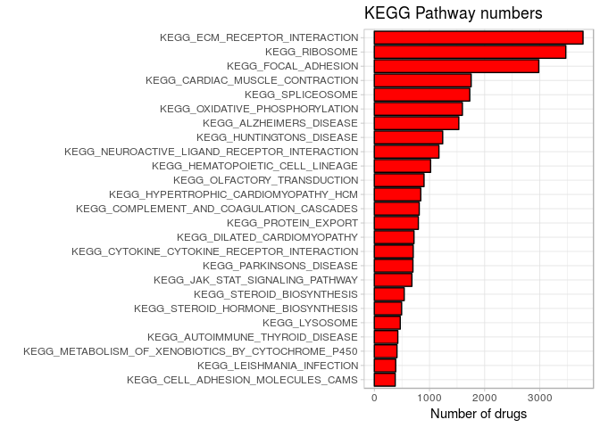

So we see that ECM receptor interaction is found in more than 3000 experiments (the total number again is 10627). Other frequently enriched pathways are Ribosome, Focal adhesion, Spliceosome and others. So indeed we see that ECM and Focal adhesion terms are not specific at all.

Most rarely enriched pathways: 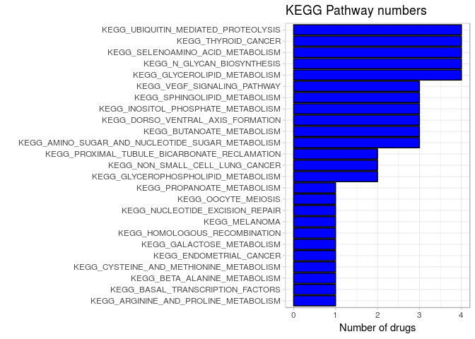

Amount of drugs that have enriched pathways that are associated with DE differentiation (see above): 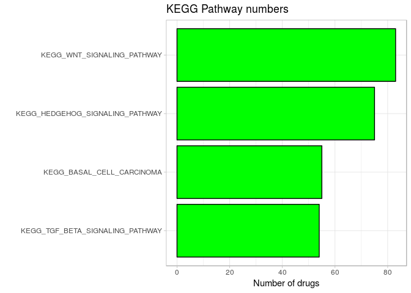

To be more specific, let's focus on those drugs that both activate TGF-beta and Wnt signaling pathways. It's only 3 small molecules and here they are:

    ## [1] "carbetocin"  "linifanib"   "mestanolone"

Here are the enriched pathways in Carbetocin:

    ##                                                      pathway
    ## 1                                              KEGG_RIBOSOME
    ## 2                                KEGG_MAPK_SIGNALING_PATHWAY
    ## 3                KEGG_CYTOKINE_CYTOKINE_RECEPTOR_INTERACTION
    ## 4               KEGG_NEUROACTIVE_LIGAND_RECEPTOR_INTERACTION
    ## 5                                 KEGG_WNT_SIGNALING_PATHWAY
    ## 6                            KEGG_TGF_BETA_SIGNALING_PATHWAY
    ## 7                                        KEGG_FOCAL_ADHESION
    ## 8                              KEGG_ECM_RECEPTOR_INTERACTION
    ## 9                          KEGG_CELL_ADHESION_MOLECULES_CAMS
    ## 10                                    KEGG_ADHERENS_JUNCTION
    ## 11                  KEGG_COMPLEMENT_AND_COAGULATION_CASCADES
    ## 12                           KEGG_JAK_STAT_SIGNALING_PATHWAY
    ## 13                           KEGG_HEMATOPOIETIC_CELL_LINEAGE
    ## 14                 KEGG_LEUKOCYTE_TRANSENDOTHELIAL_MIGRATION
    ## 15                               KEGG_OLFACTORY_TRANSDUCTION
    ## 16                     KEGG_REGULATION_OF_ACTIN_CYTOSKELETON
    ## 17                                      KEGG_PROSTATE_CANCER
    ## 18                               KEGG_SMALL_CELL_LUNG_CANCER
    ## 19 KEGG_ARRHYTHMOGENIC_RIGHT_VENTRICULAR_CARDIOMYOPATHY_ARVC
    ## 20                               KEGG_DILATED_CARDIOMYOPATHY

It is also enriched for HEMATOPOIETIC CELL LINEAGE pathway, which might be interesting, since hematopoietic cells are derived from mesoderm. Also it's enriched for prostate and lung cancer pathways, which also might point to some stem cell related process. Moreover, JAK/STAT might be [beneficial for myogenesis](https://www.ncbi.nlm.nih.gov/pubmed/21388555).

Now let's check linifanib:

    ##                                                      pathway
    ## 1                                KEGG_MAPK_SIGNALING_PATHWAY
    ## 2                                KEGG_ERBB_SIGNALING_PATHWAY
    ## 3                                              KEGG_LYSOSOME
    ## 4                                           KEGG_ENDOCYTOSIS
    ## 5                                             KEGG_APOPTOSIS
    ## 6                            KEGG_CARDIAC_MUSCLE_CONTRACTION
    ## 7                    KEGG_VASCULAR_SMOOTH_MUSCLE_CONTRACTION
    ## 8                                 KEGG_WNT_SIGNALING_PATHWAY
    ## 9                               KEGG_NOTCH_SIGNALING_PATHWAY
    ## 10                           KEGG_HEDGEHOG_SIGNALING_PATHWAY
    ## 11                           KEGG_TGF_BETA_SIGNALING_PATHWAY
    ## 12                                        KEGG_AXON_GUIDANCE
    ## 13                               KEGG_VEGF_SIGNALING_PATHWAY
    ## 14                                       KEGG_FOCAL_ADHESION
    ## 15                             KEGG_ECM_RECEPTOR_INTERACTION
    ## 16                                    KEGG_ADHERENS_JUNCTION
    ## 17                                         KEGG_GAP_JUNCTION
    ## 18            KEGG_NATURAL_KILLER_CELL_MEDIATED_CYTOTOXICITY
    ## 19                     KEGG_FC_GAMMA_R_MEDIATED_PHAGOCYTOSIS
    ## 20                 KEGG_LEUKOCYTE_TRANSENDOTHELIAL_MIGRATION
    ## 21                               KEGG_LONG_TERM_POTENTIATION
    ## 22                       KEGG_NEUROTROPHIN_SIGNALING_PATHWAY
    ## 23                     KEGG_REGULATION_OF_ACTIN_CYTOSKELETON
    ## 24                               KEGG_GNRH_SIGNALING_PATHWAY
    ## 25                                        KEGG_MELANOGENESIS
    ## 26             KEGG_VASOPRESSIN_REGULATED_WATER_REABSORPTION
    ## 27              KEGG_PROXIMAL_TUBULE_BICARBONATE_RECLAMATION
    ## 28                            KEGG_VIBRIO_CHOLERAE_INFECTION
    ## 29                                               KEGG_GLIOMA
    ## 30                                      KEGG_PROSTATE_CANCER
    ## 31                                       KEGG_THYROID_CANCER
    ## 32                                       KEGG_BLADDER_CANCER
    ## 33                             KEGG_CHRONIC_MYELOID_LEUKEMIA
    ## 34                               KEGG_SMALL_CELL_LUNG_CANCER
    ## 35 KEGG_ARRHYTHMOGENIC_RIGHT_VENTRICULAR_CARDIOMYOPATHY_ARVC
    ## 36                               KEGG_DILATED_CARDIOMYOPATHY

It is enriched for MAPK pathway, which is also required for [definitive endoderm differentiation](https://www.ncbi.nlm.nih.gov/pubmed/22960178). However we should keep in mind that MAPK pathway is among the most abundant pathways.

Now mestanolone:

    ##                                                      pathway
    ## 1                          KEGG_STEROID_HORMONE_BIOSYNTHESIS
    ## 2                                KEGG_PPAR_SIGNALING_PATHWAY
    ## 3                             KEGG_CALCIUM_SIGNALING_PATHWAY
    ## 4                KEGG_CYTOKINE_CYTOKINE_RECEPTOR_INTERACTION
    ## 5               KEGG_NEUROACTIVE_LIGAND_RECEPTOR_INTERACTION
    ## 6                                 KEGG_WNT_SIGNALING_PATHWAY
    ## 7                            KEGG_TGF_BETA_SIGNALING_PATHWAY
    ## 8                                         KEGG_AXON_GUIDANCE
    ## 9                                        KEGG_FOCAL_ADHESION
    ## 10                             KEGG_ECM_RECEPTOR_INTERACTION
    ## 11                               KEGG_OLFACTORY_TRANSDUCTION
    ## 12                             KEGG_PRIMARY_IMMUNODEFICIENCY
    ## 13 KEGG_ARRHYTHMOGENIC_RIGHT_VENTRICULAR_CARDIOMYOPATHY_ARVC
    ## 14                               KEGG_DILATED_CARDIOMYOPATHY

Still it's quite hard to tell something more about these drugs and their potential mechanism since KEGG terms are so broad.

Reactome
--------

Now let's build the same figures for Reactome: 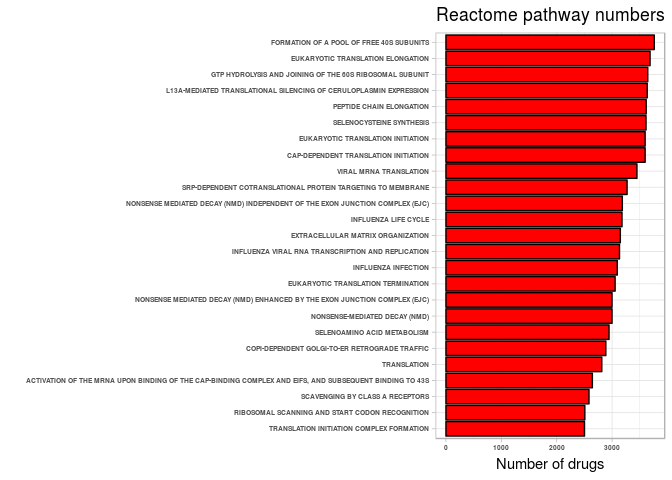

Here among enriched terms we can see a lot of pathways associated with protein synthesis and translation (recall that for KEGG RIBOSOME was among the most enriched ones). Also, just like in KEGG analysis, Extracellular matrix organization (ECM organization is among the top pathways).

Most rarely enriched pathways: 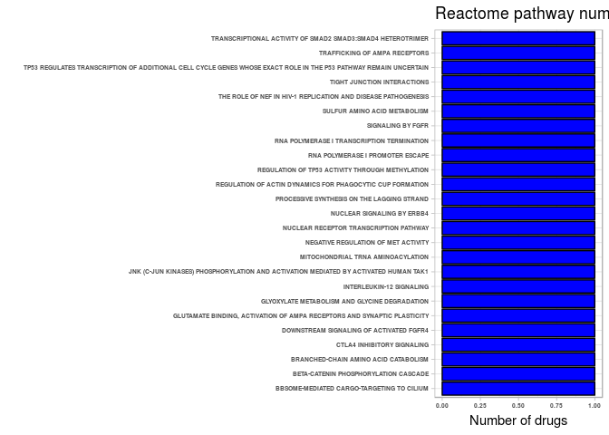

Noteworthy, there is one instance of drugs that activate pathways, which might be related to DE differentiation: TRANSCRIPTIONAL ACTIVITY OF SMAD2 SMAD3:SMAD4 HETEROTRIMER (narciclasine), DOWNSTREAM SIGNALING OF ACTIVATED FGFR4, SIGNALING BY FGFR (CHIR-99021 ), NUCLEAR SIGNALING BY ERBB4, BETA-CATENIN PHOSPHORYLATION CASCADE (RS-102221). Drugs that are enriched for these pathways are nacriclasine, CHIR-99021 and RS-102221

Narciclasine also enriched for RUNX1 REGULATES TRANSCRIPTION OF GENES INVOLVED IN DIFFERENTIATION OF HSCS, NEGATIVE REGULATION OF MAPK PATHWAY, DOWNREGULATION OF SMAD2 3:SMAD4 TRANSCRIPTIONAL ACTIVITY (!), ACTIVATION OF HOX GENES DURING DIFFERENTIATION, ACTIVATION OF ANTERIOR HOX GENES IN HINDBRAIN DEVELOPMENT, MAP KINASE ACTIVATION (!), also beta-catenin. Signaling by notch is probably more associated with mesoderm differentiation. (in KEGG only MAPK). To conclude, this drug is not so interesting.

CHIR-99021 has SIGNALING BY NOTCH4, DEGRADATION OF BETA-CATENIN BY THE DESTRUCTION COMPLEX, NEGATIVE REGULATION OF NOTCH4 SIGNALING, TCF DEPENDENT SIGNALING IN RESPONSE TO WNT, ERK1 ERK2 PATHWAY, HEDGEHOG 'ON' STATE, EGFR DOWNREGULATION, HEDGEHOG 'OFF' STATE, SIGNALING BY FGFR, SIGNALING BY WNT. (in KEGG nothing). This drug is used for the first step of [DE differentiation](https://www.ncbi.nlm.nih.gov/pubmed/24913278). But it's necessary only for the first stage, prolonged action leads to mesoderm formation.

RS-102221 has nothing really interesting.

How many of those drugs that activate WNT LIGAND BIOGENESIS AND TRAFFICKING (which was present in all two tested GSE data sets)?

``` r
drugs_Reactome <- rownames(all_drugs_Reactome)
all_drugs_Reactome <- as.data.frame(all_drugs_Reactome)
rownames(all_drugs_Reactome) <- drugs_Reactome

test <- all_drugs_Reactome %>%
  rownames_to_column("drug") %>%
  filter(`WNT LIGAND BIOGENESIS AND TRAFFICKING%REACTOME%R-HSA-3238698.1` == 1)

test$drug 
```

    ##   [1] "LY-294002"     "ixazomib"      "BRD-K22215695" "BRD-K61627029"
    ##   [5] "BRD-K22988559" "BRD-K85275009" "BRD-K23342641" "BRD-A06641369"
    ##   [9] "BRD-A76641868" "BRD-K23935793" "BRD-K27484191" "BRD-K35100517"
    ##  [13] "BRD-K36287933" "BRD-K51973945" "BRD-K60870698" "BRD-K73709114"
    ##  [17] "BRD-K36087356" "BRD-K15640888" "KU-C103428N"   "KU-C104236N"  
    ##  [21] "BRD-A53107311" "BRD-K48974000" "BRD-A97035593" "BRD-A35141262"
    ##  [25] "BRD-K72787121" "BRD-K97274161" "BRD-K56446541" "BRD-K59024967"
    ##  [29] "BRD-K13842623" "BRD-K70503895" "BRD-K92458042" "BRD-K00925050"
    ##  [33] "BRD-K37940862" "BRD-A93942655" "PSH-013"       "PSH-023"      
    ##  [37] "VU-0403126"    "BRD-K95337198" "BRD-K87726525" "BRD-K11928012"
    ##  [41] "VU-0418939-2"  "VU-0418946-1"  "VU-0418947-2"  "methotrexate" 
    ##  [45] "GP-42"         "BRD-A43155244" "BRD-K01614657" "BRD-K08307026"
    ##  [49] "SC-I-004"      "BRD-K61717269" "MD-049"        "BRD-K75128590"
    ##  [53] "BRD-K81795824" "BRD-K88964386" "BRD-A72837804" "BRD-K31851742"
    ##  [57] "JFD02227"      "PD-168077"     "varenicline"   "topotecan"    
    ##  [61] "tunicamycin"   "thiostrepton"  "BRD-K45044657" "belinostat"   
    ##  [65] "KM-00927"      "epirubicin"    "SA-247714"     "SA-1017940"   
    ##  [69] "BRD-K05001416" "BRD-K57346283" "SA-1925246"    "SA-247636"    
    ##  [73] "SA-418993"     "SA-427604"     "SA-1459031"    "SA-1459172"   
    ##  [77] "SA-1919710"    "SA-247582"     "SA-247592"     "SA-419172"    
    ##  [81] "SA-426029"     "SA-1456195"    "SA-1459234"    "SA-1922111"   
    ##  [85] "SA-1922257"    "SA-1944378"    "SA-424763"     "SA-1456170"   
    ##  [89] "SA-1921599"    "SA-243193"     "BRD-K00007652" "BRD-K79797318"
    ##  [93] "SA-1922796"    "BRD-K45355657" "BRD-K46285453" "BRD-K59761766"
    ##  [97] "BRD-K53987746" "BRD-K76211160" "BRD-K84855138" "BRD-K20168484"
    ## [101] "AF-DX-116"     "ampiroxicam"   "BRD-K09295900" "lorazepam"

Almost 104! But are they specific? It's hard to tell since GSEA analysis of Reactome pathways didn't show any specific terms for DE differentiation.

Also let's try the following term SIGNALING BY TGF-BETA RECEPTOR COMPLEX (which is interesting, since we know that TGF-beta pathways plays a crucial role in differentiation process):

    ##  [1] "SCH-79797"                       "BRD-K64024097"                  
    ##  [3] "Merck60"                         "BRD-K18929270"                  
    ##  [5] "BRD-K08412560"                   "BRD-K14200107"                  
    ##  [7] "Broad-Sai-609"                   "benzohydroxamic-acid"           
    ##  [9] "BRD-K61894884"                   "Broad-Sai-370"                  
    ## [11] "phorbol-12-myristate-13-acetate" "BRD-K69894866"

None of them also enriched for WNT LIGAND BIOGENESIS AND TRAFFICKING! But are there some drugs that are enriched for TGF-BETA RECEPTOR SIGNALING ACTIVATES SMADS, which is also might be relevant for DE differentiation, since signal for differentiation from TGF-beta goes through SMAD complex.

    ## [1] "BRD-K53932786" "BRD-K92048968" "BRD-K36462169" "BRD-K69894866"

Again, none of these molecules is enriched for Wnt trafficking. But BRD-K69894866 (which is also enriched for TGF-beta receptor complex signaling) is enriched for this SMAD-related pathway!

Another potentially related to DE differentiation pathway is TGF-BETA RECEPTOR SIGNALING IN EMT (EPITHELIAL TO MESENCHYMAL TRANSITION), since [EMT is crucial for DE differentiation](https://www.nature.com/articles/ncomms15166).

    ## [1] "BRD-K10361096" "BRD-K30351863" "BRD-K69396629" "BRD-K18724229"
    ## [5] "BRD-A84524947" "BRD-K01614657" "Merck60"       "BRD-K62450654"
    ## [9] "BRD-K69894866"

Here BRD-K01614657 is enriched for WNT BIOGENESIS AND TRAFFICKING, which might be interesting. Merck60 is enriched for this pathway and SIGNALING BY TGF-BETA RECEPTOR COMPLEX (another interesting candidate)

But probably the most interesting result is BRD-K69894866 (it's enriched for SIGNALING BY TGF-BETA RECEPTOR COMPLEX, TGF-BETA RECEPTOR SIGNALING ACTIVATES SMADS and TGF-BETA RECEPTOR SIGNALING IN EMT (EPITHELIAL TO MESENCHYMAL TRANSITION)). Also in KEGG annotation it's enriched for ERBB pathway.

If we inspect previous three drugs, which we found with REACTOME (see above), here are the most interesting and enriched pathways that might be related to DE differentiation:

-   Carbetocin - no TGF, WNT or BMP signaling pathways. Not interesting.
-   Linifanib - PRE-NOTCH EXPRESSION AND PROCESSING, TCF DEPENDENT SIGNALING IN RESPONSE TO WNT, VEGFA-VEGFR2 PATHWAY, SIGNALING BY NOTCH, SIGNALING BY HEDGEHOG, SIGNALING BY WNT. Might be interesting.
-   Mestanolone - REGULATION OF BETA-CELL DEVELOPMENT. Probably nothing.

Notice that we encountered NOTCH pathway in linifanib. Is it related to DE differentiation? Well, NOTCH is controversial. Here is the piece from this [paper]((https://www.ncbi.nlm.nih.gov/pubmed/23585347)) - "This suggests that culture conditions of ESCs affect their responses to Notch inhibitors, and that blocking this pathway can in certain circumstances induce a lineage that is known to originate from the anterior PS/mesendoderm."

Now let's move on to Wiki pathways.

Wiki pathways
-------------

Analyzing results of pathway enrichment for all drugs: 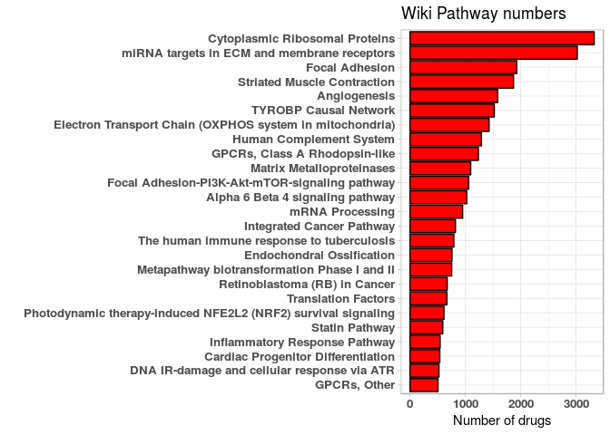

Again, most abundant terms are associated with ribosome (Cytoplasmic Ribosomal proteins) and with ECM (miRNA targets in ECM and membrane receptors, Focal adhesion).

Most underrepresented pathways: 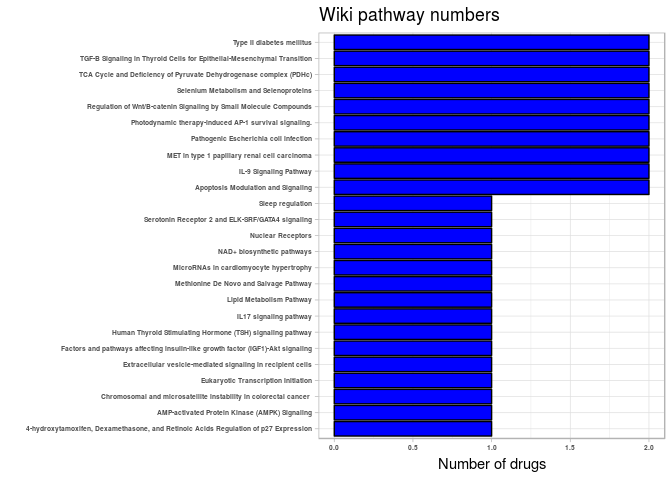

Amount of drugs that have enriched pathways that are associated with DE differentiation (see above, pathways that are common across all three GSE data sets): 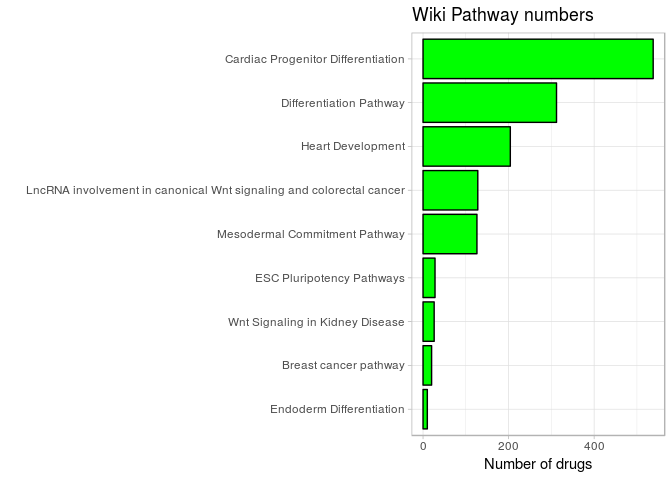

For some reason, Wiki pathways have two Wnt Signaling pathway terms. The one that is common for all GSE data sets has ID Wnt Signaling Pathway%WikiPathways\_20180810%WP428%Homo sapiens, and it has 204 instances in all MCF7 experiments (not shown).

So we can say that most specific and related to DE terms here are Endoderm differentiation (probably the most important), Differentiation pathway, Mesodermal Commitment, ESC pluripotency pathways (which is debatable).

There are 10 drugs that are enriched for Endoderm differentiation:

    ##  [1] "taxifolin"     "SA-1462738"    "SA-1938111"    "SA-1938219"   
    ##  [5] "SA-247654"     "SA-418993"     "SA-85901"      "SA-89705"     
    ##  [9] "SA-1459008"    "BRD-K20168484"

Now let's try to be more specific here. Which of them is also enriched for Differentiation pathway and Mesodermal Commitment?

    ## [1] "taxifolin"     "SA-1938111"    "SA-1938219"    "SA-247654"    
    ## [5] "SA-85901"      "SA-89705"      "SA-1459008"    "BRD-K20168484"

Great! Almost 8 drugs. Let's inspect them in more detail here (what other relevant pathways are present in their enrichment data).

-   Taxifolin - Heart development, Cardiac progenitor differentiation. No Wnt related pathways.
-   SA-1938111 - Wnt signaling pathway and pluripotency, Wnt signaling pathway, Cardic progenitor differentiation.
-   SA-1938219 - Wnt signaling pathway, Cardiac progenitor differentiation, LncRNA involvement in canonical Wnt signaling and colorectal cancer.
-   SA-247654 - TGF-beta receptor signaling, Canonical and Non-canonical Notch signaling, Wnt signaling pathway, Cardiac progenitor differentitation, LncRNA involvement in canonical Wnt signaling and colorectal cancer, Epithelial to mesenchymal transition in colorectal cancer.
-   SA-85901 - Wnt signaling pathway, Cardiac progenitor differentiation, LncRNA involvement in canonical Wnt signaling and colorectal cancer.
-   SA-89705 - MAPK signaling pathway, Wnt signaling pathway, Cardiac progenitor differentiation, LncRNA involvement in canonical Wnt signaling and colorectal cancer.
-   SA-1459008 - Cardiac progenitor differentiation, Epithelial to mesenchymal transition in colorectal cancer.
-   BRD-K20168484 - Hematopoietic stem cell differentiation, Wnt signaling pathway and pluripotency, Cardiac progenitor differentiation, Wnt signaling in Kidney disease, Focal adhesion-PI3K-Akt-mTOR signaling pathway

So basically all this drugs are of potential interest. Let's now check previous drugs:

-   BRD-K01614657 - nothing really interesting
-   Merck60 - nothing really interesting
-   BRD-K69894866 - mTOR signaling, VEGFA-VEGFR2 signaling pathway
-   Carbetocin - Differentiation pathway, MAPK signaling pathway, Wnt signaling pathway, VEGFA-VEGFR2 signaling pathway, Focal adhesion-PI3K-Akt-mTOR-signaling pathway, LncRNA involvement in canonical Wnt signaling and colorectal cancer, Oligodendrocyte differentiation
-   Linifanib - Wnt signaling pathway and pluripotency, TGF-beta signaling pathway, Mesodermal commitment pathway, Notch-signaling pathway, Preimplantation Embryo, MAPK signaling pathway, Wnt signaling pathway, Erbb signaling pathway, Focal adhesion-PI3K-Akt-mTOR-signaling pathway, VEGFA-VEGFR2 signaling pathway, Epithelial to mesenchymal transition in colorectal cancer.
-   Mestanolone - Differentiation of adipocyte, Wnt signaling pathway, Cardiac progenitor differentiation, Focal adhesion-PI3K-Akt-mTOR-signaling pathway.

Overall, drugs that were interesting after Reactome analysis are not interesting at all with Wiki annotation. However, interesting drugs from KEGG are also interesting in Wiki.

LINCS conclusion
----------------

Several conclusions can be made:

1.  After enrichment analysis of MCF7 experiments with KEGG, Reactome and Wiki pathways following 11 small molecules were found to be interesting (and worth experimental validation): "taxifolin", "SA-1462738", "SA-1938111", "SA-1938219", "SA-247654", "SA-418993", "SA-85901", "SA-89705", "SA-1459008", "BRD-K20168484", "carbetocin", "linifanib", "mestanolone".
2.  There is a low agreement between KEGG/Reactome and Wiki/Reactome. However, Wiki analysis proved that KEGG results are interesting.
3.  Only tiny fraction of experiments in MCF7 is enriched for terms that are relevant for DE differentiation (it's true for KEGG/Reactome/Wiki). It makes problem of pathway (DE related) prediction based on chemical structure not feasible. We might try to analyze other cell lines, but here we might face the problem that same drugs induce different pathways in different cell lines (inconsistency between cell lines) and it's not guaranteed that we will find enough number of instances with enriched DE pathways.
