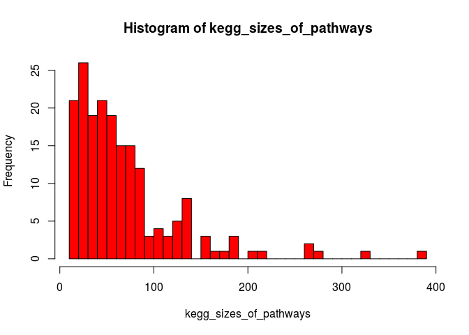

Pathway enrichment analysis
================
German Novakovskiy
August 17, 2018

Pathway enrichment analysis of individual definitive endoderm differentiation experiments (from GEO) and LINS data

Analysis of pathways
--------------------

All pathways from KEGG/REACTOME for analysis with ErmineR should be dowloaded from here (<http://www.broadinstitute.org/gsea/msigdb/collections.jsp#C2>) in gmt format.

### Analysis of REACTOME pathways

Reading data from file:

``` r
x <- scan("~/ESC_RNA_seq/pathway_enrichment_analysis/ReactomePathways.tsv", what = "", sep = "\n")
x <- strsplit(x, "[ \t]+")
max.col <- max(sapply(x, length))

## specify col.names as ?read.table suggests
cn <- paste("V", 1:max.col, sep = "")
reactome_pathways <- read.table("~/ESC_RNA_seq/pathway_enrichment_analysis/ReactomePathways.tsv", fill = TRUE, 
                 col.names = cn, sep = '\t', quote = "")

reactome_pathways[1:5, 1:10] %>% kable()
```

| V1            | V2                                                              | V3     | V4      | V5     | V6     | V7     | V8      | V9     | V10    |
|:--------------|:----------------------------------------------------------------|:-------|:--------|:-------|:-------|:-------|:--------|:-------|:-------|
| R-HSA-164843  | 2-LTR circle formation                                          | BANF1  | HMGA1   | LIG4   | PSIP1  | XRCC4  | XRCC5   | XRCC6  | gag    |
| R-HSA-73843   | 5-Phosphoribose 1-diphosphate biosynthesis                      | PRPS1  | PRPS1L1 | PRPS2  |        |        |         |        |        |
| R-HSA-1971475 | A tetrasaccharide linker sequence is required for GAG synthesis | AGRN   | B3GALT6 | B3GAT1 | B3GAT2 | B3GAT3 | B4GALT7 | BCAN   | BGN    |
| R-HSA-5619084 | ABC transporter disorders                                       | ABCC8  | CFTR    | DERL1  | DERL2  | DERL3  | ERLEC1  | ERLIN1 | ERLIN2 |
| R-HSA-1369062 | ABC transporters in lipid homeostasis                           | ABCA10 | ABCA12  | ABCA2  | ABCA3  | ABCA5  | ABCA6   | ABCA7  | ABCA9  |

There are 2029 pathways in total.

Distribution of counts of genes in each pathway for REACTOME:

``` r
calculateSize <- function(row_of_df){
  x <- row_of_df[3:length(row_of_df)]
  x <- x[!is.na(x)]
  return(sum(x != ""))
}

reactome_sizes_of_pathways <- apply(reactome_pathways, 1, calculateSize)

hist(reactome_sizes_of_pathways, breaks = 50, col = "red")
```


Sorting pathways by size:

``` r
reactome_pathways_amount <- as.data.frame(reactome_pathways[,2])
colnames(reactome_pathways_amount) <- "Pathway"
reactome_pathways_amount$Size <- reactome_sizes_of_pathways

reactome_pathways_amount <- reactome_pathways_amount %>%
  arrange(desc(Size))
```

We see that are the largest pathways are very broad:

``` r
head(reactome_pathways_amount, n = 10) %>% kable()
```

| Pathway                                 |  Size|
|:----------------------------------------|-----:|
| Signal Transduction                     |  2623|
| Metabolism of proteins                  |  2064|
| Immune System                           |  2047|
| Metabolism                              |  2013|
| Post-translational protein modification |  1398|
| Gene expression (Transcription)         |  1376|
| RNA Polymerase II Transcription         |  1240|
| Signaling by GPCR                       |  1162|
| Innate Immune System                    |  1114|
| Generic Transcription Pathway           |  1112|

However, the smallest pathways contain just one gene:

``` r
tail(reactome_pathways_amount, n = 10) %>% kable()
```

|      | Pathway                                                         |  Size|
|------|:----------------------------------------------------------------|-----:|
| 2020 | Synthesis of CL                                                 |     1|
| 2021 | Synthesis of Hepoxilins (HX) and Trioxilins (TrX)               |     1|
| 2022 | Synthesis of IPs in the ER lumen                                |     1|
| 2023 | TLR3 deficiency - HSE                                           |     1|
| 2024 | TWIK-related spinal cord K+ channel (TRESK)                     |     1|
| 2025 | Tandem pore domain halothane-inhibited K+ channel (THIK)        |     1|
| 2026 | UNC93B1 deficiency - HSE                                        |     1|
| 2027 | Vitamin E                                                       |     1|
| 2028 | WNT ligand secretion is abrogated by the PORCN inhibitor LGK974 |     1|
| 2029 | t(4;14) translocations of FGFR3                                 |     1|

In our enrichment analysis we will consider only pathways that contain at least 15 genes and no more than 300 genes:

``` r
reactome_selected_pathways <- reactome_pathways_amount %>% 
  filter(Size >= 15 & Size <= 300)
```

There are 1070 of such pathways.

### Analysis of KEGG pathways

Reading data from file:

``` r
x <- scan("~/ESC_RNA_seq/pathway_enrichment_analysis/KeggPathways.gmt", what = "", sep = "\n")
x <- strsplit(x, "[ \t]+")
max.col <- max(sapply(x, length))

## specify col.names as ?read.table suggests
cn <- paste("V", 1:max.col, sep = "")
kegg_pathways <- read.table("~/ESC_RNA_seq/pathway_enrichment_analysis/KeggPathways.gmt", fill = TRUE, 
                 col.names = cn, sep = '\t', quote = "")

kegg_pathways <- kegg_pathways[,c(2,1,3:ncol(kegg_pathways))]
```

There are 186 pathways in total.

Distribution of counts of genes in each pathway for KEGG:

``` r
kegg_sizes_of_pathways <- apply(kegg_pathways, 1, calculateSize)

hist(kegg_sizes_of_pathways, breaks = 50, col = "red")
```



Sorting pathways by size:

``` r
kegg_pathways_amount <- as.data.frame(kegg_pathways[,2])
colnames(kegg_pathways_amount) <- "Pathway"
kegg_pathways_amount$Size <- kegg_sizes_of_pathways

kegg_pathways_amount <- kegg_pathways_amount %>%
  arrange(desc(Size))
```

The largest KEGG pathways:

``` r
head(kegg_pathways_amount, n = 10) %>% kable()
```

| Pathway                                          |  Size|
|:-------------------------------------------------|-----:|
| KEGG\_OLFACTORY\_TRANSDUCTION                    |   389|
| KEGG\_PATHWAYS\_IN\_CANCER                       |   328|
| KEGG\_NEUROACTIVE\_LIGAND\_RECEPTOR\_INTERACTION |   272|
| KEGG\_MAPK\_SIGNALING\_PATHWAY                   |   267|
| KEGG\_CYTOKINE\_CYTOKINE\_RECEPTOR\_INTERACTION  |   267|
| KEGG\_REGULATION\_OF\_ACTIN\_CYTOSKELETON        |   216|
| KEGG\_FOCAL\_ADHESION                            |   201|
| KEGG\_CHEMOKINE\_SIGNALING\_PATHWAY              |   190|
| KEGG\_HUNTINGTONS\_DISEASE                       |   185|
| KEGG\_ENDOCYTOSIS                                |   183|

Smallest pathways contain at least 10 genes:

``` r
tail(kegg_pathways_amount, n = 10) %>% kable()
```

|     | Pathway                                                |  Size|
|-----|:-------------------------------------------------------|-----:|
| 177 | KEGG\_GLYCOSPHINGOLIPID\_BIOSYNTHESIS\_GANGLIO\_SERIES |    15|
| 178 | KEGG\_TERPENOID\_BACKBONE\_BIOSYNTHESIS                |    15|
| 179 | KEGG\_GLYCOSPHINGOLIPID\_BIOSYNTHESIS\_GLOBO\_SERIES   |    14|
| 180 | KEGG\_NON\_HOMOLOGOUS\_END\_JOINING                    |    14|
| 181 | KEGG\_SULFUR\_METABOLISM                               |    13|
| 182 | KEGG\_CIRCADIAN\_RHYTHM\_MAMMAL                        |    13|
| 183 | KEGG\_VALINE\_LEUCINE\_AND\_ISOLEUCINE\_BIOSYNTHESIS   |    11|
| 184 | KEGG\_FOLATE\_BIOSYNTHESIS                             |    11|
| 185 | KEGG\_TAURINE\_AND\_HYPOTAURINE\_METABOLISM            |    10|
| 186 | KEGG\_LIMONENE\_AND\_PINENE\_DEGRADATION               |    10|

Again, we consider only pathways that contain at least 15 genes and no more than 300 genes:

``` r
kegg_selected_pathways <- kegg_pathways_amount %>% 
  filter(Size >= 15 & Size <= 300)
```

There are 176 of such pathways.

Analysis of GEO individual experiments
--------------------------------------

### Analysis of GSE109658

Load DE data:

``` r
load("../analysis_of_public_data/GSE109658/DEgenes_0h_96h_109658.Rdata")
```

Sorted log Fold Changes give us a sorted list:

``` r
ermineInputGeneScores <- DEgenes_0h_96h_109658 %>% 
  rownames_to_column("gene") %>%
  mutate(absolute_logFC = abs(logFC)) %>% 
  dplyr::select(gene, absolute_logFC) %>% 
  na.omit() %>% 
  as.data.frame() %>% 
  arrange(desc(absolute_logFC)) %>% 
  column_to_rownames("gene")

save(ermineInputGeneScores, file = "ermineInputScores.Rdata")
head(ermineInputGeneScores, 10) %>% kable() # print the first few rows
```

|         |  absolute\_logFC|
|---------|----------------:|
| KLHL6   |         9.508121|
| HOXB6   |         9.093383|
| GRP     |         9.070627|
| NPPB    |         8.925313|
| OVCH2   |         8.885852|
| HRH3    |         8.871847|
| CASQ2   |         8.842371|
| MIR1247 |         8.714118|
| HP      |         8.629687|
| MYL4    |         8.566040|

#### Reactome pathways

``` r
enrichmentResultReactome <- precRecall(scores = ermineInputGeneScores,
                               scoreColumn = 1,
                               bigIsBetter = TRUE,
                               aspects = "B",
                               iterations = 10000,
                               geneSetDescription = NULL,
                               customGeneSets = "~/ESC_RNA_seq/pathway_enrichment_analysis/ReactomePathways.tsv",
                               minClassSize = 15,
                               maxClassSize = 300)

enrichmentResultReactome$results %>% arrange(MFPvalue) %>% head(10) %>% kable()
```

| Name                                 | ID            |  NumProbes|  NumGenes|   RawScore|    Pval|  CorrectedPvalue|  MFPvalue|  CorrectedMFPvalue|  Multifunctionality| Same as | GeneMembers                                                                                                                                                                                                                                                                                                                                                                                                                                                                                                                                                                                                                                                                                                                                                                                                                                                                                                                                                                                                                                                                                                                                                                                                                                                                                                                                                                                                                                                                                                                                                                                                                                                                                                                                                                                                                                                                                       |
|:-------------------------------------|:--------------|----------:|---------:|----------:|-------:|----------------:|---------:|------------------:|-------------------:|:--------|:--------------------------------------------------------------------------------------------------------------------------------------------------------------------------------------------------------------------------------------------------------------------------------------------------------------------------------------------------------------------------------------------------------------------------------------------------------------------------------------------------------------------------------------------------------------------------------------------------------------------------------------------------------------------------------------------------------------------------------------------------------------------------------------------------------------------------------------------------------------------------------------------------------------------------------------------------------------------------------------------------------------------------------------------------------------------------------------------------------------------------------------------------------------------------------------------------------------------------------------------------------------------------------------------------------------------------------------------------------------------------------------------------------------------------------------------------------------------------------------------------------------------------------------------------------------------------------------------------------------------------------------------------------------------------------------------------------------------------------------------------------------------------------------------------------------------------------------------------------------------------------------------------|
| Extracellular matrix organization    | R-HSA-1474244 |        225|       225|  0.0659416|  0.0000|        0.0000000|    0.0000|           0.000000|              0.4760| NA      | ACAN|ACTN1|ADAM10|ADAM12|ADAM15|ADAM17|ADAM19|ADAM8|ADAM9|ADAMTS1|ADAMTS14|ADAMTS16|ADAMTS18|ADAMTS2|ADAMTS3|ADAMTS4|ADAMTS5|ADAMTS8|ADAMTS9|AGRN|BCAN|BGN|BMP1|BMP2|BMP4|BMP7|BSG|CAPN1|CAPN10|CAPN12|CAPN13|CAPN2|CAPN3|CAPN5|CAPN6|CAPN7|CAPNS1|CASK|CASP3|CD151|CD44|CD47|CDH1|COL11A1|COL11A2|COL12A1|COL13A1|COL14A1|COL15A1|COL16A1|COL17A1|COL18A1|COL19A1|COL1A1|COL1A2|COL21A1|COL22A1|COL23A1|COL24A1|COL25A1|COL27A1|COL2A1|COL3A1|COL4A1|COL4A2|COL4A4|COL4A5|COL4A6|COL5A1|COL5A2|COL5A3|COL6A1|COL6A2|COL6A3|COL6A5|COL6A6|COL7A1|COL8A1|COL8A2|COL9A1|COL9A2|COL9A3|CRTAP|CTSB|CTSD|CTSK|DAG1|DDR1|DDR2|DMD|DST|EFEMP1|EFEMP2|ELN|F11R|FBLN1|FBLN2|FBLN5|FBN1|FBN2|FBN3|FGF2|FMOD|FN1|FURIN|HAPLN1|HSPG2|HTRA1|ICAM1|ICAM3|ICAM4|ICAM5|ITGA1|ITGA10|ITGA11|ITGA2|ITGA2B|ITGA3|ITGA4|ITGA5|ITGA6|ITGA7|ITGA8|ITGA9|ITGAE|ITGAM|ITGAV|ITGB1|ITGB2|ITGB3|ITGB4|ITGB5|ITGB7|ITGB8|JAM2|JAM3|KDR|KLKB1|LAMA1|LAMA2|LAMA3|LAMA4|LAMA5|LAMB1|LAMB2|LAMB3|LAMC1|LAMC2|LAMC3|LOX|LOXL1|LOXL2|LOXL3|LOXL4|LRP4|LTBP1|LTBP2|LTBP3|LTBP4|LUM|MATN3|MATN4|MFAP1|MFAP2|MFAP3|MFAP4|MMP11|MMP14|MMP15|MMP16|MMP17|MMP19|MMP2|MMP24|MMP25|MMP9|NCAM1|NCAN|NCSTN|NID1|NID2|NRXN1|NTN4|P4HA1|P4HA2|P4HB|PCOLCE|PDGFA|PDGFB|PLEC|PLOD1|PLOD2|PLOD3|PPIB|PRKCA|PRSS1|PSEN1|PTPRS|PXDN|SCUBE1|SCUBE3|SDC1|SDC2|SDC3|SDC4|SERPINE1|SERPINH1|SH3PXD2A|SPARC|SPP1|TGFB1|TGFB2|TGFB3|THBS1|TIMP1|TIMP2|TLL1|TLL2|TNC|TNR|TNXB|TRAPPC4|VCAM1|VCAN|VTN|                                                                                                                                                                                                                                                                                                                                                                                                                                                      |
| Class A/1 (Rhodopsin-like receptors) | R-HSA-373076  |        114|       114|  0.0632970|  0.0000|        0.0000000|    0.0000|           0.000000|              0.2140| NA      | ADORA1|ADORA2A|ADORA2B|ADRA1D|ADRA2A|ADRA2B|ADRA2C|ADRB2|ANXA1|APLN|APLNR|APP|BDKRB2|C3|C5|CCKBR|CCR7|CHRM3|CMKLR1|CNR1|CX3CL1|CXCL12|CXCL16|CXCL5|CXCL6|CXCR2|CXCR4|DRD1|DRD2|ECE1|ECE2|EDN1|EDNRA|EDNRB|F2R|F2RL1|F2RL2|FSHR|GAL|GNRH1|GNRHR2|GPR143|GPR183|GPR37|GPR39|GPR55|GRP|GRPR|HCRTR2|HEBP1|HRH2|HRH3|HTR1A|HTR1B|HTR1D|HTR1E|HTR2C|HTR7|KEL|KISS1R|LPAR1|LPAR2|LPAR3|LPAR4|LPAR6|LTB4R|LTB4R2|MC1R|NLN|NMB|NMU|NPFFR2|NPW|NPY|NPY1R|NPY2R|NPY5R|NTS|OPN3|OPRK1|OPRL1|OXER1|OXTR|P2RY1|P2RY11|P2RY2|PDYN|PENK|PMCH|POMC|PROK2|PROKR1|PROKR2|PSAP|PTAFR|PTGER2|PTGER3|PTGER4|PTGFR|QRFPR|S1PR1|S1PR2|S1PR3|S1PR5|SSTR1|SSTR2|SSTR5|TAC1|TAC3|TACR1|TBXA2R|TRH|XCL1|XK|                                                                                                                                                                                                                                                                                                                                                                                                                                                                                                                                                                                                                                                                                                                                                                                                                                                                                                                                                                                                                                                                                                                                                                                                                   |
| GPCR ligand binding                  | R-HSA-500792  |        177|       177|  0.0727160|  0.0000|        0.0000000|    0.0000|           0.000000|              0.5600| NA      | ADCYAP1R1|ADM|ADM2|ADORA1|ADORA2A|ADORA2B|ADRA1D|ADRA2A|ADRA2B|ADRA2C|ADRB2|ANXA1|APLN|APLNR|APP|BDKRB2|C3|C5|CALCA|CALCB|CALCR|CALCRL|CCKBR|CCR7|CD55|CD97|CHRM3|CMKLR1|CNR1|CRHBP|CRHR1|CX3CL1|CXCL12|CXCL16|CXCL5|CXCL6|CXCR2|CXCR4|DRD1|DRD2|ECE1|ECE2|EDN1|EDNRA|EDNRB|F2R|F2RL1|F2RL2|FSHR|FZD1|FZD10|FZD2|FZD3|FZD4|FZD5|FZD6|FZD7|FZD8|FZD9|GABBR1|GABBR2|GAL|GIPR|GNAS|GNB1|GNB2|GNB3|GNB4|GNB5|GNG10|GNG11|GNG12|GNG2|GNG3|GNG4|GNG5|GNG7|GNRH1|GNRHR2|GPR143|GPR183|GPR37|GPR39|GPR55|GRM1|GRM2|GRM3|GRM4|GRM8|GRP|GRPR|HCRTR2|HEBP1|HRH2|HRH3|HTR1A|HTR1B|HTR1D|HTR1E|HTR2C|HTR7|KEL|KISS1R|LPAR1|LPAR2|LPAR3|LPAR4|LPAR6|LTB4R|LTB4R2|MC1R|NLN|NMB|NMU|NPFFR2|NPW|NPY|NPY1R|NPY2R|NPY5R|NTS|OPN3|OPRK1|OPRL1|OXER1|OXTR|P2RY1|P2RY11|P2RY2|PDYN|PENK|PMCH|POMC|PROK2|PROKR1|PROKR2|PSAP|PTAFR|PTCH1|PTCH2|PTGER2|PTGER3|PTGER4|PTGFR|PTH1R|PTHLH|QRFPR|RAMP2|S1PR1|S1PR2|S1PR3|S1PR5|SCTR|SMO|SSTR1|SSTR2|SSTR5|TAC1|TAC3|TACR1|TAS2R20|TAS2R31|TBXA2R|TRH|VIPR1|VIPR2|WNT11|WNT2B|WNT3|WNT3A|WNT4|WNT5A|WNT6|WNT8A|WNT9B|XCL1|XK|                                                                                                                                                                                                                                                                                                                                                                                                                                                                                                                                                                                                                                                                                                                                                                                                                                                   |
| Peptide ligand-binding receptors     | R-HSA-375276  |         64|        64|  0.0400681|  0.0001|        0.0176400|    0.0001|           0.022050|              0.0206| NA      | ANXA1|APLN|APLNR|APP|BDKRB2|C3|C5|CCKBR|CCR7|CX3CL1|CXCL12|CXCL16|CXCL5|CXCL6|CXCR2|CXCR4|ECE1|ECE2|EDN1|EDNRA|EDNRB|F2R|F2RL1|F2RL2|GAL|GPR37|GRP|GRPR|HCRTR2|HEBP1|KEL|KISS1R|MC1R|NLN|NMB|NMU|NPFFR2|NPW|NPY|NPY1R|NPY2R|NPY5R|NTS|OPRK1|OPRL1|OXTR|PDYN|PENK|PMCH|POMC|PROK2|PROKR1|PROKR2|PSAP|QRFPR|SSTR1|SSTR2|SSTR5|TAC1|TAC3|TACR1|TRH|XCL1|XK|                                                                                                                                                                                                                                                                                                                                                                                                                                                                                                                                                                                                                                                                                                                                                                                                                                                                                                                                                                                                                                                                                                                                                                                                                                                                                                                                                                                                                                                                                                                                          |
| G alpha (i) signalling events        | R-HSA-418594  |        187|       187|  0.0429780|  0.0001|        0.0147000|    0.0004|           0.070560|              0.9640| NA      | ADCY1|ADCY2|ADCY3|ADCY5|ADCY6|ADCY7|ADCY8|ADCY9|ADORA1|ADRA2A|ADRA2B|ADRA2C|AGRN|AKR1C3|ANXA1|APLN|APLNR|APOA1|APOA2|APOB|APOE|APOM|APP|BDKRB2|C3|C5|CALM1|CAMK4|CAMKMT|CCR7|CDK5|CNGA1|CNR1|CREB1|CX3CL1|CXCL12|CXCL16|CXCL5|CXCL6|CXCR2|CXCR4|CYP4V2|DHRS3|DRD2|FNTA|FNTB|GABBR1|GABBR2|GAL|GNAI1|GNAI2|GNAI3|GNAL|GNAO1|GNAT2|GNAZ|GNB1|GNB2|GNB3|GNB4|GNB5|GNG10|GNG11|GNG12|GNG2|GNG3|GNG4|GNG5|GNG7|GPC1|GPC2|GPC3|GPC4|GPC6|GPR183|GPR37|GPR55|GRK4|GRM2|GRM3|GRM4|GRM8|GUCA1A|GUCA1B|HEBP1|HRH3|HSD17B1|HSD17B6|HSPG2|HTR1A|HTR1B|HTR1D|HTR1E|ITPR1|ITPR2|ITPR3|LDLR|LPAR1|LPAR2|LPAR3|LPL|LRAT|LRP1|LRP10|LRP12|LRP2|LRP8|MAPK1|METAP1|METAP2|NAPEPLD|NMT1|NMT2|NMU|NPW|NPY|NPY1R|NPY2R|NPY5R|OPN3|OPRK1|OPRL1|OXER1|PDE1B|PDE1C|PDE4A|PDE4B|PDE4C|PDE4D|PDE6B|PDE6G|PDYN|PENK|PLA2G4A|PLCB1|PLCB2|PLCB3|PLCB4|PMCH|POMC|PPEF1|PPP1CA|PPP1R1B|PPP2CA|PPP2CB|PPP2R1A|PPP2R1B|PPP2R5D|PPP3CA|PPP3CB|PPP3CC|PPP3R1|PRKACA|PRKACB|PRKAR1A|PRKAR1B|PRKAR2A|PRKAR2B|PRKCA|PRKCD|PRKCG|PRKCQ|PSAP|PTGER3|RBP1|RBP4|RDH10|RDH11|RDH12|RDH16|RETSAT|RGS9|S1PR1|S1PR2|S1PR3|S1PR5|SDC1|SDC2|SDC3|SDC4|SLC24A1|SSTR1|SSTR2|SSTR5|STRA6|TAS2R20|TAS2R31|                                                                                                                                                                                                                                                                                                                                                                                                                                                                                                                                                                                                                                                                                                                                             |
| Neuronal System                      | R-HSA-112316  |        287|       287|  0.0500183|  0.0001|        0.0220500|    0.0020|           0.294000|              0.9530| NA      | ABAT|ABCC9|ACHE|ACTN2|ADCY1|ADCY2|ADCY3|ADCY5|ADCY6|ADCY7|ADCY8|ADCY9|AKAP5|AKAP9|ALDH2|ALDH5A1|AP2A1|AP2A2|AP2B1|AP2M1|AP2S1|APBA1|APBA2|APBA3|ARHGEF9|BCHE|BEGAIN|BRAF|CACNA1A|CACNA1B|CACNA1E|CACNA2D1|CACNA2D2|CACNA2D3|CACNB1|CACNB2|CACNB3|CACNB4|CACNG4|CACNG8|CALM1|CAMK2A|CAMK2D|CAMK2G|CAMK4|CAMKK1|CASK|CHRNA1|CHRNA3|CHRNA5|CHRNA7|CHRNA9|CHRNB2|CHRNB4|COMT|CREB1|DBNL|DLG1|DLG2|DLG3|DLG4|DLGAP1|DLGAP2|DLGAP3|DLGAP4|DNAJC5|EPB41|EPB41L1|EPB41L2|EPB41L3|EPB41L5|FLOT1|FLOT2|GABBR1|GABBR2|GABRA1|GABRA2|GABRA3|GABRA4|GABRA5|GABRB2|GABRB3|GABRG2|GABRG3|GABRQ|GAD1|GJC1|GLRA4|GLRB|GLS|GLS2|GLUL|GNAI1|GNAI2|GNAI3|GNAL|GNB1|GNB2|GNB3|GNB4|GNB5|GNG10|GNG11|GNG12|GNG2|GNG3|GNG4|GNG5|GNG7|GRIA1|GRIA3|GRIA4|GRIK2|GRIK3|GRIK4|GRIK5|GRIN2A|GRIN2B|GRIN2D|GRIP1|GRIP2|GRM1|HCN1|HCN2|HCN3|HCN4|HOMER1|HOMER2|HOMER3|HRAS|HSPA8|HTR3A|IL1RAP|IL1RAPL1|IL1RAPL2|KCNA1|KCNA5|KCNA6|KCNAB1|KCNAB2|KCNAB3|KCNB1|KCNB2|KCNC4|KCND1|KCND2|KCNF1|KCNG1|KCNG3|KCNH1|KCNH2|KCNH3|KCNH5|KCNH6|KCNH7|KCNH8|KCNJ10|KCNJ11|KCNJ12|KCNJ14|KCNJ2|KCNJ3|KCNJ4|KCNJ5|KCNJ6|KCNJ8|KCNK1|KCNK10|KCNK13|KCNK17|KCNK2|KCNK3|KCNK6|KCNMA1|KCNMB3|KCNMB4|KCNN1|KCNN2|KCNN3|KCNQ1|KCNQ2|KCNQ3|KCNQ4|KCNQ5|KCNS1|KCNS3|KCNV1|KCNV2|LIN7A|LIN7B|LIN7C|LRFN1|LRFN2|LRFN3|LRFN4|LRRC4B|LRRTM1|LRRTM3|LRRTM4|LRTOMT|MAOA|MAPK1|MDM2|MYO6|NAAA|NCALD|NEFL|NLGN1|NLGN2|NLGN3|NLGN4X|NLGN4Y|NPTN|NRXN1|NRXN2|NRXN3|NSF|NTRK3|PANX1|PANX2|PDLIM5|PDPK1|PICK1|PLCB1|PLCB2|PLCB3|PPFIA1|PPFIA2|PPFIA3|PPFIA4|PPFIBP1|PPFIBP2|PRKACA|PRKACB|PRKCA|PRKCB|PRKCG|PTPRD|PTPRF|PTPRS|RAB3A|RAF1|RASGRF2|RIMS1|RPS6KA1|RPS6KA2|RPS6KA3|RPS6KA6|RRAS|RTN3|SHANK1|SHANK2|SHANK3|SHARPIN|SIPA1L1|SLC17A7|SLC18A2|SLC1A1|SLC1A2|SLC1A3|SLC1A6|SLC22A2|SLC32A1|SLC38A1|SLC38A2|SLC6A1|SLC6A11|SLC6A4|SLITRK1|SLITRK2|SLITRK3|SLITRK4|SLITRK5|SLITRK6|STX1A|STXBP1|SYN1|SYN2|SYN3|SYT1|SYT10|SYT12|SYT2|SYT7|SYT9|UNC13B|VAMP2| |
| Amine ligand-binding receptors       | R-HSA-375280  |         17|        17|  0.0530953|  0.0023|        0.2535750|    0.0023|           0.289800|              0.5020| NA      | ADRA1D|ADRA2A|ADRA2B|ADRA2C|ADRB2|CHRM3|DRD1|DRD2|GPR143|HRH2|HRH3|HTR1A|HTR1B|HTR1D|HTR1E|HTR2C|HTR7|                                                                                                                                                                                                                                                                                                                                                                                                                                                                                                                                                                                                                                                                                                                                                                                                                                                                                                                                                                                                                                                                                                                                                                                                                                                                                                                                                                                                                                                                                                                                                                                                                                                                                                                                                                                            |
| G alpha (q) signalling events        | R-HSA-416476  |        119|       119|  0.0287023|  0.0016|        0.2016000|    0.0043|           0.474075|              0.7710| NA      | ABHD12|ABHD6|ADRA1D|ANXA1|APP|ARHGEF25|BDKRB2|CCKBR|CHRM3|CREB1|DAGLA|DAGLB|DGKA|DGKB|DGKD|DGKE|DGKG|DGKH|DGKI|DGKK|DGKQ|DGKZ|EDN1|EDNRA|EDNRB|EGFR|F2R|F2RL1|F2RL2|GNA11|GNA14|GNA15|GNAQ|GNB1|GNB2|GNB3|GNB4|GNB5|GNG10|GNG11|GNG12|GNG2|GNG3|GNG4|GNG5|GNG7|GNRH1|GNRHR2|GPR143|GPR39|GRB2|GRK5|GRM1|GRP|GRPR|HBEGF|HCRTR2|HRAS|HTR2C|ITPR1|ITPR2|ITPR3|KALRN|KISS1R|KRAS|LPAR1|LPAR2|LPAR3|LPAR4|LPAR6|LTB4R|LTB4R2|MAPK1|MAPK3|MAPK7|NMB|NMU|NPFFR2|NRAS|NTS|OXTR|P2RY1|P2RY11|P2RY2|PIK3CA|PIK3R1|PIK3R2|PIK3R3|PLCB1|PLCB2|PLCB3|PLCB4|PMCH|PRKCA|PRKCD|PRKCE|PRKCH|PRKCQ|PROK2|PROKR1|PROKR2|PTAFR|PTGFR|QRFPR|RASGRP1|RASGRP2|RPS6KA1|RPS6KA2|RPS6KA3|SOS1|TAC1|TAC3|TACR1|TBXA2R|TRH|TRIO|TRPC3|TRPC6|XCL1|                                                                                                                                                                                                                                                                                                                                                                                                                                                                                                                                                                                                                                                                                                                                                                                                                                                                                                                                                                                                                                                                                                                                                                             |
| Integrin cell surface interactions   | R-HSA-216083  |         53|        53|  0.0216743|  0.0073|        0.5853273|    0.0075|           0.735000|              0.4630| NA      | AGRN|BSG|CD44|CD47|CDH1|COL13A1|COL16A1|COL18A1|COL23A1|COL4A1|COL4A2|COL4A4|COL9A1|COL9A2|COL9A3|F11R|FBN1|FN1|HSPG2|ICAM1|ICAM3|ICAM4|ICAM5|ITGA1|ITGA10|ITGA11|ITGA2|ITGA2B|ITGA3|ITGA4|ITGA5|ITGA6|ITGA7|ITGA8|ITGA9|ITGAE|ITGAM|ITGAV|ITGB1|ITGB2|ITGB3|ITGB5|ITGB7|ITGB8|JAM2|JAM3|KDR|LUM|SPP1|THBS1|TNC|VCAM1|VTN|                                                                                                                                                                                                                                                                                                                                                                                                                                                                                                                                                                                                                                                                                                                                                                                                                                                                                                                                                                                                                                                                                                                                                                                                                                                                                                                                                                                                                                                                                                                                                                        |
| Muscle contraction                   | R-HSA-397014  |        135|       135|  0.0283870|  0.0042|        0.4116000|    0.0078|           0.687960|              0.5400| NA      | ABCC9|ACTA2|ACTG2|ACTN2|ACTN3|AHCYL1|AKAP9|ANXA1|ANXA2|ANXA6|ASPH|ATP1A1|ATP1A2|ATP1A3|ATP1B1|ATP1B2|ATP1B3|ATP2A1|ATP2A2|ATP2A3|ATP2B1|ATP2B2|ATP2B4|CACNA1C|CACNA1D|CACNA1F|CACNA2D1|CACNA2D2|CACNA2D3|CACNB1|CACNB2|CACNB3|CACNB4|CACNG4|CACNG6|CACNG7|CACNG8|CALD1|CALM1|DES|DMD|DMPK|DYSF|FKBP1B|FXYD6|FXYD7|ITGA1|ITGB5|ITPR1|ITPR2|ITPR3|KCND1|KCND2|KCNE2|KCNE3|KCNH2|KCNIP2|KCNIP3|KCNIP4|KCNJ11|KCNJ12|KCNJ14|KCNJ2|KCNJ4|KCNK1|KCNK10|KCNK12|KCNK13|KCNK17|KCNK2|KCNK3|KCNK5|KCNK6|KCNQ1|LMOD1|MYBPC2|MYH11|MYH3|MYL12A|MYL12B|MYL3|MYL4|MYL5|MYL6|MYL6B|MYL7|MYL9|MYLK|NEB|NOS1|NPPA|NPPC|NPR1|NPR2|ORAI1|ORAI2|PRKACA|PXN|RYR1|RYR2|RYR3|SCN11A|SCN1B|SCN2A|SCN3B|SCN4A|SCN4B|SCN5A|SCN8A|SCN9A|SLC8A1|SLC8A2|SLC8A3|SORBS1|SORBS3|STIM1|TCAP|TLN1|TMOD1|TMOD2|TMOD3|TNNC1|TNNC2|TNNI1|TNNI3|TNNT1|TPM1|TPM2|TPM3|TPM4|TRDN|TRPC1|TTN|VCL|VIM|                                                                                                                                                                                                                                                                                                                                                                                                                                                                                                                                                                                                                                                                                                                                                                                                                                                                                                                                                                                                                                       |

``` r
enrichmentResultReactome$results %>% 
  dplyr::select(Name, CorrectedPvalue, CorrectedMFPvalue) %>% 
  arrange(CorrectedMFPvalue) %>% 
  head(10) %>% 
  kable(align = "l", col.names = c("Pathway", "Corrected p-value", 
                                   "Corrected MF p-value"))
```

| Pathway                                             | Corrected p-value | Corrected MF p-value |
|:----------------------------------------------------|:------------------|:---------------------|
| GPCR ligand binding                                 | 0.0000000         | 0.0000000            |
| Class A/1 (Rhodopsin-like receptors)                | 0.0000000         | 0.0000000            |
| Extracellular matrix organization                   | 0.0000000         | 0.0000000            |
| Peptide ligand-binding receptors                    | 0.0176400         | 0.0220500            |
| G alpha (i) signalling events                       | 0.0147000         | 0.0705600            |
| Amine ligand-binding receptors                      | 0.2535750         | 0.2898000            |
| Neuronal System                                     | 0.0220500         | 0.2940000            |
| TRP channels                                        | 0.4064118         | 0.4586400            |
| FRS-mediated FGFR2 signaling                        | 0.4074000         | 0.4599000            |
| Defective B3GALTL causes Peters-plus syndrome (PpS) | 0.4074840         | 0.4601739            |

#### Reactome pathways via ReactomPA

``` r
#converting symbols to EntrezID
geneSymbols <- rownames(ermineInputGeneScores)
geneEntrez <- bitr(geneSymbols, fromType="SYMBOL", toType="ENTREZID", OrgDb="org.Hs.eg.db")
```

    ## 'select()' returned 1:many mapping between keys and columns

    ## Warning in bitr(geneSymbols, fromType = "SYMBOL", toType = "ENTREZID",
    ## OrgDb = "org.Hs.eg.db"): 8.91% of input gene IDs are fail to map...

``` r
head(geneEntrez)
```

    ##   SYMBOL ENTREZID
    ## 1  KLHL6    89857
    ## 2  HOXB6     3216
    ## 3    GRP     2922
    ## 4   NPPB     4879
    ## 5  OVCH2   341277
    ## 6   HRH3    11255

``` r
ermineInputGeneScoresRPA <- ermineInputGeneScores %>%
  rownames_to_column("SYMBOL") %>%
  filter(SYMBOL %in% geneEntrez$SYMBOL)

inputGSEA <- merge(ermineInputGeneScoresRPA, geneEntrez, sort=FALSE)

inputGSEA <- inputGSEA %>%
  dplyr::select(absolute_logFC, ENTREZID) %>%
  column_to_rownames('ENTREZID')
```

Performing GSEA with the input:

``` r
test2 <- inputGSEA$absolute_logFC
names(test2) <- rownames(inputGSEA)

y <- gsePathway(test2, nPerm=10000,
                pvalueCutoff=0.05,
                pAdjustMethod="BH", verbose=FALSE, minGSSize = 15, maxGSSize = 300)

dotplot(y, showCategory=15)
```


#### KEGG pathways

``` r
enrichmentResultKEGG <- precRecall(scores = ermineInputGeneScores,
                               scoreColumn = 1,
                               bigIsBetter = TRUE,
                               aspects = "B",
                               iterations = 10000,
                               geneSetDescription = NULL,
                               customGeneSets = "~/ESC_RNA_seq/pathway_enrichment_analysis/KeggPathways.gmt",
                               minClassSize = 15,
                               maxClassSize = 300)

enrichmentResultKEGG$results %>% arrange(MFPvalue) %>% head(10) %>% kable()
```

| Name                                         | ID                                               |  NumProbes|  NumGenes|   RawScore|    Pval|  CorrectedPvalue|  MFPvalue|  CorrectedMFPvalue|  Multifunctionality| Same as | GeneMembers                                                                                                                                                                                                                                                                                                                                                                                                                                                                                                                                                                                                                                                                                                                                                                                                                                                                                                                                                                                                                                                                                                                                                                                                                                                                                                                                                                                                                                                                                                                                                                                                                                                                                                            |
|:---------------------------------------------|:-------------------------------------------------|----------:|---------:|----------:|-------:|----------------:|---------:|------------------:|-------------------:|:--------|:-----------------------------------------------------------------------------------------------------------------------------------------------------------------------------------------------------------------------------------------------------------------------------------------------------------------------------------------------------------------------------------------------------------------------------------------------------------------------------------------------------------------------------------------------------------------------------------------------------------------------------------------------------------------------------------------------------------------------------------------------------------------------------------------------------------------------------------------------------------------------------------------------------------------------------------------------------------------------------------------------------------------------------------------------------------------------------------------------------------------------------------------------------------------------------------------------------------------------------------------------------------------------------------------------------------------------------------------------------------------------------------------------------------------------------------------------------------------------------------------------------------------------------------------------------------------------------------------------------------------------------------------------------------------------------------------------------------------------|
| Kegg neuroactive ligand receptor interaction | KEGG\_NEUROACTIVE\_LIGAND\_RECEPTOR\_INTERACTION |        134|       134|  0.0931454|  0.0000|        0.0000000|    0.0000|          0.0000000|             0.00538| NA      | ADCYAP1R1|ADORA1|ADORA2A|ADORA2B|ADRA1D|ADRA2A|ADRA2B|ADRA2C|ADRB2|APLNR|BDKRB2|CALCR|CALCRL|CCKBR|CHRM3|CHRNA1|CHRNA10|CHRNA3|CHRNA5|CHRNA7|CHRNA9|CHRNB1|CHRNB2|CHRNB4|CNR1|CRHR1|DRD1|DRD2|EDNRA|EDNRB|F2R|F2RL1|F2RL2|FSHR|GABBR1|GABBR2|GABRA1|GABRA2|GABRA3|GABRA4|GABRA5|GABRB2|GABRB3|GABRD|GABRE|GABRG2|GABRG3|GABRP|GABRQ|GHR|GIPR|GLRB|GPR156|GPR50|GPR83|GRIA1|GRIA3|GRIA4|GRID1|GRID2|GRIK2|GRIK3|GRIK4|GRIK5|GRIN2A|GRIN2B|GRIN2D|GRIN3A|GRIN3B|GRM1|GRM2|GRM3|GRM4|GRM8|GRPR|HCRTR2|HRH2|HRH3|HTR1A|HTR1B|HTR1D|HTR1E|HTR2C|HTR7|KISS1R|LEPR|LPAR1|LPAR2|LPAR3|LPAR4|LPAR6|LTB4R|LTB4R2|MC1R|NPFFR2|NPY1R|NPY2R|NPY5R|NR3C1|OPRK1|OPRL1|OXTR|P2RX4|P2RX5|P2RX6|P2RY1|P2RY11|P2RY2|PARD3|PPYR1|PRLR|PRSS1|PTAFR|PTGER2|PTGER3|PTGER4|PTGFR|PTH1R|S1PR1|S1PR2|S1PR3|S1PR5|SCTR|SSTR1|SSTR2|SSTR5|TACR1|TBXA2R|THRA|THRB|TRPV1|TSPO|VIPR1|VIPR2|                                                                                                                                                                                                                                                                                                                                                                                                                                                                                                                                                                                                                                                                                                                                                                                                                                                           |
| Kegg pathways in cancer                      | KEGG\_PATHWAYS\_IN\_CANCER                       |        293|       293|  0.0914554|  0.0013|        0.0355333|    0.0000|          0.0000000|             0.99500| NA      | ABL1|AKT1|AKT2|AKT3|APC|APC2|APPL1|AR|ARAF|ARNT|ARNT2|AXIN1|AXIN2|BAD|BAX|BCL2|BCL2L1|BCR|BID|BIRC2|BIRC5|BMP2|BMP4|BRAF|BRCA2|CASP3|CASP8|CASP9|CBL|CBLB|CBLC|CCDC6|CCNA1|CCND1|CCNE1|CCNE2|CDC42|CDH1|CDK2|CDK4|CDK6|CDKN1A|CDKN1B|CDKN2B|CEBPA|CHUK|CKS1B|COL4A1|COL4A2|COL4A4|COL4A6|CREBBP|CRK|CRKL|CSF2RA|CSF3R|CTBP1|CTBP2|CTNNA1|CTNNA2|CTNNA3|CTNNB1|CUL2|CYCS|DAPK1|DAPK2|DAPK3|DCC|DVL1|DVL2|DVL3|E2F1|E2F2|E2F3|EGF|EGFR|EGLN1|EGLN3|EP300|EPAS1|ERBB2|ETS1|FADD|FAS|FGF10|FGF11|FGF12|FGF13|FGF14|FGF17|FGF18|FGF19|FGF2|FGF20|FGF21|FGF4|FGF5|FGF8|FGFR1|FGFR2|FGFR3|FH|FLT3|FLT3LG|FN1|FOS|FOXO1|FZD1|FZD10|FZD2|FZD3|FZD4|FZD5|FZD6|FZD7|FZD8|FZD9|GLI1|GLI2|GLI3|GRB2|GSK3B|GSTP1|HDAC1|HDAC2|HGF|HHIP|HIF1A|HRAS|HSP90AA1|HSP90AB1|HSP90B1|IGF1R|IKBKB|IKBKG|IL6|ITGA2|ITGA2B|ITGA3|ITGA6|ITGAV|ITGB1|JAK1|JUN|JUP|KIT|KITLG|KRAS|LAMA1|LAMA2|LAMA3|LAMA4|LAMA5|LAMB1|LAMB2|LAMB3|LAMC1|LAMC2|LAMC3|LEF1|MAP2K1|MAP2K2|MAPK1|MAPK10|MAPK3|MAPK8|MAPK9|MAX|MDM2|MECOM|MET|MITF|MLH1|MMP2|MMP9|MSH2|MSH3|MSH6|MTOR|MYC|NCOA4|NFKB1|NFKB2|NFKBIA|NKX3-1|NOS2|NRAS|NTRK1|PDGFA|PDGFB|PDGFRA|PDGFRB|PGF|PIAS1|PIAS2|PIAS3|PIAS4|PIK3CA|PIK3CB|PIK3CD|PIK3R1|PIK3R2|PIK3R3|PIK3R5|PLCG1|PLCG2|PLD1|PML|PPARD|PPARG|PRKCA|PRKCB|PRKCG|PTCH1|PTCH2|PTEN|PTGS2|PTK2|RAC1|RAC2|RAC3|RAD51|RAF1|RALA|RALB|RALBP1|RALGDS|RARA|RARB|RASSF1|RASSF5|RB1|RBX1|RELA|RET|RHOA|RUNX1|RUNX1T1|RXRA|RXRB|RXRG|SKP2|SLC2A1|SMAD2|SMAD3|SMAD4|SMO|SOS1|SOS2|STAT1|STAT3|STAT5A|STAT5B|STK36|STK4|SUFU|TCEB1|TCEB2|TCF7|TCF7L1|TCF7L2|TFG|TGFA|TGFB1|TGFB2|TGFB3|TGFBR1|TGFBR2|TP53|TPM3|TPR|TRAF1|TRAF2|TRAF3|TRAF4|TRAF5|TRAF6|VEGFA|VEGFB|VEGFC|VHL|WNT11|WNT2B|WNT3|WNT3A|WNT4|WNT5A|WNT5B|WNT6|WNT8A|WNT9B|XIAP|ZBTB16| |
| Kegg focal adhesion                          | KEGG\_FOCAL\_ADHESION                            |        182|       182|  0.0634638|  0.0018|        0.0421714|    0.0000|          0.0000000|             0.97300| NA      | ACTB|ACTG1|ACTN1|ACTN2|ACTN3|ACTN4|AKT1|AKT2|AKT3|ARHGAP35|ARHGAP5|BAD|BCAR1|BCL2|BIRC2|BRAF|CAPN2|CAV1|CAV2|CCND1|CCND2|CCND3|CDC42|COL11A1|COL11A2|COL1A1|COL1A2|COL2A1|COL3A1|COL4A1|COL4A2|COL4A4|COL4A6|COL5A1|COL5A2|COL5A3|COL6A1|COL6A2|COL6A3|COL6A6|CRK|CRKL|CTNNB1|DIAPH1|DOCK1|EGF|EGFR|ELK1|ERBB2|FLNA|FLNB|FLNC|FLT1|FLT4|FN1|FYN|GRB2|GSK3B|HGF|HRAS|IGF1R|ILK|ITGA1|ITGA10|ITGA11|ITGA2|ITGA2B|ITGA3|ITGA4|ITGA5|ITGA6|ITGA7|ITGA8|ITGA9|ITGAV|ITGB1|ITGB3|ITGB4|ITGB5|ITGB7|ITGB8|JUN|KDR|LAMA1|LAMA2|LAMA3|LAMA4|LAMA5|LAMB1|LAMB2|LAMB3|LAMC1|LAMC2|LAMC3|MAP2K1|MAPK1|MAPK10|MAPK3|MAPK8|MAPK9|MET|MYL12A|MYL12B|MYL5|MYL7|MYL9|MYLK|MYLK3|PAK1|PAK2|PAK3|PAK4|PAK6|PAK7|PARVA|PARVB|PDGFA|PDGFB|PDGFC|PDGFD|PDGFRA|PDGFRB|PDPK1|PGF|PIK3CA|PIK3CB|PIK3CD|PIK3R1|PIK3R2|PIK3R3|PIK3R5|PIP5K1C|PPP1CA|PPP1CB|PPP1CC|PPP1R12A|PRKCA|PRKCB|PRKCG|PTEN|PTK2|PXN|RAC1|RAC2|RAC3|RAF1|RAP1A|RAP1B|RAPGEF1|RELN|RHOA|ROCK1|ROCK2|SHC1|SHC2|SHC3|SHC4|SOS1|SOS2|SPP1|SRC|THBS1|THBS2|THBS3|THBS4|TLN1|TLN2|TNC|TNR|TNXB|VASP|VAV1|VAV2|VAV3|VCL|VEGFA|VEGFB|VEGFC|VTN|VWF|XIAP|ZYX|                                                                                                                                                                                                                                                                                                                                                                                                                                                                                                                                                                                                                        |
| Kegg hematopoietic cell lineage              | KEGG\_HEMATOPOIETIC\_CELL\_LINEAGE               |         44|        44|  0.0480104|  0.0003|        0.0123000|    0.0001|          0.0041000|             0.52700| NA      | ANPEP|CD1D|CD34|CD37|CD4|CD44|CD55|CD59|CD8B|CD9|CR2|CSF1|CSF2RA|CSF3R|EPOR|FLT3|FLT3LG|GYPA|HLA-DRA|HLA-DRB1|HLA-DRB5|IL11|IL11RA|IL1A|IL1R1|IL3RA|IL4R|IL6|IL6R|IL7R|IL9R|ITGA1|ITGA2|ITGA2B|ITGA3|ITGA4|ITGA5|ITGA6|ITGAM|ITGB3|KIT|KITLG|MME|TFRC|                                                                                                                                                                                                                                                                                                                                                                                                                                                                                                                                                                                                                                                                                                                                                                                                                                                                                                                                                                                                                                                                                                                                                                                                                                                                                                                                                                                                                                                                 |
| Kegg ecm receptor interaction                | KEGG\_ECM\_RECEPTOR\_INTERACTION                 |         71|        71|  0.0481808|  0.0003|        0.0164000|    0.0002|          0.0065600|             0.15100| NA      | AGRN|CD44|CD47|COL11A1|COL11A2|COL1A1|COL1A2|COL2A1|COL3A1|COL4A1|COL4A2|COL4A4|COL4A6|COL5A1|COL5A2|COL5A3|COL6A1|COL6A2|COL6A3|COL6A6|DAG1|FN1|HMMR|HSPG2|ITGA1|ITGA10|ITGA11|ITGA2|ITGA2B|ITGA3|ITGA4|ITGA5|ITGA6|ITGA7|ITGA8|ITGA9|ITGAV|ITGB1|ITGB3|ITGB4|ITGB5|ITGB7|ITGB8|LAMA1|LAMA2|LAMA3|LAMA4|LAMA5|LAMB1|LAMB2|LAMB3|LAMC1|LAMC2|LAMC3|RELN|SDC1|SDC2|SDC3|SDC4|SPP1|SV2A|SV2B|THBS1|THBS2|THBS3|THBS4|TNC|TNR|TNXB|VTN|VWF|                                                                                                                                                                                                                                                                                                                                                                                                                                                                                                                                                                                                                                                                                                                                                                                                                                                                                                                                                                                                                                                                                                                                                                                                                                                                               |
| Kegg cytokine cytokine receptor interaction  | KEGG\_CYTOKINE\_CYTOKINE\_RECEPTOR\_INTERACTION  |        126|       126|  0.0644768|  0.0003|        0.0246000|    0.0003|          0.0082000|             0.06450| NA      | ACVR1|ACVR1B|ACVR2A|ACVR2B|ACVRL1|AMH|AMHR2|BMP2|BMP7|BMPR1A|BMPR1B|BMPR2|CCL2|CCL26|CCR7|CD40|CD70|CLCF1|CNTFR|CSF1|CSF2RA|CSF3R|CTF1|CX3CL1|CXCL12|CXCL14|CXCL16|CXCL5|CXCL6|CXCR2|CXCR4|EDA|EDA2R|EDAR|EGF|EGFR|EPOR|FAS|FLT1|FLT3|FLT3LG|FLT4|GHR|HGF|IFNAR1|IFNAR2|IFNGR1|IFNGR2|IL10RA|IL10RB|IL11|IL11RA|IL12RB2|IL13RA1|IL15|IL15RA|IL17RA|IL17RB|IL18R1|IL1A|IL1R1|IL1RAP|IL20RA|IL20RB|IL21R|IL23A|IL28RA|IL2RB|IL3RA|IL4R|IL6|IL6R|IL6ST|IL7R|IL9R|INHBA|INHBB|INHBE|KDR|KIT|KITLG|LEPR|LIF|LIFR|LTBR|MET|NGFR|OSMR|PDGFA|PDGFB|PDGFC|PDGFRA|PDGFRB|PLEKHO2|PRLR|RELT|TGFB1|TGFB2|TGFB3|TGFBR1|TGFBR2|TNFRSF10A|TNFRSF10B|TNFRSF10C|TNFRSF10D|TNFRSF11A|TNFRSF11B|TNFRSF12A|TNFRSF19|TNFRSF1A|TNFRSF1B|TNFRSF21|TNFRSF25|TNFRSF8|TNFRSF9|TNFSF11|TNFSF12|TNFSF13|TNFSF13B|TNFSF4|TNFSF9|TSLP|VEGFA|VEGFB|VEGFC|XCL1|                                                                                                                                                                                                                                                                                                                                                                                                                                                                                                                                                                                                                                                                                                                                                                                                                                                                                        |
| Kegg cell adhesion molecules cams            | KEGG\_CELL\_ADHESION\_MOLECULES\_CAMS            |         97|        97|  0.0476902|  0.0004|        0.0131200|    0.0004|          0.0093710|             0.09680| NA      | ALCAM|CADM1|CADM3|CD276|CD34|CD4|CD40|CD58|CD6|CD86|CD8B|CD99|CDH1|CDH2|CDH3|CDH4|CDH5|CLDN1|CLDN10|CLDN11|CLDN15|CLDN16|CLDN18|CLDN19|CLDN2|CLDN20|CLDN23|CLDN3|CLDN4|CLDN5|CLDN6|CLDN7|CNTN1|CNTN2|CNTNAP1|CNTNAP2|F11R|GLG1|HLA-A|HLA-B|HLA-C|HLA-DMA|HLA-DOA|HLA-DPA1|HLA-DPB1|HLA-DQA1|HLA-DQB1|HLA-DRA|HLA-DRB1|HLA-DRB5|HLA-E|ICAM1|ICAM3|ICOSLG|ITGA4|ITGA6|ITGA8|ITGA9|ITGAM|ITGAV|ITGB1|ITGB2|ITGB7|ITGB8|JAM2|JAM3|L1CAM|MPZ|MPZL1|NCAM1|NCAM2|NEGR1|NEO1|NFASC|NLGN1|NLGN2|NLGN3|NLGN4X|NRCAM|NRXN1|NRXN2|NRXN3|OCLN|PTPRF|PTPRM|PVR|PVRL1|PVRL2|PVRL3|SDC1|SDC2|SDC3|SDC4|SELL|SPN|VCAM1|VCAN|                                                                                                                                                                                                                                                                                                                                                                                                                                                                                                                                                                                                                                                                                                                                                                                                                                                                                                                                                                                                                                                                                                            |
| Kegg tgf beta signaling pathway              | KEGG\_TGF\_BETA\_SIGNALING\_PATHWAY              |         77|        77|  0.0425568|  0.0024|        0.0492000|    0.0020|          0.0410000|             0.07530| NA      | ACVR1|ACVR1C|ACVR2A|ACVR2B|ACVRL1|AMH|AMHR2|BMP2|BMP4|BMP5|BMP6|BMP7|BMP8A|BMPR1A|BMPR1B|BMPR2|CDKN2B|CHRD|CREBBP|CUL1|E2F4|E2F5|EP300|FST|GDF6|ID1|ID2|ID3|ID4|INHBA|INHBB|INHBE|LEFTY1|LEFTY2|LTBP1|MAPK1|MAPK3|MYC|NODAL|NOG|PITX2|PPP2CA|PPP2CB|PPP2R1A|PPP2R1B|RBL1|RBL2|RBX1|RHOA|ROCK1|ROCK2|RPS6KB1|RPS6KB2|SKP1|SMAD1|SMAD2|SMAD3|SMAD4|SMAD5|SMAD6|SMAD7|SMAD9|SMURF1|SMURF2|SP1|TFDP1|TGFB1|TGFB2|TGFB3|TGFBR1|TGFBR2|THBS1|THBS2|THBS3|THBS4|ZFYVE16|ZFYVE9|                                                                                                                                                                                                                                                                                                                                                                                                                                                                                                                                                                                                                                                                                                                                                                                                                                                                                                                                                                                                                                                                                                                                                                                                                                               |
| Kegg calcium signaling pathway               | KEGG\_CALCIUM\_SIGNALING\_PATHWAY                |        126|       126|  0.0459089|  0.0151|        0.2476400|    0.0050|          0.0911111|             0.34400| NA      | ADCY1|ADCY2|ADCY3|ADCY7|ADCY8|ADCY9|ADORA2A|ADORA2B|ADRA1D|ADRB2|ATP2A1|ATP2A2|ATP2A3|ATP2B1|ATP2B2|ATP2B4|BDKRB2|BST1|CACNA1A|CACNA1B|CACNA1C|CACNA1D|CACNA1E|CACNA1F|CACNA1G|CACNA1H|CACNA1I|CALM1|CALM2|CALM3|CAMK2A|CAMK2D|CAMK2G|CAMK4|CCKBR|CHP|CHRM3|CHRNA7|DRD1|EDNRA|EDNRB|EGFR|ERBB2|ERBB3|ERBB4|F2R|GNA11|GNA14|GNA15|GNAL|GNAQ|GNAS|GRIN2A|GRIN2D|GRM1|GRPR|HRH2|HTR2C|HTR7|ITPKA|ITPKB|ITPR1|ITPR2|ITPR3|LTB4R2|MYLK|MYLK3|NOS1|NOS2|NOS3|OXTR|P2RX4|P2RX5|P2RX6|PDE1B|PDE1C|PDGFRA|PDGFRB|PHKA1|PHKA2|PHKB|PHKG2|PLCB1|PLCB2|PLCB3|PLCB4|PLCD1|PLCD3|PLCD4|PLCE1|PLCG1|PLCG2|PPID|PPP3CA|PPP3CB|PPP3CC|PPP3R1|PRKACA|PRKACB|PRKCA|PRKCB|PRKCG|PRKX|PTAFR|PTGER3|PTGFR|PTK2B|RYR1|RYR2|RYR3|SLC25A4|SLC25A5|SLC25A6|SLC8A1|SLC8A2|SLC8A3|SPHK1|SPHK2|TACR1|TBXA2R|TNNC1|TNNC2|TRPC1|VDAC1|VDAC2|VDAC3|                                                                                                                                                                                                                                                                                                                                                                                                                                                                                                                                                                                                                                                                                                                                                                                                                                                                                                    |
| Kegg hedgehog signaling pathway              | KEGG\_HEDGEHOG\_SIGNALING\_PATHWAY               |         43|        43|  0.0271078|  0.0136|        0.2478222|    0.0114|          0.1869600|             0.27400| NA      | BMP2|BMP4|BMP5|BMP6|BMP7|BMP8A|BTRC|CSNK1A1|CSNK1A1L|CSNK1D|CSNK1E|CSNK1G1|CSNK1G2|CSNK1G3|FBXW11|GAS1|GLI1|GLI2|GLI3|GSK3B|HHIP|IHH|LRP2|PRKACA|PRKACB|PRKX|PTCH1|PTCH2|RAB23|SMO|STK36|SUFU|WNT11|WNT2B|WNT3|WNT3A|WNT4|WNT5A|WNT5B|WNT6|WNT8A|WNT9B|ZIC2|                                                                                                                                                                                                                                                                                                                                                                                                                                                                                                                                                                                                                                                                                                                                                                                                                                                                                                                                                                                                                                                                                                                                                                                                                                                                                                                                                                                                                                                           |

``` r
enrichmentResultKEGG$results %>% 
  dplyr::select(Name, CorrectedPvalue, CorrectedMFPvalue) %>% 
  arrange(CorrectedMFPvalue) %>% 
  head(10) %>% 
  kable(align = "l", col.names = c("Pathway", "Corrected p-value", 
                                   "Corrected MF p-value"))
```

| Pathway                                      | Corrected p-value | Corrected MF p-value |
|:---------------------------------------------|:------------------|:---------------------|
| Kegg pathways in cancer                      | 0.0355333         | 0.0000000            |
| Kegg neuroactive ligand receptor interaction | 0.0000000         | 0.0000000            |
| Kegg focal adhesion                          | 0.0421714         | 0.0000000            |
| Kegg hematopoietic cell lineage              | 0.0123000         | 0.0041000            |
| Kegg ecm receptor interaction                | 0.0164000         | 0.0065600            |
| Kegg cytokine cytokine receptor interaction  | 0.0246000         | 0.0082000            |
| Kegg cell adhesion molecules cams            | 0.0131200         | 0.0093710            |
| Kegg tgf beta signaling pathway              | 0.0492000         | 0.0410000            |
| Kegg calcium signaling pathway               | 0.2476400         | 0.0911111            |
| Kegg hedgehog signaling pathway              | 0.2478222         | 0.1869600            |
