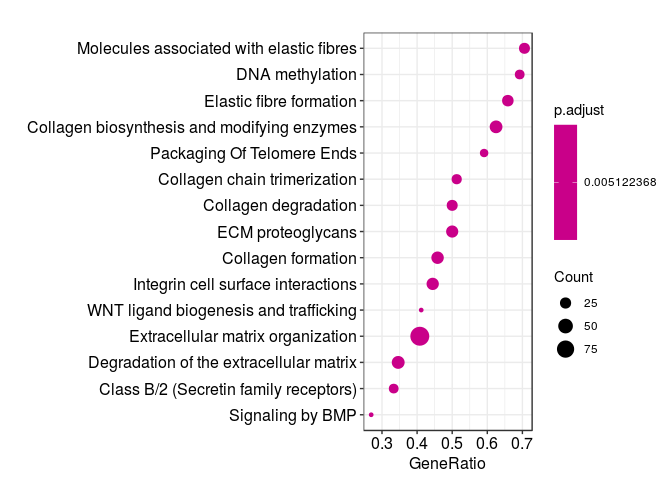

Pathway enrichment analysis
================
German Novakovskiy
August 17, 2018

Pathway enrichment analysis of individual definitive endoderm differentiation experiments (from GEO) and LINS data

Analysis of pathways
--------------------

All pathways from KEGG/REACTOME for analysis with ErmineR should be dowloaded from here (<http://www.broadinstitute.org/gsea/msigdb/collections.jsp#C2>) in gmt format.

### Analysis of REACTOME pathways

Reading data from file:

``` r
x <- scan("~/ESC_RNA_seq/pathway_enrichment_analysis/ReactomePathways.tsv", what = "", sep = "\n")
x <- strsplit(x, "[ \t]+")
max.col <- max(sapply(x, length))

## specify col.names as ?read.table suggests
cn <- paste("V", 1:max.col, sep = "")
reactome_pathways <- read.table("~/ESC_RNA_seq/pathway_enrichment_analysis/ReactomePathways.tsv", fill = TRUE, 
                 col.names = cn, sep = '\t', quote = "")

reactome_pathways[1:5, 1:10] %>% kable()
```

| V1            | V2                                                              | V3     | V4      | V5     | V6     | V7     | V8      | V9     | V10    |
|:--------------|:----------------------------------------------------------------|:-------|:--------|:-------|:-------|:-------|:--------|:-------|:-------|
| R-HSA-164843  | 2-LTR circle formation                                          | BANF1  | HMGA1   | LIG4   | PSIP1  | XRCC4  | XRCC5   | XRCC6  | gag    |
| R-HSA-73843   | 5-Phosphoribose 1-diphosphate biosynthesis                      | PRPS1  | PRPS1L1 | PRPS2  |        |        |         |        |        |
| R-HSA-1971475 | A tetrasaccharide linker sequence is required for GAG synthesis | AGRN   | B3GALT6 | B3GAT1 | B3GAT2 | B3GAT3 | B4GALT7 | BCAN   | BGN    |
| R-HSA-5619084 | ABC transporter disorders                                       | ABCC8  | CFTR    | DERL1  | DERL2  | DERL3  | ERLEC1  | ERLIN1 | ERLIN2 |
| R-HSA-1369062 | ABC transporters in lipid homeostasis                           | ABCA10 | ABCA12  | ABCA2  | ABCA3  | ABCA5  | ABCA6   | ABCA7  | ABCA9  |

There are 2029 pathways in total.

Distribution of counts of genes in each pathway for REACTOME:

``` r
calculateSize <- function(row_of_df){
  x <- row_of_df[3:length(row_of_df)]
  x <- x[!is.na(x)]
  return(sum(x != ""))
}

sizes_of_pathways <- apply(reactome_pathways, 1, calculateSize)

hist(sizes_of_pathways, breaks = 50, col = "red")
```


Sorting pathways by size:

``` r
pathways_amount <- as.data.frame(reactome_pathways[,2])
colnames(pathways_amount) <- "Pathway"
pathways_amount$Size <- sizes_of_pathways

pathways_amount <- pathways_amount %>%
  arrange(desc(Size))
```

We see that are the largest pathways are very broad:

``` r
head(pathways_amount, n = 10) %>% kable()
```

| Pathway                                 |  Size|
|:----------------------------------------|-----:|
| Signal Transduction                     |  2623|
| Metabolism of proteins                  |  2064|
| Immune System                           |  2047|
| Metabolism                              |  2013|
| Post-translational protein modification |  1398|
| Gene expression (Transcription)         |  1376|
| RNA Polymerase II Transcription         |  1240|
| Signaling by GPCR                       |  1162|
| Innate Immune System                    |  1114|
| Generic Transcription Pathway           |  1112|

However, the smallest pathways contain just one gene:

``` r
tail(pathways_amount, n = 10) %>% kable()
```

|      | Pathway                                                         |  Size|
|------|:----------------------------------------------------------------|-----:|
| 2020 | Synthesis of CL                                                 |     1|
| 2021 | Synthesis of Hepoxilins (HX) and Trioxilins (TrX)               |     1|
| 2022 | Synthesis of IPs in the ER lumen                                |     1|
| 2023 | TLR3 deficiency - HSE                                           |     1|
| 2024 | TWIK-related spinal cord K+ channel (TRESK)                     |     1|
| 2025 | Tandem pore domain halothane-inhibited K+ channel (THIK)        |     1|
| 2026 | UNC93B1 deficiency - HSE                                        |     1|
| 2027 | Vitamin E                                                       |     1|
| 2028 | WNT ligand secretion is abrogated by the PORCN inhibitor LGK974 |     1|
| 2029 | t(4;14) translocations of FGFR3                                 |     1|

In our enrichment analysis we will consider only pathways that contain at least 15 genes and no more than 300 genes:

``` r
selected_pathways <- pathways_amount %>% 
  filter(Size >= 15 & Size <= 300)
```

There are 1070 of such pathways.

Analysis of GEO individual experiments
--------------------------------------

### Analysis of GSE109658

Load DE data:

``` r
load("../analysis_of_public_data/GSE109658/DEgenes_0h_96h_109658.Rdata")
```

Sorted log Fold Changes give us a sorted list:

``` r
ermineInputGeneScores <- DEgenes_0h_96h_109658 %>% 
  rownames_to_column("gene") %>%
  dplyr::select(gene, logFC) %>% 
  na.omit() %>% 
  as.data.frame() %>% 
  arrange(desc(logFC)) %>% 
  column_to_rownames("gene")

save(ermineInputGeneScores, file = "ermineInputScores.Rdata")
head(ermineInputGeneScores, 10) %>% kable() # print the first few rows
```

|           |     logFC|
|-----------|---------:|
| KLHL6     |  9.508121|
| HOXB6     |  9.093383|
| GRP       |  9.070627|
| NPPB      |  8.925313|
| OVCH2     |  8.885852|
| CASQ2     |  8.842371|
| MIR1247   |  8.714118|
| HP        |  8.629687|
| MYL4      |  8.566040|
| LINC00479 |  8.561000|

``` r
#enrichmentResult <- precRecall(scores = ermineInputGeneScores, 
#                               scoreColumn = 1, # column 1 is the scores 
#                               bigIsBetter = TRUE, # larger logFC should be ranked higher
#                               annotation = "Generic_human_custom", 
#                               aspects = "B", # look at only biological processes 
#                               iterations = 10000, # 10K sampling iterations so that results are stable
#                               geneSetDescription = "GO.xml",
#                               customGeneSets = "ReactomePathways.tsv",
#                               minClassSize = 15,
#                               maxClassSize = 300) 

#enrichmentResult$results %>% arrange(MFPvalue) %>% head(10) %>% kable()
```

While ErmineR is being fixed I will try GSEA for Reactome with specified bioconductor package: ReactomePA

``` r
#converting symbols to EntrezID
geneSymbols <- rownames(ermineInputGeneScores)
geneEntrez <- bitr(geneSymbols, fromType="SYMBOL", toType="ENTREZID", OrgDb="org.Hs.eg.db")
```

    ## 'select()' returned 1:many mapping between keys and columns

    ## Warning in bitr(geneSymbols, fromType = "SYMBOL", toType = "ENTREZID",
    ## OrgDb = "org.Hs.eg.db"): 8.91% of input gene IDs are fail to map...

``` r
head(geneEntrez)
```

    ##   SYMBOL ENTREZID
    ## 1  KLHL6    89857
    ## 2  HOXB6     3216
    ## 3    GRP     2922
    ## 4   NPPB     4879
    ## 5  OVCH2   341277
    ## 6  CASQ2      845

``` r
ermineInputGeneScoresRPA <- ermineInputGeneScores %>%
  rownames_to_column("SYMBOL") %>%
  filter(SYMBOL %in% geneEntrez$SYMBOL)

inputGSEA <- merge(ermineInputGeneScoresRPA, geneEntrez, sort=FALSE)

inputGSEA <- inputGSEA %>%
  dplyr::select(logFC, ENTREZID) %>%
  column_to_rownames('ENTREZID')
```

Performing GSEA with the input:

``` r
test2 <- inputGSEA$logFC
names(test2) <- rownames(inputGSEA)

y <- gsePathway(test2, nPerm=10000,
                pvalueCutoff=0.05,
                pAdjustMethod="BH", verbose=FALSE, minGSSize = 15, maxGSSize = 300)

dotplot(y, showCategory=15)
```


