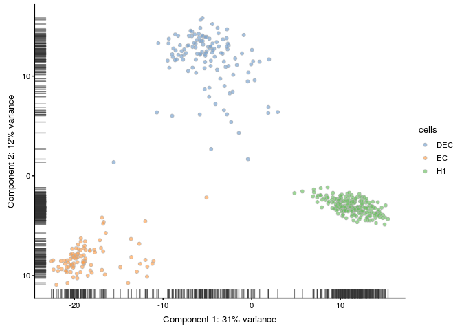

Single Cell RNA-seq analysis
================
German Novakovskiy
September 10, 2018

Analysis of GSE75748 single cell type expression
------------------------------------------------

Here we analyze differentiation of H1 human embryonic stem cells using [scdiff](https://github.com/phoenixding/scdiff). We will look right now into two branches only - definitive endoderm (DECs) and mesoderm (ECs). We aim to find transcription factors that play an essential role in DE differentiation, and link relevant pathways to them.

Progenitors differentiated from human ES cells included neuronal progenitor cells (NPCs, ectoderm derivatives, n = 173), DE cells (endoderm derivatives, n = 138), endothelial cells (ECs, mesoderm derivatives, n = 105), and trophoblast-like cells (TBs, extraembryonic derivatives, n = 69). Single undifferentiated H1 (n = 212) and H9 (n = 162) human ES cells and human foreskin fibroblasts (HFFs, n = 159) were also included as controls. Overall 1018 cells.

Procedures are following by [this tutorial](https://hemberg-lab.github.io/scRNA.seq.course/tabula-muris.html).

Load matrix with data (Gene expected counts were calculated using RSEM 1.2.3):

``` r
dat <- read.delim("GSE75748_sc_cell_type_ec.csv", sep=",", header=TRUE)

#first column is gene names
rownames(dat) <- dat[,1]
dat <- dat[,-1]

dim(dat)
```

    ## [1] 19097  1018

Makes sense, we have 1018 cells overall. But we are interested in H1, mesoderm (EC) and endoderm (DEC).

``` r
#finding appropriate cells
x <- colnames(dat)

#H1 cells (should be 212)
res <- sapply(x, function(x) { return(startsWith(x, "H1_")) })
H1_cells <- dat %>% as.data.frame() %>% dplyr::select(x[res])
dim(H1_cells)
```

    ## [1] 19097   212

``` r
#DE cells (should be 138)
res <- sapply(x, function(x) { return(startsWith(x, "DEC_")) })
DEC_cells <- dat %>% as.data.frame() %>% dplyr::select(x[res])
dim(DEC_cells)
```

    ## [1] 19097   138

``` r
#EC cells (should be 105)
res <- sapply(x, function(x) { return(startsWith(x, "EC_")) })
EC_cells <- dat %>% as.data.frame() %>% dplyr::select(x[res])
dim(EC_cells)
```

    ## [1] 19097   105

``` r
dat <- cbind(H1_cells, DEC_cells, EC_cells)
dim(dat)
```

    ## [1] 19097   455

Continue to analyze this data:

``` r
cellIDs <- colnames(dat)

cell_info <- stringr::str_split_fixed(cellIDs, "_", 2)
exp_info <- stringr::str_split_fixed(cell_info[,2], "\\.", 2)
cell_info <- cbind(cellIDs, cell_info[,1], exp_info)

rownames(cell_info) <- cell_info[,1]
cell_info <- cell_info[,-1]

colnames(cell_info) <- c("cells", "experiment", "number")
```

Experimentig with SingleCellExperiment class:

``` r
sceset <- SingleCellExperiment(assays = list(counts = as.matrix(dat)), colData=cell_info)
```

Remove genes that are not expressed in any cell:

``` r
keep_feature <- rowSums(counts(sceset) > 0) > 0
sceset <- sceset[keep_feature, ]
dim(sceset)
```

    ## [1] 17822   455

Check the library size as well:

``` r
umi <- calculateQCMetrics(sceset)

hist(
    umi$total_counts,
    breaks = 100
)
abline(v = 25000, col = "red")
```

 Looks like that majority of cells have relatively big number of sequenced reads.

In addition to ensuring sufficient sequencing depth for each sample, we also want to make sure that the reads are distributed across the transcriptome. Thus, we count the total number of unique genes detected in each sample.

``` r
hist(
    umi$total_features,
    breaks = 100
)
abline(v = 7000, col = "red")
```


we conclude that most cells have between 7,000-11,000 detected genes (majority of cells have around 10,000-11,000 genes covered), which is normal for high-depth scRNA-seq.

``` r
#keep_feature <- rowSums(counts(sceset) > 0) > 0
#sceset <- sceset[keep_feature, ]
umi$use <-  umi$total_features > 7000
table(umi$use)
```

    ## 
    ## FALSE  TRUE 
    ##     2   453

In addition to removing cells with poor quality, it is usually a good idea to exclude genes where we suspect that technical artefacts may have skewed the results. Moreover, inspection of the gene expression profiles may provide insights about how the experimental procedures could be improved.

It is often instructive to consider the number of reads consumed by the top 50 expressed genes.

``` r
plotQC(umi, type = "highest-expression")
```

 The distributions are relatively flat indicating (but not guaranteeing!) good coverage of the full transcriptome of these cells.

It is typically a good idea to remove genes whose expression level is considered “undetectable”. We define a gene as detectable if at least two cells contain more than 1 transcript from the gene. We go with the threshold - at least 10 reads (for 2 cells).

``` r
filter_genes <- apply(
    counts(umi[ , colData(umi)$use]), 
    1, 
    function(x) length(x[x > 10]) >= 2
)
rowData(umi)$use <- filter_genes

table(filter_genes)
```

    ## filter_genes
    ## FALSE  TRUE 
    ##  1613 16209

``` r
dim(umi[rowData(umi)$use, colData(umi)$use])
```

    ## [1] 16209   453

``` r
assay(umi, "logcounts_raw") <- log2(counts(umi) + 1)

#umi.qc <- umi[rowData(umi)$use, colData(umi)$use]
endog_genes <- rowData(umi)$use

#assay(umi, "logcounts_raw") <- log2(counts(umi) + 1)
#saveRDS(umi, file = "umi.rds") #save file
```

Detecting outliers with PCA:

``` r
umi_out <- plotPCA(
    umi,
    shape_by = "cells",
    pca_data_input = "pdata",
    detect_outliers = TRUE,
    return_SCE = TRUE
)
```


``` r
table(umi_out$outlier)
```

    ## 
    ## FALSE  TRUE 
    ##   430    25

``` r
#removing outliers
#umi.qc <- umi.qc[, !umi.qc$outlier]
#dim(umi.qc)
not_outlier_cells <- !colData(umi_out)$outlier
```

``` r
umi.qc <- umi[endog_genes, not_outlier_cells]
#saveRDS(umi.qc, file = "umi.qc.rds") #save file
dim(umi.qc)
```

    ## [1] 16209   430

The PCA plot:

``` r
#LAPACK issue
plotPCA(
    umi.qc,
    exprs_values = "logcounts_raw",
    colour_by = "cells"
)
```



The tSNE plot:

``` r
plotTSNE(
    umi.qc,
    exprs_values = "logcounts_raw",
    perplexity = 130,
    colour_by = "cells",
    rand_seed = 123456
)
```


Now let's perform "Normalisation for gene/transcript length". We compute the total gene length in Kilobases by using the end\_position and start\_position fields:

``` r
umi.qc <- getBMFeatureAnnos(
    umi.qc,
    filters = "hgnc_symbol", 
    attributes = c(
        "ensembl_gene_id",
        "hgnc_symbol",
        "chromosome_name",
        "start_position",
        "end_position"
    ), 
    feature_symbol = "hgnc_symbol",
    feature_id = "ensembl_gene_id",
    biomart = "ENSEMBL_MART_ENSEMBL", 
    dataset = "hsapiens_gene_ensembl",
    host = "www.ensembl.org"
)

eff_length <- 
    abs(rowData(umi.qc)$end_position - rowData(umi.qc)$start_position) / 1000

tpm(umi.qc) <- log2(calculateTPM(umi.qc, eff_length) + 1)
#save(umi.qc, file = "umi.qc.Rdata")
```

``` r
#fpkm(umi.qc) <- log2(calculateFPKM(umi.qc, eff_length) + 1)
```

Since now we did filtering for quality of genes, cells, we did tpm normalization, we can use it for scdiff running!

Exploring example input file for scdiff tool:

``` r
example <- read.table("example.txt", header = TRUE, sep = "\t")
example <- t(example)
example[1:10,1:10] %>% kable()
```

|                |             |             |             |             |             |             |             |             |             |             |
|:---------------|:------------|:------------|:------------|:------------|:------------|:------------|:------------|:------------|:------------|:------------|
| Dataset        | E14\_1\_C44 | E14\_1\_C68 | E14\_1\_C84 | E14\_1\_C70 | E14\_1\_C90 | E14\_1\_C01 | E14\_1\_C25 | E14\_1\_C51 | E14\_1\_C10 | E14\_1\_C06 |
| time           | 14          | 14          | 14          | 14          | 14          | 14          | 14          | 14          | 14          | 14          |
| Label          | NA          | NA          | NA          | NA          | NA          | NA          | NA          | NA          | NA          | NA          |
| X0610007C21Rik | 6.3605100   | 2.7840558   | 4.9894615   | 3.9838418   | 0.4821255   | 0.0000000   | 8.3374301   | 5.9289648   | 0.0000000   | 5.6500953   |
| X0610007L01Rik | 5.58661164  | 0.00000000  | 0.00000000  | 0.00000000  | 6.21698637  | 0.00000000  | 0.00000000  | 2.39186943  | 5.02053776  | 4.58549139  |
| X0610007N19Rik | 0.0000000   | 1.3389834   | 2.9792059   | 2.2850974   | 6.4549441   | 0.0000000   | 4.4550576   | 0.0000000   | 6.1609303   | 6.4012482   |
| X0610007P08Rik | 0.0000000   | 0.0000000   | 0.0000000   | 0.0000000   | 0.0000000   | 0.0000000   | 0.0000000   | 0.0000000   | 0.0000000   | 4.0134444   |
| X0610007P14Rik | 6.7921786   | 0.0000000   | 6.1161797   | 6.1129294   | 4.5304266   | 5.6288844   | 7.5050334   | 1.3316995   | 3.5223948   | 5.4322345   |
| X0610007P22Rik | 0.0000000   | 0.0000000   | 0.0000000   | 0.0000000   | 0.0000000   | 0.0000000   | 0.0000000   | 0.0000000   | 0.0000000   | 1.9214325   |
| X0610009B14Rik | 0.000000    | 0.000000    | 0.000000    | 0.000000    | 0.000000    | 0.000000    | 0.000000    | 0.000000    | 4.313739    | 0.000000    |

Now let's construct our own example for scdiff

``` r
#add time column to cell_info -> differentiation was for 5 days.
cell_info <- as.data.frame(cell_info, row.names = rownames(cell_info))
cell_info$time <- rep(0, nrow(cell_info))

cell_info$time[grepl("^DEC", cell_info$cells)] <- 5
cell_info$time[grepl("^EC", cell_info$cells)] <- 5

my_data <- tpm(umi.qc) %>% as.data.frame()
dim(my_data)
```

    ## [1] 16209   430

``` r
#my_data <- t(my_data)
#dim(my_data)
```

``` r
#remove bad cells
cell_info <- cell_info[colnames(my_data),]

add_to_my_data <- data.frame(Dataset = colnames(my_data), time = cell_info$time, 
                             Label = cell_info$cells)

my_data <- t(my_data)

my_data <- cbind(add_to_my_data, my_data)
rownames(my_data) <- NULL
dim(my_data)
```

    ## [1]   430 16212

``` r
#save(my_data, file = "my_data.Rdata")
#write.table(my_data, file = "my_data.txt", sep = "\t", row.names = FALSE, quote = FALSE)
```
